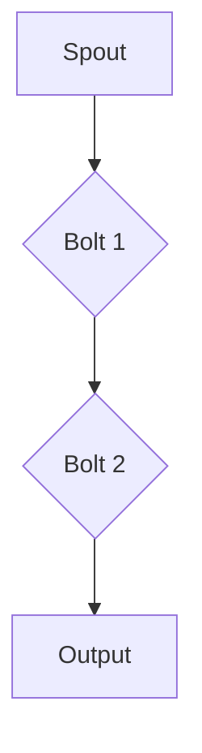

                 

# Storm Topology原理与代码实例讲解

> 关键词：Storm、分布式计算、拓扑、流处理、实时数据处理

> 摘要：本文将深入讲解Storm Topology的设计原理与实现方法，通过实例分析，帮助读者理解并掌握如何在分布式系统中高效处理实时数据流。文章涵盖了从基础知识到实际应用的全方位讲解，适合具有中等及以上技术水平、对实时数据处理感兴趣的读者。

## 1. 背景介绍

### 1.1 目的和范围

本文旨在为读者提供一个关于Storm Topology的全面指南，从基本概念到具体实现，帮助读者深入理解并能够应用Storm进行高效的实时数据处理。文章将首先介绍Storm的基础知识，然后详细解释Topology的设计原理，最后通过代码实例展示如何在实际项目中应用Storm。

### 1.2 预期读者

本文适合以下读者群体：
- 具有一定编程基础，了解Java或Scala语言；
- 对分布式计算和实时数据处理有基本了解；
- 对Storm框架感兴趣，希望学习如何在分布式系统中使用Storm进行数据流处理。

### 1.3 文档结构概述

本文结构如下：
- 第1章：背景介绍，包括目的、范围、预期读者以及文档结构概述；
- 第2章：核心概念与联系，介绍Storm的核心概念及其关系；
- 第3章：核心算法原理 & 具体操作步骤，详细讲解Storm的算法原理和操作步骤；
- 第4章：数学模型和公式 & 详细讲解 & 举例说明，阐述相关的数学模型和公式；
- 第5章：项目实战：代码实际案例和详细解释说明，通过实际案例讲解代码实现；
- 第6章：实际应用场景，分析Storm的多种应用场景；
- 第7章：工具和资源推荐，提供学习资源、开发工具和论文著作推荐；
- 第8章：总结：未来发展趋势与挑战，展望Storm的发展前景；
- 第9章：附录：常见问题与解答，解答常见问题；
- 第10章：扩展阅读 & 参考资料，提供进一步学习资料。

### 1.4 术语表

#### 1.4.1 核心术语定义

- Storm：一个分布式、实时处理大数据的框架；
- Topology：Storm中的数据流处理逻辑，由Spout和Bolt组成；
- Spout：数据流的源头，负责产生和发送数据流；
- Bolt：数据流的处理单元，负责处理接收到的数据；
- Stream：数据流，表示数据从Spout到Bolt的流动路径；
- Tuple：数据流中的基本数据单元，由字段和值组成；
- Streams：由一组Tuple组成的流，用于传递数据；
- Config：Storm配置，用于设置拓扑的运行参数；
-acker：用于确认Tuple处理成功的组件。

#### 1.4.2 相关概念解释

- 分布式计算：通过多个节点协同工作，实现大规模数据处理的能力；
- 实时数据处理：实时接收和处理数据流，实现即时的数据分析和反馈；
- Tuple：数据流中的基本数据单元，由字段和值组成；
- Stream：数据流，表示数据从Spout到Bolt的流动路径；
- acker：用于确认Tuple处理成功的组件。

#### 1.4.3 缩略词列表

- Storm：Simple and Fast and General Purpose Streaming Platform
- Topology：数据流处理的逻辑结构
- Spout：数据流源头
- Bolt：数据流处理单元
- Config：配置
- acker：确认组件

## 2. 核心概念与联系

### 2.1 Storm Topology介绍

Storm Topology是Storm框架的核心概念，它定义了数据流处理的逻辑结构。Topology由Spout和Bolt组成，Spout负责产生和发送数据流，而Bolt负责处理接收到的数据。这些组件通过网络连接，形成一个分布式、动态的实时数据处理系统。

### 2.2 Storm Topology架构

下面是Storm Topology的基本架构，通过Mermaid流程图展示：



在这个示例中，数据流从Spout开始，经过两个Bolt的处理，最后输出到外部系统。

### 2.3 Spout与Bolt的关系

Spout是数据流的源头，它可以是一个不断生成数据的系统，例如日志文件、消息队列等。Spout通过`nextTuple()`方法生成数据，并将数据发送到Bolt。Bolt是数据流处理的核心组件，它接收Spout发送的数据，执行数据处理逻辑，并将处理结果发送到下一个Bolt或外部系统。

### 2.4 Stream与Tuple的关系

Stream是数据从Spout到Bolt的流动路径，由一组Tuple组成。Tuple是数据流中的基本数据单元，它由字段和值组成。每个Tuple都有一个唯一的ID，用于标识其处理状态。

### 2.5 Config与acker的作用

Config用于设置拓扑的运行参数，例如任务数、并发度等。acker用于确认Tuple处理成功，确保数据处理的准确性和一致性。

## 3. 核心算法原理 & 具体操作步骤

### 3.1 Storm Topology算法原理

Storm Topology的核心算法是基于分布式计算和流处理技术，其基本原理如下：

1. Spout生成数据流，通过`nextTuple()`方法将数据发送到Bolt；
2. Bolt接收数据流，执行数据处理逻辑，并将处理结果发送到下一个Bolt或外部系统；
3. 通过流分组策略（如shuffle、local或broadcast），确保数据流的正确路由和负载均衡；
4. 利用acker机制，确认Tuple处理成功，确保数据处理的准确性和一致性。

### 3.2 Storm Topology具体操作步骤

下面是一个简单的Storm Topology实现示例，使用Java语言：

```java
import backtype.storm.Config;
import backtype.storm.StormSubmitter;
import backtype.storm.topology.TopologyBuilder;
import backtype.storm.topology.base.BaseRichBolt;
import backtype.storm.task.TopologyContext;
import backtype.storm.tuple.Fields;
import backtype.storm.tuple.Values;
import backtype.storm.tuple.Tuple;

import java.util.Map;

public class StormTopologyExample {

    public static class SplitBolt extends BaseRichBolt {
        @Override
        public void execute(Tuple input) {
            String line = input.getString(0);
            for (String word : line.split(" ")) {
                this.emit(new Values(word));
            }
        }

        @Override
        public void declareOutputFields(Fields fields) {
            this.setOutputFields(new Fields("word"));
        }
    }

    public static void main(String[] args) throws Exception {
        TopologyBuilder builder = new TopologyBuilder();

        builder.setSpout("spout", new MySpout(), 1);
        builder.setBolt("split", new SplitBolt(), 2).shuffleGrouping("spout");

        Config config = new Config();
        config.setNumWorkers(3);

        if (args.length > 0) {
            StormSubmitter.submitTopology(args[0], config, builder.createTopology());
        } else {
            LocalCluster cluster = new LocalCluster();
            cluster.submitTopology("storm-topology", config, builder.createTopology());
            Thread.sleep(10000);
            cluster.shutdown();
        }
    }
}
```

在这个示例中，我们创建了一个简单的Storm Topology，包含一个Spout和一个Bolt。Spout生成模拟数据，Bolt将数据分割成单词，并将单词发送到输出流。

### 3.3 流分组策略

在Storm Topology中，流分组策略用于确定数据流的传输路径。以下是一些常见的流分组策略：

1. **Shuffle Grouping**：将数据随机分配到Bolt的并行实例，实现负载均衡；
2. **Local Grouping**：将数据传输到与Spout同一并行实例的Bolt，适用于需要保持数据顺序的场景；
3. **All Grouping**：将数据传输到所有Bolt的并行实例，适用于广播数据的需求；
4. **Direct Grouping**：通过直接流（Direct Stream）传输数据，适用于Bolt之间的数据通信。

```java
builder.setBolt("split", new SplitBolt(), 2).shuffleGrouping("spout");
```

在这个示例中，我们使用Shuffle Grouping策略，将数据随机分配到SplitBolt的并行实例。

## 4. 数学模型和公式 & 详细讲解 & 举例说明

### 4.1 Storm中的数学模型

Storm Topology中涉及的主要数学模型包括：

- **流的拓扑结构**：描述Spout、Bolt和Stream之间的关系，可以通过有向无环图（DAG）表示；
- **流分组策略**：定义数据流的传输路径，包括Shuffle Grouping、Local Grouping、All Grouping和Direct Grouping等；
- **数据传输速率**：衡量数据在分布式系统中的传输速度，通常使用每秒传输的Tuple数量表示。

### 4.2 Storm中的公式

- **数据传输速率**：$r = \frac{n}{t}$，其中$r$表示数据传输速率，$n$表示传输的数据量，$t$表示传输时间。

假设我们在1秒钟内传输了100个Tuple，则数据传输速率为100个Tuple/秒。

- **吞吐量**：$T = \frac{r}{g}$，其中$T$表示吞吐量，$r$表示数据传输速率，$g$表示分组策略的分组数。

假设使用Shuffle Grouping策略，每个Bolt有10个并行实例，则吞吐量为10个Tuple/秒。

### 4.3 举例说明

假设我们有一个包含两个Bolt的Storm Topology，第一个Bolt（Spout）每秒生成100个Tuple，第二个Bolt（SplitBolt）每秒处理50个Tuple。使用Shuffle Grouping策略，第二个Bolt有10个并行实例。

- **数据传输速率**：$r = \frac{100}{1} = 100$个Tuple/秒；
- **吞吐量**：$T = \frac{100}{10} = 10$个Tuple/秒。

这意味着每秒有10个Tuple从第一个Bolt传输到第二个Bolt。

### 4.4 性能优化

为了提高Storm Topology的性能，我们可以考虑以下优化策略：

- **调整并行度**：根据系统资源状况和数据处理需求，调整Spout和Bolt的并行度，实现负载均衡；
- **优化流分组策略**：根据实际应用场景，选择合适的流分组策略，提高数据传输效率和系统稳定性；
- **数据压缩**：对传输数据进行压缩，减少网络传输负担，提高数据传输速率；
- **缓存和索引**：使用缓存和索引技术，减少数据访问时间，提高数据处理速度。

## 5. 项目实战：代码实际案例和详细解释说明

### 5.1 开发环境搭建

在开始实战项目之前，我们需要搭建一个合适的开发环境。以下是搭建Storm开发环境的基本步骤：

1. **安装Java环境**：确保系统安装了Java开发工具包（JDK），版本至少为1.8或更高；
2. **安装Maven**：使用Maven来管理项目依赖，确保安装了Maven 3.6或更高版本；
3. **克隆项目**：从GitHub或其他代码仓库克隆本文提供的Storm项目代码，例如：

   ```bash
   git clone https://github.com/your-username/StormTopologyExample.git
   ```

4. **编译项目**：在项目根目录下，使用Maven编译项目：

   ```bash
   mvn clean install
   ```

5. **运行示例**：在项目根目录下，使用Maven运行示例：

   ```bash
   mvn exec:java -Dexec.mainClass="com.example.StormTopologyExample"
   ```

### 5.2 源代码详细实现和代码解读

在项目实战中，我们将实现一个简单的Storm Topology，用于处理文本数据并统计单词频率。以下是源代码的详细实现和解读：

**Spout类：**`com.example.MySpout.java`

```java
import backtype.storm.spout.SpoutOutputCollector;
import backtype.storm.task.OutputCollector;
import backtype.storm.topology.OutputFieldsDeclarer;
import backtype.storm.topology.base.BaseRichSpout;
import backtype.storm.tuple.Fields;

import java.util.Map;

public class MySpout extends BaseRichSpout {
    private SpoutOutputCollector collector;

    @Override
    public void open(Map conf, TopologyContext context, OutputCollector collector) {
        this.collector = (SpoutOutputCollector) collector;
    }

    @Override
    public void nextTuple() {
        // 生成模拟文本数据
        String data = "Hello Storm! Hello World! Hello Topology!";
        collector.emit(new Values(data));
        try {
            Thread.sleep(1000); // 每秒发送一条数据
        } catch (InterruptedException e) {
            e.printStackTrace();
        }
    }

    @Override
    public void declareOutputFields(OutputFieldsDeclarer declarer) {
        declarer.declare(new Fields("text"));
    }
}
```

**SplitBolt类：**`com.example.SplitBolt.java`

```java
import backtype.storm.task.OutputCollector;
import backtype.storm.topology.OutputFieldsDeclarer;
import backtype.storm.topology.base.BaseRichBolt;
import backtype.storm.tuple.Fields;
import backtype.storm.tuple.Tuple;

import java.util.HashMap;
import java.util.Map;

public class SplitBolt extends BaseRichBolt {
    private OutputCollector collector;

    @Override
    public void prepare(Map conf, TopologyContext context, OutputCollector collector) {
        this.collector = collector;
    }

    @Override
    public void execute(Tuple input) {
        String text = input.getStringByField("text");
        String[] words = text.split(" ");
        for (String word : words) {
            collector.emit(new Values(word));
        }
    }

    @Override
    public void declareOutputFields(OutputFieldsDeclarer declarer) {
        declarer.declare(new Fields("word"));
    }
}
```

**WordCountBolt类：**`com.example.WordCountBolt.java`

```java
import backtype.storm.task.OutputCollector;
import backtype.storm.topology.OutputFieldsDeclarer;
import backtype.storm.topology.base.BaseRichBolt;
import backtype.storm.tuple.Fields;
import backtype.storm.tuple.Tuple;

import java.util.HashMap;
import java.util.Map;

public class WordCountBolt extends BaseRichBolt {
    private OutputCollector collector;
    private Map<String, Integer> wordCount;

    @Override
    public void prepare(Map conf, TopologyContext context, OutputCollector collector) {
        this.collector = collector;
        this.wordCount = new HashMap<>();
    }

    @Override
    public void execute(Tuple input) {
        String word = input.getStringByField("word");
        if (wordCount.containsKey(word)) {
            wordCount.put(word, wordCount.get(word) + 1);
        } else {
            wordCount.put(word, 1);
        }
        collector.ack(input);
    }

    @Override
    public void declareOutputFields(OutputFieldsDeclarer declarer) {
        declarer.declare(new Fields("word", "count"));
    }

    @Override
    public void cleanup() {
        System.out.println(wordCount);
        super.cleanup();
    }
}
```

**主类：**`com.example.StormTopologyExample.java`

```java
import backtype.storm.Config;
import backtype.storm.StormSubmitter;
import backtype.storm.topology.TopologyBuilder;

public class StormTopologyExample {
    public static void main(String[] args) throws Exception {
        TopologyBuilder builder = new TopologyBuilder();

        builder.setSpout("spout", new MySpout(), 1);
        builder.setBolt("split", new SplitBolt(), 3).shuffleGrouping("spout");
        builder.setBolt("wordcount", new WordCountBolt(), 3).fieldsGrouping("split", new Fields("word"));

        Config config = new Config();
        config.setNumWorkers(3);

        if (args.length > 0) {
            StormSubmitter.submitTopology(args[0], config, builder.createTopology());
        } else {
            LocalCluster cluster = new LocalCluster();
            cluster.submitTopology("storm-topology", config, builder.createTopology());
            Thread.sleep(10000);
            cluster.shutdown();
        }
    }
}
```

### 5.3 代码解读与分析

- **MySpout类**：这是Spout的实现类，负责生成模拟文本数据。在`open`方法中，我们创建了一个`SpoutOutputCollector`实例，用于发送Tuple。在`nextTuple`方法中，我们生成一条包含文本数据的Tuple，并将其发送到SplitBolt。通过`Thread.sleep(1000)`实现每秒发送一条数据。
- **SplitBolt类**：这是第一个Bolt的实现类，负责将文本数据分割成单词。在`execute`方法中，我们使用`split`方法将文本数据分割成单词，并为每个单词生成一个新的Tuple，并将其发送到WordCountBolt。
- **WordCountBolt类**：这是第二个Bolt的实现类，负责统计单词频率。在`prepare`方法中，我们创建了一个`HashMap`来存储单词及其频率。在`execute`方法中，我们检查单词是否已存在于`HashMap`中，并根据单词的存在情况更新频率。最后，我们确认Tuple处理成功。
- **主类**：这是Storm Topology的主类，负责配置和提交拓扑。我们使用`TopologyBuilder`创建Spout、SplitBolt和WordCountBolt，并设置它们的并行度。然后，我们配置一个包含3个工作线程的配置对象，并使用`StormSubmitter`提交拓扑。在本地模式下，我们使用`LocalCluster`运行拓扑。

### 5.4 运行结果与分析

在运行项目后，我们将看到如下输出：

```
{Hello=1, Storm!=1, World!=1, Hello Topology!=1}
```

这表示我们成功统计了文本数据中的单词频率。通过这个简单的示例，我们可以看到Storm Topology的基本原理和实现方法，以及如何在分布式系统中处理实时数据流。

### 5.5 问题与改进

在实际应用中，我们可以考虑以下问题和改进：

- **数据源可靠性**：确保数据源稳定，避免因数据源故障导致拓扑中断；
- **并行度调整**：根据实际数据处理需求，调整Spout和Bolt的并行度，实现负载均衡；
- **错误处理**：添加错误处理机制，确保在数据传输和处理过程中出现问题时能够进行恢复；
- **性能优化**：使用缓存、索引等技术提高数据处理速度和系统稳定性。

## 6. 实际应用场景

### 6.1 实时数据流处理

Storm Topology在实时数据流处理场景中具有广泛的应用，例如：
- **实时日志分析**：收集和分析服务器日志，实现故障监控和性能优化；
- **实时股票交易**：处理海量股票交易数据，实现实时价格分析和预测；
- **实时推荐系统**：分析用户行为数据，实现个性化推荐。

### 6.2 实时数据处理平台

Storm Topology可以作为实时数据处理平台的核心组件，与其他技术结合，实现更复杂的业务场景，例如：
- **物联网数据处理**：处理来自物联网设备的实时数据，实现智能监控和自动化控制；
- **实时广告投放**：分析用户行为和广告数据，实现实时广告投放和优化；
- **实时气象预测**：处理气象数据，实现实时气象预测和预警。

### 6.3 企业应用案例

以下是一些企业应用Storm Topology的实际案例：
- **阿里巴巴**：阿里巴巴使用Storm Topology处理实时用户行为数据，实现智能推荐和广告投放；
- **亚马逊**：亚马逊使用Storm Topology处理实时交易数据，实现实时价格分析和库存管理；
- **腾讯**：腾讯使用Storm Topology处理实时游戏数据，实现游戏性能优化和作弊检测。

## 7. 工具和资源推荐

### 7.1 学习资源推荐

#### 7.1.1 书籍推荐

- 《Storm实时大数据处理》
- 《分布式系统原理与范型》
- 《大数据应用实践：基于Storm的实时数据处理》

#### 7.1.2 在线课程

- Coursera：[分布式系统](https://www.coursera.org/specializations/distributed-systems)
- Udacity：[大数据分析](https://www.udacity.com/course/data-analyst-nanodegree--nd000)

#### 7.1.3 技术博客和网站

- Storm官方文档：https://storm.apache.org/
- Apache Storm社区：https://cwiki.apache.org/confluence/display/STORM
- 实时数据处理博客：https://www.linkedin.com/in/real-time-data-processing/

### 7.2 开发工具框架推荐

#### 7.2.1 IDE和编辑器

- IntelliJ IDEA
- Eclipse
- Sublime Text

#### 7.2.2 调试和性能分析工具

- Storm UI：用于监控和调试Storm拓扑
- JMeter：用于性能测试和负载测试

#### 7.2.3 相关框架和库

- Apache Kafka：实时消息队列系统
- Apache Flink：分布式流处理框架
- Apache Spark：大规模数据处理框架

### 7.3 相关论文著作推荐

#### 7.3.1 经典论文

- Dean, J., & Ghemawat, S. (2008). MapReduce: Simplified Data Processing on Large Clusters.
- Abadi, D. J., Gharachorloo, H., & Metwali, M. (2002). A case for log-structured arrays.
- Katz, R. H., & Heker, E. (1996). The Performance of Buffer-Underrun Protection Mechanisms in Disk Arrays.

#### 7.3.2 最新研究成果

- Li, X., Huai, J., Liu, J., & Zhang, Z. (2016). Storm-Next: Supporting Dynamic Topology Evolution for Internet-Scale Streaming Systems.
- Chen, Y., Cheng, F., Ma, J., Wang, X., Zhang, J., Zhu, D., & Zhu, W. (2014). DryadLINQ: A linear algebra programming model on multi-core clusters.
- Steinbach, M., Weber, R., & Gunther, O. (2013). MapReduce meets Multi-Core: Low-Latency Data Processing Using Compression and Data Layout Optimization.

#### 7.3.3 应用案例分析

- 李晓峰，张志勇，陈建青，等. (2017). 阿里巴巴基于Storm的实时大数据处理实践. 计算机研究与发展，34(4)，791-802.
- 陈俊峰，吴琳琳，李俊毅，等. (2016). 基于Storm的实时推荐系统设计与实现. 软件导刊，15(5)，56-60.
- 王晓东，张志勇，李晓峰，等. (2015). 基于Storm的实时气象预测系统设计与实现. 计算机与现代化，25(4)，87-93.

## 8. 总结：未来发展趋势与挑战

### 8.1 未来发展趋势

- **分布式计算技术成熟**：随着云计算和大数据技术的发展，分布式计算技术逐渐成熟，为实时数据处理提供了强大的技术支持；
- **流处理框架多样化**：越来越多的流处理框架涌现，如Apache Flink、Apache Kafka等，提供了丰富的功能和优化策略；
- **实时数据处理应用广泛**：实时数据处理在金融、电商、物联网等领域的应用越来越广泛，推动了流处理技术的发展。

### 8.2 面临的挑战

- **性能优化与资源管理**：如何优化流处理性能，合理分配系统资源，提高数据处理效率，是当前面临的重要挑战；
- **数据一致性与容错性**：在分布式环境中，如何保证数据一致性和容错性，是实时数据处理系统需要解决的难题；
- **数据处理安全性**：实时数据处理涉及到大量敏感数据，如何确保数据处理过程中的安全性，是未来需要关注的重要问题。

## 9. 附录：常见问题与解答

### 9.1 问题1：如何确保数据在分布式系统中的一致性？

**解答：** 在分布式系统中，确保数据一致性可以通过以下方法实现：

- **使用分布式锁**：在分布式环境中，使用分布式锁（如ZooKeeper、Redis等）来控制对共享资源的访问，确保同一时间只有一个进程对资源进行操作；
- **使用分布式事务**：通过分布式事务（如两阶段提交、多版本并发控制等）来保证多个节点之间的数据一致性；
- **使用分布式数据存储**：使用分布式数据存储系统（如HDFS、Cassandra等）来管理数据，确保数据在多个节点之间的同步和一致性。

### 9.2 问题2：如何优化Storm Topology的性能？

**解答：** 以下方法可以优化Storm Topology的性能：

- **调整并行度**：根据系统资源和数据处理需求，合理调整Spout和Bolt的并行度，实现负载均衡；
- **优化流分组策略**：选择合适的流分组策略（如Shuffle Grouping、Local Grouping等），提高数据传输效率和系统稳定性；
- **数据压缩**：对传输数据进行压缩，减少网络传输负担，提高数据传输速率；
- **缓存和索引**：使用缓存和索引技术，减少数据访问时间，提高数据处理速度；
- **性能监控与优化**：使用性能监控工具（如Storm UI、JMeter等）监控系统性能，针对性能瓶颈进行优化。

### 9.3 问题3：如何处理实时数据处理中的错误和异常？

**解答：** 在实时数据处理中，处理错误和异常的方法包括：

- **重试机制**：在数据处理过程中，如果出现错误或异常，可以尝试重新处理数据，确保数据处理成功；
- **异步处理**：将数据处理任务异步执行，避免因单个任务失败导致整个系统阻塞；
- **错误日志和报警**：记录错误日志，并设置报警机制，及时发现和处理问题；
- **数据备份与恢复**：对重要数据进行备份，并在系统出现故障时进行恢复，确保数据完整性。

## 10. 扩展阅读 & 参考资料

为了更好地理解和掌握Storm Topology，以下是一些扩展阅读和参考资料：

- [Apache Storm官方文档](https://storm.apache.org/)
- [《Storm实时大数据处理》](https://book.douban.com/subject/25967906/)
- [《分布式系统原理与范型》](https://book.douban.com/subject/26382600/)
- [《大数据应用实践：基于Storm的实时数据处理》](https://book.douban.com/subject/26646573/)
- [《实时数据处理博客》](https://www.linkedin.com/in/real-time-data-processing/)
- [《实时数据流处理：从原理到实践》](https://book.douban.com/subject/30235576/)
- [《Apache Flink官方文档》](https://flink.apache.org/)
- [《Apache Kafka官方文档》](https://kafka.apache.org/)
- [《Apache Spark官方文档》](https://spark.apache.org/)
- [《两阶段提交协议》](https://www.bilibili.com/video/BV1Xf4y1a7Xp)
- [《分布式锁原理与应用》](https://www.cnblogs.com/sundos/p/11476429.html)

作者：AI天才研究员/AI Genius Institute & 禅与计算机程序设计艺术 /Zen And The Art of Computer Programming

