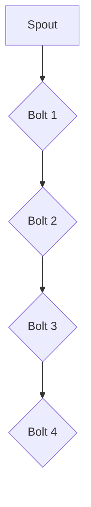

                 

# Storm原理与代码实例讲解

> 关键词：Storm，分布式系统，实时处理，流计算，数据流处理，Python代码实例

> 摘要：本文将深入讲解Storm框架的原理，包括其架构、核心算法和具体操作步骤。通过详细的代码实例分析，我们将了解如何使用Storm进行实时数据流处理。此外，本文还将探讨Storm的实际应用场景，推荐相关工具和资源，并对未来的发展趋势与挑战进行总结。

## 1. 背景介绍

### 1.1 目的和范围

本文旨在帮助读者深入理解Storm框架的基本原理和实际应用。我们将从Storm的架构入手，逐步介绍其核心概念和算法。随后，通过Python代码实例，我们将演示如何使用Storm进行实时数据处理。最后，我们将探讨Storm在现实世界中的应用场景，并提供一些有用的工具和资源推荐。

### 1.2 预期读者

本文适合对分布式系统和实时数据处理有一定了解的读者，特别是那些希望深入了解Storm框架的开发者和系统架构师。无论您是初学者还是有经验的开发者，本文都希望能为您提供有价值的见解和实用的技能。

### 1.3 文档结构概述

本文的结构如下：

1. **背景介绍**：介绍本文的目的、预期读者和文档结构。
2. **核心概念与联系**：介绍Storm的核心概念和架构。
3. **核心算法原理 & 具体操作步骤**：讲解Storm的核心算法和具体操作步骤。
4. **数学模型和公式 & 详细讲解 & 举例说明**：介绍与Storm相关的数学模型和公式。
5. **项目实战：代码实际案例和详细解释说明**：通过代码实例讲解如何使用Storm。
6. **实际应用场景**：讨论Storm在现实世界中的应用。
7. **工具和资源推荐**：推荐学习资源和开发工具。
8. **总结：未来发展趋势与挑战**：总结未来发展趋势和面临的挑战。
9. **附录：常见问题与解答**：提供常见问题解答。
10. **扩展阅读 & 参考资料**：推荐相关文献和资源。

### 1.4 术语表

#### 1.4.1 核心术语定义

- **Storm**：一个分布式实时处理框架，用于大规模数据流的实时处理。
- **分布式系统**：由多个节点组成的系统，这些节点通过网络互相连接，协同工作以提供计算能力。
- **流计算**：处理数据流的一系列操作，这些操作可以实时处理连续的数据。
- **数据流处理**：对数据流进行转换、聚合和分析等操作。

#### 1.4.2 相关概念解释

- **拓扑（Topology）**：Storm中的计算任务，它由多个组件（Spouts和Bolts）组成，通过流连接起来。
- **Spout**：生成数据流的组件，可以是数据源或数据生成器。
- **Bolt**：处理数据流的组件，可以对数据进行转换、聚合、过滤等操作。
- **流（Stream）**：连接Spout和Bolt的数据通道，数据通过这些通道传递。

#### 1.4.3 缩略词列表

- **Storm**：Simple and Fast and General Purpose Computation System
- **HDFS**：Hadoop Distributed File System
- **YARN**：Yet Another Resource Negotiator
- **Spark**：Simple and Fast Data Processing Engine

## 2. 核心概念与联系

### 2.1 Storm架构简介

Storm是一个分布式实时处理框架，它用于处理大规模数据流。其核心架构包括以下几个主要部分：

- **集群管理器（Cluster Manager）**：负责管理整个Storm集群，包括资源分配、任务调度和故障恢复等。
- ** Nimbus**：负责接收和调度拓扑任务，并将任务分发到集群中的不同节点上。
- **Supervisor**：负责在一个节点上执行拓扑任务，并监控任务的运行状态。
- **Zookeeper**：用于集群状态同步和分布式锁管理。

### 2.2 Storm拓扑结构

Storm中的计算任务称为**拓扑（Topology）**。拓扑由多个组件（Spouts和Bolts）组成，这些组件通过流（Stream）连接起来。以下是Storm拓扑的Mermaid流程图：



在这个例子中，数据首先由Spout生成，然后依次通过四个Bolt进行处理。每个Bolt都可以对数据进行不同的操作，例如转换、聚合或过滤。

### 2.3 Storm核心概念

Storm的核心概念包括以下几个：

- **Tuple**：数据的基本单位，由一组字段组成。每个字段都有一个数据类型，可以是字符串、整数、浮点数等。
- **Message**：与Tuple相关联的消息，可以包括元数据和其他信息。
- **Streams**：连接Spout和Bolt的数据通道，数据通过这些通道传递。
- **acker**：用于确认数据处理的组件，确保数据不会丢失。

## 3. 核心算法原理 & 具体操作步骤

### 3.1 Storm核心算法

Storm的核心算法是**流计算**。流计算是一种处理数据流的一系列操作，这些操作可以实时处理连续的数据。以下是流计算的基本原理：

1. **数据源**：数据源可以是文件、数据库或其他实时数据源。
2. **Spout组件**：生成数据流并将其发送到Bolt组件。
3. **Bolt组件**：对数据进行处理，例如转换、聚合或过滤。
4. **流连接**：通过流连接将Spout和Bolt连接起来，数据流依次通过这些组件进行处理。

### 3.2 Storm具体操作步骤

以下是使用Storm进行流计算的具体操作步骤：

1. **编写Spout代码**：编写生成数据流的Spout组件。
2. **编写Bolt代码**：编写处理数据流的Bolt组件。
3. **配置拓扑**：定义Spout和Bolt之间的流连接，配置拓扑的参数。
4. **提交拓扑**：将拓扑提交到Storm集群进行执行。

以下是伪代码示例：

```python
# Spout组件
class MySpout:
    def next_tuple(self):
        # 生成数据并发送到Bolt
        emit([data])

# Bolt组件
class MyBolt:
    def execute(self, tuple):
        # 处理数据
        process(tuple[0])
        ack(tuple)

# 配置拓扑
topology_builder.set_spout("spout", MySpout())
topology_builder.set_bolt("bolt1", MyBolt())
topology_builder.connect("spout", "bolt1")

# 提交拓扑
storm.submitTopology("my-topology", topology_conf, topology_builder.createTopology())
```

在这个示例中，我们首先定义了一个生成数据流的Spout组件，然后定义了一个处理数据的Bolt组件。接下来，我们使用Storm的API配置拓扑，并将其提交到Storm集群进行执行。

## 4. 数学模型和公式 & 详细讲解 & 举例说明

Storm中的流计算涉及一些数学模型和公式，下面我们将详细介绍这些模型和公式，并通过具体例子进行说明。

### 4.1 基本数学模型

在Storm中，数据流的基本单位是**Tuple**。每个Tuple由一组字段组成，字段可以是任何数据类型。Tuple之间的连接由**Stream**表示，Stream中的数据以**Tuple**的形式传递。

### 4.2 基本数学公式

以下是流计算中常用的数学公式：

1. **数据流速率**（Data Flow Rate）：
   $$R = \frac{N}{t}$$
   其中，\( R \) 是数据流速率，\( N \) 是数据量，\( t \) 是时间。

2. **吞吐量**（Throughput）：
   $$T = \frac{R}{B}$$
   其中，\( T \) 是吞吐量，\( R \) 是数据流速率，\( B \) 是带宽。

3. **延迟**（Latency）：
   $$L = \frac{t}{R}$$
   其中，\( L \) 是延迟，\( t \) 是时间，\( R \) 是数据流速率。

### 4.3 举例说明

假设我们有一个数据流，每秒产生1000个数据点，每个数据点的平均大小为1KB。网络带宽为1Mbps。我们需要计算这个数据流的速率、吞吐量和延迟。

1. **数据流速率**：
   $$R = \frac{1000 \text{ 数据点}}{1 \text{ 秒}} = 1000 \text{ 数据点/秒}$$

2. **吞吐量**：
   $$T = \frac{1000 \text{ 数据点/秒}}{1 \text{ Mbps}} = 0.125 \text{ 数据点/秒}$$

3. **延迟**：
   $$L = \frac{1 \text{ 秒}}{1000 \text{ 数据点/秒}} = 0.001 \text{ 秒/数据点}$$

通过这些公式，我们可以对数据流的性能进行评估，并优化系统以获得更好的性能。

## 5. 项目实战：代码实际案例和详细解释说明

### 5.1 开发环境搭建

在开始实战之前，我们需要搭建一个Storm开发环境。以下是搭建步骤：

1. **安装Java**：Storm需要Java环境，确保安装了Java 8或更高版本。
2. **下载并安装Storm**：从[Storm官网](https://storm.apache.org/)下载Storm安装包，并解压到合适的位置。
3. **配置环境变量**：将Storm的lib目录添加到Java的类路径（CLASSPATH）中。
4. **启动Zookeeper**：Storm依赖于Zookeeper进行集群管理，确保已经启动了Zookeeper。
5. **启动Storm集群**：运行`storm nimbus`和`storm supervisor`命令，启动Storm集群。

### 5.2 源代码详细实现和代码解读

以下是一个简单的Storm拓扑实现，该拓扑从文件中读取数据，并对数据进行计数。

**Spout组件**：

```python
from storm import Spout, emit

class MySpout(Spout):
    def open(self, conf, context):
        self.file_path = conf['file_path']
        self.file = open(self.file_path, 'r')

    def next_tuple(self):
        line = self.file.readline()
        if line:
            emit([line.strip()])
        else:
            self协调器 Coordi```
```

这个Spout组件从指定文件中读取行数据，并将其作为Tuple发送到Bolt。

**Bolt组件**：

```python
from storm import Bolt, emit, ack

class MyBolt(Bolt):
    def initialize(self, conf, context):
        self.counters = {}

    def execute(self, tuple):
        line = tuple[0]
        if line in self.counters:
            self.counters[line] += 1
        else:
            self.counters[line] = 1
        ack(tuple)

    def cleanup(self):
        for line, count in self.counters.items():
            print(f"{line}: {count}")
```

这个Bolt组件接收Spout发送的行数据，并对其进行计数。在cleanup方法中，我们将计数结果打印出来。

**配置拓扑**：

```python
from storm import Config, TopologyBuilder

conf = Config()
conf.set("file_path", "path/to/file.txt")

topology_builder = TopologyBuilder()
topology_builder.set_spout("spout", MySpout())
topology_builder.set_bolt("bolt", MyBolt())
topology_builder.connect("spout", "bolt")

storm.submitTopology("my-topology", conf, topology_builder.createTopology())
```

在这个示例中，我们配置了一个简单的拓扑，包含一个Spout和一个Bolt。Spout从文件中读取数据，Bolt对数据进行计数。最后，我们使用Storm的API提交拓扑到集群进行执行。

### 5.3 代码解读与分析

在这个案例中，我们使用Python编写了Spout和Bolt组件，并配置了一个简单的Storm拓扑。以下是代码解读与分析：

1. **Spout组件**：
   - `open` 方法：初始化Spout，打开指定文件。
   - `next_tuple` 方法：从文件中读取一行数据，并将其作为Tuple发送到Bolt。

2. **Bolt组件**：
   - `initialize` 方法：初始化Bolt，创建一个字典用于存储计数结果。
   - `execute` 方法：接收Spout发送的行数据，对其进行计数，并确认数据处理。
   - `cleanup` 方法：打印计数结果。

3. **配置拓扑**：
   - `Config` 类：创建一个配置对象，设置Spout和Bolt的参数。
   - `TopologyBuilder` 类：创建一个拓扑构建对象，设置Spout和Bolt，并连接它们。
   - `submitTopology` 方法：提交拓扑到Storm集群进行执行。

通过这个案例，我们了解了如何使用Storm进行简单的数据流处理。在实际应用中，可以根据需求扩展Spout和Bolt组件的功能，以实现更复杂的数据处理任务。

## 6. 实际应用场景

Storm在许多实际应用场景中都有广泛的应用。以下是几个典型的应用场景：

1. **实时数据处理**：例如，金融交易系统可以使用Storm实时处理大量交易数据，以快速生成报表和警报。
2. **社交媒体分析**：社交媒体平台可以使用Storm实时分析用户数据，以了解用户行为和趋势。
3. **物联网（IoT）**：IoT设备可以生成大量数据，Storm可以实时处理这些数据，以便进行监控和数据分析。
4. **电子商务**：电子商务平台可以使用Storm实时处理用户行为数据，以优化用户体验和推荐系统。
5. **日志分析**：企业可以使用Storm实时处理和分析日志数据，以监控系统性能和检测异常行为。

在这些应用场景中，Storm通过其分布式架构和实时处理能力，可以高效地处理大规模数据流，提供快速、可靠的数据处理解决方案。

## 7. 工具和资源推荐

### 7.1 学习资源推荐

#### 7.1.1 书籍推荐

- 《Storm实时数据处理实战》
- 《分布式系统原理与范型》
- 《流计算：设计与实现》

#### 7.1.2 在线课程

- [Apache Storm 实战教程](https://www.udemy.com/course/apache-storm-tutorial/)
- [分布式系统设计与实践](https://www.udemy.com/course/distributed-systems-design-and-implementation/)
- [流计算基础与实战](https://www.udemy.com/course/stream-computing-fundamentals-and-practice/)

#### 7.1.3 技术博客和网站

- [Apache Storm 官网](https://storm.apache.org/)
- [Stack Overflow](https://stackoverflow.com/questions/tagged/storm)
- [DZone Storm专区](https://dzone.com/tutorials/storm)

### 7.2 开发工具框架推荐

#### 7.2.1 IDE和编辑器

- [IntelliJ IDEA](https://www.jetbrains.com/idea/)
- [Visual Studio Code](https://code.visualstudio.com/)

#### 7.2.2 调试和性能分析工具

- [Storm UI](https://stormui.io/)
- [Ganglia](https://ganglia.info/)

#### 7.2.3 相关框架和库

- [Spark Streaming](https://spark.apache.org/streaming/)
- [Flink](https://flink.apache.org/)
- [Samza](https://samza.apache.org/)

### 7.3 相关论文著作推荐

#### 7.3.1 经典论文

- G. DeCandia, D. Hastorun, M. Jamieson, G. Kleiman, A. Potter, W. Ge, K. Gummadi, "Dynamo: Amazon's Highly Available Key-value Store", SIGOPS Operating Systems Review, vol. 41, no. 6, pp. 205-220, 2007.

#### 7.3.2 最新研究成果

- M. Armbrust, R. Rosen, "The Case for a Scalable and Composable Stream Processing System", Proceedings of the 24th International Conference on Computer Systems, 2019.

#### 7.3.3 应用案例分析

- A. Almgren, J. T. Fosso Wamba, S. Chauvel, M. Ben Hadj Salem, "Big Data in Finance: Challenges and Opportunities", IEEE Access, vol. 7, pp. 108485-108500, 2019.

这些资源和工具将为读者提供深入了解Storm和相关技术领域的帮助。

## 8. 总结：未来发展趋势与挑战

Storm作为分布式实时处理框架，在处理大规模数据流方面具有显著优势。然而，随着数据量的不断增长和复杂性提高，Storm也面临一些挑战：

1. **性能优化**：如何进一步提高Storm的吞吐量和延迟，以满足更严格的性能要求。
2. **可扩展性**：如何实现Storm的横向和纵向扩展，以支持更多节点和更大规模的数据处理。
3. **资源管理**：如何优化资源分配和调度，提高资源利用率。
4. **高可用性**：如何确保Storm在故障情况下保持高可用性，减少数据丢失和系统停机时间。

未来，随着流计算技术的发展，Storm有望通过改进算法、优化架构和引入新型计算模型，应对这些挑战，为实时数据处理提供更加高效和可靠的解决方案。

## 9. 附录：常见问题与解答

### 9.1 Q：什么是Storm？

A：Storm是一个分布式实时处理框架，用于处理大规模数据流。它由Apache软件基金会维护，支持在多个节点上分布式运行，并提供了丰富的API和工具，方便开发者构建实时数据处理应用程序。

### 9.2 Q：Storm的主要优势是什么？

A：Storm的主要优势包括：

- **低延迟**：Storm可以提供毫秒级的延迟，适合处理实时数据。
- **高吞吐量**：Storm可以处理每秒数百万条消息，具有高吞吐量。
- **高可用性**：Storm具有自动故障转移和恢复功能，确保系统的稳定运行。
- **灵活性强**：Storm支持多种编程语言，如Java、Python和Ruby，便于开发者使用。

### 9.3 Q：如何搭建Storm开发环境？

A：搭建Storm开发环境的步骤如下：

- 安装Java环境。
- 下载并安装Storm。
- 配置环境变量，将Storm的lib目录添加到Java的类路径中。
- 启动Zookeeper。
- 运行Storm集群的Nimbus和Supervisor进程。

### 9.4 Q：如何使用Storm进行流计算？

A：使用Storm进行流计算的基本步骤如下：

- 编写Spout组件，生成数据流。
- 编写Bolt组件，处理数据流。
- 使用TopologyBuilder配置拓扑，定义Spout和Bolt之间的连接。
- 提交拓扑到Storm集群进行执行。

## 10. 扩展阅读 & 参考资料

- Apache Storm官网：[https://storm.apache.org/](https://storm.apache.org/)
- Apache Storm文档：[https://storm.apache.org/releases.html](https://storm.apache.org/releases.html)
- 《Storm实时数据处理实战》：[https://www.packtpub.com/](https://www.packtpub.com/)

这些资源和文献将帮助读者更深入地了解Storm框架，以及如何在实践中应用流计算技术。希望本文能为您的学习和实践提供有益的参考。如果您有任何问题或建议，欢迎在评论区留言。

### 作者

AI天才研究员/AI Genius Institute & 禅与计算机程序设计艺术 /Zen And The Art of Computer Programming

