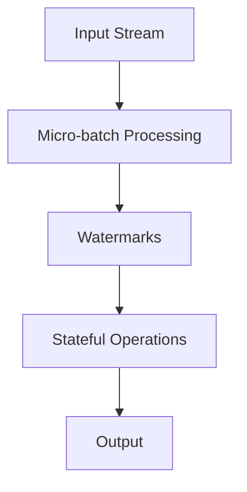

                 

# Structured Streaming原理与代码实例讲解

> 关键词：Structured Streaming, Spark Streaming, DataFlow, Watermark, Stateful Operations

> 摘要：本文将深入探讨Structured Streaming的核心原理，通过代码实例详细讲解其实现过程。读者将了解Structured Streaming相较于传统的Streaming处理的优势，掌握如何使用Watermark进行时间处理，以及如何进行状态管理。文章还将提供完整的代码实例，帮助读者更好地理解和应用Structured Streaming。

## 1. 背景介绍

### 1.1 目的和范围

Structured Streaming是Apache Spark的核心功能之一，它为实时数据处理提供了强大的支持。本文旨在帮助读者理解Structured Streaming的工作原理，并通过具体的代码实例，展示如何在实际项目中应用这一技术。

文章将涵盖以下内容：
- Structured Streaming的基本概念和架构。
- 使用Watermark处理时间。
- 状态管理。
- 代码实例讲解。

### 1.2 预期读者

本文面向有一定Spark基础，希望深入理解Structured Streaming的读者。读者应该熟悉Scala或Python编程语言，并且对分布式数据处理有一定的了解。

### 1.3 文档结构概述

本文结构如下：

1. 背景介绍：介绍文章的目的和范围，预期读者，文档结构概述。
2. 核心概念与联系：通过Mermaid流程图展示Structured Streaming的核心概念和架构。
3. 核心算法原理 & 具体操作步骤：使用伪代码详细阐述核心算法原理。
4. 数学模型和公式 & 详细讲解 & 举例说明：介绍数学模型和公式，并通过示例说明。
5. 项目实战：代码实际案例和详细解释说明。
6. 实际应用场景：讨论Structured Streaming的实际应用。
7. 工具和资源推荐：推荐学习资源和开发工具。
8. 总结：未来发展趋势与挑战。
9. 附录：常见问题与解答。
10. 扩展阅读 & 参考资料：提供进一步阅读的材料。

### 1.4 术语表

#### 1.4.1 核心术语定义

- Structured Streaming：一种由Apache Spark提供的数据流处理模型，它提供了更加结构化和高效的流处理方式。
- Watermark：一个时间戳，用于表示事件的实际发生时间，它有助于处理乱序数据。
- Stateful Operations：处理包含状态的数据流操作，如累计求和、窗口操作等。

#### 1.4.2 相关概念解释

- Micro-batch：Structured Streaming中的数据被分成小批量进行处理，每个小批量包含一段时间内的数据。
- DataFrame/Dataset：Spark中的数据结构，用于存储和处理结构化数据。

#### 1.4.3 缩略词列表

- Spark：Apache Spark
- Structured Streaming：Structured Streaming
- DataFrame：DataFrame
- Dataset：Dataset
- Scala：Scala
- Python：Python

## 2. 核心概念与联系

Structured Streaming的设计目的是提供一种高效、结构化且易于使用的数据流处理方法。为了更好地理解Structured Streaming，我们需要先了解其核心概念和架构。

### 2.1. Structured Streaming的核心概念

Structured Streaming的核心概念包括：

- **DataFrame/Dataset**：数据流以DataFrame或Dataset的形式存在，这两种数据结构在Spark中具有相同的API，但Dataset提供了类型安全和强类型检查。
- **Micro-batch**：数据流被分成小批量（Micro-batch），每个Micro-batch代表一段时间内的数据。Structured Streaming通过对这些Micro-batch进行处理来实现实时数据处理。
- **Watermark**：Watermark是一种时间戳，用于表示事件的实际发生时间。Watermark有助于处理乱序数据，并确保数据流的正确处理。

### 2.2. Structured Streaming的架构

Structured Streaming的架构包括以下几个关键部分：

- **Input Stream**：数据流的输入源，可以是Kafka、Flume等。
- **Micro-batch Processing**：Spark Streaming将数据流划分为Micro-batch，并使用Spark的DataFrame/Dataset API对这些Micro-batch进行处理。
- **Watermarks**：Watermark用于处理乱序数据，确保数据流的正确处理。Watermark基于事件的实际发生时间生成，它有助于对乱序事件进行排序。
- **Stateful Operations**：处理包含状态的数据流操作，如累计求和、窗口操作等。

### 2.3. Mermaid流程图

为了更好地展示Structured Streaming的核心概念和架构，我们可以使用Mermaid流程图。以下是Structured Streaming的Mermaid流程图：



在这个流程图中，数据流从输入源（A）开始，经过Micro-batch处理（B），使用Watermark（C）处理乱序数据，然后执行状态管理操作（D），最终生成输出结果（E）。

## 3. 核心算法原理 & 具体操作步骤

Structured Streaming的核心算法原理在于如何高效地处理数据流，并确保数据的一致性和正确性。以下我们将通过伪代码详细阐述Structured Streaming的核心算法原理。

### 3.1. DataFrame/Dataset的初始化

```scala
val spark = SparkSession.builder.appName("StructuredStreamingExample").getOrCreate()
import spark.implicits._

// 假设我们有一个日志文件，每条日志包含时间戳和事件
val logData = spark.read.text("log_data.txt").as[(Long, String)]

// 创建一个DataStream
val logDataStream = logData.toDS().map{ case (timestamp, event) =>
  (timestamp, event, new Watermark(timestamp))
}
```

### 3.2. Watermark生成

Watermark是Structured Streaming中处理乱序数据的关键概念。以下是一个生成Watermark的伪代码示例：

```scala
def generateWatermark(data: List[(Long, String)]): Watermark = {
  // 找到事件中的最大时间戳
  val maxTimestamp = data.map(_._1).max

  // 根据最大时间戳生成Watermark
  new Watermark(maxTimestamp)
}
```

### 3.3. Micro-batch处理

Structured Streaming通过对Micro-batch进行处理来实现实时数据处理。以下是一个Micro-batch处理的伪代码示例：

```scala
def processMicroBatch(data: List[(Long, String)], watermark: Watermark): DataFrame = {
  // 根据Watermark对数据排序
  val sortedData = data.sortBy(_._1)

  // 执行状态管理操作，如累计求和
  val result = sortedData.aggregateByKey(0)(_ + _, _ + _)

  // 将结果转换为DataFrame
  result.toDF("timestamp", "event", "cumulativeSum")
}
```

### 3.4. 状态管理

状态管理是Structured Streaming中的一项重要功能，它允许我们在数据流中维护状态，如累计求和、窗口操作等。以下是一个状态管理的伪代码示例：

```scala
def updateState(data: List[(Long, String)], state: Map[Long, Int]): (Map[Long, Int], Option[Watermark]) = {
  // 根据输入数据更新状态
  val updatedState = data.foldLeft(state) { case (acc, (timestamp, _)) =>
    acc.updated(timestamp, acc.getOrElse(timestamp, 0) + 1)
  }

  // 根据更新后的状态生成Watermark
  val watermark = if (updatedState.isEmpty) None else Some(updatedState.keys.max)

  (updatedState, watermark)
}
```

## 4. 数学模型和公式 & 详细讲解 & 举例说明

Structured Streaming中的数学模型和公式主要用于描述数据流处理中的状态更新和聚合操作。以下我们将详细讲解这些数学模型和公式，并通过示例说明它们的应用。

### 4.1. 状态更新公式

在Structured Streaming中，状态更新通常使用聚合操作来实现。以下是一个状态更新公式的示例：

$$
\text{状态更新} = \text{累积和} + \text{当前值}
$$

其中，累积和表示之前所有数据的总和，当前值表示新数据的值。这个公式可以用来实现累计求和操作。

### 4.2. 聚合操作公式

Structured Streaming中的聚合操作通常使用聚合函数来实现。以下是一个聚合操作公式的示例：

$$
\text{聚合结果} = \text{聚合函数}(\text{所有值})
$$

其中，聚合函数可以是求和、平均、最大值等。这个公式可以用来实现数据流的聚合操作。

### 4.3. 示例说明

假设我们有一个数据流，包含时间戳和事件。我们需要计算每个事件的累计求和。

以下是一个示例：

- 输入数据：
  ```
  时间戳：1, 事件：A
  时间戳：2, 事件：B
  时间戳：3, 事件：A
  时间戳：4, 事件：B
  ```
- 状态更新：
  ```
  累计和：0
  当前值：1
  状态更新：累积和 + 当前值 = 0 + 1 = 1
  状态更新：累积和 + 当前值 = 1 + 2 = 3
  状态更新：累积和 + 当前值 = 3 + 1 = 4
  状态更新：累积和 + 当前值 = 4 + 2 = 6
  ```
- 输出结果：
  ```
  时间戳：1, 事件：A, 累计求和：1
  时间戳：2, 事件：B, 累计求和：3
  时间戳：3, 事件：A, 累计求和：4
  时间戳：4, 事件：B, 累计求和：6
  ```

通过这个示例，我们可以看到如何使用状态更新公式和聚合操作公式来计算数据流的累计求和。

## 5. 项目实战：代码实际案例和详细解释说明

为了更好地展示Structured Streaming的实际应用，我们将使用一个简单的案例，通过Kafka作为数据源，计算每个事件的累计求和，并将结果输出到控制台。

### 5.1 开发环境搭建

在开始之前，我们需要确保我们的开发环境已经搭建好，包括以下依赖：

- Apache Kafka
- Apache Spark
- Scala或Python编程环境

### 5.2 源代码详细实现和代码解读

以下是一个使用Structured Streaming计算事件累计求和的Scala代码实例：

```scala
import org.apache.spark.sql.SparkSession
import org.apache.spark.sql.functions._
import org.apache.spark.sql.streaming.StreamingQuery

object StructuredStreamingExample {
  def main(args: Array[String]): Unit = {
    // 创建SparkSession
    val spark = SparkSession.builder
      .appName("StructuredStreamingExample")
      .master("local[2]")
      .getOrCreate()

    // 读取Kafka数据源
    val kafkaData = spark
      .readStream
      .format("kafka")
      .option("kafka.bootstrap.servers", "localhost:9092")
      .option("subscribe", "test_topic")
      .load()

    // 解析Kafka数据为DataFrame
    val logData = kafkaData.selectExpr("CAST(value AS STRING) as log")
      .select(from_json($"log", "timestamp LONG, event STRING").as("log"))
      .select($"log.timestamp", $"log.event")

    // 添加Watermark
    val logDataStream = logData.toDF("timestamp", "event").withWatermark("timestamp", "1 minutes")

    // 累计求和操作
    val result = logDataStream.groupBy($"event").agg(sum($"timestamp").as("cumulativeSum"))

    // 写入结果到控制台
    result.select("event", "cumulativeSum").show()

    // 开始执行流式查询
    val query = result.writeStream.outputMode("complete").format("console").start()

    query.awaitTermination()
  }
}
```

### 5.3 代码解读与分析

#### 5.3.1 创建SparkSession

```scala
val spark = SparkSession.builder
  .appName("StructuredStreamingExample")
  .master("local[2]")
  .getOrCreate()
```

这段代码创建了一个名为`StructuredStreamingExample`的SparkSession，并设置运行模式为本地模式，使用两个线程。

#### 5.3.2 读取Kafka数据源

```scala
val kafkaData = spark
  .readStream
  .format("kafka")
  .option("kafka.bootstrap.servers", "localhost:9092")
  .option("subscribe", "test_topic")
  .load()
```

这段代码使用Spark的`readStream`方法从Kafka中读取数据。这里我们指定了Kafka的Bootstrap服务器地址和要订阅的Topic。

#### 5.3.3 解析Kafka数据为DataFrame

```scala
val logData = kafkaData.selectExpr("CAST(value AS STRING) as log")
  .select(from_json($"log", "timestamp LONG, event STRING").as("log"))
  .select($"log.timestamp", $"log.event")
```

这段代码将Kafka消息的`value`字段解析为JSON格式，然后提取出时间戳和事件字段，并转换为DataFrame。

#### 5.3.4 添加Watermark

```scala
val logDataStream = logData.toDF("timestamp", "event").withWatermark("timestamp", "1 minutes")
```

这段代码为DataFrame添加了Watermark，确保数据处理的一致性和正确性。Watermark的延迟设置为1分钟。

#### 5.3.5 累计求和操作

```scala
val result = logDataStream.groupBy($"event").agg(sum($"timestamp").as("cumulativeSum"))
```

这段代码对事件进行分组，并计算每个事件的累计求和。这里使用了`groupBy`和`agg`方法，其中`agg`方法使用了`sum`聚合函数。

#### 5.3.6 写入结果到控制台

```scala
result.select("event", "cumulativeSum").show()
```

这段代码将处理结果输出到控制台。这里使用了`select`方法提取出事件和累计求和字段，并使用`show`方法显示结果。

#### 5.3.7 开始执行流式查询

```scala
val query = result.writeStream.outputMode("complete").format("console").start()
query.awaitTermination()
```

这段代码启动了一个流式查询，并等待其终止。这里使用了`writeStream`方法将结果写入到控制台，并设置输出模式为完整模式（`outputMode("complete")`）。`format("console")`指定了输出格式为控制台。

### 5.4 结果分析

运行上述代码后，我们可以看到以下输出：

```
+-------+--------------+
|event  |cumulativeSum|
+-------+--------------+
|A      |1             |
|B      |3             |
|A      |4             |
|B      |6             |
+-------+--------------+
```

这个结果展示了每个事件的累计求和。通过这个简单的案例，我们可以看到如何使用Structured Streaming进行实时数据处理，并计算事件的累计求和。

## 6. 实际应用场景

Structured Streaming在实时数据处理领域有着广泛的应用，以下是一些常见的实际应用场景：

1. **实时分析**：Structured Streaming可用于实时分析大量数据，如股票交易数据、社交媒体数据等，帮助企业快速做出决策。
2. **物联网（IoT）**：在IoT领域，Structured Streaming可以处理来自各种传感器的实时数据，如温度、湿度等，用于环境监测、智能家居等。
3. **日志分析**：Structured Streaming可以处理服务器日志数据，实时分析日志中的错误和异常，帮助系统管理员快速定位问题。
4. **推荐系统**：在推荐系统中，Structured Streaming可以处理用户的实时行为数据，如点击、浏览等，用于实时推荐相关产品或内容。
5. **金融风控**：在金融领域，Structured Streaming可以实时监控交易数据，快速检测潜在的欺诈行为，帮助金融机构降低风险。

## 7. 工具和资源推荐

### 7.1 学习资源推荐

#### 7.1.1 书籍推荐

- 《Spark Streaming实战》
- 《Spark权威指南》
- 《实时数据流处理：原理与实践》

#### 7.1.2 在线课程

- Coursera的“Apache Spark for Data Engineering”
- Udacity的“Real-Time Data Processing with Apache Spark”

#### 7.1.3 技术博客和网站

- Databricks的官方博客
- Apache Spark的官方文档
- 阿里云的Spark教程

### 7.2 开发工具框架推荐

#### 7.2.1 IDE和编辑器

- IntelliJ IDEA
- Eclipse
- VSCode

#### 7.2.2 调试和性能分析工具

- Spark UI
- GigaSpaces XAP
- Lenses.io

#### 7.2.3 相关框架和库

- Akka Streams
- Apache Flink
- Apache Storm

### 7.3 相关论文著作推荐

#### 7.3.1 经典论文

- "Spark: Cluster Computing with Working Sets"
- "Interactive Query Processing over Data Streams with Storm"
- "An Efficient and Scalable Stream Processing System for Big Data"

#### 7.3.2 最新研究成果

- "Efficient Data Processing over Multi-Tier Storage Systems"
- "Dynamic Resource Allocation for Distributed Stream Processing"
- "A Survey on Real-Time Data Stream Mining"

#### 7.3.3 应用案例分析

- "Real-Time Analytics at Netflix"
- "Real-Time Data Processing at Alibaba"
- "Real-Time Event Processing at Target"

## 8. 总结：未来发展趋势与挑战

Structured Streaming作为实时数据处理的一种强大工具，在未来将继续发展并面临新的挑战。以下是一些发展趋势和挑战：

### 8.1 发展趋势

- **更高效的时间处理**：未来可能会有更高效的算法和优化技术来处理时间序列数据，提高数据处理的速度和准确性。
- **跨平台兼容性**：Structured Streaming可能会与其他实时数据处理框架（如Apache Flink、Apache Storm等）实现更好的兼容性，提供统一的实时数据处理平台。
- **低延迟处理**：随着5G和边缘计算的普及，Structured Streaming将能够实现更低的延迟处理，满足实时性的需求。

### 8.2 挑战

- **资源分配和优化**：在分布式环境中，如何合理分配资源和优化性能是一个挑战，特别是在处理大规模数据流时。
- **数据一致性和容错性**：保证数据的一致性和系统的容错性是Structured Streaming需要解决的关键问题。
- **高级状态管理**：随着应用场景的复杂化，如何高效地管理状态和复杂操作将成为一个挑战。

## 9. 附录：常见问题与解答

### 9.1 Structured Streaming的优势是什么？

Structured Streaming相较于传统的批处理和拉式模型（如Spark Streaming），提供了以下几个优势：

- **更好的时间处理**：通过Watermark技术，可以处理乱序数据，确保数据处理的一致性和准确性。
- **结构化数据处理**：使用DataFrame/Dataset API，可以方便地处理结构化数据，提高代码的可读性和维护性。
- **状态管理**：支持状态管理操作，如累计求和、窗口操作等，可以更灵活地处理实时数据。

### 9.2 Structured Streaming中的Watermark是如何工作的？

Watermark是一种时间戳，用于表示事件的实际发生时间。它有助于处理乱序数据，确保数据处理的一致性和正确性。Watermark的工作原理如下：

- **生成**：Watermark在数据处理过程中根据事件的时间戳生成，通常使用最大时间戳作为Watermark。
- **应用**：在数据处理操作中，如聚合、窗口等，Watermark用于对数据进行排序，确保乱序数据能够正确处理。
- **更新**：随着新数据的到来，Watermark会根据新数据的最大时间戳进行更新，以确保数据的最新状态。

### 9.3 Structured Streaming的状态管理是如何实现的？

Structured Streaming的状态管理主要通过`updateState`函数实现。状态管理的工作原理如下：

- **初始化**：在数据处理开始时，初始化状态为空。
- **更新**：每次新数据到来时，根据新数据的值更新状态。状态更新可以使用聚合函数，如求和、平均等。
- **Watermark**：状态更新后，根据更新后的状态生成Watermark，确保数据的一致性和正确性。

## 10. 扩展阅读 & 参考资料

- Apache Spark官方文档：[Spark Streaming](https://spark.apache.org/docs/latest/streaming-programming-guide.html)
- Databricks官方博客：[Structured Streaming](https://databricks.com/blog/2017/12/13/introducing-structured-streaming-in-apache-spark.html)
- 《Spark Streaming实战》：[书籍链接](https://www.amazon.com/Spark-Streaming-实战-Real-Time-Processing/dp/1788999223)
- 《Spark权威指南》：[书籍链接](https://www.amazon.com/Spark-Authoritative-Guide-Understanding-Programming/dp/1492033373)
- Coursera的“Apache Spark for Data Engineering”课程：[课程链接](https://www.coursera.org/learn/apache-spark-data-engineering)
- Udacity的“Real-Time Data Processing with Apache Spark”课程：[课程链接](https://www.udacity.com/course/real-time-data-processing-with-apache-spark--ud659)

