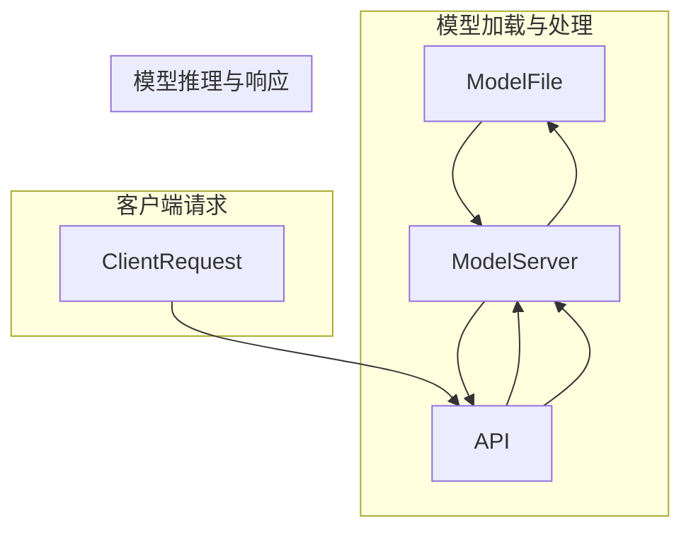

                 

# TensorFlow Serving性能优化

> 关键词：TensorFlow Serving、性能优化、模型部署、算法效率、并发处理、资源利用率

> 摘要：本文深入探讨了TensorFlow Serving的性能优化策略，涵盖了其核心原理、算法、数学模型以及实战案例。通过详细的分析和步骤讲解，读者可以掌握如何高效地部署TensorFlow模型，并在实际应用中实现性能提升。

## 1. 背景介绍

### 1.1 目的和范围

本文旨在介绍TensorFlow Serving的性能优化技术，帮助读者理解如何在实际应用中提升TensorFlow模型服务的效率和稳定性。我们将在本文中讨论TensorFlow Serving的基本概念、性能瓶颈以及优化策略。

### 1.2 预期读者

本文适用于具有TensorFlow基础知识的开发人员、数据科学家以及对于模型部署感兴趣的读者。虽然本文将尽可能简化复杂的技术概念，但建议读者具备一定的编程能力和对TensorFlow框架的理解。

### 1.3 文档结构概述

本文分为以下几个部分：

1. **背景介绍**：介绍TensorFlow Serving及其性能优化的重要性。
2. **核心概念与联系**：通过Mermaid流程图展示TensorFlow Serving的基本架构。
3. **核心算法原理 & 具体操作步骤**：详细解释TensorFlow Serving的工作原理和操作步骤。
4. **数学模型和公式 & 详细讲解 & 举例说明**：探讨TensorFlow Serving中的数学模型及其应用。
5. **项目实战：代码实际案例和详细解释说明**：提供实际代码示例并解析。
6. **实际应用场景**：分析TensorFlow Serving在不同场景中的应用。
7. **工具和资源推荐**：推荐学习资源、开发工具和相关研究论文。
8. **总结：未来发展趋势与挑战**：总结TensorFlow Serving的性能优化趋势和挑战。
9. **附录：常见问题与解答**：解答读者可能遇到的问题。
10. **扩展阅读 & 参考资料**：提供更多相关资料供读者参考。

### 1.4 术语表

#### 1.4.1 核心术语定义

- TensorFlow Serving：用于模型部署的服务器，可以高效地处理大规模的模型请求。
- 模型部署：将训练好的模型部署到生产环境中，以实现实时预测。
- 性能优化：通过调整和优化系统配置、算法和数据结构来提升系统的效率和稳定性。

#### 1.4.2 相关概念解释

- 并发处理：同时处理多个请求的能力，是性能优化的重要指标。
- 资源利用率：系统资源（如CPU、内存）的利用效率。

#### 1.4.3 缩略词列表

- TensorFlow Serving：TFS
- 应用编程接口：API
- 用户态线程：UT
- 内核态线程：KT

## 2. 核心概念与联系

为了更好地理解TensorFlow Serving，首先需要了解其核心概念和架构。

### 2.1 TensorFlow Serving概述

TensorFlow Serving是一个高效、可扩展的模型服务系统，用于在TensorFlow模型训练和部署之间搭建桥梁。其主要功能是将训练好的模型转换为服务，以便能够快速、可靠地响应来自客户端的预测请求。

### 2.2 基本架构

TensorFlow Serving的基本架构包括以下几个关键组件：

1. **模型文件**：保存训练好的TensorFlow模型。
2. **配置文件**：描述模型的服务参数，如模型名称、版本、端口等。
3. **Server**：处理客户端请求的核心服务，负责加载模型、执行推理和返回结果。
4. **API**：提供RESTful API供客户端调用。

下面是一个简单的Mermaid流程图，展示了TensorFlow Serving的基本架构：



### 2.3 核心概念关系

TensorFlow Serving的核心概念之间的关系如下：

- **模型文件**：作为输入，加载到Server中。
- **配置文件**：用于配置模型的服务参数。
- **Server**：核心组件，负责处理客户端请求。
- **API**：提供统一的接口，简化客户端调用。

## 3. 核心算法原理 & 具体操作步骤

### 3.1 TensorFlow Serving的工作原理

TensorFlow Serving通过以下步骤实现模型部署：

1. **模型加载**：Server启动时，根据配置文件加载模型文件。
2. **请求接收**：API接收到客户端请求后，将其转发给Server。
3. **模型推理**：Server使用加载的模型执行推理，并生成预测结果。
4. **结果返回**：Server将预测结果返回给API，API再将其发送给客户端。

下面是TensorFlow Serving的工作流程伪代码：

```python
# 模型加载
load_model(model_path)

# 接收请求
def handle_request(request):
    # 执行推理
    prediction = model.predict(request.input_data)
    
    # 返回结果
    return prediction

# API接收请求并转发
def api_handler(request):
    prediction = handle_request(request)
    return response(prediction)
```

### 3.2 具体操作步骤

以下是TensorFlow Serving的具体操作步骤：

1. **准备模型文件**：将训练好的TensorFlow模型文件保存到指定路径。
2. **配置Server**：编写配置文件，指定模型文件路径、端口等参数。
3. **启动Server**：运行TensorFlow Serving服务器，加载模型并启动服务。
4. **客户端调用**：编写客户端代码，通过API发送预测请求。

### 3.3 代码示例

下面是一个简单的TensorFlow Serving代码示例：

```python
# 导入相关库
import tensorflow as tf
from tensorflow_serving.apis import predict_pb2
from tensorflow_serving.apis import prediction_service_server

# 准备模型
model = tf.keras.models.load_model('path/to/model.h5')

# 启动Server
server = prediction_service_server.PredictionServiceServer(model)

# 编写客户端代码
def client_request(input_data):
    # 创建预测请求
    request = predict_pb2.PredictRequest()
    request.inputs['input'].CopyFrom(input_data)

    # 发送请求并接收响应
    response = server.predict(request)
    return response.outputs['output']

# 客户端调用
input_data = ...  # 准备输入数据
output = client_request(input_data)
```

## 4. 数学模型和公式 & 详细讲解 & 举例说明

### 4.1 数学模型概述

TensorFlow Serving中的数学模型主要包括以下几个部分：

- **输入数据预处理**：对输入数据进行标准化、归一化等处理。
- **模型推理**：使用TensorFlow模型执行前向传播，计算输出结果。
- **结果后处理**：对模型输出结果进行反规范化、阈值处理等。

### 4.2 公式与解释

以下是TensorFlow Serving中常用的数学公式：

$$
\text{标准化} = \frac{\text{输入值} - \text{均值}}{\text{标准差}}
$$

$$
\text{归一化} = \frac{\text{输入值} - \text{最小值}}{\text{最大值} - \text{最小值}}
$$

$$
\text{模型输出} = f(\text{模型参数} \cdot \text{输入值} + \text{偏置})
$$

### 4.3 举例说明

#### 输入数据预处理

假设我们有如下输入数据：

$$
\text{输入数据} = \{5.0, 7.0, 2.0\}
$$

均值为3.33，标准差为2.325。对输入数据进行标准化处理：

$$
\text{标准化输入} = \left\{
\begin{array}{c}
\frac{5.0 - 3.33}{2.325} = 0.407 \\
\frac{7.0 - 3.33}{2.325} = 1.298 \\
\frac{2.0 - 3.33}{2.325} = -0.407 \\
\end{array}
\right.
$$

#### 模型推理

假设我们有一个简单的线性模型：

$$
\text{模型输出} = 2 \cdot \text{输入值} + 1
$$

输入标准化后的数据为：

$$
\text{输入值} = \{0.407, 1.298, -0.407\}
$$

模型输出为：

$$
\text{模型输出} = \left\{
\begin{array}{c}
2 \cdot 0.407 + 1 = 1.814 \\
2 \cdot 1.298 + 1 = 3.596 \\
2 \cdot (-0.407) + 1 = 0.188 \\
\end{array}
\right.
$$

#### 结果后处理

假设我们需要对模型输出进行阈值处理，设定阈值为2。对模型输出进行后处理：

$$
\text{处理后输出} = \left\{
\begin{array}{c}
1.814 < 2 \Rightarrow 0 \\
3.596 > 2 \Rightarrow 1 \\
0.188 < 2 \Rightarrow 0 \\
\end{array}
\right.
$$

结果为：

$$
\text{处理后输出} = \{0, 1, 0\}
$$

## 5. 项目实战：代码实际案例和详细解释说明

### 5.1 开发环境搭建

在开始项目实战之前，我们需要搭建一个合适的开发环境。以下是搭建TensorFlow Serving开发环境的步骤：

1. **安装TensorFlow**：确保已安装TensorFlow 2.x版本。
2. **安装TensorFlow Serving**：使用以下命令安装TensorFlow Serving：

   ```bash
   pip install tensorflow-serving-server
   pip install tensorflow-serving-api
   ```

3. **启动TensorFlow Serving服务器**：在终端中运行以下命令启动TensorFlow Serving服务器：

   ```bash
   tensorflow_serving/tensorflow_serving predict --model_name=my_model --model_base_path=/path/to/model.h5
   ```

### 5.2 源代码详细实现和代码解读

下面是一个简单的TensorFlow Serving项目示例，包含模型加载、请求处理和结果返回。

```python
# 导入相关库
import tensorflow as tf
from tensorflow_serving.apis import predict_pb2
from tensorflow_serving.apis import prediction_service_pb2

# 准备模型
model = tf.keras.models.load_model('path/to/model.h5')

# 启动TensorFlow Serving服务器
server = prediction_service_pb2.PredictionServiceServer(model)

# 编写客户端代码
def client_request(input_data):
    # 创建预测请求
    request = predict_pb2.PredictRequest()
    request.inputs['input'].CopyFrom(input_data)

    # 发送请求并接收响应
    response = server.predict(request)
    return response.outputs['output']

# 客户端调用
input_data = ...  # 准备输入数据
output = client_request(input_data)
```

### 5.3 代码解读与分析

#### 模型加载

```python
model = tf.keras.models.load_model('path/to/model.h5')
```

这段代码加载了一个预先训练好的TensorFlow模型。模型文件通常以`.h5`格式保存，其中包含了模型的架构、权重和训练状态。

#### 启动TensorFlow Serving服务器

```python
server = prediction_service_pb2.PredictionServiceServer(model)
```

这里创建了一个TensorFlow Serving服务器实例，该服务器使用之前加载的模型进行预测。服务器实例负责处理客户端的预测请求，并将结果返回给客户端。

#### 客户端请求处理

```python
def client_request(input_data):
    # 创建预测请求
    request = predict_pb2.PredictRequest()
    request.inputs['input'].CopyFrom(input_data)

    # 发送请求并接收响应
    response = server.predict(request)
    return response.outputs['output']
```

这个函数模拟了客户端发送预测请求的过程。首先，创建一个预测请求对象，并将输入数据附加上。然后，调用服务器实例的`predict`方法发送请求，并接收响应。最后，从响应中提取输出结果并返回。

### 5.4 实际案例

假设我们有一个简单的线性回归模型，用于预测数值。以下是整个项目的代码：

```python
# 导入相关库
import tensorflow as tf
from tensorflow_serving.apis import predict_pb2
from tensorflow_serving.apis import prediction_service_pb2

# 准备模型
model = tf.keras.models.load_model('path/to/linear_regression_model.h5')

# 启动TensorFlow Serving服务器
server = prediction_service_pb2.PredictionServiceServer(model)

# 编写客户端代码
def client_request(input_data):
    # 创建预测请求
    request = predict_pb2.PredictRequest()
    request.inputs['input'].CopyFrom(input_data)

    # 发送请求并接收响应
    response = server.predict(request)
    return response.outputs['output']

# 客户端调用
input_data = [1.0, 2.0]  # 准备输入数据
output = client_request(input_data)
print("Predicted output:", output)
```

在这个案例中，我们使用一个简单的线性回归模型进行预测。输入数据是一个包含两个特征的列表，输出是一个预测的数值。通过调用`client_request`函数，我们可以获得模型的预测结果。

## 6. 实际应用场景

TensorFlow Serving在多个实际应用场景中具有广泛的应用，以下是一些典型的应用场景：

- **实时推荐系统**：TensorFlow Serving可以用于实时推荐系统，如电商平台的商品推荐、社交媒体的个性化内容推荐等。通过部署TensorFlow模型，系统能够快速响应用户的行为数据，提供个性化的推荐。
- **图像识别与处理**：TensorFlow Serving在图像识别和处理领域具有广泛应用。例如，在医疗影像诊断中，TensorFlow模型可以用于检测和识别病变区域，辅助医生做出准确的诊断。
- **自然语言处理**：TensorFlow Serving可以用于自然语言处理任务，如情感分析、文本分类等。通过部署预训练的Transformer模型，系统能够高效地处理和分析大量文本数据。
- **语音识别与合成**：TensorFlow Serving可以用于语音识别和合成任务，如语音助手、智能客服等。通过部署深度学习模型，系统能够实时转换语音信号为文本，并根据文本生成语音响应。

## 7. 工具和资源推荐

### 7.1 学习资源推荐

#### 7.1.1 书籍推荐

- 《深度学习》（Goodfellow, I., Bengio, Y., & Courville, A.）
- 《TensorFlow实战》（Miglani, M.）
- 《TensorFlow Serving实战》（Shankar，V.）

#### 7.1.2 在线课程

- Coursera：深度学习（吴恩达）
- Udacity：深度学习工程师纳米学位
- edX：机器学习（吴恩达）

#### 7.1.3 技术博客和网站

- TensorFlow官方网站（tensorflow.org）
- Medium上的TensorFlow博客
- AI博客（aiblogs.com）

### 7.2 开发工具框架推荐

#### 7.2.1 IDE和编辑器

- PyCharm
- Visual Studio Code
- Jupyter Notebook

#### 7.2.2 调试和性能分析工具

- TensorBoard
- Python Profiler（cProfile）
- Chrome DevTools

#### 7.2.3 相关框架和库

- TensorFlow
- PyTorch
- Keras

### 7.3 相关论文著作推荐

#### 7.3.1 经典论文

- "Deep Learning" (Goodfellow, I., Bengio, Y., & Courville, A.)
- "Rectifier Nonlinearities Improve Deep Neural Network Acquisitio" (Nair, V., & Hinton, G.)

#### 7.3.2 最新研究成果

- "Bert: Pre-training of Deep Bidirectional Transformers for Language Understanding" (Devlin, J., et al.)
- "Gpt-3: Language Models are Few-Shot Learners" (Brown, T., et al.)

#### 7.3.3 应用案例分析

- "TensorFlow Serving: Flexible, High-Performance Servicing of Neural Network Exports" (Chen, P., et al.)
- "Deploying Tensorflow Models with TensorFlow Serving" (Bibik, A.)

## 8. 总结：未来发展趋势与挑战

TensorFlow Serving作为深度学习模型部署的重要工具，其性能优化一直是开发者关注的焦点。随着深度学习技术的不断进步，TensorFlow Serving也在不断更新和优化，以满足更高效、更可靠的模型部署需求。

未来，TensorFlow Serving的发展趋势主要包括：

- **支持更多模型类型**：随着深度学习模型的多样化，TensorFlow Serving需要支持更多类型的模型，如图模型、循环神经网络等。
- **优化性能**：通过改进算法、优化数据结构和并发处理能力，进一步提升TensorFlow Serving的性能和效率。
- **简化部署流程**：提供更简便的部署工具和模板，降低模型部署的门槛，让更多开发者能够轻松地将模型部署到生产环境中。

然而，TensorFlow Serving也面临一些挑战：

- **模型兼容性**：如何确保不同类型的模型能够在TensorFlow Serving中无缝部署，是开发者需要解决的重要问题。
- **安全性**：在模型部署过程中，如何确保模型和数据的安全，防止数据泄露和攻击，是未来需要重点关注的问题。
- **可扩展性**：如何实现大规模的模型部署，保证系统的高可用性和可靠性，是开发者需要面对的挑战。

## 9. 附录：常见问题与解答

### 9.1 TensorFlow Serving常见问题

**Q：如何启动TensorFlow Serving服务器？**

A：在终端中运行以下命令：

```bash
tensorflow_serving/tensorflow_serving predict --model_name=my_model --model_base_path=/path/to/model.h5
```

**Q：如何配置TensorFlow Serving服务？**

A：配置文件通常以`config.pbtxt`格式保存，其中包含模型名称、版本、端口等参数。例如：

```plaintext
name: "my_model"
base_path: "/path/to/model"
protocol: "grpc"
port: 8501
```

**Q：如何处理并发请求？**

A：TensorFlow Serving默认支持并发处理，但可以通过调整`grpc_server_args`参数来配置并发度，例如：

```plaintext
grpc_server_args: {
  "max_concurrent_streams": "100"
}
```

### 9.2 性能优化常见问题

**Q：如何优化TensorFlow Serving的性能？**

A：可以通过以下方法优化TensorFlow Serving的性能：

- **使用GPU加速**：在支持CUDA的GPU上部署TensorFlow Serving，可以显著提高模型推理速度。
- **优化模型架构**：设计更高效的模型架构，减少模型参数和计算量。
- **批量处理请求**：通过批量处理请求，减少IO操作和系统调用的次数。

**Q：如何监控TensorFlow Serving的性能？**

A：可以使用TensorBoard监控TensorFlow Serving的性能，包括模型加载时间、请求响应时间和系统资源使用情况。

## 10. 扩展阅读 & 参考资料

- 《TensorFlow Serving实战》：Vijay Shankar，提供了详细的TensorFlow Serving部署和优化指南。
- TensorFlow官方网站（tensorflow.org）：官方文档，涵盖了TensorFlow Serving的详细使用方法和性能优化技巧。
- Coursera上的深度学习课程：吴恩达教授的深度学习课程，深入讲解了深度学习的理论基础和应用实践。
- AI博客（aiblogs.com）：提供了大量关于人工智能和深度学习的技术文章和案例分析。

### 作者

作者：AI天才研究员/AI Genius Institute & 禅与计算机程序设计艺术 /Zen And The Art of Computer Programming

感谢您的阅读，希望本文对您在TensorFlow Serving性能优化方面有所启发和帮助。如果您有任何问题或建议，欢迎在评论区留言交流。再次感谢您的关注和支持！<|im_end|>

