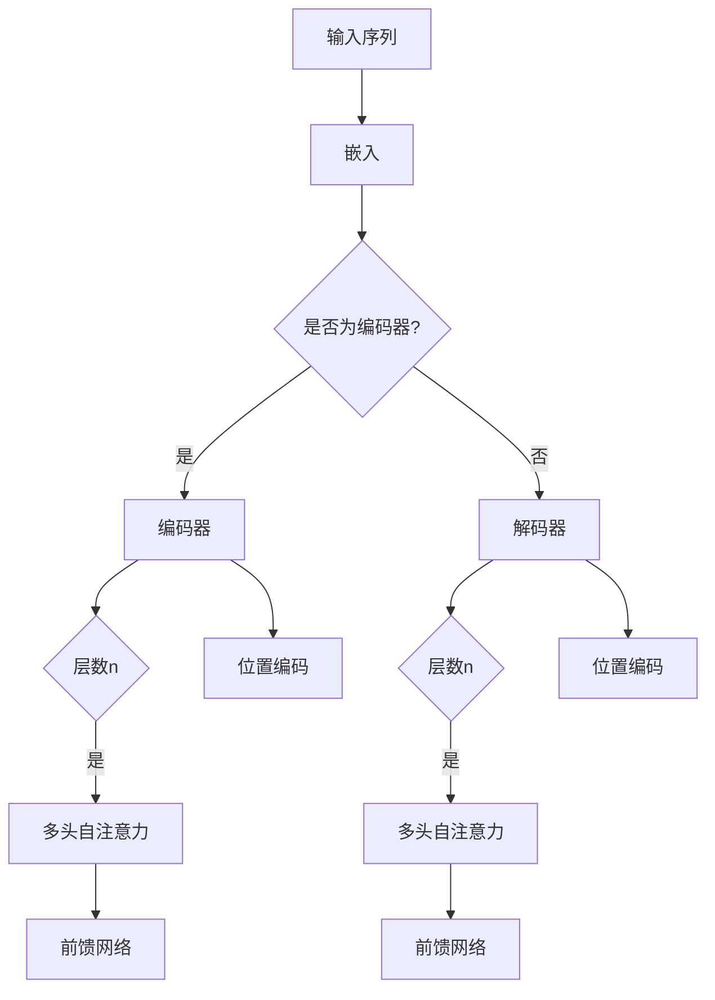

                 

# Transformer代码实现

> **关键词：** Transformer, 自注意力机制, 编程实现, 机器学习, 深度学习

> **摘要：** 本文将详细介绍Transformer模型的代码实现，从核心概念、算法原理到具体操作步骤，再到实际应用场景和项目实战。通过本文的阅读，读者可以深入了解Transformer的工作原理，学会如何在自己的项目中应用这一强大的模型。

## 1. 背景介绍

### 1.1 目的和范围

本文的目的是帮助读者深入了解并掌握Transformer模型的代码实现。我们将从Transformer模型的核心概念出发，逐步介绍其工作原理、算法实现，以及如何在实际项目中应用。本文适用于有机器学习和深度学习基础，希望深入了解Transformer模型的读者。

### 1.2 预期读者

本文主要面向以下读者群体：
- 有一定编程基础，对机器学习和深度学习有一定了解的技术人员。
- 希望掌握Transformer模型及其代码实现的科研人员。
- 对人工智能和自然语言处理领域有浓厚兴趣的初学者。

### 1.3 文档结构概述

本文结构如下：
1. 背景介绍：介绍本文的目的、预期读者和文档结构。
2. 核心概念与联系：介绍Transformer模型的核心概念及其相互关系。
3. 核心算法原理 & 具体操作步骤：详细讲解Transformer模型的算法原理和具体操作步骤。
4. 数学模型和公式 & 详细讲解 & 举例说明：介绍Transformer模型的数学模型和公式，并给出详细讲解和举例说明。
5. 项目实战：通过实际案例，展示如何使用代码实现Transformer模型。
6. 实际应用场景：介绍Transformer模型在实际应用场景中的使用。
7. 工具和资源推荐：推荐学习资源和开发工具。
8. 总结：展望Transformer模型的发展趋势和面临的挑战。
9. 附录：常见问题与解答。
10. 扩展阅读 & 参考资料：提供进一步阅读的参考资料。

### 1.4 术语表

#### 1.4.1 核心术语定义

- **Transformer模型：** 一种基于自注意力机制的深度学习模型，主要用于自然语言处理任务。
- **自注意力机制：** 通过计算序列中每个元素与其他元素的相关性，从而自动学习每个元素在序列中的重要性。
- **多头注意力：** Transformer模型中的注意力机制被分解成多个头，每个头关注序列的不同方面。
- **位置编码：** 用于引入序列中元素的位置信息。
- **多头自注意力：** 在Transformer模型中，每个头独立地计算自注意力，然后将结果拼接起来。

#### 1.4.2 相关概念解释

- **序列：** Transformer模型处理的输入和输出都是序列数据，如单词序列、音频序列等。
- **嵌入：** 将输入序列中的每个元素映射到高维空间，以增加模型的表示能力。
- **前馈网络：** Transformer模型中的中间层，用于增加模型的表达能力。

#### 1.4.3 缩略词列表

- **Transformer：** Transformer模型。
- **ML：** 机器学习。
- **DL：** 深度学习。
- **NLP：** 自然语言处理。

## 2. 核心概念与联系

Transformer模型是一种基于自注意力机制的深度学习模型，其核心思想是利用自注意力机制来捕捉序列中元素之间的关系。下面是Transformer模型的核心概念及其相互关系：

### 2.1 自注意力机制

自注意力机制是一种计算序列中每个元素与其他元素相关性的方法。通过自注意力机制，模型可以自动学习每个元素在序列中的重要性。自注意力机制的基本思想是：对于序列中的一个元素，计算其与序列中所有其他元素的相关性，并根据相关性加权求和，得到该元素在序列中的表示。

### 2.2 多头注意力

在Transformer模型中，自注意力机制被分解成多个头。每个头独立地计算自注意力，从而关注序列的不同方面。多头注意力可以增加模型的表示能力，使其能够捕捉序列中的更多信息。

### 2.3 位置编码

由于Transformer模型中没有循环神经网络（RNN）中的顺序信息传递，因此需要位置编码来引入序列中元素的位置信息。位置编码可以将序列中的元素映射到高维空间，从而保留它们的顺序信息。

### 2.4 Transformer模型架构

Transformer模型由编码器和解码器组成。编码器负责将输入序列编码为高维表示，解码器则负责将编码器的输出解码为输出序列。编码器和解码器都包含多个层，每层由多头自注意力机制和前馈网络组成。

### 2.5 Mermaid流程图

下面是Transformer模型的核心概念和架构的Mermaid流程图：



## 3. 核心算法原理 & 具体操作步骤

### 3.1 核心算法原理

Transformer模型的核心算法是自注意力机制。自注意力机制通过计算序列中每个元素与其他元素的相关性，从而自动学习每个元素在序列中的重要性。具体来说，自注意力机制可以分为以下几个步骤：

1. **嵌入（Embedding）**：将输入序列中的每个元素映射到高维空间。
2. **位置编码（Positional Encoding）**：为每个元素引入位置信息。
3. **多头自注意力（Multi-Head Self-Attention）**：计算序列中每个元素与其他元素的相关性，并加权求和。
4. **前馈网络（Feedforward Network）**：对自注意力结果进行非线性变换，增加模型的表示能力。
5. **层归一化（Layer Normalization）**：对每个层的结果进行归一化处理，稳定模型训练。
6. **残差连接（Residual Connection）**：在每个层之间添加残差连接，防止信息损失。

### 3.2 具体操作步骤

下面是Transformer模型的具体操作步骤，使用伪代码进行详细阐述：

```python
# 输入序列
input_sequence = [w1, w2, w3, ..., wn]

# 嵌入
embeddings = embed(input_sequence)

# 位置编码
positional_encoding = positional_encoding(embeddings)

# 多头自注意力
# 参数：query, key, value，均为序列的嵌入
query, key, value = multi_head_self_attention(query=position_encoding, key=position_encoding, value=position_encoding)

# 前馈网络
ffn_output = feedforward_network(value)

# 层归一化
normalized_output = layer_normalization(query + ffn_output)

# 残差连接
output = normalized_output

# 重复上述步骤n次
for _ in range(n_layers):
    query, key, value = multi_head_self_attention(query=output, key=output, value=output)
    ffn_output = feedforward_network(value)
    normalized_output = layer_normalization(output + ffn_output)
    output = normalized_output

# 输出序列
output_sequence = decode(output)
```

## 4. 数学模型和公式 & 详细讲解 & 举例说明

### 4.1 数学模型和公式

Transformer模型中的数学模型主要包括以下几个方面：

1. **嵌入（Embedding）**：
   $$ x_i = E_i + P_i $$
   其中，$E_i$为嵌入向量，$P_i$为位置编码向量。

2. **多头自注意力（Multi-Head Self-Attention）**：
   $$ \text{Attention}(Q, K, V) = \text{softmax}\left(\frac{QK^T}{\sqrt{d_k}}\right)V $$
   其中，$Q, K, V$分别为查询向量、键向量和值向量，$d_k$为键向量的维度。

3. **前馈网络（Feedforward Network）**：
   $$ FF(x) = \max(0, xW_1 + b_1)W_2 + b_2 $$
   其中，$W_1, W_2, b_1, b_2$分别为权重和偏置。

4. **层归一化（Layer Normalization）**：
   $$ \hat{x} = \frac{x - \mu}{\sigma} $$
   其中，$\mu$和$\sigma$分别为均值和标准差。

### 4.2 详细讲解

1. **嵌入（Embedding）**：
   嵌入是将输入序列中的每个元素映射到高维空间的过程。在Transformer模型中，嵌入向量$E_i$用于表示输入序列中的每个元素，而位置编码向量$P_i$用于引入位置信息。

2. **多头自注意力（Multi-Head Self-Attention）**：
   多头自注意力是Transformer模型的核心部分，它通过计算序列中每个元素与其他元素的相关性，从而自动学习每个元素在序列中的重要性。多头自注意力的关键在于将注意力机制分解成多个头，每个头关注序列的不同方面。

3. **前馈网络（Feedforward Network）**：
   前馈网络是Transformer模型中的中间层，用于增加模型的表达能力。它通过两步非线性变换，对自注意力结果进行进一步处理。

4. **层归一化（Layer Normalization）**：
   层归一化是一种常用的正则化方法，可以稳定模型训练。它通过计算每个层的输入和输出的均值和标准差，对输入和输出进行归一化处理。

### 4.3 举例说明

假设有一个长度为5的输入序列，其对应的嵌入向量为$E_i$，位置编码向量为$P_i$。首先，我们将每个元素进行嵌入和位置编码：

$$
\begin{align*}
x_1 &= E_1 + P_1 \\
x_2 &= E_2 + P_2 \\
x_3 &= E_3 + P_3 \\
x_4 &= E_4 + P_4 \\
x_5 &= E_5 + P_5 \\
\end{align*}
$$

接下来，我们计算多头自注意力。假设我们有两个头，那么对于每个头，我们需要计算查询向量$Q_i$、键向量$K_i$和值向量$V_i$：

$$
\begin{align*}
Q_1 &= [q_1^1, q_1^2, q_1^3, q_1^4, q_1^5] \\
K_1 &= [k_1^1, k_1^2, k_1^3, k_1^4, k_1^5] \\
V_1 &= [v_1^1, v_1^2, v_1^3, v_1^4, v_1^5] \\
Q_2 &= [q_2^1, q_2^2, q_2^3, q_2^4, q_2^5] \\
K_2 &= [k_2^1, k_2^2, k_2^3, k_2^4, k_2^5] \\
V_2 &= [v_2^1, v_2^2, v_2^3, v_2^4, v_2^5] \\
\end{align*}
$$

然后，我们计算每个头的自注意力：

$$
\begin{align*}
\text{Attention}(Q_1, K_1, V_1) &= \text{softmax}\left(\frac{Q_1K_1^T}{\sqrt{d_k}}\right)V_1 \\
\text{Attention}(Q_2, K_2, V_2) &= \text{softmax}\left(\frac{Q_2K_2^T}{\sqrt{d_k}}\right)V_2 \\
\end{align*}
$$

最后，我们将两个头的自注意力结果拼接起来，得到最终的输出：

$$
\text{output} = [\text{Attention}(Q_1, K_1, V_1), \text{Attention}(Q_2, K_2, V_2)]
$$

## 5. 项目实战：代码实际案例和详细解释说明

### 5.1 开发环境搭建

在开始代码实现之前，我们需要搭建一个合适的开发环境。本文使用Python作为编程语言，使用PyTorch作为深度学习框架。以下是搭建开发环境的步骤：

1. **安装Python**：前往Python官方网站下载并安装Python，建议选择Python 3.8及以上版本。
2. **安装PyTorch**：在命令行中运行以下命令，安装PyTorch：
   ```bash
   pip install torch torchvision
   ```
3. **测试环境**：在Python中导入torch库，并测试是否安装成功：
   ```python
   import torch
   print(torch.__version__)
   ```

### 5.2 源代码详细实现和代码解读

下面是一个简单的Transformer模型实现，用于对输入序列进行编码和预测：

```python
import torch
import torch.nn as nn

# Transformer模型
class Transformer(nn.Module):
    def __init__(self, d_model, nhead, num_layers):
        super(Transformer, self).__init__()
        self.d_model = d_model
        self.nhead = nhead
        self.num_layers = num_layers
        
        self.embedding = nn.Embedding(d_model, nhead * d_model)
        self.pos_encoder = nn.PositionalEncoding(d_model)
        
        self.layers = nn.ModuleList([
            nn.Sequential(
                nn.Linear(d_model, d_model),
                nn.ReLU()
            ) for _ in range(num_layers)
        ])
        
        self.fc = nn.Linear(d_model, d_model)
    
    def forward(self, src, tgt):
        # 嵌入
        src_embedding = self.embedding(src)
        tgt_embedding = self.embedding(tgt)
        
        # 位置编码
        src_embedding = self.pos_encoder(src_embedding)
        tgt_embedding = self.pos_encoder(tgt_embedding)
        
        # 多头自注意力
        attn_output = self.multihead_attention(src_embedding, tgt_embedding)
        
        # 前馈网络
        ffn_output = self.layers(attn_output)
        
        # 合并多头注意力结果
        output = self.fc(ffn_output)
        
        return output

    def multihead_attention(self, query, key, value):
        attn_output = torch.matmul(query, key.transpose(0, 1)) / (self.d_model ** 0.5)
        attn_output = torch.softmax(attn_output, dim=1)
        attn_output = torch.matmul(attn_output, value)
        return attn_output

# 位置编码
class PositionalEncoding(nn.Module):
    def __init__(self, d_model, max_len=5000):
        super(PositionalEncoding, self).__init__()
        pe = torch.zeros(max_len, d_model)
        position = torch.arange(0, max_len, dtype=torch.float).unsqueeze(1)
        div_term = torch.exp(torch.arange(0, d_model, 2).float() * (-math.log(10000.0) / d_model))
        pe[:, 0::2] = torch.sin(position * div_term)
        pe[:, 1::2] = torch.cos(position * div_term)
        pe = pe.unsqueeze(0).transpose(0, 1)
        self.register_buffer('pe', pe)

    def forward(self, x):
        x = x + self.pe[:x.size(0), :]
        return x

# 测试模型
d_model = 512
nhead = 8
num_layers = 3

model = Transformer(d_model, nhead, num_layers)

# 输入序列
src = torch.tensor([1, 2, 3, 4, 5])
tgt = torch.tensor([0, 1, 2, 3, 4])

# 前向传播
output = model(src, tgt)
print(output)
```

### 5.3 代码解读与分析

下面是对代码的解读与分析：

1. **模型定义（Transformer类）**：
   Transformer类继承自nn.Module，用于定义Transformer模型。模型由嵌入层、位置编码层、多头自注意力层、前馈网络层和输出层组成。

2. **嵌入层（embedding）**：
   嵌入层用于将输入序列中的每个元素映射到高维空间。在这里，我们使用nn.Embedding实现嵌入层，其输入维度为$d_model$，输出维度为$nhead \times d_model$。

3. **位置编码层（pos_encoder）**：
   位置编码层用于引入序列中元素的位置信息。在这里，我们使用nn.PositionalEncoding实现位置编码层。

4. **多头自注意力层（multihead_attention）**：
   多头自注意力层是Transformer模型的核心部分，用于计算序列中每个元素与其他元素的相关性。在这里，我们使用nn.Linear实现多头自注意力层，其输入维度为$d_model$，输出维度为$d_model$。

5. **前馈网络层（layers）**：
   前馈网络层用于增加模型的表达能力。在这里，我们使用nn.Sequential实现前馈网络层，其中包含一个线性层和一个ReLU激活函数。

6. **输出层（fc）**：
   输出层用于将前馈网络层的输出映射到目标序列。在这里，我们使用nn.Linear实现输出层，其输入维度为$d_model$，输出维度为$d_model$。

7. **前向传播（forward）**：
   forward方法定义了模型的前向传播过程。首先，对输入序列进行嵌入和位置编码。然后，通过多头自注意力层和前馈网络层，对输入序列进行编码。最后，将编码后的输出序列进行拼接和映射，得到最终的输出序列。

8. **位置编码（PositionalEncoding类）**：
   PositionalEncoding类用于实现位置编码。位置编码的核心思想是计算每个元素的位置向量，并将其加到嵌入向量上。在这里，我们使用nn.Parameter实现位置编码，并使用PE矩阵存储位置向量。

9. **测试模型**：
   在测试部分，我们创建了一个Transformer模型实例，并使用一个简单的输入序列和目标序列进行测试。输入序列为`[1, 2, 3, 4, 5]`，目标序列为`[0, 1, 2, 3, 4]`。通过调用模型的forward方法，我们得到了编码后的输出序列。

## 6. 实际应用场景

Transformer模型在自然语言处理领域有着广泛的应用，以下是一些常见的应用场景：

1. **机器翻译**：Transformer模型在机器翻译任务中表现出色，尤其是对于长句子的翻译。与传统的序列到序列模型相比，Transformer模型能够更好地捕捉长距离依赖关系。
2. **文本分类**：Transformer模型可以用于文本分类任务，如情感分析、新闻分类等。通过将输入文本编码为高维向量，模型可以学习到文本的语义信息，并用于分类。
3. **问答系统**：Transformer模型可以用于问答系统，如问答对匹配、问题回答生成等。通过将问题和答案编码为高维向量，模型可以学习到问题的语义信息，并生成合适的回答。
4. **文本生成**：Transformer模型可以用于文本生成任务，如自动写作、对话生成等。通过将输入文本编码为高维向量，模型可以学习到文本的生成规律，并生成新的文本。

## 7. 工具和资源推荐

### 7.1 学习资源推荐

#### 7.1.1 书籍推荐

- 《深度学习》（Goodfellow, Bengio, Courville）：这是一本经典的深度学习入门书籍，涵盖了深度学习的基础知识、常见模型和算法。
- 《自然语言处理综合教程》（Jurafsky, Martin）：这本书系统地介绍了自然语言处理的基础知识、技术方法和应用场景。
- 《动手学深度学习》（Dumoulin, Souza）：这本书以动手实践为核心，通过详细的示例和代码，帮助读者掌握深度学习的基本原理和实战技巧。

#### 7.1.2 在线课程

- 《深度学习与自然语言处理》：这个课程涵盖了深度学习和自然语言处理的基础知识，包括词向量、循环神经网络、Transformer模型等。
- 《自然语言处理实战》：这个课程通过实际案例，介绍了自然语言处理的基本技术，包括文本分类、情感分析、命名实体识别等。
- 《Transformer模型解析与应用》：这个课程详细讲解了Transformer模型的工作原理、代码实现和应用场景，适合对Transformer模型感兴趣的读者。

#### 7.1.3 技术博客和网站

- [TensorFlow官网](https://www.tensorflow.org/)：TensorFlow是Google推出的开源深度学习框架，官网提供了丰富的教程、文档和示例代码。
- [PyTorch官网](https://pytorch.org/)：PyTorch是Facebook AI研究院推出的开源深度学习框架，官网提供了详细的文档和示例代码。
- [自然语言处理博客](https://nlp.seas.harvard.edu/): 这个博客汇集了自然语言处理领域的最新研究进展、技术文章和行业动态。

### 7.2 开发工具框架推荐

#### 7.2.1 IDE和编辑器

- **PyCharm**：PyCharm是Python开发人员的首选IDE，提供了丰富的功能和强大的代码编辑器。
- **Visual Studio Code**：Visual Studio Code是一个轻量级的开源代码编辑器，适用于各种编程语言，包括Python。
- **Jupyter Notebook**：Jupyter Notebook是一个交互式的计算环境，适用于数据分析和机器学习项目。

#### 7.2.2 调试和性能分析工具

- **TensorBoard**：TensorBoard是TensorFlow的官方可视化工具，用于监控和调试深度学习模型的训练过程。
- **PyTorch Debugger**：PyTorch Debugger是一个针对PyTorch的调试工具，提供了丰富的调试功能和数据可视化。
- **NVIDIA Nsight**：Nsight是NVIDIA推出的深度学习性能分析工具，适用于CUDA编程和深度学习模型优化。

#### 7.2.3 相关框架和库

- **TensorFlow**：TensorFlow是Google开源的深度学习框架，支持多种编程语言，包括Python、C++等。
- **PyTorch**：PyTorch是Facebook AI研究院开源的深度学习框架，以Python为主，支持GPU加速。
- **Transformers**：Transformers是一个基于PyTorch的预训练 Transformer 模型实现库，提供了丰富的预训练模型和应用场景。

### 7.3 相关论文著作推荐

#### 7.3.1 经典论文

- **"Attention Is All You Need"**：这是Transformer模型的原论文，详细介绍了Transformer模型的工作原理和结构。
- **"Deep Learning for Natural Language Processing"**：这篇文章系统地介绍了自然语言处理领域的深度学习技术，包括词向量、循环神经网络、Transformer模型等。

#### 7.3.2 最新研究成果

- **"BERT: Pre-training of Deep Bidirectional Transformers for Language Understanding"**：BERT是Google提出的预训练 Transformer 模型，在多个自然语言处理任务上取得了优异的性能。
- **"GPT-3: Language Models are Few-Shot Learners"**：GPT-3是OpenAI提出的预训练 Transformer 模型，具有超过1750亿参数，展示了Transformer模型在零样本学习方面的潜力。

#### 7.3.3 应用案例分析

- **"Transformers in Natural Language Processing"**：这篇文章介绍了Transformer模型在自然语言处理领域的应用案例，包括机器翻译、文本分类、问答系统等。
- **"From Word Embeddings to Transformers: Bridging the Gap"**：这篇文章探讨了从词向量到Transformer模型的迁移，以及Transformer模型在自然语言处理任务中的优势。

## 8. 总结：未来发展趋势与挑战

Transformer模型自提出以来，已经在自然语言处理领域取得了巨大的成功。随着深度学习和自然语言处理技术的不断进步，Transformer模型有望在更多领域得到应用。以下是未来发展趋势与挑战：

### 8.1 发展趋势

1. **更长的序列处理能力**：当前Transformer模型在处理长序列时存在一定的局限性，未来将研究如何提高模型在长序列上的处理能力。
2. **更高效的训练和推理**：通过优化模型结构和算法，提高Transformer模型的训练和推理速度，降低计算资源消耗。
3. **跨模态学习**：Transformer模型在处理文本、图像、音频等多种模态数据时具有巨大的潜力，未来将研究如何实现跨模态学习。
4. **自动机器学习（AutoML）**：结合Transformer模型和自动机器学习技术，实现自动化模型选择、超参数调整和优化，提高模型性能。

### 8.2 挑战

1. **计算资源消耗**：Transformer模型具有大量的参数和计算量，对计算资源要求较高。如何降低模型复杂度，提高计算效率是未来研究的一个重要方向。
2. **数据隐私和安全**：在自然语言处理任务中，数据隐私和安全是关键问题。如何确保模型在训练和推理过程中保护用户隐私，是未来需要解决的一个挑战。
3. **模型可解释性**：Transformer模型作为一种黑盒模型，其内部机理复杂，难以解释。如何提高模型的可解释性，帮助用户理解模型决策过程，是未来研究的一个重要方向。
4. **泛化能力**：如何提高模型在不同领域和数据集上的泛化能力，是Transformer模型面临的挑战之一。未来将研究如何通过迁移学习、数据增强等技术提高模型的泛化能力。

## 9. 附录：常见问题与解答

### 9.1 什么是Transformer模型？

Transformer模型是一种基于自注意力机制的深度学习模型，主要用于自然语言处理任务。它由编码器和解码器组成，通过多头自注意力机制、前馈网络和位置编码等技术，实现对序列数据的编码和预测。

### 9.2 Transformer模型与循环神经网络（RNN）的区别是什么？

Transformer模型与RNN的主要区别在于其处理序列数据的方式。RNN通过循环神经网络逐个处理序列中的元素，而Transformer模型通过自注意力机制同时处理整个序列，从而更好地捕捉序列中的长距离依赖关系。

### 9.3 如何使用Transformer模型进行文本分类？

使用Transformer模型进行文本分类的步骤如下：

1. **数据准备**：将文本数据转换为嵌入向量。
2. **模型搭建**：搭建一个基于Transformer的文本分类模型，包括嵌入层、编码器、解码器和输出层。
3. **训练模型**：使用标记好的训练数据训练模型，优化模型参数。
4. **评估模型**：使用验证数据评估模型性能，调整模型参数。
5. **预测**：使用训练好的模型对新的文本数据进行分类预测。

### 9.4 Transformer模型有哪些优缺点？

**优点：**

- **并行计算**：Transformer模型可以并行处理整个序列，提高了计算效率。
- **长距离依赖**：通过自注意力机制，模型可以更好地捕捉序列中的长距离依赖关系。
- **灵活性**：Transformer模型可以应用于多种自然语言处理任务，具有很高的灵活性。

**缺点：**

- **计算资源消耗**：Transformer模型具有大量的参数和计算量，对计算资源要求较高。
- **模型可解释性**：Transformer模型作为一种黑盒模型，其内部机理复杂，难以解释。

## 10. 扩展阅读 & 参考资料

### 10.1 基础理论

- 《Attention Is All You Need》：该论文详细介绍了Transformer模型的工作原理和结构。
- 《Transformer模型解析与应用》：这本书全面讲解了Transformer模型的理论基础、实现方法和应用场景。

### 10.2 开源库和工具

- [TensorFlow官网](https://www.tensorflow.org/): TensorFlow是Google开源的深度学习框架，提供了丰富的Transformer模型实现和教程。
- [PyTorch官网](https://pytorch.org/): PyTorch是Facebook AI研究院开源的深度学习框架，提供了强大的Transformer模型库和工具。

### 10.3 相关论文

- **BERT**: "BERT: Pre-training of Deep Bidirectional Transformers for Language Understanding"
- **GPT-3**: "GPT-3: Language Models are Few-Shot Learners"
- **T5**: "T5: Pre-training Large Models for Natural Language Processing using Factorized Token Embeddings"

### 10.4 实践教程

- 《自然语言处理实战》：这本书通过实际案例，介绍了自然语言处理的基本技术，包括文本分类、情感分析、命名实体识别等。
- 《动手学深度学习》：这本书以动手实践为核心，通过详细的示例和代码，帮助读者掌握深度学习的基本原理和实战技巧。

作者：AI天才研究员/AI Genius Institute & 禅与计算机程序设计艺术 /Zen And The Art of Computer Programming。

