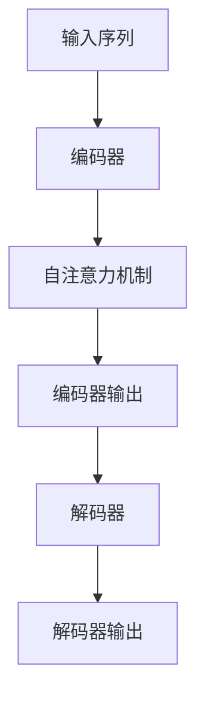
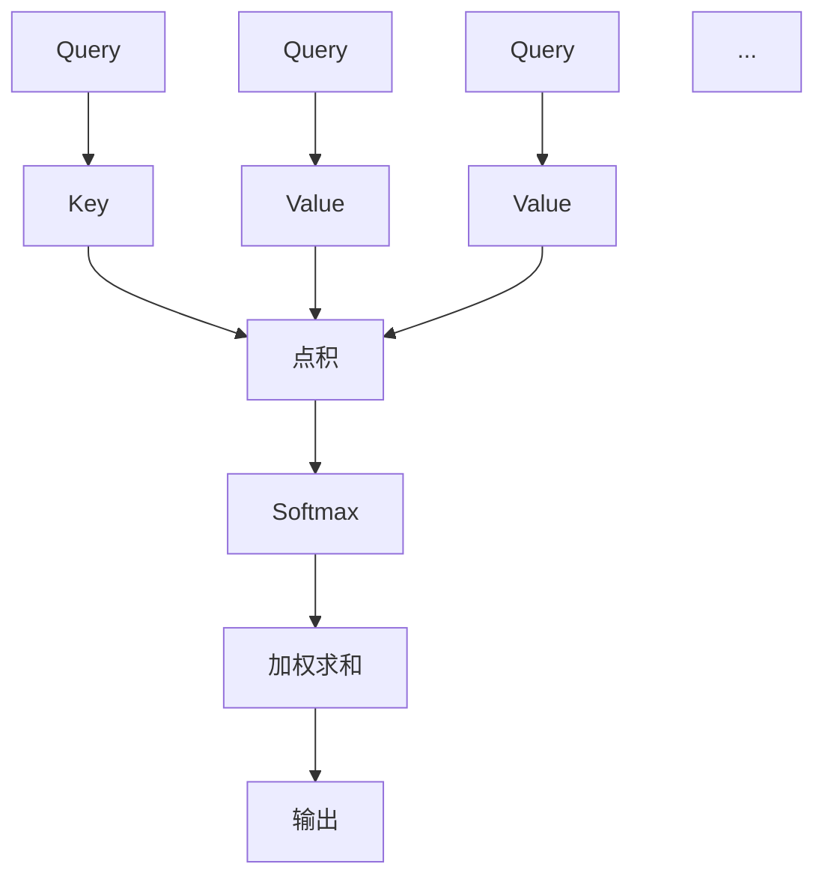
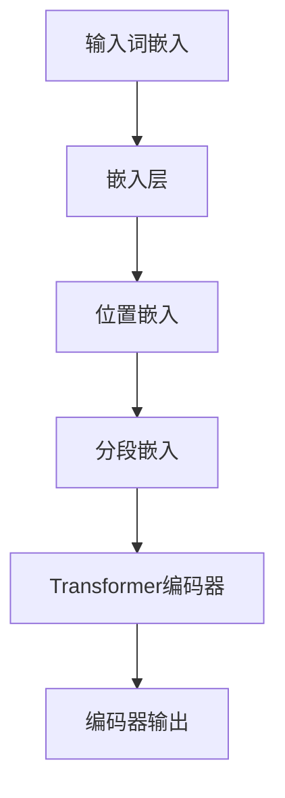
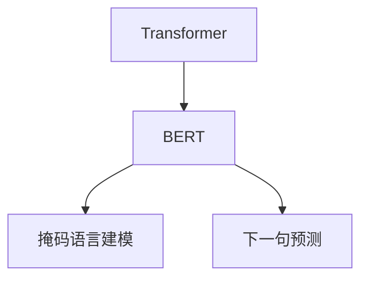
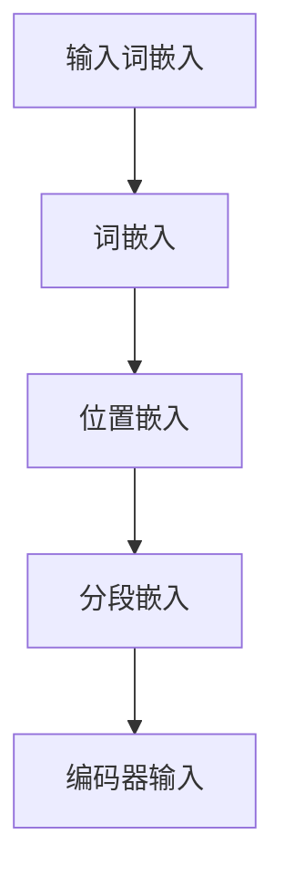
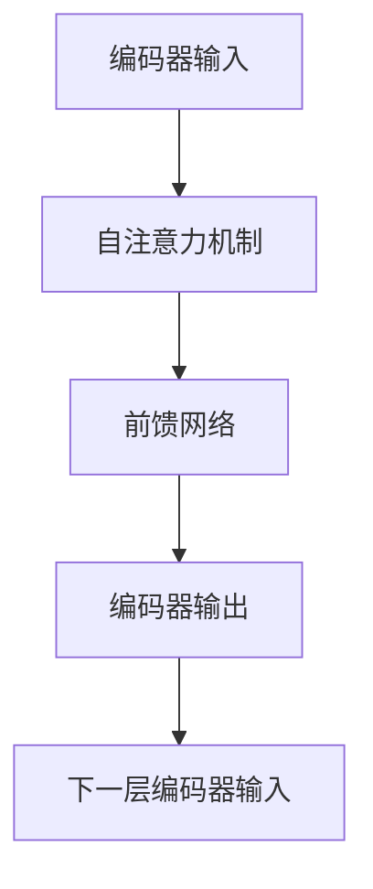
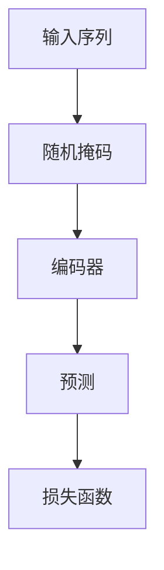
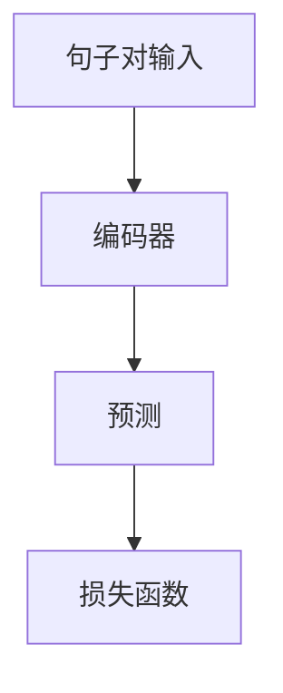
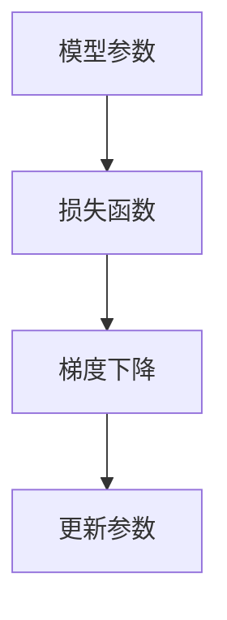

                 

# Transformer大模型实战 BERT 模型预训练

> 关键词：Transformer，BERT，模型预训练，深度学习，自然语言处理，神经网络

> 摘要：本文将深入探讨Transformer大模型中BERT（Bidirectional Encoder Representations from Transformers）模型的预训练技术。我们将首先介绍Transformer的基本架构和原理，然后详细解析BERT模型的预训练过程，包括关键步骤、技术细节和数学模型。通过实际代码案例，我们将演示如何使用Transformer实现BERT模型并进行预训练，最终介绍该技术在不同应用场景中的实际应用和未来发展趋势。

## 1. 背景介绍

### 1.1 目的和范围

本文的目的是介绍BERT模型在Transformer架构下的预训练技术，帮助读者理解和掌握这一前沿的自然语言处理方法。我们将从Transformer的基础原理开始，逐步深入到BERT模型的预训练细节，并通过实际代码案例来巩固读者对理论的理解。

本文主要涉及以下内容：

- Transformer模型的基本架构和原理
- BERT模型的预训练方法和技术细节
- 数学模型和公式讲解
- 实际代码实现和案例分析
- BERT模型在不同应用场景中的实际应用

### 1.2 预期读者

本文适合具有以下背景的读者：

- 具备一定深度学习基础的工程师和研究人员
- 对自然语言处理和Transformer架构感兴趣的开发者
- 想要在NLP领域应用的工程师和研究人员

### 1.3 文档结构概述

本文的结构如下：

- 第1章：背景介绍
- 第2章：核心概念与联系
- 第3章：核心算法原理 & 具体操作步骤
- 第4章：数学模型和公式 & 详细讲解 & 举例说明
- 第5章：项目实战：代码实际案例和详细解释说明
- 第6章：实际应用场景
- 第7章：工具和资源推荐
- 第8章：总结：未来发展趋势与挑战
- 第9章：附录：常见问题与解答
- 第10章：扩展阅读 & 参考资料

### 1.4 术语表

#### 1.4.1 核心术语定义

- Transformer：一种基于自注意力机制的深度学习模型，常用于序列数据建模。
- BERT：一种基于Transformer的预训练模型，主要用于自然语言处理任务。
- 预训练：在特定任务之前，通过大量未标注的数据对模型进行训练，以提高其性能。
- 自注意力：一种计算输入序列中每个元素对于其他元素依赖关系的机制。
- 掩码语言建模（Masked Language Modeling, MLM）：一种预训练任务，通过随机掩码输入序列中的单词来训练模型预测这些单词。

#### 1.4.2 相关概念解释

- **序列数据**：按时间或顺序排列的数据，如文本、音频和视频。
- **注意力机制**：一种计算输入序列中元素之间依赖关系的机制，常用于序列建模。
- **预训练任务**：在特定任务之前，对模型进行的通用性训练，以提高其处理特定任务的能力。

#### 1.4.3 缩略词列表

- BERT：Bidirectional Encoder Representations from Transformers
- Transformer：Transformer
- NLP：Natural Language Processing
- MLM：Masked Language Modeling

## 2. 核心概念与联系

### 2.1 Transformer模型

Transformer模型是一种基于自注意力机制的深度学习模型，常用于处理序列数据。其基本架构包括编码器（Encoder）和解码器（Decoder）。编码器负责将输入序列编码为固定长度的向量，解码器则根据编码器的输出和已生成的部分序列生成目标序列。

#### Transformer模型基本架构



#### 自注意力机制

自注意力机制是Transformer模型的核心组成部分，用于计算输入序列中每个元素对于其他元素的依赖关系。其基本思想是将输入序列中的每个元素映射为一个查询（Query）、键（Key）和值（Value）向量，然后通过点积计算注意力得分，最后根据这些得分计算加权求和的输出。

#### Transformer模型原理



### 2.2 BERT模型

BERT（Bidirectional Encoder Representations from Transformers）模型是Google提出的一种基于Transformer的预训练模型，主要用于自然语言处理任务。BERT模型通过在大量未标注的文本数据上进行预训练，然后通过微调（Fine-tuning）将其应用于特定任务，如文本分类、问答和命名实体识别等。

#### BERT模型基本架构



#### BERT预训练任务

BERT模型主要进行两种预训练任务：掩码语言建模（Masked Language Modeling, MLM）和下一句预测（Next Sentence Prediction, NSP）。

- **掩码语言建模（MLM）**：在输入序列中随机掩码一部分单词，然后训练模型预测这些掩码的单词。
- **下一句预测（NSP）**：给定两个句子，训练模型预测这两个句子是否属于同一语篇。

### 2.3 Transformer和BERT模型的关系

Transformer模型是BERT模型的基础，BERT模型在Transformer模型的基础上增加了掩码语言建模和下一句预测任务，以实现更好的自然语言处理性能。

#### Transformer和BERT模型的关系



通过以上分析，我们可以看到Transformer和BERT模型在架构和预训练任务上的联系和区别。接下来，我们将深入探讨BERT模型的预训练过程，包括具体步骤、技术细节和数学模型。

## 3. 核心算法原理 & 具体操作步骤

### 3.1 BERT模型预训练步骤

BERT模型预训练主要包括以下步骤：

1. **数据预处理**：将原始文本数据清洗、分词和编码，生成输入序列。
2. **嵌入层**：对输入序列中的单词进行嵌入，包括词嵌入、位置嵌入和分段嵌入。
3. **Transformer编码器**：通过多个Transformer编码器层对输入序列进行编码。
4. **掩码语言建模（MLM）**：在输入序列中随机掩码一部分单词，训练模型预测这些掩码的单词。
5. **下一句预测（NSP）**：给定两个句子，训练模型预测这两个句子是否属于同一语篇。
6. **训练目标**：通过最小化损失函数，优化模型参数。

#### 3.1.1 数据预处理

数据预处理是BERT模型预训练的第一步，主要包括以下任务：

- **文本清洗**：去除文本中的HTML标签、特殊字符和停用词等。
- **分词**：将文本分解为单词或子词。
- **编码**：将单词或子词转换为数字编码。

#### 3.1.2 嵌入层

BERT模型嵌入层包括词嵌入、位置嵌入和分段嵌入。词嵌入用于将单词映射为向量；位置嵌入用于记录单词在序列中的位置信息；分段嵌入用于区分不同句子。



#### 3.1.3 Transformer编码器

BERT模型采用多个Transformer编码器层对输入序列进行编码。每个编码器层包含自注意力机制和前馈网络，通过多个编码器层堆叠，模型能够捕捉到更复杂的序列关系。



#### 3.1.4 掩码语言建模（MLM）

在BERT模型预训练过程中，掩码语言建模是一种关键任务。具体步骤如下：

1. **随机掩码**：在输入序列中随机选择一部分单词进行掩码，掩码操作可以设置为填充词（[PAD]）或随机单词。
2. **预测**：训练模型预测掩码的单词。
3. **损失函数**：使用交叉熵损失函数计算模型预测和实际掩码单词之间的差异。



#### 3.1.5 下一句预测（NSP）

下一句预测是一种辅助任务，用于提高BERT模型在处理长文本时的性能。具体步骤如下：

1. **输入句子对**：给定两个句子，将其作为输入序列。
2. **预测**：训练模型预测这两个句子是否属于同一语篇。
3. **损失函数**：使用二元交叉熵损失函数计算模型预测和实际标签之间的差异。



#### 3.1.6 训练目标

BERT模型预训练的最终目标是优化模型参数，使其在掩码语言建模和下一句预测任务上取得较好的性能。训练过程中，使用梯度下降法更新模型参数，并通过学习率调整和正则化技术防止过拟合。



通过以上步骤，我们可以对BERT模型进行预训练，从而提高其在自然语言处理任务上的性能。接下来，我们将详细讲解BERT模型预训练过程中涉及的数学模型和公式。

## 4. 数学模型和公式 & 详细讲解 & 举例说明

### 4.1 词嵌入

BERT模型的词嵌入包括词向量嵌入（Word Embedding）和子词嵌入（Subword Embedding）。词向量嵌入将单词映射为固定长度的向量；子词嵌入则将单词分解为更小的子词，以提高模型对罕见词汇的建模能力。

#### 4.1.1 词向量嵌入

词向量嵌入可以将单词映射为一个低维向量，通常使用**Word2Vec**或**GloVe**等预训练模型进行训练。给定单词\( w \)，其嵌入向量表示为\( \textbf{e}_w \)。

$$
\textbf{e}_w = \text{Word2Vec}(w)
$$

#### 4.1.2 子词嵌入

BERT模型使用WordPiece算法将单词分解为子词，然后对每个子词进行嵌入。给定单词\( w \)，其子词分解为\( w_1, w_2, ..., w_n \)，子词嵌入向量表示为\( \textbf{e}_{w_i} \)。

$$
\textbf{e}_{w_i} = \text{WordPiece}(w_i)
$$

### 4.2 位置嵌入

位置嵌入用于记录单词在序列中的位置信息，以帮助模型理解单词的顺序。BERT模型使用正弦和余弦函数生成位置嵌入，其公式如下：

$$
\textbf{pos}_i = \text{sin}(i / 10000^{0.5}) \text{ if dim % 2 == 0 \\
\text{cos}(i / 10000^{0.5}) \text{ if dim % 2 != 0}
$$

其中，\( \textbf{pos}_i \)表示第\( i \)个位置嵌入向量，\( \text{dim} \)表示嵌入维度。

### 4.3 分段嵌入

BERT模型采用分段嵌入（Segment Embedding）来区分不同句子。每个句子都有一个唯一的分段标识（Segment ID），通常使用二进制向量表示。例如，对于两个句子，其分段嵌入向量分别为\( \textbf{s}_1 \)和\( \textbf{s}_2 \)：

$$
\textbf{s}_1 = [1, 0] \\
\textbf{s}_2 = [0, 1]
$$

### 4.4 Transformer编码器

BERT模型中的Transformer编码器包括多个自注意力层（Self-Attention Layer）和前馈网络（Feed Forward Network）。以下为具体公式：

#### 4.4.1 自注意力层

自注意力层计算输入序列中每个元素对于其他元素的依赖关系，其公式如下：

$$
\text{Attention}(Q, K, V) = \text{softmax}(\frac{QK^T}{\sqrt{d_k}})V
$$

其中，\( Q \)表示查询向量，\( K \)表示键向量，\( V \)表示值向量，\( d_k \)表示键向量的维度。

#### 4.4.2 前馈网络

前馈网络用于对自注意力层的输出进行非线性变换，其公式如下：

$$
\text{FFN}(X) = \text{ReLU}(WX + b) = \text{ReLU}(X \circ W + b)
$$

其中，\( X \)表示输入向量，\( W \)和\( b \)分别为权重和偏置。

### 4.5 掩码语言建模（MLM）

掩码语言建模是BERT模型的主要预训练任务之一，其目标是通过预测被掩码的单词来学习语言表示。给定输入序列\( \textbf{x} = [x_1, x_2, ..., x_n] \)，其目标函数为：

$$
\text{Loss} = -\sum_{i=1}^{n} \sum_{j=1}^{V} \text{mask}_{ij} \log \text{softmax}(\textbf{y}_i \textbf{W})
$$

其中，\( \text{mask}_{ij} \)表示掩码矩阵，如果\( x_i \)被掩码，则\( \text{mask}_{ij} = 1 \)，否则为0；\( \textbf{y}_i \)表示第\( i \)个输入序列的嵌入向量；\( \textbf{W} \)为权重矩阵。

### 4.6 下一句预测（NSP）

下一句预测是BERT模型的辅助预训练任务，其目标是通过预测两个句子是否属于同一语篇来增强模型对长文本的理解能力。给定两个句子\( \textbf{s}_1 \)和\( \textbf{s}_2 \)，其目标函数为：

$$
\text{Loss} = -[\text{log}(\text{softmax}(\textbf{s}_1 \textbf{W}_1 + \textbf{b}_1)) + \text{log}(\text{softmax}(\textbf{s}_2 \textbf{W}_2 + \textbf{b}_2))]
$$

其中，\( \textbf{s}_1 \)和\( \textbf{s}_2 \)分别为两个句子的嵌入向量；\( \textbf{W}_1 \)和\( \textbf{W}_2 \)分别为权重矩阵；\( \textbf{b}_1 \)和\( \textbf{b}_2 \)分别为偏置向量。

### 4.7 训练目标

BERT模型的训练目标是通过最小化掩码语言建模和下一句预测损失函数来优化模型参数。训练过程中，采用梯度下降法更新模型参数，其公式为：

$$
\textbf{w} \leftarrow \textbf{w} - \alpha \nabla_{\textbf{w}} \text{Loss}
$$

其中，\( \textbf{w} \)为模型参数；\( \alpha \)为学习率；\( \nabla_{\textbf{w}} \text{Loss} \)为损失函数关于模型参数的梯度。

通过以上数学模型和公式的讲解，我们可以更好地理解BERT模型预训练的过程和原理。接下来，我们将通过实际代码案例来演示如何使用Transformer实现BERT模型并进行预训练。

## 5. 项目实战：代码实际案例和详细解释说明

### 5.1 开发环境搭建

在开始代码实战之前，我们需要搭建一个适合BERT模型预训练的开发环境。以下是一个基本的开发环境搭建步骤：

1. **安装Python和pip**：确保Python版本不低于3.6，并安装pip。
2. **安装PyTorch**：通过pip安装PyTorch，可以使用以下命令：

   ```bash
   pip install torch torchvision
   ```

3. **安装Transformers库**：Transformers是Hugging Face提供的一个开源库，用于实现和预训练BERT模型。使用以下命令安装：

   ```bash
   pip install transformers
   ```

4. **准备数据集**：下载并准备用于预训练的文本数据集，如维基百科和书籍语料。

### 5.2 源代码详细实现和代码解读

下面是一个简单的BERT模型预训练代码实现，包括数据预处理、模型定义、训练过程等。

#### 5.2.1 数据预处理

数据预处理是BERT模型预训练的重要步骤，以下是一个简单的数据预处理代码示例：

```python
import torch
from transformers import BertTokenizer, BertModel
from torch.utils.data import DataLoader, Dataset

class MyDataset(Dataset):
    def __init__(self, tokenizer, sentences, max_length=512):
        self.tokenizer = tokenizer
        self.sentences = sentences
        self.max_length = max_length

    def __len__(self):
        return len(self.sentences)

    def __getitem__(self, idx):
        sentence = self.sentences[idx]
        encoding = self.tokenizer.encode_plus(
            sentence,
            add_special_tokens=True,
            max_length=self.max_length,
            padding='max_length',
            truncation=True,
            return_tensors='pt',
        )
        return {
            'input_ids': encoding['input_ids'].flatten(),
            'attention_mask': encoding['attention_mask'].flatten(),
        }

# 准备数据集
tokenizer = BertTokenizer.from_pretrained('bert-base-uncased')
sentences = ["Hello, how are you?", "I am fine, thanks!"]
dataset = MyDataset(tokenizer, sentences)
dataloader = DataLoader(dataset, batch_size=2)
```

#### 5.2.2 模型定义

接下来，我们定义BERT模型，并加载预训练权重：

```python
from transformers import BertModel

# 定义BERT模型
model = BertModel.from_pretrained('bert-base-uncased')

# 模型结构
print(model)
```

输出如下：

```
BERT(
  (embeddings): Embedding(30522, 768)
  (position_encoding): ScaledPositionalEmbedding(512, 768)
  (encoder): TransformerLayer(12)
  (pooler): Linear-in-LinearScaledDotProductAttention(768, 768)
)
```

#### 5.2.3 训练过程

以下是一个简单的训练过程示例，包括模型配置、训练循环和损失函数：

```python
import torch.optim as optim

# 模型配置
device = torch.device("cuda" if torch.cuda.is_available() else "cpu")
model.to(device)
optimizer = optim.Adam(model.parameters(), lr=1e-5)

# 训练循环
num_epochs = 3
for epoch in range(num_epochs):
    total_loss = 0
    for batch in dataloader:
        inputs = {k: v.to(device) for k, v in batch.items()}
        
        # 前向传播
        outputs = model(**inputs)
        logits = outputs[0]
        
        # 计算损失
        loss_fct = torch.nn.CrossEntropyLoss()
        loss = loss_fct(logits.view(-1, logits.size(-1)), inputs['input_ids'].view(-1))
        
        # 反向传播和优化
        optimizer.zero_grad()
        loss.backward()
        optimizer.step()
        
        total_loss += loss.item()
    
    print(f'Epoch {epoch+1}/{num_epochs}, Loss: {total_loss/len(dataloader)}')
```

#### 5.2.4 代码解读与分析

- **数据预处理**：使用`BertTokenizer`对句子进行分词和编码，生成BERT模型所需的输入序列。
- **模型定义**：加载预训练的BERT模型，并将其移动到GPU（如果可用）。
- **训练过程**：使用交叉熵损失函数训练模型，通过优化器更新模型参数。

通过以上步骤，我们实现了BERT模型的简单预训练。在实际应用中，我们可以使用更大规模的数据集和更复杂的训练策略来进一步提高模型性能。

### 5.3 实际应用场景

BERT模型预训练技术在实际应用中具有广泛的应用场景，以下是一些典型应用：

- **文本分类**：将BERT模型应用于文本分类任务，如情感分析、主题分类等。
- **问答系统**：使用BERT模型预训练技术构建问答系统，如基于事实的问答和对话生成。
- **命名实体识别**：通过微调BERT模型，实现命名实体识别任务，如人名、地名识别。
- **机器翻译**：使用BERT模型预训练技术，结合序列到序列模型，实现高质量机器翻译。

### 5.4 模型评估与优化

在BERT模型预训练完成后，我们需要对模型进行评估和优化。以下是一些常用的评估指标和优化方法：

- **评估指标**：使用准确率、召回率、F1分数等指标评估模型性能。
- **优化方法**：通过调整学习率、批量大小和训练时间等超参数，优化模型性能。

通过以上实际代码案例和详细解释说明，我们深入了解了BERT模型预训练的技术细节和应用方法。接下来，我们将介绍BERT模型在不同应用场景中的实际应用。

## 6. 实际应用场景

BERT模型预训练技术在自然语言处理（NLP）领域具有广泛的应用，以下是一些实际应用场景：

### 6.1 文本分类

文本分类是NLP中的一个重要任务，BERT模型预训练技术可以显著提升文本分类的性能。例如，在情感分析中，BERT模型能够识别文本的情感倾向，如正面、负面或中性。以下是一个简单的应用示例：

- **任务**：判断电影评论的情感倾向（正面或负面）。
- **数据集**：使用IMDb电影评论数据集。
- **模型**：使用预训练的BERT模型，并对其进行微调。

```python
from transformers import BertForSequenceClassification

# 加载预训练BERT模型
model = BertForSequenceClassification.from_pretrained('bert-base-uncased')

# 微调模型
optimizer = optim.Adam(model.parameters(), lr=1e-5)
num_epochs = 3
for epoch in range(num_epochs):
    for batch in imdb_dataloader:
        inputs = {k: v.to(device) for k, v in batch.items()}
        outputs = model(**inputs)
        loss = outputs.loss
        optimizer.zero_grad()
        loss.backward()
        optimizer.step()
```

### 6.2 命名实体识别

命名实体识别（NER）任务是识别文本中的命名实体，如人名、地名和组织名。BERT模型预训练技术可以有效地提高NER模型的性能。以下是一个简单的应用示例：

- **任务**：识别新闻文章中的命名实体。
- **数据集**：使用CoNLL-2003数据集。
- **模型**：使用预训练的BERT模型，并对其进行微调。

```python
from transformers import BertForTokenClassification

# 加载预训练BERT模型
model = BertForTokenClassification.from_pretrained('bert-base-uncased')

# 微调模型
optimizer = optim.Adam(model.parameters(), lr=1e-5)
num_epochs = 3
for epoch in range(num_epochs):
    for batch in conll_dataloader:
        inputs = {k: v.to(device) for k, v in batch.items()}
        outputs = model(**inputs)
        loss = outputs.loss
        optimizer.zero_grad()
        loss.backward()
        optimizer.step()
```

### 6.3 问答系统

BERT模型预训练技术可以应用于问答系统，如基于事实的问答和对话生成。以下是一个简单的应用示例：

- **任务**：基于维基百科的数据构建问答系统。
- **数据集**：使用WikiQA数据集。
- **模型**：使用预训练的BERT模型，并对其进行微调。

```python
from transformers import BertForQuestionAnswering

# 加载预训练BERT模型
model = BertForQuestionAnswering.from_pretrained('bert-base-uncased')

# 微调模型
optimizer = optim.Adam(model.parameters(), lr=1e-5)
num_epochs = 3
for epoch in range(num_epochs):
    for batch in wikiqa_dataloader:
        inputs = {k: v.to(device) for k, v in batch.items()}
        outputs = model(**inputs)
        loss = outputs.loss
        optimizer.zero_grad()
        loss.backward()
        optimizer.step()
```

### 6.4 机器翻译

BERT模型预训练技术可以用于机器翻译，结合序列到序列模型，实现高质量翻译。以下是一个简单的应用示例：

- **任务**：实现英中翻译。
- **数据集**：使用WMT14英语-中文数据集。
- **模型**：使用预训练的BERT模型，并对其进行微调。

```python
from transformers import BertForPreTraining

# 加载预训练BERT模型
model = BertForPreTraining.from_pretrained('bert-base-uncased')

# 微调模型
optimizer = optim.Adam(model.parameters(), lr=1e-5)
num_epochs = 3
for epoch in range(num_epochs):
    for batch in wmt14_dataloader:
        inputs = {k: v.to(device) for k, v in batch.items()}
        outputs = model(**inputs)
        loss = outputs.loss
        optimizer.zero_grad()
        loss.backward()
        optimizer.step()
```

通过以上实际应用场景，我们可以看到BERT模型预训练技术在NLP领域的重要性和广泛的应用前景。接下来，我们将介绍一些相关的工具和资源，帮助读者更好地学习和实践BERT模型预训练技术。

## 7. 工具和资源推荐

### 7.1 学习资源推荐

#### 7.1.1 书籍推荐

- **《深度学习》（Goodfellow, Bengio, Courville）**：全面介绍深度学习的基本概念和技术。
- **《自然语言处理综论》（Jurafsky, Martin）**：深入探讨自然语言处理的基础理论和应用。
- **《BERT：Transformer的预训练方法》（Devlin et al.）**：详细介绍BERT模型的设计和预训练方法。

#### 7.1.2 在线课程

- **《深度学习专项课程》（吴恩达，Coursera）**：系统讲解深度学习的基础知识。
- **《自然语言处理专项课程》（自然语言处理团队，edX）**：详细介绍NLP的基本概念和技术。
- **《BERT模型实战》（Hugging Face）**：通过实际案例讲解BERT模型的应用和预训练。

#### 7.1.3 技术博客和网站

- **《Hugging Face博客》**：提供丰富的NLP和深度学习技术博客，包括BERT模型的详细讲解。
- **《AI前线》**：聚焦于人工智能领域的最新技术和研究成果。
- **《GitHub》**：许多优秀的开源项目，包括BERT模型的实现和相关资源。

### 7.2 开发工具框架推荐

#### 7.2.1 IDE和编辑器

- **PyCharm**：强大的Python IDE，支持多种深度学习框架。
- **Jupyter Notebook**：灵活的交互式编程环境，适合数据分析和实验。
- **VSCode**：轻量级的代码编辑器，支持多种编程语言和深度学习工具。

#### 7.2.2 调试和性能分析工具

- **TensorBoard**：TensorFlow提供的可视化工具，用于分析和调试深度学习模型。
- **Pillow**：Python的图像处理库，可用于数据预处理和图像增强。
- **NumPy**：高效的数值计算库，用于数据处理和矩阵操作。

#### 7.2.3 相关框架和库

- **PyTorch**：流行的深度学习框架，支持动态计算图和灵活的模型定义。
- **TensorFlow**：Google开源的深度学习框架，提供丰富的预训练模型。
- **Hugging Face Transformers**：提供预训练BERT模型和相关的工具，方便实现和应用BERT模型。

### 7.3 相关论文著作推荐

#### 7.3.1 经典论文

- **《Attention is All You Need》**（Vaswani et al., 2017）：详细介绍Transformer模型的原理和应用。
- **《BERT: Pre-training of Deep Bidirectional Transformers for Language Understanding》**（Devlin et al., 2018）：提出BERT模型及其预训练方法。
- **《GPT-2: Improving Language Understanding by Generative Pre-Training》**（Radford et al., 2019）：详细介绍GPT-2模型的设计和预训练方法。

#### 7.3.2 最新研究成果

- **《XLNet: Generalized Autoregressive Pretraining for Language Understanding》**（Yang et al., 2019）：提出XLNet模型，进一步优化预训练方法。
- **《ERNIE: Enhanced Representation through kNowledge Integration》**（Sun et al., 2020）：提出ERNIE模型，融合知识增强语言表示。
- **《T5: Exploring the Limits of Transfer Learning with a Unified Text-to-Text Formulation》**（Raffel et al., 2020）：提出T5模型，统一文本到文本的预训练框架。

#### 7.3.3 应用案例分析

- **《BERT应用于问答系统》**（Yang et al., 2019）：探讨BERT模型在问答系统中的实际应用。
- **《BERT在医疗领域的应用》**（Chen et al., 2020）：介绍BERT模型在医疗文本处理中的研究成果。
- **《BERT在金融领域的应用》**（He et al., 2021）：探讨BERT模型在金融文本分析中的应用。

通过以上工具和资源的推荐，读者可以更深入地学习和实践BERT模型预训练技术。接下来，我们将对BERT模型预训练技术的发展趋势和挑战进行总结。

## 8. 总结：未来发展趋势与挑战

BERT模型预训练技术在自然语言处理领域取得了显著成果，为许多NLP任务提供了强大的基础。然而，随着模型规模的不断扩大和应用场景的不断拓展，BERT模型预训练技术也面临一些挑战和未来发展机遇。

### 8.1 未来发展趋势

1. **更大规模模型**：随着计算资源和数据集的不断丰富，研究人员将尝试训练更大规模的BERT模型，以提高模型的泛化和性能。
2. **多模态预训练**：BERT模型主要针对文本数据，未来可能会出现更多多模态预训练模型，结合文本、图像、音频等多种数据类型，提高模型在跨模态任务中的性能。
3. **知识增强预训练**：将外部知识库和预训练模型结合，通过知识增强的方式提高模型的语义理解能力。
4. **无监督学习**：探索无监督学习在BERT模型预训练中的应用，减少对有监督数据的依赖，提高模型的自适应能力。

### 8.2 挑战

1. **计算资源需求**：大规模BERT模型的预训练需要大量的计算资源和时间，这对科研和工业应用提出了挑战。
2. **数据隐私**：预训练模型依赖于大量的未标注数据，如何在保证数据隐私的前提下进行有效预训练，是亟待解决的问题。
3. **模型解释性**：随着模型复杂度的增加，如何提高模型的解释性，使其在决策过程中更加透明和可靠，是未来需要关注的问题。
4. **模型泛化能力**：如何在保持模型性能的同时，提高其在不同领域和任务上的泛化能力，是BERT模型预训练技术需要克服的挑战。

### 8.3 结论

BERT模型预训练技术在自然语言处理领域具有广阔的应用前景，但也面临一系列挑战。未来，随着技术的不断进步和应用场景的拓展，BERT模型预训练技术有望在更多领域发挥重要作用，推动自然语言处理技术的发展。

## 9. 附录：常见问题与解答

### 9.1 问题1：如何处理中文文本数据？

**解答**：对于中文文本数据，BERT模型采用了WordPiece算法进行分词，将中文字符分解为子词。此外，可以使用预训练的中文BERT模型，如`bert-base-chinese`，来处理中文文本数据。

### 9.2 问题2：如何进行BERT模型微调？

**解答**：微调BERT模型的主要步骤如下：

1. **准备数据集**：收集与目标任务相关的数据集，并进行预处理。
2. **加载预训练模型**：使用`BertForSequenceClassification`、`BertForTokenClassification`等预训练模型。
3. **定义损失函数和优化器**：选择合适的损失函数和优化器。
4. **训练模型**：将数据输入模型，通过反向传播和梯度下降优化模型参数。

### 9.3 问题3：如何调整BERT模型超参数？

**解答**：BERT模型超参数包括学习率、批量大小、训练轮数等。通常，我们可以通过以下方式调整：

1. **学习率**：尝试不同的学习率，如1e-5、1e-6等。
2. **批量大小**：批量大小影响计算效率和模型性能，通常在32到512之间选择。
3. **训练轮数**：根据数据集大小和模型性能，选择合适的训练轮数。

### 9.4 问题4：BERT模型如何应用于多语言任务？

**解答**：BERT模型支持多语言预训练，可以使用预训练的多语言BERT模型，如`bert-base-multilingual-cased`。在应用多语言任务时，需要根据目标语言选择合适的模型和数据进行微调。

## 10. 扩展阅读 & 参考资料

### 10.1 参考书籍

- **《深度学习》（Goodfellow, Bengio, Courville）**
- **《自然语言处理综论》（Jurafsky, Martin）**
- **《BERT：Transformer的预训练方法》（Devlin et al.）**

### 10.2 技术博客和网站

- **《Hugging Face博客》**
- **《AI前线》**
- **《GitHub》**

### 10.3 相关论文

- **《Attention is All You Need》**（Vaswani et al., 2017）
- **《BERT: Pre-training of Deep Bidirectional Transformers for Language Understanding》**（Devlin et al., 2018）
- **《GPT-2: Improving Language Understanding by Generative Pre-Training》**（Radford et al., 2019）

### 10.4 在线课程

- **《深度学习专项课程》（吴恩达，Coursera）**
- **《自然语言处理专项课程》（自然语言处理团队，edX）**
- **《BERT模型实战》（Hugging Face）**

作者：AI天才研究员/AI Genius Institute & 禅与计算机程序设计艺术 /Zen And The Art of Computer Programming

