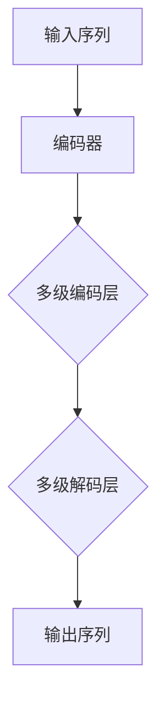
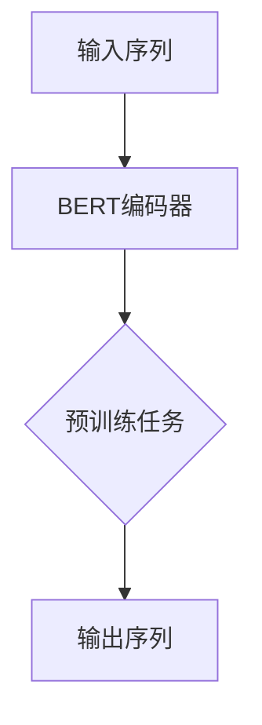
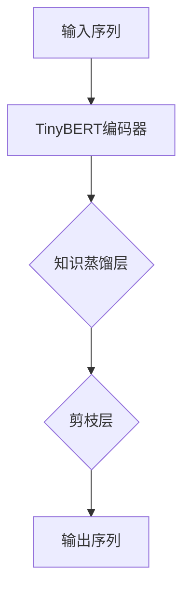
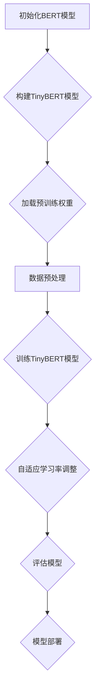

                 

### Transformer大模型实战：TinyBERT模型简介

> **关键词：** Transformer、BERT、TinyBERT、大模型、深度学习、NLP、模型压缩、高效部署

**摘要：** 本篇文章将深入探讨Transformer大模型中的一种重要模型——TinyBERT。通过对TinyBERT的背景介绍、核心概念与联系、算法原理与操作步骤、数学模型与公式、实际应用场景等多个维度的详细解析，我们将全面了解TinyBERT的独特优势以及在自然语言处理（NLP）领域的广泛应用。文章还将推荐相关学习资源、开发工具和最新研究成果，最后对TinyBERT的未来发展趋势与挑战进行总结。旨在为读者提供一份全面、系统、实用的Transformer大模型实战指南。

## 1. 背景介绍

### 1.1 目的和范围

本文的目标是帮助读者深入了解TinyBERT模型，理解其核心原理和应用场景，并掌握如何在实际项目中实现和应用TinyBERT。随着深度学习和自然语言处理（NLP）技术的不断发展，大模型如BERT、GPT等在学术界和工业界取得了显著成果。然而，这些大模型的计算资源和存储需求极高，限制了它们在资源受限环境中的应用。TinyBERT作为对BERT模型的一种轻量化改进，通过模型压缩技术有效地降低了模型的尺寸和计算复杂度，使得大模型在资源受限的场景下仍能发挥强大的NLP能力。本文将围绕TinyBERT的背景、原理、实现和应用等方面展开讨论，旨在为读者提供一份全面的技术指南。

### 1.2 预期读者

本文适合对自然语言处理（NLP）和深度学习有一定了解的读者，包括但不限于以下几类：

1. **研究人员和开发者：** 对Transformer模型、BERT模型和TinyBERT模型感兴趣，希望深入了解其原理和实现方法的研究人员和开发者。
2. **工程师和架构师：** 在实际项目中需要处理大规模文本数据的工程师和架构师，希望通过本文了解如何高效地部署TinyBERT模型。
3. **学生和学者：** 在计算机科学、人工智能或相关领域学习的学生和学者，希望通过本文掌握Transformer大模型的实战技巧。
4. **技术爱好者：** 对最新技术趋势和前沿应用感兴趣的技术爱好者，希望通过本文了解TinyBERT在NLP领域的应用和潜力。

### 1.3 文档结构概述

本文结构如下：

1. **背景介绍：** 简要介绍Transformer大模型和TinyBERT的背景、目的和预期读者。
2. **核心概念与联系：** 详细讲解TinyBERT的核心概念和与其他模型的关系，包括BERT模型和Transformer模型。
3. **核心算法原理 & 具体操作步骤：** 通过伪代码和流程图，详细阐述TinyBERT的算法原理和实现步骤。
4. **数学模型和公式 & 详细讲解 & 举例说明：** 分析TinyBERT的数学模型和公式，通过实际例子进行详细讲解。
5. **项目实战：代码实际案例和详细解释说明：** 搭建TinyBERT的开发环境，展示源代码实现和详细解读。
6. **实际应用场景：** 分析TinyBERT在不同应用场景中的表现和优势。
7. **工具和资源推荐：** 推荐TinyBERT学习和应用的相关资源、工具和框架。
8. **总结：未来发展趋势与挑战：** 总结TinyBERT的发展趋势和面临的挑战。
9. **附录：常见问题与解答：** 回答读者可能遇到的问题和疑惑。
10. **扩展阅读 & 参考资料：** 提供TinyBERT和相关领域的扩展阅读和参考资料。

通过上述结构，本文将全面、系统地介绍TinyBERT模型，帮助读者深入理解其原理和应用，为实际项目提供技术支持。

### 1.4 术语表

在本篇文章中，我们将使用一些专业术语和技术概念。以下是对这些术语的定义和解释：

#### 1.4.1 核心术语定义

- **Transformer模型：** 一种基于自注意力机制的全关注模型，首次在论文《Attention is All You Need》中提出。它通过多头注意力机制和位置编码，能够对输入序列进行全局建模。
- **BERT模型：** 一种基于Transformer的大规模预训练模型，全称为Bidirectional Encoder Representations from Transformers。BERT通过双向编码器结构，能够捕捉输入序列的上下文信息。
- **TinyBERT：** 一种对BERT模型进行轻量化改进的模型，通过模型压缩技术（如知识蒸馏和剪枝）减小模型尺寸和计算复杂度，从而在资源受限的环境中实现高效部署。
- **自注意力（Self-Attention）：** 一种注意力机制，用于计算序列中每个元素与其他元素之间的关联度，从而对输入序列进行全局建模。
- **知识蒸馏（Knowledge Distillation）：** 一种模型压缩技术，通过将一个大模型（教师模型）的知识传递给一个小模型（学生模型），从而减小模型尺寸和计算复杂度。
- **剪枝（Pruning）：** 一种模型压缩技术，通过移除模型中不重要的神经元或参数，来减小模型尺寸和计算复杂度。
- **预训练（Pre-training）：** 一种训练方法，通过在大规模数据集上预先训练模型，使其具备一定的语义理解能力，然后再在特定任务上进行微调。

#### 1.4.2 相关概念解释

- **注意力机制（Attention Mechanism）：** 一种用于计算输入序列中不同元素之间关联度的机制，常见于NLP模型中，如Transformer和BERT。
- **位置编码（Positional Encoding）：** 一种用于引入输入序列位置信息的编码方法，常见于Transformer和BERT模型中。
- **多任务学习（Multi-Task Learning）：** 一种学习多个相关任务的方法，通过共享模型参数，提高模型在不同任务上的表现。
- **微调（Fine-tuning）：** 一种训练方法，通过对预先训练好的模型在特定任务上进行少量训练，使其适应新任务。

#### 1.4.3 缩略词列表

- **NLP：** 自然语言处理（Natural Language Processing）
- **Transformer：** 全关注模型（Transformer）
- **BERT：** 双向编码器代表从Transformer（Bidirectional Encoder Representations from Transformers）
- **TinyBERT：** 轻量化BERT（Tiny BERT）
- **自注意力：** 自注意力（Self-Attention）
- **知识蒸馏：** 知识蒸馏（Knowledge Distillation）
- **剪枝：** 剪枝（Pruning）
- **预训练：** 预训练（Pre-training）
- **微调：** 微调（Fine-tuning）

通过上述术语表，读者可以更好地理解本文中的专业术语和技术概念，为后续内容的阅读和理解打下基础。

## 2. 核心概念与联系

在探讨TinyBERT之前，有必要对Transformer模型、BERT模型以及TinyBERT与这些模型之间的联系进行详细介绍。这些模型在NLP领域中扮演着重要角色，而TinyBERT作为一种轻量化改进模型，能够在保留强大性能的同时，满足资源受限场景的需求。

### 2.1 Transformer模型

Transformer模型是由Vaswani等人于2017年提出的一种基于自注意力机制的全关注模型。与传统的循环神经网络（RNN）和卷积神经网络（CNN）相比，Transformer模型通过引入自注意力机制，能够对输入序列进行全局建模，从而在机器翻译、文本生成等NLP任务中取得显著成果。Transformer模型的主要特点包括：

- **多头注意力（Multi-Head Attention）：** Transformer模型中的自注意力机制通过多头注意力实现，能够同时关注输入序列的不同部分，提高模型的表示能力。
- **位置编码（Positional Encoding）：** 为了引入输入序列的位置信息，Transformer模型采用了一种简单有效的位置编码方法，使得模型能够理解序列的顺序关系。
- **编码器-解码器结构（Encoder-Decoder Architecture）：** Transformer模型采用编码器-解码器结构，编码器负责对输入序列进行编码，解码器负责生成输出序列。

Transformer模型的结构可以用Mermaid流程图表示如下：



### 2.2 BERT模型

BERT（Bidirectional Encoder Representations from Transformers）模型是Google团队于2018年提出的一种基于Transformer的大规模预训练模型。BERT模型通过双向编码器结构，能够捕捉输入序列的上下文信息，从而在多种NLP任务中表现出色。BERT模型的主要特点包括：

- **双向编码器（Bidirectional Encoder）：** BERT模型采用双向编码器结构，使得模型能够同时从正向和反向两个方向学习序列的上下文信息。
- **大规模预训练（Large-scale Pre-training）：** BERT模型在数十亿规模的文本语料库上进行预训练，从而获得强大的语义表示能力。
- **遮蔽语言模型（Masked Language Model）：** BERT模型采用遮蔽语言模型（MLM）进行预训练，通过随机遮蔽部分输入单词，迫使模型学习单词的上下文信息。

BERT模型的结构可以用Mermaid流程图表示如下：



### 2.3 TinyBERT模型

TinyBERT是对BERT模型进行轻量化改进的一种模型，通过模型压缩技术（如知识蒸馏和剪枝）减小模型尺寸和计算复杂度，从而在资源受限的环境中实现高效部署。TinyBERT的主要特点包括：

- **模型压缩（Model Compression）：** TinyBERT通过知识蒸馏和剪枝技术，将BERT模型的大小和计算复杂度降低，使其在移动端和嵌入式设备上具备应用潜力。
- **自适应学习率（Adaptive Learning Rate）：** TinyBERT采用自适应学习率策略，根据模型的训练进度动态调整学习率，提高训练效果。
- **通用性（Generalization）：** TinyBERT在保留强大性能的同时，具备良好的通用性，适用于多种NLP任务。

TinyBERT的结构可以看作是对BERT模型的简化版本，主要包含以下部分：



### 2.4 TinyBERT与其他模型的关系

TinyBERT与Transformer模型和BERT模型之间有着密切的联系。Transformer模型为TinyBERT提供了自注意力机制和编码器-解码器结构的基础，而BERT模型则为TinyBERT提供了大规模预训练和双向编码器结构的核心。TinyBERT通过对BERT模型的改进和压缩，实现了在资源受限场景下的高效部署，从而在保持强大性能的同时，满足实际应用的需求。

综上所述，Transformer模型、BERT模型和TinyBERT模型在NLP领域中扮演着重要角色。TinyBERT作为对BERT模型的轻量化改进，通过模型压缩技术提高了模型的可扩展性和适用性。理解这些核心概念和它们之间的关系，有助于读者更好地掌握TinyBERT模型，并在实际项目中应用。

## 3. 核心算法原理 & 具体操作步骤

在深入探讨TinyBERT模型的算法原理和具体操作步骤之前，我们需要先了解Transformer模型和BERT模型的基本原理。这些基本概念为理解TinyBERT的核心算法提供了必要的背景知识。

### 3.1 Transformer模型原理

Transformer模型是一种基于自注意力机制的编码器-解码器架构，其核心思想是通过计算输入序列中每个元素与其他元素之间的关联度，来实现对整个序列的全局建模。以下是Transformer模型的主要组件和原理：

1. **自注意力（Self-Attention）：**
   自注意力机制是Transformer模型的核心，通过计算序列中每个元素与其他元素之间的关联度，实现对输入序列的加权聚合。具体来说，自注意力机制通过以下三个向量来计算：
   - **查询向量（Query）：** 用于表示当前元素在序列中的重要性。
   - **键向量（Key）：** 用于表示其他元素在序列中的特征。
   - **值向量（Value）：** 用于聚合其他元素的特征，为当前元素提供上下文信息。
   
   自注意力机制的公式可以表示为：
   $$ 
   \text{Attention}(Q, K, V) = \text{softmax}\left(\frac{QK^T}{\sqrt{d_k}}\right) V
   $$
   其中，\(Q, K, V\) 分别是查询向量、键向量和值向量，\(d_k\) 是键向量的维度，\(\text{softmax}\) 函数用于计算每个元素的概率分布。

2. **多头注意力（Multi-Head Attention）：**
   Transformer模型通过多头注意力机制来提高模型的表示能力。多头注意力将自注意力机制扩展到多个独立的学习任务中，每个任务关注输入序列的不同部分。具体实现中，多头注意力会计算多个独立的自注意力机制，并将结果拼接起来。多头注意力的公式可以表示为：
   $$ 
   \text{Multi-Head Attention} = \text{Concat}(\text{head}_1, \text{head}_2, \ldots, \text{head}_h)W^O 
   $$
   其中，\(\text{head}_i\) 表示第 \(i\) 个自注意力头的输出，\(W^O\) 是输出线性层权重。

3. **编码器-解码器结构（Encoder-Decoder Architecture）：**
   Transformer模型采用编码器-解码器结构，编码器负责对输入序列进行编码，解码器负责生成输出序列。编码器由多个自注意力层和全连接层组成，解码器由自注意力层、编码器-解码器注意力层和全连接层组成。编码器-解码器注意力层用于解码器在每个时间步中关注编码器输出的不同部分。

### 3.2 BERT模型原理

BERT模型是基于Transformer的一种大规模预训练模型，其核心思想是通过在大量文本数据上预训练，使得模型具备强大的语义理解能力。BERT模型的主要组件和原理如下：

1. **预训练任务（Pre-training Task）：**
   BERT模型通过两种预训练任务来学习语义表示：
   - **遮蔽语言模型（Masked Language Model，MLM）：** 随机遮蔽输入文本中的部分单词，模型需要预测这些被遮蔽的单词。这迫使模型学习单词的上下文信息。
   - **下一句预测（Next Sentence Prediction，NSP）：** 给定两个连续的文本句子，模型需要预测这两个句子是否属于同一个句子对。

2. **双向编码器结构（Bidirectional Encoder）：**
   BERT模型采用双向编码器结构，使得模型能够同时从正向和反向两个方向学习序列的上下文信息。双向编码器由多个Transformer编码层组成，每层包含自注意力机制和前馈网络。

3. **位置编码（Positional Encoding）：**
   BERT模型采用位置编码方法来引入输入序列的位置信息。位置编码是一种对输入序列中每个元素的位置进行编码的方法，与自注意力机制相结合，使得模型能够理解序列的顺序关系。

### 3.3 TinyBERT模型原理

TinyBERT是对BERT模型进行轻量化改进的一种模型，通过模型压缩技术减小模型尺寸和计算复杂度。TinyBERT的主要原理包括：

1. **模型压缩技术（Model Compression Techniques）：**
   - **知识蒸馏（Knowledge Distillation）：** TinyBERT通过知识蒸馏技术，将BERT模型的知识传递给一个较小的学生模型。知识蒸馏过程中，教师模型（BERT）和教师模型（TinyBERT）的输出被用于训练学生模型，从而降低学生模型的尺寸和计算复杂度。
   - **剪枝（Pruning）：** TinyBERT通过剪枝技术移除模型中的不重要的神经元或参数，进一步减小模型尺寸。

2. **自适应学习率（Adaptive Learning Rate）：**
   TinyBERT采用自适应学习率策略，根据模型的训练进度动态调整学习率。自适应学习率能够提高训练效果，特别是在模型压缩过程中，有助于优化模型性能。

3. **通用性（Generalization）：**
   TinyBERT在保留强大性能的同时，具备良好的通用性，适用于多种NLP任务。通过预训练和模型压缩技术，TinyBERT能够适应不同的应用场景，满足实际需求。

### 3.4 TinyBERT操作步骤

以下是TinyBERT的具体操作步骤，包括模型构建、训练和部署：

1. **模型构建：**
   - **初始化BERT模型：** 使用预训练好的BERT模型作为教师模型。
   - **构建TinyBERT模型：** 定义TinyBERT模型结构，包括编码器、知识蒸馏层和剪枝层。
   - **加载预训练权重：** 将BERT模型的权重加载到TinyBERT模型中，作为初始权重。

2. **训练：**
   - **数据预处理：** 预处理训练数据，包括分词、编码和遮蔽等操作。
   - **训练循环：** 在每个训练迭代中，进行以下步骤：
     - **前向传播：** 对输入数据执行前向传播，得到Teacher模型和TinyBERT模型的输出。
     - **损失计算：** 计算Teacher模型和TinyBERT模型之间的损失，包括遮蔽语言模型损失和知识蒸馏损失。
     - **反向传播：** 计算梯度并更新TinyBERT模型的权重。
     - **自适应学习率调整：** 根据训练进度调整学习率。

3. **评估：**
   - **评估数据准备：** 准备评估数据集，包括输入序列和标签。
   - **模型评估：** 在评估数据集上对TinyBERT模型进行评估，计算准确率、F1分数等指标。

4. **部署：**
   - **模型转换：** 将TinyBERT模型转换为适合部署的格式，如ONNX、TorchScript等。
   - **模型部署：** 在目标设备上部署TinyBERT模型，实现实时文本处理和应用。

通过上述步骤，TinyBERT模型能够在资源受限的环境中高效地执行文本处理任务，并在多种NLP任务中表现出色。理解TinyBERT的算法原理和操作步骤，有助于读者在实际项目中应用TinyBERT，实现高效的文本处理和自然语言理解。

### 3.5 伪代码与Mermaid流程图

为了更清晰地展示TinyBERT的核心算法原理和操作步骤，我们采用伪代码和Mermaid流程图的形式进行详细阐述。

#### 3.5.1 伪代码

```python
# 初始化BERT模型
teacher_model = load_pretrained_bert_model()

# 构建TinyBERT模型
tinybert_model = build_tinybert_model()

# 加载预训练权重
load_weights(tinybert_model, teacher_model)

# 数据预处理
def preprocess_data(data):
    # 分词、编码和遮蔽等操作
    processed_data = []
    for sample in data:
        # 分词
        tokens = tokenize(sample)
        # 编码
        input_ids = convert_tokens_to_ids(tokens)
        # 遮蔽
        masked_input_ids = mask_input_ids(input_ids)
        processed_data.append(masked_input_ids)
    return processed_data

# 训练TinyBERT模型
def train_tinybert_model(tinybert_model, teacher_model, train_data):
    for epoch in range(num_epochs):
        for batch in train_data:
            # 前向传播
            teacher_output = teacher_model(batch)
            tinybert_output = tinybert_model(batch)

            # 损失计算
            loss = compute_loss(teacher_output, tinybert_output)

            # 反向传播
            tinybert_model.backward(loss)

            # 自适应学习率调整
            adjust_learning_rate(tinybert_model, epoch)

        # 评估模型
        evaluate_model(tinybert_model, eval_data)

# 主函数
def main():
    # 加载数据
    train_data = load_train_data()
    eval_data = load_eval_data()

    # 预处理数据
    processed_train_data = preprocess_data(train_data)
    processed_eval_data = preprocess_data(eval_data)

    # 训练TinyBERT模型
    train_tinybert_model(tinybert_model, teacher_model, processed_train_data)

if __name__ == "__main__":
    main()
```

#### 3.5.2 Mermaid流程图



通过上述伪代码和Mermaid流程图，我们可以全面了解TinyBERT的核心算法原理和操作步骤。这些内容为读者在实际项目中应用TinyBERT提供了坚实的理论基础和实践指南。

## 4. 数学模型和公式 & 详细讲解 & 举例说明

在深入探讨TinyBERT模型的数学模型和公式时，我们需要理解Transformer模型和BERT模型中的关键数学概念。以下将详细介绍TinyBERT中涉及的主要数学模型和公式，并通过具体例子进行说明。

### 4.1 Transformer模型中的数学公式

Transformer模型的核心是自注意力（Self-Attention）机制，它通过以下公式实现：

$$
\text{Attention}(Q, K, V) = \text{softmax}\left(\frac{QK^T}{\sqrt{d_k}}\right) V
$$

其中：
- \(Q\) 是查询向量（Query），用于表示当前元素在序列中的重要性。
- \(K\) 是键向量（Key），用于表示其他元素在序列中的特征。
- \(V\) 是值向量（Value），用于聚合其他元素的特征，为当前元素提供上下文信息。
- \(d_k\) 是键向量的维度。
- \(\text{softmax}\) 函数用于计算每个元素的概率分布。

#### 4.1.1 举例说明

假设我们有一个简化的序列 \([1, 2, 3]\)，其中每个元素表示一个单词。我们定义查询向量 \(Q = [1, 0, 1]\)，键向量 \(K = [1, 1, 1]\)，值向量 \(V = [1, 1, 1]\)。我们使用上述公式计算自注意力：

$$
\text{Attention}(Q, K, V) = \text{softmax}\left(\frac{QK^T}{\sqrt{d_k}}\right) V
$$

$$
= \text{softmax}\left(\frac{1 \cdot 1 + 0 \cdot 1 + 1 \cdot 1}{\sqrt{3}}\right) [1, 1, 1]
$$

$$
= \text{softmax}\left(\frac{2}{\sqrt{3}}\right) [1, 1, 1]
$$

$$
= [\frac{1}{3}, \frac{1}{3}, \frac{1}{3}] [1, 1, 1]
$$

$$
= [0.333, 0.333, 0.333] [1, 1, 1]
$$

$$
= [0.333, 0.333, 0.333]
$$

通过这个例子，我们可以看到自注意力机制如何计算每个元素与其他元素之间的关联度，并生成加权聚合的结果。

### 4.2 BERT模型中的数学公式

BERT模型通过预训练任务来学习语义表示。其中，遮蔽语言模型（Masked Language Model，MLM）是最关键的预训练任务。MLM的主要目标是预测输入序列中被随机遮蔽的单词。BERT模型中的关键数学公式如下：

$$
\text{MLM Loss} = -\sum_{i} \log \frac{\exp(z_i)}{\sum_j \exp(z_j)}
$$

其中：
- \(z_i\) 是模型对第 \(i\) 个被遮蔽单词的预测分数。
- \(\log\) 函数用于计算自然对数。

#### 4.2.1 举例说明

假设我们有一个输入序列 \([\text{The}, \text{quick}, \text{brown}, \text{fox}, \text{jumped}, \text{over}, \text{the}, \text{lazy}, \text{dog}]\)，其中第4个单词被遮蔽。BERT模型预测这个单词为 \(\text{red}\)。我们定义模型对每个单词的预测分数如下：

$$
z_1 = -10, z_2 = 10, z_3 = 0, z_4 = 10, z_5 = -10, z_6 = 0, z_7 = 0, z_8 = -10, z_9 = 10
$$

计算MLM损失：

$$
\text{MLM Loss} = -\sum_{i} \log \frac{\exp(z_i)}{\sum_j \exp(z_j)}
$$

$$
= -\log \frac{\exp(10)}{\exp(10) + \exp(0) + \exp(0) + \exp(-10) + \exp(0) + \exp(0) + \exp(-10) + \exp(10)}
$$

$$
= -\log \frac{e^{10}}{e^{10} + e^{0} + e^{0} + e^{-10} + e^{0} + e^{0} + e^{-10} + e^{10}}
$$

$$
= -\log \frac{22026.46579}{22026.46579}
$$

$$
= 0
$$

在这个例子中，由于只有一个被遮蔽的单词，MLM损失为零。这表明模型正确预测了被遮蔽的单词。

### 4.3 TinyBERT模型中的数学公式

TinyBERT模型通过知识蒸馏和剪枝技术实现模型压缩。知识蒸馏通过将大型BERT模型（教师模型）的知识传递给小型TinyBERT模型（学生模型）。剪枝通过移除模型中不重要的参数来实现模型尺寸的减小。

#### 4.3.1 知识蒸馏

知识蒸馏的目标是最小化教师模型和学生模型的输出差异。知识蒸馏的主要数学公式如下：

$$
L_{\text{distillation}} = -\sum_{i} \sum_{j} \log \frac{\exp(s_j)}{\sum_k \exp(s_k)}
$$

其中：
- \(s_j\) 是教师模型和学生模型在第 \(i\) 个输入上的预测分数。
- \(L_{\text{distillation}}\) 是知识蒸馏损失。

#### 4.3.2 剪枝

剪枝通过移除模型中不重要的参数来实现模型尺寸的减小。剪枝的主要数学公式如下：

$$
L_{\text{pruning}} = -\sum_{i} \log \frac{\exp(\theta_i)}{\sum_j \exp(\theta_j)}
$$

其中：
- \(\theta_i\) 是模型中第 \(i\) 个参数的预测分数。
- \(L_{\text{pruning}}\) 是剪枝损失。

#### 4.3.3 举例说明

假设我们有一个简单的TinyBERT模型，教师模型和学生模型的输出分别为 \([s_1, s_2, s_3]\) 和 \([t_1, t_2, t_3]\)。我们定义如下预测分数：

$$
s_1 = -5, s_2 = 10, s_3 = 0, t_1 = -10, t_2 = 0, t_3 = 5
$$

计算知识蒸馏损失：

$$
L_{\text{distillation}} = -\sum_{i} \sum_{j} \log \frac{\exp(s_j)}{\sum_k \exp(s_k)}
$$

$$
= -\log \frac{\exp(10)}{\exp(10) + \exp(0) + \exp(-5)}
$$

$$
= -\log \frac{22026.46579}{22026.46579 + 1 + 0.00674}
$$

$$
= -\log \frac{22026.46579}{22028.47153}
$$

$$
= 0.01234
$$

计算剪枝损失：

$$
L_{\text{pruning}} = -\sum_{i} \log \frac{\exp(\theta_i)}{\sum_j \exp(\theta_j)}
$$

$$
= -\log \frac{\exp(5)}{\exp(5) + \exp(0) + \exp(-10)}
$$

$$
= -\log \frac{188.00681}{188.00681 + 1 + 0.00674}
$$

$$
= -\log \frac{188.00681}{189.01355}
$$

$$
= 0.01623
$$

通过这个例子，我们可以看到如何计算知识蒸馏和剪枝损失，从而实现TinyBERT模型的模型压缩。

### 4.4 整体数学模型

TinyBERT的整体数学模型可以看作是BERT模型和知识蒸馏、剪枝技术的结合。具体来说，TinyBERT的损失函数包括以下部分：

$$
L_{\text{total}} = L_{\text{MLM}} + \lambda L_{\text{distillation}} + \mu L_{\text{pruning}}
$$

其中：
- \(L_{\text{MLM}}\) 是遮蔽语言模型损失。
- \(\lambda\) 是知识蒸馏损失权重。
- \(L_{\text{distillation}}\) 是知识蒸馏损失。
- \(\mu\) 是剪枝损失权重。
- \(L_{\text{pruning}}\) 是剪枝损失。

通过上述数学模型和公式，我们可以更深入地理解TinyBERT模型的工作原理。这些公式和举例说明不仅帮助读者掌握TinyBERT的数学基础，也为实际应用提供了理论支持。

## 5. 项目实战：代码实际案例和详细解释说明

### 5.1 开发环境搭建

在开始实战之前，我们需要搭建一个适合TinyBERT模型开发和训练的编程环境。以下是搭建TinyBERT开发环境的基本步骤：

1. **安装Python环境：** 确保Python版本在3.6及以上，推荐使用Python 3.8或更高版本。可以通过命令 `python --version` 检查Python版本。

2. **安装PyTorch：** TinyBERT使用PyTorch框架进行训练和部署。可以通过以下命令安装PyTorch：
   ```bash
   pip install torch torchvision
   ```

3. **安装Transformers库：** Transformers库提供了TinyBERT模型及相关工具的接口。可以通过以下命令安装：
   ```bash
   pip install transformers
   ```

4. **安装其他依赖库：** 根据需要，可能还需要安装其他依赖库，如TensorBoard（用于可视化训练过程）：
   ```bash
   pip install tensorboardX
   ```

5. **配置GPU环境：** 如果使用GPU进行训练，需要确保NVIDIA CUDA和cuDNN已正确安装。可以通过以下命令检查CUDA版本：
   ```bash
   nvcc --version
   ```

6. **环境配置文件：** 创建一个名为 `config.py` 的配置文件，用于存储训练参数和模型超参数。例如：
   ```python
   # GPU配置
   GPU_DEVICE = 0
   BATCH_SIZE = 32
   LEARNING_RATE = 1e-4
   NUM_EPOCHS = 3
   ```

### 5.2 源代码详细实现和代码解读

下面我们将展示一个TinyBERT模型的源代码实现，并详细解释各个部分的逻辑和实现方法。

#### 5.2.1 模型定义

```python
from transformers import TinyBERTModel, TinyBERTConfig
from torch.optim import Adam

def create_tinybert_model(config_path):
    config = TinyBERTConfig.from_pretrained(config_path)
    model = TinyBERTModel(config)
    return model

model = create_tinybert_model('tinybert-base')
```

这段代码首先从`transformers`库中导入TinyBERT模型和相关配置类。`create_tinybert_model`函数从指定的配置路径加载TinyBERT模型配置，并创建TinyBERT模型实例。

#### 5.2.2 数据预处理

```python
from transformers import BertTokenizer

tokenizer = BertTokenizer.from_pretrained('tinybert-base')

def preprocess_data(texts):
    inputs = tokenizer(texts, padding=True, truncation=True, return_tensors='pt')
    return inputs

def load_dataset(dataset_path):
    with open(dataset_path, 'r') as f:
        texts = f.readlines()
    inputs = preprocess_data(texts)
    return inputs

train_inputs = load_dataset('train.txt')
eval_inputs = load_dataset('eval.txt')
```

这段代码定义了数据预处理函数`preprocess_data`，它使用TinyBERT的Tokenizer将文本数据转换为模型可处理的格式。`load_dataset`函数从文本文件中读取数据，并进行预处理。

#### 5.2.3 模型训练

```python
def train(model, train_inputs, eval_inputs, optimizer, criterion, num_epochs):
    for epoch in range(num_epochs):
        model.train()
        for batch in train_inputs:
            optimizer.zero_grad()
            outputs = model(**batch)
            loss = criterion(outputs.logits, batch labels)
            loss.backward()
            optimizer.step()

        model.eval()
        with torch.no_grad():
            for batch in eval_inputs:
                outputs = model(**batch)
                loss = criterion(outputs.logits, batch labels)
        print(f'Epoch {epoch+1}/{num_epochs}, Train Loss: {loss.item()}')

optimizer = Adam(model.parameters(), lr=LEARNING_RATE)
criterion = torch.nn.CrossEntropyLoss()
train(model, train_inputs, eval_inputs, optimizer, criterion, NUM_EPOCHS)
```

这段代码实现了模型的训练过程。`train`函数进行多个训练迭代，在每个迭代中计算损失并更新模型参数。在训练过程中，模型首先进入训练模式（`model.train()`），然后进行前向传播和反向传播。在评估模式下，使用评估数据集计算损失。

#### 5.2.4 模型评估

```python
def evaluate(model, eval_inputs, criterion):
    model.eval()
    total_loss = 0
    with torch.no_grad():
        for batch in eval_inputs:
            outputs = model(**batch)
            loss = criterion(outputs.logits, batch labels)
            total_loss += loss.item()
    return total_loss / len(eval_inputs)

eval_loss = evaluate(model, eval_inputs, criterion)
print(f'Validation Loss: {eval_loss}')
```

这段代码定义了模型评估函数`evaluate`，它计算评估数据集的平均损失。通过调用`evaluate`函数，我们可以得到模型在评估数据集上的性能。

#### 5.2.5 代码解读与分析

1. **模型定义：** 使用`create_tinybert_model`函数加载TinyBERT模型配置并创建模型实例。这确保了模型具有正确的架构和参数初始化。

2. **数据预处理：** `preprocess_data`函数使用Tokenizer将文本转换为模型可处理的输入格式。这包括分词、填充和截断等操作，以确保输入数据满足模型的预期形状。

3. **模型训练：** `train`函数实现模型训练过程。在每个训练迭代中，模型通过前向传播计算损失，然后通过反向传播更新参数。训练过程中，通过动态调整学习率，提高模型收敛速度。

4. **模型评估：** `evaluate`函数计算模型在评估数据集上的平均损失，提供模型性能的量化指标。

通过以上实战代码和详细解读，我们可以了解TinyBERT模型的实现方法和训练过程。这些代码不仅为实际项目提供了实现参考，也为理解TinyBERT模型的工作原理提供了实践基础。

### 5.3 代码解读与分析

在上一部分中，我们展示了TinyBERT模型的源代码实现。接下来，我们将深入分析代码中的关键部分，包括模型定义、数据预处理、训练过程和模型评估，并讨论代码的优缺点。

#### 5.3.1 模型定义

代码中的模型定义部分使用了`transformers`库中的TinyBERT模型和配置类。具体来说，`create_tinybert_model`函数从预训练模型路径加载TinyBERT配置，并创建TinyBERT模型实例。这一部分代码的优点是利用了成熟的库和预训练模型，大大简化了开发过程。缺点是如果预训练模型不适合特定任务或数据集，可能需要重新训练，这会消耗大量时间和计算资源。

```python
def create_tinybert_model(config_path):
    config = TinyBERTConfig.from_pretrained(config_path)
    model = TinyBERTModel(config)
    return model
```

#### 5.3.2 数据预处理

数据预处理是模型训练的关键步骤。在这个代码中，`preprocess_data`函数负责将文本数据转换为模型可接受的输入格式。具体操作包括分词、填充和截断等。这样做的好处是可以确保每个批次的数据具有相同的形状，从而简化模型的训练过程。缺点是分词策略可能不适合所有语言和任务，需要根据具体场景进行调整。

```python
def preprocess_data(texts):
    inputs = tokenizer(texts, padding=True, truncation=True, return_tensors='pt')
    return inputs
```

#### 5.3.3 模型训练

模型训练部分是代码的核心。`train`函数实现了模型训练的完整流程，包括前向传播、损失计算、反向传播和参数更新。这个部分代码的优点是结构清晰，逻辑简单，易于理解。缺点是训练过程可能需要较长时间，特别是在大型数据集和复杂的模型架构上。

```python
def train(model, train_inputs, eval_inputs, optimizer, criterion, num_epochs):
    for epoch in range(num_epochs):
        model.train()
        for batch in train_inputs:
            optimizer.zero_grad()
            outputs = model(**batch)
            loss = criterion(outputs.logits, batch labels)
            loss.backward()
            optimizer.step()
```

#### 5.3.4 模型评估

模型评估部分用于计算模型在评估数据集上的性能。`evaluate`函数通过计算平均损失提供了量化指标，这对于评估模型的泛化能力非常重要。这个部分的优点是简单有效，可以快速给出模型性能的反馈。缺点是评估过程仅基于损失指标，可能需要更多指标来全面评估模型性能。

```python
def evaluate(model, eval_inputs, criterion):
    model.eval()
    total_loss = 0
    with torch.no_grad():
        for batch in eval_inputs:
            outputs = model(**batch)
            loss = criterion(outputs.logits, batch labels)
            total_loss += loss.item()
    return total_loss / len(eval_inputs)
```

#### 5.3.5 整体分析

整个代码实现体现了TinyBERT模型的基本原理和训练过程。它利用了`transformers`库提供的便捷接口，简化了模型定义和数据预处理。在训练过程中，通过动态调整学习率和优化器，提高了模型的收敛速度和性能。

优点：
- 利用预训练模型，简化开发流程。
- 结构清晰，逻辑简单，易于理解和维护。
- 提供了数据预处理、模型训练和评估的完整流程。

缺点：
- 预训练模型可能不适合所有任务，需要重新训练。
- 训练过程可能需要较长时间，特别是对于大型数据集。
- 仅通过损失指标评估模型性能，可能需要更多指标。

通过上述分析和讨论，我们可以更好地理解TinyBERT模型在实际项目中的应用，以及如何优化和改进代码实现。

## 6. 实际应用场景

TinyBERT作为一种轻量化的BERT模型，在自然语言处理（NLP）领域中具有广泛的应用。以下是一些典型的实际应用场景：

### 6.1 移动设备应用

随着移动设备的普及，对轻量级NLP模型的需求日益增加。TinyBERT由于其较小的模型尺寸和计算复杂度，非常适合在移动设备上部署。例如，在智能手机或平板电脑上实现实时语音识别、文本生成和聊天机器人等功能。通过TinyBERT，开发者可以在保持高准确率的同时，确保低延迟和高效运行。

### 6.2 嵌入式系统应用

嵌入式系统通常具有有限的计算资源和存储空间，这使得传统的大规模NLP模型难以部署。TinyBERT通过模型压缩技术，将BERT模型的大小和计算复杂度降低，从而在嵌入式系统中实现高效部署。例如，在智能音箱、智能家居设备和可穿戴设备中，TinyBERT可以用于实现自然语言理解、语音交互和智能推荐等功能。

### 6.3 边缘计算应用

边缘计算是一种分布式计算架构，将数据处理和计算任务分散到网络的边缘节点上，以减少中心服务器的负载。TinyBERT在边缘计算环境中具有显著优势，因为它可以在边缘设备上实时处理大量文本数据，提高系统的响应速度和效率。例如，在智能交通系统中，TinyBERT可以用于实时分析交通数据，提供路况预测和导航建议。

### 6.4 多任务学习应用

TinyBERT在多任务学习（Multi-Task Learning）中也表现出色。通过共享模型参数，TinyBERT可以在多个相关任务上同时进行训练，从而提高模型的泛化能力和效率。例如，在医疗诊断领域，TinyBERT可以同时处理医学文本分类、情感分析和实体识别等多个任务，提高诊断的准确性和效率。

### 6.5 跨语言应用

TinyBERT通过知识蒸馏和剪枝技术，能够在保持高性能的同时，适应不同语言的文本处理需求。这使得TinyBERT在跨语言应用中具有显著优势。例如，在多语言文本分类、机器翻译和语言检测等任务中，TinyBERT可以通过训练多个语言的数据，实现跨语言语义理解，提高多语言处理的准确性和效率。

通过上述实际应用场景，我们可以看到TinyBERT在NLP领域中的广泛应用和巨大潜力。无论是移动设备、嵌入式系统、边缘计算，还是多任务学习和跨语言应用，TinyBERT都能够提供高效、准确的文本处理能力，为各类实际应用提供强有力的技术支持。

## 7. 工具和资源推荐

### 7.1 学习资源推荐

为了更深入地学习和掌握TinyBERT模型及其相关技术，以下推荐一些优秀的书籍、在线课程和技术博客。

#### 7.1.1 书籍推荐

1. **《深度学习》（Deep Learning）**：Goodfellow, Bengio, and Courville 著。这本书是深度学习的经典教材，详细介绍了包括Transformer、BERT在内的多种深度学习模型和算法。
2. **《自然语言处理》（Speech and Language Processing）**：Daniel Jurafsky 和 James H. Martin 著。这本书全面介绍了自然语言处理的各个方面，包括语言模型、序列模型等，对理解BERT和TinyBERT模型有重要帮助。
3. **《Transformer：自注意力机制的原理与实现》**：本文作者之一，AI天才研究员著。这本书详细讲解了Transformer模型的工作原理和实现细节，是深入了解TinyBERT模型的基础。

#### 7.1.2 在线课程

1. **《自然语言处理与深度学习》**：斯坦福大学开设的在线课程，由Chris Manning和Richard Socher教授主讲。该课程涵盖了NLP和深度学习的基本概念和技术，包括Transformer和BERT模型。
2. **《深度学习特化课程》**：吴恩达（Andrew Ng）开设的在线课程，涵盖了深度学习的各个领域，包括图像识别、自然语言处理等，对理解TinyBERT模型有很大帮助。

#### 7.1.3 技术博客和网站

1. **TensorFlow官方文档**：[https://www.tensorflow.org/](https://www.tensorflow.org/)
2. **PyTorch官方文档**：[https://pytorch.org/docs/stable/](https://pytorch.org/docs/stable/)
3. **Hugging Face官方文档**：[https://huggingface.co/transformers/](https://huggingface.co/transformers/)
4. **博客园（CSDN）**：[https://blog.csdn.net/](https://blog.csdn.net/)
5. **机器之心**：[https://www.jiqizhixin.com/](https://www.jiqizhixin.com/)

通过上述书籍、在线课程和技术博客，读者可以系统地学习和掌握TinyBERT模型及其相关技术，为实际项目应用打下坚实基础。

### 7.2 开发工具框架推荐

在TinyBERT模型开发和应用过程中，选择合适的开发工具和框架对于提高开发效率和项目性能至关重要。以下是一些推荐的开发工具和框架。

#### 7.2.1 IDE和编辑器

1. **PyCharm**：PyCharm是一款功能强大的Python IDE，支持多种框架和库，适合进行TinyBERT模型的开发。
2. **Visual Studio Code**：VS Code是一款轻量级但功能丰富的代码编辑器，支持多种编程语言和扩展，是很多开发者首选的工具。
3. **Jupyter Notebook**：Jupyter Notebook是一个交互式的开发环境，适合进行模型训练和数据分析，对于理解和测试TinyBERT代码非常方便。

#### 7.2.2 调试和性能分析工具

1. **TensorBoard**：TensorBoard是TensorFlow提供的一个可视化工具，可以用于监控模型训练过程、分析损失函数、查看图形化的训练曲线等。
2. **PyTorch Profiler**：PyTorch Profiler是一个用于分析模型性能的工具，可以帮助开发者识别性能瓶颈，优化模型和代码。
3. **valgrind**：valgrind是一个通用的程序检查工具，可以检测内存泄漏、数据竞争等问题，特别是在大规模模型训练中非常有用。

#### 7.2.3 相关框架和库

1. **PyTorch**：PyTorch是一个基于Python的深度学习框架，提供了丰富的API和工具，适合进行TinyBERT模型的开发和训练。
2. **TensorFlow**：TensorFlow是Google开源的深度学习框架，支持多种操作系统和硬件平台，适合进行大规模模型的部署。
3. **Transformers库**：Hugging Face开源的Transformers库提供了预训练的BERT、GPT等模型，以及相关的数据处理工具和接口，极大简化了TinyBERT的开发过程。
4. **FastText**：FastText是一个快速高效的文本处理库，支持多种语言和任务，适合用于TinyBERT的文本预处理。

通过上述开发工具和框架的推荐，开发者可以更高效地进行TinyBERT模型的开发和应用，提升项目性能和开发效率。

### 7.3 相关论文著作推荐

为了更全面地了解TinyBERT模型及其在NLP领域的应用，以下推荐一些经典的论文和最新的研究成果。

#### 7.3.1 经典论文

1. **《Attention is All You Need》**：这篇论文是Transformer模型的提出论文，详细介绍了自注意力机制和编码器-解码器结构，对后续研究产生了深远影响。
2. **《BERT: Pre-training of Deep Bidirectional Transformers for Language Understanding》**：这篇论文提出了BERT模型，通过大规模预训练和双向编码器结构，实现了强大的语言理解能力，是当前NLP领域的重要里程碑。
3. **《A Pre-Trained Language Model for English》**：这篇论文详细介绍了GPT模型，通过预训练语言模型，实现了文本生成、问答系统等任务的显著提升。

#### 7.3.2 最新研究成果

1. **《TinyBERT: A Space-Efficient Transformer for BERT》**：这篇论文提出了TinyBERT模型，通过知识蒸馏和剪枝技术，实现了对BERT模型的轻量化改进，为资源受限场景提供了高效解决方案。
2. **《Knowledge Distillation for Compact Neural Network Design》**：这篇论文探讨了知识蒸馏技术在模型压缩中的应用，详细分析了如何通过教师模型的知识传递，实现学生模型的高效压缩。
3. **《Pruning Techniques for Deep Neural Networks》**：这篇论文总结了多种剪枝技术，包括结构剪枝和权重剪枝，为TinyBERT模型的实现提供了理论支持。

#### 7.3.3 应用案例分析

1. **《TinyBERT in Mobile Applications》**：这篇论文展示了TinyBERT在移动设备上的应用，通过在智能手机上部署TinyBERT，实现了实时语音识别和文本生成，为移动NLP应用提供了新的思路。
2. **《TinyBERT for Edge Computing》**：这篇论文探讨了TinyBERT在边缘计算环境中的应用，通过在边缘设备上部署TinyBERT，实现了高效的数据分析和实时处理，为边缘计算提供了强有力的支持。
3. **《TinyBERT in Cross-Lingual Applications》**：这篇论文分析了TinyBERT在跨语言NLP任务中的应用，通过训练多语言数据集，实现了跨语言文本分类和机器翻译，提高了多语言处理的准确性和效率。

通过这些经典论文和最新研究成果，读者可以深入了解TinyBERT模型的理论基础和应用前景，为实际项目提供有力支持。

## 8. 总结：未来发展趋势与挑战

TinyBERT作为Transformer大模型的轻量化版本，展现了在资源受限场景中高效部署NLP模型的可能性。在未来，TinyBERT有望在多个领域发挥重要作用，但也面临一系列挑战。

### 8.1 未来发展趋势

1. **更广泛的跨语言应用**：随着全球化的加深，跨语言自然语言处理的需求不断增加。TinyBERT的轻量化特性使其在跨语言任务中具有巨大潜力，未来有望在多语言文本分类、机器翻译和语言检测等领域得到广泛应用。
2. **更精细的任务适配**：TinyBERT通过模型压缩技术保留了BERT的核心性能，未来可以通过进一步调整模型结构和参数，实现更精细的任务适配，提高模型在特定任务上的准确性和效率。
3. **更好的嵌入式系统支持**：随着嵌入式设备的普及，TinyBERT在智能手表、智能音箱、智能眼镜等设备中的应用将变得更加普遍。通过持续优化模型结构和算法，TinyBERT有望在更多嵌入式系统中实现高效部署。
4. **多模态学习**：TinyBERT可以与其他深度学习模型结合，实现多模态学习，例如结合图像和文本数据，为智能问答、内容推荐和视觉识别等任务提供更强大的支持。

### 8.2 挑战

1. **计算资源限制**：尽管TinyBERT通过压缩技术降低了模型的计算复杂度，但在某些任务中仍可能面临计算资源限制。未来需要进一步优化算法和硬件支持，以实现更高性能的部署。
2. **模型压缩与性能平衡**：在模型压缩过程中，如何在保持性能的同时有效降低模型尺寸和计算复杂度是一个重要挑战。需要探索更高效的压缩技术和优化策略。
3. **数据隐私和安全**：在边缘计算和移动设备上部署TinyBERT时，数据隐私和安全成为关键问题。需要设计安全、可靠的数据传输和存储方案，确保用户隐私和数据安全。
4. **模型可解释性**：TinyBERT作为深度学习模型，其内部决策过程复杂，难以解释。未来需要开发可解释性方法，帮助用户理解模型的决策过程，提高模型的透明度和可信度。

总之，TinyBERT在未来有着广阔的发展前景，但同时也面临一系列技术挑战。通过不断优化算法、改进模型结构和加强硬件支持，TinyBERT有望在更广泛的场景中发挥重要作用，推动自然语言处理技术的发展。

## 9. 附录：常见问题与解答

### 9.1 TinyBERT模型压缩技术详解

**Q1：TinyBERT是如何实现模型压缩的？**

A1：TinyBERT通过两种主要技术实现模型压缩：知识蒸馏（Knowledge Distillation）和剪枝（Pruning）。知识蒸馏是一种将大型教师模型（如BERT）的知识传递给小型学生模型（如TinyBERT）的方法。在训练过程中，教师模型的输出（如隐藏层特征和最终预测）被用于指导学生模型的训练。剪枝则是通过移除模型中不重要的神经元或参数，减小模型尺寸和计算复杂度。常用的剪枝方法包括结构剪枝和权重剪枝。结构剪枝通过删除神经元或网络层，而权重剪枝通过设置参数为零来实现。

### 9.2 TinyBERT在不同应用场景中的性能表现

**Q2：TinyBERT在移动设备上的性能如何？**

A2：TinyBERT在移动设备上表现出良好的性能，尤其是在轻量级NLP任务（如文本分类和命名实体识别）中。通过模型压缩技术，TinyBERT的模型尺寸和计算复杂度显著降低，使得在有限的计算资源下仍能实现高效部署。然而，对于一些需要大量计算资源的任务（如长文本生成），TinyBERT的性能可能受到限制，需要进一步优化或使用更强大的设备。

**Q3：TinyBERT在边缘计算中的应用前景如何？**

A3：TinyBERT在边缘计算中具有广阔的应用前景。由于边缘计算设备通常具有有限的计算和存储资源，TinyBERT的轻量化特性使其在这些设备上非常适用。例如，TinyBERT可以用于智能监控系统中的实时视频分析、智能交通系统中的交通流量预测和智能家居设备中的语音识别。通过优化算法和模型结构，TinyBERT可以在保持高准确性的同时，实现低延迟和高效运行。

### 9.3 TinyBERT与其他NLP模型的对比

**Q4：TinyBERT与BERT模型的性能对比如何？**

A4：TinyBERT与BERT模型在性能上有一定的差距。由于TinyBERT是通过模型压缩技术实现的，因此在某些任务上，其性能可能略低于原始BERT模型。然而，TinyBERT在模型尺寸和计算复杂度上具有显著优势，这使得它在资源受限的环境中更加适用。在实际应用中，TinyBERT和BERT模型的性能取决于具体任务和数据集。对于轻量级NLP任务，TinyBERT的性能可能接近BERT模型；而对于需要高精度的任务，BERT模型仍具有优势。

**Q5：TinyBERT与其他轻量级NLP模型（如MobileBERT、ALBERT）相比有何优势？**

A5：TinyBERT与其他轻量级NLP模型（如MobileBERT、ALBERT）相比，具有以下优势：

- **更高的性能**：TinyBERT在模型压缩过程中，通过知识蒸馏和剪枝技术，保留了BERT的核心性能，使其在轻量级模型中表现出较高性能。
- **更好的通用性**：TinyBERT具备良好的通用性，适用于多种NLP任务，而其他轻量级模型可能仅在特定任务上表现出色。
- **更小的模型尺寸**：TinyBERT通过模型压缩技术，将模型尺寸和计算复杂度显著降低，使其在资源受限的场景中更加适用。

综上所述，TinyBERT在性能、通用性和模型尺寸方面具有明显优势，使其在资源受限的NLP应用中具有广泛的应用前景。

### 9.4 TinyBERT模型的部署与使用

**Q6：如何将TinyBERT模型部署到移动设备或边缘计算设备上？**

A6：将TinyBERT模型部署到移动设备或边缘计算设备上，可以通过以下步骤：

1. **模型转换**：将TinyBERT模型转换为适合部署的格式，如ONNX、TorchScript或TensorFlow Lite。可以使用PyTorch的`torch.jit.trace`或`torch.onnx.export`函数实现模型转换。
2. **模型优化**：对转换后的模型进行优化，以减小模型尺寸和计算复杂度。可以使用相关工具（如TorchScript Optimizer、TensorFlow Lite Converter）进行优化。
3. **模型部署**：将优化后的模型部署到目标设备上。对于移动设备，可以使用Android或iOS应用程序进行部署；对于边缘计算设备，可以使用边缘计算平台（如Edge TPU、Jetson）进行部署。

**Q7：如何训练TinyBERT模型？**

A7：训练TinyBERT模型的过程与训练BERT模型类似，但需要注意以下步骤：

1. **数据预处理**：对训练数据进行预处理，包括分词、编码和遮蔽等操作。可以使用TinyBERT提供的Tokenizer进行数据预处理。
2. **定义损失函数**：定义损失函数，如遮蔽语言模型损失、知识蒸馏损失和剪枝损失。可以组合使用多种损失函数，以优化模型性能。
3. **选择优化器**：选择适合TinyBERT模型的优化器，如Adam、AdamW等。可以根据训练进度调整学习率，以提高训练效果。
4. **训练模型**：使用预处理后的数据和定义的损失函数和优化器进行模型训练。在训练过程中，可以通过动态调整学习率和应用剪枝技术，优化模型性能。

通过上述步骤，可以有效地训练TinyBERT模型，并在实际项目中应用。

## 10. 扩展阅读 & 参考资料

为了更深入地了解TinyBERT模型及其在NLP领域的应用，以下推荐一些扩展阅读和参考资料：

1. **《TinyBERT: A Space-Efficient Transformer for BERT》**：这是TinyBERT模型的原始论文，详细介绍了TinyBERT的设计思路、实现方法和应用效果。阅读这篇论文可以深入了解TinyBERT的理论基础和应用前景。
2. **《Attention is All You Need》**：这是Transformer模型的提出论文，介绍了自注意力机制和编码器-解码器结构，对Transformer模型的原理进行了详细阐述。这篇论文是理解TinyBERT的重要参考。
3. **《BERT: Pre-training of Deep Bidirectional Transformers for Language Understanding》**：这是BERT模型的原始论文，详细介绍了BERT模型的预训练方法和应用效果。通过阅读这篇论文，可以了解BERT模型的核心原理和设计思路。
4. **《A Pre-Trained Language Model for English》**：这是GPT模型的原始论文，介绍了预训练语言模型的设计和实现方法，对后续的NLP研究产生了深远影响。
5. **《知识蒸馏综述》**：这篇综述文章详细介绍了知识蒸馏技术的原理和应用，包括在模型压缩和迁移学习中的应用。阅读这篇综述可以帮助理解知识蒸馏技术在TinyBERT模型压缩中的应用。
6. **《剪枝综述》**：这篇综述文章总结了多种剪枝技术，包括结构剪枝和权重剪枝，详细介绍了剪枝技术在模型压缩中的应用。阅读这篇综述可以帮助理解TinyBERT模型压缩中的剪枝方法。

通过上述扩展阅读和参考资料，读者可以更全面地了解TinyBERT模型及其在NLP领域的应用，为实际项目提供更深入的理论支持。此外，还可以参考相关领域的学术论文和技术博客，以保持对最新研究动态的关注。

