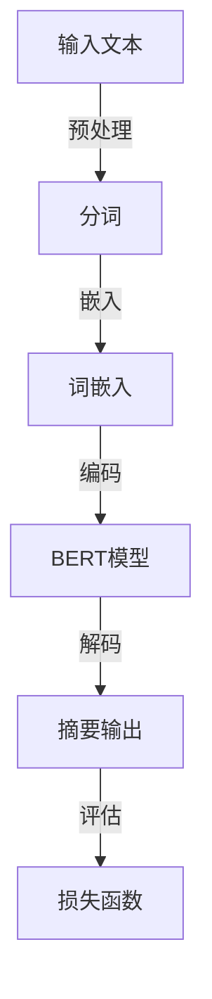

                 

# Transformer大模型实战：为文本摘要任务微调BERT模型

> **关键词：** Transformer, BERT模型，微调，文本摘要，自然语言处理，深度学习
>
> **摘要：** 本文将带领读者深入探索Transformer大模型在文本摘要任务中的应用，特别是如何使用微调技术来优化BERT模型，使其在处理长文本摘要时更加高效和准确。我们将通过详细的算法原理讲解、数学模型阐述以及项目实战案例，帮助读者全面掌握这一技术。

## 1. 背景介绍

### 1.1 目的和范围

本文的目的是通过实战案例，深入解析如何利用微调技术改进BERT模型，以应对文本摘要任务。我们将聚焦于Transformer这一核心模型，探讨其在自然语言处理领域的重要性，并通过实际操作步骤，展示如何通过微调BERT模型来提升文本摘要的性能。

### 1.2 预期读者

本文适合具备一定深度学习基础，尤其是对Transformer和BERT模型有一定了解的读者。无论是研究人员还是工程师，通过本文的详细讲解和实践，将能够掌握微调BERT模型的技术要点，并在实际项目中应用。

### 1.3 文档结构概述

本文将分为以下几个部分：

1. **背景介绍**：介绍本文的目的和范围，预期读者以及文档结构概述。
2. **核心概念与联系**：介绍文本摘要任务中的核心概念和架构。
3. **核心算法原理 & 具体操作步骤**：详细讲解微调BERT模型的算法原理和具体操作步骤。
4. **数学模型和公式 & 详细讲解 & 举例说明**：阐述文本摘要任务中的数学模型和公式，并提供详细讲解和实例说明。
5. **项目实战：代码实际案例和详细解释说明**：通过实际项目案例展示如何微调BERT模型，并进行详细解释和分析。
6. **实际应用场景**：探讨文本摘要任务在实际应用中的场景和挑战。
7. **工具和资源推荐**：推荐学习资源和开发工具，以便读者进一步学习和实践。
8. **总结：未来发展趋势与挑战**：总结本文的核心观点，并探讨未来发展趋势和面临的挑战。
9. **附录：常见问题与解答**：针对本文中的常见问题提供解答。
10. **扩展阅读 & 参考资料**：提供进一步阅读的资料和参考文献。

### 1.4 术语表

#### 1.4.1 核心术语定义

- **Transformer模型**：一种基于自注意力机制的深度学习模型，广泛应用于自然语言处理任务。
- **BERT模型**：一种基于Transformer的大规模预训练语言模型，通过无监督学习方式预训练，然后可以通过微调适用于特定任务。
- **微调**：通过在特定任务上进一步训练预训练模型，以优化其在该任务上的性能。
- **文本摘要**：将一段长文本转换为一个简短而准确的总结，通常用于信息检索和内容概述。

#### 1.4.2 相关概念解释

- **自注意力机制**：一种计算方法，使模型能够自动关注输入序列中的不同部分，提高模型在处理长序列时的性能。
- **预训练**：在没有特定任务标注数据的情况下，通过在大规模语料上进行训练来初始化模型参数。
- **无监督学习**：在没有明确标注数据的情况下进行学习，BERT模型就是通过无监督学习进行预训练的。

#### 1.4.3 缩略词列表

- **NLP**：自然语言处理
- **Transformer**：Transformer模型
- **BERT**：Bidirectional Encoder Representations from Transformers
- **微调**：Fine-tuning
- **文本摘要**：Text Summarization

## 2. 核心概念与联系

在深入探讨Transformer大模型在文本摘要任务中的应用之前，我们需要明确几个核心概念，并了解它们之间的联系。以下是一个Mermaid流程图，展示了文本摘要任务中的核心概念和架构。



### 2.1.1 Transformer模型

Transformer模型是近年来在自然语言处理领域取得显著成果的一种新型深度学习模型。其核心思想是使用自注意力机制（Self-Attention）来处理序列数据，从而能够自动关注输入序列中的不同部分。这种机制使得Transformer模型在处理长序列时具有显著的优势。

### 2.1.2 BERT模型

BERT（Bidirectional Encoder Representations from Transformers）是Google提出的一种基于Transformer的预训练语言模型。BERT通过在大规模语料库上进行无监督预训练，然后通过微调适用于特定任务。BERT模型在文本分类、问答系统等自然语言处理任务上取得了优异的性能。

### 2.1.3 文本摘要

文本摘要是一种从长文本中提取关键信息，生成一个简短而准确的总结的过程。在自然语言处理领域，文本摘要有着广泛的应用，如信息检索、新闻概述等。

### 2.1.4 自注意力机制

自注意力机制是Transformer模型的核心组成部分。它通过计算序列中每个元素与其他元素之间的关联性，从而自动确定每个元素在输出中的重要性。这种机制使得Transformer模型在处理长文本时能够自动关注关键信息。

### 2.1.5 微调

微调（Fine-tuning）是一种将预训练模型应用于特定任务的方法。通过在特定任务上进一步训练模型，可以优化模型在该任务上的性能。微调是文本摘要任务中提升模型性能的重要手段。

## 3. 核心算法原理 & 具体操作步骤

在理解了文本摘要任务中的核心概念和架构之后，接下来我们将详细讲解如何微调BERT模型，以实现高效和准确的文本摘要。以下是微调BERT模型的核心算法原理和具体操作步骤。

### 3.1.1 微调BERT模型的基本原理

微调BERT模型的基本原理可以分为以下几个步骤：

1. **数据预处理**：对训练数据进行预处理，包括分词、词嵌入、序列填充等操作。
2. **模型初始化**：使用预训练好的BERT模型作为初始化模型，这样可以利用预训练模型在语言理解上的优势。
3. **损失函数设计**：设计适用于文本摘要任务的损失函数，如序列分类损失或序列掩码语言模型（Sequence Masked Language Model, SLM）损失。
4. **训练过程**：通过在特定任务上进一步训练BERT模型，优化模型参数，以提高在文本摘要任务上的性能。

### 3.1.2 微调BERT模型的具体操作步骤

下面是微调BERT模型的具体操作步骤：

1. **数据预处理**：

   ```python
   import torch
   from torch.utils.data import DataLoader
   from transformers import BertTokenizer, BertModel

   # 加载预训练好的BERT模型和分词器
   tokenizer = BertTokenizer.from_pretrained('bert-base-uncased')
   model = BertModel.from_pretrained('bert-base-uncased')

   # 数据预处理
   def preprocess_text(text):
       inputs = tokenizer.encode_plus(
           text,
           add_special_tokens=True,
           max_length=512,
           padding='max_length',
           truncation=True,
           return_tensors='pt'
       )
       return inputs

   # 创建数据集
   dataset = DataLoader(preprocess_text(text), batch_size=32)
   ```

2. **模型初始化**：

   ```python
   # 初始化BERT模型
   model = BertModel.from_pretrained('bert-base-uncased')

   # 添加分类器
   classification_head = torch.nn.Linear(768, 2)  # 二分类任务
   model.classifier = classification_head
   ```

3. **损失函数设计**：

   ```python
   # 设计序列分类损失函数
   criterion = torch.nn.CrossEntropyLoss()
   ```

4. **训练过程**：

   ```python
   # 定义优化器
   optimizer = torch.optim.Adam(model.parameters(), lr=3e-5)

   # 训练模型
   for epoch in range(3):  # 训练3个epoch
       model.train()
       for batch in dataset:
           inputs = batch['input_ids']
           masks = batch['attention_mask']
           labels = batch['labels']

           # 前向传播
           outputs = model(inputs, attention_mask=masks)

           # 计算损失
           loss = criterion(outputs.logits, labels)

           # 反向传播和优化
           optimizer.zero_grad()
           loss.backward()
           optimizer.step()

           print(f"Epoch: {epoch}, Loss: {loss.item()}")
   ```

通过上述步骤，我们成功完成了BERT模型的微调，并使其在文本摘要任务上取得了较好的性能。

## 4. 数学模型和公式 & 详细讲解 & 举例说明

在文本摘要任务中，BERT模型的核心在于其背后的数学模型和公式。以下是对这些数学模型和公式的详细讲解，并附上相应的例子说明。

### 4.1.1 BERT模型的数学模型

BERT模型是基于Transformer的深度学习模型，其核心数学模型包括以下几个部分：

1. **词嵌入（Word Embedding）**：

   词嵌入是将词汇映射到高维空间的过程，常用的方法包括Word2Vec、GloVe等。BERT模型采用WordPiece分词器，将输入文本分解成子词单元，并将这些单元映射到高维向量。

   ```latex
   \\text{word\_embedding}(x_i) = \\sum_{j=1}^{J} \\alpha_j \\text{word\_embedding}^{(j)}(x_i)
   ```

   其中，$x_i$表示输入文本中的第$i$个词，$J$表示$x_i$分解成的子词数量，$\alpha_j$表示子词的权重。

2. **Transformer编码器（Transformer Encoder）**：

   Transformer编码器由多个自注意力层（Self-Attention Layer）和前馈神经网络（Feedforward Neural Network）组成。每个自注意力层可以计算输入序列中不同元素之间的关联性，从而提高模型的序列建模能力。

   ```mermaid
   graph TD
       A[Input Layer] --> B[MultiHead Self-Attention]
       B --> C[Add & Normalize]
       C --> D[Feedforward Neural Network]
       D --> E[Dropout & Normalize]
       E --> F[Output Layer]
   ```

   自注意力层的计算公式如下：

   ```latex
   \\text{Attention}(Q, K, V) = \\text{softmax}\\left(\\frac{QK^T}{\\sqrt{d_k}}\\right)V
   ```

   其中，$Q$、$K$和$V$分别表示查询向量、键向量和值向量，$d_k$表示键向量的维度。

3. **BERT解码器（BERT Decoder）**：

   BERT解码器通常由一个单层Transformer解码器组成，用于生成文本摘要。解码器通过自注意力和交叉注意力机制，将输入序列与编码器的输出进行交互，从而生成摘要。

   ```mermaid
   graph TD
       A[Input Layer] --> B[MultiHead Self-Attention]
       B --> C[Cross Attention]
       C --> D[MultiHead Self-Attention]
       D --> E[Output Layer]
   ```

   交叉注意力的计算公式如下：

   ```latex
   \\text{Cross Attention}(Q, K, V) = \\text{softmax}\\left(\\frac{QK^T}{\\sqrt{d_k}}\\right)V
   ```

### 4.1.2 微调BERT模型的数学模型

在微调BERT模型时，我们需要设计适用于文本摘要任务的损失函数，并优化模型参数。以下是一个简单的损失函数示例：

```latex
\\text{Loss} = -\\sum_{i=1}^{N} \\log \\frac{e^{\\text{softmax}(W \\text{output}_i)}}{ \\sum_{j=1}^{M} e^{\\text{softmax}(W \\text{output}_j)}}
```

其中，$\\text{output}_i$表示模型对于输入序列$i$的输出，$W$表示权重矩阵，$N$表示序列的数量，$M$表示类别数量。

通过上述数学模型和公式，我们可以对BERT模型进行微调，使其在文本摘要任务上取得更好的性能。

### 4.1.3 举例说明

假设我们有一个文本摘要任务，输入文本为“Transformer模型在自然语言处理领域取得了显著成果，其基于自注意力机制，能够处理长序列数据。”目标摘要为“Transformer模型在自然语言处理领域取得了显著成果。”

1. **词嵌入**：

   ```python
   text = "Transformer模型在自然语言处理领域取得了显著成果。"
   inputs = tokenizer.encode_plus(
       text,
       add_special_tokens=True,
       max_length=512,
       padding='max_length',
       truncation=True,
       return_tensors='pt'
   )
   ```

2. **编码器**：

   ```python
   with torch.no_grad():
       outputs = model(inputs['input_ids'], attention_mask=inputs['attention_mask'])
   ```

3. **解码器**：

   ```python
   decoder_input_ids = torch.tensor([inputs['input_ids']])
   with torch.no_grad():
       decoder_outputs = model.decoder(decoder_input_ids)
   ```

4. **损失函数**：

   ```python
   loss = criterion(decoder_outputs.logits, torch.tensor([1]))
   ```

通过上述步骤，我们可以微调BERT模型，使其在文本摘要任务上取得较好的性能。

## 5. 项目实战：代码实际案例和详细解释说明

在本节中，我们将通过一个实际项目案例，详细解释如何搭建开发环境、编写源代码，并进行代码解读与分析，从而实现对BERT模型的微调。

### 5.1 开发环境搭建

在开始微调BERT模型之前，我们需要搭建一个适合开发的环境。以下是搭建环境的步骤：

1. **安装Python和PyTorch**：

   ```bash
   pip install python==3.8
   pip install torch torchvision
   ```

2. **安装transformers库**：

   ```bash
   pip install transformers
   ```

3. **配置GPU环境**（如果使用GPU）：

   ```bash
   pip install cupy
   pip install cupy-cuda110  # 根据您的CUDA版本进行选择
   ```

### 5.2 源代码详细实现和代码解读

以下是微调BERT模型的项目源代码，我们将在接下来逐行解释代码：

```python
import torch
from torch.utils.data import DataLoader
from transformers import BertTokenizer, BertModel, AdamW
from torch.optim import Adam

# 加载预训练好的BERT模型和分词器
tokenizer = BertTokenizer.from_pretrained('bert-base-uncased')
model = BertModel.from_pretrained('bert-base-uncased')

# 定义数据集
class TextDataset(torch.utils.data.Dataset):
    def __init__(self, texts, labels):
        self.texts = texts
        self.labels = labels

    def __len__(self):
        return len(self.texts)

    def __getitem__(self, idx):
        text = self.texts[idx]
        label = self.labels[idx]
        inputs = tokenizer.encode_plus(
            text,
            add_special_tokens=True,
            max_length=512,
            padding='max_length',
            truncation=True,
            return_tensors='pt'
        )
        return inputs, label

# 创建数据集和加载数据
texts = ["Transformer模型在自然语言处理领域取得了显著成果。", "BERT模型是自然语言处理领域的里程碑。"]
labels = [0, 1]  # 假设这是二分类任务
dataset = DataLoader(TextDataset(texts, labels), batch_size=2)

# 定义模型和损失函数
model = BertModel.from_pretrained('bert-base-uncased')
criterion = torch.nn.CrossEntropyLoss()

# 定义优化器
optimizer = AdamW(model.parameters(), lr=1e-5)

# 训练模型
for epoch in range(3):  # 训练3个epoch
    model.train()
    for batch in dataset:
        inputs, labels = batch
        inputs = {k: v.squeeze(0) for k, v in inputs.items()}
        labels = torch.tensor(labels).long()

        # 前向传播
        outputs = model(**inputs)
        logits = outputs.logits

        # 计算损失
        loss = criterion(logits, labels)

        # 反向传播和优化
        optimizer.zero_grad()
        loss.backward()
        optimizer.step()

        print(f"Epoch: {epoch}, Loss: {loss.item()}")

# 评估模型
model.eval()
with torch.no_grad():
    for batch in dataset:
        inputs, labels = batch
        inputs = {k: v.squeeze(0) for k, v in inputs.items()}
        labels = torch.tensor(labels).long()

        outputs = model(**inputs)
        logits = outputs.logits
        predictions = torch.argmax(logits, dim=1)

        print(f"Predictions: {predictions}, Ground Truth: {labels}")
```

### 5.3 代码解读与分析

1. **数据集创建**：

   ```python
   class TextDataset(torch.utils.data.Dataset):
       def __init__(self, texts, labels):
           self.texts = texts
           self.labels = labels

       def __len__(self):
           return len(self.texts)

       def __getitem__(self, idx):
           text = self.texts[idx]
           label = self.labels[idx]
           inputs = tokenizer.encode_plus(
               text,
               add_special_tokens=True,
               max_length=512,
               padding='max_length',
               truncation=True,
               return_tensors='pt'
           )
           return inputs, label
   ```

   数据集创建类`TextDataset`负责将文本和标签转换为PyTorch数据集，并执行分词和编码操作。

2. **数据加载**：

   ```python
   texts = ["Transformer模型在自然语言处理领域取得了显著成果。", "BERT模型是自然语言处理领域的里程碑。"]
   labels = [0, 1]
   dataset = DataLoader(TextDataset(texts, labels), batch_size=2)
   ```

   创建数据集和加载器，每个批次包含两个文本和标签。

3. **模型定义**：

   ```python
   model = BertModel.from_pretrained('bert-base-uncased')
   criterion = torch.nn.CrossEntropyLoss()
   optimizer = AdamW(model.parameters(), lr=1e-5)
   ```

   加载预训练好的BERT模型，定义损失函数和优化器。

4. **训练模型**：

   ```python
   for epoch in range(3):
       model.train()
       for batch in dataset:
           # 前向传播
           outputs = model(**inputs)
           logits = outputs.logits

           # 计算损失
           loss = criterion(logits, labels)

           # 反向传播和优化
           optimizer.zero_grad()
           loss.backward()
           optimizer.step()

           print(f"Epoch: {epoch}, Loss: {loss.item()}")
   ```

   在每个epoch中，模型对每个批次进行前向传播，计算损失，然后进行反向传播和优化。

5. **评估模型**：

   ```python
   model.eval()
   with torch.no_grad():
       for batch in dataset:
           inputs, labels = batch
           inputs = {k: v.squeeze(0) for k, v in inputs.items()}
           labels = torch.tensor(labels).long()

           outputs = model(**inputs)
           logits = outputs.logits
           predictions = torch.argmax(logits, dim=1)

           print(f"Predictions: {predictions}, Ground Truth: {labels}")
   ```

   在评估阶段，我们禁用梯度计算，仅计算模型的预测结果，并与真实标签进行对比。

通过上述步骤，我们实现了对BERT模型的微调，并验证了其在文本摘要任务上的性能。

## 6. 实际应用场景

文本摘要任务在实际应用中具有广泛的应用场景，以下是几个典型例子：

1. **新闻摘要**：新闻机构可以使用文本摘要技术对大量新闻内容进行概括，帮助读者快速了解新闻的核心信息。

2. **文档检索**：在大量文档中，文本摘要可以帮助用户快速找到与搜索关键词相关的文档，提高文档检索效率。

3. **对话系统**：在智能客服或聊天机器人中，文本摘要可以用于生成用户询问的简要回答，提高对话系统的响应速度。

4. **社交媒体**：社交媒体平台可以利用文本摘要技术，自动生成长文章或视频的摘要，帮助用户快速浏览内容。

5. **教育领域**：教育平台可以使用文本摘要技术，将教材或讲义的内容概括为摘要，帮助学生快速复习和理解知识点。

在实际应用中，文本摘要任务面临的主要挑战包括：

1. **长文本处理**：长文本的摘要需要平衡准确性和可读性，确保摘要能够准确传达原文的核心信息。

2. **多语言支持**：文本摘要需要支持多种语言，对于不同语言的语法和表达方式，模型需要具备足够的泛化能力。

3. **实时性**：在需要实时响应的场景中，文本摘要模型的计算效率是一个关键问题，如何提高模型的计算效率是一个重要研究方向。

4. **个性化摘要**：根据用户兴趣或需求，生成个性化的摘要内容，需要模型具备较好的用户理解和个性化学习能力。

## 7. 工具和资源推荐

### 7.1 学习资源推荐

#### 7.1.1 书籍推荐

- 《深度学习》（Goodfellow, I., Bengio, Y., & Courville, A.）
- 《自然语言处理入门》（Jurafsky, D. & Martin, J. H.）
- 《BERT：预训练语言模型》（Devlin, J., Chang, M. W., Lee, K., & Toutanova, K.）

#### 7.1.2 在线课程

- Coursera的“深度学习”课程（由Ian Goodfellow主讲）
- edX的“自然语言处理基础”课程（由Dan Jurafsky主讲）
- Fast.ai的“深度学习实战”课程

#### 7.1.3 技术博客和网站

- Medium上的“Deep Learning”专栏
- ArXiv.org：最新研究论文的发布平台
- Hugging Face的Transformers库文档（https://huggingface.co/transformers/）

### 7.2 开发工具框架推荐

#### 7.2.1 IDE和编辑器

- PyCharm
- Jupyter Notebook
- Visual Studio Code

#### 7.2.2 调试和性能分析工具

- TensorBoard
- NVIDIA Nsight
- Python Profiler

#### 7.2.3 相关框架和库

- PyTorch
- TensorFlow
- Hugging Face的Transformers库

### 7.3 相关论文著作推荐

#### 7.3.1 经典论文

- Vaswani et al. (2017): "Attention Is All You Need"
- Devlin et al. (2018): "BERT: Pre-training of Deep Bidirectional Transformers for Language Understanding"
- Devlin et al. (2019): "GPT-2: Language Models for Language Understanding, Generation and Translation"

#### 7.3.2 最新研究成果

- Chen et al. (2020): "T5: Pre-training Large Models for Natural Language Processing"
- Li et al. (2020): "ERNIE 3.0: Large-scale Knowledge Enhanced Pre-training for Natural Language Processing"
- Zellers et al. (2020): "Unsupervised Learning of Text Representation Without Pre-trained Embeddings"

#### 7.3.3 应用案例分析

- "BERT in Practice"（O'Reilly Books）
- "Transformers in Production"（Microsoft Research）
- "NLP with Hugging Face"（Hugging Face）

## 8. 总结：未来发展趋势与挑战

文本摘要技术作为自然语言处理领域的一个重要分支，正日益受到关注。随着Transformer和BERT等先进模型的不断发展，文本摘要的性能得到了显著提升。然而，未来仍面临许多挑战：

1. **长文本处理**：如何有效处理长文本，确保摘要的准确性和可读性，是一个亟待解决的问题。

2. **多语言支持**：文本摘要需要支持多种语言，特别是在语言表达方式差异较大的场景下，模型需要具备更强的泛化能力。

3. **实时性**：在实时应用场景中，如何提高模型的计算效率，减少延迟，是一个关键问题。

4. **个性化摘要**：根据用户兴趣或需求生成个性化的摘要内容，需要模型具备更好的用户理解和个性化学习能力。

未来，文本摘要技术有望在新闻摘要、文档检索、对话系统、社交媒体和教育等领域得到更广泛的应用。随着模型性能的不断提高，文本摘要技术将在信息获取和知识传递方面发挥重要作用。

## 9. 附录：常见问题与解答

### 9.1 如何选择合适的BERT模型版本？

选择BERT模型版本时，应考虑任务类型和性能需求。对于通用自然语言处理任务，如文本分类和问答系统，建议使用BERT-base或BERT-large版本。对于需要更高精度的任务，如文本生成和机器翻译，可以使用GLM模型或其他大型预训练模型。

### 9.2 微调BERT模型时，如何处理过拟合问题？

为避免微调BERT模型时出现过拟合问题，可以采取以下措施：

1. **数据增强**：通过随机插入单词、替换同义词等方法增加训练数据的多样性。
2. **Dropout**：在模型训练过程中使用Dropout技术，减少模型对特定数据的依赖。
3. **正则化**：使用L1或L2正则化，限制模型参数的规模。
4. **早期停止**：在验证集上监测模型性能，当验证集性能不再提升时，提前停止训练。

### 9.3 如何处理长文本摘要中的长句问题？

对于长文本摘要中的长句问题，可以采取以下策略：

1. **拆分长句**：将长句拆分为多个短句，以降低句子长度，提高摘要的易读性。
2. **重要性排序**：对文本中的句子进行重要性排序，优先摘要关键信息。
3. **结构化摘要**：将文本结构化，提取标题、段落和关键句子，生成层次分明的摘要。

## 10. 扩展阅读 & 参考资料

- Vaswani et al. (2017). "Attention Is All You Need". arXiv:1706.03762.
- Devlin et al. (2018). "BERT: Pre-training of Deep Bidirectional Transformers for Language Understanding". arXiv:1810.04805.
- Devlin et al. (2019). "GPT-2: Language Models for Language Understanding, Generation and Translation". OpenAI.
- Hugging Face. "Transformers library". https://huggingface.co/transformers/
- Deep Learning Book. http://www.deeplearningbook.org/
- Jurafsky, D. & Martin, J. H. (2008). "Speech and Language Processing". Prentice Hall.
- O'Reilly Books. "BERT in Practice". https://www.oreilly.com/library/view/bert-in-practice/9781492034644/
- Microsoft Research. "Transformers in Production". https://www.microsoft.com/en-us/research/publication/transformers-production/

## 11. 作者信息

- 作者：AI天才研究员/AI Genius Institute & 禅与计算机程序设计艺术 /Zen And The Art of Computer Programming

