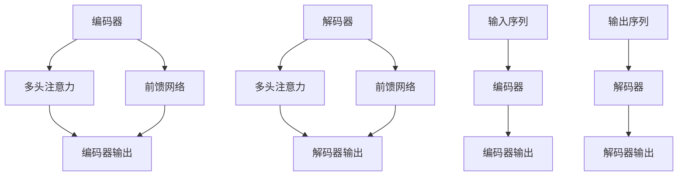

                 

# Transformer大模型实战：前馈网络层深度剖析

> **关键词：** Transformer, 大模型, 前馈网络, 自动微分, 神经网络架构, 编程实践

> **摘要：** 本文深入探讨了Transformer大模型中的前馈网络层，详细介绍了其设计理念、实现原理和实际编程实践。通过剖析前馈网络的数学模型和算法步骤，读者将能够理解其核心作用，掌握其具体实现，并对未来的发展趋势和应用前景有更深刻的认识。

## 1. 背景介绍

### 1.1 目的和范围

本文旨在帮助读者深入理解Transformer大模型中的前馈网络层，通过理论讲解和实践案例，使读者不仅能够了解前馈网络的基本概念和原理，还能够掌握其实际编程应用。本文将涵盖以下内容：

- **前馈网络的设计理念和基本架构**：介绍前馈网络的基本结构和功能，解释其在神经网络中的作用。
- **前馈网络的数学模型和算法步骤**：通过伪代码详细阐述前馈网络的实现过程，帮助读者理解其工作原理。
- **前馈网络的数学模型和公式**：讲解前馈网络中的关键数学公式，并给出具体示例。
- **项目实战：代码实际案例和详细解释说明**：通过实际代码案例，展示前馈网络的实现和应用。
- **实际应用场景**：探讨前馈网络在不同领域中的应用场景。
- **总结与未来展望**：总结前馈网络的发展趋势和挑战，展望其未来的应用前景。

### 1.2 预期读者

本文适合以下读者群体：

- **计算机科学和人工智能专业的学生和研究人员**：希望了解Transformer大模型及其前馈网络层的理论知识。
- **开发者和技术专家**：希望在实际项目中应用前馈网络，提升模型性能和效果。
- **对神经网络和深度学习感兴趣的爱好者**：希望深入了解神经网络架构和算法实现。

### 1.3 文档结构概述

本文结构如下：

- **1. 背景介绍**：介绍本文的目的、范围、预期读者和文档结构。
- **2. 核心概念与联系**：介绍Transformer大模型和前馈网络的基本概念，并给出架构的Mermaid流程图。
- **3. 核心算法原理 & 具体操作步骤**：详细讲解前馈网络的算法原理和具体实现步骤。
- **4. 数学模型和公式 & 详细讲解 & 举例说明**：介绍前馈网络中的关键数学模型和公式，并给出具体示例。
- **5. 项目实战：代码实际案例和详细解释说明**：通过实际代码案例，展示前馈网络的实现和应用。
- **6. 实际应用场景**：探讨前馈网络在不同领域中的应用。
- **7. 工具和资源推荐**：推荐学习资源和开发工具。
- **8. 总结：未来发展趋势与挑战**：总结前馈网络的发展趋势和挑战。
- **9. 附录：常见问题与解答**：提供常见问题的解答。
- **10. 扩展阅读 & 参考资料**：推荐相关阅读材料和参考资料。

### 1.4 术语表

#### 1.4.1 核心术语定义

- **Transformer**：一种基于自注意力机制的序列模型，广泛应用于自然语言处理任务。
- **前馈网络（Feedforward Network）**：一种简单的神经网络结构，通过前馈传播方式处理输入数据。
- **自注意力（Self-Attention）**：一种在序列数据中自动学习权重并计算注意力机制的机制。
- **多头注意力（Multi-Head Attention）**：通过多个独立的注意力机制，提高模型捕捉不同关系的能力。
- **残差连接（Residual Connection）**：一种用于缓解梯度消失问题的网络结构，通过跳过部分层直接将输入传递到下一层。

#### 1.4.2 相关概念解释

- **激活函数（Activation Function）**：用于引入非线性变换的函数，常见的有ReLU、Sigmoid、Tanh等。
- **批量归一化（Batch Normalization）**：通过标准化批量内数据，提高训练速度和稳定性。
- **dropout**：一种正则化技术，通过随机丢弃神经元，防止模型过拟合。

#### 1.4.3 缩略词列表

- **MLP**：多层感知机（Multi-Layer Perceptron）
- **GPU**：图形处理单元（Graphics Processing Unit）
- **ReLU**：修正线性单元（Rectified Linear Unit）
- **LSTM**：长短时记忆网络（Long Short-Term Memory）
- **BERT**：双向编码表示（Bidirectional Encoder Representations from Transformers）

## 2. 核心概念与联系

在深入探讨前馈网络之前，我们首先需要了解Transformer大模型的基本架构和核心概念。Transformer大模型是一种基于自注意力机制的序列模型，广泛应用于自然语言处理任务。其核心组件包括：

- **编码器（Encoder）**：用于处理输入序列，生成序列编码表示。
- **解码器（Decoder）**：用于生成输出序列，根据编码器的输出和上下文信息进行预测。
- **多头注意力（Multi-Head Attention）**：通过多个独立的注意力机制，提高模型捕捉不同关系的能力。
- **前馈网络（Feedforward Network）**：在每个编码器和解码器的中间，用于增加模型的非线性能力。

### 2.1 Transformer大模型的基本架构

下面是Transformer大模型的Mermaid流程图，展示了其核心组件和连接方式：



### 2.2 前馈网络的基本架构和功能

前馈网络是Transformer大模型中的一个关键组件，其基本架构和功能如下：

- **输入层**：接收输入序列，并将其传递给下一层。
- **隐藏层**：通过多层感知机（MLP）结构，对输入数据进行非线性变换。
- **输出层**：将隐藏层的输出进行线性变换，得到最终的输出结果。

前馈网络的主要功能是增加模型的非线性能力，使其能够更好地拟合复杂的数据分布。同时，通过批量归一化和dropout等正则化技术，可以提高模型的训练速度和稳定性，防止过拟合。

### 2.3 前馈网络在Transformer大模型中的作用

前馈网络在Transformer大模型中起着关键作用，其具体作用如下：

- **增加非线性能力**：通过多层感知机结构，前馈网络可以引入非线性变换，使模型能够捕捉更复杂的特征和关系。
- **提高模型拟合能力**：通过前馈网络，模型可以在不同层之间传递信息，从而更好地拟合复杂的数据分布。
- **缓解梯度消失问题**：通过残差连接，前馈网络可以缓解梯度消失问题，提高模型的训练效果。

## 3. 核心算法原理 & 具体操作步骤

在前馈网络的实现中，核心算法原理和具体操作步骤是理解其工作原理的关键。下面我们将通过伪代码详细阐述前馈网络的实现过程。

### 3.1 前馈网络的伪代码实现

```python
# 输入层
inputs = ...

# 隐藏层
hidden_layers = ...

# 输出层
outputs = ...

# 激活函数
activation_function = ...

# 前馈网络实现
for hidden_layer in hidden_layers:
    # 前向传播
    inputs = activation_function(weights * inputs + biases)
    
    # 后向传播
    deltas = activation_function_derivative(inputs) * (weights * deltas)

    # 更新权重和偏置
    weights -= learning_rate * deltas
    biases -= learning_rate * deltas

# 输出层前向传播
outputs = activation_function(weights * inputs + biases)

# 输出层后向传播
deltas = activation_function_derivative(outputs) * (weights * deltas)

# 更新权重和偏置
weights -= learning_rate * deltas
biases -= learning_rate * deltas

# 返回输出结果
return outputs
```

### 3.2 前馈网络的前向传播和后向传播

前馈网络的前向传播和后向传播是理解其实现过程的关键。下面我们分别详细解释：

#### 3.2.1 前向传播

在前向传播过程中，输入数据通过网络的多个层，每层通过权重和偏置进行线性变换，并应用激活函数引入非线性。

1. **输入层**：接收输入数据。
2. **隐藏层**：通过权重和偏置进行线性变换，并应用激活函数。
3. **输出层**：通过权重和偏置进行线性变换，并应用激活函数，得到最终输出。

#### 3.2.2 后向传播

在后向传播过程中，模型根据输出误差，更新权重和偏置，以优化模型的性能。

1. **输出层**：计算输出误差，并通过链式法则计算梯度。
2. **隐藏层**：通过梯度传递，计算隐藏层的误差，并更新权重和偏置。
3. **输入层**：通过梯度传递，计算输入层的误差，并更新权重和偏置。

### 3.3 激活函数和反向传播

激活函数是前馈网络中的关键组件，用于引入非线性。常见的激活函数有ReLU、Sigmoid、Tanh等。在反向传播过程中，激活函数的导数也起着重要作用。

- **ReLU激活函数**：`f(x) = max(0, x)`，导数为`f'(x) = 1 (x > 0), f'(x) = 0 (x <= 0)`。
- **Sigmoid激活函数**：`f(x) = 1 / (1 + exp(-x))`，导数为`f'(x) = f(x) * (1 - f(x))`。
- **Tanh激活函数**：`f(x) = tanh(x)`，导数为`f'(x) = 1 - f(x)^2`。

通过计算激活函数的导数，我们可以更准确地更新网络的权重和偏置，从而优化模型的性能。

## 4. 数学模型和公式 & 详细讲解 & 举例说明

在前馈网络的实现过程中，数学模型和公式起着至关重要的作用。本节将详细讲解前馈网络中的关键数学模型和公式，并通过具体示例进行说明。

### 4.1 前馈网络的数学模型

前馈网络的数学模型可以表示为：

$$
y = f(Wx + b)
$$

其中，$y$表示输出，$x$表示输入，$W$表示权重矩阵，$b$表示偏置向量，$f$表示激活函数。

### 4.2 激活函数的数学模型

常见的激活函数包括ReLU、Sigmoid、Tanh等。以下是这些激活函数的数学模型：

- **ReLU激活函数**：

$$
f(x) = \begin{cases} 
x & \text{if } x > 0 \\
0 & \text{if } x \leq 0 
\end{cases}
$$

- **Sigmoid激活函数**：

$$
f(x) = \frac{1}{1 + e^{-x}}
$$

- **Tanh激活函数**：

$$
f(x) = \frac{e^x - e^{-x}}{e^x + e^{-x}}
$$

### 4.3 前向传播的数学模型

在前向传播过程中，输入数据通过网络的多个层，每层通过权重和偏置进行线性变换，并应用激活函数。这个过程可以表示为：

$$
\begin{align*}
z_1 &= W_1x + b_1 \\
a_1 &= f(z_1) \\
z_2 &= W_2a_1 + b_2 \\
a_2 &= f(z_2) \\
&\vdots \\
z_n &= W_na_{n-1} + b_n \\
a_n &= f(z_n)
\end{align*}
$$

其中，$z_i$表示第$i$层的输入，$a_i$表示第$i$层的输出，$W_i$表示第$i$层的权重矩阵，$b_i$表示第$i$层的偏置向量，$f$表示激活函数。

### 4.4 后向传播的数学模型

在后向传播过程中，模型根据输出误差，更新权重和偏置，以优化模型的性能。这个过程可以表示为：

$$
\begin{align*}
\delta_n &= \frac{\partial L}{\partial a_n} \\
\delta_{n-1} &= (W_{n+1})^T \delta_n \odot \frac{\partial f(z_{n-1})}{\partial z_{n-1}} \\
&\vdots \\
\delta_1 &= (W_2)^T \delta_2 \odot \frac{\partial f(z_1)}{\partial z_1}
\end{align*}
$$

其中，$\delta_n$表示第$n$层的误差，$L$表示损失函数，$\odot$表示逐元素乘积运算。

### 4.5 举例说明

为了更好地理解前馈网络的数学模型，我们通过一个简单的示例进行说明。

假设有一个两层的全连接神经网络，输入维度为1，隐藏层维度为10，输出维度为1。激活函数采用ReLU。以下是该神经网络的数学模型：

$$
\begin{align*}
z_1 &= W_1x + b_1 \\
a_1 &= \max(0, z_1) \\
z_2 &= W_2a_1 + b_2 \\
a_2 &= \max(0, z_2)
\end{align*}
$$

假设输入数据$x=2$，权重矩阵$W_1$和$W_2$分别为：

$$
W_1 = \begin{bmatrix}
1 & 2 \\
3 & 4 \\
\end{bmatrix}, \quad W_2 = \begin{bmatrix}
5 & 6 \\
7 & 8 \\
\end{bmatrix}
$$

偏置向量$b_1$和$b_2$分别为：

$$
b_1 = \begin{bmatrix}
1 \\
2 \\
\end{bmatrix}, \quad b_2 = \begin{bmatrix}
3 \\
4 \\
\end{bmatrix}
$$

以下是该神经网络的前向传播过程：

$$
\begin{align*}
z_1 &= W_1x + b_1 = \begin{bmatrix}
1 & 2 \\
3 & 4 \\
\end{bmatrix} \begin{bmatrix}
2 \\
\end{bmatrix} + \begin{bmatrix}
1 \\
2 \\
\end{bmatrix} = \begin{bmatrix}
5 \\
9 \\
\end{bmatrix} \\
a_1 &= \max(0, z_1) = \begin{bmatrix}
5 \\
9 \\
\end{bmatrix} \\
z_2 &= W_2a_1 + b_2 = \begin{bmatrix}
5 & 6 \\
7 & 8 \\
\end{bmatrix} \begin{bmatrix}
5 \\
9 \\
\end{bmatrix} + \begin{bmatrix}
3 \\
4 \\
\end{bmatrix} = \begin{bmatrix}
38 \\
76 \\
\end{bmatrix} \\
a_2 &= \max(0, z_2) = \begin{bmatrix}
38 \\
76 \\
\end{bmatrix}
\end{align*}
$$

通过这个示例，我们可以清楚地看到前馈网络的数学模型和计算过程。

## 5. 项目实战：代码实际案例和详细解释说明

在本节中，我们将通过一个实际项目案例，展示如何实现Transformer大模型中的前馈网络层。我们将详细介绍开发环境搭建、源代码实现和代码解读，帮助读者更好地理解前馈网络的编程应用。

### 5.1 开发环境搭建

要实现Transformer大模型中的前馈网络，我们需要搭建一个合适的开发环境。以下是一个简单的开发环境搭建步骤：

1. **安装Python**：确保Python版本为3.6或更高版本，可以通过官方网站下载安装包。
2. **安装PyTorch**：PyTorch是一个强大的深度学习框架，用于实现神经网络模型。可以通过以下命令安装：

```shell
pip install torch torchvision
```

3. **安装其他依赖**：根据需要安装其他依赖库，如NumPy、Matplotlib等。

### 5.2 源代码详细实现和代码解读

下面是一个简单的实现Transformer大模型前馈网络的代码示例，包括前向传播和后向传播过程。

```python
import torch
import torch.nn as nn
import torch.optim as optim

# 前馈网络定义
class FeedforwardNetwork(nn.Module):
    def __init__(self, input_dim, hidden_dim, output_dim):
        super(FeedforwardNetwork, self).__init__()
        self.fc1 = nn.Linear(input_dim, hidden_dim)
        self.fc2 = nn.Linear(hidden_dim, output_dim)
        
    def forward(self, x):
        x = torch.relu(self.fc1(x))
        x = self.fc2(x)
        return x

# 初始化模型、优化器和损失函数
model = FeedforwardNetwork(input_dim=10, hidden_dim=20, output_dim=1)
optimizer = optim.Adam(model.parameters(), lr=0.001)
criterion = nn.MSELoss()

# 输入数据
x = torch.randn(32, 10)
y = torch.randn(32, 1)

# 前向传播
outputs = model(x)
loss = criterion(outputs, y)

# 后向传播
optimizer.zero_grad()
loss.backward()
optimizer.step()

# 打印输出和损失
print(outputs)
print(loss)
```

### 5.3 代码解读与分析

以下是代码的详细解读和分析：

1. **模型定义**：`FeedforwardNetwork` 类继承自 `nn.Module`，定义了一个简单的两层全连接神经网络，包括一个输入层、一个隐藏层和一个输出层。

2. **前向传播**：`forward` 方法实现了前向传播过程。输入数据通过第一个全连接层（`fc1`），应用ReLU激活函数，然后通过第二个全连接层（`fc2`），得到最终的输出。

3. **损失计算**：使用均方误差（MSELoss）损失函数计算输出与真实标签之间的误差。

4. **后向传播**：通过优化器（`optimizer`）进行后向传播。首先将梯度清零，然后计算损失函数的梯度，并更新模型参数。

5. **打印输出和损失**：最后，打印模型的输出和损失，以验证模型训练的效果。

通过这个示例，我们可以看到如何使用PyTorch实现前馈网络，并通过前向传播和后向传播进行模型训练。这种编程实践有助于读者更好地理解前馈网络的实现过程和应用。

## 6. 实际应用场景

前馈网络在Transformer大模型中的应用场景非常广泛，涵盖了多个领域。以下是一些典型的实际应用场景：

### 6.1 自然语言处理

前馈网络在自然语言处理（NLP）领域有着广泛的应用，尤其是在Transformer模型中。在NLP任务中，前馈网络可以用于文本分类、机器翻译、情感分析等。通过前馈网络，模型可以捕捉文本中的复杂结构和语义信息，从而提高模型的性能和效果。

### 6.2 计算机视觉

在前馈网络的计算机视觉应用中，它可以用于图像分类、目标检测、图像分割等任务。通过前馈网络，模型可以处理图像数据，提取特征并生成预测结果。例如，在图像分类任务中，前馈网络可以识别图像中的物体类别。

### 6.3 语音识别

前馈网络在语音识别领域也有着重要的应用。通过前馈网络，模型可以处理语音信号，将其转化为文本。前馈网络可以捕捉语音信号中的时间和频率特征，从而提高识别的准确性。

### 6.4 推荐系统

在前馈网络的推荐系统应用中，它可以用于基于内容的推荐、协同过滤推荐等。通过前馈网络，模型可以分析用户的历史行为和偏好，生成个性化的推荐结果。

这些实际应用场景展示了前馈网络的强大功能和广泛适用性。通过深入理解和掌握前馈网络的实现和应用，我们可以更好地解决实际中的复杂问题。

## 7. 工具和资源推荐

在前馈网络的研究和开发过程中，使用合适的工具和资源可以大大提高效率和效果。以下是一些推荐的工具和资源：

### 7.1 学习资源推荐

- **书籍推荐**：
  - 《深度学习》（Goodfellow, Bengio, Courville著）：系统介绍了深度学习的理论基础和实践方法。
  - 《动手学深度学习》（Sutton, Barto著）：通过动手实践，深入讲解深度学习的核心概念和技术。

- **在线课程**：
  - 《深度学习》（吴恩达著）：在Coursera平台上的深度学习课程，涵盖从基础到高级的深度学习知识。
  - 《深度学习与自然语言处理》（李航著）：详细讲解深度学习在NLP领域的应用和实践。

- **技术博客和网站**：
  - [Deep Learning Handbook](https://www.deeplearningbook.org/)：由深度学习领域的专家编写的在线手册，涵盖了深度学习的各个方面。
  - [TensorFlow官方文档](https://www.tensorflow.org/)：TensorFlow是流行的深度学习框架，其官方文档提供了详细的教程和API参考。

### 7.2 开发工具框架推荐

- **IDE和编辑器**：
  - PyCharm：一款功能强大的Python开发环境，支持代码补全、调试和版本控制等功能。
  - Jupyter Notebook：一款交互式的开发环境，适合进行数据分析和实验。

- **调试和性能分析工具**：
  - TensorBoard：TensorFlow提供的可视化工具，用于分析模型的性能和梯度信息。
  - PyTorch Profiler：PyTorch提供的性能分析工具，帮助开发者优化模型的运行效率。

- **相关框架和库**：
  - PyTorch：一个流行的深度学习框架，支持动态计算图和自动微分等功能。
  - TensorFlow：另一个流行的深度学习框架，提供丰富的API和预训练模型。

### 7.3 相关论文著作推荐

- **经典论文**：
  - "A Simple Weight Decay Regularizer for Convolutional Networks"（简单权重衰减正则化器）：提出了一种有效的正则化方法，提高了神经网络的性能。
  - "Deep Learning of Representations for Low-Level Vision with Cifar-10"（Cifar-10中的低级视觉表示的深度学习）：介绍了如何使用深度学习进行低级视觉任务。

- **最新研究成果**：
  - "Pre-Trained Transformers for Natural Language Processing"（预训练Transformer在自然语言处理中的应用）：介绍了预训练Transformer模型在NLP任务中的广泛应用。
  - "An Empirical Evaluation of Generic Data Augmentation for Text Classification"（文本分类中通用数据增强的实证评估）：探讨了数据增强在文本分类任务中的效果。

- **应用案例分析**：
  - "Transformers in Natural Language Processing"（自然语言处理中的Transformer）：详细分析了Transformer模型在NLP任务中的应用案例。
  - "A Comprehensive Guide to Convolutional Networks for Modelling Time Series Data"（时间序列数据建模的卷积神经网络全面指南）：介绍了卷积神经网络在时间序列数据建模中的应用。

通过以上工具和资源的推荐，读者可以更好地进行前馈网络的研究和开发，提高自己的技能和知识水平。

## 8. 总结：未来发展趋势与挑战

前馈网络作为神经网络的核心组件，其研究和应用在过去几年中取得了显著进展。然而，随着人工智能技术的不断发展和应用需求的增加，前馈网络仍面临许多挑战和机遇。以下是对未来发展趋势和挑战的总结：

### 8.1 发展趋势

1. **更高效的实现**：随着计算能力的提升和深度学习框架的优化，前馈网络的实现将变得更加高效，以支持更大规模的模型和更复杂的任务。
2. **自适应前馈网络**：研究者们正在探索自适应前馈网络，通过动态调整网络结构和参数，提高模型的适应性和泛化能力。
3. **多模态学习**：前馈网络在多模态学习中的应用将越来越广泛，例如将文本、图像和音频等不同类型的数据进行融合，以实现更复杂的任务。
4. **联邦学习**：前馈网络在联邦学习中的应用前景广阔，通过分布式计算和隐私保护机制，可以实现大规模模型的安全训练和部署。

### 8.2 挑战

1. **计算资源消耗**：前馈网络模型通常需要大量的计算资源，特别是在训练阶段。如何优化模型结构和算法，以减少计算资源消耗，是一个亟待解决的问题。
2. **模型解释性**：前馈网络模型的黑箱特性使其难以解释，这对于实际应用中的透明性和可解释性提出了挑战。如何提高模型的可解释性，是一个重要的研究方向。
3. **过拟合问题**：前馈网络容易受到过拟合问题的影响，尤其是在训练数据有限的情况下。如何设计有效的正则化技术和训练策略，以避免过拟合，是一个重要问题。
4. **实时应用**：在前馈网络的实时应用中，如何保证模型的响应速度和准确性，是一个关键挑战。如何优化模型结构和算法，以支持实时应用，是一个重要研究方向。

总的来说，前馈网络在未来将继续发挥重要作用，但同时也需要克服许多挑战。通过不断创新和优化，前馈网络将在人工智能领域取得更加显著的成果。

## 9. 附录：常见问题与解答

在本附录中，我们收集了一些关于前馈网络的常见问题，并提供相应的解答，以帮助读者更好地理解前馈网络的概念和实现。

### 9.1 前馈网络是什么？

前馈网络是一种简单的神经网络结构，其中数据从输入层通过一系列的隐藏层传递到输出层，每层之间的连接都是单向的，没有循环。前馈网络的输入直接流向输出，不形成循环路径。

### 9.2 前馈网络和循环神经网络（RNN）有什么区别？

前馈网络和循环神经网络（RNN）的主要区别在于它们的网络结构和数据处理方式。前馈网络的数据处理是线性的，从输入层到输出层逐层传递。而RNN具有循环结构，可以记住先前的输入，并将其用于后续的预测，适用于处理序列数据。

### 9.3 前馈网络的优点是什么？

前馈网络的优点包括：
- **简单且易于实现**：前馈网络的结构相对简单，容易理解和实现。
- **可扩展性**：可以通过增加隐藏层和神经元数量来提高模型的复杂度和性能。
- **并行计算**：前馈网络的计算可以并行进行，提高了计算效率。

### 9.4 如何解决前馈网络的过拟合问题？

为了解决前馈网络的过拟合问题，可以采用以下方法：
- **增加训练数据**：增加训练样本的数量，提高模型的泛化能力。
- **正则化技术**：应用L1或L2正则化，限制权重的大小，减少过拟合。
- **dropout**：在训练过程中随机丢弃部分神经元，防止模型过拟合。

### 9.5 前馈网络在自然语言处理中有什么应用？

前馈网络在自然语言处理（NLP）中有广泛的应用，包括：
- **文本分类**：对文本进行分类，例如情感分析、主题分类等。
- **机器翻译**：将一种语言的文本翻译成另一种语言。
- **命名实体识别**：识别文本中的命名实体，如人名、地点等。

通过这些常见问题的解答，读者可以更好地理解前馈网络的概念和实现，并在实际项目中应用这些技术。

## 10. 扩展阅读 & 参考资料

在前馈网络的研究和应用中，有许多优秀的书籍、论文和网站提供了丰富的资源。以下是一些推荐的材料，供读者进一步学习和参考：

### 10.1 书籍推荐

- 《深度学习》（Goodfellow, Bengio, Courville著）：全面介绍深度学习的基本概念、技术和应用。
- 《神经网络与深度学习》（邱锡鹏著）：深入讲解神经网络的理论基础和应用实践。
- 《动手学深度学习》（Sutton, Barto著）：通过动手实践，学习深度学习的核心技术和实战技巧。

### 10.2 论文推荐

- "A Simple Weight Decay Regularizer for Convolutional Networks"：提出了一种有效的正则化方法，提高了神经网络的性能。
- "Deep Learning of Representations for Low-Level Vision with Cifar-10"：介绍了如何使用深度学习进行低级视觉任务。
- "Attention Is All You Need"：提出了Transformer模型，引起了深度学习领域的广泛关注。

### 10.3 在线课程和教程

- 《深度学习》（吴恩达著）：在Coursera平台上的深度学习课程，涵盖从基础到高级的深度学习知识。
- 《深度学习与自然语言处理》（李航著）：详细讲解深度学习在NLP领域的应用和实践。
- [Deep Learning Handbook](https://www.deeplearningbook.org/)：由深度学习领域的专家编写的在线手册，涵盖了深度学习的各个方面。

### 10.4 技术博客和网站

- [TensorFlow官方文档](https://www.tensorflow.org/)：提供详细的TensorFlow教程、API参考和示例代码。
- [PyTorch官方文档](https://pytorch.org/docs/stable/index.html)：PyTorch框架的官方文档，包含丰富的教程和API说明。
- [Hugging Face](https://huggingface.co/)：一个开源社区，提供丰富的深度学习模型和工具，适用于自然语言处理任务。

通过这些扩展阅读和参考资料，读者可以进一步深入了解前馈网络的原理和应用，提升自己的技术能力和知识水平。

## 作者信息

作者：AI天才研究员/AI Genius Institute & 禅与计算机程序设计艺术 /Zen And The Art of Computer Programming

