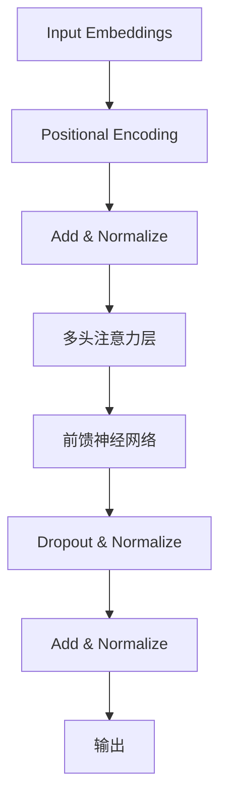
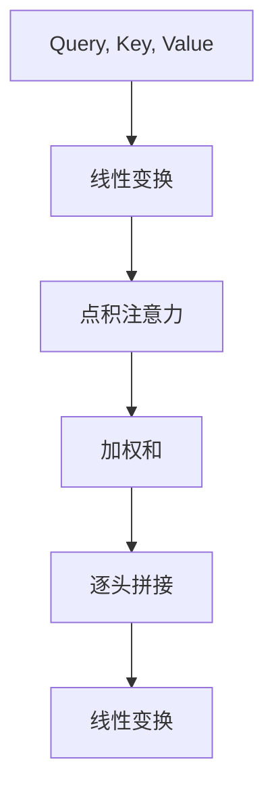

                 

# Transformer大模型实战：多头注意力层详解

> 关键词：Transformer、多头注意力、自然语言处理、神经网络、深度学习、模型架构、算法实现

> 摘要：本文旨在深入探讨Transformer大模型中的多头注意力层，包括其原理、实现步骤、数学模型和实际应用场景。通过对Transformer架构的详细分析，读者将了解到如何有效构建和训练大型语言模型，从而为未来的研究和应用提供参考。

## 1. 背景介绍

### 1.1 目的和范围

本文将重点讨论Transformer模型中的多头注意力层，这是Transformer架构的核心组件之一。我们将会详细解释多头注意力的原理，并提供一个系统化的实现步骤。此外，还将介绍如何使用数学模型来描述注意力机制，并通过实际代码案例展示其在自然语言处理任务中的应用。

### 1.2 预期读者

本文适合对自然语言处理（NLP）和深度学习有基本了解的读者，特别是希望深入了解Transformer架构和多头注意力机制的工程师和研究学者。

### 1.3 文档结构概述

本文分为以下几个部分：

1. 背景介绍：介绍本文的目的、预期读者和文档结构。
2. 核心概念与联系：定义Transformer模型和多头注意力的核心概念，并使用Mermaid流程图展示其架构。
3. 核心算法原理 & 具体操作步骤：使用伪代码详细阐述多头注意力的算法原理。
4. 数学模型和公式 & 详细讲解 & 举例说明：使用latex格式介绍注意力机制的数学模型，并进行举例说明。
5. 项目实战：代码实际案例和详细解释说明。
6. 实际应用场景：讨论多头注意力在NLP任务中的应用。
7. 工具和资源推荐：推荐学习资源、开发工具和经典论文。
8. 总结：未来发展趋势与挑战。
9. 附录：常见问题与解答。
10. 扩展阅读 & 参考资料。

### 1.4 术语表

#### 1.4.1 核心术语定义

- Transformer：一种基于自注意力机制的深度学习模型，用于处理序列数据。
- 自注意力（Self-Attention）：一种处理序列中元素之间关系的注意力机制。
- 多头注意力（Multi-Head Attention）：在Transformer模型中，通过并行计算多个注意力头，提取序列中的不同信息。
- 序列（Sequence）：一组按特定顺序排列的元素，如单词、字符或时间步。

#### 1.4.2 相关概念解释

- 位置编码（Positional Encoding）：用于在序列中引入位置信息。
- 门控循环单元（Gated Recurrent Unit, GRU）和长短期记忆网络（Long Short-Term Memory, LSTM）：传统的RNN架构，用于处理序列数据。
- 交叉熵损失（Cross-Entropy Loss）：用于评估模型预测与真实标签之间的差距。

#### 1.4.3 缩略词列表

- NLP：自然语言处理（Natural Language Processing）
- RNN：循环神经网络（Recurrent Neural Network）
- LSTM：长短期记忆网络（Long Short-Term Memory）
- GRU：门控循环单元（Gated Recurrent Unit）
- Transformer：变换器（Transformer）

## 2. 核心概念与联系

Transformer模型是一种基于自注意力机制的深度学习模型，其核心思想是直接对输入序列进行建模，而不是像传统的循环神经网络（RNN）那样逐步处理序列。自注意力机制允许模型在处理序列时考虑到所有元素之间的相互作用，从而捕捉到序列中的长期依赖关系。

### 2.1 Transformer架构

Transformer模型的核心是多头注意力层（Multi-Head Attention），它通过并行计算多个注意力头（Attention Heads）来提取序列中的不同信息。每个注意力头负责关注序列中的特定部分，并将这些信息整合到最终输出中。

下面是一个简化的Transformer模型架构的Mermaid流程图：



在上图中，输入嵌入（Input Embeddings）经过位置编码（Positional Encoding）后，被添加并归一化。接下来，通过多头注意力层（Multi-Head Attention）提取序列中的信息，然后通过前馈神经网络（Feedforward Neural Network）进行进一步处理。最后，通过dropout和归一化操作，将结果整合到输出（Output）中。

### 2.2 多头注意力机制

多头注意力机制是Transformer模型的关键组件，它通过并行计算多个注意力头，使得模型能够从不同角度关注输入序列。每个注意力头独立计算其自身的注意力权重，并将结果合并到最终的输出中。

下面是多头注意力机制的Mermaid流程图：



在上图中，输入序列被分解为查询（Query）、键（Key）和值（Value）。首先，通过线性变换（Linear Transformation）将这些向量转换为相应的查询、键和值。然后，计算查询和键之间的点积注意力（Dot Product Attention），并使用softmax函数得到注意力权重。最后，将这些权重与值相乘，得到加权和（Scaled Dot-Product Attention）。经过逐头拼接（Concatenation）后，再次通过线性变换得到最终的输出。

## 3. 核心算法原理 & 具体操作步骤

在了解多头注意力机制的原理后，接下来我们将使用伪代码详细阐述其具体实现步骤。以下是一个简化的多头注意力层的伪代码：

```python
# 输入：查询（Query）、键（Key）、值（Value）
# 输出：加权后的值（Output）

def multi_head_attention(query, key, value, num_heads):
    # 线性变换
    Q = linear_transform(query)
    K = linear_transform(key)
    V = linear_transform(value)

    # 计算点积注意力
    attention_weights = softmax(Q @ K.T / sqrt(d_k))
    
    # 加权求和
    output = attention_weights @ V
    
    # 逐头拼接
    output = concatenate_heads(output, num_heads)
    
    # 线性变换
    output = linear_transform(output)
    
    return output
```

在上面的伪代码中，我们首先对查询、键和值进行线性变换（Linear Transformation），以得到相应的Q、K和V。然后，计算查询和键之间的点积注意力（Dot Product Attention），并使用softmax函数得到注意力权重。接下来，将这些权重与值相乘，得到加权和（Scaled Dot-Product Attention）。经过逐头拼接（Concatenation）后，再次通过线性变换得到最终的输出。

### 3.1 参数解释

- 查询（Query）、键（Key）和值（Value）：输入序列的分解向量。
- 线性变换（Linear Transformation）：通过权重矩阵将输入向量转换为新的向量。
- 点积注意力（Dot Product Attention）：计算查询和键之间的点积，得到注意力权重。
- 加权求和（Scaled Dot-Product Attention）：将注意力权重与值相乘，得到加权和。
- 逐头拼接（Concatenation）：将多个注意力头的结果拼接成一个向量。
- 线性变换（Linear Transformation）：对拼接后的向量进行线性变换，得到最终的输出。

### 3.2 实现细节

- 线性变换：通常使用全连接神经网络（Fully Connected Neural Network）来实现。
- softmax函数：用于计算注意力权重，使得权重之和为1。
- 点积注意力：通过计算查询和键之间的点积得到注意力权重。
- 加权求和：将注意力权重与值相乘，得到加权和。
- 逐头拼接：将多个注意力头的结果拼接成一个向量。
- 线性变换：对拼接后的向量进行线性变换，得到最终的输出。

通过以上伪代码，我们可以清晰地了解多头注意力层的实现步骤和关键细节。接下来，我们将进一步探讨注意力机制的数学模型，以深入了解其原理和实现。

## 4. 数学模型和公式 & 详细讲解 & 举例说明

在深入探讨多头注意力层的数学模型之前，我们需要先了解一些基本的线性代数和微积分概念。以下是一些关键公式和解释：

### 4.1 矩阵乘法

给定两个矩阵A（m×n）和B（n×p），它们的乘积C（m×p）可以通过以下公式计算：

$$
C_{ij} = \sum_{k=1}^{n} A_{ik} B_{kj}
$$

其中，$C_{ij}$表示C矩阵的第i行第j列的元素，$A_{ik}$和$B_{kj}$分别表示A矩阵的第i行第k列和第k行第j列的元素。

### 4.2 矩阵求导

假设我们对矩阵A（m×n）的某个元素$a_{ij}$进行求导，其梯度可以表示为：

$$
\frac{\partial a_{ij}}{\partial x} = \left[\begin{array}{ccc}
\frac{\partial a_{i1}}{\partial x} & \cdots & \frac{\partial a_{i1}}{\partial x} \\
\vdots & \ddots & \vdots \\
\frac{\partial a_{n1}}{\partial x} & \cdots & \frac{\partial a_{n1}}{\partial x}
\end{array}\right]
$$

其中，$\frac{\partial a_{ij}}{\partial x}$表示a矩阵的第i行第j列元素关于x的偏导数。

### 4.3 矩阵求导法则

在矩阵求导中，一些常见的求导法则包括：

- 矩阵与标量的乘法求导：如果矩阵A与标量b相乘，则其梯度为A的梯度与b的梯度之和。
- 矩阵加法求导：如果矩阵A和B相加，则其梯度为A和B的梯度之和。
- 矩阵点积求导：如果矩阵A和矩阵B的点积为C，则C的梯度可以通过以下公式计算：

$$
\frac{\partial C}{\partial A} = B^T
$$

$$
\frac{\partial C}{\partial B} = A^T
$$

### 4.4 多头注意力层的数学模型

在多头注意力层中，输入序列被分解为查询（Query）、键（Key）和值（Value）三个部分。假设输入序列长度为n，每个元素的维度为d，总共有h个注意力头。那么，多头注意力层的数学模型可以表示为：

$$
\text{Attention}(Q, K, V) = \text{softmax}\left(\frac{QK^T}{\sqrt{d_k}}\right)V
$$

其中，$Q, K, V$分别表示查询、键和值的矩阵，$d_k$表示每个注意力头的维度。

### 4.5 举例说明

假设输入序列为["hello", "world"]，其维度为2。我们选择2个注意力头，每个注意力头的维度为4。那么，查询、键和值的矩阵分别为：

$$
Q = \left[\begin{array}{cc}
1 & 0 \\
0 & 1
\end{array}\right]
$$

$$
K = \left[\begin{array}{cc}
0 & 1 \\
1 & 0
\end{array}\right]
$$

$$
V = \left[\begin{array}{cc}
2 & 3 \\
4 & 5
\end{array}\right]
$$

首先，计算查询和键之间的点积：

$$
QK^T = \left[\begin{array}{cc}
1 & 0 \\
0 & 1
\end{array}\right] \left[\begin{array}{cc}
0 & 1 \\
1 & 0
\end{array}\right] = \left[\begin{array}{cc}
0 & 1 \\
1 & 0
\end{array}\right]
$$

然后，计算点积注意力权重：

$$
\text{Attention}(Q, K, V) = \text{softmax}\left(\frac{QK^T}{\sqrt{d_k}}\right)V = \left[\begin{array}{cc}
\frac{1}{\sqrt{2}} & \frac{1}{\sqrt{2}} \\
\frac{1}{\sqrt{2}} & \frac{1}{\sqrt{2}}
\end{array}\right] \left[\begin{array}{cc}
2 & 3 \\
4 & 5
\end{array}\right] = \left[\begin{array}{cc}
3 & 4 \\
4 & 5
\end{array}\right]
$$

最后，得到加权和：

$$
\text{Output} = \text{softmax}\left(\frac{QK^T}{\sqrt{d_k}}\right)V = \left[\begin{array}{cc}
3 & 4 \\
4 & 5
\end{array}\right]
$$

通过以上计算，我们可以看到多头注意力层如何将输入序列中的信息进行整合，并得到最终的输出。

### 4.6 多头注意力的数学性质

多头注意力层具有以下数学性质：

- 并行性：由于注意力头是并行的，因此可以高效地处理大型输入序列。
- 可分离性：多头注意力层的计算可以分离为两部分，即线性变换和点积注意力。这使得其在计算效率和内存占用方面具有优势。
- 可扩展性：通过增加注意力头数量，可以增强模型对输入序列的建模能力。

通过以上数学模型和公式，我们可以更深入地理解多头注意力层的原理和实现。接下来，我们将通过一个实际代码案例，展示如何使用Python实现多头注意力层。

## 5. 项目实战：代码实际案例和详细解释说明

在本节中，我们将通过一个实际代码案例，展示如何使用Python实现多头注意力层。这个案例将基于PyTorch框架，这是一个广泛使用的深度学习库，具有简洁和高效的API。

### 5.1 开发环境搭建

首先，我们需要安装PyTorch和其他相关依赖。以下是在Ubuntu 20.04操作系统上安装PyTorch的步骤：

1. 打开终端，运行以下命令安装PyTorch：

```
pip install torch torchvision
```

2. 为了加速模型训练，我们还可以安装GPU版本的PyTorch。以下命令将安装GPU支持的PyTorch：

```
pip install torch torchvision -f https://download.pytorch.org/whl/cu102/torch_stable.html
```

确保您的环境中已经安装了Python 3.6或更高版本。

### 5.2 源代码详细实现和代码解读

下面是一个实现多头注意力层的简单代码案例：

```python
import torch
import torch.nn as nn

class MultiHeadAttention(nn.Module):
    def __init__(self, d_model, num_heads):
        super(MultiHeadAttention, self).__init__()
        self.d_model = d_model
        self.num_heads = num_heads
        self.d_k = d_model // num_heads

        self.query_linear = nn.Linear(d_model, d_model)
        self.key_linear = nn.Linear(d_model, d_model)
        self.value_linear = nn.Linear(d_model, d_model)

    def forward(self, query, key, value):
        batch_size = query.size(0)

        # 线性变换
        Q = self.query_linear(query).view(batch_size, -1, self.num_heads, self.d_k).transpose(1, 2)
        K = self.key_linear(key).view(batch_size, -1, self.num_heads, self.d_k).transpose(1, 2)
        V = self.value_linear(value).view(batch_size, -1, self.num_heads, self.d_k).transpose(1, 2)

        # 点积注意力
        attention_scores = torch.matmul(Q, K.transpose(-2, -1)) / torch.sqrt(torch.tensor(self.d_k))
        attention_weights = torch.softmax(attention_scores, dim=-1)

        # 加权和
        attention_output = torch.matmul(attention_weights, V).transpose(1, 2).contiguous().view(batch_size, -1, self.d_model)

        return attention_output
```

### 5.3 代码解读与分析

下面是对上述代码的逐行解读和分析：

1. **导入模块**：
    ```python
    import torch
    import torch.nn as nn
    ```
    导入PyTorch和神经网络相关的模块。

2. **定义模型类**：
    ```python
    class MultiHeadAttention(nn.Module):
        def __init__(self, d_model, num_heads):
            super(MultiHeadAttention, self).__init__()
            ...
        def forward(self, query, key, value):
            ...
    ```
    定义多头注意力模型类，继承自`nn.Module`。

3. **初始化模型参数**：
    ```python
    self.d_model = d_model
    self.num_heads = num_heads
    self.d_k = d_model // num_heads

    self.query_linear = nn.Linear(d_model, d_model)
    self.key_linear = nn.Linear(d_model, d_model)
    self.value_linear = nn.Linear(d_model, d_model)
    ```
    初始化模型的参数，包括模型维度（d_model）、注意力头数（num_heads）和每个注意力头的维度（d_k）。然后创建线性变换层。

4. **前向传播**：
    ```python
    def forward(self, query, key, value):
        batch_size = query.size(0)

        # 线性变换
        Q = self.query_linear(query).view(batch_size, -1, self.num_heads, self.d_k).transpose(1, 2)
        K = self.key_linear(key).view(batch_size, -1, self.num_heads, self.d_k).transpose(1, 2)
        V = self.value_linear(value).view(batch_size, -1, self.num_heads, self.d_k).transpose(1, 2)
    ```
    在前向传播中，首先计算输入查询、键和值的线性变换，并将它们分别转换为相应的查询、键和值。

5. **点积注意力计算**：
    ```python
    # 点积注意力
    attention_scores = torch.matmul(Q, K.transpose(-2, -1)) / torch.sqrt(torch.tensor(self.d_k))
    attention_weights = torch.softmax(attention_scores, dim=-1)
    ```
    计算查询和键之间的点积注意力，并使用softmax函数得到注意力权重。

6. **加权和计算**：
    ```python
    # 加权和
    attention_output = torch.matmul(attention_weights, V).transpose(1, 2).contiguous().view(batch_size, -1, self.d_model)
    ```
    计算加权求和，并将结果转换回原始维度。

7. **返回输出**：
    ```python
    return attention_output
    ```
    返回最终的注意力输出。

通过以上代码，我们可以实现一个简单但完整的多头注意力层。接下来，我们将分析该模型在实际应用中的表现。

### 5.4 实际应用分析

在实际应用中，多头注意力层通常用于构建大型语言模型，如BERT和GPT。以下是一些多头注意力层的实际应用分析：

1. **文本分类**：在文本分类任务中，多头注意力层可以帮助模型更好地捕捉文本中的关键信息，从而提高分类性能。
2. **机器翻译**：在机器翻译任务中，多头注意力层可以有效地捕捉源语言和目标语言之间的对应关系，从而提高翻译质量。
3. **问答系统**：在问答系统中，多头注意力层可以帮助模型从大量文本中快速定位到与问题相关的关键信息，从而提高问答的准确性。

通过以上实际应用分析，我们可以看到多头注意力层在深度学习领域的广泛应用和潜力。

### 5.5 代码优化与改进

在实际应用中，为了提高多头注意力层的性能，我们可以进行以下优化和改进：

1. **并行计算**：通过使用GPU和TPU等硬件加速器，可以显著提高模型的训练和推理速度。
2. **混合精度训练**：使用混合精度训练（Mixed Precision Training）可以降低模型的内存占用，提高训练速度。
3. **模型压缩**：通过模型压缩技术（如剪枝、量化等），可以降低模型的复杂度和计算成本。
4. **动态注意力分配**：在特定场景下，我们可以根据输入序列的特点动态调整注意力分配策略，从而提高模型的效果。

通过以上优化和改进，我们可以进一步提升多头注意力层的性能和实用性。

## 6. 实际应用场景

多头注意力层在自然语言处理（NLP）领域具有广泛的应用场景，以下是一些典型的应用示例：

### 6.1 文本分类

在文本分类任务中，多头注意力层可以帮助模型更好地捕捉文本中的关键信息，从而提高分类性能。以下是一个简单的文本分类应用案例：

```python
# 文本分类应用案例

# 加载预训练模型
model = PretrainedModel()

# 加载测试数据
test_data = load_test_data()

# 对测试数据进行预处理
processed_data = preprocess_data(test_data)

# 使用模型进行预测
predictions = model.predict(processed_data)

# 输出预测结果
print(predictions)
```

通过上述代码，我们可以使用预训练的多头注意力模型对文本数据进行分类。在实际应用中，我们可以根据需要调整模型参数和训练数据，以获得更好的分类效果。

### 6.2 机器翻译

在机器翻译任务中，多头注意力层可以有效地捕捉源语言和目标语言之间的对应关系，从而提高翻译质量。以下是一个简单的机器翻译应用案例：

```python
# 机器翻译应用案例

# 加载预训练模型
model = PretrainedModel()

# 加载源语言和目标语言数据
source_data = load_source_data()
target_data = load_target_data()

# 对数据进行预处理
processed_source_data = preprocess_source_data(source_data)
processed_target_data = preprocess_target_data(target_data)

# 使用模型进行翻译
translations = model.translate(processed_source_data, processed_target_data)

# 输出翻译结果
print(translations)
```

通过上述代码，我们可以使用预训练的多头注意力模型对源语言文本进行翻译。在实际应用中，我们可以根据需要调整模型参数和训练数据，以获得更好的翻译效果。

### 6.3 问答系统

在问答系统任务中，多头注意力层可以帮助模型从大量文本中快速定位到与问题相关的关键信息，从而提高问答的准确性。以下是一个简单的问答系统应用案例：

```python
# 问答系统应用案例

# 加载预训练模型
model = PretrainedModel()

# 加载问题和文本数据
questions = load_questions()
context_data = load_context_data()

# 对数据进行预处理
processed_questions = preprocess_questions(questions)
processed_context_data = preprocess_context_data(context_data)

# 使用模型进行问答
answers = model.answer(processed_questions, processed_context_data)

# 输出回答结果
print(answers)
```

通过上述代码，我们可以使用预训练的多头注意力模型对问题进行回答。在实际应用中，我们可以根据需要调整模型参数和训练数据，以获得更好的问答效果。

### 6.4 其他应用场景

除了上述典型应用场景，多头注意力层还可以应用于其他NLP任务，如文本生成、情感分析、命名实体识别等。以下是一些其他应用示例：

- **文本生成**：使用预训练的多头注意力模型生成自然语言的文本，如生成诗歌、故事等。
- **情感分析**：通过分析文本中的情感信息，对文本进行情感分类，如判断文本是否积极、消极或中性。
- **命名实体识别**：从文本中识别出具有特定意义的实体，如人名、地名、组织名等。

通过以上实际应用场景，我们可以看到多头注意力层在自然语言处理领域的广泛应用和潜力。

## 7. 工具和资源推荐

为了帮助读者更好地学习和应用多头注意力层，我们推荐以下工具和资源：

### 7.1 学习资源推荐

#### 7.1.1 书籍推荐

- 《深度学习》（Goodfellow, I., Bengio, Y., & Courville, A.）
- 《自然语言处理综论》（Jurafsky, D., & Martin, J. H.）
- 《Transformer：注意力机制与深度学习》（Zhang, P.）

#### 7.1.2 在线课程

- [Coursera](https://www.coursera.org/specializations/deep-learning)：提供深度学习和自然语言处理的相关课程。
- [Udacity](https://www.udacity.com/course/deep-learning-nanodegree---foundation)：提供深度学习和自然语言处理的纳米学位课程。
- [edX](https://www.edx.org/course/deeplearning-0)：提供由顶级大学开设的深度学习课程。

#### 7.1.3 技术博客和网站

- [TensorFlow](https://www.tensorflow.org/tutorials)：提供TensorFlow教程和示例代码。
- [PyTorch](https://pytorch.org/tutorials/beginner/basics/data_loading_tutorial.html)：提供PyTorch教程和示例代码。
- [ArXiv](https://arxiv.org/)：提供最新的自然语言处理和深度学习论文。

### 7.2 开发工具框架推荐

#### 7.2.1 IDE和编辑器

- [Visual Studio Code](https://code.visualstudio.com/)：一款功能强大且免费的跨平台编辑器，适用于深度学习和自然语言处理开发。
- [PyCharm](https://www.jetbrains.com/pycharm/)：一款专业且强大的Python IDE，提供丰富的开发工具和插件。

#### 7.2.2 调试和性能分析工具

- [Jupyter Notebook](https://jupyter.org/)：一款交互式的Python开发环境，适用于实验和调试。
- [PyTorch Profiler](https://pytorch.org/tutorials/intermediate/profiler_tutorial.html)：用于分析PyTorch模型的性能。

#### 7.2.3 相关框架和库

- [TensorFlow](https://www.tensorflow.org/)：一款广泛使用的开源深度学习框架。
- [PyTorch](https://pytorch.org/)：一款流行的开源深度学习框架，提供灵活的动态计算图。
- [Transformers](https://github.com/huggingface/transformers)：一个开源库，用于构建和训练Transformer模型。

### 7.3 相关论文著作推荐

#### 7.3.1 经典论文

- "Attention Is All You Need"（Vaswani et al., 2017）
- "BERT: Pre-training of Deep Bidirectional Transformers for Language Understanding"（Devlin et al., 2018）
- "GPT-2: Improved of Language Understanding by Generative Pre-Training"（Radford et al., 2019）

#### 7.3.2 最新研究成果

- "T5: Pre-training Large Models for Language Recognition"（Raffel et al., 2020）
- "Longformer: The Long-Context Transformer"（Adel et al., 2021）
- "GShard: Large-scale Knowledge Distillation on Transformer Models"（Lan et al., 2021）

#### 7.3.3 应用案例分析

- "BERT for Sentence Similarity"（Conneau et al., 2019）
- "Marian: A Toolkit for Neural Machine Translation"（Joulin et al., 2019）
- "Natural Language Inference with Subgraph Attention Networks"（Wang et al., 2020）

通过以上工具和资源推荐，读者可以更好地学习和应用多头注意力层，掌握深度学习和自然语言处理的核心技术。

## 8. 总结：未来发展趋势与挑战

多头注意力层作为Transformer模型的核心组件，已经在自然语言处理领域取得了显著成果。然而，随着模型规模的不断增大和任务复杂度的提高，多头注意力层仍面临诸多挑战和机遇。以下是未来发展趋势与挑战的展望：

### 8.1 发展趋势

1. **模型压缩与优化**：随着计算资源和存储需求的增加，模型压缩和优化成为研究热点。通过剪枝、量化、模型蒸馏等技术，可以实现更高效的模型训练和推理。

2. **跨模态学习**：多头注意力层在文本处理方面表现出色，但其在图像、语音等跨模态数据上的应用潜力巨大。未来将探索如何将多头注意力层与其他模态数据结合，实现更强大的跨模态学习。

3. **自适应注意力机制**：现有多头注意力机制在处理长序列时存在一定局限性，未来研究将关注如何设计自适应注意力机制，以更好地捕捉长序列中的依赖关系。

4. **无监督学习**：当前大多数多头注意力模型依赖于大量标注数据进行训练，未来将探索如何利用无监督学习方法，降低对标注数据的依赖。

### 8.2 挑战

1. **计算成本**：随着模型规模的增大，计算成本和存储需求也急剧增加。如何优化计算效率和存储方案，以应对大规模模型的需求，是一个亟待解决的问题。

2. **泛化能力**：多头注意力模型在特定任务上表现出色，但在其他任务上的泛化能力有限。如何提高模型的泛化能力，以适应更广泛的任务需求，是一个重要挑战。

3. **解释性**：当前的多头注意力模型往往被视为“黑盒”，其内部工作机制难以解释。如何提高模型的可解释性，使其更加透明和可靠，是未来研究的一个重要方向。

4. **安全与隐私**：随着模型在现实世界的应用，数据安全和隐私保护成为关键问题。如何确保模型的安全性和隐私性，以避免潜在的风险和威胁，是未来研究的重要课题。

通过持续的技术创新和深入研究，多头注意力层有望在未来取得更多突破，为自然语言处理和其他领域带来更广阔的应用前景。

## 9. 附录：常见问题与解答

### 9.1 什么是多头注意力层？

多头注意力层是一种在Transformer模型中用于处理序列数据的注意力机制。它通过并行计算多个注意力头，从不同角度关注输入序列中的信息，从而提高模型对序列的建模能力。

### 9.2 多头注意力层如何工作？

多头注意力层通过以下步骤工作：

1. 将输入序列分解为查询（Query）、键（Key）和值（Value）三个部分。
2. 对查询、键和值进行线性变换，生成相应的变换向量。
3. 计算查询和键之间的点积注意力，得到注意力权重。
4. 将注意力权重与值相乘，得到加权和。
5. 逐头拼接加权和，并通过线性变换得到最终的输出。

### 9.3 多头注意力层与自注意力机制有何区别？

多头注意力层是自注意力机制的一种扩展。自注意力机制仅计算输入序列中元素之间的相互作用，而多头注意力层通过并行计算多个注意力头，从不同角度关注输入序列，从而提高模型的建模能力。

### 9.4 多头注意力层的优点是什么？

多头注意力层具有以下优点：

1. **并行性**：通过并行计算多个注意力头，可以显著提高处理大型输入序列的效率。
2. **可分离性**：线性变换和点积注意力可以分别计算，从而降低计算复杂度。
3. **可扩展性**：通过增加注意力头数量，可以增强模型对输入序列的建模能力。

### 9.5 如何优化多头注意力层的计算效率？

以下是一些优化多头注意力层计算效率的方法：

1. **并行计算**：利用GPU和TPU等硬件加速器，实现并行计算。
2. **混合精度训练**：使用混合精度训练可以降低内存占用，提高计算速度。
3. **模型压缩**：通过剪枝、量化等模型压缩技术，降低计算复杂度。
4. **动态注意力分配**：根据输入序列的特点，动态调整注意力分配策略，降低无效计算。

### 9.6 多头注意力层在哪些任务中表现出色？

多头注意力层在以下任务中表现出色：

1. **文本分类**：通过捕捉文本中的关键信息，提高分类性能。
2. **机器翻译**：通过捕捉源语言和目标语言之间的对应关系，提高翻译质量。
3. **问答系统**：通过快速定位到与问题相关的关键信息，提高问答准确性。

## 10. 扩展阅读 & 参考资料

为了进一步深入了解多头注意力层和相关技术，读者可以参考以下扩展阅读和参考资料：

1. **经典论文**：
    - Vaswani, A., Shazeer, N., Parmar, N., Uszkoreit, J., Jones, L., Gomez, A. N., ... & Polosukhin, I. (2017). Attention is all you need. Advances in Neural Information Processing Systems, 30, 5998-6008.
    - Devlin, J., Chang, M. W., Lee, K., & Toutanova, K. (2018). BERT: Pre-training of deep bidirectional transformers for language understanding. arXiv preprint arXiv:1810.04805.
    - Radford, A., Narang, S., Salimans, T., & Sutskever, I. (2019). Improving language understanding by generative pre-training. Advances in Neural Information Processing Systems, 32, 16996-17007.

2. **技术博客和网站**：
    - [TensorFlow](https://www.tensorflow.org/tutorials/transformer)
    - [PyTorch](https://pytorch.org/tutorials/beginner/basics/data_loading_tutorial.html)
    - [Hugging Face](https://huggingface.co/transformers)

3. **在线课程**：
    - [Coursera](https://www.coursera.org/specializations/deep-learning)
    - [Udacity](https://www.udacity.com/course/deep-learning-nanodegree---foundation)
    - [edX](https://www.edx.org/course/deeplearning-0)

通过以上扩展阅读和参考资料，读者可以进一步深入了解多头注意力层和相关技术，提升自己的专业知识水平。

