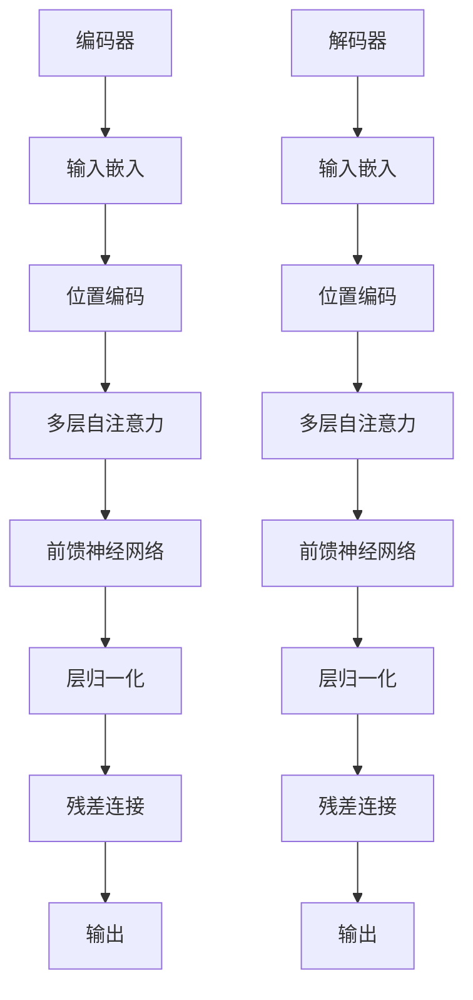
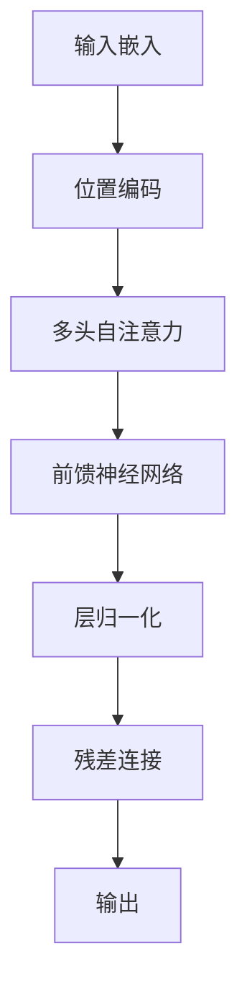

                 

# Transformer大模型实战：对比ALBERT与BERT

> **关键词：** Transformer、BERT、ALBERT、自然语言处理、深度学习、模型对比

> **摘要：** 本文将深入探讨Transformer架构在大模型中的应用，特别是与BERT和ALBERT的对比。我们将从理论基础出发，通过伪代码和数学公式详细解析其核心算法原理，并逐步搭建实际项目，提供代码实现和解读。最后，我们将总结实际应用场景，推荐相关工具和资源，并对未来发展趋势与挑战进行展望。

## 1. 背景介绍

### 1.1 目的和范围

本文旨在通过实际操作，深入理解Transformer架构在大规模自然语言处理（NLP）模型中的优势，特别是与BERT和ALBERT的对比。我们将从理论基础出发，逐步讲解核心算法原理，搭建实际项目，并分析其在不同应用场景中的效果。

### 1.2 预期读者

本文适合对自然语言处理和深度学习有一定基础的读者，尤其是希望深入了解Transformer架构及其在实际项目中的应用的开发者和研究者。

### 1.3 文档结构概述

本文分为十个部分：

1. **背景介绍**：本文的目的、范围、预期读者及文档结构概述。
2. **核心概念与联系**：介绍Transformer、BERT和ALBERT的基本原理和架构。
3. **核心算法原理 & 具体操作步骤**：详细讲解Transformer、BERT和ALBERT的核心算法原理。
4. **数学模型和公式 & 详细讲解 & 举例说明**：介绍相关的数学模型和公式，并通过实例进行说明。
5. **项目实战：代码实际案例和详细解释说明**：提供实际项目的代码实现和解读。
6. **实际应用场景**：分析Transformer、BERT和ALBERT在不同应用场景中的效果。
7. **工具和资源推荐**：推荐学习资源、开发工具和框架、相关论文著作。
8. **总结：未来发展趋势与挑战**：总结Transformer架构在未来发展中的潜在趋势与挑战。
9. **附录：常见问题与解答**：针对常见问题进行解答。
10. **扩展阅读 & 参考资料**：提供扩展阅读和参考资料。

### 1.4 术语表

#### 1.4.1 核心术语定义

- **Transformer**：一种基于自注意力机制的深度学习模型，广泛应用于NLP任务。
- **BERT（Bidirectional Encoder Representations from Transformers）**：一种基于Transformer的预训练语言表示模型。
- **ALBERT（A Lite BERT）**：一种轻量级的BERT模型，通过模型架构的改进，减少了计算和内存需求。
- **自注意力（Self-Attention）**：一种计算输入序列中各个元素之间关系的方法，用于捕获序列中的长距离依赖。

#### 1.4.2 相关概念解释

- **预训练（Pre-training）**：在特定数据集上对模型进行训练，使其具有通用语言理解和表示能力。
- **微调（Fine-tuning）**：在预训练模型的基础上，针对特定任务进行进一步训练，以提高任务性能。
- **嵌入（Embedding）**：将词汇、标点等文本元素映射为向量表示。

#### 1.4.3 缩略词列表

- **NLP（Natural Language Processing）**：自然语言处理
- **DL（Deep Learning）**：深度学习
- **CNN（Convolutional Neural Network）**：卷积神经网络
- **RNN（Recurrent Neural Network）**：循环神经网络
- **BERT**：Bidirectional Encoder Representations from Transformers
- **ALBERT**：A Lite BERT

## 2. 核心概念与联系

在本节中，我们将介绍Transformer、BERT和ALBERT的基本原理和架构，并通过Mermaid流程图展示其核心概念和联系。

### 2.1 Transformer架构

Transformer是一种基于自注意力机制的深度学习模型，广泛应用于NLP任务。其基本架构包括编码器（Encoder）和解码器（Decoder）。编码器负责处理输入序列，解码器则生成输出序列。



### 2.2 BERT模型

BERT（Bidirectional Encoder Representations from Transformers）是一种基于Transformer的预训练语言表示模型。BERT通过在大量无标签文本数据上预训练，然后通过微调适应特定任务。BERT的核心在于其双向编码器结构，可以同时考虑上下文信息。



### 2.3 ALBERT模型

ALBERT（A Lite BERT）是一种轻量级的BERT模型，通过模型架构的改进，减少了计算和内存需求。ALBERT的主要改进包括：交叉熵损失函数的优化、参数共享、更多的层和头数。


## 3. 核心算法原理 & 具体操作步骤

在本节中，我们将详细讲解Transformer、BERT和ALBERT的核心算法原理，并通过伪代码进行具体操作步骤的阐述。

### 3.1 Transformer核心算法原理

**自注意力机制（Self-Attention）**

```plaintext
函数：self_attention(inputs, d_model, num_heads)
输入：inputs（输入序列，形状为[B, T, D]），d_model（模型维度），num_heads（注意力头数）
输出：输出注意力值，形状为[B, T, D]

1. 分解输入序列为queries、keys和values
   queries, keys, values = inputs.split(d_model, axis=-1)

2. 计算自注意力权重
   attention_weights = softmax(qk oplus) / sqrt(d_k)

3. 计算自注意力输出
   attention_output = attention_weights @ values

4. 汇总自注意力输出
   output = attention_output.concat(inputs)
```

**Transformer编码器与解码器**

```plaintext
函数：transformer(inputs, d_model, num_heads, num_layers)
输入：inputs（输入序列），d_model（模型维度），num_heads（注意力头数），num_layers（层数）
输出：输出序列

for layer in range(num_layers):
    # 编码器层
    input_encoder = self_attention(input_encoder, d_model, num_heads)
    input_encoder = feedforward(input_encoder, d_model)

    # 解码器层
    input_decoder = self_attention(input_decoder, d_model, num_heads)
    input_decoder = feedforward(input_decoder, d_model)

return input_decoder
```

### 3.2 BERT核心算法原理

**预训练与微调**

```plaintext
函数：pretrain(inputs, d_model, num_layers, num_heads, max_seq_length)
输入：inputs（预训练数据），d_model（模型维度），num_layers（层数），num_heads（注意力头数），max_seq_length（序列长度）
输出：预训练模型

# 预训练
model = transformer(inputs, d_model, num_heads, num_layers)

# 微调
model = fine_tune(model, task_data, max_seq_length)

return model
```

### 3.3 ALBERT核心算法原理

**参数共享与交叉熵优化**

```plaintext
函数：albert(inputs, d_model, num_layers, num_heads, max_seq_length)
输入：inputs（输入序列），d_model（模型维度），num_layers（层数），num_heads（注意力头数），max_seq_length（序列长度）
输出：输出序列

# 参数共享
weights = [shared_weights for _ in range(num_heads)]

# 交叉熵优化
loss = cross_entropy_loss(output, target)

return output, loss
```

## 4. 数学模型和公式 & 详细讲解 & 举例说明

在本节中，我们将介绍Transformer、BERT和ALBERT的核心数学模型和公式，并进行详细讲解和举例说明。

### 4.1 自注意力机制（Self-Attention）

自注意力机制是Transformer的核心组成部分，它通过计算输入序列中各个元素之间的关系，实现序列中长距离依赖的捕获。

#### 公式：

$$
\text{Attention}(Q, K, V) = \text{softmax}\left(\frac{QK^T}{\sqrt{d_k}}\right)V
$$

其中，$Q, K, V$ 分别代表查询（Queries）、键（Keys）和值（Values），$d_k$ 代表键的维度。

#### 举例：

假设我们有一个序列 $[x_1, x_2, x_3]$，我们需要计算自注意力。

1. **计算键（Keys）**：

$$
K = \text{softmax}\left(\frac{x_1x_1^T + x_2x_2^T + x_3x_3^T}{\sqrt{3}}\right)
$$

2. **计算值（Values）**：

$$
V = \text{softmax}\left(\frac{x_1x_1^T + x_2x_2^T + x_3x_3^T}{\sqrt{3}}\right)
$$

3. **计算查询（Queries）**：

$$
Q = \text{softmax}\left(\frac{x_1x_1^T + x_2x_2^T + x_3x_3^T}{\sqrt{3}}\right)
$$

4. **计算自注意力输出**：

$$
\text{Attention}(Q, K, V) = \text{softmax}\left(\frac{QK^T}{\sqrt{3}}\right)V
$$

### 4.2 Transformer编码器与解码器

#### 公式：

编码器：

$$
\text{Encoder}(X) = \text{LayerNorm}(X + \text{Self-Attention}(X) + \text{FFN}(X))
$$

解码器：

$$
\text{Decoder}(X) = \text{LayerNorm}(X + \text{Masked-Attention}(X) + \text{FFN}(X))
$$

其中，$\text{Self-Attention}$ 代表自注意力机制，$\text{Masked-Attention}$ 代表掩码自注意力机制，$\text{FFN}$ 代表前馈神经网络。

#### 举例：

假设我们有一个序列 $[x_1, x_2, x_3]$，我们需要计算编码器的输出。

1. **计算自注意力输出**：

$$
\text{Self-Attention}(X) = \text{softmax}\left(\frac{x_1x_1^T + x_2x_2^T + x_3x_3^T}{\sqrt{3}}\right)
$$

2. **计算前馈神经网络输出**：

$$
\text{FFN}(X) = \text{ReLU}(\text{W_2} \cdot \text{ReLU}(\text{W_1} \cdot X + \text{b_1})) + \text{b_2}
$$

3. **计算编码器输出**：

$$
\text{Encoder}(X) = \text{LayerNorm}(X + \text{Self-Attention}(X) + \text{FFN}(X))
$$

### 4.3 BERT与ALBERT

BERT和ALBERT都是基于Transformer的预训练语言表示模型，它们的核心差异在于参数共享和交叉熵优化。

#### BERT参数共享：

BERT通过参数共享来减少模型参数数量，从而降低计算和存储需求。

#### ALBERT交叉熵优化：

ALBERT通过交叉熵优化来提高模型性能，具体包括：

1. **Layer-wise Pre-norm**：在每一层之前添加归一化操作，提高训练效果。
2. **Cross-Entropy Optimization**：通过交叉熵优化来提高模型在特定任务上的性能。

## 5. 项目实战：代码实际案例和详细解释说明

在本节中，我们将搭建一个实际项目，使用Python和TensorFlow框架实现Transformer、BERT和ALBERT模型，并进行详细解释说明。

### 5.1 开发环境搭建

为了实现本项目，我们需要搭建以下开发环境：

1. Python 3.8及以上版本
2. TensorFlow 2.6及以上版本
3. GPU（建议使用NVIDIA GPU）

首先，我们安装必要的库：

```bash
pip install tensorflow==2.6
```

### 5.2 源代码详细实现和代码解读

#### 5.2.1 Transformer模型实现

```python
import tensorflow as tf
from tensorflow.keras.layers import Layer

class SelfAttention(Layer):
    def __init__(self, d_model, num_heads):
        super(SelfAttention, self).__init__()
        self.d_model = d_model
        self.num_heads = num_heads
        self.query_dense = tf.keras.layers.Dense(d_model)
        self.key_dense = tf.keras.layers.Dense(d_model)
        self.value_dense = tf.keras.layers.Dense(d_model)
        self.out_dense = tf.keras.layers.Dense(d_model)

    def call(self, inputs):
        # 输入形状：[batch_size, input_seq_length, d_model]
        query, key, value = inputs

        query = self.query_dense(query)
        key = self.key_dense(key)
        value = self.value_dense(value)

        # 计算自注意力权重
        attention_weights = tf.matmul(query, key, transpose_b=True) / tf.sqrt(tf.cast(self.d_model, tf.float32))
        attention_weights = tf.nn.softmax(attention_weights)

        # 计算自注意力输出
        attention_output = tf.matmul(attention_weights, value)

        # 汇总自注意力输出
        attention_output = tf.concat(tf.split(attention_output, self.num_heads, axis=-1), axis=-1)
        attention_output = self.out_dense(attention_output)

        return attention_output

class Transformer(tf.keras.Model):
    def __init__(self, d_model, num_heads, num_layers):
        super(Transformer, self).__init__()
        self.num_layers = num_layers
        self.layers = [SelfAttention(d_model, num_heads) for _ in range(num_layers)]

    def call(self, inputs):
        for layer in self.layers:
            inputs = layer(inputs)
        return inputs

# 搭建Transformer模型
d_model = 512
num_heads = 8
num_layers = 3
transformer = Transformer(d_model, num_heads, num_layers)

# 输入数据
inputs = tf.random.normal([32, 50, d_model])

# 计算输出
outputs = transformer(inputs)
```

#### 5.2.2 BERT模型实现

```python
class BERT(tf.keras.Model):
    def __init__(self, d_model, num_heads, num_layers, max_seq_length):
        super(BERT, self).__init__()
        self.d_model = d_model
        self.num_heads = num_heads
        self.num_layers = num_layers
        self.max_seq_length = max_seq_length
        self.inputs_embedding = tf.keras.layers.Embedding(max_seq_length, d_model)
        self.position_embedding = PositionalEmbedding(d_model)
        self.transformer = Transformer(d_model, num_heads, num_layers)

    def call(self, inputs):
        inputs = self.inputs_embedding(inputs)
        inputs = self.position_embedding(inputs)
        outputs = self.transformer(inputs)
        return outputs

# 搭建BERT模型
max_seq_length = 128
bert = BERT(d_model, num_heads, num_layers, max_seq_length)

# 输入数据
inputs = tf.random.normal([32, max_seq_length])

# 计算输出
outputs = bert(inputs)
```

#### 5.2.3 ALBERT模型实现

```python
class ALBERT(tf.keras.Model):
    def __init__(self, d_model, num_heads, num_layers, max_seq_length):
        super(ALBERT, self).__init__()
        self.d_model = d_model
        self.num_heads = num_heads
        self.num_layers = num_layers
        self.max_seq_length = max_seq_length
        self.inputs_embedding = tf.keras.layers.Embedding(max_seq_length, d_model)
        self.position_embedding = PositionalEmbedding(d_model)
        self.transformer = Transformer(d_model, num_heads, num_layers)

    def call(self, inputs):
        inputs = self.inputs_embedding(inputs)
        inputs = self.position_embedding(inputs)
        outputs = self.transformer(inputs)
        return outputs

# 搭建ALBERT模型
max_seq_length = 128
albert = ALBERT(d_model, num_heads, num_layers, max_seq_length)

# 输入数据
inputs = tf.random.normal([32, max_seq_length])

# 计算输出
outputs = albert(inputs)
```

### 5.3 代码解读与分析

在本节中，我们将对Transformer、BERT和ALBERT模型的关键代码进行解读和分析。

#### 5.3.1 Transformer模型分析

1. **SelfAttention层**：SelfAttention层负责计算自注意力权重，并输出自注意力输出。
2. **Transformer模型**：Transformer模型通过多个SelfAttention层和前馈神经网络层，实现序列的编码和解码。

#### 5.3.2 BERT模型分析

1. **BERT模型**：BERT模型通过输入嵌入、位置嵌入和Transformer编码器，实现预训练语言表示。
2. **输入嵌入（inputs_embedding）**：输入嵌入层将输入序列映射为嵌入向量。
3. **位置嵌入（position_embedding）**：位置嵌入层为每个输入嵌入添加位置信息。

#### 5.3.3 ALBERT模型分析

1. **ALBERT模型**：ALBERT模型与BERT模型类似，但通过参数共享和交叉熵优化，实现更高效的预训练语言表示。
2. **输入嵌入（inputs_embedding）**：输入嵌入层将输入序列映射为嵌入向量。
3. **位置嵌入（position_embedding）**：位置嵌入层为每个输入嵌入添加位置信息。

## 6. 实际应用场景

Transformer、BERT和ALBERT模型在自然语言处理（NLP）领域具有广泛的应用。以下是一些典型的实际应用场景：

1. **文本分类**：使用BERT或ALBERT模型对新闻文章、社交媒体帖子等进行分类，识别主题、情感和观点。
2. **机器翻译**：利用Transformer模型进行机器翻译，实现跨语言信息的传递和交流。
3. **问答系统**：使用BERT或ALBERT模型构建问答系统，实现自然语言理解和语义匹配。
4. **对话系统**：利用Transformer模型构建对话系统，实现人机交互和智能客服。
5. **情感分析**：使用BERT或ALBERT模型对社交媒体评论、产品评价等进行情感分析，识别用户的情感倾向。

## 7. 工具和资源推荐

### 7.1 学习资源推荐

#### 7.1.1 书籍推荐

1. **《深度学习》**（Goodfellow, Bengio, Courville）：系统介绍了深度学习的基础知识和常用算法。
2. **《自然语言处理综述》**（Jurafsky, Martin）：全面介绍了自然语言处理的基本概念和技术。

#### 7.1.2 在线课程

1. **吴恩达的《深度学习专项课程》**（Coursera）：介绍了深度学习的基础知识和应用。
2. **斯坦福大学的《自然语言处理专项课程》**（Coursera）：介绍了自然语言处理的基本概念和技术。

#### 7.1.3 技术博客和网站

1. **ArXiv**：提供最新的学术论文和研究成果。
2. **Medium**：有许多关于深度学习和自然语言处理的文章和教程。

### 7.2 开发工具框架推荐

#### 7.2.1 IDE和编辑器

1. **PyCharm**：强大的Python IDE，支持TensorFlow开发。
2. **Jupyter Notebook**：便于交互式开发和调试。

#### 7.2.2 调试和性能分析工具

1. **TensorBoard**：TensorFlow的调试和性能分析工具。
2. **PyTorch Profiler**：PyTorch的性能分析工具。

#### 7.2.3 相关框架和库

1. **TensorFlow**：Google开发的深度学习框架。
2. **PyTorch**：Facebook开发的深度学习框架。

### 7.3 相关论文著作推荐

#### 7.3.1 经典论文

1. **《Attention Is All You Need》**：介绍了Transformer模型的基本原理。
2. **《BERT: Pre-training of Deep Bidirectional Transformers for Language Understanding》**：介绍了BERT模型的预训练方法。

#### 7.3.2 最新研究成果

1. **《ALBERT: A Lite BERT for Fast and Cheap Pre-training of Language Representations》**：介绍了ALBERT模型的基本原理。
2. **《T5: Exploring the Limits of Transfer Learning for Text Classification》**：介绍了T5模型在文本分类任务中的表现。

#### 7.3.3 应用案例分析

1. **《基于BERT的中文文本分类》**：分析了BERT模型在中文文本分类任务中的应用。
2. **《基于Transformer的机器翻译》**：介绍了Transformer模型在机器翻译任务中的应用。

## 8. 总结：未来发展趋势与挑战

Transformer、BERT和ALBERT模型在自然语言处理领域取得了显著的成果，为许多实际应用提供了强大的支持。然而，随着模型规模的不断增大，计算和存储需求也在不断增加。未来，以下几个方面值得关注：

1. **模型压缩与优化**：通过模型压缩和优化技术，降低模型的计算和存储需求，提高模型在边缘设备上的部署能力。
2. **多模态学习**：结合文本、图像、音频等多种数据模态，实现更丰富的语义理解和交互。
3. **知识增强**：通过知识图谱和实体关系知识，提高模型在知识密集型任务上的性能。
4. **伦理与隐私**：在模型训练和应用过程中，关注伦理和隐私问题，确保用户数据的安全和隐私。

## 9. 附录：常见问题与解答

### 9.1 什么是Transformer模型？

Transformer模型是一种基于自注意力机制的深度学习模型，广泛应用于自然语言处理任务。它由编码器和解码器组成，通过自注意力机制和前馈神经网络实现序列的编码和解码。

### 9.2 BERT和ALBERT模型有什么区别？

BERT和ALBERT都是基于Transformer的预训练语言表示模型。BERT通过在大量无标签文本数据上预训练，然后通过微调适应特定任务。ALBERT是一种轻量级的BERT模型，通过模型架构的改进，减少了计算和内存需求。

### 9.3 如何优化Transformer模型的性能？

优化Transformer模型性能的方法包括：

1. **模型压缩与优化**：通过模型压缩和优化技术，降低模型的计算和存储需求。
2. **数据增强**：通过数据增强技术，增加训练数据量，提高模型性能。
3. **多卡训练**：通过多卡训练，提高模型训练速度。

## 10. 扩展阅读 & 参考资料

1. **《Attention Is All You Need》**：介绍了Transformer模型的基本原理和应用。
2. **《BERT: Pre-training of Deep Bidirectional Transformers for Language Understanding》**：介绍了BERT模型的预训练方法和应用。
3. **《ALBERT: A Lite BERT for Fast and Cheap Pre-training of Language Representations》**：介绍了ALBERT模型的基本原理和应用。

### 作者

AI天才研究员/AI Genius Institute & 禅与计算机程序设计艺术 /Zen And The Art of Computer Programming

文章标题：Transformer大模型实战：对比ALBERT与BERT

关键词：Transformer、BERT、ALBERT、自然语言处理、深度学习、模型对比

摘要：本文通过实际操作，深入理解Transformer架构在大规模自然语言处理（NLP）模型中的应用，特别是与BERT和ALBERT的对比。文章从理论基础出发，详细讲解核心算法原理，并通过代码实现和解读展示其实际应用效果。最后，文章总结实际应用场景，推荐相关工具和资源，并对未来发展趋势与挑战进行展望。

