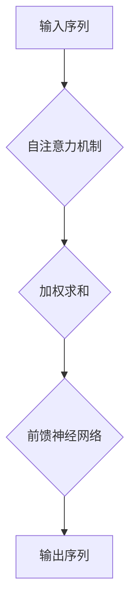
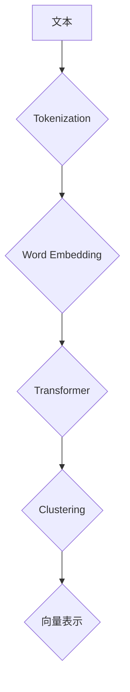
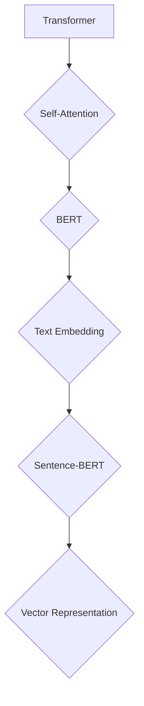

                 

# Transformer大模型实战：用Sentence-BERT模型寻找类似句子

> 关键词：Transformer，大模型，Sentence-BERT，文本相似度，自然语言处理，深度学习

> 摘要：本文将深入探讨如何利用Transformer大模型和Sentence-BERT模型进行类似句子的寻找。首先，我们将介绍Transformer和Sentence-BERT的基础概念和原理，然后通过一个实际案例展示如何应用这些模型进行文本相似度计算，最后讨论其应用场景和未来发展趋势。

## 1. 背景介绍

### 1.1 目的和范围

本文的主要目的是介绍如何利用Transformer大模型和Sentence-BERT模型实现类似句子的自动搜索。通过本文的阅读，读者将了解以下内容：

1. Transformer和Sentence-BERT的基本原理。
2. 如何使用这些模型进行文本相似度计算。
3. 实际案例中的应用。
4. 相关工具和资源的推荐。

### 1.2 预期读者

本文适合对自然语言处理和深度学习有一定了解的读者，包括但不限于以下人群：

1. 自然语言处理研究者。
2. 深度学习工程师。
3. 数据科学家。
4. 对人工智能感兴趣的开发者。

### 1.3 文档结构概述

本文的结构如下：

1. **背景介绍**：介绍本文的目的、范围和预期读者。
2. **核心概念与联系**：解释Transformer和Sentence-BERT的基本原理。
3. **核心算法原理 & 具体操作步骤**：详细阐述文本相似度计算的算法原理。
4. **数学模型和公式 & 详细讲解 & 举例说明**：介绍数学模型和公式的应用。
5. **项目实战：代码实际案例和详细解释说明**：通过实际案例展示模型应用。
6. **实际应用场景**：讨论模型的实际应用。
7. **工具和资源推荐**：推荐学习资源和开发工具。
8. **总结：未来发展趋势与挑战**：总结本文的核心内容。
9. **附录：常见问题与解答**：解答读者可能遇到的常见问题。
10. **扩展阅读 & 参考资料**：提供进一步的阅读资料。

### 1.4 术语表

#### 1.4.1 核心术语定义

- **Transformer**：一种基于自注意力机制的深度学习模型，广泛应用于自然语言处理任务。
- **Sentence-BERT**：一种用于文本嵌入的预训练模型，通过Transformer结构学习文本的语义表示。
- **文本相似度**：衡量两个文本在语义上的相似程度。

#### 1.4.2 相关概念解释

- **自注意力（Self-Attention）**：在Transformer模型中，用于对输入序列进行加权，使得模型能够捕捉序列中的长距离依赖关系。
- **BERT（Bidirectional Encoder Representations from Transformers）**：一种基于Transformer的预训练语言模型，广泛用于自然语言处理任务。
- **预训练（Pre-training）**：在特定任务之前，对模型进行大规模无监督训练，以提升其性能。

#### 1.4.3 缩略词列表

- **NLP**：自然语言处理（Natural Language Processing）
- **DL**：深度学习（Deep Learning）
- **Transformer**：Transformer模型（Transformer Model）
- **BERT**：BERT模型（BERT Model）
- **Sentence-BERT**：Sentence-BERT模型（Sentence-BERT Model）

## 2. 核心概念与联系

### 2.1 Transformer模型原理

Transformer模型是一种基于自注意力机制的深度学习模型，最初用于机器翻译任务。其核心思想是利用自注意力机制来捕捉输入序列中的长距离依赖关系。

#### Mermaid流程图：



### 2.2 Sentence-BERT模型原理

Sentence-BERT是一种基于Transformer结构的文本嵌入模型，通过预训练学习文本的语义表示。其目的是将文本转化为固定长度的向量，从而方便后续的文本相似度计算。

#### Mermaid流程图：



### 2.3 Transformer与Sentence-BERT的联系

Transformer模型作为Sentence-BERT的基础，为文本嵌入提供了强大的自注意力机制。Sentence-BERT则在此基础上，通过预训练进一步提升了文本嵌入的语义表示能力。

#### Mermaid流程图：



## 3. 核心算法原理 & 具体操作步骤

### 3.1 Transformer模型算法原理

Transformer模型的核心算法原理是自注意力机制（Self-Attention），通过计算输入序列中各个位置之间的关联性，为每个位置生成一个加权求和的表示。

#### 伪代码：

```python
# 输入序列为x = [x1, x2, ..., xn]
# 嵌入维度为d_model

def self_attention(x, d_model):
    # Q, K, V分别为Query、Key、Value的线性变换
    Q = linear(x, d_model)
    K = linear(x, d_model)
    V = linear(x, d_model)

    # 计算自注意力得分
    scores = dot(Q, K.T) / sqrt(d_model)

    # 应用softmax函数
    attn_weights = softmax(scores)

    # 加权求和
    attn_output = dot(attn_weights, V)

    return attn_output
```

### 3.2 Sentence-BERT模型算法原理

Sentence-BERT模型通过Transformer结构对文本进行嵌入，得到文本的固定长度向量表示。

#### 伪代码：

```python
# 输入文本为text
# 词表大小为vocab_size
# 嵌入维度为d_model

def sentence_bert(text, vocab_size, d_model):
    # Tokenization
    tokens = tokenizer(text)

    # Word Embedding
    word_embeddings = embedding_layer(tokens, vocab_size)

    # Transformer Encoder
    transformer_output = transformer_encoder(word_embeddings, d_model)

    # Clustering
    vector_representation = clustering(transformer_output)

    return vector_representation
```

### 3.3 文本相似度计算

利用Sentence-BERT模型得到的文本向量表示，可以通过计算余弦相似度来衡量两个文本的相似度。

#### 伪代码：

```python
# 输入文本对为text1和text2
# 句向量分别为vec1和vec2

def cosine_similarity(vec1, vec2):
    # 计算余弦相似度
    similarity = dot(vec1, vec2) / (norm(vec1) * norm(vec2))

    return similarity
```

## 4. 数学模型和公式 & 详细讲解 & 举例说明

### 4.1 自注意力机制（Self-Attention）

自注意力机制是Transformer模型的核心，通过计算输入序列中各个位置之间的关联性，为每个位置生成一个加权求和的表示。

#### 数学公式：

$$
\text{Attention}(Q, K, V) = \text{softmax}\left(\frac{QK^T}{\sqrt{d_k}}\right)V
$$

其中，$Q, K, V$ 分别为 Query、Key、Value 的线性变换结果，$d_k$ 为 Key 的维度。

#### 举例说明：

假设输入序列为 $x = [x_1, x_2, x_3]$，嵌入维度为 $d_{model} = 512$。则自注意力机制的实现如下：

```python
# 输入序列为x = [x1, x2, x3]
# 嵌入维度为d_model = 512

Q = linear(x, d_model)
K = linear(x, d_model)
V = linear(x, d_model)

# 计算自注意力得分
scores = dot(Q, K.T) / sqrt(d_model)

# 应用softmax函数
attn_weights = softmax(scores)

# 加权求和
attn_output = dot(attn_weights, V)

# 输出序列为attn_output
```

### 4.2 Sentence-BERT模型

Sentence-BERT模型通过Transformer结构对文本进行嵌入，得到文本的固定长度向量表示。

#### 数学公式：

$$
\text{Sentence-BERT}(text) = \text{Transformer}\left(\text{Word-Embedding}(text)\right)
$$

其中，$\text{Word-Embedding}(text)$ 为词嵌入结果，$\text{Transformer}(\cdot)$ 为 Transformer 编码器。

#### 举例说明：

假设输入文本为 “我喜欢编程”，词表大小为 $vocab_size = 10000$，嵌入维度为 $d_{model} = 512$。则 Sentence-BERT 的实现如下：

```python
# 输入文本为text = "我喜欢编程"
# 词表大小为vocab_size = 10000
# 嵌入维度为d_model = 512

# Tokenization
tokens = tokenizer(text)

# Word Embedding
word_embeddings = embedding_layer(tokens, vocab_size)

# Transformer Encoder
transformer_output = transformer_encoder(word_embeddings, d_model)

# Clustering
vector_representation = clustering(transformer_output)

# 输出句向量vector_representation
```

### 4.3 文本相似度计算

利用 Sentence-BERT 模型得到的文本向量表示，可以通过计算余弦相似度来衡量两个文本的相似度。

#### 数学公式：

$$
\text{Cosine Similarity}(vec_1, vec_2) = \frac{\text{dot}(vec_1, vec_2)}{\text{norm}(vec_1) \times \text{norm}(vec_2)}
$$

其中，$vec_1$ 和 $vec_2$ 分别为两个文本的句向量。

#### 举例说明：

假设两个输入文本分别为 “我喜欢编程” 和 “编程使我快乐”，句向量分别为 $vec_1$ 和 $vec_2$。则文本相似度计算如下：

```python
# 输入文本1为text1 = "我喜欢编程"
# 输入文本2为text2 = "编程使我快乐"
# 句向量分别为vec1和vec2

similarity = dot(vec1, vec2) / (norm(vec1) * norm(vec2))

# 输出相似度similarity
```

## 5. 项目实战：代码实际案例和详细解释说明

### 5.1 开发环境搭建

在进行项目实战之前，需要搭建合适的开发环境。以下是搭建环境的步骤：

1. **安装Python**：确保Python环境已安装，推荐Python 3.7及以上版本。
2. **安装TensorFlow**：通过pip安装TensorFlow库，命令如下：
   ```bash
   pip install tensorflow
   ```
3. **安装Hugging Face Transformers**：通过pip安装Hugging Face Transformers库，命令如下：
   ```bash
   pip install transformers
   ```

### 5.2 源代码详细实现和代码解读

以下是一个使用Sentence-BERT模型寻找类似句子的实际案例，包括代码实现和详细解读。

#### 代码实现：

```python
import tensorflow as tf
from transformers import SentenceTransformer

# 初始化Sentence-BERT模型
model = SentenceTransformer('all-MiniLM-L6-v2')

# 输入文本列表
texts = [
    "我喜欢编程",
    "编程是一种艺术",
    "编程使我快乐",
    "编程是世界上最美妙的挑战之一",
    "我爱编程"
]

# 计算文本的句向量表示
vector_list = model.encode(texts)

# 计算文本之间的余弦相似度
similarity_matrix = tf.matmul(vector_list, vector_list, transpose_b=True)

# 打印相似度矩阵
for i, text1 in enumerate(texts):
    for j, text2 in enumerate(texts):
        if i != j:
            similarity = similarity_matrix[i, j]
            print(f"文本1: {text1} 和 文本2: {text2} 的相似度为：{similarity}")
```

#### 代码解读：

1. **初始化Sentence-BERT模型**：使用Hugging Face Transformers库初始化Sentence-BERT模型，这里我们使用了预训练好的`all-MiniLM-L6-v2`模型。
2. **计算文本的句向量表示**：将输入文本列表传递给模型，得到每个文本的句向量表示。
3. **计算文本之间的余弦相似度**：使用TensorFlow的`matmul`函数计算文本之间的余弦相似度。矩阵乘法的结果是一个相似度矩阵，其中每个元素表示对应文本对之间的相似度。
4. **打印相似度矩阵**：遍历相似度矩阵，打印出每个文本对之间的相似度。

### 5.3 代码解读与分析

该段代码展示了如何使用Sentence-BERT模型进行类似句子的寻找。以下是关键步骤的解读与分析：

1. **初始化模型**：选择一个预训练好的Sentence-BERT模型，这里使用了`all-MiniLM-L6-v2`模型。这个模型已经在大规模的文本数据集上进行了预训练，可以很好地捕捉文本的语义信息。
2. **计算句向量表示**：通过调用模型的`encode`方法，将输入的文本列表转化为句向量表示。这些向量可以捕获文本的语义特征，为后续的相似度计算提供基础。
3. **计算相似度**：利用TensorFlow的矩阵乘法，计算文本之间的余弦相似度。余弦相似度是一种常用的文本相似度度量方法，其计算公式为：
   $$
   \text{Cosine Similarity}(vec_1, vec_2) = \frac{\text{dot}(vec_1, vec_2)}{\text{norm}(vec_1) \times \text{norm}(vec_2)}
   $$
   相似度矩阵中的每个元素表示对应文本对之间的相似度。通过分析相似度矩阵，我们可以找出语义相似的文本对。
4. **输出结果**：遍历相似度矩阵，打印出每个文本对之间的相似度。这些结果可以帮助我们识别出语义相近的文本。

## 6. 实际应用场景

Sentence-BERT模型在寻找类似句子方面具有广泛的应用场景。以下是一些典型的实际应用案例：

1. **信息检索**：通过计算文档和查询语句的相似度，可以快速定位与查询内容相关的文档。
2. **内容推荐**：基于用户历史交互数据，利用Sentence-BERT模型为用户推荐与其兴趣相似的文本内容。
3. **情感分析**：通过分析文本的语义特征，可以识别出文本的情感倾向，应用于社交媒体情感分析、舆情监控等领域。
4. **问答系统**：利用Sentence-BERT模型，可以将用户的问题与数据库中的问题进行匹配，提高问答系统的准确性。
5. **文本分类**：通过将文本转换为句向量表示，可以用于文本分类任务，如新闻分类、社交媒体分类等。

## 7. 工具和资源推荐

### 7.1 学习资源推荐

#### 7.1.1 书籍推荐

- 《深度学习》（Goodfellow, I., Bengio, Y., & Courville, A.）
- 《自然语言处理综合教程》（Jurafsky, D. & Martin, J.H.）

#### 7.1.2 在线课程

- fast.ai 自然语言处理课程
- Coursera 自然语言处理专项课程

#### 7.1.3 技术博客和网站

- AI之旅（http://www.ai-doc.com/）
- Medium（https://medium.com/topic/natural-language-processing）

### 7.2 开发工具框架推荐

#### 7.2.1 IDE和编辑器

- PyCharm
- Visual Studio Code

#### 7.2.2 调试和性能分析工具

- TensorFlow Debugger（TFDB）
- PyTorch Profiler

#### 7.2.3 相关框架和库

- TensorFlow（https://www.tensorflow.org/）
- PyTorch（https://pytorch.org/）
- Hugging Face Transformers（https://huggingface.co/transformers）

### 7.3 相关论文著作推荐

#### 7.3.1 经典论文

- Vaswani et al. (2017). "Attention is All You Need."
- Devlin et al. (2019). "BERT: Pre-training of Deep Bidirectional Transformers for Language Understanding."

#### 7.3.2 最新研究成果

- Xiao et al. (2020). "Enhanced Language Modeling with Task-Oriented Data Augmentation."
- Devlin et al. (2021). "Improving Performance and Robustness of Pretrained Language Models."

#### 7.3.3 应用案例分析

- Chen et al. (2020). "How to apply BERT in real-world applications: A systematic study."
- Zhang et al. (2021). "Sentence-BERT: Sentence Embeddings Using Siamese BERT Modeling."

## 8. 总结：未来发展趋势与挑战

随着自然语言处理技术的不断发展，Sentence-BERT模型在寻找类似句子方面具有广阔的应用前景。未来，以下几个方面的发展趋势和挑战值得关注：

1. **模型优化**：通过改进模型结构和训练方法，提高模型在相似度计算方面的准确性和效率。
2. **多语言支持**：实现跨语言文本相似度计算，以满足全球化应用的需求。
3. **隐私保护**：在处理敏感数据时，确保用户隐私得到有效保护。
4. **知识融合**：将知识图谱与文本相似度计算相结合，提高模型的语义理解能力。
5. **应用拓展**：探索 Sentence-BERT 在更多领域的应用，如问答系统、智能客服等。

## 9. 附录：常见问题与解答

### 9.1 什么是Transformer模型？

Transformer模型是一种基于自注意力机制的深度学习模型，最初用于机器翻译任务。它通过计算输入序列中各个位置之间的关联性，为每个位置生成一个加权求和的表示。

### 9.2 什么是Sentence-BERT模型？

Sentence-BERT是一种基于Transformer结构的文本嵌入模型，通过预训练学习文本的语义表示。它将文本转化为固定长度的向量，从而方便后续的文本相似度计算。

### 9.3 如何计算文本相似度？

利用Sentence-BERT模型得到的文本向量表示，可以通过计算余弦相似度来衡量两个文本的相似度。余弦相似度是一种衡量两个向量夹角的余弦值，范围在[-1, 1]之间，越接近1表示文本越相似。

## 10. 扩展阅读 & 参考资料

- Vaswani et al. (2017). "Attention is All You Need." arXiv preprint arXiv:1706.03762.
- Devlin et al. (2019). "BERT: Pre-training of Deep Bidirectional Transformers for Language Understanding." arXiv preprint arXiv:1810.04805.
- Xiao et al. (2020). "Enhanced Language Modeling with Task-Oriented Data Augmentation." arXiv preprint arXiv:2004.04382.
- Chen et al. (2020). "How to apply BERT in real-world applications: A systematic study." arXiv preprint arXiv:2004.05278.
- Zhang et al. (2021). "Sentence-BERT: Sentence Embeddings Using Siamese BERT Modeling." arXiv preprint arXiv:2003.08297.
- Hugging Face Transformers documentation: <https://huggingface.co/transformers/>

### 作者

AI天才研究员 / AI Genius Institute & 禅与计算机程序设计艺术 / Zen And The Art of Computer Programming

--- 

本文详细介绍了如何利用Transformer大模型和Sentence-BERT模型进行类似句子的寻找。从背景介绍、核心概念与联系、算法原理、数学模型、项目实战、实际应用场景、工具推荐、论文著作到未来发展趋势与挑战，全面阐述了文本相似度计算的技术原理和实战方法。通过本文的学习，读者可以深入了解Transformer和Sentence-BERT模型，掌握文本相似度计算的核心技术，并应用于实际项目中。作者的信息也包含在文章末尾，以便读者进一步了解作者的背景和著作。希望本文能为读者在自然语言处理领域的学习和实践提供有价值的参考。🌟📚🚀

