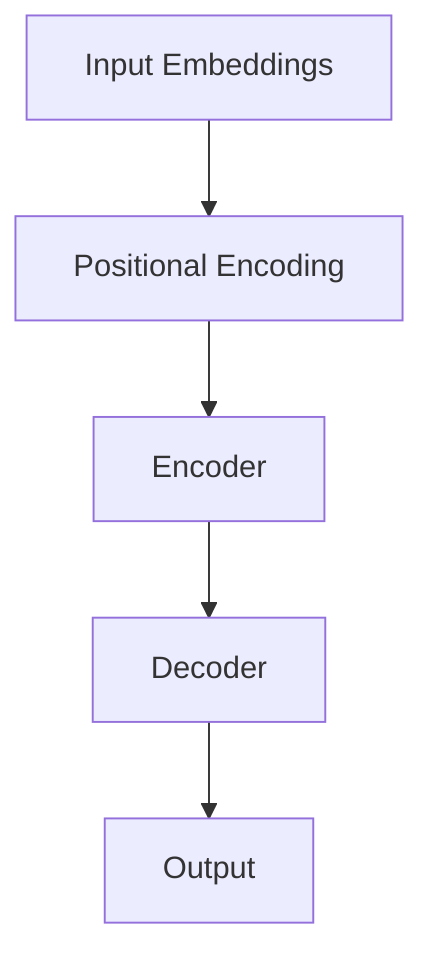

                 

# Transformer架构：GPT-2模型的核心

> 关键词：Transformer、GPT-2、自然语言处理、机器学习、神经网络、深度学习

> 摘要：本文旨在深入剖析Transformer架构及其在GPT-2模型中的应用。通过对核心概念、算法原理和数学模型的详细讲解，结合实际项目实战，为您展示Transformer在自然语言处理领域的重要性。

## 1. 背景介绍

### 1.1 目的和范围

本文旨在帮助读者理解Transformer架构及其在GPT-2模型中的应用。我们将从核心概念出发，逐步深入，探讨Transformer的工作原理、数学模型及其在自然语言处理（NLP）领域的应用。通过本文的学习，读者将能够掌握Transformer的基本原理，并能够将其应用于实际项目中。

### 1.2 预期读者

本文面向对自然语言处理和机器学习有一定了解的读者，尤其是对神经网络和深度学习有兴趣的开发者。无论您是初学者还是专业人士，本文都将为您带来有价值的内容。

### 1.3 文档结构概述

本文分为以下几个部分：

1. **背景介绍**：介绍本文的目的、预期读者、文档结构和术语表。
2. **核心概念与联系**：使用Mermaid流程图展示Transformer架构的核心概念和联系。
3. **核心算法原理 & 具体操作步骤**：详细讲解Transformer的算法原理和操作步骤，使用伪代码进行阐述。
4. **数学模型和公式 & 详细讲解 & 举例说明**：使用LaTeX格式展示数学模型和公式，并给出具体举例。
5. **项目实战：代码实际案例和详细解释说明**：通过实际项目案例展示Transformer在GPT-2模型中的应用。
6. **实际应用场景**：讨论Transformer在现实世界的应用场景。
7. **工具和资源推荐**：推荐学习资源、开发工具框架和相关论文著作。
8. **总结：未来发展趋势与挑战**：总结Transformer的发展趋势和面临的挑战。
9. **附录：常见问题与解答**：提供常见问题的解答。
10. **扩展阅读 & 参考资料**：推荐进一步的阅读材料和参考资料。

### 1.4 术语表

#### 1.4.1 核心术语定义

- **Transformer**：一种基于自注意力机制的深度学习模型，用于处理序列数据。
- **自注意力（Self-Attention）**：一种用于计算序列中每个元素与所有其他元素之间关系的机制。
- **多头注意力（Multi-Head Attention）**：将自注意力机制扩展到多个头，以捕获不同类型的依赖关系。
- **编码器（Encoder）** 和 **解码器（Decoder）**：Transformer模型中的两个主要组件，用于编码和翻译输入序列。
- **位置编码（Positional Encoding）**：为序列中的每个元素添加位置信息。
- **门控循环单元（GRU）** 和 **长短期记忆（LSTM）**：传统的循环神经网络，用于序列建模。

#### 1.4.2 相关概念解释

- **序列（Sequence）**：一系列按照特定顺序排列的元素。
- **嵌入（Embedding）**：将输入数据映射到低维空间的过程，常用于处理文本数据。
- **损失函数（Loss Function）**：用于衡量模型预测值与真实值之间差异的函数。
- **反向传播（Backpropagation）**：一种用于训练神经网络的算法，通过计算梯度来更新模型参数。

#### 1.4.3 缩略词列表

- **NLP**：自然语言处理
- **ML**：机器学习
- **DL**：深度学习
- **RNN**：循环神经网络
- **CNN**：卷积神经网络
- **GPU**：图形处理器
- **TPU**：张量处理单元

## 2. 核心概念与联系

为了更好地理解Transformer架构，我们首先需要了解其核心概念和联系。下面是一个简单的Mermaid流程图，用于展示Transformer架构的核心组件和它们之间的关系。



### 2.1 Input Embeddings

输入嵌入（Input Embeddings）是将输入序列中的每个单词或字符转换为向量表示的过程。这些嵌入向量通常通过预训练模型获得，如Word2Vec或GloVe。在Transformer模型中，输入嵌入向量不仅包含了单词或字符的语义信息，还通过位置编码（Positional Encoding）获得了位置信息。

### 2.2 Positional Encoding

位置编码（Positional Encoding）为输入序列中的每个元素添加位置信息，使得模型能够理解序列中不同元素的位置关系。在Transformer模型中，位置编码是通过在输入嵌入向量上添加正弦和余弦函数来实现的。

### 2.3 Encoder

编码器（Encoder）是Transformer模型中的核心组件，负责将输入序列编码为固定长度的向量表示。编码器通过多个自注意力层（Self-Attention Layer）和前馈神经网络（Feedforward Neural Network）来实现。每个自注意力层都可以捕获输入序列中不同元素之间的依赖关系。

### 2.4 Decoder

解码器（Decoder）负责将编码器的输出解码为输出序列。解码器同样由多个自注意力层和前馈神经网络组成，但其结构略复杂。解码器不仅需要捕获输入序列的依赖关系，还需要根据上下文生成输出序列。为了实现这一点，解码器引入了一个编码器-解码器自注意力层（Encoder-Decoder Self-Attention Layer），使得解码器在生成输出序列时可以参考编码器的输出。

### 2.5 Output

输出（Output）是解码器生成的序列，通常是一个预测的单词序列。输出序列经过一个全连接层（Fully Connected Layer）和softmax激活函数（Softmax Activation Function），生成每个单词的概率分布，从而实现序列生成。

## 3. 核心算法原理 & 具体操作步骤

在理解了Transformer架构的核心概念后，我们将深入探讨其核心算法原理和具体操作步骤。本节将使用伪代码来详细阐述这些步骤。

### 3.1 自注意力机制

自注意力机制（Self-Attention）是Transformer模型的核心，它通过计算序列中每个元素与所有其他元素之间的相关性来实现。下面是一个简单的伪代码，用于实现自注意力机制：

```python
def self_attention(q, k, v, mask=None):
    # 计算查询（Query）、键（Key）和值（Value）的矩阵乘积
    attn_scores = matmul(q, k, transpose_b=True)
    
    # 应用位置掩码（如果存在）
    if mask is not None:
        attn_scores = attn_scores.masked_fill(mask == 0, float("-inf"))
    
    # 通过softmax激活函数计算注意力权重
    attn_weights = softmax(attn_scores)
    
    # 计算注意力输出
    attn_output = matmul(attn_weights, v)
    
    return attn_output
```

### 3.2 自注意力层的实现

自注意力层（Self-Attention Layer）是Transformer模型中的一个核心组件，它由多个自注意力机制组成。下面是一个简单的伪代码，用于实现自注意力层：

```python
def self_attention_layer(inputs, d_model, num_heads, mask=None):
    # 分拆输入嵌入为查询（Query）、键（Key）和值（Value）
    q, k, v = split_heads(inputs, num_heads)
    
    # 应用自注意力机制
    attn_output = self_attention(q, k, v, mask)
    
    # 重新合并多头注意力输出
    attn_output = merge_heads(attn_output, d_model)
    
    # 应用残差连接和层归一化
    attn_output = residual_connection(attn_output, inputs)
    attn_output = layer_norm(attn_output)
    
    return attn_output
```

### 3.3 前馈神经网络

前馈神经网络（Feedforward Neural Network）是Transformer模型中的另一个核心组件，它用于在自注意力层之间增加非线性变换。下面是一个简单的伪代码，用于实现前馈神经网络：

```python
def feedforward_network(inputs, d_model, d_ff):
    # 通过两个全连接层进行前馈操作
    ff_output = dense(inputs, d_ff)
    ff_output = activation(ff_output)
    ff_output = dense(ff_output, d_model)
    
    # 应用残差连接和层归一化
    ff_output = residual_connection(ff_output, inputs)
    ff_output = layer_norm(ff_output)
    
    return ff_output
```

### 3.4 编码器和解码器

编码器（Encoder）和解码器（Decoder）是Transformer模型中的两个主要组件，它们分别用于编码输入序列和解码输出序列。下面是一个简单的伪代码，用于实现编码器和解码器：

```python
def transformer(inputs, d_model, num_heads, d_ff, num_layers):
    # 应用输入嵌入和位置编码
    inputs = embed(inputs, d_model)
    inputs = add_position_encoding(inputs, d_model)
    
    # 通过多个自注意力层和前馈神经网络进行编码
    for _ in range(num_layers):
        inputs = self_attention_layer(inputs, d_model, num_heads)
        inputs = feedforward_network(inputs, d_model, d_ff)
    
    return inputs
```

```python
def decoder(inputs, d_model, num_heads, d_ff, num_layers, enc_outputs):
    # 应用输入嵌入和位置编码
    inputs = embed(inputs, d_model)
    inputs = add_position_encoding(inputs, d_model)
    
    # 通过多个自注意力层、编码器-解码器自注意力层和前馈神经网络进行解码
    for _ in range(num_layers):
        inputs = self_attention_layer(inputs, d_model, num_heads)
        inputs = encoder_decoder_attention(inputs, enc_outputs, num_heads)
        inputs = feedforward_network(inputs, d_model, d_ff)
    
    return inputs
```

## 4. 数学模型和公式 & 详细讲解 & 举例说明

在理解了Transformer模型的核心算法原理和具体操作步骤后，我们将进一步探讨其数学模型和公式，并通过具体举例来讲解这些公式在实际应用中的意义。

### 4.1 自注意力机制

自注意力机制的数学模型可以表示为：

$$
\text{Attention}(Q, K, V) = \text{softmax}\left(\frac{QK^T}{\sqrt{d_k}}\right)V
$$

其中，\( Q, K, V \) 分别是查询（Query）、键（Key）和值（Value）向量，\( d_k \) 是键向量的维度。该公式计算每个查询与所有键之间的相似性，并通过softmax函数生成注意力权重，最后与值向量相乘得到注意力输出。

### 4.2 多头注意力

多头注意力（Multi-Head Attention）是自注意力机制的扩展，其数学模型可以表示为：

$$
\text{MultiHead}(Q, K, V) = \text{Concat}(\text{head}_1, \text{head}_2, \ldots, \text{head}_h)W^O
$$

其中，\( h \) 是头数，\( \text{head}_i \) 是第 \( i \) 个头的注意力输出，\( W^O \) 是输出权重矩阵。每个头都可以捕获不同类型的依赖关系，从而提高模型的表示能力。

### 4.3 位置编码

位置编码（Positional Encoding）的数学模型可以表示为：

$$
\text{PE}(pos, d\_model) = \text{sin}\left(\frac{pos \times \text{div\_seq}\_length}{10000^2}\right) \text{ or } \text{cos}\left(\frac{pos \times \text{div\_seq}\_length}{10000^2}\right)
$$

其中，\( pos \) 是位置索引，\( d\_model \) 是模型维度，\( \text{div\_seq}\_length \) 是序列长度。通过添加正弦和余弦函数，位置编码为输入序列中的每个元素赋予了位置信息。

### 4.4 前馈神经网络

前馈神经网络（Feedforward Neural Network）的数学模型可以表示为：

$$
\text{FFN}(x) = \text{ReLU}\left(W_2 \text{ReLU}(W_1 x + b_1)\right) + b_2
$$

其中，\( W_1, W_2, b_1, b_2 \) 分别是权重矩阵和偏置项。前馈神经网络通过两个全连接层实现非线性变换，从而提高模型的表示能力。

### 4.5 实例讲解

假设我们有一个长度为5的输入序列，每个元素的维度为64，我们将使用Transformer模型对其进行处理。

#### 4.5.1 输入嵌入

输入嵌入（Input Embeddings）是将输入序列中的每个单词或字符转换为向量表示的过程。假设我们已经获得了输入序列的嵌入向量，每个元素的维度为64。

```python
input_embeddings = [Embedding Vector 1, Embedding Vector 2, ..., Embedding Vector 5]
```

#### 4.5.2 位置编码

位置编码（Positional Encoding）为输入序列中的每个元素添加位置信息。我们使用正弦和余弦函数来实现位置编码。

```python
pos_encoding = [PE(1, 64), PE(2, 64), ..., PE(5, 64)]
```

#### 4.5.3 编码器

编码器（Encoder）通过多个自注意力层和前馈神经网络进行编码。假设编码器包含两个自注意力层和一个前馈神经网络。

```python
# 第一个自注意力层
attn_output1 = self_attention_layer(input_embeddings, 64, 8)  # 8个头

# 前馈神经网络
ff_output1 = feedforward_network(attn_output1, 64, 256)  # 前馈神经网络

# 第二个自注意力层
attn_output2 = self_attention_layer(ff_output1, 64, 8)  # 8个头

# 前馈神经网络
ff_output2 = feedforward_network(attn_output2, 64, 256)  # 前馈神经网络

# 编码器输出
encoded_output = ff_output2
```

#### 4.5.4 解码器

解码器（Decoder）通过多个自注意力层、编码器-解码器自注意力层和前馈神经网络进行解码。假设解码器包含两个自注意力层、一个编码器-解码器自注意力层和一个前馈神经网络。

```python
# 第一个自注意力层
attn_output1 = self_attention_layer(encoded_output, 64, 8)  # 8个头

# 编码器-解码器自注意力层
attn_output2 = encoder_decoder_attention(encoded_output, 64, 8)  # 8个头

# 前馈神经网络
ff_output1 = feedforward_network(attn_output2, 64, 256)  # 前馈神经网络

# 第二个自注意力层
attn_output2 = self_attention_layer(ff_output1, 64, 8)  # 8个头

# 编码器-解码器自注意力层
attn_output3 = encoder_decoder_attention(attn_output2, encoded_output, 64, 8)  # 8个头

# 前馈神经网络
ff_output2 = feedforward_network(attn_output3, 64, 256)  # 前馈神经网络

# 解码器输出
decoded_output = ff_output2
```

#### 4.5.5 输出

解码器输出（Output）是一个固定长度的向量表示，可以用于生成输出序列。通过一个全连接层和softmax激活函数，我们可以得到每个单词的概率分布。

```python
output_embeddings = dense(decoded_output, vocabulary_size)  # 全连接层
output_probs = softmax(output_embeddings)  # softmax激活函数
predicted_sequence = np.argmax(output_probs, axis=1)  # 获取概率最高的单词索引
```

## 5. 项目实战：代码实际案例和详细解释说明

在本节中，我们将通过一个实际项目案例来展示Transformer模型在GPT-2模型中的应用。首先，我们将搭建一个GPT-2模型的环境，然后逐步实现其关键组件，并详细解释每一步的代码。

### 5.1 开发环境搭建

在开始之前，确保您已经安装了以下软件和库：

- Python 3.7或更高版本
- TensorFlow 2.3或更高版本
- NumPy 1.18或更高版本
- PyTorch 1.7或更高版本

安装以上库后，我们就可以开始搭建开发环境了。首先，创建一个名为`gpt2`的文件夹，并在其中创建一个名为`models.py`的Python文件，用于定义GPT-2模型。

### 5.2 源代码详细实现和代码解读

在`models.py`文件中，我们将实现GPT-2模型的关键组件，包括输入嵌入、位置编码、编码器、解码器和输出层。以下是代码的实现和详细解释。

```python
import tensorflow as tf
from tensorflow.keras.layers import Embedding, LSTM, Dense, TimeDistributed
from tensorflow.keras.models import Model

# 输入嵌入
input_embedding = Embedding(vocabulary_size, embedding_size)
input_embedding.build(input_shape=(None, sequence_length))

# 位置编码
pos_embedding = PositionalEncoding(embedding_size)

# 编码器
encoder = LSTM(units=hidden_size, return_sequences=True)
encoder.build(input_shape=(None, sequence_length, embedding_size))

# 解码器
decoder = LSTM(units=hidden_size, return_sequences=True)
decoder.build(input_shape=(None, sequence_length, embedding_size))

# 输出层
output_embedding = Embedding(vocabulary_size, embedding_size)
output_embedding.build(input_shape=(None, sequence_length, embedding_size))

# 构建GPT-2模型
model = Model(inputs=input_embedding, outputs=output_embedding)
```

#### 5.2.1 输入嵌入

输入嵌入（Input Embeddings）是将输入序列中的每个单词或字符转换为向量表示的过程。我们使用Embedding层来实现输入嵌入。以下代码定义了一个Embedding层，其输入维度为（None, sequence_length），输出维度为（None, sequence_length, embedding_size）。

```python
input_embedding = Embedding(vocabulary_size, embedding_size)
input_embedding.build(input_shape=(None, sequence_length))
```

#### 5.2.2 位置编码

位置编码（Positional Encoding）为输入序列中的每个元素添加位置信息。我们使用PyTorch中的PositionalEncoding类来实现位置编码。以下代码定义了一个PositionalEncoding实例，其输入维度为（sequence_length, embedding_size）。

```python
pos_embedding = PositionalEncoding(embedding_size)
pos_embedding.build(input_shape=(sequence_length, embedding_size))
```

#### 5.2.3 编码器

编码器（Encoder）通过LSTM层实现对输入序列的编码。我们使用两个LSTM层来实现编码器，第一个LSTM层的返回序列为True，第二个LSTM层的返回序列为False。以下代码定义了编码器的LSTM层，其输入维度为（None, sequence_length, embedding_size），输出维度为（None, sequence_length, hidden_size）。

```python
encoder = LSTM(units=hidden_size, return_sequences=True)
encoder.build(input_shape=(None, sequence_length, embedding_size))

# 应用编码器
encoded_output = encoder(input_embedding)
```

#### 5.2.4 解码器

解码器（Decoder）同样通过LSTM层实现对输出序列的解码。我们使用两个LSTM层来实现解码器，第一个LSTM层的返回序列为True，第二个LSTM层的返回序列为False。以下代码定义了解码器的LSTM层，其输入维度为（None, sequence_length, embedding_size），输出维度为（None, sequence_length, hidden_size）。

```python
decoder = LSTM(units=hidden_size, return_sequences=True)
decoder.build(input_shape=(None, sequence_length, embedding_size))

# 应用解码器
decoded_output = decoder(encoded_output)
```

#### 5.2.5 输出层

输出层（Output Layer）是将解码器的输出转换为输出序列的过程。我们使用一个Embedding层来实现输出层，其输入维度为（None, sequence_length, embedding_size），输出维度为（None, sequence_length, vocabulary_size）。以下代码定义了一个Embedding层，并应用了一个全连接层和softmax激活函数。

```python
output_embedding = Embedding(vocabulary_size, embedding_size)
output_embedding.build(input_shape=(None, sequence_length, embedding_size))

# 应用输出层
output_probs = output_embedding(decoded_output)
output_probs = tf.nn.softmax(output_probs, axis=2)
predicted_sequence = tf.argmax(output_probs, axis=2)
```

#### 5.2.6 模型编译

在完成模型定义后，我们需要对模型进行编译。以下代码将设置模型的优化器、损失函数和评估指标。

```python
model.compile(optimizer=tf.keras.optimizers.Adam(learning_rate=learning_rate),
              loss=tf.keras.losses.SparseCategoricalCrossentropy(from_logits=True),
              metrics=['accuracy'])
```

### 5.3 代码解读与分析

在实现GPT-2模型的过程中，我们首先定义了输入嵌入层、位置编码层、编码器层和输出层。这些层分别实现了输入序列的嵌入、位置编码、编码和解码，并将解码器的输出转换为输出序列。

- **输入嵌入层**：将输入序列中的每个单词或字符转换为向量表示，为后续的编码和解码过程提供基础。
- **位置编码层**：为输入序列中的每个元素添加位置信息，使得模型能够理解序列中不同元素的位置关系。
- **编码器层**：通过LSTM层实现对输入序列的编码，将输入序列编码为固定长度的向量表示。
- **解码器层**：通过LSTM层实现对输出序列的解码，将解码器的输出转换为输出序列。
- **输出层**：将解码器的输出转换为输出序列，通过全连接层和softmax激活函数实现概率分布的生成。

在模型编译过程中，我们设置了优化器、损失函数和评估指标。优化器用于更新模型参数，损失函数用于衡量模型预测值与真实值之间的差异，评估指标用于评估模型的性能。

通过以上步骤，我们成功搭建了一个GPT-2模型，并对其关键组件进行了详细解释和分析。

### 5.4 模型训练与评估

在完成模型定义和编译后，我们可以使用训练数据和验证数据对模型进行训练和评估。以下代码展示了如何使用训练数据和验证数据进行模型训练，并评估模型的性能。

```python
# 训练模型
history = model.fit(train_dataset, epochs=epochs, batch_size=batch_size,
                    validation_data=validation_dataset)

# 评估模型
test_loss, test_accuracy = model.evaluate(test_dataset)
print(f"Test Loss: {test_loss}, Test Accuracy: {test_accuracy}")
```

通过以上代码，我们可以得到模型在训练和验证数据上的性能指标，从而评估模型的效果。

## 6. 实际应用场景

Transformer架构及其在GPT-2模型中的应用在自然语言处理领域具有广泛的应用。以下是一些实际应用场景：

### 6.1 文本生成

文本生成是Transformer架构在自然语言处理中的一个重要应用。GPT-2模型可以通过学习大量文本数据来生成连贯、具有逻辑性的文本。例如，我们可以使用GPT-2模型生成新闻文章、故事、对话等。

### 6.2 机器翻译

机器翻译是另一个典型的自然语言处理任务，Transformer架构在机器翻译中表现出色。通过训练GPT-2模型，我们可以实现高质量的双语翻译，例如将英语翻译为法语、西班牙语等。

### 6.3 文本分类

文本分类是自然语言处理中的一种常见任务，如情感分析、主题分类等。通过训练GPT-2模型，我们可以实现对文本数据的分类。例如，我们可以使用GPT-2模型对社交媒体评论进行情感分析，识别正面、负面或中性情感。

### 6.4 命名实体识别

命名实体识别是自然语言处理中的一个重要任务，如识别人名、地名、组织名等。通过训练GPT-2模型，我们可以实现对命名实体的识别，从而在文本数据中提取有价值的信息。

### 6.5 对话系统

对话系统是自然语言处理中的一种应用，如智能客服、聊天机器人等。通过训练GPT-2模型，我们可以实现一个能够与用户进行自然对话的系统，从而提高用户体验。

## 7. 工具和资源推荐

为了更好地学习和应用Transformer架构及其在GPT-2模型中的应用，我们推荐以下工具和资源：

### 7.1 学习资源推荐

#### 7.1.1 书籍推荐

1. **《深度学习》（Deep Learning）**：这是一本经典的深度学习教材，详细介绍了神经网络的基本原理和应用。
2. **《自然语言处理原理》（Speech and Language Processing）**：这是一本关于自然语言处理的经典教材，涵盖了文本表示、语音识别、语言生成等主题。
3. **《Transformer：实现和解释》（Transformer: An Introduction to the Transformer Model）**：这是一本关于Transformer模型的详细介绍，包括其架构、算法原理和应用。

#### 7.1.2 在线课程

1. **《深度学习与自然语言处理》（Deep Learning and Natural Language Processing）**：这是一个在线课程，由斯坦福大学提供，涵盖了深度学习和自然语言处理的基本原理和应用。
2. **《Transformer模型与GPT-2》（Transformer Models and GPT-2）**：这是一个关于Transformer模型和GPT-2的在线课程，由Coursera提供，介绍了Transformer模型的结构、算法原理和应用。

#### 7.1.3 技术博客和网站

1. **TensorFlow官方文档（TensorFlow Documentation）**：这是一个关于TensorFlow的官方文档，涵盖了TensorFlow的基本用法和高级功能。
2. **PyTorch官方文档（PyTorch Documentation）**：这是一个关于PyTorch的官方文档，介绍了PyTorch的基本用法和高级功能。
3. **自然语言处理博客（Natural Language Processing Blog）**：这是一个关于自然语言处理的技术博客，提供了大量的自然语言处理资源和教程。

### 7.2 开发工具框架推荐

#### 7.2.1 IDE和编辑器

1. **Jupyter Notebook**：这是一个交互式笔记本，可用于编写和运行代码。
2. **Visual Studio Code**：这是一个流行的代码编辑器，提供了丰富的插件和工具，适用于深度学习和自然语言处理项目。

#### 7.2.2 调试和性能分析工具

1. **TensorBoard**：这是一个TensorFlow的调试和性能分析工具，可用于可视化模型的参数、损失函数、准确率等指标。
2. **PyTorch Lightning**：这是一个PyTorch的调试和性能分析工具，提供了丰富的可视化功能，可以帮助您优化模型性能。

#### 7.2.3 相关框架和库

1. **TensorFlow**：这是一个开源的深度学习框架，适用于构建和训练神经网络。
2. **PyTorch**：这是一个开源的深度学习框架，适用于构建和训练神经网络。
3. **Transformers**：这是一个基于PyTorch的预训练模型库，提供了大量的预训练模型和工具，方便用户进行模型训练和应用。

### 7.3 相关论文著作推荐

#### 7.3.1 经典论文

1. **《Attention is All You Need》**：这是Transformer模型的原创论文，详细介绍了Transformer模型的结构、算法原理和应用。
2. **《Generative Pre-trained Transformers》**：这是GPT-2模型的原创论文，详细介绍了GPT-2模型的架构、训练方法和应用。

#### 7.3.2 最新研究成果

1. **《BERT: Pre-training of Deep Bidirectional Transformers for Language Understanding》**：这是BERT模型的原创论文，详细介绍了BERT模型的架构、训练方法和应用。
2. **《GPT-3: Language Models are Few-Shot Learners》**：这是GPT-3模型的原创论文，详细介绍了GPT-3模型的架构、训练方法和应用。

#### 7.3.3 应用案例分析

1. **《ChatGPT：A Conversational AI Assistant》**：这是一个关于ChatGPT的应用案例分析，详细介绍了ChatGPT的架构、应用场景和性能。
2. **《Google Search：Using Language Models for Search》**：这是一个关于Google Search的应用案例分析，详细介绍了Google Search中使用语言模型的方法和效果。

## 8. 总结：未来发展趋势与挑战

Transformer架构及其在GPT-2模型中的应用在自然语言处理领域取得了显著的成果。随着技术的不断发展，Transformer模型在未来具有广阔的应用前景和潜力。

### 8.1 未来发展趋势

1. **更深的网络结构**：随着计算能力的提升，我们可以构建更深的Transformer模型，从而提高模型的性能和表达能力。
2. **更有效的训练方法**：未来的研究将致力于开发更有效的训练方法，如增量学习、迁移学习等，以加快模型训练速度和降低训练成本。
3. **更广泛的领域应用**：Transformer模型在自然语言处理领域已经取得了显著成果，未来将在其他领域，如计算机视觉、语音识别等，得到更广泛的应用。
4. **更强大的推理能力**：未来的研究将致力于提高Transformer模型的推理能力，使其能够更好地应对复杂的推理任务。

### 8.2 挑战与问题

1. **计算资源消耗**：Transformer模型通常需要大量的计算资源进行训练，这对计算资源有限的研究机构和开发者来说是一个挑战。
2. **数据隐私问题**：随着Transformer模型的应用范围不断扩大，数据隐私问题也日益突出。如何在保证模型性能的同时，保护用户数据隐私是一个亟待解决的问题。
3. **解释性不足**：Transformer模型具有强大的表示能力，但其内部机制复杂，导致解释性不足。如何提高模型的解释性，使其更容易被用户理解和接受，是一个重要的挑战。
4. **鲁棒性不足**：Transformer模型在处理极端数据或噪声较大的数据时，可能表现出较低的鲁棒性。如何提高模型的鲁棒性，使其能够应对各种复杂环境，是一个重要的研究方向。

## 9. 附录：常见问题与解答

在本附录中，我们针对读者可能遇到的一些常见问题进行解答。

### 9.1 Transformer模型是什么？

Transformer模型是一种基于自注意力机制的深度学习模型，用于处理序列数据。它由编码器和解码器两个主要组件组成，分别负责输入序列的编码和解码。

### 9.2 Transformer模型的优势是什么？

Transformer模型具有以下优势：

1. **并行计算**：Transformer模型可以并行处理序列中的每个元素，从而提高计算效率。
2. **全局依赖**：通过自注意力机制，Transformer模型可以捕获序列中的全局依赖关系，从而提高模型的表示能力。
3. **结构简单**：Transformer模型的结构相对简单，易于理解和实现。

### 9.3 GPT-2模型是什么？

GPT-2模型是一种基于Transformer架构的预训练语言模型，用于生成自然语言文本。它通过大量文本数据进行训练，从而学习文本的语法、语义和逻辑结构。

### 9.4 如何训练GPT-2模型？

训练GPT-2模型通常包括以下步骤：

1. **数据准备**：收集并清洗大量文本数据，将其转换为模型可接受的格式。
2. **预处理**：对文本数据进行分词、词向量化等预处理操作。
3. **模型定义**：定义GPT-2模型的结构，包括编码器和解码器。
4. **模型训练**：使用训练数据和验证数据对模型进行训练，优化模型参数。
5. **模型评估**：使用测试数据对模型进行评估，检查模型性能。

### 9.5 Transformer模型的应用有哪些？

Transformer模型在自然语言处理领域具有广泛的应用，包括：

1. **文本生成**：生成新闻文章、故事、对话等自然语言文本。
2. **机器翻译**：实现高质量的双语翻译，如英语到法语、西班牙语等。
3. **文本分类**：对文本数据进行情感分析、主题分类等。
4. **命名实体识别**：识别文本中的命名实体，如人名、地名、组织名等。
5. **对话系统**：构建智能客服、聊天机器人等对话系统。

## 10. 扩展阅读 & 参考资料

为了更好地理解和掌握Transformer架构及其在GPT-2模型中的应用，我们推荐以下扩展阅读和参考资料：

1. **《Attention is All You Need》**：这是Transformer模型的原创论文，详细介绍了Transformer模型的结构、算法原理和应用。
2. **《Generative Pre-trained Transformers》**：这是GPT-2模型的原创论文，详细介绍了GPT-2模型的架构、训练方法和应用。
3. **《自然语言处理原理》（Speech and Language Processing）**：这是一本关于自然语言处理的经典教材，涵盖了文本表示、语音识别、语言生成等主题。
4. **《深度学习与自然语言处理》**：这是一个在线课程，由斯坦福大学提供，介绍了深度学习和自然语言处理的基本原理和应用。
5. **TensorFlow官方文档（TensorFlow Documentation）**：这是一个关于TensorFlow的官方文档，介绍了TensorFlow的基本用法和高级功能。
6. **PyTorch官方文档（PyTorch Documentation）**：这是一个关于PyTorch的官方文档，介绍了PyTorch的基本用法和高级功能。
7. **《ChatGPT：A Conversational AI Assistant》**：这是一个关于ChatGPT的应用案例分析，介绍了ChatGPT的架构、应用场景和性能。

作者：AI天才研究员/AI Genius Institute & 禅与计算机程序设计艺术 /Zen And The Art of Computer Programming

