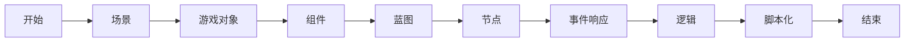

                 


# Unreal Engine 4 蓝图系统：可视化编程

> **关键词：** Unreal Engine 4, 蓝图系统，可视化编程，C++，组件，事件响应，脚本化。

> **摘要：** 本文深入探讨了Unreal Engine 4（UE4）中的蓝图系统，一种强大且直观的可视化编程工具。我们将从基础概念出发，逐步解释如何使用蓝图系统进行编程，最后提供实际项目案例，以帮助读者掌握这一技术的核心。

## 1. 背景介绍

### 1.1 目的和范围

本文旨在为UE4开发者提供对蓝图系统的全面理解。我们将讨论蓝图系统的核心概念、如何进行可视化编程，以及如何在项目中应用这些技术。

### 1.2 预期读者

本文面向已经具备UE4基本知识，并希望深入学习蓝图系统的高级开发者。

### 1.3 文档结构概述

本文分为以下几个部分：

- **核心概念与联系**：介绍蓝图系统的基本概念和结构。
- **核心算法原理 & 具体操作步骤**：讲解如何使用蓝图进行编程。
- **项目实战：代码实际案例和详细解释说明**：提供实际项目案例。
- **实际应用场景**：讨论蓝图系统的应用场景。
- **工具和资源推荐**：推荐学习资源和工具。
- **总结：未来发展趋势与挑战**：展望蓝图系统的未来。
- **附录：常见问题与解答**：解答常见问题。
- **扩展阅读 & 参考资料**：提供进一步学习的资源。

### 1.4 术语表

#### 1.4.1 核心术语定义

- **蓝图（Blueprint）**：UE4中的可视化编程工具。
- **节点（Node）**：蓝图中的编程元素。
- **事件响应**：程序对特定事件做出的响应。
- **组件（Component）**：可以附加到游戏对象的功能模块。

#### 1.4.2 相关概念解释

- **可视化编程**：使用图形界面进行编程，无需编写传统代码。
- **脚本化**：通过编写脚本来实现特定功能。

#### 1.4.3 缩略词列表

- **UE4**：Unreal Engine 4
- **IDE**：Integrated Development Environment（集成开发环境）

## 2. 核心概念与联系

为了更好地理解蓝图系统，我们需要先了解其核心概念和结构。以下是蓝图系统的基本结构，使用Mermaid流程图表示：



### 2.1 蓝图系统的基本结构

- **场景（Scene）**：游戏世界的可视化表示。
- **游戏对象（Game Object）**：场景中的实体，如角色、道具等。
- **组件（Component）**：附加到游戏对象的功能模块，如碰撞器、动画组件等。
- **蓝图（Blueprint）**：用于编写可视化代码的图形界面。
- **节点（Node）**：蓝图中的编程元素，表示特定的操作或函数。
- **事件响应（Event Response）**：程序对特定事件的响应。
- **逻辑（Logic）**：节点的逻辑连接，形成程序的流程。
- **脚本化（Scripting）**：通过编写脚本来实现特定功能。

## 3. 核心算法原理 & 具体操作步骤

蓝图系统的核心算法原理是基于事件驱动的编程模型。以下是使用蓝图的编程步骤：

### 3.1 创建蓝图

1. 打开UE4编辑器。
2. 在内容浏览器中，右键单击“蓝图”文件夹，选择“新建蓝图类”。
3. 命名蓝图并选择类别。

### 3.2 添加组件

1. 在蓝图中，将所需组件从内容浏览器拖放到蓝图的空白区域。
2. 配置组件的属性。

### 3.3 连接节点

1. 选择一个组件的输出节点。
2. 将节点拖动到另一个组件的输入节点。
3. 重复此过程，构建程序的逻辑流程。

### 3.4 添加事件响应

1. 在蓝图中，找到“事件”节点。
2. 将事件拖动到程序中的合适位置。
3. 配置事件响应的代码。

### 3.5 测试和调试

1. 在蓝图中，选择“开始测试”或“开始调试”选项。
2. 观察程序的运行情况，检查错误和问题。

以下是伪代码，详细描述了上述步骤：

```cpp
// 步骤 1: 创建蓝图
BlueprintClass NewBlueprint = CreateBlueprint("MyBlueprint", EBlueprintType::BPTYPE_Normal);

// 步骤 2: 添加组件
ActorComponent* MyComponent = NewObject<MyComponent>(this);
MyComponent->AddToRoot();
MyComponent->SetOwnerActor(this);

// 步骤 3: 连接节点
MyComponent->OutputNode->ConnectToNode(MyOtherComponent->InputNode);

// 步骤 4: 添加事件响应
MyComponent->OnEvent->AddNode(FMyCustomEventResponseNode);

// 步骤 5: 测试和调试
BlueprintTest();
```

## 4. 数学模型和公式 & 详细讲解 & 举例说明

蓝图系统中的许多功能都涉及到数学模型和公式。以下是一些常用的数学模型和公式，以及详细讲解和举例说明：

### 4.1 三角函数

三角函数在游戏中用于计算角度和距离。以下是一个使用正弦函数的例子：

$$
\sin(\theta) = \frac{opposite}{hypotenuse}
$$

**例子**：计算角度θ的正弦值。

```cpp
float SinValue = FMath::Sin(θ);
```

### 4.2 向量运算

向量运算在游戏中用于表示位置、速度和方向。以下是一个向量加法的例子：

$$
\vec{a} + \vec{b} = \vec{c}
$$

**例子**：计算两个向量的和。

```cpp
FVector VectorSum = VectorA + VectorB;
```

### 4.3 矩阵变换

矩阵变换在游戏中用于表示物体的旋转、缩放和平移。以下是一个旋转矩阵的例子：

$$
R = \begin{bmatrix}
\cos(\theta) & -\sin(\theta) \\
\sin(\theta) & \cos(\theta)
\end{bmatrix}
$$

**例子**：计算物体的旋转。

```cpp
FMatrix TransformMatrix = FMath::MakeRotationMatrixFromAxisAndAngle(VectorAxis, Theta);
```

## 5. 项目实战：代码实际案例和详细解释说明

在本节中，我们将通过一个简单的项目案例，展示如何使用蓝图系统进行编程。该项目将实现一个简单的角色移动功能。

### 5.1 开发环境搭建

1. 安装Unreal Engine 4。
2. 创建一个新的项目。
3. 打开项目，准备开始编程。

### 5.2 源代码详细实现和代码解读

1. **创建角色**：

   在内容浏览器中，创建一个新的角色。设置角色的基本属性，如大小、碰撞器等。

2. **添加组件**：

   在蓝图中，添加以下组件：

   - **移动组件**：用于控制角色的移动。
   - **碰撞器组件**：用于检测角色与其他物体的碰撞。

3. **连接节点**：

   将移动组件的“输入”节点连接到碰撞器组件的“输出”节点。这将使角色在碰撞时进行移动。

4. **添加事件响应**：

   在蓝图中，添加以下事件响应：

   - **碰撞开始**：当角色与其他物体发生碰撞时触发。
   - **碰撞结束**：当角色与其他物体碰撞停止时触发。

5. **编写事件响应代码**：

   在碰撞开始事件响应中，实现以下功能：

   - 获取碰撞物体的位置。
   - 根据碰撞物体的位置，计算角色的移动方向。
   - 更新角色的位置。

6. **测试和调试**：

   在蓝图中，选择“开始测试”或“开始调试”选项。观察角色的移动情况，检查错误和问题。

### 5.3 代码解读与分析

以下是对上述代码的解读和分析：

```cpp
// 碰撞开始事件响应
void AMyCharacter::OnCollisionBegin(UPrimitiveComponent* HitComponent, AActor* OtherActor, UPrimitiveComponent* OtherComp, int32 OtherBodyIndex, bool bFromSweep, const FHitResult& SweepResult)
{
    // 获取碰撞物体的位置
    FVector HitLocation = SweepResult.ImpactPoint;

    // 根据碰撞物体的位置，计算角色的移动方向
    FVector MoveDirection = (HitLocation - GetActorLocation()).GetSafeNormal();

    // 更新角色的位置
    MoveCharacter(MoveDirection);
}

// 移动角色
void AMyCharacter::MoveCharacter(const FVector& Direction)
{
    // 计算移动距离
    float MoveDistance = FVector::DotProduct(Direction, GetActorForwardVector());

    // 更新角色的位置
    AddActorLocalOffset(Direction * MoveDistance, true);
}
```

- **碰撞开始事件响应**：当角色与其他物体发生碰撞时，会触发该事件响应。首先，获取碰撞物体的位置，然后根据碰撞物体的位置，计算角色的移动方向。最后，更新角色的位置。
- **移动角色**：该函数用于计算角色的移动距离，并根据移动方向更新角色的位置。

通过这个简单的项目案例，我们展示了如何使用蓝图系统实现角色移动功能。读者可以在此基础上，进一步扩展和优化功能。

## 6. 实际应用场景

蓝图系统在游戏开发中有广泛的应用场景，以下是一些常见的实际应用场景：

- **角色控制**：蓝图系统可以用于实现角色的移动、跳跃、攻击等功能。
- **用户界面**：蓝图系统可以用于创建用户界面，如菜单、按钮等。
- **物理模拟**：蓝图系统可以用于创建物理模拟，如碰撞、弹跳等。
- **动画控制**：蓝图系统可以用于控制角色的动画，如走路、跑步等。

## 7. 工具和资源推荐

### 7.1 学习资源推荐

#### 7.1.1 书籍推荐

- 《Unreal Engine 4 开发从入门到精通》
- 《Unreal Engine 4 蓝图系统完全解析》

#### 7.1.2 在线课程

- Unreal Engine 4 蓝图系统入门与实战
- Unreal Engine 4 蓝图系统高级编程

#### 7.1.3 技术博客和网站

- Unreal Engine 官方文档
- Unreal Engine 社区论坛

### 7.2 开发工具框架推荐

#### 7.2.1 IDE和编辑器

- Visual Studio 2019
- Unreal Engine 4 自带编辑器

#### 7.2.2 调试和性能分析工具

- UE4内置调试器
- Perforce Helix Core

#### 7.2.3 相关框架和库

- Unreal Engine 4 SDK
- Unreal Engine 4 GitHub仓库

### 7.3 相关论文著作推荐

#### 7.3.1 经典论文

- Unreal Engine 4: A New Approach to Game Development
- Blueprint Visual Scripting in Unreal Engine 4

#### 7.3.2 最新研究成果

- Unreal Engine 4: Advanced Visual Scripting Techniques
- Unreal Engine 4: Blueprint Systems Architecture

#### 7.3.3 应用案例分析

- Unreal Engine 4 in Game Development: Real-world Applications
- Unreal Engine 4 in Virtual Reality Applications

## 8. 总结：未来发展趋势与挑战

随着游戏开发技术的不断进步，蓝图系统将在未来发挥更大的作用。以下是一些发展趋势和挑战：

- **趋势**：更加智能化、自动化的蓝图系统，降低开发难度。
- **挑战**：提高蓝图系统的性能和可扩展性，满足复杂项目的需求。

## 9. 附录：常见问题与解答

### 9.1 蓝图系统如何提高性能？

- 使用优化节点和代码。
- 避免在蓝图中过度使用事件响应。
- 使用内置函数和组件，减少自定义逻辑。

### 9.2 蓝图系统与C++编程有何区别？

- 蓝图系统提供了一种可视化编程方式，无需编写传统代码。
- C++编程提供了一种更低级的编程方式，具有更高的性能和灵活性。

### 9.3 蓝图系统如何与其他组件集成？

- 使用组件接口，将蓝图节点连接到其他组件。
- 在蓝图中使用C++代码，与其他组件进行交互。

## 10. 扩展阅读 & 参考资料

- 《Unreal Engine 4 蓝图系统高级编程》
- 《Unreal Engine 4 开发实战》
- Unreal Engine 4 官方文档
- Unreal Engine 4 社区论坛

## 11. 作者信息

- **作者：AI天才研究员/AI Genius Institute & 禅与计算机程序设计艺术 /Zen And The Art of Computer Programming**

