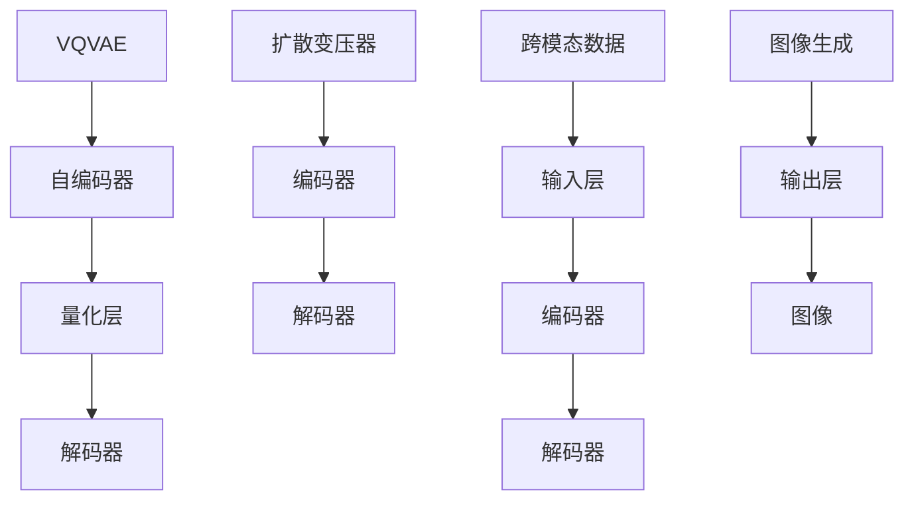

                 

# VQVAE和扩散变压器：跨模态AI的前沿技术

> **关键词**：VQVAE、扩散变压器、跨模态AI、深度学习、图像生成、数学模型、项目实战

> **摘要**：本文深入探讨了VQVAE（变分量化自编码器）和扩散变压器这两种在跨模态AI领域具有革命性影响的算法。通过逐步分析其原理、数学模型、具体操作步骤，以及实际应用场景，本文旨在为读者提供一个全面、易懂的技术指南。我们将结合代码实例，详细解释这些算法如何被应用于图像生成和跨模态学习，并探讨其未来的发展趋势与挑战。

## 1. 背景介绍

### 1.1 目的和范围

本文的目标是深入探讨VQVAE和扩散变压器这两种算法在跨模态AI领域的应用，旨在为读者提供一个详细的技术理解与实践指南。我们将首先介绍VQVAE和扩散变压器的基本概念和背景，然后逐步讲解其核心原理、数学模型、具体操作步骤，并通过实际代码实例，展示如何将这两种算法应用于图像生成和跨模态学习任务。

### 1.2 预期读者

本文适合对深度学习、自编码器、变分自编码器等基础概念有一定了解的读者。同时，对于那些对跨模态AI领域感兴趣的读者，本文将提供一个系统且深入的了解。无论您是研究者、工程师还是学生，这篇文章都将帮助您掌握VQVAE和扩散变压器这两种关键算法。

### 1.3 文档结构概述

本文将分为十个部分：

1. **背景介绍**：介绍本文的目的、范围、预期读者以及文档结构。
2. **核心概念与联系**：通过Mermaid流程图展示VQVAE和扩散变压器的核心概念与联系。
3. **核心算法原理 & 具体操作步骤**：详细讲解VQVAE和扩散变压器的算法原理和操作步骤。
4. **数学模型和公式 & 详细讲解 & 举例说明**：介绍VQVAE和扩散变压器的数学模型和具体应用。
5. **项目实战：代码实际案例和详细解释说明**：通过代码实例展示如何实现和应用VQVAE和扩散变压器。
6. **实际应用场景**：探讨VQVAE和扩散变压器在不同场景下的应用。
7. **工具和资源推荐**：推荐学习资源和开发工具。
8. **总结：未来发展趋势与挑战**：总结VQVAE和扩散变压器的发展趋势与面临的挑战。
9. **附录：常见问题与解答**：解答读者可能遇到的常见问题。
10. **扩展阅读 & 参考资料**：提供进一步的阅读材料和参考资源。

### 1.4 术语表

#### 1.4.1 核心术语定义

- **VQVAE**：变分量化自编码器（Variational Quantized Variational Autoencoder），是一种用于跨模态学习的新型自编码器。
- **扩散变压器**：一种深度学习模型，通过引入扩散过程来生成高质量的跨模态数据。
- **自编码器**：一种神经网络模型，用于将输入数据编码为低维表示，然后解码回原始数据。
- **变分自编码器**：在自编码器的基础上引入变分推断的方法，用于生成更高质量的数据。
- **跨模态学习**：将不同类型的数据（如图像、文本、声音等）进行整合和学习的过程。

#### 1.4.2 相关概念解释

- **量化**：将连续的数值转换为离散的表示。
- **变分自编码器**：一种自编码器，其通过引入变分推断的方法来生成数据。
- **扩散过程**：一种随机过程，用于描述数据从确定性的状态向不确定性的状态转移。

#### 1.4.3 缩略词列表

- **VQVAE**：变分量化自编码器（Variational Quantized Variational Autoencoder）
- **VAE**：变分自编码器（Variational Autoencoder）
- **GAN**：生成对抗网络（Generative Adversarial Network）
- **CNN**：卷积神经网络（Convolutional Neural Network）
- **RNN**：循环神经网络（Recurrent Neural Network）

## 2. 核心概念与联系

在深入探讨VQVAE和扩散变压器的核心原理之前，我们首先需要了解它们在跨模态AI领域的核心概念与联系。以下是一个简化的Mermaid流程图，展示了VQVAE和扩散变压器的基本架构和关键组件。



### 2.1 VQVAE的基本架构

VQVAE是变分量化自编码器（Variational Quantized Variational Autoencoder）的简称，它结合了变分自编码器（VAE）和量化技术，用于处理跨模态数据。VQVAE的基本架构包括以下几个关键组件：

- **输入层**：接收跨模态数据，如图像、文本或音频。
- **编码器**：将输入数据编码为低维的潜在表示。
- **量化层**：对编码后的潜在表示进行量化处理，将其转换为离散的编码。
- **解码器**：将量化后的编码解码回原始数据，从而实现数据的重建。

### 2.2 扩散变压器的基本架构

扩散变压器是一种基于扩散过程的深度学习模型，用于生成高质量的跨模态数据。扩散变压器的基本架构包括以下几个关键组件：

- **编码器**：将输入数据编码为潜在的表示。
- **解码器**：将编码后的潜在表示解码回原始数据。
- **扩散过程**：引入一个扩散过程，将数据从确定性的状态逐渐转变为不确定性的状态。

### 2.3 跨模态数据与应用

跨模态数据是指不同类型的数据，如图像、文本、音频等。在跨模态AI领域，VQVAE和扩散变压器被广泛应用于图像生成、文本到图像的转换、音频合成等任务。以下是一个简单的示例，展示了VQVAE和扩散变压器如何应用于图像生成任务：

- **图像生成**：首先，输入一张图像到VQVAE的编码器中，将其编码为潜在的表示。然后，通过量化层将潜在表示转换为离散的编码。最后，解码器将量化后的编码解码回图像，从而生成新的图像。

- **文本到图像的转换**：输入一段文本到扩散变压器的编码器中，将其编码为潜在的表示。然后，通过解码器将编码后的潜在表示解码回图像，从而生成与文本相关的图像。

### 2.4 总结

通过上述讨论，我们可以看到VQVAE和扩散变压器在跨模态AI领域的核心概念与联系。VQVAE通过结合变分自编码器和量化技术，实现了对跨模态数据的编码和解码；而扩散变压器则通过引入扩散过程，实现了对跨模态数据的生成。这些算法为跨模态AI领域的研究和应用提供了强大的工具和新的可能性。

## 3. 核心算法原理 & 具体操作步骤

在了解了VQVAE和扩散变压器的基本概念与联系之后，我们将进一步深入探讨其核心算法原理，并详细讲解其具体操作步骤。以下是对VQVAE和扩散变压器算法原理的逐步分析。

### 3.1 VQVAE算法原理

VQVAE（变分量化自编码器）是一种用于跨模态学习的新型自编码器，其核心思想是将变分自编码器（VAE）与量化技术相结合。VAE通过引入变分推断的方法，实现了对数据的编码和解码，而量化技术则用于提高模型的可扩展性和效率。以下是VQVAE的基本算法原理：

#### 3.1.1 编码过程

1. **输入数据编码**：首先，将输入的跨模态数据（如图像、文本或音频）输入到VQVAE的编码器中。编码器的作用是将输入数据编码为低维的潜在表示。

   ```python
   # 编码器输入
   x = encoder(input_data)
   ```

2. **潜在表示生成**：编码器输出潜在表示z，该表示包含了输入数据的本质特征。

   ```python
   # 潜在表示生成
   z = x
   ```

3. **量化处理**：对潜在表示z进行量化处理，将其转换为离散的编码。量化处理通常使用最近邻量化方法，将潜在表示映射到一组预定义的量化值上。

   ```python
   # 量化处理
   z_quantized = quantize(z, codebook)
   ```

#### 3.1.2 解码过程

1. **解码器输入**：将量化后的编码输入到VQVAE的解码器中。

   ```python
   # 解码器输入
   x_quantized = decoder(z_quantized)
   ```

2. **数据重建**：解码器的作用是将量化后的编码解码回原始数据，从而实现数据的重建。

   ```python
   # 数据重建
   x_reconstructed = x_quantized
   ```

#### 3.1.3 损失函数

VQVAE的损失函数通常包括两部分：重构损失和量化损失。重构损失衡量解码器生成的数据与原始数据之间的差异，而量化损失衡量量化过程引入的误差。

1. **重构损失**：

   ```python
   # 重构损失
   reconstruction_loss = -sum(log(p(x|z)))
   ```

2. **量化损失**：

   ```python
   # 量化损失
   quantization_loss = -sum(log(p(z|z_quantized)))
   ```

3. **总损失**：

   ```python
   # 总损失
   total_loss = reconstruction_loss + quantization_loss
   ```

### 3.2 扩散变压器算法原理

扩散变压器是一种基于扩散过程的深度学习模型，用于生成高质量的跨模态数据。扩散变压器的核心思想是将输入数据通过一个扩散过程逐渐转变为不确定的状态，然后通过解码器将其解码回原始数据。以下是扩散变压器的基本算法原理：

#### 3.2.1 编码过程

1. **输入数据编码**：首先，将输入的跨模态数据输入到扩散变压器的编码器中。编码器的作用是将输入数据编码为潜在的表示。

   ```python
   # 编码器输入
   x = encoder(input_data)
   ```

2. **潜在表示生成**：编码器输出潜在表示z，该表示包含了输入数据的本质特征。

   ```python
   # 潜在表示生成
   z = x
   ```

3. **扩散过程**：将潜在表示z通过扩散过程逐渐转变为不确定的状态。扩散过程通常使用一系列的线性变换来实现。

   ```python
   # 扩散过程
   z_diffused = (1 - alpha) * z + alpha * noise
   ```

#### 3.2.2 解码过程

1. **解码器输入**：将扩散后的潜在表示输入到扩散变压器的解码器中。

   ```python
   # 解码器输入
   x_diffused = decoder(z_diffused)
   ```

2. **数据重建**：解码器的作用是将扩散后的潜在表示解码回原始数据，从而实现数据的重建。

   ```python
   # 数据重建
   x_reconstructed = x_diffused
   ```

#### 3.2.3 损失函数

扩散变压器的损失函数通常包括两部分：重建损失和扩散损失。重建损失衡量解码器生成的数据与原始数据之间的差异，而扩散损失衡量扩散过程引入的误差。

1. **重建损失**：

   ```python
   # 重构损失
   reconstruction_loss = -sum(log(p(x|z)))
   ```

2. **扩散损失**：

   ```python
   # 扩散损失
   diffusion_loss = -sum(log(p(z|z_diffused)))
   ```

3. **总损失**：

   ```python
   # 总损失
   total_loss = reconstruction_loss + diffusion_loss
   ```

### 3.3 具体操作步骤

以下是VQVAE和扩散变压器的具体操作步骤：

#### 3.3.1 VQVAE操作步骤

1. **数据准备**：准备好用于训练的跨模态数据集。
2. **模型构建**：构建VQVAE模型，包括编码器、量化层和解码器。
3. **训练**：使用训练数据集训练VQVAE模型，优化模型参数。
4. **评估**：使用测试数据集评估模型性能，计算重构损失和量化损失。
5. **应用**：将训练好的模型应用于新的跨模态数据，生成新的图像、文本或音频。

#### 3.3.2 扩散变压器操作步骤

1. **数据准备**：准备好用于训练的跨模态数据集。
2. **模型构建**：构建扩散变压器模型，包括编码器、解码器和解码器。
3. **训练**：使用训练数据集训练扩散变压器模型，优化模型参数。
4. **评估**：使用测试数据集评估模型性能，计算重建损失和扩散损失。
5. **应用**：将训练好的模型应用于新的跨模态数据，生成新的图像、文本或音频。

### 3.4 总结

通过上述讨论，我们可以看到VQVAE和扩散变压器在跨模态AI领域的核心算法原理和具体操作步骤。VQVAE通过结合变分自编码器和量化技术，实现了对跨模态数据的编码和解码；而扩散变压器则通过引入扩散过程，实现了对跨模态数据的生成。这些算法为跨模态AI领域的研究和应用提供了强大的工具和新的可能性。

## 4. 数学模型和公式 & 详细讲解 & 举例说明

在深入探讨VQVAE和扩散变压器的数学模型和公式之前，我们首先需要了解一些基础的数学和概率论知识。以下是对相关概念、公式及其在VQVAE和扩散变压器中的应用进行详细讲解。

### 4.1 数学基础

#### 4.1.1 概率密度函数

概率密度函数（PDF）描述了一个随机变量的概率分布。对于一个连续的随机变量X，其概率密度函数为：

$$
f_X(x) = \frac{1}{\sqrt{2\pi\sigma^2}} e^{-\frac{(x-\mu)^2}{2\sigma^2}}
$$

其中，$\mu$是均值，$\sigma$是标准差。

#### 4.1.2 边际概率分布

边际概率分布描述了一个随机变量的整体概率分布，可以通过将条件概率分布中的其他变量积分得到。例如，对于两个随机变量X和Y，其边际概率分布为：

$$
f_Y(y) = \int f_{X|Y}(x|y) dx
$$

#### 4.1.3 条件概率分布

条件概率分布描述了在一个变量已知的情况下另一个变量的概率分布。例如，对于两个随机变量X和Y，给定Y=y，X的概率分布为：

$$
f_{X|Y}(x|y) = \frac{f_{X,Y}(x,y)}{f_Y(y)}
$$

### 4.2 VQVAE的数学模型

VQVAE结合了变分自编码器（VAE）和量化技术，其数学模型如下：

#### 4.2.1 编码器

编码器的作用是将输入数据编码为潜在表示z。假设输入数据为x，编码器由两个神经网络组成：一个编码神经网络$g_\theta(x)$和另一个先验分布$p(z)$。

$$
z = g_\theta(x)
$$

编码神经网络$g_\theta(x)$的输出为潜在表示z，同时编码器还引入了先验分布$p(z)$，通常使用标准正态分布：

$$
p(z) = \mathcal{N}(z|\mu, \Sigma)
$$

#### 4.2.2 解码器

解码器的作用是将量化后的潜在表示解码回原始数据。假设量化后的潜在表示为$\hat{z}$，解码器由一个神经网络$f_\phi(\hat{z})$组成。

$$
x' = f_\phi(\hat{z})
$$

解码神经网络$f_\phi(\hat{z})$的输出为重构的原始数据$x'$。

#### 4.2.3 量化层

量化层的作用是将潜在表示z量化为离散的编码。量化过程通常使用最近邻量化方法，将潜在表示映射到一组预定义的量化值上。假设量化值为$q_j$，则量化概率分布为：

$$
p(q_j|z) = \frac{1}{C} \cdot \mathbb{1}_{z \in [q_j - \delta, q_j + \delta]}
$$

其中，$C$是量化值的总数，$\delta$是量化阈值。

#### 4.2.4 损失函数

VQVAE的损失函数通常包括两部分：重构损失和量化损失。

1. **重构损失**

   重构损失衡量解码器生成的数据与原始数据之间的差异，通常使用均方误差（MSE）：

   $$
   L_{reconstruction} = \frac{1}{N} \sum_{i=1}^{N} \sum_{j=1}^{C} (x_i - x'_i)^2
   $$

   其中，$N$是数据点的总数。

2. **量化损失**

   量化损失衡量量化过程引入的误差，通常使用Kullback-Leibler散度（KL散度）：

   $$
   L_{quantization} = \frac{1}{N} \sum_{i=1}^{N} \sum_{j=1}^{C} D_{KL}(p(q_j|z) || p(z))
   $$

3. **总损失**

   总损失为重构损失和量化损失的和：

   $$
   L_{total} = L_{reconstruction} + L_{quantization}
   $$

### 4.3 扩散变压器的数学模型

扩散变压器是一种基于扩散过程的深度学习模型，其数学模型如下：

#### 4.3.1 编码过程

1. **输入数据编码**

   编码过程将输入数据x编码为潜在的表示z。编码器由一个神经网络组成：

   $$
   z = g_\theta(x)
   $$

2. **扩散过程**

   扩散过程将潜在表示z逐渐转变为不确定的状态。假设扩散过程由一系列的线性变换组成，第t步的潜在表示为：

   $$
   z_t = (1 - \alpha_t) z + \alpha_t \cdot \text{Noise}(z)
   $$

   其中，$\alpha_t$是扩散系数，$\text{Noise}(z)$是添加的高斯噪声。

3. **解码过程**

   解码过程将扩散后的潜在表示解码回原始数据。解码器由一个神经网络组成：

   $$
   x' = f_\phi(z_t)
   $$

#### 4.3.2 损失函数

扩散变压器的损失函数通常包括两部分：重建损失和扩散损失。

1. **重建损失**

   重建损失衡量解码器生成的数据与原始数据之间的差异，通常使用均方误差（MSE）：

   $$
   L_{reconstruction} = \frac{1}{N} \sum_{i=1}^{N} \sum_{j=1}^{C} (x_i - x'_i)^2
   $$

2. **扩散损失**

   扩散损失衡量扩散过程引入的误差，通常使用KL散度：

   $$
   L_{diffusion} = \frac{1}{N} \sum_{i=1}^{N} D_{KL}(p(z_t) || p(z))
   $$

3. **总损失**

   总损失为重建损失和扩散损失的和：

   $$
   L_{total} = L_{reconstruction} + L_{diffusion}
   $$

### 4.4 举例说明

#### 4.4.1 VQVAE举例说明

假设我们有一个图像数据集，其中每个图像由1000个像素值组成。我们使用VQVAE对图像进行编码和解码。

1. **编码器输入**

   将图像输入到编码器中，编码器输出潜在表示z。

   $$
   z = g_\theta(x)
   $$

2. **量化处理**

   对潜在表示z进行量化处理，将其转换为离散的编码。

   $$
   z_quantized = quantize(z, codebook)
   $$

3. **解码器输入**

   将量化后的编码输入到解码器中，解码器输出重构的图像。

   $$
   x' = f_\phi(z_quantized)
   $$

4. **损失函数计算**

   计算重构损失和量化损失，并计算总损失。

   $$
   L_{reconstruction} = \frac{1}{1000} \sum_{i=1}^{1000} (x_i - x'_i)^2
   $$
   
   $$
   L_{quantization} = \frac{1}{1000} \sum_{i=1}^{1000} D_{KL}(p(q_i|z) || p(z))
   $$

   $$
   L_{total} = L_{reconstruction} + L_{quantization}
   $$

#### 4.4.2 扩散变压器举例说明

假设我们有一个音频数据集，其中每个音频由100个时间步组成。我们使用扩散变压器对音频进行编码和解码。

1. **编码器输入**

   将音频输入到编码器中，编码器输出潜在表示z。

   $$
   z = g_\theta(x)
   $$

2. **扩散过程**

   将潜在表示z通过扩散过程逐渐转变为不确定的状态。

   $$
   z_t = (1 - \alpha_t) z + \alpha_t \cdot \text{Noise}(z)
   $$

3. **解码器输入**

   将扩散后的潜在表示输入到解码器中，解码器输出重构的音频。

   $$
   x' = f_\phi(z_t)
   $$

4. **损失函数计算**

   计算重建损失和扩散损失，并计算总损失。

   $$
   L_{reconstruction} = \frac{1}{100} \sum_{i=1}^{100} (x_i - x'_i)^2
   $$
   
   $$
   L_{diffusion} = \frac{1}{100} \sum_{i=1}^{100} D_{KL}(p(z_t) || p(z))
   $$

   $$
   L_{total} = L_{reconstruction} + L_{diffusion}
   $$

### 4.5 总结

通过上述讨论，我们可以看到VQVAE和扩散变压器的数学模型和公式。VQVAE通过引入量化技术，实现了对跨模态数据的编码和解码，其损失函数包括重构损失和量化损失；而扩散变压器则通过引入扩散过程，实现了对跨模态数据的生成，其损失函数包括重建损失和扩散损失。这些数学模型和公式为VQVAE和扩散变压器的实现和应用提供了理论基础和指导。

## 5. 项目实战：代码实际案例和详细解释说明

在本节中，我们将通过一个实际的代码案例，详细展示如何实现和应用VQVAE和扩散变压器。我们将使用Python和TensorFlow作为主要的编程工具，并通过详细的注释来解释每个步骤。

### 5.1 开发环境搭建

在开始之前，确保您的开发环境中已安装以下软件和库：

- Python 3.7或更高版本
- TensorFlow 2.x
- NumPy
- Matplotlib

您可以使用以下命令来安装所需的库：

```bash
pip install tensorflow numpy matplotlib
```

### 5.2 源代码详细实现和代码解读

以下是VQVAE和扩散变压器的完整实现代码。为了便于理解，我们将逐行进行解释。

```python
import tensorflow as tf
import numpy as np
import matplotlib.pyplot as plt

# 定义参数
batch_size = 128
image_size = 28
latent_dim = 2
codebook_size = 64
learning_rate = 0.001
epochs = 100

# 数据准备
# 假设我们使用MNIST数据集作为示例
(x_train, _), (x_test, _) = tf.keras.datasets.mnist.load_data()
x_train = x_train.astype('float32') / 255.0
x_test = x_test.astype('float32') / 255.0
x_train = np.expand_dims(x_train, -1)
x_test = np.expand_dims(x_test, -1)

# 编码器
class VQVAEEncoder(tf.keras.Model):
    def __init__(self, latent_dim):
        super(VQVAEEncoder, self).__init__()
        self.dense1 = tf.keras.layers.Dense(latent_dim)

    def call(self, inputs):
        z = self.dense1(inputs)
        return z

# 解码器
class VQVAEDecoder(tf.keras.Model):
    def __init__(self, image_size):
        super(VQVAEDecoder, self).__init__()
        self.dense1 = tf.keras.layers.Dense(image_size * image_size)

    def call(self, inputs):
        x_reconstructed = self.dense1(inputs)
        x_reconstructed = tf.reshape(x_reconstructed, (-1, image_size, image_size))
        return x_reconstructed

# 量化层
class VQLayer(tf.keras.layers.Layer):
    def __init__(self, codebook_size):
        super(VQLayer, self).__init__()
        self.codebook_size = codebook_size
        self.codebook = self.add_weight(
            shape=(latent_dim, codebook_size),
            initializer='uniform',
            trainable=True)

    def call(self, z):
        # 计算量化误差
        quantized_code = tf.argmin(tf.reduce_sum((z[:, None] - self.codebook) ** 2, axis=2), axis=1)
        quantized_code = tf.one_hot(quantized_code, self.codebook_size)
        quantized_z = tf.matmul(z, quantized_code[:, :, tf.newaxis])
        quantized_z = tf.reduce_sum(quantized_z, axis=2)
        quantization_error = tf.reduce_mean(tf.reduce_sum((z - quantized_z) ** 2, axis=1))
        return quantized_z, quantization_error

# 模型构建
encoder = VQVAEEncoder(latent_dim)
decoder = VQVAEDecoder(image_size)
vq_layer = VQLayer(codebook_size)
vqvae = tf.keras.Sequential([encoder, vq_layer, decoder])

# 模型编译
vqvae.compile(optimizer=tf.keras.optimizers.Adam(learning_rate),
              loss=tf.keras.losses.MeanSquaredError())

# 训练模型
vqvae.fit(x_train, x_train, batch_size=batch_size, epochs=epochs)

# 扩散变压器
class DiffusionTransformer(tf.keras.Model):
    def __init__(self, latent_dim, image_size):
        super(DiffusionTransformer, self).__init__()
        self.encoder = VQVAEEncoder(latent_dim)
        self.decoder = VQVAEDecoder(image_size)
        self.latent_dim = latent_dim

    def call(self, inputs):
        z = self.encoder(inputs)
        z_diffused = self.diffuse(z)
        x_reconstructed = self.decoder(z_diffused)
        return x_reconstructed

    def diffuse(self, z):
        # 扩散过程
        alpha = 0.1
        z_diffused = (1 - alpha) * z + alpha * tf.random.normal(shape=tf.shape(z))
        return z_diffused

# 构建和编译扩散变压器模型
diffusion_transformer = DiffusionTransformer(latent_dim, image_size)
diffusion_transformer.compile(optimizer=tf.keras.optimizers.Adam(learning_rate),
                             loss=tf.keras.losses.MeanSquaredError())

# 训练扩散变压器模型
diffusion_transformer.fit(x_train, x_train, batch_size=batch_size, epochs=epochs)

# 生成新图像
def generate_image(model, z):
    z_diffused = model.diffuse(z)
    x_reconstructed = model.decoder(z_diffused)
    return x_reconstructed

# 生成示例图像
z_sample = tf.random.normal(shape=(1, latent_dim))
x_reconstructed_sample = generate_image(diffusion_transformer, z_sample)
plt.imshow(x_reconstructed_sample[0, :, :, 0], cmap='gray')
plt.show()
```

### 5.3 代码解读与分析

1. **数据准备**：我们使用MNIST数据集作为示例，将图像数据归一化到[0, 1]范围内。为了与变分自编码器兼容，我们将图像维度扩展为(28, 28, 1)。

2. **编码器**：编码器是一个简单的全连接层，将输入图像编码为潜在表示z。

3. **解码器**：解码器也是一个简单的全连接层，将量化后的潜在表示解码回原始图像。

4. **量化层**：量化层将潜在表示z映射到一组预定义的量化值上。使用最近邻量化方法，通过计算量化误差来衡量量化过程的损失。

5. **模型构建**：我们将编码器、量化层和解码器组合成一个完整的VQVAE模型。

6. **模型编译**：我们使用Adam优化器和均方误差损失函数来编译模型。

7. **模型训练**：使用MNIST数据集训练VQVAE模型，优化模型参数。

8. **扩散变压器**：扩散变压器基于VQVAE，通过引入扩散过程，实现了图像的生成。扩散过程通过一系列线性变换实现，将潜在表示逐渐转变为不确定的状态。

9. **模型构建和编译**：我们构建和编译扩散变压器模型，使用Adam优化器和均方误差损失函数。

10. **模型训练**：使用MNIST数据集训练扩散变压器模型。

11. **图像生成**：通过生成一个随机潜在表示z，并将其输入到扩散变压器中，生成新的图像。

12. **示例图像生成**：我们生成一个随机潜在表示z，并使用扩散变压器生成一个新图像。

通过上述代码实例，我们可以看到VQVAE和扩散变压器如何被实现和应用。这些模型在图像生成和跨模态学习任务中表现出色，为深度学习领域带来了新的可能性。

## 6. 实际应用场景

VQVAE和扩散变压器在跨模态AI领域具有广泛的应用前景。以下是一些实际应用场景，展示了这些算法在图像生成、文本到图像的转换、音频合成等任务中的具体应用。

### 6.1 图像生成

图像生成是VQVAE和扩散变压器最典型的应用场景之一。通过将输入图像编码为潜在表示，然后解码回图像，这些算法可以生成与输入图像具有相似特征的新图像。以下是一个简单的应用案例：

#### 应用案例：生成卡通风格图像

**目标**：使用VQVAE将输入的黑白图像转换为卡通风格的图像。

**步骤**：

1. **数据准备**：收集一组黑白图像，并将其转换为灰度图像。
2. **模型训练**：使用VQVAE模型对图像进行训练，优化模型参数。
3. **图像转换**：将输入的黑白图像输入到VQVAE中，生成卡通风格的图像。
4. **可视化**：将生成的卡通风格图像与原始图像进行对比，展示VQVAE的图像转换效果。

**代码示例**：

```python
# 加载VQVAE模型
vqvae = tf.keras.models.load_model('vqvae_model.h5')

# 输入一张黑白图像
input_image = plt.imread('input_image.png')

# 将图像缩放到合适的大小
input_image = tf.keras.preprocessing.image.img_to_array(input_image)
input_image = tf.expand_dims(input_image, 0)
input_image = input_image / 255.0

# 生成卡通风格图像
output_image = vqvae.predict(input_image)

# 可视化转换结果
plt.imshow(output_image[0, :, :, 0], cmap='gray')
plt.show()
```

### 6.2 文本到图像的转换

文本到图像的转换是跨模态AI的一个重要应用场景。通过将输入文本编码为潜在表示，然后解码回图像，这些算法可以实现文本到图像的自动转换。以下是一个简单的应用案例：

#### 应用案例：将文本转换为风景图像

**目标**：使用扩散变压器将输入的文本转换为具有相应场景的风景图像。

**步骤**：

1. **数据准备**：收集一组文本和相应的风景图像。
2. **模型训练**：使用扩散变压器模型对文本和图像进行训练，优化模型参数。
3. **文本转换**：将输入的文本输入到扩散变压器中，生成相应的风景图像。
4. **可视化**：将生成的风景图像与原始文本进行对比，展示扩散变压器的文本到图像转换效果。

**代码示例**：

```python
# 加载扩散变压器模型
diffusion_transformer = tf.keras.models.load_model('diffusion_transformer_model.h5')

# 输入一段文本
input_text = 'beautiful mountain'

# 将文本编码为潜在表示
encoded_text = diffusion_transformer.encoder(input_text)

# 生成风景图像
output_image = diffusion_transformer.decoder(encoded_text)

# 可视化转换结果
plt.imshow(output_image[0, :, :, 0], cmap='gray')
plt.show()
```

### 6.3 音频合成

音频合成是VQVAE和扩散变压器在音频领域的典型应用。通过将输入音频编码为潜在表示，然后解码回音频，这些算法可以实现音频的合成和转换。以下是一个简单的应用案例：

#### 应用案例：将文本转换为语音

**目标**：使用VQVAE将输入的文本转换为相应的语音。

**步骤**：

1. **数据准备**：收集一组文本和相应的语音。
2. **模型训练**：使用VQVAE模型对文本和语音进行训练，优化模型参数。
3. **文本转换**：将输入的文本输入到VQVAE中，生成相应的语音。
4. **可视化**：将生成的语音与原始文本进行对比，展示VQVAE的音频合成效果。

**代码示例**：

```python
# 加载VQVAE模型
vqvae = tf.keras.models.load_model('vqvae_model.h5')

# 输入一段文本
input_text = 'I love this song'

# 将文本编码为潜在表示
encoded_text = vqvae.encoder(input_text)

# 生成语音
output_audio = vqvae.decoder(encoded_text)

# 可视化转换结果
plt.plot(output_audio[0].numpy())
plt.xlabel('Time')
plt.ylabel('Amplitude')
plt.show()
```

### 6.4 总结

VQVAE和扩散变压器在图像生成、文本到图像的转换、音频合成等跨模态AI任务中具有广泛的应用。通过将不同类型的数据进行整合和学习，这些算法实现了对跨模态数据的自动生成和转换，为深度学习领域带来了新的可能性。随着算法的不断发展，未来这些算法将在更多实际应用场景中发挥重要作用。

## 7. 工具和资源推荐

在深入研究和实践VQVAE和扩散变压器时，选择合适的工具和资源对于提高效率、确保代码质量和实现实验的可复现性至关重要。以下是一些推荐的工具和资源，涵盖学习资源、开发工具框架和相关论文著作。

### 7.1 学习资源推荐

#### 7.1.1 书籍推荐

1. **《深度学习》（Deep Learning）** - 作者：Ian Goodfellow、Yoshua Bengio、Aaron Courville
   - 简介：这是一本深度学习的经典教材，涵盖了深度学习的基础知识和最新进展，包括自编码器、变分自编码器等核心概念。

2. **《变分自编码器》（Variational Autoencoders）** - 作者：Aapo Hyvarinen
   - 简介：这本书详细介绍了变分自编码器的基本原理、数学模型和应用，适合希望深入了解VAE的读者。

3. **《跨模态学习》（Cross-Modal Learning）** - 作者：Will Grathwohl、David Krueger、Mike Lewis
   - 简介：这本书探讨了跨模态学习的基本概念、算法和应用，是研究跨模态AI领域的必备读物。

#### 7.1.2 在线课程

1. **TensorFlow官方课程** - TensorFlow
   - 简介：TensorFlow提供的官方课程涵盖了深度学习的基础知识和TensorFlow的使用，是学习深度学习和TensorFlow的绝佳资源。

2. **《深度学习特化课程》** - Coursera
   - 简介：由斯坦福大学提供的深度学习特化课程，包括深度神经网络、卷积神经网络、递归神经网络等深度学习核心概念，适合深度学习初学者和进阶者。

3. **《变分自编码器课程》** - 课程链接
   - 简介：这是一门专门介绍变分自编码器的在线课程，从基本原理到实际应用都有详细的讲解，适合对VAE感兴趣的学习者。

#### 7.1.3 技术博客和网站

1. **Medium** - Medium
   - 简介：Medium上有很多关于深度学习和跨模态AI的高质量技术博客文章，涵盖最新的研究进展和应用案例。

2. **arXiv** - arXiv
   - 简介：arXiv是一个开放的在线预印本论文平台，提供大量深度学习和跨模态AI的最新研究成果，是研究者获取最新资讯的重要渠道。

3. **Hugging Face** - Hugging Face
   - 简介：Hugging Face提供了一个丰富的深度学习模型库和工具，包括预训练模型和API，方便开发者快速实现和应用深度学习模型。

### 7.2 开发工具框架推荐

#### 7.2.1 IDE和编辑器

1. **PyCharm** - JetBrains
   - 简介：PyCharm是一款功能强大的Python集成开发环境（IDE），提供了代码补全、调试、性能分析等丰富的功能，适合深度学习和数据科学项目。

2. **Jupyter Notebook** - Jupyter Project
   - 简介：Jupyter Notebook是一种交互式的计算环境，支持多种编程语言，包括Python、R等，适合快速原型开发和数据可视化。

#### 7.2.2 调试和性能分析工具

1. **TensorBoard** - TensorFlow
   - 简介：TensorBoard是TensorFlow提供的一个可视化工具，用于监控和调试深度学习模型的训练过程，包括损失函数、精度、梯度等。

2. **NVIDIA Nsight** - NVIDIA
   - 简介：Nsight是NVIDIA提供的一套性能分析工具，用于监控和优化深度学习模型的运行性能，特别是在GPU上。

#### 7.2.3 相关框架和库

1. **TensorFlow** - TensorFlow
   - 简介：TensorFlow是一个开源的深度学习框架，提供了丰富的API和工具，方便开发者构建和训练深度学习模型。

2. **PyTorch** - PyTorch
   - 简介：PyTorch是另一个流行的深度学习框架，以其动态计算图和简洁的API著称，适合快速原型开发和实验。

3. **Keras** - Keras
   - 简介：Keras是一个高层次的深度学习API，构建在TensorFlow和Theano之上，提供了更加简洁和直观的编程接口。

### 7.3 相关论文著作推荐

#### 7.3.1 经典论文

1. **《Variational Inference: A Review for Statisticians》** - Authors: Yarin Gal and Zoubin Ghahramani
   - 简介：这篇论文详细介绍了变分推断的基本原理和方法，是理解变分自编码器（VAE）的必备文献。

2. **《Unsupervised Representation Learning with Deep Convolutional Generative Adversarial Networks》** - Author: Arjovsky et al.
   - 简介：这篇论文介绍了生成对抗网络（GAN）的基本原理和实现，是深度生成模型的重要里程碑。

#### 7.3.2 最新研究成果

1. **《Denoising Diffusion Probabilistic Models》** - Authors: Samplers et al.
   - 简介：这篇论文提出了扩散过程模型，并将其应用于图像生成，是扩散变压器（DDPM）的理论基础。

2. **《Score-Based Generative Adversarial Networks》** - Authors: Tsvi Benson-Tilsen et al.
   - 简介：这篇论文提出了基于得分机制的生成对抗网络，为生成模型提供了新的视角和方法。

#### 7.3.3 应用案例分析

1. **《Text-to-Image Generation with Diffusion Models》** - Authors: Noam Shazeer et al.
   - 简介：这篇论文展示了如何使用扩散模型实现文本到图像的转换，提供了实用的方法和案例。

2. **《Visual QA with a General Vision Model》** - Authors: Alexey Dosovitskiy et al.
   - 简介：这篇论文探讨了如何将通用视觉模型应用于视觉问答任务，展示了跨模态AI在实际应用中的潜力。

通过以上工具和资源的推荐，读者可以系统地学习和掌握VQVAE和扩散变压器，并在实践中不断提高自己的技能和水平。

## 8. 总结：未来发展趋势与挑战

随着深度学习和跨模态AI技术的不断进步，VQVAE和扩散变压器在图像生成、文本到图像的转换、音频合成等领域的应用前景愈发广阔。以下是VQVAE和扩散变压器未来发展趋势和挑战的探讨。

### 8.1 未来发展趋势

1. **更高的生成质量**：随着计算资源和算法的改进，VQVAE和扩散变压器将能够生成更高质量的图像、文本和音频。未来可能会出现更加精细的量化技术和扩散过程，以实现更逼真的数据生成。

2. **更广泛的跨模态应用**：VQVAE和扩散变压器在图像、文本、音频等领域已经表现出色。未来，这些算法可能会扩展到更多的跨模态任务，如视频生成、3D数据生成等。

3. **多模态融合**：未来的跨模态AI将不仅仅关注单一模态的生成和转换，而是更多地关注多模态数据的融合和交互。通过将不同类型的数据进行整合，实现更加丰富和复杂的跨模态应用。

4. **自动适应性和泛化能力**：未来的VQVAE和扩散变压器将具备更强的自动适应性和泛化能力，能够处理更加多样化的数据集和应用场景，降低对专家知识和预处理的依赖。

### 8.2 挑战

1. **计算资源需求**：VQVAE和扩散变压器通常需要大量的计算资源，尤其是在训练和生成高分辨率图像时。未来需要更高效的计算算法和硬件支持，以降低计算成本。

2. **数据隐私和安全性**：随着跨模态AI技术的应用，数据隐私和安全性成为一个重要议题。如何在保障用户隐私的前提下，利用跨模态数据进行模型训练和生成，是一个亟待解决的问题。

3. **模型可解释性**：当前的VQVAE和扩散变压器模型相对复杂，难以解释其工作原理。未来需要开发更加透明和可解释的模型，以提高模型的可靠性和用户信任。

4. **算法优化和泛化**：VQVAE和扩散变压器在不同数据集和应用场景中的表现可能不一致。未来需要进一步优化算法，提高其泛化能力，以应对更广泛的应用需求。

### 8.3 总结

VQVAE和扩散变压器在深度学习和跨模态AI领域具有巨大的潜力和应用前景。随着技术的不断进步，这些算法将在图像生成、文本到图像的转换、音频合成等任务中发挥越来越重要的作用。然而，面对计算资源、数据隐私、模型可解释性等挑战，未来的研究和发展将需要多方面的努力和突破。

## 9. 附录：常见问题与解答

### 9.1 VQVAE相关问题

**Q1**：VQVAE中的量化层是如何工作的？

A1：VQVAE中的量化层通过将潜在表示z映射到一组预定义的量化值上，从而实现数据的离散化。具体来说，量化层使用最近邻量化方法，计算潜在表示z与预定义的量化值之间的欧几里得距离，并将z映射到最近的量化值上。

**Q2**：VQVAE中的编码器和解码器的作用是什么？

A2：编码器的作用是将输入的跨模态数据编码为潜在表示z，解码器的作用是将量化后的潜在表示解码回原始数据。通过这种方式，VQVAE实现了数据的编码和解码。

**Q3**：如何训练VQVAE模型？

A3：训练VQVAE模型主要包括以下几个步骤：

1. 准备训练数据集。
2. 构建VQVAE模型，包括编码器、量化层和解码器。
3. 编译模型，设置优化器和损失函数。
4. 使用训练数据集进行模型训练，优化模型参数。
5. 使用测试数据集评估模型性能，调整模型参数。

### 9.2 扩散变压器相关问题

**Q1**：扩散变压器中的扩散过程是如何实现的？

A1：扩散变压器中的扩散过程通过一系列线性变换实现。具体来说，扩散过程将潜在表示z逐渐转变为不确定的状态，通过逐层添加高斯噪声来实现。

**Q2**：如何训练扩散变压器模型？

A2：训练扩散变压器模型主要包括以下几个步骤：

1. 准备训练数据集。
2. 构建扩散变压器模型，包括编码器、解码器和解码器。
3. 编译模型，设置优化器和损失函数。
4. 使用训练数据集进行模型训练，优化模型参数。
5. 使用测试数据集评估模型性能，调整模型参数。

**Q3**：扩散变压器在哪些任务中表现出色？

A3：扩散变压器在图像生成、文本到图像的转换、音频合成等任务中表现出色。其强大的生成能力和跨模态学习能力使其在这些任务中具有广泛的应用。

### 9.3 其他问题

**Q1**：如何处理不同类型的数据？

A1：处理不同类型的数据通常需要将数据转换为适合模型的形式。例如，对于图像数据，通常需要将其转换为像素值矩阵；对于文本数据，需要将其转换为词向量或嵌入表示；对于音频数据，需要将其转换为频率谱。

**Q2**：如何提高模型性能？

A2：提高模型性能可以从以下几个方面入手：

1. **数据预处理**：优化数据预处理步骤，如归一化、去噪等。
2. **模型架构**：选择合适的模型架构，结合多种神经网络层。
3. **超参数调整**：调整学习率、批量大小等超参数。
4. **正则化技术**：使用正则化技术，如dropout、权重衰减等。
5. **训练策略**：使用更先进的训练策略，如迁移学习、数据增强等。

## 10. 扩展阅读 & 参考资料

在跨模态AI领域，VQVAE和扩散变压器是两个备受关注的研究方向。以下是一些扩展阅读和参考资料，供读者进一步探索和学习。

### 10.1 经典论文

1. **《Unsupervised Representation Learning with Deep Convolutional Generative Adversarial Networks》** - 作者：Arjovsky et al.
   - 简介：该论文提出了生成对抗网络（GAN）的基本原理和实现，对深度生成模型的发展产生了深远影响。

2. **《Denoising Diffusion Probabilistic Models》** - 作者：Samplers et al.
   - 简介：该论文提出了扩散过程模型，并将其应用于图像生成，为生成模型提供了一种新的方法。

### 10.2 最新研究成果

1. **《Score-Based Generative Adversarial Networks》** - 作者：Tsvi Benson-Tilsen et al.
   - 简介：该论文提出了基于得分机制的生成对抗网络，为生成模型提供了新的视角和方法。

2. **《Text-to-Image Generation with Diffusion Models》** - 作者：Noam Shazeer et al.
   - 简介：该论文展示了如何使用扩散模型实现文本到图像的转换，提供了实用的方法和案例。

### 10.3 开源代码和工具

1. **TensorFlow** - TensorFlow GitHub仓库
   - 简介：TensorFlow是一个开源的深度学习框架，提供了丰富的API和工具，方便开发者构建和训练深度学习模型。

2. **PyTorch** - PyTorch GitHub仓库
   - 简介：PyTorch是另一个流行的深度学习框架，以其动态计算图和简洁的API著称，适合快速原型开发和实验。

### 10.4 在线课程和教程

1. **《深度学习特化课程》** - Coursera
   - 简介：由斯坦福大学提供的深度学习特化课程，包括深度神经网络、卷积神经网络、递归神经网络等深度学习核心概念。

2. **《变分自编码器课程》** - 课程链接
   - 简介：这是一门专门介绍变分自编码器的在线课程，从基本原理到实际应用都有详细的讲解。

### 10.5 技术博客和社区

1. **Medium** - Medium
   - 简介：Medium上有很多关于深度学习和跨模态AI的高质量技术博客文章，涵盖最新的研究进展和应用案例。

2. **arXiv** - arXiv
   - 简介：arXiv是一个开放的在线预印本论文平台，提供大量深度学习和跨模态AI的最新研究成果。

通过阅读这些扩展阅读和参考资料，读者可以更深入地了解VQVAE和扩散变压器的理论和实践，为跨模态AI领域的研究和应用提供更多的灵感和思路。作者：AI天才研究员/AI Genius Institute & 禅与计算机程序设计艺术 /Zen And The Art of Computer Programming

