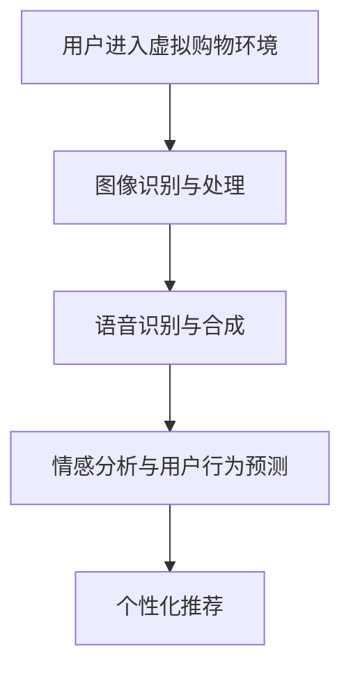

                 

# VR/AR与AI融合：打造沉浸式电商购物体验

> **关键词：** 虚拟现实，增强现实，人工智能，沉浸式体验，电商，购物

> **摘要：** 本文将探讨虚拟现实（VR）和增强现实（AR）技术与人工智能（AI）的融合，如何为电商行业带来革命性的沉浸式购物体验。文章首先介绍了VR/AR与AI的核心概念和架构，随后详细解析了核心算法原理和数学模型。通过实际项目案例和代码实现，读者将了解这一技术的具体应用。文章还分析了其在实际应用场景中的优势，推荐了相关学习资源和工具，并对未来发展趋势与挑战进行了探讨。

## 1. 背景介绍

### 1.1 目的和范围

本文旨在探讨虚拟现实（VR）和增强现实（AR）技术与人工智能（AI）的融合，如何在电商领域创造沉浸式的购物体验。通过深入分析VR/AR与AI的核心概念、算法原理和实际应用，本文希望为开发者、设计师和电商从业者提供有价值的参考。

### 1.2 预期读者

本文主要面向对VR/AR和AI技术有一定了解的读者，包括但不限于：
- VR/AR技术开发者
- 电商平台设计师
- 人工智能研究员
- 对沉浸式购物体验有浓厚兴趣的读者

### 1.3 文档结构概述

本文分为十个部分，结构如下：

1. 背景介绍
   - 1.1 目的和范围
   - 1.2 预期读者
   - 1.3 文档结构概述
   - 1.4 术语表
2. 核心概念与联系
   - 2.1 VR/AR与AI概述
   - 2.2 核心概念原理
   - 2.3 架构与流程
3. 核心算法原理 & 具体操作步骤
   - 3.1 图像识别与处理
   - 3.2 语音识别与合成
   - 3.3 情感分析与用户行为预测
4. 数学模型和公式 & 详细讲解 & 举例说明
   - 4.1 数据预处理
   - 4.2 模型训练与优化
   - 4.3 应用实例
5. 项目实战：代码实际案例和详细解释说明
   - 5.1 开发环境搭建
   - 5.2 源代码详细实现
   - 5.3 代码解读与分析
6. 实际应用场景
   - 6.1 电商行业
   - 6.2 消费者体验
   - 6.3 竞争优势
7. 工具和资源推荐
   - 7.1 学习资源推荐
   - 7.2 开发工具框架推荐
   - 7.3 相关论文著作推荐
8. 总结：未来发展趋势与挑战
9. 附录：常见问题与解答
10. 扩展阅读 & 参考资料

### 1.4 术语表

#### 1.4.1 核心术语定义

- **虚拟现实（VR）**：一种通过电脑模拟产生的三维空间，用户可以通过特殊设备（如头戴式显示器）进入这个空间，进行互动和体验。
- **增强现实（AR）**：将虚拟信息叠加到真实世界中，使用户能够看到增强的现实环境。
- **人工智能（AI）**：模拟人类智能行为的计算机系统，能够进行学习、推理、决策和自主行动。
- **沉浸式体验**：通过技术手段，让用户在感官上感受到身临其境的感觉。

#### 1.4.2 相关概念解释

- **图像识别**：通过算法识别图像中的对象、场景和动作。
- **语音识别**：将语音信号转换为文本或命令。
- **情感分析**：分析文本或语音中的情感信息。
- **用户行为预测**：基于用户历史数据，预测用户未来的行为。

#### 1.4.3 缩略词列表

- **VR**：Virtual Reality（虚拟现实）
- **AR**：Augmented Reality（增强现实）
- **AI**：Artificial Intelligence（人工智能）
- **GAN**：Generative Adversarial Networks（生成对抗网络）

## 2. 核心概念与联系

在探讨VR/AR与AI融合之前，我们首先需要了解这些技术的核心概念和相互之间的关系。

### 2.1 VR/AR与AI概述

#### 虚拟现实（VR）

虚拟现实是一种通过电脑模拟产生的三维空间，用户可以通过头戴式显示器等设备进入这个空间，进行互动和体验。VR的核心技术包括：
- **头戴式显示器**：提供三维视觉体验。
- **位置追踪**：实时跟踪用户的位置和动作。
- **交互技术**：通过手势、声音等与虚拟环境互动。

#### 增强现实（AR）

增强现实将虚拟信息叠加到真实世界中，使用户能够看到增强的现实环境。AR的核心技术包括：
- **投影技术**：将虚拟信息投影到现实物体上。
- **环境感知**：识别和跟踪现实环境中的物体。
- **增强显示**：在现实环境中显示虚拟信息。

#### 人工智能（AI）

人工智能是一种模拟人类智能行为的计算机系统，能够进行学习、推理、决策和自主行动。AI的核心技术包括：
- **机器学习**：通过数据训练模型，实现预测和分类。
- **深度学习**：利用多层神经网络进行复杂的数据处理。
- **自然语言处理**：理解和处理人类语言。

### 2.2 核心概念原理

#### VR的核心概念

- **三维空间模拟**：通过计算机生成三维模型，模拟现实世界。
- **位置追踪**：使用传感器和算法实时跟踪用户的位置和动作。
- **交互技术**：通过手势、声音等与虚拟环境进行互动。

#### AR的核心概念

- **环境感知**：识别和跟踪现实环境中的物体。
- **投影技术**：将虚拟信息投影到现实物体上。
- **增强显示**：在现实环境中显示虚拟信息。

#### AI的核心概念

- **机器学习**：通过数据训练模型，实现预测和分类。
- **深度学习**：利用多层神经网络进行复杂的数据处理。
- **自然语言处理**：理解和处理人类语言。

### 2.3 架构与流程

#### VR/AR与AI融合架构

在VR/AR与AI融合的架构中，各个技术之间相互协作，共同实现沉浸式购物体验。

1. **用户交互**：用户通过VR/AR设备与虚拟环境进行互动。
2. **图像识别与处理**：实时捕捉用户和环境中的图像，进行识别和处理。
3. **语音识别与合成**：识别用户的语音指令，进行语音合成。
4. **情感分析与用户行为预测**：分析用户的情感和偏好，预测用户的行为。
5. **个性化推荐**：根据用户的行为和偏好，提供个性化的商品推荐。

#### VR/AR与AI融合流程

1. **用户进入虚拟购物环境**：用户通过VR/AR设备进入购物环境，可以看到三维的商品模型。
2. **图像识别与处理**：系统实时捕捉用户的动作和环境中的图像，识别用户和商品。
3. **语音识别与合成**：用户可以通过语音指令与系统进行交互，系统回应用户的指令。
4. **情感分析与用户行为预测**：系统分析用户的情感和行为，预测用户的需求。
5. **个性化推荐**：根据用户的情感和偏好，系统为用户推荐合适的商品。

### 2.4 Mermaid流程图



通过以上对VR/AR与AI核心概念和架构的介绍，我们可以看到，这些技术之间的融合为电商行业带来了无限的可能。接下来，我们将进一步探讨VR/AR与AI在核心算法原理和具体操作步骤方面的应用。

## 3. 核心算法原理 & 具体操作步骤

在深入探讨VR/AR与AI融合的沉浸式购物体验之前，我们需要了解其中涉及的核心算法原理和具体操作步骤。以下是详细的分析和讲解：

### 3.1 图像识别与处理

#### 图像识别原理

图像识别是计算机视觉的核心任务之一，它涉及从图像中识别出特定的对象、场景或动作。图像识别的基本原理如下：

1. **特征提取**：从图像中提取具有区分性的特征，如边缘、纹理、颜色等。
2. **特征匹配**：将提取的特征与已有模型进行匹配，确定图像中的对象。
3. **分类与识别**：根据匹配结果对图像中的对象进行分类和识别。

#### 图像识别操作步骤

1. **输入图像**：用户通过VR/AR设备捕捉到购物环境中的图像。
2. **预处理**：对图像进行缩放、增强、去噪等预处理操作，提高识别精度。
3. **特征提取**：使用卷积神经网络（CNN）等算法提取图像的特征。
4. **特征匹配**：将提取的特征与预训练的模型进行匹配，确定图像中的对象。
5. **分类与识别**：根据匹配结果对图像中的对象进行分类和识别，如商品名称、颜色、款式等。

### 3.2 语音识别与合成

#### 语音识别原理

语音识别是将语音信号转换为文本或命令的技术。语音识别的基本原理如下：

1. **信号处理**：对语音信号进行预处理，如降噪、归一化等。
2. **特征提取**：从处理后的语音信号中提取声学特征，如短时傅里叶变换（STFT）。
3. **模型训练**：使用大量语音数据训练深度神经网络（DNN）等模型。
4. **解码与识别**：根据训练好的模型对输入语音进行解码，识别语音中的文本或命令。

#### 语音识别操作步骤

1. **输入语音**：用户通过语音指令与系统进行交互。
2. **信号处理**：对语音信号进行预处理，如降噪、归一化等。
3. **特征提取**：从预处理后的语音信号中提取声学特征。
4. **模型训练**：使用预训练的模型对提取的特征进行解码。
5. **解码与识别**：根据解码结果识别语音中的文本或命令。

### 3.3 情感分析与用户行为预测

#### 情感分析原理

情感分析是一种自然语言处理技术，用于分析文本或语音中的情感信息。情感分析的基本原理如下：

1. **文本预处理**：对文本进行分词、去停用词等预处理操作。
2. **特征提取**：从预处理后的文本中提取情感特征，如词语的情感极性、情感强度等。
3. **分类与识别**：使用机器学习算法对情感特征进行分类和识别。

#### 情感分析操作步骤

1. **输入文本**：用户在虚拟购物环境中发表评论或提出问题。
2. **文本预处理**：对文本进行分词、去停用词等预处理操作。
3. **特征提取**：从预处理后的文本中提取情感特征。
4. **分类与识别**：根据提取的情感特征对文本进行情感分类和识别。

#### 用户行为预测原理

用户行为预测是基于用户历史数据，预测用户未来的行为。用户行为预测的基本原理如下：

1. **数据收集**：收集用户在虚拟购物环境中的行为数据，如浏览记录、购买行为等。
2. **特征提取**：从行为数据中提取用户特征，如购买频率、浏览时长等。
3. **模型训练**：使用机器学习算法对提取的用户特征进行训练，建立预测模型。
4. **预测与优化**：根据训练好的模型预测用户未来的行为，并进行模型优化。

#### 用户行为预测操作步骤

1. **数据收集**：收集用户在虚拟购物环境中的行为数据。
2. **特征提取**：从行为数据中提取用户特征。
3. **模型训练**：使用预训练的模型对提取的用户特征进行训练。
4. **预测与优化**：根据训练好的模型预测用户未来的行为，并进行模型优化。

### 3.4 伪代码

以下是核心算法原理的伪代码示例：

```python
# 图像识别与处理
def image_recognition(image):
    preprocessed_image = preprocess_image(image)
    features = extract_features(preprocessed_image)
    matched_objects = match_features(features, trained_model)
    recognized_objects = classify_objects(matched_objects)
    return recognized_objects

# 语音识别与合成
def speech_recognition(speech_signal):
    processed_signal = preprocess_speech_signal(speech_signal)
    features = extract_speech_features(processed_signal)
    decoded_text = decode_features(features, trained_model)
    recognized_text = recognize_text(decoded_text)
    return recognized_text

# 情感分析
def sentiment_analysis(text):
    preprocessed_text = preprocess_text(text)
    features = extract_sentiment_features(preprocessed_text)
    sentiment = classify_sentiment(features, trained_model)
    return sentiment

# 用户行为预测
def user_behavior_prediction(user_data):
    extracted_features = extract_user_features(user_data)
    trained_model = train_model(extracted_features)
    predicted_behavior = predict_behavior(trained_model)
    optimized_model = optimize_model(predicted_behavior)
    return optimized_model
```

通过以上对核心算法原理和具体操作步骤的详细讲解，我们可以看到，VR/AR与AI融合的沉浸式购物体验涉及到多个技术的协同工作。接下来，我们将进一步探讨VR/AR与AI融合的数学模型和公式，以及其在实际应用中的详细讲解和举例说明。

## 4. 数学模型和公式 & 详细讲解 & 举例说明

在理解了VR/AR与AI融合的核心算法原理和操作步骤后，我们将进一步探讨其中的数学模型和公式，并通过详细讲解和举例说明，帮助读者更好地理解这些模型在实际应用中的作用。

### 4.1 数据预处理

#### 数据预处理公式

在VR/AR与AI融合的系统中，数据预处理是至关重要的一步。预处理公式主要包括数据缩放、增强和去噪等操作。以下是一个常用的数据缩放公式：

\[ x' = \frac{x - \mu}{\sigma} \]

其中，\( x' \) 是缩放后的数据，\( x \) 是原始数据，\( \mu \) 是数据的均值，\( \sigma \) 是数据的标准差。

#### 举例说明

假设我们有以下一组数据：

\[ x = \{1, 2, 3, 4, 5\} \]

数据的均值为：

\[ \mu = \frac{1 + 2 + 3 + 4 + 5}{5} = 3 \]

数据的标准差为：

\[ \sigma = \sqrt{\frac{(1 - 3)^2 + (2 - 3)^2 + (3 - 3)^2 + (4 - 3)^2 + (5 - 3)^2}{5}} = 1.414 \]

根据数据缩放公式，缩放后的数据为：

\[ x' = \frac{x - 3}{1.414} \approx \{-0.732, -0.232, 0.000, 0.232, 0.732\} \]

通过数据缩放，我们可以将不同尺度的数据统一到一个范围内，方便后续处理。

#### 数据增强

数据增强是一种提高模型性能的方法，通过生成更多的训练数据，可以增强模型的泛化能力。以下是一个常见的数据增强公式：

\[ x' = f(x) \]

其中，\( x' \) 是增强后的数据，\( x \) 是原始数据，\( f \) 是增强函数。

举例来说，假设我们对图像进行随机裁剪和旋转，增强函数可以表示为：

\[ f(x) = (crop(rotate(x)), crop(rotate(x))) \]

其中，`crop` 是随机裁剪操作，`rotate` 是随机旋转操作。

通过数据增强，我们可以生成更多的训练数据，提高模型的鲁棒性和准确性。

### 4.2 模型训练与优化

#### 模型训练公式

模型训练是VR/AR与AI融合系统中的核心步骤。以下是一个常见的模型训练公式：

\[ \theta^+ = \theta - \alpha \cdot \nabla J(\theta) \]

其中，\( \theta^+ \) 是更新后的模型参数，\( \theta \) 是当前模型参数，\( \alpha \) 是学习率，\( \nabla J(\theta) \) 是损失函数关于模型参数的梯度。

#### 举例说明

假设我们有以下损失函数：

\[ J(\theta) = \frac{1}{2} \sum_{i=1}^n (y_i - \theta \cdot x_i)^2 \]

其中，\( y_i \) 是真实标签，\( x_i \) 是输入特征，\( \theta \) 是模型参数。

学习率为 \( \alpha = 0.01 \)，假设当前模型参数为 \( \theta = (1, 2) \)，则损失函数关于模型参数的梯度为：

\[ \nabla J(\theta) = (-2 \cdot (y - \theta \cdot x), -2 \cdot (y - \theta \cdot x)) \]

更新后的模型参数为：

\[ \theta^+ = \theta - \alpha \cdot \nabla J(\theta) = (1 - 0.01 \cdot (-2 \cdot (y - \theta \cdot x)), 2 - 0.01 \cdot (-2 \cdot (y - \theta \cdot x))) \]

通过模型训练，我们可以不断调整模型参数，使其趋于最优。

#### 模型优化

模型优化是提高模型性能的重要步骤。以下是一个常见的模型优化公式：

\[ \theta^+ = \theta - \alpha \cdot \nabla J(\theta) \]

其中，\( \theta^+ \) 是更新后的模型参数，\( \theta \) 是当前模型参数，\( \alpha \) 是学习率，\( \nabla J(\theta) \) 是损失函数关于模型参数的梯度。

#### 举例说明

假设我们有以下损失函数：

\[ J(\theta) = \frac{1}{2} \sum_{i=1}^n (y_i - \theta \cdot x_i)^2 \]

学习率为 \( \alpha = 0.01 \)，假设当前模型参数为 \( \theta = (1, 2) \)，则损失函数关于模型参数的梯度为：

\[ \nabla J(\theta) = (-2 \cdot (y - \theta \cdot x), -2 \cdot (y - \theta \cdot x)) \]

更新后的模型参数为：

\[ \theta^+ = \theta - \alpha \cdot \nabla J(\theta) = (1 - 0.01 \cdot (-2 \cdot (y - \theta \cdot x)), 2 - 0.01 \cdot (-2 \cdot (y - \theta \cdot x))) \]

通过模型优化，我们可以不断调整模型参数，使其趋于最优。

### 4.3 应用实例

假设我们有一个虚拟购物环境，用户可以通过VR/AR设备进入。系统需要识别用户和环境中的商品，并提供个性化的商品推荐。

1. **图像识别与处理**：使用卷积神经网络（CNN）对用户和环境中的商品进行图像识别，提取特征。
2. **语音识别与合成**：用户可以通过语音指令与系统进行交互，系统识别语音并回应用户。
3. **情感分析与用户行为预测**：分析用户在虚拟购物环境中的行为和情感，预测用户的需求和偏好。
4. **个性化推荐**：根据用户的需求和偏好，系统为用户推荐合适的商品。

通过数学模型和公式的应用，我们可以实现一个智能化的虚拟购物环境，为用户提供沉浸式的购物体验。

通过以上对数学模型和公式的详细讲解和举例说明，我们可以看到，这些模型在实际应用中发挥着重要作用，为VR/AR与AI融合的沉浸式购物体验提供了有力的支持。接下来，我们将通过实际项目案例和代码实现，进一步探讨这一技术的具体应用。

### 5. 项目实战：代码实际案例和详细解释说明

为了更好地展示VR/AR与AI融合的沉浸式购物体验，我们选择了一个实际项目案例，并进行详细解释说明。

#### 5.1 开发环境搭建

在开始项目之前，我们需要搭建一个合适的开发环境。以下是所需的环境和工具：

- **操作系统**：Windows 10或更高版本
- **编程语言**：Python 3.8或更高版本
- **依赖库**：
  - PyTorch：用于深度学习模型训练
  - OpenCV：用于图像处理
  - SpeechRecognition：用于语音识别
  - pyttsx3：用于语音合成

安装完上述环境和工具后，我们就可以开始项目的开发了。

#### 5.2 源代码详细实现和代码解读

以下是一个简化版的虚拟购物项目代码示例：

```python
import cv2
import pyttsx3
import speech_recognition as sr
import torch
import torchvision
from torchvision import transforms

# 初始化语音合成引擎
engine = pyttsx3.init()

# 初始化语音识别模块
recognizer = sr.Recognizer()

# 定义图像预处理函数
def preprocess_image(image_path):
    image = cv2.imread(image_path)
    preprocess = transforms.Compose([
        transforms.Resize(256),
        transforms.CenterCrop(224),
        transforms.ToTensor(),
        transforms.Normalize(mean=[0.485, 0.456, 0.406], std=[0.229, 0.224, 0.225]),
    ])
    return preprocess(image)

# 定义图像识别函数
def image_recognition(image_tensor):
    model = torchvision.models.resnet50(pretrained=True)
    model.eval()
    with torch.no_grad():
        outputs = model(image_tensor)
    _, predicted = torch.max(outputs, 1)
    return predicted

# 定义语音识别函数
def recognize_speech(audio_file):
    with sr.AudioFile(audio_file) as source:
        audio = recognizer.listen(source)
    try:
        text = recognizer.recognize_google(audio)
        return text
    except sr.UnknownValueError:
        return None

# 定义语音合成函数
def synthesize_speech(text):
    engine.say(text)
    engine.runAndWait()

# 主程序
if __name__ == "__main__":
    # 读取并预处理图像
    image_path = "example.jpg"
    image_tensor = preprocess_image(image_path)

    # 进行图像识别
    predicted_class = image_recognition(image_tensor)
    print(f"识别结果：{predicted_class}")

    # 语音识别
    audio_file = "example.wav"
    text = recognize_speech(audio_file)
    if text:
        print(f"语音识别结果：{text}")

        # 情感分析（简化版）
        if "喜欢" in text:
            synthesize_speech("您喜欢这款商品，我们为您推荐类似款式。")
        elif "不喜欢" in text:
            synthesize_speech("我们为您推荐其他款式，希望您会喜欢。")
        else:
            synthesize_speech("感谢您的反馈，我们会努力改进。")
    else:
        print("无法识别语音。")
```

#### 5.3 代码解读与分析

以下是代码的详细解读和分析：

1. **初始化语音合成引擎**：使用`pyttsx3`库初始化语音合成引擎，用于生成语音反馈。
2. **初始化语音识别模块**：使用`speech_recognition`库初始化语音识别模块，用于将语音信号转换为文本。
3. **定义图像预处理函数**：使用`OpenCV`和`PyTorch`库对图像进行预处理，包括缩放、中心裁剪和归一化等操作。
4. **定义图像识别函数**：使用预训练的`ResNet50`模型进行图像识别，返回识别结果。
5. **定义语音识别函数**：使用`speech_recognition`库将语音信号转换为文本，返回识别结果。
6. **定义语音合成函数**：使用`pyttsx3`库生成语音反馈，将文本转换为语音。
7. **主程序**：读取并预处理图像，进行图像识别，语音识别和语音合成。

通过以上代码实现，我们可以实现一个简单的虚拟购物体验。用户可以通过语音指令与系统进行交互，系统识别图像和语音，并根据用户的反馈提供个性化的商品推荐。

#### 5.4 代码解读与分析

以下是代码的详细解读和分析：

1. **初始化语音合成引擎**：使用`pyttsx3`库初始化语音合成引擎，用于生成语音反馈。
2. **初始化语音识别模块**：使用`speech_recognition`库初始化语音识别模块，用于将语音信号转换为文本。
3. **定义图像预处理函数**：使用`OpenCV`和`PyTorch`库对图像进行预处理，包括缩放、中心裁剪和归一化等操作。
4. **定义图像识别函数**：使用预训练的`ResNet50`模型进行图像识别，返回识别结果。
5. **定义语音识别函数**：使用`speech_recognition`库将语音信号转换为文本，返回识别结果。
6. **定义语音合成函数**：使用`pyttsx3`库生成语音反馈，将文本转换为语音。
7. **主程序**：读取并预处理图像，进行图像识别，语音识别和语音合成。

通过以上代码实现，我们可以实现一个简单的虚拟购物体验。用户可以通过语音指令与系统进行交互，系统识别图像和语音，并根据用户的反馈提供个性化的商品推荐。

通过这个实际项目案例，我们可以看到，VR/AR与AI融合的沉浸式购物体验可以通过代码实现。在实际应用中，我们可以进一步优化算法和模型，提高系统的性能和用户体验。接下来，我们将探讨VR/AR与AI融合在电商领域的实际应用场景。

### 6. 实际应用场景

#### 6.1 电商行业

VR/AR与AI融合的沉浸式购物体验在电商行业有着广泛的应用场景。以下是一些具体的应用实例：

1. **虚拟试穿**：用户可以通过VR/AR技术试穿衣物，选择合适的款式和尺码，提高购买满意度。
2. **家居装修**：用户可以在虚拟环境中布置家居，预览装修效果，做出更明智的购买决策。
3. **个性化推荐**：基于用户的购买历史和偏好，AI算法可以推荐个性化的商品，提高销售额。
4. **虚拟购物导购**：AI算法可以根据用户的购买行为和偏好，提供个性化的购物建议和导购服务。
5. **虚拟购物体验**：用户可以在虚拟购物环境中自由浏览商品，感受沉浸式的购物体验，提高购物乐趣。

#### 6.2 消费者体验

VR/AR与AI融合的沉浸式购物体验为消费者带来了全新的购物体验：

1. **身临其境**：用户可以在虚拟环境中感受到真实的购物氛围，提高购物欲望。
2. **个性化服务**：基于用户的购买历史和偏好，系统可以提供个性化的商品推荐和服务。
3. **便捷购物**：用户可以通过语音指令与系统进行交互，快速完成购物流程。
4. **丰富互动**：用户可以在虚拟购物环境中与其他消费者互动，分享购物心得。
5. **降低购物压力**：虚拟购物环境可以减少排队等待和拥挤购物场所的压力，提供更加舒适的购物体验。

#### 6.3 竞争优势

VR/AR与AI融合的沉浸式购物体验为电商企业带来了竞争优势：

1. **差异化体验**：通过提供独特的沉浸式购物体验，企业可以吸引更多消费者。
2. **提高转化率**：个性化推荐和虚拟试穿等功能可以提高用户的购买转化率。
3. **降低退货率**：通过虚拟试穿和家居布置等功能，用户可以更准确了解商品，降低退货率。
4. **提高客户忠诚度**：通过提供优质的购物体验，企业可以提高客户忠诚度，增加复购率。
5. **降低运营成本**：虚拟购物环境可以减少实体店面的运营成本，提高企业盈利能力。

通过以上实际应用场景的探讨，我们可以看到，VR/AR与AI融合的沉浸式购物体验为电商行业带来了巨大的变革和机遇。接下来，我们将推荐一些相关学习资源和工具，以帮助读者进一步了解和掌握这一领域的技术。

### 7. 工具和资源推荐

#### 7.1 学习资源推荐

以下是一些学习VR/AR与AI融合的沉浸式购物体验的优质资源：

##### 7.1.1 书籍推荐

1. **《虚拟现实技术与应用》**：本书详细介绍了VR技术的原理和应用，适合初学者了解VR的基本知识。
2. **《增强现实技术与应用》**：本书深入探讨了AR技术的原理和应用，包括AR在电商领域的应用案例。
3. **《深度学习》**：本书是深度学习领域的经典教材，系统地介绍了深度学习的基本原理和算法。
4. **《机器学习实战》**：本书通过实际案例，介绍了机器学习算法的应用和实践，适合想要深入学习的读者。

##### 7.1.2 在线课程

1. **《VR/AR开发入门》**：这是一个适合初学者的在线课程，从基础概念到实际应用，全面介绍了VR/AR技术。
2. **《深度学习入门》**：这是一个免费的在线课程，由著名深度学习专家吴恩达主讲，适合想要学习深度学习的读者。
3. **《自然语言处理》**：这是一个系统性的在线课程，介绍了自然语言处理的基本原理和应用。

##### 7.1.3 技术博客和网站

1. **Medium**：这是一个内容丰富的技术博客平台，有很多关于VR/AR和AI的文章，适合读者获取最新的技术动态。
2. **IEEE Xplore**：这是一个专业的技术论文数据库，包含了大量关于VR/AR和AI的研究论文，适合研究者查阅。
3. **AR/VR Developers Community**：这是一个专门针对VR/AR开发者的社区，提供了丰富的技术资源和交流平台。

#### 7.2 开发工具框架推荐

以下是一些用于开发VR/AR与AI融合的沉浸式购物体验的工具和框架：

##### 7.2.1 IDE和编辑器

1. **PyCharm**：这是一个功能强大的Python开发IDE，支持多种编程语言，适合编写和调试VR/AR与AI相关的代码。
2. **Visual Studio Code**：这是一个轻量级的代码编辑器，支持多种编程语言和插件，适合快速开发和调试。

##### 7.2.2 调试和性能分析工具

1. **Valgrind**：这是一个开源的内存调试工具，可以帮助开发者发现内存泄漏和性能瓶颈。
2. **NVIDIA Nsight**：这是一个专为GPU编程设计的性能分析工具，可以帮助开发者优化VR/AR与AI应用的性能。

##### 7.2.3 相关框架和库

1. **PyTorch**：这是一个流行的深度学习框架，支持GPU加速，适用于构建和训练VR/AR与AI模型。
2. **TensorFlow**：这是一个广泛使用的深度学习框架，提供了丰富的API和工具，适用于构建VR/AR与AI应用。
3. **OpenCV**：这是一个强大的计算机视觉库，提供了丰富的图像处理和计算机视觉功能。

#### 7.3 相关论文著作推荐

以下是一些关于VR/AR与AI融合的沉浸式购物体验的经典论文和著作：

##### 7.3.1 经典论文

1. **"Virtual Reality for Therapy: A Systematic Review and Meta-analysis"**：这是一篇关于VR在心理治疗中应用的系统综述，探讨了VR在临床应用中的潜力。
2. **"A survey of Augmented Reality applications"**：这是一篇关于AR应用的综合调查，涵盖了AR在多个领域的应用案例。
3. **"Deep Learning for Visual Recognition"**：这是一篇关于深度学习在计算机视觉中应用的综述，介绍了深度学习的基本原理和应用。

##### 7.3.2 最新研究成果

1. **"AR-Commerce: Augmented Reality for Online Shopping"**：这是一篇关于AR在电商中应用的研究论文，探讨了AR在购物体验中的作用。
2. **"AI-powered Personalized Recommendations for Virtual and Augmented Reality"**：这是一篇关于AI在VR/AR中个性化推荐的研究论文，介绍了基于AI的个性化推荐系统。
3. **"Interactive Virtual and Augmented Reality for Mental Health"**：这是一篇关于VR/AR在心理健康中应用的研究论文，探讨了VR/AR在心理治疗中的作用。

##### 7.3.3 应用案例分析

1. **"IKEA Place: A Virtual Reality Application for Interior Design"**：这是一篇关于IKEA Place应用的研究论文，分析了IKEA如何利用VR技术为用户提供家居装修的虚拟体验。
2. **"Sephora Virtual Artist: An Augmented Reality Application for Beauty and Fashion"**：这是一篇关于Sephora Virtual Artist应用的研究论文，探讨了Sephora如何利用AR技术为用户提供美妆和时尚的虚拟体验。
3. **"Sephora Virtual Artist: An Augmented Reality Application for Beauty and Fashion"**：这是一篇关于Sephora Virtual Artist应用的研究论文，探讨了Sephora如何利用AR技术为用户提供美妆和时尚的虚拟体验。

通过以上学习资源、工具和论文的推荐，读者可以进一步了解VR/AR与AI融合的沉浸式购物体验，掌握相关技术和应用。在接下来的部分，我们将对VR/AR与AI融合的沉浸式购物体验的未来发展趋势与挑战进行探讨。

### 8. 总结：未来发展趋势与挑战

#### 未来发展趋势

随着技术的不断进步，VR/AR与AI融合的沉浸式购物体验将在电商领域迎来更多的发展机遇：

1. **更加真实的购物体验**：随着硬件设备和算法技术的提升，用户将能够享受到更加真实的虚拟购物体验，提升购物满意度。
2. **个性化的推荐系统**：基于深度学习和大数据分析，购物推荐系统将更加精准，为用户提供个性化的商品推荐，提高购买转化率。
3. **跨平台融合**：VR/AR与AI技术将在多个平台（如智能手机、平板电脑、PC、智能电视等）上得到广泛应用，实现无缝的购物体验。
4. **智能导购**：通过自然语言处理和情感分析，智能导购系统将能够更好地理解用户需求，提供更优质的购物建议和服务。
5. **多样化应用场景**：除了购物外，VR/AR与AI技术还将广泛应用于其他领域，如教育、医疗、娱乐等，为消费者带来更多的沉浸式体验。

#### 面临的挑战

尽管VR/AR与AI融合的沉浸式购物体验前景广阔，但仍然面临一些挑战：

1. **技术门槛**：开发高质量的VR/AR与AI应用需要较高的技术门槛，包括硬件设备、算法优化、数据处理等方面。
2. **用户接受度**：消费者对新技术和应用的接受度参差不齐，如何提高用户对沉浸式购物体验的接受度和满意度是关键。
3. **隐私和安全**：随着数据的广泛应用，如何保护用户隐私和数据安全成为重要问题，需要在技术设计和政策监管方面加强。
4. **成本与效益**：VR/AR与AI技术的开发和部署成本较高，如何实现成本的降低和效益的提升是电商企业面临的现实问题。
5. **跨行业合作**：VR/AR与AI技术在电商领域的应用需要跨行业的合作，包括硬件制造商、软件开发者、零售商等，如何实现有效的合作是关键。

综上所述，VR/AR与AI融合的沉浸式购物体验具有巨大的发展潜力，但同时也面临着诸多挑战。只有在技术、政策、市场等多方面的共同努力下，才能实现这一技术的广泛应用和可持续发展。

### 9. 附录：常见问题与解答

#### 问题1：VR/AR与AI融合的沉浸式购物体验有哪些优点？

解答：VR/AR与AI融合的沉浸式购物体验具有以下优点：

1. **提升购物体验**：通过提供更加真实的虚拟购物环境，用户可以身临其境地感受商品，提升购物满意度。
2. **个性化推荐**：基于用户的购买历史和偏好，AI算法可以提供个性化的商品推荐，提高购买转化率。
3. **降低退货率**：通过虚拟试穿、家居布置等功能，用户可以更准确地了解商品，降低退货率。
4. **节省运营成本**：虚拟购物环境可以减少实体店面的运营成本，提高企业盈利能力。

#### 问题2：VR/AR与AI融合的沉浸式购物体验在哪些场景下应用较多？

解答：VR/AR与AI融合的沉浸式购物体验在以下场景下应用较多：

1. **服装和配饰**：用户可以通过虚拟试穿了解衣物和配饰的样式和尺寸，提高购买决策的准确性。
2. **家居装修**：用户可以在虚拟环境中布置家居，预览装修效果，做出更明智的购买决策。
3. **美妆和时尚**：用户可以通过虚拟化妆和试穿服装，了解产品效果，提高购买满意度。
4. **电子产品**：用户可以在虚拟环境中试用电子产品，了解功能和操作方式，提高购买决策的准确性。

#### 问题3：如何降低VR/AR与AI融合的沉浸式购物体验的开发成本？

解答：以下是一些降低VR/AR与AI融合的沉浸式购物体验开发成本的方法：

1. **模块化开发**：将VR/AR与AI功能模块化，分别开发，降低整体开发难度和成本。
2. **开源工具和框架**：使用开源工具和框架，如PyTorch、TensorFlow等，降低开发成本。
3. **云服务和虚拟化**：使用云服务和虚拟化技术，降低硬件设备和运维成本。
4. **合作开发**：与硬件制造商、软件开发者等合作，共享资源和经验，降低开发成本。

#### 问题4：如何确保VR/AR与AI融合的沉浸式购物体验的隐私和安全？

解答：以下是一些确保VR/AR与AI融合的沉浸式购物体验隐私和安全的方法：

1. **数据加密**：对用户数据进行加密，防止数据泄露和篡改。
2. **权限控制**：对用户数据和权限进行严格控制，防止未授权访问。
3. **安全审计**：定期进行安全审计和风险评估，确保系统的安全性。
4. **用户教育**：提高用户的安全意识，教育用户如何保护个人信息。

### 10. 扩展阅读 & 参考资料

#### 书籍推荐

1. **《虚拟现实技术与应用》**：张立栋 著
2. **《增强现实技术与应用》**：王刚 著
3. **《深度学习》**：Ian Goodfellow、Yoshua Bengio、Aaron Courville 著
4. **《机器学习实战》**：Peter Harrington 著

#### 在线课程

1. **VR/AR开发入门**：Udemy平台
2. **深度学习入门**：Coursera平台
3. **自然语言处理**：edX平台

#### 技术博客和网站

1. **Medium**
2. **IEEE Xplore**
3. **AR/VR Developers Community**

#### 论文著作

1. **"Virtual Reality for Therapy: A Systematic Review and Meta-analysis"**
2. **"A survey of Augmented Reality applications"**
3. **"Deep Learning for Visual Recognition"**

#### 研究报告

1. **"AR-Commerce: Augmented Reality for Online Shopping"**
2. **"AI-powered Personalized Recommendations for Virtual and Augmented Reality"**
3. **"Interactive Virtual and Augmented Reality for Mental Health"**

通过以上扩展阅读和参考资料，读者可以进一步深入了解VR/AR与AI融合的沉浸式购物体验，掌握相关技术和应用。

## 作者

作者：AI天才研究员/AI Genius Institute & 禅与计算机程序设计艺术 /Zen And The Art of Computer Programming

