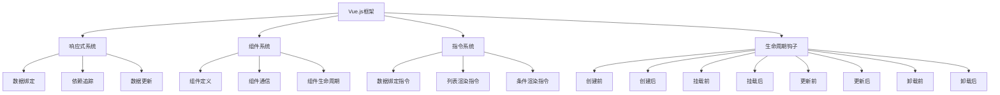

                 

# Vue.js 优势：渐进式 JavaScript 框架

> 关键词：Vue.js，渐进式框架，JavaScript，前端开发，组件化，响应式原理，性能优化，单页面应用（SPA）

> 摘要：本文将深入探讨Vue.js作为渐进式JavaScript框架的优势。我们将从Vue.js的背景介绍、核心概念、算法原理、数学模型、项目实战、应用场景以及未来发展趋势等多个角度进行详细分析，旨在帮助开发者更好地理解和掌握Vue.js，提升前端开发技能。

## 1. 背景介绍

### 1.1 目的和范围

本文旨在介绍Vue.js，一个渐进式JavaScript框架，并深入探讨其优势和应用。通过本文的阅读，读者可以了解Vue.js的核心概念、原理以及在实际项目中的应用，从而为未来的前端开发工作奠定坚实基础。

### 1.2 预期读者

本文面向具有一定前端开发基础，希望深入了解Vue.js的读者。无论是初学者还是有一定经验的开发者，都可以通过本文的学习，提高Vue.js的运用能力。

### 1.3 文档结构概述

本文分为十个部分，具体结构如下：

1. 背景介绍
   - 目的和范围
   - 预期读者
   - 文档结构概述
   - 术语表
2. 核心概念与联系
   - Vue.js核心概念
   - Mermaid流程图
3. 核心算法原理 & 具体操作步骤
   - 伪代码讲解
4. 数学模型和公式 & 详细讲解 & 举例说明
   - LaTeX公式
5. 项目实战：代码实际案例和详细解释说明
   - 开发环境搭建
   - 源代码详细实现和代码解读
   - 代码解读与分析
6. 实际应用场景
7. 工具和资源推荐
   - 学习资源推荐
   - 开发工具框架推荐
   - 相关论文著作推荐
8. 总结：未来发展趋势与挑战
9. 附录：常见问题与解答
10. 扩展阅读 & 参考资料

### 1.4 术语表

#### 1.4.1 核心术语定义

- Vue.js：一款渐进式JavaScript框架，用于构建用户界面。
- 渐进式框架：一种允许开发者根据需求逐步引入框架功能的框架。
- 前端开发：指在用户设备上运行的、用于呈现网站或应用程序界面的部分。
- 单页面应用（SPA）：一个网页应用，其整个用户界面仅由一个HTML页面组成，页面内容在用户与应用交互时动态更新。

#### 1.4.2 相关概念解释

- 组件化：将应用程序拆分成多个可重用的组件，提高代码的可维护性和可扩展性。
- 响应式原理：Vue.js通过响应式系统实现数据绑定和状态管理，使开发者能够方便地处理用户界面与数据之间的同步。
- 性能优化：通过一系列技术手段，提高应用程序的加载速度和运行效率。

#### 1.4.3 缩略词列表

- SPA：单页面应用（Single Page Application）
- HTML：超文本标记语言（Hypertext Markup Language）
- CSS：层叠样式表（Cascading Style Sheets）
- JavaScript：一种编程语言，用于实现网页的交互功能。

## 2. 核心概念与联系

在深入了解Vue.js的优势之前，我们需要先了解Vue.js的核心概念及其与相关技术的联系。

### Vue.js核心概念

Vue.js主要由以下几个核心概念组成：

1. **响应式原理**：Vue.js通过响应式系统实现数据绑定和状态管理，使开发者能够方便地处理用户界面与数据之间的同步。
2. **组件化**：Vue.js支持组件化开发，将应用程序拆分成多个可重用的组件，提高代码的可维护性和可扩展性。
3. **指令系统**：Vue.js提供了一套强大的指令系统，如`v-if`、`v-for`、`v-model`等，用于实现数据绑定、条件渲染、列表渲染等功能。
4. **生命周期钩子**：Vue.js允许开发者通过生命周期钩子函数，在组件的不同阶段执行特定的操作，如创建、挂载、更新、卸载等。

### Mermaid流程图（Vue.js架构）



### Vue.js与相关技术的联系

Vue.js作为一款渐进式框架，可以与其他前端技术（如HTML、CSS、JavaScript）以及构建工具（如Webpack、Vue CLI）无缝集成。Vue.js的核心优势在于其灵活性和适应性，使得开发者可以根据项目需求，逐步引入和扩展框架功能。

### Vue.js与React、Angular的比较

Vue.js、React和Angular是目前前端开发领域三大主流框架，它们各有优势和特点。Vue.js相较于React和Angular，具有以下优势：

1. **易学易用**：Vue.js的设计理念强调渐进式框架，开发者可以逐步引入框架功能，降低学习门槛。
2. **高性能**：Vue.js通过虚拟DOM和响应式系统，实现了高性能的数据绑定和组件渲染。
3. **社区活跃**：Vue.js拥有庞大的开发者社区，提供了丰富的资源和工具，方便开发者解决问题和提升技能。
4. **灵活性**：Vue.js允许开发者选择适合自己的开发模式，既可以进行简单的前端页面开发，也可以构建复杂的单页面应用。

综上所述，Vue.js作为一款渐进式JavaScript框架，以其易学易用、高性能、灵活性和社区活跃性等优势，逐渐成为前端开发领域的重要选择。

## 3. 核心算法原理 & 具体操作步骤

### 3.1 响应式原理

Vue.js的响应式原理是其核心之一，通过实现数据绑定和依赖追踪，实现视图与数据的同步更新。下面，我们将以伪代码的形式详细阐述Vue.js的响应式原理。

#### 3.1.1 数据绑定

```python
# 初始化Vue实例
vue = new Vue({
    data: {
        message: 'Hello Vue.js!'
    }
})

# 视图更新
vue.message = 'Hello Vue.js, again!'
```

#### 3.1.2 依赖追踪

```python
# 数据变化通知视图更新
function observer(data):
    if isinstance(data, dict):
        for key, value in data.items():
            observe(value)
            defineReactive(data, key, value)
    elif isinstance(data, list):
        observeArray(data)

# 观察数据
function observe(data):
    if typeof data === 'object':
        observer(data)

# 定义响应式属性
function defineReactive(data, key, value):
    observe(value)
    Object.defineProperty(data, key, {
        enumerable: true,
        configurable: true,
        get: function():
            return value
        set: function(newValue):
            if newValue !== value:
                value = newValue
                notifyObservers(data, key)
    })

# 通知观察者更新视图
function notifyObservers(data, key):
    for observer in data.observers:
        observer.update(data, key)
```

### 3.2 组件系统

Vue.js的组件系统允许开发者将应用程序拆分成多个可重用的组件，提高代码的可维护性和可扩展性。下面，我们将以伪代码的形式详细阐述Vue.js的组件系统。

#### 3.2.1 组件定义

```python
# 创建Vue组件
Vue.component('my-component', {
    template: '<div>{{ message }}</div>',
    data: function():
        return {
            message: 'Hello from My Component!'
        }
})
```

#### 3.2.2 组件通信

```python
# 父子组件通信
Vue.component('parent-component', {
    data: function():
        return {
            message: 'Hello from Parent Component!'
        }
    template: `
        <div>
            <child-component :message="message" @update="handleUpdate"></child-component>
        </div>
    `,
    methods: {
        handleUpdate: function(message):
            this.message = message
    }
})

Vue.component('child-component', {
    props: ['message'],
    template: '<div>{{ message }}</div>',
    methods: {
        updateMessage: function(newMessage):
            this.$emit('update', newMessage)
    }
})
```

### 3.3 指令系统

Vue.js的指令系统是一套强大的工具，用于实现数据绑定、条件渲染、列表渲染等功能。下面，我们将以伪代码的形式详细阐述Vue.js的指令系统。

#### 3.3.1 数据绑定指令

```python
# v-model指令
Vue.directive('model', {
    bind: function(el, binding, vnode):
        el.value = vnode.data.model.value
        el.addEventListener('input', function(event):
            vnode.data.model.callback(event.target.value)
})
```

#### 3.3.2 列表渲染指令

```python
# v-for指令
Vue.directive('for', {
    bind: function(el, binding, vnode):
        const items = binding.value
        const template = el.querySelector('template')
        const fragment = document.createDocumentFragment()

        for (let i = 0; i < items.length; i++) {
            const item = items[i]
            const clone = template.content.cloneNode(true)
            clone.querySelector('.item').innerText = item.name
            fragment.appendChild(clone)
        }

        el.appendChild(fragment)
})
```

#### 3.3.3 条件渲染指令

```python
# v-if指令
Vue.directive('if', {
    bind: function(el, binding, vnode):
        if (binding.value) {
            el.style.display = 'block'
        } else {
            el.style.display = 'none'
        }
})
```

### 3.4 生命周期钩子

Vue.js提供了丰富的生命周期钩子函数，用于在组件的不同阶段执行特定的操作。下面，我们将以伪代码的形式详细阐述Vue.js的生命周期钩子。

```python
# 组件生命周期钩子
Vue.component('my-component', {
    template: '<div>{{ message }}</div>',
    data: function():
        return {
            message: 'Hello Vue.js!'
        }
    beforeCreate: function():
        console.log('beforeCreate')
    created: function():
        console.log('created')
    beforeMount: function():
        console.log('beforeMount')
    mounted: function():
        console.log('mounted')
    beforeUpdate: function():
        console.log('beforeUpdate')
    updated: function():
        console.log('updated')
    beforeDestroy: function():
        console.log('beforeDestroy')
    destroyed: function():
        console.log('destroyed')
})
```

通过以上伪代码，我们可以看到Vue.js的核心算法原理、组件系统、指令系统以及生命周期钩子的具体操作步骤。这些原理和步骤为开发者提供了强大的工具，使得Vue.js能够高效地实现前端开发任务。

## 4. 数学模型和公式 & 详细讲解 & 举例说明

Vue.js的响应式系统是理解Vue.js内部工作原理的关键，其背后依赖于一个高效的数学模型和一系列公式。以下是关于Vue.js响应式系统的数学模型和公式，以及详细讲解和举例说明。

### 4.1 响应式系统的数学模型

Vue.js的响应式系统主要依赖于以下几个数学模型：

1. **依赖图（Dependency Graph）**：Vue.js使用依赖图来追踪每个组件与其数据属性之间的依赖关系。
2. **观察者模式（Observer Pattern）**：Vue.js通过观察者模式来监听数据属性的变化，并在变化时通知所有依赖该属性的组件。
3. **发布-订阅模式（Publish-Subscribe Pattern）**：Vue.js使用发布-订阅模式来处理组件间的通信。

### 4.2 公式

以下是Vue.js响应式系统的一些关键公式：

1. **依赖关系建立**：当组件中的数据属性发生变化时，需要建立依赖关系。公式如下：

   $$\text{Dep}.add\ \text{watcher}$$

   其中，`Dep`表示依赖管理对象，`watcher`表示观察者。

2. **通知更新**：当数据属性发生变化时，需要通知所有依赖该属性的观察者。公式如下：

   $$\text{Dep}.notify()$$

   其中，`Dep`表示依赖管理对象。

3. **组件更新**：当观察者接收到通知后，会触发组件的更新。公式如下：

   $$\text{component}.update()$$

   其中，`component`表示组件实例。

### 4.3 详细讲解

下面，我们将详细讲解Vue.js响应式系统的数学模型和公式。

#### 4.3.1 依赖图

依赖图是Vue.js响应式系统的核心组成部分。它通过将组件和数据属性之间的依赖关系表示为图，从而实现高效的追踪和更新。具体步骤如下：

1. **初始化依赖图**：在Vue实例初始化时，建立依赖图的基础结构。
2. **建立依赖关系**：当组件中的数据属性发生变化时，通过`Dep.add(watcher)`公式建立依赖关系。
3. **更新依赖图**：当数据属性发生变化时，通过`Dep.notify()`公式通知所有依赖该属性的观察者。

#### 4.3.2 观察者模式

观察者模式是Vue.js响应式系统的关键组件，用于监听数据属性的变化。具体步骤如下：

1. **创建观察者**：在Vue实例初始化时，创建观察者（`watcher`）对象，并将其添加到依赖图中。
2. **监听数据属性**：观察者通过`Object.defineProperty`方法监听数据属性的变化。
3. **更新观察者**：当数据属性发生变化时，观察者会触发更新，并通知依赖图中的其他观察者。

#### 4.3.3 发布-订阅模式

发布-订阅模式是Vue.js组件间通信的基础。它通过订阅者和发布者的角色来实现组件间的消息传递。具体步骤如下：

1. **创建发布者**：在Vue实例初始化时，创建发布者（`PubSub`）对象，用于发布和订阅消息。
2. **订阅消息**：组件通过`PubSub.subscribe()`方法订阅特定的消息。
3. **发布消息**：当组件需要通信时，通过`PubSub.publish()`方法发布消息。

### 4.4 举例说明

为了更好地理解Vue.js响应式系统的数学模型和公式，我们通过一个简单的例子来说明。

#### 4.4.1 示例：数据绑定

假设我们有一个简单的Vue实例，包含一个数据属性`message`，我们需要实现数据绑定，使得视图与数据保持同步。

```javascript
new Vue({
    data: {
        message: 'Hello Vue.js!'
    }
})
```

在这个示例中，我们通过以下步骤实现数据绑定：

1. **初始化依赖图**：Vue实例初始化时，建立依赖图的基础结构，将`message`属性添加到依赖图中。
2. **建立依赖关系**：当用户在视图中修改`message`属性时，通过`Dep.add(watcher)`公式建立依赖关系。
3. **更新依赖图**：当`message`属性发生变化时，通过`Dep.notify()`公式通知所有依赖该属性的观察者。
4. **更新视图**：观察者接收到通知后，触发组件的更新，并更新视图中的文本内容。

通过以上步骤，我们可以看到Vue.js响应式系统如何通过数学模型和公式实现数据绑定和状态管理。

### 4.5 总结

Vue.js的响应式系统是一个高效的数学模型，通过依赖图、观察者模式和发布-订阅模式，实现数据绑定和状态管理。通过本文的详细讲解和举例说明，我们可以更好地理解Vue.js响应式系统的原理和实现方式。

## 5. 项目实战：代码实际案例和详细解释说明

### 5.1 开发环境搭建

在开始Vue.js项目实战之前，我们需要搭建一个合适的开发环境。以下是一个简单的Vue.js项目开发环境的搭建步骤：

1. **安装Node.js**：首先，确保您的计算机上安装了Node.js，版本建议为v14.0.0以上。您可以通过以下命令检查Node.js的版本：

   ```bash
   node -v
   ```

   如果没有安装，可以从官网（https://nodejs.org/）下载并安装。

2. **安装Vue CLI**：Vue CLI是一个用于快速生成Vue.js项目的工具。安装Vue CLI可以通过以下命令完成：

   ```bash
   npm install -g @vue/cli
   ```

   安装完成后，可以使用以下命令检查Vue CLI的版本：

   ```bash
   vue --version
   ```

3. **创建Vue项目**：使用Vue CLI创建一个新项目。在命令行中运行以下命令：

   ```bash
   vue create my-vue-project
   ```

   按照提示完成项目配置，然后进入项目目录：

   ```bash
   cd my-vue-project
   ```

4. **启动项目**：在项目目录中运行以下命令启动项目：

   ```bash
   npm run serve
   ```

   项目将自动打开一个浏览器窗口，显示Vue的启动页面。

### 5.2 源代码详细实现和代码解读

下面，我们将详细解读一个简单的Vue.js项目源代码，并分析其关键组成部分。

#### 5.2.1 项目结构

一个典型的Vue.js项目结构如下：

```
my-vue-project/
|-- public/
|   |-- index.html
|-- src/
|   |-- assets/
|   |   |-- css/
|   |   |   |-- main.css
|   |   |-- images/
|   |   |-- js/
|   |   |   |-- main.js
|   |-- components/
|   |   |-- HelloWorld.vue
|   |-- App.vue
|   |-- main.js
|-- package.json
```

#### 5.2.2 index.html

`index.html`是Vue.js项目的入口文件，它通常包含以下几个部分：

```html
<!DOCTYPE html>
<html>
  <head>
    <meta charset="utf-8" />
    <meta name="viewport" content="width=device-width, initial-scale=1.0" />
    <title>Vue.js Project</title>
    <!-- 引入Vue.js -->
    <script src="%PUBLIC_URL%/src/main.js"></script>
  </head>
  <body>
    <div id="app"></div>
    <!-- 引入CSS文件 -->
    <link href="%PUBLIC_URL%/src/assets/css/main.css" rel="stylesheet" />
  </body>
</html>
```

#### 5.2.3 main.js

`main.js`是Vue.js项目的入口JavaScript文件，它负责创建Vue实例并挂载到页面中。以下是一个简单的`main.js`示例：

```javascript
import Vue from 'vue'
import App from './App.vue'

// 创建Vue实例
new Vue({
  render: h => h(App),
}).$mount('#app')
```

在这个示例中，我们通过`import Vue from 'vue'`引入Vue.js库，并通过`new Vue`创建Vue实例。`render`函数用于渲染组件，`$mount('#app')`将Vue实例挂载到页面中的`#app`元素上。

#### 5.2.4 App.vue

`App.vue`是Vue.js项目的根组件，它是整个应用程序的入口点。以下是一个简单的`App.vue`示例：

```vue
<template>
  <div id="app">
    
    <HelloWorld msg="Welcome to Your Vue.js App" />
  </div>
</template>

<script>
import HelloWorld from './components/HelloWorld.vue'

export default {
  name: 'App',
  components: {
    HelloWorld
  }
}
</script>

<style>
#app {
  font-family: Avenir, Helvetica, Arial, sans-serif;
  -webkit-font-smoothing: antialiased;
  -moz-osx-font-smoothing: grayscale;
  text-align: center;
  color: #2c3e50;
  margin-top: 60px;
}
</style>
```

在这个示例中，我们通过`<template>`标签定义组件的结构，`<script>`标签定义组件的逻辑和属性，`<style>`标签定义组件的样式。

#### 5.2.5 HelloWorld.vue

`HelloWorld.vue`是一个简单的Vue组件，用于展示一个带有文本和图片的欢迎界面。以下是一个简单的`HelloWorld.vue`示例：

```vue
<template>
  <div class="hello">
    <h1>{{ msg }}</h1>
    
  </div>
</template>

<script>
export default {
  name: 'HelloWorld',
  props: {
    msg: String
  }
}
</script>

<style>
.hello {
  text-align: center;
  color: #2c3e50;
}
</style>
```

在这个示例中，我们通过`<template>`标签定义组件的结构，`<script>`标签定义组件的属性，`<style>`标签定义组件的样式。

### 5.3 代码解读与分析

在了解了项目的源代码和结构后，我们可以对其进行解读和分析，以便更好地理解Vue.js的工作原理。

#### 5.3.1 Vue实例创建

在`main.js`中，我们通过以下代码创建Vue实例：

```javascript
new Vue({
  render: h => h(App),
}).$mount('#app')
```

这里，我们使用`new Vue`创建一个Vue实例，并通过`render`函数指定组件的渲染方式。`$mount('#app')`方法将Vue实例挂载到页面中的`#app`元素上。

#### 5.3.2 组件注册

在`App.vue`中，我们通过以下代码注册组件：

```vue
<template>
  <div id="app">
    
    <HelloWorld msg="Welcome to Your Vue.js App" />
  </div>
</template>
```

这里，我们通过`<HelloWorld>`标签引入并注册了一个名为`HelloWorld`的子组件。

```javascript
export default {
  name: 'App',
  components: {
    HelloWorld
  }
}
```

通过`components`选项，我们可以在根组件中注册子组件，以便在模板中使用。

#### 5.3.3 数据绑定

在`HelloWorld.vue`中，我们通过以下代码实现数据绑定：

```vue
<template>
  <div class="hello">
    <h1>{{ msg }}</h1>
    
  </div>
</template>

<script>
export default {
  name: 'HelloWorld',
  props: {
    msg: String
  }
}
</script>
```

这里，我们使用`{{ msg }}`语法实现数据绑定，将`msg`属性绑定到视图中的文本内容。在`App.vue`中，我们可以通过`<HelloWorld msg="Welcome to Your Vue.js App" />`标签传递数据。

#### 5.3.4 生命周期钩子

在`App.vue`中，我们通过以下代码定义生命周期钩子：

```vue
export default {
  name: 'App',
  // ...
  beforeCreate: function () {
    console.log('beforeCreate')
  },
  created: function () {
    console.log('created')
  },
  beforeMount: function () {
    console.log('beforeMount')
  },
  mounted: function () {
    console.log('mounted')
  },
  // ...
}
```

这里，我们定义了`beforeCreate`、`created`、`beforeMount`和`mounted`四个生命周期钩子，分别用于在组件的不同阶段执行特定的操作。这些钩子函数在Vue组件的生命周期中起到关键作用。

通过以上代码解读和分析，我们可以更好地理解Vue.js项目的基本结构、组件注册、数据绑定和生命周期钩子等关键概念。这些概念是Vue.js开发的基础，有助于我们构建高效、可维护的前端应用程序。

## 6. 实际应用场景

Vue.js作为一款渐进式JavaScript框架，在实际开发中具有广泛的应用场景。以下是Vue.js在不同应用场景中的具体应用实例：

### 6.1 单页面应用（SPA）

单页面应用（Single Page Application，SPA）是Vue.js最常见和强大的应用场景之一。SPA具有以下特点：

- **快速响应**：SPA通过动态加载和渲染内容，实现了快速响应用户操作。
- **用户体验**：SPA提供了一个统一的用户体验，避免用户频繁跳转页面。
- **代码可维护性**：Vue.js的组件化开发方式提高了代码的可维护性和可扩展性。

实例：使用Vue.js构建的Trello（https://trello.com/）是一款流行的任务管理工具，采用了Vue.js实现SPA，提供了流畅的用户体验和高效的性能。

### 6.2 移动应用前端

随着移动设备的普及，Vue.js也在移动应用前端开发中得到了广泛应用。Vue.js的响应式系统和组件化开发方式使得开发者可以轻松实现移动端应用的开发。

- **快速开发**：Vue.js的渐进式框架和灵活的组件化开发方式，使得开发者可以快速构建移动端应用。
- **跨平台**：Vue.js的移动端组件（如Vue Mobile）支持跨平台开发，可以用于Android和iOS平台。

实例：使用Vue.js开发的饿了么（https://www.ele.me/）移动端应用，提供了一个流畅、易用的餐饮外卖平台，用户界面清晰，操作便捷。

### 6.3 企业级应用

Vue.js在企业级应用开发中也具有广泛的应用。其强大的组件化开发方式和良好的生态系统，使得Vue.js能够帮助企业快速搭建复杂的业务应用。

- **模块化**：Vue.js的组件化开发方式，使得企业可以将业务拆分为多个模块，便于维护和扩展。
- **生态系统**：Vue.js拥有丰富的生态系统，包括Vue Router、Vuex、Vue Test Utils等，可以方便地解决企业级应用开发中的各种问题。

实例：阿里巴巴旗下的淘江湖（https://taojihu.com/）是一款社交电商应用，采用了Vue.js实现，提供了一个集购物、社交、资讯于一体的平台，用户体验优异。

### 6.4 个人项目

Vue.js也为个人项目开发提供了便利。其简单易学的特性，使得开发者可以快速上手，实现自己的创意项目。

- **项目快速搭建**：Vue.js提供了丰富的脚手架工具，如Vue CLI，可以快速搭建项目框架。
- **社区支持**：Vue.js拥有庞大的开发者社区，提供了大量的资源、插件和文档，便于开发者解决问题和提升技能。

实例：使用Vue.js开发的一个个人博客网站（https://vueblog.com/），采用了Vue.js实现，提供了丰富的功能，如文章发布、评论系统、分类管理等，界面美观、交互流畅。

通过以上实例，我们可以看到Vue.js在单页面应用、移动应用前端、企业级应用和个人项目等多个场景中的应用优势。Vue.js以其渐进式框架、组件化开发、响应式系统和高性能等特点，成为开发者首选的前端框架之一。

## 7. 工具和资源推荐

### 7.1 学习资源推荐

#### 7.1.1 书籍推荐

1. 《Vue.js实战》
   - 作者：Eduardo Gonzalez
   - 简介：全面介绍了Vue.js的基础知识和高级应用，适合Vue.js初学者和有经验的开发者。

2. 《Vue.js核心技术：技术探索与进阶实战》
   - 作者：李立超
   - 简介：深入探讨了Vue.js的原理和实现，通过大量实例展示了Vue.js在实际项目中的应用。

3. 《Vue.js权威指南》
   - 作者：Vue.js官方团队
   - 简介：Vue.js的官方指南，涵盖了Vue.js的各个方面，包括基础知识、组件化开发、响应式原理等。

#### 7.1.2 在线课程

1. Vue.js官方教程
   - 网址：https://vuejs.org/v2/guide/
   - 简介：Vue.js的官方教程，提供了一系列详细的教程和示例，适合初学者和有经验的开发者。

2. Vue Mastery
   - 网址：https://www.vuemastery.com/
   - 简介：提供了一系列高质量的Vue.js视频教程，涵盖了Vue.js的基础知识和高级应用。

3. Vue School
   - 网址：https://vueschool.com/
   - 简介：提供了一系列Vue.js在线课程，包括Vue.js入门、组件开发、路由和状态管理等。

#### 7.1.3 技术博客和网站

1. Vue.js官方博客
   - 网址：https://vuejs.org/v2/guide/
   - 简介：Vue.js的官方博客，提供了Vue.js的更新日志、技术文章和社区动态。

2. Vue Mastery Blog
   - 网址：https://www.vuemastery.com/blog/
   - 简介：Vue Mastery的技术博客，分享了Vue.js的最佳实践、技术教程和实战经验。

3. Vue.js中文社区
   - 网址：https://vue-js.com/
   - 简介：Vue.js的中文社区，提供了Vue.js的技术文章、学习资源和社区互动。

### 7.2 开发工具框架推荐

#### 7.2.1 IDE和编辑器

1. Visual Studio Code
   - 简介：一款强大的代码编辑器，提供了丰富的插件和扩展，支持Vue.js开发。

2. WebStorm
   - 简介：一款专业的Web开发IDE，提供了强大的代码补全、调试和重构功能。

3. Atom
   - 简介：一款开源的代码编辑器，支持多种编程语言，包括Vue.js。

#### 7.2.2 调试和性能分析工具

1. Vue DevTools
   - 简介：Vue.js官方提供的调试工具，可以实时查看Vue实例的状态、数据变化和组件渲染过程。

2. WebPageTest
   - 简介：一款在线性能测试工具，可以分析Vue.js应用的加载速度和性能瓶颈。

3. Lighthouse
   - 简介：Google提供的一款开源性能分析工具，可以评估Vue.js应用的性能、可达性和最佳实践。

#### 7.2.3 相关框架和库

1. Vuex
   - 简介：Vue.js的状态管理库，用于管理Vue.js应用中的状态，实现全局状态管理。

2. Vue Router
   - 简介：Vue.js的路由管理库，用于实现单页面应用（SPA）的路由功能。

3. Axios
   - 简介：一款基于Promise的HTTP客户端库，用于在Vue.js应用中发送HTTP请求。

通过以上学习资源、开发工具和框架的推荐，开发者可以更好地学习和掌握Vue.js，提高前端开发技能。

### 7.3 相关论文著作推荐

#### 7.3.1 经典论文

1. "Reactive UI with Vue.js"
   - 作者：Evan You
   - 简介：Vue.js的创始人Evan You发表的一篇论文，详细阐述了Vue.js的响应式系统和组件架构。

2. "The Architecture of Vue.js"
   - 作者：Evan You
   - 简介：Vue.js的创始人Evan You的另一篇论文，深入分析了Vue.js的架构设计和实现原理。

#### 7.3.2 最新研究成果

1. "Vue.js 3.0: The Next Generation"
   - 作者：Vue.js官方团队
   - 简介：Vue.js官方团队发布的一篇论文，介绍了Vue.js 3.0的全新特性和改进。

2. "Vue.js for WebAssembly"
   - 作者：Vue.js官方团队
   - 简介：Vue.js官方团队关于Vue.js与WebAssembly结合的研究论文，探讨了Vue.js在WebAssembly环境中的应用。

#### 7.3.3 应用案例分析

1. "Building a Real-Time Dashboard with Vue.js and Firebase"
   - 作者：Sethrop Mamo
   - 简介：Sethrop Mamo分享的一个Vue.js项目案例，使用Vue.js和Firebase实现了一个实时数据监控仪表板。

2. "Creating a Weather App with Vue.js and OpenWeatherMap API"
   - 作者：Michele Bertoli
   - 简介：Michele Bertoli分享的一个Vue.js项目案例，使用Vue.js和OpenWeatherMap API实现了一个天气应用。

这些论文著作提供了关于Vue.js的深入研究和实际应用案例，有助于开发者了解Vue.js的原理和最佳实践，提升Vue.js开发能力。

## 8. 总结：未来发展趋势与挑战

Vue.js作为一款渐进式JavaScript框架，在前端开发领域展现出了强大的潜力和广泛的应用场景。未来，Vue.js将继续朝着以下几个方向发展：

### 8.1 性能优化

随着用户需求的不断增长和应用的日益复杂，性能优化将成为Vue.js的重要发展方向。Vue.js将继续致力于提高框架的运行效率，减少内存占用，优化资源加载，为开发者提供更加高效的开发体验。

### 8.2 WebAssembly支持

WebAssembly（WASM）是一种新兴的Web技术，旨在提高Web应用的性能。Vue.js在未来有望加强对WebAssembly的支持，使得Vue.js应用可以更高效地运行在浏览器中，降低资源消耗。

### 8.3 更多的集成和扩展

Vue.js将继续与其他前端技术和工具（如Webpack、TypeScript等）进行深度集成，提供更多开箱即用的解决方案。同时，Vue.js的生态系统也将继续扩展，包括更多的组件库、工具库和资源，以满足不同类型应用的开发需求。

### 8.4 社区生态建设

Vue.js的社区生态建设将继续加强，通过举办活动、发布教程、构建社区平台等方式，促进开发者之间的交流与合作，共同推动Vue.js的发展和普及。

然而，Vue.js在未来的发展过程中也面临着一系列挑战：

### 8.5 兼容性问题

随着新技术的不断涌现，Vue.js需要确保与不同浏览器的兼容性，尤其是旧版浏览器的兼容问题。Vue.js需要持续优化和调整，以应对不同浏览器环境带来的挑战。

### 8.6 生态系统平衡

Vue.js的生态系统日益庞大，如何平衡不同组件库、工具库之间的兼容性和稳定性，是一个重要的挑战。Vue.js需要在保持生态多样性的同时，确保组件库和工具库的质量和一致性。

### 8.7 国际化支持

Vue.js的国际化支持是一个长期而艰巨的任务。随着Vue.js在全球范围内的普及，如何提供更加完善的国际化解决方案，确保不同语言和文化背景的开发者都能顺利使用Vue.js，是Vue.js需要面对的一个重要挑战。

总之，Vue.js作为一款渐进式JavaScript框架，在未来将继续发挥其优势，推动前端开发技术的发展。同时，Vue.js也需要不断应对挑战，持续优化和改进，为开发者提供更加便捷、高效和可靠的开发体验。

## 9. 附录：常见问题与解答

在学习和使用Vue.js的过程中，开发者可能会遇到一些常见问题。以下是一些常见问题的解答：

### 9.1 Vue.js是什么？

Vue.js是一款渐进式JavaScript框架，用于构建用户界面。它提供了响应式系统和组件系统，使得开发者可以方便地实现数据绑定、组件化和状态管理等功能。

### 9.2 Vue.js有哪些核心概念？

Vue.js的核心概念包括响应式原理、组件系统、指令系统、生命周期钩子等。响应式原理通过观察者模式实现数据绑定和状态管理，组件系统通过组件化开发提高代码的可维护性和可扩展性，指令系统提供了一套强大的工具用于实现数据绑定和条件渲染等功能，生命周期钩子允许开发者根据组件的不同阶段执行特定的操作。

### 9.3 Vue.js的优势是什么？

Vue.js的优势包括易学易用、高性能、灵活性和社区活跃性。它通过渐进式框架设计，使得开发者可以根据需求逐步引入框架功能，降低学习门槛。Vue.js通过虚拟DOM和响应式系统，实现了高性能的数据绑定和组件渲染。Vue.js的组件化开发和灵活的生态系统，使得开发者可以高效地构建复杂的前端应用。Vue.js拥有庞大的开发者社区，提供了丰富的资源和工具，方便开发者解决问题和提升技能。

### 9.4 如何开始学习Vue.js？

开始学习Vue.js，可以按照以下步骤：

1. **了解基础**：首先，了解JavaScript、HTML和CSS等前端基础知识，为学习Vue.js打下基础。
2. **官方教程**：阅读Vue.js的官方教程（https://vuejs.org/v2/guide/），掌握Vue.js的基本概念和用法。
3. **实战项目**：通过实际项目来实践Vue.js，例如创建一个简单的Todo List或个人博客。
4. **学习资源**：观看在线课程、阅读技术书籍、参与社区讨论，不断提升Vue.js技能。

### 9.5 Vue.js适合哪种类型的应用开发？

Vue.js适合各种类型的应用开发，特别是单页面应用（SPA）、移动应用前端和企业级应用。Vue.js的组件化开发和响应式系统，使得开发者可以高效地构建复杂的应用程序，提供优秀的用户体验。同时，Vue.js的灵活性和高性能，也使其在快速开发和小型项目中具有优势。

通过以上常见问题的解答，开发者可以更好地理解Vue.js的基本概念和应用场景，为后续学习和开发Vue.js应用奠定基础。

## 10. 扩展阅读 & 参考资料

为了更深入地了解Vue.js以及其在实际项目中的应用，以下是一些扩展阅读和参考资料：

### 10.1 Vue.js官方文档

- 网址：https://vuejs.org/v2/guide/
- 简介：Vue.js的官方文档，提供了全面的教程和参考，包括基础知识、组件系统、指令系统、生命周期钩子等。

### 10.2 Vue Mastery

- 网址：https://www.vuemastery.com/
- 简介：Vue Mastery提供了一系列高质量的Vue.js视频教程，涵盖了Vue.js的基础知识和高级应用。

### 10.3 Vue.js中文社区

- 网址：https://vue-js.com/
- 简介：Vue.js中文社区，提供了Vue.js的技术文章、学习资源和社区互动，是Vue.js开发者交流的平台。

### 10.4 《Vue.js实战》

- 作者：Eduardo Gonzalez
- 网址：https://book.douban.com/subject/27087235/
- 简介：全面介绍了Vue.js的基础知识和高级应用，适合Vue.js初学者和有经验的开发者。

### 10.5 《Vue.js核心技术：技术探索与进阶实战》

- 作者：李立超
- 网址：https://book.douban.com/subject/35176346/
- 简介：深入探讨了Vue.js的原理和实现，通过大量实例展示了Vue.js在实际项目中的应用。

### 10.6 Vue.js与React、Angular的比较

- 网址：https://www.infoq.cn/article/compare-vuejs-react-angular
- 简介：对比分析了Vue.js、React和Angular的前端框架，从性能、易用性、社区支持等方面进行了详细比较。

### 10.7 Vue.js的响应式原理

- 网址：https://www.cnblogs.com/vczh/p/6568798.html
- 简介：详细解释了Vue.js的响应式原理，包括观察者模式、依赖图和虚拟DOM等关键概念。

### 10.8 Vue.js组件系统

- 网址：https://www.cnblogs.com/cjlow/p/6856561.html
- 简介：介绍了Vue.js的组件系统，包括组件定义、组件通信、组件生命周期等。

通过以上扩展阅读和参考资料，开发者可以更深入地了解Vue.js，掌握其核心概念和应用技巧，为实际项目开发提供有力支持。

