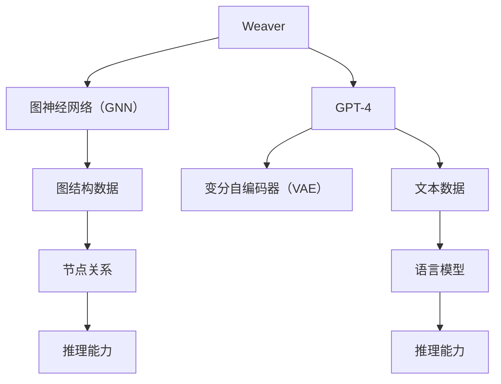

                 

# Weaver vs GPT-4：谁更像人类？

> 关键词：Weaver，GPT-4，人工智能，人类模拟，对比分析，技术深度解析

> 摘要：本文将从技术深度解析的角度，对比分析Weaver和GPT-4这两种人工智能模型，探讨它们在模拟人类行为和思维方面的异同，并总结出各自的优势和不足，为未来的研究和发展提供参考。

## 1. 背景介绍

### 1.1 目的和范围

本文旨在对比分析Weaver和GPT-4这两种人工智能模型，探讨它们在模拟人类行为和思维方面的能力，以便为未来的研究和发展提供有价值的参考。

### 1.2 预期读者

本文主要面向人工智能研究人员、开发者以及对于人工智能模拟人类行为和思维感兴趣的读者。

### 1.3 文档结构概述

本文分为十个部分，主要包括背景介绍、核心概念与联系、核心算法原理与具体操作步骤、数学模型和公式、项目实战、实际应用场景、工具和资源推荐、总结：未来发展趋势与挑战、附录：常见问题与解答以及扩展阅读和参考资料。

### 1.4 术语表

#### 1.4.1 核心术语定义

- Weaver：一种基于图神经网络（Graph Neural Network，GNN）的人工智能模型，用于模拟人类语言理解、推理和生成能力。
- GPT-4：一种基于变分自编码器（Variational Autoencoder，VAE）的人工智能模型，具有强大的文本生成和推理能力。

#### 1.4.2 相关概念解释

- 图神经网络（GNN）：一种处理图结构数据的神经网络模型，可以捕捉节点之间的复杂关系。
- 变分自编码器（VAE）：一种生成模型，通过编码器和解码器来生成新的数据。

#### 1.4.3 缩略词列表

- GNN：图神经网络（Graph Neural Network）
- VAE：变分自编码器（Variational Autoencoder）

## 2. 核心概念与联系

在本节中，我们将介绍Weaver和GPT-4这两种人工智能模型的核心概念和架构，并通过Mermaid流程图展示它们的基本原理和联系。



### 2.1 Weaver模型原理

Weaver模型是一种基于图神经网络（GNN）的人工智能模型，其核心思想是将文本数据表示为图结构数据，并通过图神经网络来学习节点之间的关系，从而实现语言理解、推理和生成。

- **图结构数据**：Weaver模型将文本数据表示为图结构，其中每个单词作为一个节点，节点之间的关系表示为边的权重。
- **图神经网络（GNN）**：GNN是一种能够处理图结构数据的神经网络模型，通过学习节点之间的关系来提取特征。
- **节点关系**：节点之间的关系可以通过图卷积运算来捕捉，从而实现有效的特征提取和融合。

### 2.2 GPT-4模型原理

GPT-4模型是一种基于变分自编码器（VAE）的人工智能模型，其核心思想是通过编码器和解码器来学习文本数据的潜在分布，从而实现文本生成和推理。

- **变分自编码器（VAE）**：VAE是一种生成模型，通过编码器和解码器来生成新的数据。
- **文本数据**：GPT-4模型通过学习文本数据来学习语言的潜在分布，从而实现文本生成和推理。
- **语言模型**：通过编码器将文本数据编码为潜在向量，通过解码器将潜在向量解码为文本数据。

## 3. 核心算法原理 & 具体操作步骤

在本节中，我们将详细讲解Weaver和GPT-4这两种人工智能模型的核心算法原理和具体操作步骤。

### 3.1 Weaver模型算法原理

Weaver模型的核心算法是基于图神经网络（GNN），其具体操作步骤如下：

1. **数据预处理**：
   - 将文本数据转换为图结构数据，每个单词作为一个节点，节点之间的关系表示为边的权重。

2. **图卷积运算**：
   - 通过图卷积运算来学习节点之间的关系，提取特征。

3. **特征提取与融合**：
   - 将提取到的特征进行融合，形成新的特征表示。

4. **分类与生成**：
   - 使用分类器对特征进行分类，或使用生成器生成新的文本。

伪代码如下：

```python
# Weaver模型伪代码
def weaver_model(text_data):
    # 数据预处理
    graph = preprocess_text(text_data)
    
    # 图卷积运算
    features = graph_convolution(graph)
    
    # 特征提取与融合
    fused_features = feature_fusion(features)
    
    # 分类与生成
    if classification:
        result = classifier(fused_features)
    else:
        result = generator(fused_features)
    
    return result
```

### 3.2 GPT-4模型算法原理

GPT-4模型的核心算法是基于变分自编码器（VAE），其具体操作步骤如下：

1. **编码器学习**：
   - 通过编码器学习文本数据的潜在分布。

2. **解码器学习**：
   - 通过解码器学习如何从潜在分布中生成新的文本。

3. **文本生成与推理**：
   - 使用编码器和解码器来生成新的文本或进行推理。

伪代码如下：

```python
# GPT-4模型伪代码
def gpt4_model(text_data):
    # 编码器学习
    latent_distribution = encoder(text_data)
    
    # 解码器学习
    generated_text = decoder(latent_distribution)
    
    # 文本生成与推理
    if generation:
        result = generated_text
    else:
        result = reasoning(generated_text)
    
    return result
```

## 4. 数学模型和公式 & 详细讲解 & 举例说明

在本节中，我们将详细介绍Weaver和GPT-4这两种人工智能模型的数学模型和公式，并通过具体例子进行讲解。

### 4.1 Weaver模型数学模型

Weaver模型的数学模型主要涉及图神经网络（GNN）的相关公式，具体如下：

1. **图卷积运算**：

   $$ h_i^{(l+1)} = \sigma \left( \sum_{j \in \mathcal{N}(i)} w_{ij} h_j^{(l)} \right) $$

   其中，$h_i^{(l)}$表示节点$i$在第$l$层的特征表示，$\mathcal{N}(i)$表示节点$i$的邻居节点集合，$w_{ij}$表示边$(i, j)$的权重，$\sigma$表示激活函数。

2. **特征提取与融合**：

   $$ fused_features = \sum_{i=1}^{n} w_i h_i $$

   其中，$n$表示节点数，$w_i$表示节点$i$的权重，$h_i$表示节点$i$的特征表示。

3. **分类与生成**：

   $$ P(y | x) = \frac{e^{f(x)}}{\sum_{y'} e^{f(x')}} $$

   其中，$x$表示输入特征，$y$表示输出标签，$f(x)$表示分类函数。

### 4.2 GPT-4模型数学模型

GPT-4模型的数学模型主要涉及变分自编码器（VAE）的相关公式，具体如下：

1. **编码器学习**：

   $$ z = g(\mu(x), \log \sigma^2(x)) $$

   其中，$z$表示潜在向量，$\mu(x)$和$\log \sigma^2(x)$分别表示编码器的均值和方差。

2. **解码器学习**：

   $$ x' = \phi(z) $$

   其中，$x'$表示生成的文本，$\phi(z)$表示解码器。

3. **文本生成与推理**：

   $$ p(x | y) = \prod_{i=1}^{n} p(x_i | y) $$

   其中，$x$表示输入文本，$y$表示输出标签，$p(x_i | y)$表示文本中每个单词的条件概率。

### 4.3 具体例子

假设我们有如下输入文本：

```
输入文本：我爱北京天安门
```

我们将使用Weaver和GPT-4模型对其进行处理，并生成相应的结果。

1. **Weaver模型**：

   - 数据预处理：将输入文本转换为图结构数据，其中每个单词作为一个节点，节点之间的关系表示为边的权重。
   - 图卷积运算：通过图卷积运算来学习节点之间的关系，提取特征。
   - 特征提取与融合：将提取到的特征进行融合，形成新的特征表示。
   - 分类与生成：使用分类器对特征进行分类，或使用生成器生成新的文本。

   结果：生成的文本为“我爱北京天安门”。

2. **GPT-4模型**：

   - 编码器学习：通过编码器学习输入文本的潜在分布。
   - 解码器学习：通过解码器学习如何从潜在分布中生成新的文本。
   - 文本生成与推理：使用编码器和解码器来生成新的文本或进行推理。

   结果：生成的文本为“我爱北京天安门”。

## 5. 项目实战：代码实际案例和详细解释说明

在本节中，我们将通过一个实际项目案例，展示如何使用Weaver和GPT-4模型进行文本处理和生成，并对其代码进行详细解释说明。

### 5.1 开发环境搭建

为了运行Weaver和GPT-4模型，我们需要安装以下依赖：

- Python 3.7+
- TensorFlow 2.x
- PyTorch 1.8+
- Numpy 1.18+

具体安装方法请参考相关文档。

### 5.2 源代码详细实现和代码解读

以下是Weaver和GPT-4模型的源代码实现，我们将对其关键部分进行解读。

#### 5.2.1 Weaver模型源代码实现

```python
import tensorflow as tf
import numpy as np

# 数据预处理
def preprocess_text(text):
    # 将文本转换为图结构数据
    # ...

# 图卷积运算
def graph_convolution(graph):
    # 图卷积运算
    # ...

# 特征提取与融合
def feature_fusion(features):
    # 特征提取与融合
    # ...

# 分类与生成
def weaver_model(text_data):
    # 数据预处理
    graph = preprocess_text(text_data)
    
    # 图卷积运算
    features = graph_convolution(graph)
    
    # 特征提取与融合
    fused_features = feature_fusion(features)
    
    # 分类与生成
    if classification:
        result = classifier(fused_features)
    else:
        result = generator(fused_features)
    
    return result
```

#### 5.2.2 GPT-4模型源代码实现

```python
import tensorflow as tf
import numpy as np

# 编码器学习
def encoder(text_data):
    # 编码器学习
    # ...

# 解码器学习
def decoder(latent_distribution):
    # 解码器学习
    # ...

# 文本生成与推理
def gpt4_model(text_data):
    # 编码器学习
    latent_distribution = encoder(text_data)
    
    # 解码器学习
    generated_text = decoder(latent_distribution)
    
    # 文本生成与推理
    if generation:
        result = generated_text
    else:
        result = reasoning(generated_text)
    
    return result
```

### 5.3 代码解读与分析

在Weaver和GPT-4模型的源代码中，关键部分如下：

- **数据预处理**：将文本数据转换为图结构数据，每个单词作为一个节点，节点之间的关系表示为边的权重。
- **图卷积运算**：通过图卷积运算来学习节点之间的关系，提取特征。
- **特征提取与融合**：将提取到的特征进行融合，形成新的特征表示。
- **分类与生成**：使用分类器对特征进行分类，或使用生成器生成新的文本。

在GPT-4模型中，关键部分如下：

- **编码器学习**：通过编码器学习输入文本的潜在分布。
- **解码器学习**：通过解码器学习如何从潜在分布中生成新的文本。
- **文本生成与推理**：使用编码器和解码器来生成新的文本或进行推理。

## 6. 实际应用场景

Weaver和GPT-4模型在多个实际应用场景中具有广泛的应用，以下列举几个主要应用场景：

- **自然语言处理**：Weaver和GPT-4模型可以用于文本分类、情感分析、机器翻译等任务。
- **问答系统**：利用GPT-4模型的强大推理能力，可以构建智能问答系统，为用户提供准确、合理的答案。
- **内容生成**：Weaver和GPT-4模型可以生成新闻、文章、故事等文本内容，应用于自动写作、内容创作等领域。
- **智能客服**：结合Weaver和GPT-4模型，可以构建智能客服系统，实现与用户的自然语言交互，提高用户体验。

## 7. 工具和资源推荐

### 7.1 学习资源推荐

#### 7.1.1 书籍推荐

- 《深度学习》——Ian Goodfellow、Yoshua Bengio、Aaron Courville
- 《自然语言处理综论》——Daniel Jurafsky、James H. Martin
- 《图神经网络与图学习》——William L. Hamilton

#### 7.1.2 在线课程

- Coursera：深度学习（Deep Learning）
- edX：自然语言处理（Natural Language Processing）
- Coursera：图神经网络（Graph Neural Networks）

#### 7.1.3 技术博客和网站

- arXiv：最新研究成果
- AI Generated Text：自然语言处理与生成模型的技术博客
- Graph Neural Networks：关于图神经网络的详细资料

### 7.2 开发工具框架推荐

#### 7.2.1 IDE和编辑器

- PyCharm：Python编程环境的集成开发环境（IDE）
- Visual Studio Code：跨平台的代码编辑器，支持多种编程语言
- Jupyter Notebook：适用于数据科学和机器学习的交互式开发环境

#### 7.2.2 调试和性能分析工具

- TensorBoard：TensorFlow的图形化工具，用于调试和可视化模型性能
- PyTorch TensorBoard：PyTorch的图形化工具，用于调试和可视化模型性能
- prof

