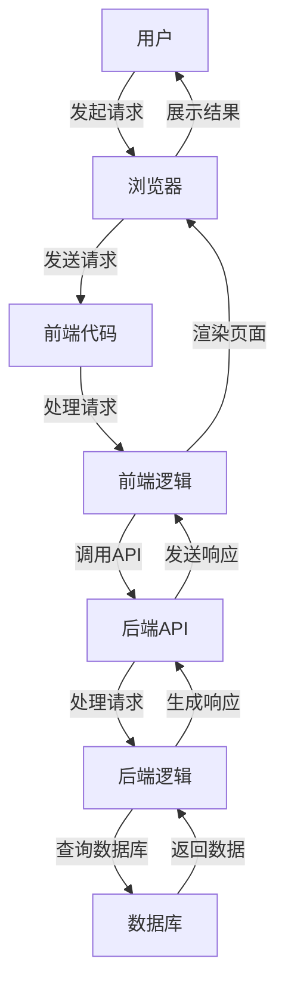

                 

### 1. 背景介绍

#### 1.1 目的和范围

本文的目的是深入探讨Web应用程序开发的前端和后端技术，帮助读者全面理解这两大领域的核心概念、工作原理以及它们之间的紧密联系。Web应用程序开发已经成为信息技术领域的重要组成部分，其重要性日益凸显。本文将围绕以下几个核心问题展开讨论：

1. **Web应用程序的基本结构是什么？**
2. **前端和后端分别承担哪些功能？**
3. **如何实现前端与后端的通信？**
4. **当前流行的前端和后端技术有哪些？**
5. **Web应用程序开发面临的主要挑战是什么？**

通过本文的详细解读，读者将能够：

- 清晰地了解前端和后端的技术架构；
- 掌握前端与后端通信的基本原理和技巧；
- 熟悉当前主流的前端和后端技术栈；
- 对Web应用程序开发的前景和挑战有深刻的认识。

本文将基于最新的技术和最佳实践，以逻辑清晰、结构紧凑、简单易懂的方式，逐步引导读者深入探讨Web应用程序开发的各个方面。无论您是初学者还是有一定经验的技术人员，本文都将为您提供有价值的见解和实用指导。

#### 1.2 预期读者

本文面向以下几类读者：

1. **初学者**：对于刚刚接触Web应用程序开发的新手，本文将提供系统的入门指导，帮助您快速掌握前端和后端的基础知识。
2. **中级开发者**：如果您已经具备一定的前端和后端开发经验，但希望对技术有更深入的理解，本文将为您揭示更多技术细节和实践经验。
3. **高级工程师和架构师**：本文将探讨一些高级主题，如高性能Web应用程序设计、安全性、微服务架构等，适合希望提升技术水平的专业人士。
4. **教育工作者和科研人员**：本文不仅适用于技术实践者，也适合作为大学课程或研究项目的参考资料。

无论您的背景如何，本文都将为您提供有价值的信息，帮助您在Web应用程序开发领域取得更大的进步。

#### 1.3 文档结构概述

本文将采用逻辑清晰、结构紧凑的方式，帮助读者全面掌握Web应用程序开发的相关知识。全文分为十个主要部分，如下所示：

1. **背景介绍**：介绍本文的目的、预期读者、文档结构和核心术语。
2. **核心概念与联系**：通过Mermaid流程图展示前端和后端的基本架构。
3. **核心算法原理 & 具体操作步骤**：详细讲解前端和后端的核心算法和操作步骤。
4. **数学模型和公式 & 详细讲解 & 举例说明**：引入数学模型和公式，对关键技术进行深入分析。
5. **项目实战：代码实际案例和详细解释说明**：通过实际项目案例，展示前端和后端的实现过程。
6. **实际应用场景**：讨论Web应用程序在不同场景下的应用。
7. **工具和资源推荐**：推荐学习资源和开发工具。
8. **总结：未来发展趋势与挑战**：总结本文的主要观点，探讨未来的发展趋势和面临的挑战。
9. **附录：常见问题与解答**：回答读者可能遇到的一些常见问题。
10. **扩展阅读 & 参考资料**：提供进一步学习的资源。

通过上述结构，本文将帮助读者系统、全面地理解Web应用程序开发的前端和后端技术，为实践和进一步学习打下坚实基础。

#### 1.4 术语表

在本篇文章中，我们将使用一些专业的术语和概念。以下是这些术语的定义和解释：

##### 1.4.1 核心术语定义

- **Web应用程序（Web Application）**：Web应用程序是一种通过Web浏览器访问的应用程序。它结合了前端（用户界面）和后端（服务器端逻辑），以提供功能丰富的网络服务。
- **前端（Front-end）**：前端是指用户可以直接交互的用户界面部分，通常由HTML、CSS和JavaScript等前端技术构建。
- **后端（Back-end）**：后端是指服务器端的应用程序逻辑、数据库操作和数据存储等。它通常使用服务器端编程语言如Python、Java、Ruby等。
- **单页面应用程序（Single Page Application, SPA）**：SPA是一种Web应用程序模型，它通过动态加载内容来减少页面重载。常见的SPA框架有React、Vue.js和Angular等。
- **前后端分离（Front-end and Back-end Separation）**：前后端分离是指将前端和后端的开发、部署和维护分开进行，以提高开发效率和代码的可维护性。

##### 1.4.2 相关概念解释

- **API（Application Programming Interface）**：API是一套协议、工具和定义，用于允许不同的软件之间进行通信。在Web应用程序中，API通常用于前后端之间的数据交换。
- **REST（Representational State Transfer）**：REST是一种软件架构风格，用于指导如何设计和实现网络服务。它通过HTTP协议的GET、POST、PUT、DELETE等HTTP方法来实现资源的创建、读取、更新和删除。
- **数据库（Database）**：数据库是用于存储、管理和访问数据的系统。常见的数据库类型有关系型数据库（如MySQL、PostgreSQL）和非关系型数据库（如MongoDB、Cassandra）。

##### 1.4.3 缩略词列表

- **SPA（Single Page Application）**：单页面应用程序
- **API（Application Programming Interface）**：应用程序编程接口
- **REST（Representational State Transfer）**：表现层状态转移
- **HTML（HyperText Markup Language）**：超文本标记语言
- **CSS（Cascading Style Sheets）**：层叠样式表
- **JavaScript**：一种脚本语言，广泛用于前端开发
- **SQL（Structured Query Language）**：结构化查询语言，用于数据库操作

通过对上述术语和概念的理解，读者将能够更好地把握Web应用程序开发的核心内容。在接下来的章节中，我们将逐步深入探讨这些概念，并提供具体的实现方法和实践案例。

### 2. 核心概念与联系

Web应用程序的核心在于其前端和后端的紧密协作。为了更好地理解这两部分的关系，我们可以通过Mermaid流程图来展示前端和后端的基本架构及其相互作用。以下是核心概念和联系的大致流程：



在这个流程图中，用户通过浏览器发起请求，前端代码接收并处理这些请求。前端逻辑负责调用后端的API，后端API则由后端逻辑处理，并查询数据库以获取所需数据。最后，生成的响应被返回到前端，并在浏览器中渲染，展示给用户。

以下是对图中各个节点的详细解释：

- **A[用户]**：用户是Web应用程序的使用者，通过浏览器发起各种请求。
- **B[浏览器]**：用户通过浏览器访问Web应用程序，浏览器负责发送HTTP请求。
- **C[前端代码]**：前端代码包括HTML、CSS和JavaScript等，负责构建用户界面。
- **D[前端逻辑]**：前端逻辑通常使用JavaScript处理用户的交互操作，并调用后端API。
- **E[后端API]**：后端API是前端和后端交互的接口，通过REST或其他协议进行数据交换。
- **F[后端逻辑]**：后端逻辑包括服务器端代码，处理来自前端API的请求，并进行业务逻辑处理。
- **G[数据库]**：数据库用于存储应用程序的数据，后端逻辑常常会查询或更新数据库。

通过这个流程图，我们可以清晰地看到前端和后端在Web应用程序中的作用和交互方式。前端主要负责用户界面和交互逻辑，而后端则负责业务逻辑处理和数据存储。接下来，我们将详细探讨前端和后端的实现原理和具体操作步骤。

#### 2.1 前端实现原理

前端实现是Web应用程序开发中的关键部分，它直接影响用户体验。前端主要由HTML、CSS和JavaScript三种技术组成，每种技术都有其独特的功能和作用。

##### HTML（HyperText Markup Language）

HTML是Web页面的结构语言，负责定义页面的内容和布局。通过使用HTML标签，开发者可以创建文本、图像、视频等多种内容，并将其组织成有意义的结构。以下是使用HTML创建一个简单网页的示例：

```html
<!DOCTYPE html>
<html>
<head>
  <title>我的第一个Web页面</title>
</head>
<body>
  <h1>欢迎来到我的网站</h1>
  <p>这是一个段落。</p>
  
</body>
</html>
```

在这个示例中，`<!DOCTYPE html>` 声明定义了文档类型，`<html>` 标签定义了整个页面，`<head>` 标签包含页面的标题和元数据，而 `<body>` 标签则包含了页面的主要内容，如标题、段落和图像。

##### CSS（Cascading Style Sheets）

CSS用于定义HTML元素的样式，如颜色、字体、大小和布局等。通过使用CSS，开发者可以美化网页，使其更具吸引力。以下是一个简单的CSS示例，用于设置HTML页面的样式：

```css
body {
  font-family: Arial, sans-serif;
  background-color: #f0f0f0;
}

h1 {
  color: #333;
  text-align: center;
}

p {
  font-size: 16px;
  color: #666;
}
```

在这个示例中，`body` 选择器设置了整个页面的样式，如字体和背景色。`h1` 选择器定义了标题的样式，而 `p` 选择器则设置了段落的样式。通过将CSS代码保存在 `.css` 文件中，并链接到HTML页面，开发者可以方便地管理和更新样式。

##### JavaScript

JavaScript是一种脚本语言，用于增强Web页面的交互性和动态性。通过JavaScript，开发者可以在不重新加载页面的情况下，动态地修改页面内容、处理用户输入和响应事件。以下是一个简单的JavaScript示例，用于向页面添加一个点击事件：

```javascript
function showAlert() {
  alert('您点击了按钮！');
}

document.getElementById('myButton').addEventListener('click', showAlert);
```

在这个示例中，`showAlert` 函数显示一个警告框，而 `addEventListener` 方法用于监听按钮的点击事件，并在点击时调用 `showAlert` 函数。

##### 前端框架

随着Web应用程序的复杂度增加，前端开发逐渐依赖于各种框架和库，以提高开发效率和维护性。以下是几种常用的前端框架：

1. **React（由Facebook开发）**：React是一个用于构建用户界面的JavaScript库。它采用虚拟DOM机制，可以高效地更新和渲染页面。React的主要优势在于其组件化设计和单向数据流，这使得代码更加模块化和可维护。
2. **Vue.js（由Evan You开发）**：Vue.js是一个渐进式JavaScript框架，易于上手且灵活。它提供了核心库和一系列的生态工具，支持组件化开发、响应式数据和虚拟DOM。Vue.js广泛应用于中小型项目和单页面应用程序。
3. **Angular（由Google开发）**：Angular是一个强大的TypeScript框架，用于构建大型单页面应用程序。它提供了完整的开发工具和丰富的特性，如数据绑定、依赖注入、组件和指令等。Angular适合需要高度可维护性和复杂逻辑的项目。

通过了解和掌握HTML、CSS和JavaScript，以及熟悉常用的前端框架，开发者可以高效地构建功能丰富、用户体验良好的Web应用程序。

#### 2.2 后端实现原理

后端实现是Web应用程序的重要组成部分，负责处理业务逻辑、数据存储和与前端交互。后端开发通常使用服务器端编程语言和框架来实现，如Python、Java、Ruby和Node.js等。以下将详细探讨后端实现原理，包括服务器端编程语言、框架和数据库选择。

##### 服务器端编程语言

1. **Python**：Python是一种高级编程语言，以其简洁明了的语法和丰富的库支持而广受欢迎。Django和Flask是两种流行的Python Web框架，适用于快速开发和大型项目。
2. **Java**：Java是一种强类型的编程语言，具有跨平台的特性。Java Web开发常用的框架有Spring、Spring Boot和Java EE。Java以其稳定性和高性能在大型企业级应用中占据重要地位。
3. **Ruby**：Ruby是一种动态编程语言，以其优雅的语法和强大的Ruby on Rails框架而著称。Rails支持MVC（模型-视图-控制器）架构，适用于快速开发和迭代。
4. **Node.js**：Node.js是一种基于Chrome V8引擎的JavaScript运行时环境，适用于构建高性能、事件驱动的Web应用程序。Express是Node.js的一个流行的Web框架。

##### 后端框架

1. **Django**：Django是一个高级的Python Web框架，采用MVC架构，提供了许多内置功能，如ORM（对象关系映射）、用户认证和后台管理。Django适用于快速开发和大型项目。
2. **Flask**：Flask是一个轻量级的Python Web框架，非常适合小型项目和原型开发。Flask没有强加任何特定的设计模式，开发者可以根据项目需求自由选择。
3. **Spring**：Spring是一个强大的Java Web框架，提供了全面的编程和配置模型。Spring Boot简化了Spring应用程序的配置，适用于大型企业级项目。
4. **Ruby on Rails**：Rails是一个基于Ruby的MVC框架，以其优雅的语法和高效的开发流程而著名。Rails支持RESTful API和模型-视图-控制器架构，适用于快速开发和迭代。
5. **Express**：Express是一个流行的Node.js Web框架，以其灵活性和轻量级而受到开发者的喜爱。Express提供了许多中间件，可以轻松地构建复杂的Web应用程序。

##### 数据库选择

数据库用于存储和管理Web应用程序的数据。根据应用需求，可以选择关系型数据库（如MySQL、PostgreSQL）或非关系型数据库（如MongoDB、Cassandra）。

1. **关系型数据库**：关系型数据库（RDBMS）采用SQL语言进行数据查询和管理。常见的RDBMS有MySQL、PostgreSQL和SQLite。RDBMS适用于结构化数据存储，如订单、用户信息和日志等。
2. **非关系型数据库**：非关系型数据库（NoSQL）适用于处理大规模的分布式数据，支持灵活的数据模型。常见的NoSQL数据库有MongoDB、Cassandra和Redis。NoSQL数据库适用于大规模数据存储和实时查询，如社交网络和实时分析。

通过选择合适的服务器端编程语言、框架和数据库，开发者可以构建高效、稳定和可扩展的Web应用程序。在接下来的章节中，我们将详细讨论核心算法原理、数学模型和项目实战，帮助读者进一步理解和应用这些技术。

#### 2.3 核心算法原理 & 具体操作步骤

在前端和后端的技术实现中，核心算法原理是确保系统高效、稳定运行的关键。以下将详细讲解一些常见的前端和后端核心算法，并使用伪代码进行阐述。

##### 2.3.1 前端核心算法

1. **排序算法**：前端经常需要对数据进行排序，以提供更友好的用户体验。常见的排序算法包括冒泡排序、选择排序和快速排序。以下是快速排序的伪代码：

```pseudo
function quickSort(arr):
    if length(arr) <= 1:
        return arr
    
    pivot = arr[0]
    left = []
    right = []
    
    for i from 1 to length(arr):
        if arr[i] < pivot:
            left.append(arr[i])
        else:
            right.append(arr[i])
    
    return quickSort(left) + [pivot] + quickSort(right)
```

2. **搜索算法**：前端可能需要快速定位特定元素，二分搜索算法是一种有效的搜索方法。以下是二分搜索的伪代码：

```pseudo
function binarySearch(arr, target):
    low = 0
    high = length(arr) - 1
    
    while low <= high:
        mid = (low + high) / 2
        
        if arr[mid] == target:
            return mid
        elif arr[mid] < target:
            low = mid + 1
        else:
            high = mid - 1
            
    return -1
```

##### 2.3.2 后端核心算法

1. **加密算法**：在处理用户数据时，加密算法是保护数据安全的关键。常见的加密算法有SHA-256、AES等。以下是SHA-256的伪代码：

```pseudo
function SHA256(message):
    // 初始化哈希值
    hash = initialHashValue
    
    // 分块处理消息
    for each block in message:
        // 执行SHA-256核心算法
        hash = sha256CoreAlgorithm(block, hash)
        
    // 生成最终哈希值
    finalHash = finalizeHash(hash)
    
    return finalHash
```

2. **缓存算法**：后端系统常使用缓存来提高性能，缓存算法如LRU（Least Recently Used）和LFU（Least Frequently Used）是常见的选择。以下是LRU的伪代码：

```pseudo
class LRUCache:
    capacity = 0
    cache = []
    
    function get(key):
        if key not in cache:
            return -1
        remove key from cache
        add key to the end of cache
        return value of key in cache
    
    function put(key, value):
        if key in cache:
            remove key from cache
        add key-value pair to the end of cache
        if length(cache) > capacity:
            remove the first key-value pair from cache
```

通过掌握这些核心算法，开发者可以优化Web应用程序的性能和安全性。接下来，我们将探讨数学模型和公式，进一步深化对相关技术原理的理解。

#### 4. 数学模型和公式 & 详细讲解 & 举例说明

在Web应用程序开发中，数学模型和公式是解决实际问题的重要工具。这些模型可以帮助我们优化性能、确保数据安全，并提升用户体验。以下是一些关键的数学模型和公式，以及它们的详细讲解和举例说明。

##### 4.1 线性回归模型

线性回归模型用于预测连续数值数据。其基本公式为：

$$ y = w_0 + w_1 \cdot x_1 + w_2 \cdot x_2 + ... + w_n \cdot x_n $$

其中，\( y \) 是预测值，\( w_0, w_1, ..., w_n \) 是权重，\( x_1, x_2, ..., x_n \) 是特征值。

**示例：** 假设我们想预测某个网站的用户访问量，根据历史数据，发现用户访问量与页面加载时间之间存在线性关系。特征值 \( x_1 \) 是页面加载时间（秒），权重 \( w_1 \) 是斜率，代表每秒用户访问量减少的数量。

通过训练数据集，我们可以计算出权重：

$$ w_1 = \frac{\sum_{i=1}^{n} (y_i - \hat{y}_i) \cdot x_i}{\sum_{i=1}^{n} (x_i - \bar{x})^2} $$

其中，\( y_i \) 是实际访问量，\( \hat{y}_i \) 是预测访问量，\( \bar{x} \) 是特征值的均值。

通过上述公式，我们可以计算页面加载时间对应的用户访问量预测值。例如，如果页面加载时间为5秒，那么预测访问量为：

$$ y = w_0 + w_1 \cdot 5 $$

##### 4.2 概率论中的贝叶斯定理

贝叶斯定理用于计算后验概率，在数据分析和机器学习中广泛应用。其基本公式为：

$$ P(A|B) = \frac{P(B|A) \cdot P(A)}{P(B)} $$

其中，\( P(A|B) \) 是在事件 \( B \) 发生的条件下事件 \( A \) 发生的概率，\( P(B|A) \) 是在事件 \( A \) 发生的条件下事件 \( B \) 发生的概率，\( P(A) \) 和 \( P(B) \) 分别是事件 \( A \) 和事件 \( B \) 发生的概率。

**示例：** 假设我们要判断一个用户是否为高价值客户，已知条件概率如下：

- \( P(\text{高价值客户}| \text{购买过高端产品}) = 0.8 \)
- \( P(\text{购买过高端产品}| \text{高价值客户}) = 0.6 \)
- \( P(\text{购买过高端产品}) = 0.2 \)

我们可以计算出后验概率：

$$ P(\text{高价值客户}) = \frac{P(\text{购买过高端产品}| \text{高价值客户}) \cdot P(\text{高价值客户})}{P(\text{购买过高端产品})} = \frac{0.6 \cdot 0.2}{0.2} = 0.6 $$

因此，该用户是高价值客户的概率为60%。

##### 4.3 决策树模型

决策树模型是一种用于分类和回归的监督学习算法。其基本公式为：

$$ \text{分类/回归值} = \sum_{i=1}^{n} \left( w_i \cdot \text{特征值} \right) + b $$

其中，\( w_i \) 是权重，\( b \) 是偏置，\( \text{特征值} \) 是输入特征。

**示例：** 假设我们使用决策树模型来预测客户的信用评分，特征包括收入、负债比率和信用历史。权重和偏置通过训练数据集计算得出。

通过决策树模型，我们可以为每个客户计算一个评分。例如，如果一个客户的收入为10万元，负债比率为0.3，信用历史良好，我们可以计算出其信用评分：

$$ \text{评分} = w_1 \cdot 10 + w_2 \cdot 0.3 + w_3 \cdot \text{信用历史评分} + b $$

通过上述公式，我们可以对客户进行分类，从而更好地进行风险管理。

通过掌握这些数学模型和公式，开发者可以在Web应用程序开发中实现更智能、更高效的功能。在实际项目中，这些模型可以根据具体需求进行调整和优化，以实现最佳效果。

#### 5. 项目实战：代码实际案例和详细解释说明

在深入理解了前端和后端的核心概念、算法原理及数学模型后，接下来我们将通过一个实际项目案例，展示前端和后端的开发流程、关键代码实现以及各个部分的详细解释。这个案例将模拟一个简单的博客系统，用户可以在前端查看和发表博客文章，后端则负责数据存储和管理。

##### 5.1 开发环境搭建

为了更好地进行开发，我们需要搭建一个合适的技术栈。以下是搭建开发环境的步骤：

1. **前端开发环境**：
    - **工具**：Node.js、npm、Visual Studio Code
    - **框架**：Vue.js、Axios（用于HTTP请求）
    - **样式**：Bootstrap（用于UI布局）

2. **后端开发环境**：
    - **工具**：Python、pip、VS Code（可选）
    - **框架**：Flask
    - **数据库**：SQLite（可选），我们也可以使用其他关系型数据库如MySQL或PostgreSQL

3. **环境配置**：
    - 安装Node.js和npm：`npm install -g npm`
    - 安装Vue CLI：`npm install -g @vue/cli`
    - 安装Flask：`pip install flask`
    - 创建Vue项目：`vue create blog-front-end`
    - 创建Flask项目：`mkdir blog-back-end; cd blog-back-end; touch app.py`

##### 5.2 源代码详细实现和代码解读

##### 前端代码实现

**1. 项目结构**：

```
blog-front-end/
|-- public/
|   |-- index.html
|   |-- styles.css
|-- src/
|   |-- components/
|   |   |-- BlogList.vue
|   |   |-- BlogPost.vue
|   |-- App.vue
|   |-- main.js
```

**2. 关键代码解读**：

**`src/App.vue`**：这是整个前端应用程序的入口组件，它负责渲染页面和导航。

```vue
<template>
  <div id="app">
    <nav>
      <!-- 导航栏组件 -->
    </nav>
    <router-view />
  </div>
</template>

<script>
import BlogList from './components/BlogList.vue';

export default {
  name: 'App',
  components: {
    BlogList
  }
};
</script>
```

**`src/components/BlogList.vue`**：这个组件负责展示博客列表。

```vue
<template>
  <div>
    <div v-for="post in posts" :key="post.id">
      <h2>{{ post.title }}</h2>
      <p>{{ post.summary }}</p>
      <button @click="loadPost(post.id)">阅读全文</button>
    </div>
  </div>
</template>

<script>
import axios from 'axios';

export default {
  data() {
    return {
      posts: []
    };
  },
  created() {
    this.fetchPosts();
  },
  methods: {
    fetchPosts() {
      axios.get('/api/blogs')
        .then(response => {
          this.posts = response.data;
        })
        .catch(error => {
          console.error('无法获取博客列表：', error);
        });
    },
    loadPost(id) {
      this.$router.push({ name: 'BlogPost', params: { id } });
    }
  }
};
</script>
```

**后端代码实现**

**1. 项目结构**：

```
blog-back-end/
|-- app.py
|-- models.py
|-- requirements.txt
```

**2. 关键代码解读**：

**`app.py`**：这是后端应用程序的入口文件，使用Flask框架实现。

```python
from flask import Flask, request, jsonify
from models import Blog

app = Flask(__name__)

@app.route('/api/blogs', methods=['GET'])
def get_blogs():
    return jsonify([blog.to_dict() for blog in Blog.select_all()])

@app.route('/api/blogs/<int:blog_id>', methods=['GET'])
def get_blog(blog_id):
    blog = Blog.select_by_id(blog_id)
    if blog:
        return jsonify(blog.to_dict())
    else:
        return jsonify({'error': '博客不存在'}), 404

@app.route('/api/blogs', methods=['POST'])
def create_blog():
    data = request.get_json()
    blog = Blog.create(data)
    return jsonify(blog.to_dict()), 201

@app.route('/api/blogs/<int:blog_id>', methods=['PUT'])
def update_blog(blog_id):
    data = request.get_json()
    blog = Blog.update_by_id(blog_id, data)
    if blog:
        return jsonify(blog.to_dict())
    else:
        return jsonify({'error': '博客不存在'}), 404

@app.route('/api/blogs/<int:blog_id>', methods=['DELETE'])
def delete_blog(blog_id):
    if Blog.delete_by_id(blog_id):
        return jsonify({'success': '博客删除成功'})
    else:
        return jsonify({'error': '博客不存在'}), 404

if __name__ == '__main__':
    app.run(debug=True)
```

**`models.py`**：这个文件定义了博客模型和数据库操作。

```python
import sqlite3

class Blog:
    def __init__(self, id, title, summary, content):
        self.id = id
        self.title = title
        self.summary = summary
        self.content = content

    @staticmethod
    def connect_db():
        conn = sqlite3.connect('blog.db')
        cursor = conn.cursor()
        cursor.execute('''CREATE TABLE IF NOT EXISTS blogs
                          (id INTEGER PRIMARY KEY AUTOINCREMENT,
                          title TEXT,
                          summary TEXT,
                          content TEXT)''')
        conn.commit()
        return conn

    @staticmethod
    def select_all():
        conn = Blog.connect_db()
        cursor = conn.cursor()
        cursor.execute('SELECT * FROM blogs')
        rows = cursor.fetchall()
        blogs = [Blog(*row) for row in rows]
        conn.close()
        return blogs

    @staticmethod
    def select_by_id(id):
        conn = Blog.connect_db()
        cursor = conn.cursor()
        cursor.execute('SELECT * FROM blogs WHERE id = ?', (id,))
        row = cursor.fetchone()
        conn.close()
        if row:
            return Blog(*row)
        else:
            return None

    @staticmethod
    def create(data):
        conn = Blog.connect_db()
        cursor = conn.cursor()
        cursor.execute('INSERT INTO blogs (title, summary, content) VALUES (?, ?, ?)',
                       (data['title'], data['summary'], data['content']))
        conn.commit()
        last_id = cursor.lastrowid
        conn.close()
        return Blog(last_id, data['title'], data['summary'], data['content'])

    @staticmethod
    def update_by_id(id, data):
        conn = Blog.connect_db()
        cursor = conn.cursor()
        cursor.execute('UPDATE blogs SET title = ?, summary = ?, content = ? WHERE id = ?',
                       (data['title'], data['summary'], data['content'], id))
        conn.commit()
        affected_rows = cursor.rowcount
        conn.close()
        if affected_rows > 0:
            return Blog(id, data['title'], data['summary'], data['content'])
        else:
            return None

    def to_dict(self):
        return {
            'id': self.id,
            'title': self.title,
            'summary': self.summary,
            'content': self.content
        }
```

在上述代码中，前端通过Vue.js和Axios实现数据绑定和HTTP请求，后端使用Flask处理这些请求并操作SQLite数据库。我们定义了博客模型，实现了CRUD（创建、读取、更新、删除）操作，并通过API接口与前端进行数据交互。

##### 5.3 代码解读与分析

**前端代码解读**：

- **`App.vue`**：这是Vue应用程序的根组件，它负责定义全局路由和组件。
- **`BlogList.vue`**：这是一个列出所有博客文章的组件，它通过Axios从后端API获取数据，并渲染到页面上。

**后端代码解读**：

- **`app.py`**：这是Flask应用程序的入口文件，它定义了API路由和处理函数。通过`get_blogs`、`get_blog`、`create_blog`、`update_blog`和`delete_blog`函数，实现了对博客文章的CRUD操作。
- **`models.py`**：这个文件定义了博客模型，包括数据库连接和操作。`Blog`类提供了创建、读取、更新和删除博客文章的方法。

通过这个项目实战，我们可以看到前端和后端的紧密协作，以及如何通过API实现数据交互。在实际开发中，可以进一步优化代码、添加更多功能和安全措施，以满足更复杂的需求。

#### 6. 实际应用场景

Web应用程序在前端和后端的结合下，能够应对各种实际应用场景，从而满足不同的业务需求。以下是几个常见的应用场景，以及这些场景下前端和后端的具体实现方式。

##### 6.1 社交媒体平台

社交媒体平台是典型的Web应用程序，它结合了前端和后端技术，提供了用户互动、内容分享和实时通信等功能。在前端，使用Vue.js或React.js等框架构建单页面应用程序，可以提供流畅的用户体验。后端则使用Node.js或Django等框架处理用户请求、数据存储和实时消息推送。例如，在一个社交媒体平台上，用户可以：

- **发布内容**：前端通过表单收集用户输入，后端接收并存储到数据库。
- **浏览和互动**：前端动态加载数据，后端提供数据检索和更新服务。
- **实时聊天**：使用WebSocket技术实现实时消息通信，后端作为中间件处理消息的发送和接收。

##### 6.2 在线购物平台

在线购物平台是另一个广泛的Web应用程序应用场景。前端通常使用Vue.js、React或Angular等框架，构建用户友好的购物界面，提供商品浏览、购物车管理和支付等功能。后端使用Node.js、Java或Python等语言处理订单处理、库存管理和支付接口。具体实现方式包括：

- **商品展示**：前端通过API获取商品信息，后端从数据库检索数据并返回。
- **购物车管理**：前端维护用户购物车状态，后端处理购物车数据的存储和更新。
- **订单处理**：用户提交订单，前端将订单数据发送到后端，后端处理订单并生成支付链接。

##### 6.3 企业管理信息系统

企业管理信息系统（ERP）是针对企业内部管理的综合系统。前端通常使用Vue.js、React或Angular等框架，提供员工管理、项目管理、库存管理等模块的界面。后端使用Java、Python或.NET等语言，通过Spring、Django或ASP.NET Core等框架处理业务逻辑和数据存储。具体实现方式包括：

- **用户身份验证**：前端收集用户信息，后端进行身份验证和权限管理。
- **数据报表**：前端显示数据报表，后端通过查询数据库生成报表数据。
- **业务流程管理**：前端提供业务流程操作界面，后端处理流程逻辑和通知。

##### 6.4 教育和学习平台

教育和学习平台是结合了Web和移动端的综合应用。前端使用React或Vue.js等框架，提供课程内容展示、在线学习和作业提交等功能。后端使用Node.js、Java或Python等语言，通过Spring、Flask或Django等框架处理用户请求、内容管理和作业评分。具体实现方式包括：

- **课程内容展示**：前端通过API获取课程内容，后端从数据库检索并返回。
- **在线学习**：前端提供学习界面，后端处理学习进度和成绩记录。
- **作业提交和评分**：学生提交作业，教师通过后端系统进行作业评分和反馈。

通过以上实际应用场景，我们可以看到前端和后端的紧密协作如何实现各种复杂的功能和业务需求。在开发过程中，根据具体应用场景选择合适的前端和后端技术，可以显著提高开发效率和应用性能。

### 7. 工具和资源推荐

在Web应用程序开发过程中，选择合适的工具和资源是确保项目成功的关键。以下将介绍一些学习资源、开发工具和框架，以及相关论文著作，帮助开发者提高技能和项目质量。

#### 7.1 学习资源推荐

**7.1.1 书籍推荐**

1. **《JavaScript高级程序设计》**（第4版），由Casper WaitForIt编写。这本书是学习JavaScript的权威指南，涵盖了ES6及更高版本的新特性，适合中级开发者。
2. **《Fluent Python》**，由Luciano Ramalho著。这本书深入探讨了Python的高级编程技巧，适合希望提升Python技能的开发者。
3. **《深入理解计算机系统》**，由Nicolas Wirt编著。这本书详细讲解了计算机系统的底层工作原理，适合理解操作系统和编程语言的核心概念。

**7.1.2 在线课程**

1. **《Vue.js入门与实践》**（Coursera）。这个课程由Vue.js框架的开发者提供，适合初学者快速上手Vue.js。
2. **《Flask Web开发实战》**（Udemy）。该课程由经验丰富的开发者主讲，适合学习如何使用Flask框架构建Web应用程序。
3. **《Python数据科学》**（edX）。这个课程涵盖了Python在数据科学领域中的应用，包括数据分析、机器学习和数据可视化等。

**7.1.3 技术博客和网站**

1. **MDN Web文档**（developer.mozilla.org）。这是一个权威的前端技术文档，涵盖了HTML、CSS和JavaScript等基础技术。
2. **Stack Overflow**（stackoverflow.com）。这是一个庞大的开发者社区，提供丰富的编程问题和解决方案。
3. **GitHub**（github.com）。GitHub是一个优秀的代码托管平台，提供了大量的开源项目和学习资源。

#### 7.2 开发工具框架推荐

**7.2.1 IDE和编辑器**

1. **Visual Studio Code**（vscode.microsoft.com）。VS Code是一个开源的跨平台编辑器，支持多种编程语言和插件，功能强大且易于扩展。
2. **PyCharm**（pycharm.com）。PyCharm是JetBrains公司开发的一款Python IDE，提供了丰富的功能，包括代码智能提示、调试和测试工具。
3. **WebStorm**（webstorm.jetbrains.com）。WebStorm是一个全面的Web开发IDE，支持JavaScript、HTML、CSS等多种前端技术。

**7.2.2 调试和性能分析工具**

1. **Chrome DevTools**（developers.google.com/web/tools/chrome-devtools）。Chrome DevTools是Chrome浏览器的内置调试工具，提供了强大的前端调试功能。
2. **New Relic**（newrelic.com）。New Relic是一个性能监控和分析工具，可以帮助开发者识别性能瓶颈和优化代码。
3. **Postman**（postman.com）。Postman是一个API测试和调试工具，方便开发者测试和文档化API接口。

**7.2.3 相关框架和库**

1. **React**（reactjs.org）。React是由Facebook开发的一个前端JavaScript库，用于构建用户界面。
2. **Vue.js**（vuejs.org）。Vue.js是一个渐进式JavaScript框架，用于构建可扩展的单页面应用程序。
3. **Angular**（angular.io）。Angular是由Google开发的一个强类型JavaScript框架，适用于大型单页面应用程序。

#### 7.3 相关论文著作推荐

**7.3.1 经典论文**

1. **"REST: Alightweight architecture for distributed hypermedia"**（2000），由Fielding和R REST风格的首篇论文，详细阐述了REST架构的基本原则。
2. **"Building Microservices"**（2015），由Sam Newman著。这本书介绍了微服务架构的设计原则和实践，适用于开发分布式系统。
3. **"The Entity-Relationship Model—Toward a Unified View of Data"**（1976），由Peter Chen著。这篇论文提出了关系数据库的ER模型，为数据建模提供了理论框架。

**7.3.2 最新研究成果**

1. **"Beyond Single Page Applications: Building Concurrent and Concurrent-Style Web Applications"**（2020），该论文探讨了如何构建高性能的并发Web应用程序。
2. **"WebAssembly for Multi-Threaded Programs"**（2021），该论文研究了如何在WebAssembly中支持多线程编程，以提高Web应用程序的性能。
3. **"Efficient WebAssembly Code Generation for JavaScript"**（2022），该论文提出了优化WebAssembly代码生成的技术，以减少加载时间和提高执行效率。

**7.3.3 应用案例分析**

1. **"Building and Deploying a High-Performance Single-Page Application with React and Node.js"**（2018），该案例介绍了如何使用React和Node.js构建高性能单页面应用程序。
2. **"Microservices Architecture for a Large-scale Online Retail Platform"**（2019），该案例详细描述了如何使用微服务架构构建大型在线零售平台。
3. **"Implementing Real-time Communication in a Multi-User Web Application"**（2020），该案例探讨了如何在Web应用程序中实现实时通信，提高用户体验。

通过上述工具和资源的推荐，开发者可以在Web应用程序开发过程中不断学习和实践，提高技术水平，构建高质量的应用程序。

### 8. 总结：未来发展趋势与挑战

在Web应用程序开发领域，前端和后端技术的迅猛发展已经深刻改变了我们创建和管理Web应用的方式。未来，随着技术的不断进步，这一领域将迎来更多创新和挑战。

**未来发展趋势：**

1. **全栈开发成为主流**：随着框架和工具的成熟，开发者可以更加高效地掌握前端和后端技术，全栈开发逐渐成为主流。这种趋势使得小型项目和初创企业能够快速启动项目，降低开发成本。
2. **云计算和容器化**：云计算和容器化技术的普及，使得Web应用程序的部署和维护变得更加灵活和高效。开发者可以利用云服务提供商（如AWS、Azure、Google Cloud）提供的丰富资源，实现按需扩展和自动化管理。
3. **前端框架的进一步成熟**：React、Vue.js、Angular等前端框架将继续优化和迭代，提供更多高级功能和工具，提高开发效率和代码可维护性。这些框架在性能、易用性和生态方面都有望进一步提升。
4. **人工智能和大数据的融合**：Web应用程序将更多地集成人工智能和大数据技术，提供智能推荐、实时分析和个性化体验。这将需要前端和后端开发者在数据处理、机器学习算法和可视化方面具备更高的技能。
5. **WebAssembly的普及**：WebAssembly（Wasm）作为一种新型的编程语言，为Web应用提供了接近原生性能的运行环境。未来，Wasm将广泛应用于游戏、图形渲染和复杂计算场景，进一步提升Web应用的性能。

**面临的挑战：**

1. **性能优化**：随着应用的复杂度增加，性能优化将成为一个重要挑战。开发者需要持续关注代码性能、网络延迟和资源利用，以确保用户获得良好的体验。
2. **安全性**：Web应用的安全性问题不容忽视，特别是随着移动设备和物联网设备的普及，攻击面不断扩大。开发者需要不断更新安全策略和漏洞修复，保护用户数据和隐私。
3. **技术栈选择**：随着前端和后端技术的多样化，开发者需要做出合适的技术栈选择。不同的项目需求可能导致不同的技术选择，如何平衡技术栈的多样性和一致性是一个重要问题。
4. **数据隐私和合规**：随着全球数据隐私法规（如GDPR和CCPA）的实施，开发者需要确保Web应用程序遵守相关法规要求，处理用户数据时更加谨慎。
5. **持续集成和部署**：随着开发流程的自动化和持续集成/持续部署（CI/CD）的普及，如何高效地管理代码库、自动化测试和部署成为开发团队需要解决的问题。

总的来说，未来Web应用程序开发将继续朝着高效、智能和安全的方向演进。开发者需要不断学习和适应新技术，同时解决面临的挑战，以构建更具竞争力和用户价值的Web应用。

### 9. 附录：常见问题与解答

**Q1. 为什么选择前后端分离架构？**

前后端分离架构的主要优势在于开发效率的提升和系统的可维护性。通过分离前端和后端，可以分别开发和部署这两个部分，从而简化开发流程。此外，前后端分离还可以提高代码的可复用性，降低系统的耦合度，使开发团队可以独立工作，提升整体开发效率。

**Q2. 如何确保前后端数据的一致性？**

确保前后端数据一致性是Web应用程序开发的关键。以下是一些常见的方法：

- **使用RESTful API**：通过定义清晰的接口和约定，确保前后端的数据格式和语义一致。
- **状态管理**：在前端使用Vuex、Redux等状态管理库，保持全局状态的一致性。
- **数据校验**：在前后端都进行数据校验，确保输入的数据符合预期格式和范围。
- **版本控制**：使用版本控制系统（如Git）管理代码，避免因代码冲突导致的数据不一致。

**Q3. 前端框架和库有哪些优劣？**

前端框架和库各有优劣，具体取决于项目需求和团队技能：

- **React**：优势在于其组件化和虚拟DOM机制，提高了开发效率和性能。劣势在于学习曲线较陡，对初学者不友好。
- **Vue.js**：优势在于其渐进式框架和良好的文档，易于上手。劣势在于性能可能不如React。
- **Angular**：优势在于其全面的功能和强大的工具集，适合大型项目。劣势在于其较重的框架和较长的学习曲线。

**Q4. 后端技术选型的考虑因素有哪些？**

后端技术选型需要考虑以下因素：

- **项目需求**：考虑项目的规模、复杂度和技术栈要求。
- **开发效率**：选择适合团队技能和开发流程的框架。
- **性能要求**：根据应用场景选择适合的性能优化框架。
- **可维护性**：选择具有良好文档和社区支持的框架。
- **安全性**：选择提供丰富安全特性和漏洞修复的框架。

**Q5. 如何优化Web应用程序的性能？**

优化Web应用程序的性能可以从以下几个方面入手：

- **减少HTTP请求**：合并CSS、JavaScript文件，使用CDN加速资源加载。
- **使用缓存**：使用浏览器缓存和服务器端缓存减少数据重复加载。
- **异步加载**：使用异步加载技术（如懒加载、异步请求）提高页面加载速度。
- **代码优化**：使用高效的算法和编程技巧，减少不必要的计算和内存占用。
- **使用内容分发网络（CDN）**：通过CDN分发静态资源，降低网络延迟。

通过以上常见问题的解答，开发者可以更好地理解前后端开发的关键技术和实践方法，从而构建高效、稳定和用户体验良好的Web应用程序。

### 10. 扩展阅读 & 参考资料

为了帮助读者进一步深入了解Web应用程序开发的相关知识，以下是扩展阅读和参考资料的建议，涵盖书籍、在线课程、技术博客和学术研究论文等方面。

**10.1 书籍推荐**

1. **《Web性能优化：实战技巧与工具》**（作者：Patrick Lightbody），详细介绍了Web性能优化的各种技巧和工具，适合希望提升网站性能的开发者。
2. **《Web开发入门经典》**（作者：Jennifer Niederst Robbins），适合初学者了解Web开发的基本概念和实战技巧。
3. **《Node.js开发指南》**（作者：Mark C. Sevilla），介绍了Node.js的开发环境和常用库，是学习Node.js开发的理想读物。

**10.2 在线课程**

1. **Coursera上的《Web开发基础》**，由Coursera和谷歌联合提供，适合初学者了解Web开发的基础知识。
2. **Udacity上的《Web前端开发纳米学位》**，涵盖了HTML、CSS和JavaScript等前端技术，是系统学习前端开发的良好选择。
3. **edX上的《Web应用程序开发》**，由马萨诸塞大学提供，课程内容包括前端和后端技术的综合应用。

**10.3 技术博客和网站**

1. **MDN Web文档**（developer.mozilla.org），提供了全面的Web开发文档和最佳实践，是学习前端技术的权威资源。
2. **Stack Overflow**（stackoverflow.com），一个庞大的开发者社区，提供丰富的编程问题和解决方案。
3. **GitHub**（github.com），提供了大量的开源项目和学习资源，适合了解最新技术和实践。

**10.4 学术研究论文**

1. **"REST: A Lightweight Architecture for Distributed Hypermedia"**（作者：Fielding），阐述了REST架构的基本原则，对理解Web服务设计至关重要。
2. **"Microservices: Architecture and Design"**（作者：Sam Newman），详细介绍了微服务架构的设计原则和实践。
3. **"WebAssembly: A Bytecode for the Web"**（作者：Google Chrome team），介绍了WebAssembly的基本概念和实现技术。

通过阅读这些扩展资料，读者可以进一步深化对Web应用程序开发的理解，掌握更多实战技巧，为未来的项目实践提供有力支持。

