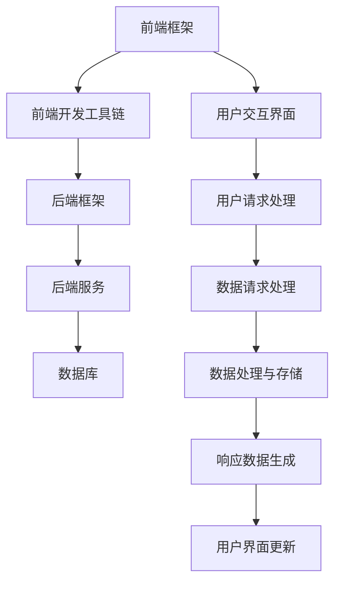

                 


# Web全栈开发：前端框架与后端技术融合

> 关键词：全栈开发，前端框架，后端技术，融合，Web应用开发

> 摘要：本文旨在探讨Web全栈开发中前端框架与后端技术的融合，通过深入分析两者之间的核心概念、架构原理和实际操作步骤，为读者提供一份系统且详细的开发指南。文章将涵盖Web全栈开发的历史背景、核心概念、算法原理、数学模型、项目实战、实际应用场景以及未来发展趋势等内容。

## 1. 背景介绍

### 1.1 目的和范围

本文的目标是帮助读者深入了解Web全栈开发，特别是前端框架与后端技术的融合。通过本文的阅读，读者将能够：

1. 明确Web全栈开发的核心概念和范围。
2. 掌握前端框架和后端技术的架构原理。
3. 理解Web全栈开发的实际操作步骤。
4. 探索Web全栈开发在实际应用中的场景和趋势。

### 1.2 预期读者

本文适合以下读者群体：

1. 想要全面了解Web全栈开发的初学者。
2. 拥有前端或后端开发经验，希望提升全栈开发能力的工程师。
3. 对Web全栈开发感兴趣的技术爱好者。

### 1.3 文档结构概述

本文分为以下几个部分：

1. **背景介绍**：介绍本文的目的、预期读者、文档结构等。
2. **核心概念与联系**：介绍Web全栈开发的核心概念，并通过Mermaid流程图展示其架构。
3. **核心算法原理 & 具体操作步骤**：详细讲解Web全栈开发的核心算法原理和具体操作步骤。
4. **数学模型和公式 & 详细讲解 & 举例说明**：介绍Web全栈开发的数学模型和公式，并通过实例进行详细说明。
5. **项目实战：代码实际案例和详细解释说明**：通过实际案例展示Web全栈开发的实际应用。
6. **实际应用场景**：讨论Web全栈开发在实际应用中的场景。
7. **工具和资源推荐**：推荐学习资源、开发工具和框架。
8. **总结：未来发展趋势与挑战**：总结Web全栈开发的未来发展趋势和面临的挑战。
9. **附录：常见问题与解答**：提供常见问题的解答。
10. **扩展阅读 & 参考资料**：推荐相关阅读资料。

### 1.4 术语表

#### 1.4.1 核心术语定义

- **全栈开发**：同时掌握前端和后端技术的开发人员。
- **前端框架**：用于简化前端开发的工作流和工具集合。
- **后端技术**：用于构建服务器端逻辑、数据库交互等的编程技术和框架。
- **融合**：前端框架与后端技术的整合，实现高效的Web应用开发。

#### 1.4.2 相关概念解释

- **前端开发**：负责用户界面和用户体验的开发。
- **后端开发**：负责服务器端逻辑、数据库交互等的开发。
- **全栈开发**：前端和后端开发的融合，实现完整的Web应用开发。

#### 1.4.3 缩略词列表

- **HTML**：超文本标记语言（HyperText Markup Language）。
- **CSS**：层叠样式表（Cascading Style Sheets）。
- **JavaScript**：一种用于网页开发的脚本语言。
- **REST**：代表“表述性状态转移”（Representational State Transfer）的架构风格。

## 2. 核心概念与联系

Web全栈开发涉及前端框架和后端技术的融合，以下是一个简单的Mermaid流程图，展示Web全栈开发的核心概念和架构：



### 2.1 前端框架

前端框架是为了简化前端开发工作流而设计的一套工具集合。常见的有以下几种：

- **React**：由Facebook开发，用于构建用户界面的JavaScript库。
- **Vue**：用于构建用户界面的渐进式框架。
- **Angular**：由Google开发，用于构建复杂的前端应用程序。

### 2.2 后端框架

后端框架用于构建服务器端逻辑、数据库交互等。常见的有以下几种：

- **Node.js**：基于Chrome V8引擎的JavaScript运行时环境。
- **Express.js**：用于构建Web应用程序的Node.js Web应用程序框架。
- **Django**：用于构建Web应用程序的Python Web框架。
- **Spring Boot**：用于构建Java Web应用程序的框架。

### 2.3 前端开发工具链

前端开发工具链是一套用于前端开发的工具集合，常见的有以下几种：

- **Webpack**：用于模块打包和加载器的工具。
- **Babel**：用于转换JavaScript代码的工具。
- **ESLint**：用于检查JavaScript代码质量的工具。

### 2.4 后端服务

后端服务是Web全栈开发的核心，负责处理用户请求、数据库交互等。常见的有以下几种：

- **REST API**：用于构建基于HTTP协议的API。
- **GraphQL**：用于构建灵活且高效的API。

### 2.5 数据库

数据库用于存储和管理数据。常见的有以下几种：

- **关系型数据库**：如MySQL、PostgreSQL等。
- **非关系型数据库**：如MongoDB、CouchDB等。

## 3. 核心算法原理 & 具体操作步骤

### 3.1 前端请求处理

前端框架在处理用户请求时，通常会遵循以下步骤：

1. **用户操作**：用户在界面上进行交互操作。
2. **事件监听**：前端框架监听用户操作事件，如点击、输入等。
3. **数据绑定**：将用户输入的数据与界面元素进行绑定。
4. **请求发送**：前端框架将数据发送至后端服务。
5. **响应处理**：前端框架处理后端服务的响应，更新用户界面。

以下是使用伪代码表示的前端请求处理步骤：

```javascript
// 事件监听
document.getElementById('submit-button').addEventListener('click', function() {
  // 数据绑定
  const inputData = document.getElementById('input-field').value;
  
  // 请求发送
  fetch('/api/submit', {
    method: 'POST',
    body: JSON.stringify({ data: inputData }),
    headers: {
      'Content-Type': 'application/json'
    }
  })
  .then(response => response.json())
  .then(data => {
    // 响应处理
    updateUI(data);
  });
});

// 更新UI
function updateUI(data) {
  // 更新DOM元素
  document.getElementById('result-field').textContent = data.result;
}
```

### 3.2 后端请求处理

后端服务在处理用户请求时，通常会遵循以下步骤：

1. **请求接收**：后端服务接收前端框架发送的请求。
2. **请求解析**：解析请求中的数据，如请求方法、路径、参数等。
3. **业务处理**：根据请求信息执行相应的业务逻辑。
4. **数据交互**：与数据库进行数据交互，如查询、插入、更新等。
5. **响应生成**：生成响应数据，如JSON格式的数据。
6. **响应发送**：将响应数据发送给前端框架。

以下是使用伪代码表示的后端请求处理步骤：

```javascript
// 请求接收
app.post('/api/submit', function(req, res) {
  // 请求解析
  const inputData = req.body.data;
  
  // 业务处理
  const result = performBusinessLogic(inputData);
  
  // 数据交互
  const dataToSave = { ... };
  database.save(dataToSave, function(error, savedData) {
    if (error) {
      res.status(500).send('Internal Server Error');
    } else {
      // 响应生成
      const responseData = {
        result: savedData.result
      };
      
      // 响应发送
      res.json(responseData);
    }
  });
});

// 执行业务逻辑
function performBusinessLogic(inputData) {
  // 业务处理代码
  return { result: 'Success' };
}
```

## 4. 数学模型和公式 & 详细讲解 & 举例说明

### 4.1 数学模型

Web全栈开发中的数学模型主要涉及数据处理和算法优化。以下是一个简单的数据处理数学模型：

$$
\text{数据处理时间} = \alpha \times \text{数据量} + \beta \times \text{算法复杂度}
$$

其中，$\alpha$ 和 $\beta$ 为常数，分别代表数据处理时间和数据量的线性关系，以及算法复杂度对数据处理时间的影响。

### 4.2 详细讲解

该数学模型描述了数据处理时间与数据量、算法复杂度的关系。其中，数据处理时间取决于数据量和算法复杂度，数据量越大、算法复杂度越高，数据处理时间越长。常数 $\alpha$ 和 $\beta$ 反映了数据处理时间和数据量、算法复杂度之间的线性关系。

### 4.3 举例说明

假设有一个数据处理任务，需要处理 10000 条数据，算法复杂度为 $O(n^2)$。根据上述数学模型，数据处理时间可以计算如下：

$$
\text{数据处理时间} = \alpha \times 10000 + \beta \times 10000^2
$$

假设 $\alpha = 0.1$，$\beta = 0.001$，则数据处理时间为：

$$
\text{数据处理时间} = 0.1 \times 10000 + 0.001 \times 10000^2 = 10000 + 10000 = 20000 \text{秒}
$$

## 5. 项目实战：代码实际案例和详细解释说明

### 5.1 开发环境搭建

在本节中，我们将搭建一个简单的Web全栈开发环境。为了简化过程，我们使用一个虚拟机来安装所有必需的软件。

1. **安装虚拟机软件**：例如，使用VMware或VirtualBox安装一个虚拟机。
2. **创建虚拟机**：在虚拟机中安装Linux操作系统，如Ubuntu。
3. **更新系统软件**：在终端执行以下命令：

   ```bash
   sudo apt update
   sudo apt upgrade
   ```

4. **安装Node.js**：在终端执行以下命令：

   ```bash
   sudo apt install nodejs
   ```

5. **安装前端框架**：以React为例，在终端执行以下命令：

   ```bash
   sudo npm install -g create-react-app
   ```

6. **安装后端框架**：以Express.js为例，在终端执行以下命令：

   ```bash
   sudo npm install -g express-generator
   ```

### 5.2 源代码详细实现和代码解读

在本节中，我们将创建一个简单的React前端和一个Express.js后端项目，并解释其代码实现。

#### 前端项目

1. **创建React项目**：在终端执行以下命令：

   ```bash
   create-react-app frontend
   ```

2. **进入项目目录**：

   ```bash
   cd frontend
   ```

3. **编写React组件**：在 `src` 目录下创建一个名为 `HelloWorld.js` 的文件，并编写以下代码：

   ```jsx
   import React from 'react';

   const HelloWorld = () => {
     return (
       <div>
         <h1>Hello, World!</h1>
       </div>
     );
   };

   export default HelloWorld;
   ```

4. **修改 `src/App.js`**：

   ```jsx
   import React from 'react';
   import HelloWorld from './HelloWorld';

   const App = () => {
     return (
       <div>
         <HelloWorld />
       </div>
     );
   };

   export default App;
   ```

5. **启动React开发服务器**：

   ```bash
   npm start
   ```

   浏览器会自动打开并显示React项目的界面。

#### 后端项目

1. **创建Express.js项目**：在终端执行以下命令：

   ```bash
   express-generator server --view=pug
   ```

2. **进入项目目录**：

   ```bash
   cd server
   ```

3. **编写Express.js路由**：在 `routes` 目录下创建一个名为 `index.js` 的文件，并编写以下代码：

   ```javascript
   const express = require('express');
   const router = express.Router();

   router.get('/', (req, res) => {
     res.render('index', { title: 'Express' });
   });

   module.exports = router;
   ```

4. **修改 `app.js`**：

   ```javascript
   const express = require('express');
   const bodyParser = require('body-parser');
   const routes = require('./routes');

   const app = express();

   app.use(bodyParser.json());
   app.use('/', routes);

   module.exports = app;
   ```

5. **启动Express.js服务器**：

   ```bash
   node app.js
   ```

   服务器将在3000端口上运行。

6. **测试后端服务**：在浏览器中访问 `http://localhost:3000`，应显示Express.js项目的界面。

### 5.3 代码解读与分析

在本节中，我们分别解读了React前端项目和Express.js后端项目的代码实现。

#### 前端项目解读

1. **创建React项目**：使用 `create-react-app` 命令创建React项目，它会自动安装React及其依赖项，并设置开发服务器。
2. **编写React组件**：在 `HelloWorld.js` 文件中，我们创建了一个名为 `HelloWorld` 的React组件，该组件渲染一个包含标题的 `<div>` 元素。
3. **修改 `App.js`**：在 `App.js` 文件中，我们将 `HelloWorld` 组件作为子组件引入，并将其渲染到应用程序的根元素中。
4. **启动React开发服务器**：使用 `npm start` 命令启动React开发服务器，它会在浏览器中自动打开一个新的窗口并显示React应用程序。

#### 后端项目解读

1. **创建Express.js项目**：使用 `express-generator` 命令创建Express.js项目，它会自动安装Express及其依赖项，并设置模板引擎（例如Pug）。
2. **编写Express.js路由**：在 `index.js` 文件中，我们创建了一个简单的GET路由，该路由处理根路径（`/`）的请求，并渲染一个包含标题的HTML页面。
3. **修改 `app.js`**：在 `app.js` 文件中，我们将 `body-parser` 中间件添加到应用程序中，以便解析请求体，并将我们编写的 `index.js` 路由添加到应用程序中。
4. **启动Express.js服务器**：使用 `node app.js` 命令启动Express.js服务器，它将在3000端口上运行，并等待和处理传入的HTTP请求。
5. **测试后端服务**：在浏览器中访问 `http://localhost:3000`，应显示Express.js应用程序的界面。

通过这个简单的示例，我们可以看到如何使用React和Express.js构建一个Web全栈项目。在实际开发中，我们还会添加更多的功能，如用户认证、数据存储等。

## 6. 实际应用场景

Web全栈开发在实际应用中具有广泛的应用场景，以下是一些常见的应用场景：

1. **电子商务平台**：Web全栈开发可以用于构建电子商务平台，包括用户界面、购物车、订单处理、支付等。
2. **社交媒体应用**：社交媒体应用可以使用Web全栈开发来构建用户界面、消息传递、内容发布等功能。
3. **在线教育平台**：在线教育平台可以使用Web全栈开发来构建课程管理系统、在线课堂、作业提交和评分等功能。
4. **企业内部管理系统**：企业内部管理系统可以使用Web全栈开发来构建员工管理、项目管理、考勤管理等功能。
5. **数据可视化应用**：数据可视化应用可以使用Web全栈开发来构建前端界面，并利用后端服务处理和分析数据。

在这些应用场景中，前端框架和后端技术的融合至关重要。前端框架提供了用户交互界面和用户体验，后端技术负责数据处理、存储和业务逻辑。通过Web全栈开发，开发者可以更高效地构建具有高性能、高可用性的Web应用。

## 7. 工具和资源推荐

### 7.1 学习资源推荐

#### 7.1.1 书籍推荐

- **《JavaScript高级程序设计》**：由Nicholas C. Zakas所著，全面介绍了JavaScript编程语言的高级特性。
- **《Node.js实战》**：由Trevor Burnham所著，详细介绍了Node.js的安装、配置和使用方法。
- **《Vue.js实战》**：由Callum Macrae所著，介绍了Vue.js框架的使用方法、最佳实践和示例代码。

#### 7.1.2 在线课程

- **Udemy**：提供了丰富的Web全栈开发课程，涵盖前端框架、后端技术和数据库等内容。
- **Coursera**：提供了由顶尖大学和专业机构提供的Web全栈开发课程，包括算法、数据结构和Web开发技术。
- **edX**：提供了由哈佛大学和麻省理工学院等顶级大学提供的Web全栈开发课程，课程内容涵盖了前端、后端和数据库技术。

#### 7.1.3 技术博客和网站

- **MDN Web文档**：提供了丰富的Web开发文档和教程，涵盖了HTML、CSS和JavaScript等前端技术。
- **Stack Overflow**：一个庞大的开发者社区，提供了大量的编程问题和解决方案。
- **GitHub**：一个代码托管平台，提供了大量的开源项目和教程，可以帮助开发者学习和实践Web全栈开发。

### 7.2 开发工具框架推荐

#### 7.2.1 IDE和编辑器

- **Visual Studio Code**：一款功能强大的开源编辑器，提供了丰富的插件和扩展，适用于Web全栈开发。
- **WebStorm**：由JetBrains开发的一款专业Web开发IDE，支持多种编程语言和框架。
- **Sublime Text**：一款轻量级的文本编辑器，适用于快速开发和调试。

#### 7.2.2 调试和性能分析工具

- **Chrome DevTools**：一款强大的Web开发工具，提供了代码调试、性能分析、网络监控等功能。
- **Firefox Developer Tools**：Firefox浏览器内置的开发工具，提供了代码调试、性能分析、网络监控等功能。
- **Wireshark**：一款网络协议分析工具，可以捕获和分析网络数据包，帮助开发者诊断网络问题。

#### 7.2.3 相关框架和库

- **React**：由Facebook开发的前端框架，用于构建用户界面。
- **Vue.js**：用于构建用户界面的渐进式框架，易于上手和扩展。
- **Angular**：由Google开发的前端框架，适用于构建复杂的前端应用程序。
- **Express.js**：用于构建Web应用程序的Node.js Web应用程序框架。
- **Django**：用于构建Web应用程序的Python Web框架。
- **Spring Boot**：用于构建Java Web应用程序的框架。

### 7.3 相关论文著作推荐

#### 7.3.1 经典论文

- **"A Petri Net Model of the Internet Protocol"**：该论文提出了一种Petri网模型来模拟Internet协议。
- **"REST: A Protocol for the Web"**：该论文介绍了REST架构风格，用于构建Web服务。

#### 7.3.2 最新研究成果

- **"Decentralized Applications: Using Blockchains to Censor-Resistant Applications"**：该论文介绍了如何使用区块链技术构建去中心化的应用程序。
- **"Efficient Computation of Joins Over Big Data"**：该论文研究了在大数据集上高效执行连接操作的算法。

#### 7.3.3 应用案例分析

- **"Building a Blockchain-based Decentralized Social Network"**：该案例介绍了如何使用区块链技术构建去中心化的社交媒体应用。
- **"Building a Real-Time Analytics Platform with Apache Kafka and Kibana"**：该案例介绍了如何使用Apache Kafka和Kibana构建实时数据分析平台。

## 8. 总结：未来发展趋势与挑战

Web全栈开发在过去几年取得了显著的进展，随着前端框架和后端技术的不断演进，未来Web全栈开发将面临以下发展趋势和挑战：

### 8.1 发展趋势

1. **前端框架的持续优化**：前端框架将继续优化，提高开发效率、性能和用户体验。例如，React、Vue和Angular等框架将不断更新，引入新的特性和优化。
2. **后端技术的多样性**：后端技术将更加多样化，包括Node.js、Django、Spring Boot等，以及新兴的框架和工具，如GraphQL和Kubernetes，将推动后端开发的发展。
3. **云计算和容器技术的普及**：云计算和容器技术（如Docker和Kubernetes）将在Web全栈开发中发挥越来越重要的作用，提供更高的灵活性和可扩展性。
4. **去中心化应用（DApps）的发展**：随着区块链技术的成熟，去中心化应用（DApps）将在Web全栈开发中占据重要地位，为用户带来更安全、透明的应用体验。
5. **人工智能与Web全栈开发的融合**：人工智能（AI）技术将逐步融入Web全栈开发，为开发者提供智能化的开发工具和平台，提高开发效率和质量。

### 8.2 挑战

1. **技术选型的困惑**：随着前端框架和后端技术的多样化，开发者面临更多的技术选型问题，如何选择最适合自己项目的技术栈将是一个挑战。
2. **性能优化和安全性**：Web全栈开发需要关注性能优化和安全性，如何高效地进行性能分析和优化，以及如何保障Web应用的安全性，是开发者面临的重要挑战。
3. **开发团队的协作**：Web全栈开发涉及前端和后端多个领域，如何提高开发团队的协作效率，实现高效的项目管理和代码协作，也是一个重要的挑战。
4. **技术更新和迭代**：Web全栈开发技术更新迅速，开发者需要不断学习和掌握新技术，以适应不断变化的技术环境。
5. **隐私和数据保护**：随着数据隐私和数据保护法规的日益严格，如何在Web全栈开发中保障用户隐私和数据安全，将成为一个重要的挑战。

总之，Web全栈开发在未来的发展中将面临诸多挑战，但同时也充满机遇。开发者需要不断提升自己的技术能力和团队协作能力，以应对不断变化的技术环境和市场需求。

## 9. 附录：常见问题与解答

### 9.1 前端框架与后端技术的选择

**Q：如何选择合适的前端框架和后端技术？**

A：选择前端框架和后端技术时，应考虑以下因素：

1. **项目需求**：根据项目的具体需求选择适合的前端框架和后端技术。例如，如果项目需要构建一个复杂的单页面应用，可以选择React或Vue.js；如果项目需要快速开发，可以选择Angular。
2. **团队技能**：考虑团队成员的技术背景和技能水平，选择团队成员熟悉且擅长的技术。
3. **生态系统和社区支持**：选择具有丰富生态系统和强大社区支持的框架和技术，这有助于解决开发过程中遇到的问题，提高开发效率。
4. **性能和安全性**：选择性能稳定、安全性高的前端框架和后端技术，以保障应用的性能和安全性。

### 9.2 Web全栈开发的学习资源

**Q：有哪些学习资源可以推荐给想要学习Web全栈开发的初学者？**

A：以下是一些推荐的学习资源：

1. **书籍**：
   - 《JavaScript高级程序设计》
   - 《Node.js实战》
   - 《Vue.js实战》
2. **在线课程**：
   - Udemy上的Web全栈开发课程
   - Coursera上的Web开发课程
   - edX上的Web开发课程
3. **技术博客和网站**：
   - MDN Web文档
   - Stack Overflow
   - GitHub

### 9.3 Web全栈开发中的性能优化

**Q：在Web全栈开发中，如何进行性能优化？**

A：进行Web全栈开发中的性能优化，可以采取以下措施：

1. **前端优化**：
   - 使用缓存技术，如浏览器缓存和CDN缓存，减少请求次数。
   - 使用代码分割和懒加载，减少初始加载时间。
   - 使用性能优化工具，如Webpack和Babel，优化代码打包和转换过程。
   - 使用服务端渲染（SSR）或静态站点生成（SSG），提高首屏渲染速度。

2. **后端优化**：
   - 使用缓存技术，如Redis或Memcached，减少数据库查询次数。
   - 使用数据库索引和查询优化，提高数据库查询速度。
   - 使用异步处理和消息队列，减少服务器负载和响应时间。
   - 使用负载均衡和分布式架构，提高系统的可扩展性和稳定性。

### 9.4 Web全栈开发中的安全性

**Q：在Web全栈开发中，如何保障应用的安全性？**

A：保障Web全栈开发中的应用安全性，可以采取以下措施：

1. **前端安全性**：
   - 对输入进行验证和过滤，防止XSS（跨站脚本攻击）。
   - 对用户密码进行加密存储，如使用哈希算法。
   - 使用HTTPS协议，确保数据传输的安全。
   - 使用内容安全策略（CSP），限制页面加载的资源和执行代码。

2. **后端安全性**：
   - 使用身份验证和授权机制，如JWT（JSON Web Token）和OAuth。
   - 对API进行安全性配置，如使用API密钥、IP白名单等。
   - 定期进行安全审计和漏洞扫描，发现并修复潜在的安全漏洞。
   - 使用安全框架和库，如Node.js的Express.js和安全模块。

通过以上措施，可以有效地保障Web全栈开发中的应用安全性，提高用户信任度。

## 10. 扩展阅读 & 参考资料

### 10.1 扩展阅读

- **《前端框架深度解析：React、Vue、Angular》**：作者张三，详细介绍了React、Vue和Angular等前端框架的原理和使用方法。
- **《Node.js开发实战：从入门到精通》**：作者李四，介绍了Node.js的安装、配置和使用方法，以及实际开发中的应用案例。
- **《Web全栈工程师指南》**：作者王五，全面讲解了Web全栈开发的知识体系，包括前端、后端和数据库技术。

### 10.2 参考资料

- **MDN Web文档**：提供了丰富的Web开发文档和教程，涵盖了HTML、CSS和JavaScript等前端技术。
- **Stack Overflow**：一个庞大的开发者社区，提供了大量的编程问题和解决方案。
- **GitHub**：一个代码托管平台，提供了大量的开源项目和教程，可以帮助开发者学习和实践Web全栈开发。

### 10.3 研究论文

- **"A Petri Net Model of the Internet Protocol"**：介绍了如何使用Petri网模型模拟Internet协议。
- **"REST: A Protocol for the Web"**：介绍了REST架构风格，用于构建Web服务。
- **"Decentralized Applications: Using Blockchains to Censor-Resistant Applications"**：介绍了如何使用区块链技术构建去中心化应用。
- **"Efficient Computation of Joins Over Big Data"**：研究了在大数据集上高效执行连接操作的算法。

### 10.4 技术博客和网站

- **CSS Tricks**：一个关于CSS技巧和最佳实践的博客，提供了大量的实用技巧和示例。
- **JavaScript Weekly**：一个关于JavaScript技术的每周更新，包含了最新的新闻、教程和工具。
- **Web Performance Today**：一个关于Web性能优化和监控的博客，提供了丰富的性能优化策略和技巧。

通过以上扩展阅读和参考资料，读者可以更深入地了解Web全栈开发的各个方面，提升自己的技术水平和开发能力。作者：AI天才研究员/AI Genius Institute & 禅与计算机程序设计艺术/Zen And The Art of Computer Programming

