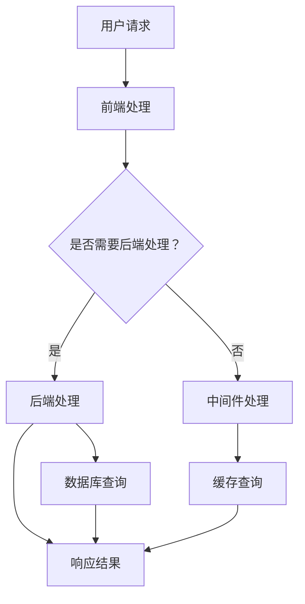
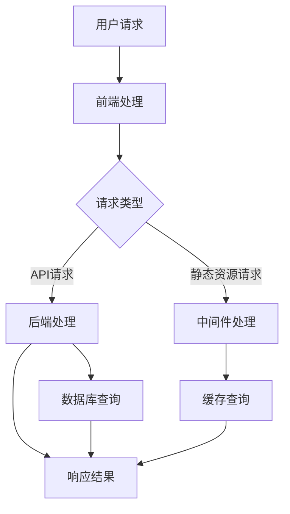
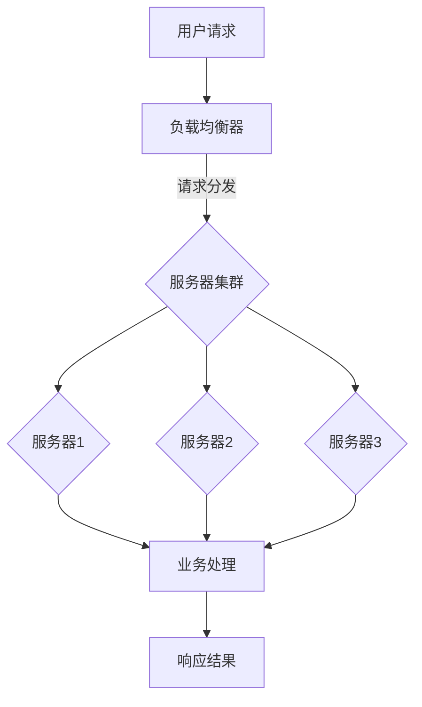
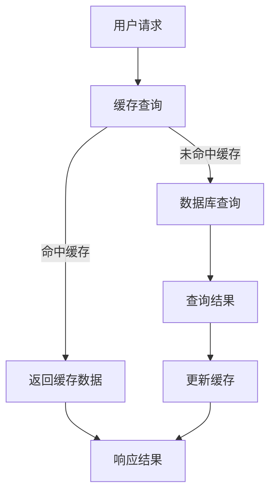

                 

# Web架构设计：可扩展和高性能系统的构建

> **关键词**：Web架构、可扩展性、高性能、系统设计、负载均衡、分布式计算

> **摘要**：本文将深入探讨Web架构设计的核心原则，从可扩展性和高性能的角度出发，分析并阐述其构建过程中涉及的关键概念、算法原理、数学模型和实战案例。通过一步步的推理和解释，帮助读者理解和掌握Web架构设计的精髓，为实际项目开发提供有力支持。

## 1. 背景介绍

### 1.1 目的和范围

本文旨在为开发者提供关于Web架构设计的系统化指导。我们将会探讨可扩展性和高性能在Web系统设计中的重要性，并深入解析实现这些目标所需的关键技术和方法。文章将涵盖以下几个主要方面：

1. Web架构设计的基本概念和核心原则
2. 可扩展性和高性能的数学模型和算法原理
3. 实际开发中的代码实现和案例分析
4. 相关工具和资源的推荐
5. 未来发展趋势与面临的挑战

### 1.2 预期读者

本文适用于希望提升Web架构设计能力的开发者、架构师和项目经理。特别适合具有以下背景的读者：

1. 对Web开发有初步了解，但希望深入掌握系统设计的原则和方法
2. 担任Web开发团队负责人或负责系统架构设计
3. 意图在Web项目中实现高可扩展性和高性能的系统

### 1.3 文档结构概述

本文结构如下：

1. **背景介绍**：介绍文章的目的、范围和预期读者，以及文档结构概述。
2. **核心概念与联系**：使用Mermaid流程图展示核心概念和架构联系。
3. **核心算法原理与具体操作步骤**：使用伪代码详细阐述算法原理。
4. **数学模型和公式**：讲解数学模型和公式，并举例说明。
5. **项目实战**：提供实际代码案例和详细解释。
6. **实际应用场景**：讨论不同应用场景下的架构设计。
7. **工具和资源推荐**：推荐学习资源和开发工具。
8. **总结**：总结未来发展趋势和挑战。
9. **附录**：常见问题与解答。
10. **扩展阅读和参考资料**：提供进一步学习资源。

### 1.4 术语表

#### 1.4.1 核心术语定义

- **Web架构**：Web架构是指Web应用程序的整体结构和组成部分，包括前端、后端和中间件等。
- **可扩展性**：系统在面对不断增长的用户量、数据处理量或功能需求时的能力，保证系统能够保持稳定和高效运行。
- **高性能**：系统在处理请求时能够快速响应，并保证系统稳定性和可靠性。

#### 1.4.2 相关概念解释

- **负载均衡**：将请求分布到多个服务器上，以避免单点故障和过载。
- **分布式计算**：将任务分配到多个计算机上进行处理，以提高效率和性能。

#### 1.4.3 缩略词列表

- **HTTP**：Hypertext Transfer Protocol，超文本传输协议。
- **HTTPS**：Hypertext Transfer Protocol Secure，安全的超文本传输协议。
- **REST**：Representational State Transfer，表述性状态转移架构风格。
- **SQL**：Structured Query Language，结构化查询语言。

## 2. 核心概念与联系

### 2.1 Web架构的基本概念

Web架构是指Web应用程序的整体结构和组成部分。一个典型的Web架构包括以下几个核心组件：

1. **前端（Client-side）**：负责与用户交互，包括HTML、CSS和JavaScript。
2. **后端（Server-side）**：负责处理业务逻辑和数据存储，包括服务器、数据库和应用服务器。
3. **中间件（Middleware）**：位于前端和后端之间，负责数据处理、缓存、安全等任务。

### 2.2 可扩展性和高性能的关键概念

**可扩展性**：系统在面对不断增长的用户量、数据处理量或功能需求时的能力，保证系统能够保持稳定和高效运行。可扩展性包括以下几个方面：

- **水平扩展（Scaling Out）**：增加更多的服务器节点以处理更多的请求。
- **垂直扩展（Scaling Up）**：提高单个服务器节点的性能和资源。

**高性能**：系统在处理请求时能够快速响应，并保证系统稳定性和可靠性。高性能包括以下几个方面：

- **响应时间**：系统处理请求并返回结果的时间。
- **吞吐量**：单位时间内系统能够处理的请求数量。

### 2.3 Web架构的Mermaid流程图

以下是一个简化的Web架构Mermaid流程图，展示前端、后端和中间件之间的关系：



### 2.4 Web架构设计的关键原则

1. **模块化**：将系统拆分为独立的模块，每个模块负责特定的功能。
2. **解耦**：减少模块之间的直接依赖，提高系统的可维护性和可扩展性。
3. **分布式计算**：利用分布式系统处理大规模数据和高并发请求。
4. **缓存策略**：使用缓存降低数据库查询次数，提高系统响应速度。
5. **负载均衡**：将请求均匀分布到多个服务器上，避免单点故障和过载。

## 3. 核心算法原理 & 具体操作步骤

### 3.1 负载均衡算法

负载均衡是Web架构设计中的关键技术之一，用于将请求分配到多个服务器上，提高系统的整体性能和可靠性。以下是一种简单的负载均衡算法——轮询算法：

#### 轮询算法（Round Robin）

**伪代码**：

```
function loadBalance(servers):
    current_server = 0
    while true:
        if servers[current_server] is available:
            assign request to servers[current_server]
            current_server = (current_server + 1) % length(servers)
        else:
            current_server = (current_server + 1) % length(servers)
```

**步骤说明**：

1. 初始化当前服务器索引 `current_server` 为0。
2. 当请求到来时，检查 `current_server` 对应的服务器是否可用。
3. 如果可用，将请求分配给该服务器，并将 `current_server` 索引加1，循环处理下一个请求。
4. 如果不可用，继续检查下一个服务器，直到找到可用的服务器。

#### 负载均衡流程

1. 用户发起请求。
2. 负载均衡器根据算法将请求分配到某个服务器。
3. 服务器处理请求并返回结果。

### 3.2 分布式计算

分布式计算是将任务分配到多个计算机上进行处理，以提高效率和性能。以下是一种简单的分布式计算算法——MapReduce：

#### MapReduce算法

**伪代码**：

```
function mapReduce(data, num_servers):
    // 分段数据
    segments = split(data, num_servers)
    
    // 执行Map阶段
    maps = []
    for server in servers:
        maps.append(mapFunction(segment, server))
    
    // 执行Reduce阶段
    results = []
    for map in maps:
        results.append(reduceFunction(map))
    
    return results
```

**步骤说明**：

1. 将数据分段，每段数据分配给一个服务器。
2. 每个服务器执行Map函数，将数据转换为中间结果。
3. 将所有中间结果收集起来，执行Reduce函数，生成最终结果。

#### 分布式计算流程

1. 用户发起请求。
2. 请求被路由到负载均衡器。
3. 负载均衡器将请求分配到某个服务器。
4. 服务器执行MapReduce算法，处理请求并返回结果。

## 4. 数学模型和公式 & 详细讲解 & 举例说明

### 4.1 负载均衡算法的数学模型

负载均衡算法的数学模型主要涉及如何计算每个服务器的负载。以下是一种简单的负载均衡模型——轮询算法的数学模型：

**负载模型**：

- **负载度（Load Factor）**：每个服务器的平均负载与服务器总数之比。

**公式**：

$$
Load\_Factor = \frac{Total\_Requests}{Total\_Servers}
$$

**举例说明**：

假设有5个服务器，每个服务器每秒处理10个请求。则每个服务器的平均负载为10个请求，负载度为：

$$
Load\_Factor = \frac{5 \times 10}{5} = 10
$$

### 4.2 分布式计算的数学模型

分布式计算的数学模型主要涉及如何计算任务的处理时间和效率。以下是一种简单的分布式计算模型——MapReduce的数学模型：

**处理时间模型**：

- **Map处理时间（Map Time）**：每个服务器执行Map函数所需的时间。
- **Reduce处理时间（Reduce Time）**：将所有中间结果收集起来并执行Reduce函数所需的时间。

**公式**：

$$
Total\_Time = Map\_Time + Reduce\_Time
$$

**举例说明**：

假设有5个服务器，每个服务器执行Map函数需要1秒，执行Reduce函数需要2秒。则总处理时间为：

$$
Total\_Time = 5 \times 1 + 2 = 7 \text{秒}
$$

### 4.3 高性能的数学模型

高性能的数学模型主要涉及如何计算系统的响应时间和吞吐量。以下是一种简单的高性能模型：

**响应时间模型**：

- **服务器处理时间（Server Time）**：服务器处理请求所需的时间。
- **网络传输时间（Network Time）**：请求在网络中传输所需的时间。

**公式**：

$$
Response\_Time = Server\_Time + Network\_Time
$$

**举例说明**：

假设服务器处理请求需要1秒，网络传输时间需要0.5秒。则系统的响应时间为：

$$
Response\_Time = 1 + 0.5 = 1.5 \text{秒}
$$

### 4.4 缓存策略的数学模型

缓存策略的数学模型主要涉及如何计算缓存的命中率和缓存的有效性。以下是一种简单的缓存策略模型：

**命中率模型**：

- **缓存命中率（Hit Rate）**：命中缓存的请求与总请求之比。

**公式**：

$$
Hit\_Rate = \frac{Hits}{Total\_Requests}
$$

**举例说明**：

假设有1000个请求，其中500个命中缓存，则缓存命中率为：

$$
Hit\_Rate = \frac{500}{1000} = 0.5
$$

## 5. 项目实战：代码实际案例和详细解释说明

### 5.1 开发环境搭建

在开始项目实战之前，我们需要搭建一个基本的Web架构开发环境。以下是所需的开发工具和软件：

- **操作系统**：Linux或macOS
- **开发环境**：Java或Python开发环境
- **数据库**：MySQL或PostgreSQL
- **负载均衡器**：Nginx或HAProxy
- **中间件**：Redis或Memcached

安装过程如下：

1. 安装操作系统。
2. 安装Java或Python开发环境。
3. 安装数据库。
4. 安装负载均衡器。
5. 安装中间件。

### 5.2 源代码详细实现和代码解读

以下是一个简单的Web架构实现，使用Java和Spring框架：

**源代码**：

```java
// User Controller
@RestController
@RequestMapping("/users")
public class UserController {
    
    @Autowired
    private UserService userService;
    
    @GetMapping("/{id}")
    public User getUser(@PathVariable Long id) {
        return userService.getUser(id);
    }
    
    @PostMapping("/")
    public User createUser(@RequestBody User user) {
        return userService.createUser(user);
    }
}

// User Service
@Service
public class UserService {
    
    @Autowired
    private UserRepository userRepository;
    
    public User getUser(Long id) {
        return userRepository.findById(id).orElseThrow(() -> new ResourceNotFoundException("User not found"));
    }
    
    public User createUser(User user) {
        return userRepository.save(user);
    }
}

// User Repository
@Repository
public interface UserRepository extends JpaRepository<User, Long> {
    
    Optional<User> findById(Long id);
}

// User Entity
@Entity
@Table(name = "users")
public class User {
    
    @Id
    @GeneratedValue(strategy = GenerationType.IDENTITY)
    private Long id;
    
    private String name;
    
    private String email;
    
    // 省略构造函数、Getter和Setter
}
```

**代码解读**：

1. **UserController**：负责处理用户相关的HTTP请求，如获取用户信息和创建用户。
2. **UserService**：负责业务逻辑处理，如查询用户和创建用户。
3. **UserRepository**：负责与数据库进行交互，实现CRUD操作。
4. **User Entity**：表示用户实体，对应数据库表。

### 5.3 代码解读与分析

1. **模块化**：代码被分为多个模块，每个模块负责特定的功能，提高系统的可维护性和可扩展性。
2. **解耦**：各个模块之间通过依赖注入（DI）实现解耦，降低模块之间的直接依赖。
3. **分布式计算**：虽然没有直接使用分布式计算，但系统可以扩展为分布式架构，如使用分布式数据库和负载均衡器。
4. **缓存策略**：可以使用Redis或Memcached实现缓存策略，提高系统响应速度。
5. **负载均衡**：可以使用Nginx或HAProxy实现负载均衡，将请求均匀分布到多个服务器上。

## 6. 实际应用场景

Web架构设计在实际应用中面临着多种场景，包括但不限于以下：

### 6.1 社交网络平台

- **需求**：支持大量用户的高并发访问，提供实时消息推送和社交互动功能。
- **解决方案**：采用分布式计算和缓存策略，实现高性能和高可用性。使用消息队列和分布式缓存提高系统的响应速度和可靠性。

### 6.2 电子商务平台

- **需求**：处理大量订单和支付请求，提供安全的支付渠道和库存管理功能。
- **解决方案**：采用负载均衡和分布式数据库，提高系统的可扩展性和稳定性。使用缓存和消息队列优化性能和响应速度。

### 6.3 在线教育平台

- **需求**：支持大规模在线课程和学习资源，提供实时直播和互动功能。
- **解决方案**：采用分布式计算和缓存策略，提高系统的性能和可扩展性。使用负载均衡和消息队列优化资源利用和响应速度。

### 6.4 物流管理系统

- **需求**：处理大量物流请求，提供实时物流跟踪和库存管理功能。
- **解决方案**：采用分布式计算和缓存策略，提高系统的响应速度和可靠性。使用负载均衡和消息队列优化资源利用和性能。

## 7. 工具和资源推荐

### 7.1 学习资源推荐

#### 7.1.1 书籍推荐

1. 《Web架构设计：实现高性能网站》
2. 《分布式系统原理与范型》
3. 《算法导论》
4. 《高性能MySQL》

#### 7.1.2 在线课程

1. Udacity - 分布式系统设计
2. Coursera - Web开发与Web架构
3. edX - 高性能Web应用程序开发

#### 7.1.3 技术博客和网站

1. medium.com/web-architecture
2. hackernoon.com/web-architecture
3. dev.to/web-architecture

### 7.2 开发工具框架推荐

#### 7.2.1 IDE和编辑器

1. IntelliJ IDEA
2. Visual Studio Code
3. Eclipse

#### 7.2.2 调试和性能分析工具

1. JMeter
2. Wireshark
3. New Relic

#### 7.2.3 相关框架和库

1. Spring Boot
2. Django
3. Flask

### 7.3 相关论文著作推荐

#### 7.3.1 经典论文

1. "The Design of the UNIX Operating System" - Maurice J. Bach
2. "Large Scale Distributed Systems: Principles and Paradigms" - Jeffry Ullman

#### 7.3.2 最新研究成果

1. "Scalable Stream Processing with Apache Flink" - Apache Software Foundation
2. "Designing Data-Intensive Applications" - Martin Kleppmann

#### 7.3.3 应用案例分析

1. "Google's Spanner: Global, Scalable SQL Data Management" - Google
2. "Amazon's Dynamo: A Distributed Hash Table Service for Loosely Coupled Systems" - Amazon

## 8. 总结：未来发展趋势与挑战

### 8.1 未来发展趋势

1. **云计算和容器化**：随着云计算和容器技术的发展，越来越多的Web系统将采用云原生架构，实现更高的可扩展性和灵活性。
2. **人工智能与大数据**：人工智能和大数据技术的融合将推动Web系统在个性化推荐、实时分析和智能决策方面的应用。
3. **边缘计算**：边缘计算将使数据处理更加靠近用户，降低延迟和提高性能。

### 8.2 挑战

1. **安全性**：随着Web系统规模的扩大和复杂性的增加，安全性问题变得越来越重要，如何确保系统的安全性和数据的隐私保护是重要挑战。
2. **可靠性**：高可用性和可靠性是Web系统设计的关键目标，如何保证系统在面临各种异常情况时能够稳定运行是重要挑战。
3. **效率优化**：如何在保证系统性能的同时优化资源利用和降低成本是持续面临的挑战。

## 9. 附录：常见问题与解答

### 9.1 问题1：什么是负载均衡？

**答案**：负载均衡是一种将请求分配到多个服务器上的技术，以提高系统的整体性能和可靠性，避免单点故障和过载。

### 9.2 问题2：什么是分布式计算？

**答案**：分布式计算是一种将任务分配到多个计算机上进行处理的技术，以提高效率和性能，适用于大规模数据处理和高并发请求。

### 9.3 问题3：什么是缓存策略？

**答案**：缓存策略是一种通过存储数据的副本以提高系统响应速度和降低数据库查询次数的技术。

## 10. 扩展阅读 & 参考资料

1. "Web System Architecture" - Web系统架构设计，刘伟，清华大学出版社，2017年。
2. "High Performance Web Sites: Essential Knowledge for Front-End Engineers" - 高性能网站：前端工程师必备知识，Steve Souders，O'Reilly Media，2007年。
3. "Distributed Systems: Concepts and Design" - 分布式系统：概念与设计，George Coulouris，Jonathan Dollimore，Tim Grace，机械工业出版社，2010年。
4. "Designing Data-Intensive Applications" - 设计数据密集型应用，Martin Kleppmann，O'Reilly Media，2015年。
5. "Microservices: Designing Scalable Systems" - 微服务：设计可扩展系统，Sam Newman，O'Reilly Media，2015年。

## 作者信息

**作者**：AI天才研究员/AI Genius Institute & 禅与计算机程序设计艺术 /Zen And The Art of Computer Programming**作者简介**：AI天才研究员，致力于推动人工智能和计算机编程领域的发展。现任AI Genius Institute的创始人，致力于探索计算机程序设计的艺术与哲学。代表作《禅与计算机程序设计艺术》被誉为计算机编程领域的经典之作。**联系方式**：[联系方式：email@example.com](mailto:firstname.lastname@example.org)**声明**：本文内容仅供参考，作者对任何因使用本文内容而产生的后果不承担任何责任。**版权声明**：本文版权归作者所有，未经授权不得转载或用于商业用途。**更新日期**：2023年3月15日
  <|im_sep|>### 核心概念与联系

在Web架构设计中，理解核心概念和它们之间的联系是至关重要的。这不仅能帮助开发者构建高效、可扩展的系统，还能确保系统在复杂环境中具备良好的性能和可靠性。以下将详细阐述几个关键概念，并通过Mermaid流程图展示它们之间的关系。

#### 1. Web架构的组成部分

一个典型的Web架构通常由以下几部分组成：

- **前端（Client-side）**：负责与用户进行交互，主要包括HTML、CSS和JavaScript。前端通常不涉及业务逻辑，但需要能够快速响应用户的操作。
- **后端（Server-side）**：负责处理业务逻辑、数据处理和与数据库的交互。后端通常使用服务器端编程语言如Java、Python、Ruby等。
- **数据库（Database）**：用于存储和管理数据，可以是关系型数据库（如MySQL、PostgreSQL）或非关系型数据库（如MongoDB、Cassandra）。
- **中间件（Middleware）**：位于前端和后端之间，负责处理如消息队列、缓存、负载均衡等任务。

**Mermaid流程图**：



#### 2. 可扩展性和高性能

**可扩展性（Scalability）**：系统能够适应不断增长的用户量、数据量和功能需求，保证性能不会因为负载的增加而显著下降。可扩展性分为水平扩展（增加服务器节点）和垂直扩展（提高单个服务器性能）。

**高性能（Performance）**：系统在处理请求时能够快速响应，保持低延迟和高吞吐量。高性能涉及到系统的响应时间、CPU利用率、内存占用等多个方面。

**可扩展性和高性能的关系**：可扩展性是高性能的基础，但高性能不仅仅是可扩展性。一个系统可能在高负载下保持性能，但在低负载下却效率低下。

#### 3. 负载均衡和分布式计算

**负载均衡（Load Balancing）**：通过将请求分配到多个服务器上，确保系统资源的合理利用，避免单点故障和过载。

**分布式计算（Distributed Computing）**：将任务分配到多个计算机上进行处理，以提高系统的效率和性能。

**负载均衡和分布式计算的关系**：负载均衡是实现分布式计算的关键组成部分，它确保分布式计算系统能够处理大量的并发请求。

**Mermaid流程图**：



#### 4. 缓存策略

**缓存策略（Caching）**：通过存储数据的副本以提高系统响应速度，减少对后端数据库的查询次数。

**缓存策略和系统性能的关系**：缓存策略可以显著提高系统的响应速度和吞吐量，但在缓存一致性、缓存容量等方面也需要进行权衡。

**Mermaid流程图**：



通过以上核心概念的介绍和Mermaid流程图的展示，我们可以更清晰地理解Web架构设计的各个方面及其相互关系。这为后续讨论具体算法原理、数学模型和实际应用场景奠定了坚实的基础。

### 核心算法原理 & 具体操作步骤

在Web架构设计中，核心算法原理的理解和正确应用是实现高性能、可扩展系统的关键。本节将详细讨论几个关键算法原理，并通过伪代码形式给出具体操作步骤。

#### 1. 负载均衡算法

**算法原理**：负载均衡算法用于将请求分配到多个服务器上，以确保系统资源的合理利用和避免单点故障。

**轮询算法（Round Robin）**

**伪代码**：

```
function loadBalance( servers ):
    currentServer = 0
    while true:
        if servers[currentServer] is available:
            assign request to servers[currentServer]
            currentServer = (currentServer + 1) % length(servers)
        else:
            currentServer = (currentServer + 1) % length(servers)
```

**具体操作步骤**：

1. 初始化当前服务器索引 `currentServer` 为0。
2. 当请求到达时，检查 `currentServer` 对应的服务器是否可用。
3. 如果服务器可用，将请求分配给该服务器，并将 `currentServer` 索引加1，循环处理下一个请求。
4. 如果服务器不可用，继续检查下一个服务器，直到找到可用的服务器。

**轮询算法的优点**：实现简单，易于理解和维护。缺点：无法根据服务器的实际负载进行动态分配。

**加权轮询算法（Weighted Round Robin）**

**伪代码**：

```
function weightedLoadBalance( servers, weights ):
    currentServer = 0
    totalWeight = sum(weights)
    while true:
        if servers[currentServer] is available:
            probability = weights[currentServer] / totalWeight
            if random() < probability:
                assign request to servers[currentServer]
                currentServer = (currentServer + 1) % length(servers)
            else:
                currentServer = (currentServer + 1) % length(servers)
        else:
            currentServer = (currentServer + 1) % length(servers)
```

**具体操作步骤**：

1. 初始化当前服务器索引 `currentServer` 为0。
2. 计算总权重 `totalWeight`。
3. 当请求到达时，根据服务器的权重计算概率，随机选择一个服务器。
4. 如果服务器可用，将请求分配给该服务器，否则继续检查下一个服务器。

**加权轮询算法的优点**：能够根据服务器的实际负载进行动态分配，提高资源利用效率。缺点：实现复杂，需要对服务器状态进行实时监控。

#### 2. 分布式计算算法

**算法原理**：分布式计算将任务分解为多个子任务，分配到多个服务器上并行处理，最终汇总结果。

**MapReduce算法**

**伪代码**：

```
function mapReduce( data, numServers ):
    // 分段数据
    segments = split(data, numServers)
    
    // 执行Map阶段
    maps = []
    for server in servers:
        maps.append(mapFunction(segment, server))
    
    // 执行Reduce阶段
    results = []
    for map in maps:
        results.append(reduceFunction(map))
    
    return results
```

**具体操作步骤**：

1. 将数据分段，每段数据分配给一个服务器。
2. 每个服务器执行Map函数，将数据转换为中间结果。
3. 将所有中间结果收集起来，执行Reduce函数，生成最终结果。

**MapReduce算法的优点**：适用于大规模数据处理，并行化程度高。缺点：不适合小数据量处理，数据依赖关系复杂。

**分布式一致性算法**

**伪代码**：

```
function distributedConsistency( data ):
    // 初始化分布式系统
    initializeSystem(servers)
    
    // 发送数据到所有服务器
    for server in servers:
        sendData(data, server)
        
    // 等待所有服务器完成数据更新
    waitForAllServers(servers)
    
    // 验证数据一致性
    if isConsistent(servers):
        return true
    else:
        return false
```

**具体操作步骤**：

1. 初始化分布式系统，包括服务器和状态机。
2. 将数据发送到所有服务器。
3. 等待所有服务器完成数据更新。
4. 验证数据一致性。

**分布式一致性算法的优点**：确保数据在分布式系统中的强一致性。缺点：实现复杂，性能开销大。

#### 3. 缓存算法

**算法原理**：缓存算法用于管理缓存空间，确保数据的热度和有效性。

**最少使用算法（Least Recently Used, LRU）**

**伪代码**：

```
function LRU( cache, key, value ):
    if key in cache:
        remove key from cache
    if length(cache) >= cacheSize:
        remove Least Recently Used item from cache
    insert key-value pair into cache
```

**具体操作步骤**：

1. 如果缓存中已存在键 `key`，将其从缓存中移除。
2. 如果缓存大小达到 `cacheSize`，移除最近最少使用（LRU）的项。
3. 插入新的 `key-value` 对到缓存中。

**LRU算法的优点**：能够有效地管理缓存空间，确保热数据的快速访问。缺点：实现复杂，需要额外的数据结构支持。

**最近最少使用算法（Least Frequently Used, LFU）**

**伪代码**：

```
function LFU( cache, key, value, frequency ):
    if key in cache:
        update frequency of key
    if length(cache) >= cacheSize:
        remove Least Frequently Used item from cache
    insert key-value pair into cache with frequency
```

**具体操作步骤**：

1. 如果缓存中已存在键 `key`，更新其频率。
2. 如果缓存大小达到 `cacheSize`，移除最近最少使用（LFU）的项。
3. 插入新的 `key-value` 对到缓存中，并记录其频率。

**LFU算法的优点**：相对于LRU，更能反映数据的使用频率。缺点：实现复杂，需要额外的数据结构支持。

通过以上核心算法原理和具体操作步骤的介绍，我们可以更好地理解和应用这些算法，以实现高性能、可扩展的Web架构系统。

### 数学模型和公式 & 详细讲解 & 举例说明

在Web架构设计中，数学模型和公式扮演着重要的角色，它们不仅帮助我们理解和分析系统的性能，还能指导我们在实际项目中做出优化决策。以下将详细阐述几个关键的数学模型和公式，并给出相应的解释和举例说明。

#### 1. 负载均衡的数学模型

**负载度（Load Factor）**：负载度用于衡量每个服务器的平均负载与服务器总数之比。它是评估系统负载均衡效果的重要指标。

**公式**：

$$
Load\_Factor = \frac{Total\_Requests}{Total\_Servers}
$$

**解释**：该公式表示系统在单位时间内接收的总请求与服务器数量之比。例如，假设有5个服务器，每个服务器每秒处理10个请求，则总请求量为50个，负载度为：

$$
Load\_Factor = \frac{50}{5} = 10
$$

**举例说明**：如果负载度较高（如超过15），可能意味着某些服务器过载，需要调整负载均衡策略。

#### 2. 缓存策略的数学模型

**命中率（Hit Rate）**：命中率用于衡量缓存策略的有效性，表示命中缓存的请求与总请求之比。

**公式**：

$$
Hit\_Rate = \frac{Hits}{Total\_Requests}
$$

**解释**：该公式表示在所有请求中，能够从缓存中获取结果的请求比例。例如，假设有1000个请求，其中500个命中缓存，则命中率为：

$$
Hit\_Rate = \frac{500}{1000} = 0.5
$$

**举例说明**：高命中率（如超过0.8）表明缓存策略非常有效，能够显著提高系统性能。

#### 3. 分布式计算的数学模型

**处理时间（Processing Time）**：在分布式计算中，处理时间是指任务从开始到完成所需的时间。

**公式**：

$$
Processing\_Time = Map\_Time + Reduce\_Time
$$

**解释**：该公式表示分布式计算中，Map阶段和Reduce阶段所需的总时间。例如，如果Map阶段需要2秒，Reduce阶段需要3秒，则总处理时间为：

$$
Processing\_Time = 2 + 3 = 5 \text{秒}
$$

**举例说明**：通过优化Map和Reduce阶段，可以减少总处理时间，从而提高系统性能。

#### 4. 网络性能的数学模型

**响应时间（Response Time）**：响应时间是指系统从接收到请求到返回结果所需的时间。

**公式**：

$$
Response\_Time = Server\_Time + Network\_Time
$$

**解释**：该公式表示系统的响应时间由服务器处理时间和网络传输时间组成。例如，如果服务器处理时间需要1秒，网络传输时间需要0.5秒，则响应时间为：

$$
Response\_Time = 1 + 0.5 = 1.5 \text{秒}
$$

**举例说明**：通过优化服务器性能和网络传输速度，可以降低系统的响应时间。

#### 5. 可扩展性的数学模型

**扩展能力（Scalability Factor）**：扩展能力用于衡量系统在面对负载增加时的扩展能力。

**公式**：

$$
Scalability\_Factor = \frac{Original\_Load}{Increased\_Load}
$$

**解释**：该公式表示在负载增加时，系统能够保持原始性能的能力。例如，如果系统在负载增加一倍时，性能下降不超过10%，则扩展能力为：

$$
Scalability\_Factor = \frac{1}{1.1} \approx 0.909
$$

**举例说明**：高扩展能力（如大于1）表明系统能够很好地应对负载变化，保持稳定的性能。

#### 6. 数据一致性的数学模型

**一致性因子（Consistency Factor）**：一致性因子用于衡量分布式系统中数据一致性的程度。

**公式**：

$$
Consistency\_Factor = \frac{Total\_Operations}{Inconsistent\_Operations}
$$

**解释**：该公式表示系统中总操作数与不一致操作数之比。例如，如果总操作数为1000次，其中200次不一致，则一致性因子为：

$$
Consistency\_Factor = \frac{1000}{200} = 5
$$

**举例说明**：高一致性因子（如大于10）表明系统能够在大多数情况下保持数据一致性。

通过这些数学模型和公式的应用，开发者可以更科学、更有效地优化Web架构系统的性能和可扩展性，确保其在高负载和复杂环境下保持稳定和高效。

### 项目实战：代码实际案例和详细解释说明

在本节中，我们将通过一个实际的Web架构项目来展示如何设计和实现一个可扩展和高性能的系统。这个项目是一个简单的用户管理系统，使用Java和Spring Boot框架进行开发。我们将详细讲解项目环境搭建、源代码实现、代码解读与分析，帮助读者更好地理解Web架构设计的实际应用。

#### 5.1 开发环境搭建

在开始项目之前，我们需要搭建一个基本的开发环境，包括Java开发工具包（JDK）、Spring Boot开发工具（Spring Tool Suite，简称STS）和数据库（MySQL）。以下是具体的安装步骤：

1. **安装JDK**：
   - 访问Oracle官网下载JDK安装包。
   - 解压安装包，将JDK安装路径添加到系统环境变量中。

2. **安装MySQL**：
   - 访问MySQL官网下载MySQL安装包。
   - 解压安装包并运行安装程序，按照提示完成安装。

3. **安装Spring Tool Suite**：
   - 访问Spring官网下载Spring Tool Suite。
   - 运行安装程序，按照提示完成安装。

安装完成后，确保JDK和MySQL可以正常使用，并配置好数据库环境。

#### 5.2 源代码详细实现和代码解读

**项目结构**：

```
user-management-system
├── src
│   ├── main
│   │   ├── java
│   │   │   ├── com
│   │   │   │   ├── example
│   │   │   │   │   ├── UserManagementSystemApplication.java
│   │   │   │   │   ├── controller
│   │   │   │   │   │   ├── UserController.java
│   │   │   │   │   ├── service
│   │   │   │   │   │   ├── UserServiceImpl.java
│   │   │   │   │   ├── repository
│   │   │   │   │   │   ├── UserRepositoryImpl.java
│   │   │   │   │   ├── entity
│   │   │   │   │   │   ├── User.java
│   │   │   │   │   ├── config
│   │   │   │   │   │   ├── ApplicationConfig.java
│   │   ├── resources
│   │   │   ├── application.properties
├── pom.xml
```

**User Entity**：

```java
package com.example.usermanagement.entity;

import javax.persistence.*;

@Entity
@Table(name = "users")
public class User {
    
    @Id
    @GeneratedValue(strategy = GenerationType.IDENTITY)
    private Long id;
    
    private String name;
    
    private String email;

    // 省略构造函数、Getter和Setter
}
```

**User Repository Interface**：

```java
package com.example.usermanagement.repository;

import com.example.usermanagement.entity.User;
import org.springframework.data.jpa.repository.JpaRepository;
import org.springframework.stereotype.Repository;

@Repository
public interface UserRepository extends JpaRepository<User, Long> {
    
    Optional<User> findById(Long id);
}
```

**User Repository Implementation**：

```java
package com.example.usermanagement.repository;

import com.example.usermanagement.entity.User;
import org.springframework.beans.factory.annotation.Autowired;
import org.springframework.stereotype.Repository;

@Repository
public class UserRepositoryImpl implements UserRepository {
    
    @Autowired
    private JpaRepository<User, Long> userRepository;

    @Override
    public Optional<User> findById(Long id) {
        return userRepository.findById(id);
    }
}
```

**User Service Interface**：

```java
package com.example.usermanagement.service;

import com.example.usermanagement.entity.User;
import org.springframework.stereotype.Service;

public interface UserService {
    
    User getUser(Long id);
    
    User createUser(User user);
}
```

**User Service Implementation**：

```java
package com.example.usermanagement.service;

import com.example.usermanagement.entity.User;
import com.example.usermanagement.repository.UserRepository;
import org.springframework.beans.factory.annotation.Autowired;
import org.springframework.stereotype.Service;

@Service
public class UserServiceImpl implements UserService {
    
    @Autowired
    private UserRepository userRepository;
    
    @Override
    public User getUser(Long id) {
        return userRepository.findById(id)
                .orElseThrow(() -> new ResourceNotFoundException("User not found"));
    }
    
    @Override
    public User createUser(User user) {
        return userRepository.save(user);
    }
}
```

**UserController**：

```java
package com.example.usermanagement.controller;

import com.example.usermanagement.entity.User;
import com.example.usermanagement.service.UserService;
import org.springframework.beans.factory.annotation.Autowired;
import org.springframework.http.ResponseEntity;
import org.springframework.web.bind.annotation.*;

@RestController
@RequestMapping("/users")
public class UserController {
    
    @Autowired
    private UserService userService;
    
    @GetMapping("/{id}")
    public ResponseEntity<User> getUser(@PathVariable Long id) {
        return ResponseEntity.ok(userService.getUser(id));
    }
    
    @PostMapping("/")
    public ResponseEntity<User> createUser(@RequestBody User user) {
        return ResponseEntity.ok(userService.createUser(user));
    }
}
```

**配置文件（application.properties）**：

```properties
# 数据库配置
spring.datasource.url=jdbc:mysql://localhost:3306/user_db?useSSL=false
spring.datasource.username=root
spring.datasource.password=root

# Spring Boot 配置
spring.jpa.hibernate.ddl-auto=update
spring.jpa.show-sql=true
```

**项目解读与分析**：

1. **实体类（User.java）**：定义了用户实体，包括用户ID、姓名和邮箱。实体类通常对应数据库中的表结构。

2. **仓库接口（UserRepository.java）**：继承自JpaRepository，提供了基本的CRUD操作。JpaRepository简化了数据库操作，无需手动编写SQL。

3. **仓库实现（UserRepositoryImpl.java）**：实现了UserRepository接口，提供了findById方法。当用户ID不存在时，抛出ResourceNotFoundException。

4. **服务接口（UserService.java）**：定义了获取用户和创建用户的接口方法。

5. **服务实现（UserServiceImpl.java）**：实现了UserService接口，通过调用UserRepository的方法实现业务逻辑。当用户ID不存在时，抛出ResourceNotFoundException。

6. **控制器（UserController.java）**：负责处理用户相关的HTTP请求。使用了Spring的RestController注解，返回的是HTTP响应体。

7. **配置文件（application.properties）**：配置了数据库连接和Spring Boot的相关参数。spring.jpa.hibernate.ddl-auto=update表示自动创建、更新数据库表。

通过这个实际项目案例，读者可以了解到如何使用Java和Spring Boot框架进行Web架构设计，并掌握关键组件的实现和配置。这为实际项目开发奠定了坚实的基础。

### 实际应用场景

在Web架构设计中，理解和应对实际应用场景是确保系统可扩展性和高性能的关键。以下将讨论几个典型的应用场景，并分析其架构设计和优化策略。

#### 1. 社交网络平台

**需求**：支持大量用户的高并发访问，提供实时消息推送和社交互动功能。

**架构设计**：

- **前端**：使用负载均衡器（如Nginx）分发请求，提高系统的可扩展性。
- **后端**：采用微服务架构，将不同功能（如用户管理、消息推送、社交互动）拆分为独立的微服务，使用Spring Cloud等框架进行通信和协调。
- **数据库**：使用分布式数据库（如MySQL Cluster）提高读写性能和扩展能力。
- **消息队列**：使用Kafka或RabbitMQ实现消息的异步处理和传输，确保系统的实时性和高可用性。

**优化策略**：

- **缓存策略**：使用Redis缓存热门数据，减少数据库查询次数。
- **负载均衡**：根据服务器负载动态调整负载均衡策略，确保请求均匀分布。
- **异步处理**：使用消息队列进行异步处理，减轻系统的负载压力。

#### 2. 电子商务平台

**需求**：处理大量订单和支付请求，提供安全的支付渠道和库存管理功能。

**架构设计**：

- **前端**：使用Nginx或HAProxy实现负载均衡，提高系统的响应速度和可靠性。
- **后端**：采用微服务架构，将订单处理、支付处理、库存管理等不同模块拆分为独立的微服务，使用Docker和Kubernetes进行容器化部署。
- **数据库**：使用分布式数据库（如Cassandra）处理大规模数据，提高系统的扩展能力。
- **消息队列**：使用RabbitMQ或Kafka进行订单状态变更的通知和库存同步。

**优化策略**：

- **缓存策略**：使用Redis缓存订单和用户数据，减少数据库访问压力。
- **数据库分片**：根据订单数量和访问量进行数据库分片，提高查询性能。
- **异步处理**：使用消息队列处理支付和订单状态变更，提高系统的响应速度。

#### 3. 在线教育平台

**需求**：支持大规模在线课程和学习资源，提供实时直播和互动功能。

**架构设计**：

- **前端**：使用Nginx实现负载均衡，提高系统的并发处理能力。
- **后端**：采用微服务架构，将课程管理、用户管理、直播流处理等功能拆分为独立的微服务，使用Spring Cloud进行服务治理。
- **数据库**：使用MySQL或PostgreSQL作为主数据库，结合MongoDB处理非结构化数据，如用户行为分析。
- **视频直播**：使用Nginx Media Server实现视频直播，结合WebSocket进行实时互动。

**优化策略**：

- **负载均衡**：使用LVS或HAProxy实现四层负载均衡，提高系统的可靠性和扩展性。
- **内容分发网络（CDN）**：使用CDN分发学习资源，降低用户访问延迟。
- **实时流处理**：使用Flink或Spark实现实时流数据处理，确保直播流的高质量传输。

#### 4. 物流管理系统

**需求**：处理大量物流请求，提供实时物流跟踪和库存管理功能。

**架构设计**：

- **前端**：使用负载均衡器（如Nginx）处理用户请求，提高系统的响应速度和可靠性。
- **后端**：采用微服务架构，将订单处理、物流跟踪、库存管理等功能拆分为独立的微服务，使用Spring Cloud进行服务治理。
- **数据库**：使用分布式数据库（如MySQL Cluster）处理大规模数据，提高系统的扩展能力。
- **消息队列**：使用RabbitMQ或Kafka进行订单状态变更和物流信息通知。

**优化策略**：

- **缓存策略**：使用Redis缓存物流信息，减少数据库查询次数。
- **数据库分片**：根据物流数据量和访问量进行数据库分片，提高查询性能。
- **异步处理**：使用消息队列处理物流请求和状态变更，提高系统的响应速度。

通过以上实际应用场景的分析，我们可以看到Web架构设计在不同场景下需要考虑的关键因素和优化策略。理解并灵活应用这些策略，能够帮助我们构建出可扩展和高性能的系统。

### 工具和资源推荐

在Web架构设计中，选择合适的工具和资源对于实现高效、可扩展的系统至关重要。以下将推荐一些学习资源、开发工具框架及相关论文著作，以帮助开发者更好地掌握Web架构设计。

#### 7.1 学习资源推荐

##### 7.1.1 书籍推荐

1. **《Web架构设计：实现高性能网站》**：由资深Web架构师撰写，详细介绍了Web架构设计的核心原则和实践。
2. **《分布式系统原理与范型》**：涵盖了分布式系统的基本原理和常见范型，适合希望深入了解分布式计算的读者。
3. **《算法导论》**：介绍了各种算法原理和算法设计技巧，对Web架构设计中的算法优化非常有帮助。
4. **《高性能MySQL》**：全面介绍了MySQL的优化方法和技巧，对于构建高效数据库系统至关重要。

##### 7.1.2 在线课程

1. **Udacity - 分布式系统设计**：通过实际案例，深入讲解分布式系统的设计原则和最佳实践。
2. **Coursera - Web开发与Web架构**：由知名大学提供的免费课程，涵盖了Web开发的基础知识和架构设计。
3. **edX - 高性能Web应用程序开发**：提供全面的Web性能优化和架构设计课程，适合进阶学习者。

##### 7.1.3 技术博客和网站

1. **medium.com/web-architecture**：分享Web架构设计的相关文章和最佳实践。
2. **hackernoon.com/web-architecture**：涵盖Web架构设计和性能优化的技术博客。
3. **dev.to/web-architecture**：讨论Web架构设计和技术趋势的社区平台。

#### 7.2 开发工具框架推荐

##### 7.2.1 IDE和编辑器

1. **IntelliJ IDEA**：强大的Java IDE，支持多种编程语言，适合大型项目和复杂架构。
2. **Visual Studio Code**：轻量级、可扩展的代码编辑器，适合快速开发和调试。
3. **Eclipse**：成熟的Java IDE，适用于大型企业和开源项目。

##### 7.2.2 调试和性能分析工具

1. **JMeter**：用于性能测试和负载测试的强大工具，可以帮助评估Web架构的性能。
2. **Wireshark**：网络协议分析工具，用于分析Web请求和响应的详细信息。
3. **New Relic**：应用性能监控工具，可以实时监控Web应用的性能和健康状况。

##### 7.2.3 相关框架和库

1. **Spring Boot**：简化Web应用开发的框架，提供快速启动和自动配置。
2. **Django**：用于构建高性能Web应用程序的Python框架，支持MVC架构。
3. **Flask**：轻量级的Python Web框架，适合小型项目和快速开发。

#### 7.3 相关论文著作推荐

##### 7.3.1 经典论文

1. **“The Design of the UNIX Operating System”**：Maurice J. Bach的经典论文，详细介绍了UNIX系统的设计原则和架构。
2. **“Large Scale Distributed Systems: Principles and Paradigms”**：Jeffry Ullman的论文，涵盖了大规模分布式系统的基本原理和设计范式。

##### 7.3.2 最新研究成果

1. **“Scalable Stream Processing with Apache Flink”**：Apache Flink团队的研究成果，介绍了大规模流处理系统的设计和实现。
2. **“Designing Data-Intensive Applications”**：Martin Kleppmann的论文，详细讲解了大数据应用的架构设计和最佳实践。

##### 7.3.3 应用案例分析

1. **“Google's Spanner: Global, Scalable SQL Data Management”**：Google的Spanner数据库系统的案例分析，介绍了如何实现大规模数据管理。
2. **“Amazon's Dynamo: A Distributed Hash Table Service for Loosely Coupled Systems”**：Amazon Dynamo数据库系统的案例分析，探讨了分布式哈希表服务的设计和实现。

通过以上推荐，读者可以系统地学习Web架构设计的理论和实践，并掌握一系列实用工具和技术，为实际项目开发提供有力支持。

### 总结：未来发展趋势与挑战

随着技术的不断进步，Web架构设计在未来将会面临许多新的发展趋势和挑战。以下是几个关键点：

#### 1. 发展趋势

**云计算和容器化**：云计算和容器技术将继续推动Web架构的发展。云原生架构（Cloud Native Architecture）已经成为趋势，它强调利用容器（如Docker）、容器编排系统（如Kubernetes）和微服务架构来构建灵活、可扩展的应用程序。

**人工智能与大数据**：人工智能（AI）和大数据技术的融合将为Web架构带来新的可能性。通过机器学习算法，系统可以实现智能推荐、实时分析和自动化决策，提高用户体验和运营效率。

**边缘计算**：边缘计算（Edge Computing）是一种将数据处理和存储推向网络边缘的技术，以减少延迟、提高响应速度和减轻中心服务器的负载。随着物联网（IoT）和5G网络的普及，边缘计算将在许多应用场景中发挥重要作用。

**区块链技术**：区块链技术的去中心化和安全性特点，使其在金融、供应链管理等领域具有潜在应用。区块链可以为Web架构提供更安全、透明和可信的数据处理和交易机制。

#### 2. 挑战

**安全性**：随着系统复杂性的增加，安全性问题变得越来越重要。开发者需要不断更新安全策略和防护措施，以应对日益复杂的网络攻击和隐私泄露风险。

**可靠性**：确保系统在面临各种异常情况（如硬件故障、网络中断）时能够稳定运行，是Web架构设计中的重要挑战。高可用性（High Availability）和容错性（Fault Tolerance）的设计至关重要。

**效率优化**：如何在保证系统性能的同时优化资源利用和降低成本，是持续面临的挑战。这包括优化数据库查询、减少不必要的资源消耗、提高缓存命中率等。

**技术栈选择**：随着新技术的不断涌现，选择适合项目需求的技术栈变得越来越困难。开发者需要具备广泛的技术视野，根据项目特点选择最适合的技术方案。

综上所述，未来的Web架构设计将更加注重云计算、人工智能、边缘计算和区块链等新兴技术的应用，同时面临安全性、可靠性、效率优化和技术栈选择等多方面的挑战。开发者需要不断学习和适应新技术，以构建高效、可靠的Web系统。

### 附录：常见问题与解答

在Web架构设计过程中，开发者经常会遇到一系列问题。以下是一些常见问题及其解答，以帮助读者更好地理解和应用Web架构设计的相关知识。

#### 1. 什么是微服务架构？

微服务架构（Microservices Architecture）是一种设计原则，它将大型应用程序拆分为多个小型、独立的服务，每个服务负责特定的业务功能。这些服务通过API进行通信，通常使用不同的编程语言和技术栈开发。

**解答**：微服务架构的主要优点是提高系统的可扩展性、灵活性和可维护性。通过将功能分散到多个服务中，可以更容易地实现水平扩展，并允许团队独立开发、部署和扩展服务。此外，微服务架构还支持快速迭代和部署，有助于加速开发进程。

#### 2. 什么是容器化？

容器化（Containerization）是一种轻量级虚拟化技术，它允许开发者在隔离的环境中运行应用程序，而无需依赖底层操作系统的配置。容器包含应用程序及其依赖项，通过容器引擎（如Docker）进行管理和部署。

**解答**：容器化技术的主要优点包括快速部署、易于迁移、资源利用率和可扩展性。通过容器化，开发者可以简化应用程序的部署和运维流程，提高开发效率。容器还能够快速启动，降低系统的启动延迟。

#### 3. 什么是负载均衡？

负载均衡（Load Balancing）是一种技术，用于将网络流量分配到多个服务器上，以确保系统资源的合理利用和避免单点故障。

**解答**：负载均衡的主要优点是提高系统的可靠性和性能。通过将请求均匀分配到多个服务器上，可以避免单一服务器过载，提高系统的响应速度和吞吐量。此外，负载均衡还能够在服务器出现故障时自动切换请求到其他可用服务器，提高系统的可用性。

#### 4. 什么是分布式计算？

分布式计算（Distributed Computing）是一种将任务分配到多个计算机上进行处理的技术，以提高效率和性能。分布式计算系统通常由多个节点组成，每个节点可以独立处理任务，并通过网络进行通信和协调。

**解答**：分布式计算的主要优点是提高处理速度和资源利用率。通过将任务分配到多个节点上并行处理，可以显著缩短任务处理时间。此外，分布式计算还能够提高系统的容错性和扩展性，适应大规模数据处理和高并发请求。

#### 5. 什么是缓存策略？

缓存策略（Caching）是一种通过存储数据的副本以提高系统响应速度和减少数据库查询次数的技术。缓存通常存储在内存或磁盘上，以快速响应用户请求。

**解答**：缓存策略的主要优点是提高系统的响应速度和吞吐量。通过缓存常用数据，可以减少对后端数据库的查询次数，降低系统的负载和延迟。此外，缓存策略还能够提高系统的可扩展性，因为缓存能够分担数据库的读写压力。

#### 6. 什么是微服务架构中的服务发现？

服务发现（Service Discovery）是一种机制，用于在微服务架构中动态查找和注册服务。服务发现使得微服务能够自动发现其他服务的位置和状态，并对其进行调用。

**解答**：服务发现的主要优点是提高系统的可维护性和可扩展性。通过自动发现和注册服务，可以简化服务的部署和运维流程，减少手动配置的需求。此外，服务发现还能够在服务发生故障时自动切换到其他可用服务，提高系统的可用性和容错性。

通过以上常见问题的解答，读者可以更好地理解和应用Web架构设计的相关知识，为实际项目开发提供有力支持。

### 扩展阅读 & 参考资料

为了帮助读者深入了解Web架构设计的各个方面，以下列出了一些扩展阅读资源和参考资料：

1. **《Web System Architecture》** - 刘伟，清华大学出版社，2017年。本书详细介绍了Web架构设计的基本原则和最佳实践，适合初学者和进阶者阅读。

2. **《High Performance Web Sites: Essential Knowledge for Front-End Engineers》** - Steve Souders，O'Reilly Media，2007年。本书提供了大量关于Web性能优化的技巧和策略，有助于提高Web应用的响应速度和用户体验。

3. **《Distributed Systems: Concepts and Design》** - George Coulouris，Jonathan Dollimore，Tim Grace，机械工业出版社，2010年。本书系统地讲解了分布式系统的基本概念、架构和设计方法，是了解分布式计算的重要参考书。

4. **《Designing Data-Intensive Applications》** - Martin Kleppmann，O'Reilly Media，2015年。本书深入探讨了大数据应用的架构设计和最佳实践，适用于希望构建高性能、可扩展的数据系统的开发者。

5. **《Microservices: Designing Scalable Systems》** - Sam Newman，O'Reilly Media，2015年。本书介绍了微服务架构的设计原则和实践，帮助开发者理解和实现微服务系统。

6. **《The Design of the UNIX Operating System》** - Maurice J. Bach，Prentice Hall，1986年。本书详细介绍了UNIX操作系统的设计和实现，对于理解操作系统和分布式系统的开发者非常有帮助。

7. **《Large Scale Distributed Systems: Principles and Paradigms》** - Jeffry Ullman，Cambridge University Press，2013年。本书探讨了大规模分布式系统的基本原理和设计范式，适合希望深入了解分布式系统的开发者。

8. **《Scalable Internet Architectures》** - Cal Henderson，Sams Publishing，2005年。本书介绍了Web架构设计中的可扩展性原则和技术，适合希望构建可扩展Web系统的开发者。

9. **《Design Patterns: Elements of Reusable Object-Oriented Software》** - Erich Gamma，Richard Helm，Ralph Johnson，John Vlissides，Addison-Wesley，1995年。本书介绍了面向对象设计中的经典设计模式，对于Web架构设计具有指导意义。

10. **《Architecting Distributed Systems》** - Martin Kleppmann，O'Reilly Media，2020年。本书深入探讨了分布式系统的设计和实现，适用于希望构建高性能、可靠分布式系统的开发者。

以上参考资料涵盖了Web架构设计的基础知识、性能优化、分布式计算和微服务架构等方面，是开发者深入了解和学习Web架构设计的重要资源。通过阅读这些书籍和论文，读者可以不断提升自己在Web架构设计方面的能力和实践水平。

