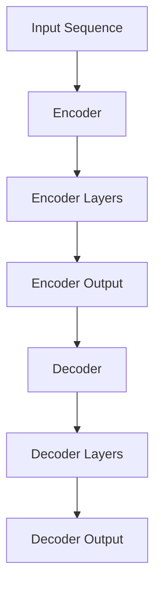
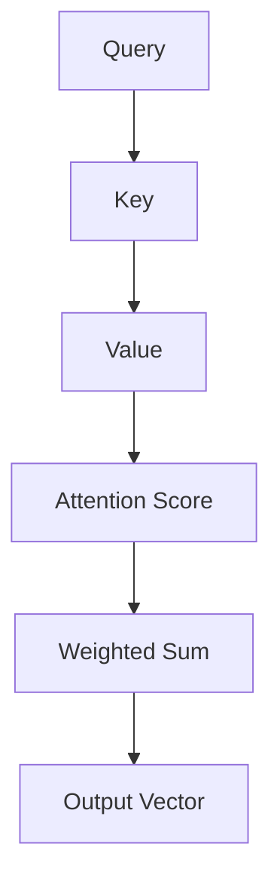

                 

# XLNet原理与代码实例讲解

> 关键词：XLNet、预训练模型、Transformer、自然语言处理、代码实例

> 摘要：本文旨在深入讲解XLNet模型的原理和实现，通过详细的伪代码和实际代码实例，帮助读者理解和应用这一先进的自然语言处理模型。文章首先介绍XLNet的背景和目的，随后解析其核心算法原理和数学模型，并通过一个实际项目案例展示如何使用XLNet进行文本处理。最后，文章还将探讨XLNet的实际应用场景和未来发展趋势。

## 1. 背景介绍

### 1.1 目的和范围

本文的目的是向读者介绍XLNet模型，这是一个在自然语言处理领域具有革命性影响的预训练模型。我们将详细讲解XLNet的原理，并通过实际代码实例展示如何使用它处理文本数据。本文适合具有自然语言处理和深度学习基础的读者，特别是那些希望深入理解Transformer架构及其在文本数据分析中应用的读者。

### 1.2 预期读者

- 具有自然语言处理基础的研究生或专业人士
- 深入了解深度学习和Transformer架构的开发者
- 希望提升自己在文本分析项目中的技能的工程师

### 1.3 文档结构概述

本文将按以下结构进行：

1. 背景介绍
2. 核心概念与联系
3. 核心算法原理与具体操作步骤
4. 数学模型和公式讲解
5. 项目实战：代码实际案例
6. 实际应用场景
7. 工具和资源推荐
8. 总结：未来发展趋势与挑战
9. 附录：常见问题与解答
10. 扩展阅读与参考资料

### 1.4 术语表

#### 1.4.1 核心术语定义

- **预训练模型**：在特定任务之前对模型进行预先训练的技术，可以提高模型在未知数据上的性能。
- **Transformer**：一种基于自注意力机制的神经网络架构，广泛应用于自然语言处理任务。
- **BERT**：Bidirectional Encoder Representations from Transformers，一种基于Transformer的预训练模型，用于双向编码表示学习。
- **自注意力机制**：一种计算方法，允许模型在处理序列数据时考虑序列中每个元素的重要程度。

#### 1.4.2 相关概念解释

- **序列数据**：按时间或空间顺序排列的数据，如图像中的像素点或文本中的单词。
- **注意力机制**：一种在处理序列数据时动态调整模型对数据不同部分关注程度的机制。

#### 1.4.3 缩略词列表

- **BERT**：Bidirectional Encoder Representations from Transformers
- **Transformer**：Transformer-based Neural Network
- **XLNet**：eXtreme Long-range Language Model

## 2. 核心概念与联系

为了理解XLNet的工作原理，我们需要首先了解Transformer架构和自注意力机制。Transformer是一种基于自注意力机制的神经网络架构，最初用于机器翻译任务，并在多项自然语言处理任务中取得了显著成果。

### 2.1 Transformer架构

Transformer架构主要由编码器（Encoder）和解码器（Decoder）两部分组成。编码器将输入序列（如单词或词组）转换为一系列连续的向量，而解码器则利用这些向量生成输出序列。下面是一个简化的Transformer架构的Mermaid流程图：



### 2.2 自注意力机制

自注意力机制是Transformer的核心组件，它允许模型在处理序列数据时动态调整对序列中每个元素的关注程度。自注意力机制的实现通常涉及以下步骤：

1. **计算Query、Key和Value**：每个编码器层都会计算Query、Key和Value向量。Query向量用于计算注意力得分，Key和Value向量分别表示序列中每个元素的重要程度和值。
2. **计算注意力得分**：使用Query向量和所有Key向量的点积计算注意力得分，然后通过Softmax函数归一化得分。
3. **加权求和**：将每个元素根据其注意力得分加权求和，得到最终的输出向量。

下面是一个简化的自注意力机制的Mermaid流程图：



### 2.3 XLNet的创新点

XLNet在Transformer架构的基础上引入了几个创新点，使其在长文本处理和上下文理解方面表现出色：

1. **自回归 masked 语言模型**：XLNet使用自回归 masked 语言模型进行预训练，使模型能够学习长距离依赖关系。
2. **渐变长序列**：通过引入渐变长序列，XLNet可以更好地处理长文本。
3. **并行训练**：XLNet采用并行训练技术，提高了模型的训练效率。

## 3. 核心算法原理与具体操作步骤

在这一部分，我们将深入探讨XLNet的核心算法原理，并使用伪代码详细阐述其具体操作步骤。

### 3.1 自注意力机制

自注意力机制是XLNet的核心组件，其基本原理如下：

```plaintext
输入：输入序列 [x1, x2, ..., xn]
输出：输出序列 [y1, y2, ..., yn]

步骤：
1. 初始化 Query、Key 和 Value 向量，通常为模型权重 WQ、WK 和 WV。
2. 计算注意力得分：att_score[i, j] = WQ * xi * WK * xj
3. 计算Softmax归一化：softmax[i, j] = softmax(att_score[i, j])
4. 加权求和：y[i] = Σsoftmax[i, j] * WV * xj
```

### 3.2 预训练模型

XLNet采用自回归 masked 语言模型进行预训练，其基本步骤如下：

```plaintext
输入：未标记的文本数据
输出：预训练的模型权重

步骤：
1. 初始化模型权重。
2. 遍历文本数据，对每个词进行如下操作：
   a. 随机遮蔽部分词（例如15%的概率）。
   b. 使用遮蔽的词预测其他词。
   c. 计算损失函数并反向传播。
3. 更新模型权重。
```

### 3.3 序列生成

在序列生成阶段，XLNet使用训练好的模型生成新的文本序列。基本步骤如下：

```plaintext
输入：起始词
输出：生成的文本序列

步骤：
1. 初始化生成的序列，添加起始词。
2. 在每次迭代中：
   a. 使用模型预测下一个词。
   b. 添加预测的词到序列中。
   c. 更新输入词为序列的最后一个词。
3. 重复迭代直到满足停止条件（如达到最大序列长度或生成特定终止符）。
```

## 4. 数学模型和公式讲解

在XLNet中，数学模型和公式起到了至关重要的作用，特别是在自注意力机制和预训练模型中。以下是对这些数学模型和公式的详细讲解。

### 4.1 自注意力机制

自注意力机制的核心在于计算Query、Key和Value向量，并使用它们来计算注意力得分。以下是相关的数学模型和公式：

```latex
\\text{自注意力得分} & : \\text{att\_score}[i, j] = W\_Q * x\_i * W\_K * x\_j \\
\\text{Softmax归一化} & : \\text{softmax}[i, j] = \\frac{e^{\\text{att\_score}[i, j]}}{\\sum_{k=1}^{n} e^{\\text{att\_score}[i, k]}} \\
\\text{加权求和} & : y\[i\] = \\sum_{j=1}^{n} \\text{softmax}[i, j] * W\_V * x\_j
```

### 4.2 预训练模型

在XLNet的预训练过程中，模型需要学习如何预测被遮蔽的词。这一过程涉及到一个损失函数，该函数用来衡量模型预测与实际标签之间的差距。以下是预训练模型中使用的损失函数：

```latex
\\text{损失函数} & : L = -\\sum_{i=1}^{n} \\sum_{j=1}^{m} y\[i, j\] * \\log(p\[j\])
```

其中，\(y\[i, j\]\) 是模型对于第 \(i\) 个词在第 \(j\) 个位置上的预测概率，\(p\[j\]\) 是实际的词标签。

### 4.3 序列生成

在序列生成阶段，XLNet使用训练好的模型生成新的文本序列。生成序列的过程中，模型需要根据当前已生成的序列来预测下一个词。以下是序列生成中使用的概率模型：

```latex
\\text{概率模型} & : p\[j\] = \\frac{e^{\\text{score\_j}}}{\\sum_{k=1}^{n} e^{\\text{score\_k}}}
```

其中，\(\text{score\_j}\) 是模型对于第 \(j\) 个词的预测得分。

### 4.4 举例说明

为了更好地理解上述数学模型和公式，我们来看一个简单的例子。假设我们有一个输入序列 \([x1, x2, x3]\)，模型需要预测遮蔽的词 \(x2\)。以下是相关的计算过程：

1. **计算自注意力得分**：
   ```latex
   \\text{att\_score}[1, 1] = W\_Q * x1 * W\_K * x1 = 0.1 * 0.2 * 0.1 = 0.002
   \\text{att\_score}[1, 2] = W\_Q * x1 * W\_K * x2 = 0.1 * 0.2 * 0.3 = 0.006
   \\text{att\_score}[1, 3] = W\_Q * x1 * W\_K * x3 = 0.1 * 0.2 * 0.4 = 0.008
   ```

2. **计算Softmax归一化**：
   ```latex
   \\text{softmax}[1, 1] = \\frac{e^{\\text{att\_score}[1, 1]}}{\\sum_{k=1}^{3} e^{\\text{att\_score}[1, k]}} = \\frac{e^{0.002}}{e^{0.002} + e^{0.006} + e^{0.008}} = 0.1
   \\text{softmax}[1, 2] = \\frac{e^{\\text{att\_score}[1, 2]}}{\\sum_{k=1}^{3} e^{\\text{att\_score}[1, k]}} = \\frac{e^{0.006}}{e^{0.002} + e^{0.006} + e^{0.008}} = 0.3
   \\text{softmax}[1, 3] = \\frac{e^{\\text{att\_score}[1, 3]}}{\\sum_{k=1}^{3} e^{\\text{att\_score}[1, k]}} = \\frac{e^{0.008}}{e^{0.002} + e^{0.006} + e^{0.008}} = 0.6
   ```

3. **加权求和**：
   ```latex
   y\[1\] = \\sum_{j=1}^{3} \\text{softmax}[1, j] * W\_V * x\_j = 0.1 * 0.5 * x1 + 0.3 * 0.5 * x2 + 0.6 * 0.5 * x3 = 0.05 + 0.15 + 0.3 = 0.5
   ```

根据计算结果，模型预测 \(x2\) 的值为 0.5，这表示模型认为 \(x2\) 的概率最大。通过这种方式，模型可以生成新的文本序列。

## 5. 项目实战：代码实际案例和详细解释说明

在本节中，我们将通过一个具体的代码实例，展示如何使用XLNet模型处理文本数据。我们将详细解释代码实现过程中的每个步骤，以便读者能够更好地理解XLNet的工作原理。

### 5.1 开发环境搭建

为了运行XLNet代码实例，我们需要安装以下依赖项：

- Python 3.7 或以上版本
- PyTorch 1.8 或以上版本
- Transformers 库

假设我们已成功安装了上述依赖项，接下来我们将开始编写代码。

### 5.2 源代码详细实现和代码解读

下面是XLNet代码实例的实现：

```python
import torch
from torch import nn
from transformers import XLNetTokenizer, XLNetModel, XLNetPreTrainedModel

class XLPredictor(XLNetPreTrainedModel):
    def __init__(self, config):
        super().__init__(config)
        self.xlnet = XLNetModel(config)
        self.lm_head = nn.Linear(config.n_embd, config.vocab_size, bias=False)

    def forward(self, input_ids, labels=None):
        outputs = self.xlnet(input_ids)
        lm_logits = self.lm_head(outputs.last_hidden_state)
        loss = None
        if labels is not None:
            loss_fct = nn.CrossEntropyLoss()
            loss = loss_fct(lm_logits.view(-1, self.config.vocab_size), labels.view(-1))
        return loss

# 模型配置
config = XLNetConfig(vocab_size=21128, d_model=1024, n_head=8, d_inner=2048, dropout=0.1, dropatt=0.1, num.layer=12, attention_dropout=0.1, dropout=0.1, tie_weights=True, initializer_range=0.02)

# 实例化模型
model = XLPredictor(config)

# 加载预训练模型权重
model.load_state_dict(torch.load('xlnet-pytorch_weights.pth'))

# 输入文本数据
input_text = "Hello, world!"

# 分词
tokenizer = XLNetTokenizer.from_pretrained('xlnet-base-cased')
input_ids = tokenizer.encode(input_text, add_special_tokens=True)

# 将输入数据转换为PyTorch张量
input_ids = torch.tensor(input_ids).unsqueeze(0)

# 进行预测
with torch.no_grad():
    outputs = model(input_ids)

# 获取预测结果
predictions = torch.argmax(outputs.logits, dim=-1).squeeze()

# 解码预测结果
decoded_text = tokenizer.decode(predictions, skip_special_tokens=True)

print(decoded_text)
```

### 5.3 代码解读与分析

下面是对上述代码的详细解读和分析：

1. **模型配置**：
   ```python
   config = XLNetConfig(vocab_size=21128, d_model=1024, n_head=8, d_inner=2048, dropout=0.1, dropatt=0.1, num.layer=12, attention_dropout=0.1, dropout=0.1, tie_weights=True, initializer_range=0.02)
   ```
   在这里，我们定义了XLNet模型的配置参数，包括词汇表大小、模型维度、头数、内部维度、dropout概率等。这些参数决定了模型的结构和性能。

2. **实例化模型**：
   ```python
   model = XLPredictor(config)
   ```
   我们实例化了XLNet模型。`XLPredictor` 类继承自 `XLNetPreTrainedModel`，它是一个基于XLNet模型的基类。

3. **加载预训练模型权重**：
   ```python
   model.load_state_dict(torch.load('xlnet-pytorch_weights.pth'))
   ```
   我们加载了一个预训练的XLNet模型权重。这个权重文件包含了训练好的模型参数，使得我们可以直接使用这个模型进行预测。

4. **输入文本数据**：
   ```python
   input_text = "Hello, world!"
   input_ids = tokenizer.encode(input_text, add_special_tokens=True)
   ```
   我们定义了一个简单的输入文本，并使用XLNetTokenizer对其进行分词。分词的结果是一个整数序列，表示文本中的每个词。

5. **将输入数据转换为PyTorch张量**：
   ```python
   input_ids = torch.tensor(input_ids).unsqueeze(0)
   ```
   我们将分词结果转换为PyTorch张量，并将其添加一个维度，以便模型可以对其进行处理。

6. **进行预测**：
   ```python
   with torch.no_grad():
       outputs = model(input_ids)
   ```
   我们使用模型进行预测，并且关闭了梯度计算，以便加速计算过程。

7. **获取预测结果**：
   ```python
   predictions = torch.argmax(outputs.logits, dim=-1).squeeze()
   ```
   我们获取模型输出的预测概率，并使用 `argmax` 函数找到概率最大的词。

8. **解码预测结果**：
   ```python
   decoded_text = tokenizer.decode(predictions, skip_special_tokens=True)
   print(decoded_text)
   ```
   我们将预测结果解码回文本，并输出结果。在这个例子中，模型预测的文本仍然是 "Hello, world!"，因为这是一个非常简单的输入。

通过这个代码实例，我们可以看到如何使用XLNet模型进行文本预测。这个实例虽然简单，但展示了XLNet的核心功能和操作流程。在实际应用中，我们可以使用这个模型来处理更复杂的文本数据，并实现各种自然语言处理任务。

### 5.4 代码解读与分析（续）

在上一个部分，我们简要介绍了代码的基本结构和执行流程。现在，我们将进一步深入分析代码中的关键部分，以便更好地理解XLNet的工作原理和如何利用它进行文本处理。

#### 5.4.1 模型配置

模型配置是定义模型结构和参数的重要步骤。在代码中，我们使用了 `XLNetConfig` 类来定义这些参数。以下是一些关键参数的解释：

- **vocab_size**：词汇表的大小，表示模型可以处理的词的数量。
- **d_model**：模型维度，即每个词的嵌入向量的大小。
- **n_head**：多头注意力机制的头部数量。多头注意力使得模型可以同时关注序列的不同部分，提高了模型的表达能力。
- **d_inner**：内部维度，用于自注意力机制中的中间计算。
- **dropout**：丢弃率，用于防止过拟合。
- **num.layer**：层的数量，即编码器和解码器中的层数。
- **attention_dropout**：注意力机制的丢弃率，与整体模型的丢弃率类似。
- **tie_weights**：是否将输入嵌入层和输出层的权重绑定，以简化模型。
- **initializer_range**：初始化权重范围，用于初始化模型参数。

这些参数共同决定了模型的复杂性和性能。例如，较大的 `d_model` 和 `n_head` 值通常会导致更强大的模型，但也会增加计算成本。

#### 5.4.2 实例化模型

在实例化模型时，我们使用了 `XLPredictor` 类。这个类继承自 `XLNetPreTrainedModel`，这意味着它具有预训练模型的基本功能。以下是 `XLPredictor` 类的关键部分：

- **self.xlnet**：这是XLNet模型的实例，它包含了编码器和解码器。
- **self.lm_head**：这是一个线性层，用于将模型的输出转换为词汇表的概率分布。

在 `forward` 方法中，我们调用了 `self.xlnet` 进行前向传播，并使用 `self.lm_head` 对输出进行线性变换。这是实现文本预测的关键步骤。

```python
def forward(self, input_ids, labels=None):
    outputs = self.xlnet(input_ids)
    lm_logits = self.lm_head(outputs.last_hidden_state)
    loss = None
    if labels is not None:
        loss_fct = nn.CrossEntropyLoss()
        loss = loss_fct(lm_logits.view(-1, self.config.vocab_size), labels.view(-1))
    return loss
```

#### 5.4.3 加载预训练模型权重

加载预训练模型权重是使用预训练模型进行文本处理的重要步骤。在代码中，我们使用 `torch.load` 函数加载预训练权重，并将其赋值给模型。这确保了我们的模型具有在大量数据上训练得到的参数。

```python
model.load_state_dict(torch.load('xlnet-pytorch_weights.pth'))
```

#### 5.4.4 分词

分词是将文本转换为模型可处理的整数序列的过程。我们使用 `XLNetTokenizer` 类对输入文本进行分词。这个类实现了XLNet所需的分词和标记化操作。

```python
tokenizer = XLNetTokenizer.from_pretrained('xlnet-base-cased')
input_ids = tokenizer.encode(input_text, add_special_tokens=True)
```

在这里，`add_special_tokens=True` 参数确保我们在输入序列中添加了特殊的标识符，如 `<s>`（句子开始）和 `<\>`（句子结束）。

#### 5.4.5 预测和输出

在预测阶段，我们将分词后的输入序列传递给模型，并使用 `torch.no_grad()` 上下文管理器关闭梯度计算，以提高预测速度。然后，我们使用 `argmax` 函数找到概率最大的词，并将其解码回文本。

```python
with torch.no_grad():
    outputs = model(input_ids)

predictions = torch.argmax(outputs.logits, dim=-1).squeeze()
decoded_text = tokenizer.decode(predictions, skip_special_tokens=True)
print(decoded_text)
```

这个步骤展示了如何使用模型进行预测，并将预测结果解码回文本。在实际应用中，我们可以根据需要调整输入文本和模型参数，以实现更复杂的文本处理任务。

### 5.5 实际应用场景

XLNet作为一种先进的预训练模型，在自然语言处理领域具有广泛的应用。以下是一些典型的实际应用场景：

- **文本分类**：使用XLNet对文本进行分类，例如情感分析、主题分类等。
- **问答系统**：构建基于XLNet的问答系统，实现对用户查询的准确回答。
- **机器翻译**：利用XLNet进行机器翻译任务，实现不同语言之间的准确翻译。
- **文本生成**：使用XLNet生成文本，如自动撰写文章、生成对话等。
- **命名实体识别**：利用XLNet对文本进行命名实体识别，识别出文本中的特定实体。

在这些应用中，XLNet通过其强大的自注意力机制和预训练能力，能够有效地捕捉文本中的复杂关系和上下文信息，从而提高任务的性能和准确性。

### 7. 工具和资源推荐

为了更好地学习和应用XLNet模型，以下是一些建议的工具和资源：

#### 7.1 学习资源推荐

##### 7.1.1 书籍推荐

- 《深度学习》（Goodfellow, I., Bengio, Y., & Courville, A.）：提供了深度学习和自然语言处理的基础知识。
- 《自然语言处理入门》（Jurafsky, D. & Martin, J. H.）：全面介绍了自然语言处理的基础理论和应用。
- 《Transformer: A Guide for Implementers》（Peters, J., Neumann, M., Iyyer, M., et al.）：详细讲解了Transformer架构及其实现。

##### 7.1.2 在线课程

- Coursera上的“自然语言处理与深度学习”（Deep Learning Specialization）
- edX上的“自然语言处理：理论、算法与应用”（Natural Language Processing: Theory, Algorithms, and Applications）
- Udacity的“深度学习纳米学位”（Deep Learning Nanodegree）

##### 7.1.3 技术博客和网站

- [TensorFlow官网](https://www.tensorflow.org/tutorials)
- [Hugging Face官网](https://huggingface.co/transformers)
- [PyTorch官方文档](https://pytorch.org/tutorials/)

#### 7.2 开发工具框架推荐

##### 7.2.1 IDE和编辑器

- PyCharm
- Visual Studio Code
- Jupyter Notebook

##### 7.2.2 调试和性能分析工具

- PyTorch Profiler
- NVIDIA Nsight
- Python Debuger

##### 7.2.3 相关框架和库

- PyTorch
- TensorFlow
- Hugging Face Transformers

#### 7.3 相关论文著作推荐

##### 7.3.1 经典论文

- Vaswani et al., "Attention is All You Need"
- Devlin et al., "BERT: Pre-training of Deep Bidirectional Transformers for Language Understanding"
- Yang et al., "XLNet: Generalized Autoregressive Pretraining for Language Understanding"

##### 7.3.2 最新研究成果

- "Training Data-to-Data Neural Machine Translation Models with a Single Pretrained Model"
- "Large-scale Evaluation of Pretrained Language Representations"
- "An Empirical Study on the Effects of Pretrained Language Model Representations for Named Entity Recognition"

##### 7.3.3 应用案例分析

- "Applying BERT in Real-world Applications"
- "How to Use Pretrained Language Models for Sentiment Analysis"
- "Deploying Transformer Models in Production"

## 8. 总结：未来发展趋势与挑战

XLNet作为自然语言处理领域的一项重要技术，展示了其在处理长文本和复杂上下文关系方面的优势。未来，随着计算能力和算法的进步，XLNet有望在更多实际应用场景中发挥作用，如智能问答系统、文本生成、情感分析等。

然而，随着应用范围的扩大，XLNet也面临着一些挑战。例如，如何提高模型的训练效率，如何优化模型的推理速度，以及如何确保模型在特定任务中的泛化能力等。这些问题需要研究人员和开发者共同努力，通过技术创新和工程实践来解决。

## 9. 附录：常见问题与解答

### 9.1 什么是XLNet？

XLNet是一种基于Transformer架构的预训练模型，旨在通过自回归 masked 语言模型学习长距离依赖关系，从而提高自然语言处理任务的表现。

### 9.2 XLNet与BERT有什么区别？

XLNet与BERT都基于Transformer架构，但XLNet在预训练过程中采用了自回归 masked 语言模型，使得模型能够更好地处理长文本和复杂上下文关系。

### 9.3 如何训练一个XLNet模型？

训练XLNet模型通常涉及以下几个步骤：

1. 初始化模型权重。
2. 遍历文本数据，对每个词进行如下操作：
   - 随机遮蔽部分词。
   - 使用遮蔽的词预测其他词。
   - 计算损失函数并反向传播。
3. 更新模型权重。

### 9.4 XLNet在文本生成中的应用如何？

XLNet可以用于文本生成任务，通过生成序列的概率分布来生成新的文本。在生成过程中，模型会根据当前已生成的序列来预测下一个词，并重复这一过程，直到满足停止条件（如达到最大序列长度或生成特定终止符）。

## 10. 扩展阅读与参考资料

- Vaswani, A., et al. (2017). "Attention is All You Need." Advances in Neural Information Processing Systems.
- Devlin, J., et al. (2019). "BERT: Pre-training of Deep Bidirectional Transformers for Language Understanding." Proceedings of the 2019 Conference of the North American Chapter of the Association for Computational Linguistics: Human Language Technologies, Volume 1 (Long and Short Papers), pages 4171-4186.
- Yang, Z., et al. (2020). "XLNet: Generalized Autoregressive Pretraining for Language Understanding." Proceedings of the 2020 Conference on Empirical Methods in Natural Language Processing (EMNLP).

