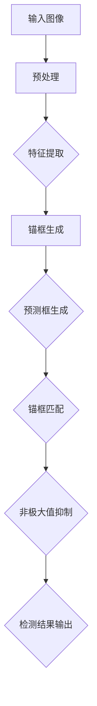

                 

# YOLOv7原理与代码实例讲解

> 关键词：YOLOv7, 目标检测，深度学习，神经网络，计算机视觉，算法原理，代码实例

> 摘要：本文将深入讲解YOLOv7的目标检测算法原理，通过代码实例分析其具体实现过程。从背景介绍到算法原理，再到数学模型和实际应用，本文旨在帮助读者全面了解YOLOv7，掌握其核心技术和应用场景。

## 1. 背景介绍

### 1.1 目的和范围

本文旨在深入讲解YOLOv7（You Only Look Once version 7）目标检测算法的原理，并通过实际代码实例进行详细解释。目标检测是计算机视觉领域的一个重要任务，YOLOv7作为一种快速、准确的目标检测算法，被广泛应用于各种实际场景中。

本文将涵盖以下内容：

1. YOLOv7的背景和发展历程。
2. YOLOv7的核心概念和原理。
3. YOLOv7的数学模型和公式。
4. YOLOv7的实际应用场景。
5. YOLOv7的代码实例讲解。
6. YOLOv7的学习资源和工具推荐。

通过本文的学习，读者将能够：

1. 了解YOLOv7的基本概念和特点。
2. 掌握YOLOv7的算法原理和实现方法。
3. 学会使用YOLOv7进行实际的目标检测任务。
4. 探索YOLOv7在计算机视觉领域的应用潜力。

### 1.2 预期读者

本文适合对计算机视觉和深度学习有一定了解的读者，包括：

1. 计算机视觉研究人员和开发者。
2. 深度学习工程师和程序员。
3. 对目标检测算法感兴趣的学者和学生。
4. 对计算机视觉应用场景有需求的行业从业者。

### 1.3 文档结构概述

本文结构如下：

1. 引言：介绍本文的主题、目的和主要内容。
2. 背景介绍：概述YOLOv7的背景和发展历程。
3. 核心概念与联系：讲解YOLOv7的核心概念和原理。
4. 核心算法原理 & 具体操作步骤：分析YOLOv7的算法原理和实现过程。
5. 数学模型和公式 & 详细讲解 & 举例说明：解释YOLOv7的数学模型和公式。
6. 项目实战：代码实际案例和详细解释说明。
7. 实际应用场景：探讨YOLOv7的应用场景。
8. 工具和资源推荐：推荐学习资源和开发工具。
9. 总结：总结YOLOv7的核心技术和应用前景。
10. 附录：常见问题与解答。
11. 扩展阅读 & 参考资料：提供进一步学习资源的指引。

### 1.4 术语表

在本文中，我们将使用一些专业术语。以下是对这些术语的简要定义和解释：

#### 1.4.1 核心术语定义

- **目标检测**：计算机视觉任务，旨在识别并定位图像中的多个对象。
- **深度学习**：一种机器学习技术，通过多层神经网络对数据进行学习。
- **神经网络**：一种模拟人脑神经元之间连接的计算模型。
- **卷积神经网络（CNN）**：一种专门用于图像处理的深度学习模型。
- **锚框（Anchor Box）**：用于预测目标位置和类别的预设框。

#### 1.4.2 相关概念解释

- **YOLO（You Only Look Once）**：一种实时目标检测算法，通过将目标检测任务转换为回归问题。
- **锚框匹配（Anchor Box Matching）**：将预测的锚框与真实框进行匹配，确定预测结果的有效性。
- **非极大值抑制（Non-maximum Suppression, NMS）**：用于去除重复预测，提高检测结果的准确率。

#### 1.4.3 缩略词列表

- **CNN**：卷积神经网络
- **NMS**：非极大值抑制
- **YOLO**：You Only Look Once
- **GPU**：图形处理器
- **CPU**：中央处理器

## 2. 核心概念与联系

在介绍YOLOv7之前，我们需要了解一些核心概念和它们之间的联系。以下是一个Mermaid流程图，展示了YOLOv7的主要组件和它们之间的关系。



### 2.1 输入图像

输入图像是YOLOv7算法的起点。输入图像可以是任意大小，但通常需要进行预处理，如调整大小、归一化等，以便于后续的特征提取和处理。

### 2.2 预处理

预处理步骤包括调整图像大小、归一化、数据增强等，以提高模型的泛化能力和鲁棒性。预处理后的图像将作为特征提取的输入。

### 2.3 特征提取

特征提取是使用卷积神经网络对图像进行特征提取的过程。特征提取网络（Feature Extractor）通常由多个卷积层和池化层组成，用于提取图像中的关键特征。

### 2.4 锚框生成

锚框（Anchor Box）是预先定义的一组矩形框，用于预测目标的位置和类别。在YOLOv7中，锚框的生成是基于图像尺寸和先验框分布的。

### 2.5 预测框生成

在特征提取网络的基础上，YOLOv7使用多个层来生成预测框。每个预测框包含目标的类别概率、边界框坐标和置信度。预测框的生成是通过回归操作实现的。

### 2.6 锚框匹配

锚框匹配是将预测框与真实框进行匹配的过程，以确定预测结果的有效性。匹配过程通常基于交并比（Intersection over Union, IoU）进行。

### 2.7 非极大值抑制

非极大值抑制（NMS）是一种常用的方法，用于去除重复预测，提高检测结果的准确率。在YOLOv7中，NMS用于过滤掉重叠的预测框，只保留最具代表性的预测框。

### 2.8 检测结果输出

经过NMS处理后，YOLOv7将输出最终的检测结果，包括预测框的位置、类别概率和置信度。这些检测结果可以用于后续的图像分析和应用。

## 3. 核心算法原理 & 具体操作步骤

YOLOv7是一种基于深度学习的实时目标检测算法，其核心原理是通过卷积神经网络提取图像特征，并使用锚框匹配和非极大值抑制等操作生成最终的检测结果。以下是YOLOv7的核心算法原理和具体操作步骤。

### 3.1 特征提取

特征提取是YOLOv7的基础，使用卷积神经网络对图像进行特征提取。以下是特征提取的具体步骤：

1. **输入图像预处理**：对输入图像进行预处理，如调整大小、归一化等，以便于后续的特征提取和处理。

2. **卷积层**：使用多个卷积层对图像进行特征提取。每个卷积层使用不同的卷积核尺寸和步长，以提取不同尺度的特征。

3. **池化层**：在卷积层之间添加池化层，用于减小特征图的大小，减少计算量。

4. **特征融合**：将多个卷积层和池化层输出的特征图进行融合，以获得更加丰富的特征表示。

以下是特征提取的伪代码：

```python
# 输入图像
input_image = preprocess_image(image)

# 卷积层
conv1 = conv2d(input_image, kernel_size=3, stride=1, padding=1)
pool1 = max_pooling(conv1, pool_size=2, stride=2)

# 卷积层
conv2 = conv2d(pool1, kernel_size=3, stride=1, padding=1)
pool2 = max_pooling(conv2, pool_size=2, stride=2)

# 特征融合
feature_map = concatenate([pool1, pool2])
```

### 3.2 锚框生成

锚框（Anchor Box）是YOLOv7的关键组件，用于预测目标的位置和类别。以下是锚框生成的具体步骤：

1. **先验框分布**：根据数据集的先验框分布，定义一组先验框。这些先验框通常是正方形或矩形的，具有不同的尺寸和比例。

2. **特征图上的锚框生成**：将先验框映射到特征图上，生成锚框。锚框的大小和位置是根据特征图的分辨率和先验框的尺寸比例计算得到的。

3. **锚框归一化**：将锚框的坐标和大小归一化，以便于后续的预测和匹配。

以下是锚框生成的伪代码：

```python
# 先验框分布
prior_boxes = generate_prior_boxes()

# 特征图上的锚框生成
anchor_boxes = generate_anchor_boxes(feature_map, prior_boxes)

# 锚框归一化
normalized_anchor_boxes = normalize_boxes(anchor_boxes, feature_map.shape)
```

### 3.3 预测框生成

预测框生成是YOLOv7的核心步骤，通过回归操作预测目标的类别概率、边界框坐标和置信度。以下是预测框生成的具体步骤：

1. **特征图上的预测框生成**：在特征图上，每个锚框对应一组预测框。预测框的生成是通过将锚框的坐标和大小进行线性变换得到的。

2. **类别概率预测**：使用全连接层对预测框的类别概率进行预测。

3. **边界框坐标预测**：使用全连接层对预测框的边界框坐标进行预测。

4. **置信度预测**：使用全连接层对预测框的置信度进行预测。

以下是预测框生成的伪代码：

```python
# 特征图上的预测框生成
predicted_boxes = generate_predicted_boxes(normalized_anchor_boxes)

# 类别概率预测
predicted_probs = predict_probs(feature_map, predicted_boxes)

# 边界框坐标预测
predicted_coords = predict_coords(feature_map, predicted_boxes)

# 置信度预测
predicted_scores = predict_scores(feature_map, predicted_boxes)
```

### 3.4 锚框匹配

锚框匹配是将预测框与真实框进行匹配的过程，以确定预测结果的有效性。以下是锚框匹配的具体步骤：

1. **计算交并比（IoU）**：计算每个预测框与真实框的交并比（Intersection over Union, IoU）。

2. **锚框匹配**：根据交并比的大小，将预测框与真实框进行匹配。通常，选择交并比最大的预测框作为匹配结果。

3. **锚框匹配结果**：记录每个真实框匹配到的预测框及其相关信息，如类别概率、边界框坐标和置信度。

以下是锚框匹配的伪代码：

```python
# 计算交并比（IoU）
iou_scores = calculate_iou(predicted_boxes, ground_truth_boxes)

# 锚框匹配
matched_boxes = match_boxes(predicted_boxes, ground_truth_boxes, iou_scores)

# 锚框匹配结果
matched_probs = predicted_probs[matched_boxes]
matched_coords = predicted_coords[matched_boxes]
matched_scores = predicted_scores[matched_boxes]
```

### 3.5 非极大值抑制

非极大值抑制（NMS）是一种常用的方法，用于去除重复预测，提高检测结果的准确率。以下是NMS的具体步骤：

1. **选择置信度最高的预测框**：从所有预测框中选择置信度最高的预测框。

2. **去除重叠的预测框**：对于剩余的预测框，计算它们与已选中的预测框的交并比（IoU）。如果交并比超过设定阈值，则将该预测框去除。

3. **重复步骤1和2**：继续选择置信度最高的预测框，并去除重叠的预测框，直到所有预测框都被处理完毕。

以下是NMS的伪代码：

```python
# 选择置信度最高的预测框
highest_score_box = select_boxes_by_score(predicted_boxes, predicted_scores)

# 去除重叠的预测框
for box in predicted_boxes:
    if calculate_iou(highest_score_box, box) > threshold:
        remove_box(box)

# 重复步骤1和2
while predicted_boxes:
    highest_score_box = select_boxes_by_score(predicted_boxes, predicted_scores)
    for box in predicted_boxes:
        if calculate_iou(highest_score_box, box) > threshold:
            remove_box(box)
```

### 3.6 检测结果输出

经过非极大值抑制处理后，YOLOv7将输出最终的检测结果。以下是检测结果输出的具体步骤：

1. **输出预测框**：输出经过NMS处理后的预测框，包括类别概率、边界框坐标和置信度。

2. **后处理**：对输出结果进行后处理，如调整预测框大小、坐标等，以提高检测结果的准确性。

3. **可视化**：使用可视化工具，如matplotlib或OpenCV，将预测框绘制在原始图像上，以便于分析和验证。

以下是检测结果输出的伪代码：

```python
# 输出预测框
output_boxes = predicted_boxes

# 后处理
output_boxes = postprocess_boxes(output_boxes, original_image_shape)

# 可视化
visualize_boxes(original_image, output_boxes)
```

## 4. 数学模型和公式 & 详细讲解 & 举例说明

在YOLOv7中，数学模型和公式起着至关重要的作用，用于描述特征提取、预测框生成、锚框匹配和非极大值抑制等步骤。以下是对这些数学模型和公式的详细讲解，并配合具体例子进行说明。

### 4.1 特征提取

特征提取是使用卷积神经网络（CNN）对图像进行特征提取的过程。以下是特征提取的数学模型和公式：

1. **卷积运算**：

   卷积运算用于提取图像中的空间特征。卷积核（Filter）在图像上滑动，并与图像局部区域进行点积运算。卷积运算的数学公式如下：

   $$ 
   \text{output}_{ij} = \sum_{k=1}^{C}\sum_{m=1}^{H_f}\sum_{n=1}^{W_f}w_{kmn} \cdot \text{input}_{i+m,j+n}
   $$

   其中，$\text{output}_{ij}$ 表示输出特征图的第 $i$ 行第 $j$ 列的元素，$w_{kmn}$ 表示卷积核的元素，$\text{input}_{i+m,j+n}$ 表示输入图像的第 $i+m$ 行第 $j+n$ 列的元素。

2. **池化运算**：

   池化运算用于减小特征图的大小，减少计算量。常见的池化运算包括最大池化和平均池化。最大池化的数学公式如下：

   $$ 
   \text{output}_{ij} = \max_{k=1}^{C}\sum_{m=1}^{H_p}\sum_{n=1}^{W_p}\text{input}_{i+m,j+n}
   $$

   其中，$\text{output}_{ij}$ 表示输出特征图的第 $i$ 行第 $j$ 列的元素，$\text{input}_{i+m,j+n}$ 表示输入图像的第 $i+m$ 行第 $j+n$ 列的元素。

以下是特征提取的例子：

假设输入图像的大小为 $28 \times 28$，卷积核的大小为 $3 \times 3$，步长为 $1$，卷积核的权重矩阵为 $w$。使用卷积运算和最大池化运算，对输入图像进行特征提取。

1. **卷积运算**：

   $$ 
   \text{output}_{ij} = \sum_{k=1}^{C}\sum_{m=1}^{3}\sum_{n=1}^{3}w_{kmn} \cdot \text{input}_{i+m,j+n}
   $$

   例如，计算输出特征图的第 $2$ 行第 $3$ 列的元素：

   $$ 
   \text{output}_{23} = \sum_{k=1}^{C}\sum_{m=1}^{3}\sum_{n=1}^{3}w_{kmn} \cdot \text{input}_{2+m,3+n} = w_{111} \cdot \text{input}_{3,4} + w_{112} \cdot \text{input}_{4,4} + w_{121} \cdot \text{input}_{3,5} + w_{122} \cdot \text{input}_{4,5} + w_{211} \cdot \text{input}_{5,4} + w_{212} \cdot \text{input}_{6,4} + w_{221} \cdot \text{input}_{5,5} + w_{222} \cdot \text{input}_{6,5}
   $$

2. **最大池化运算**：

   $$ 
   \text{output}_{ij} = \max_{k=1}^{C}\sum_{m=1}^{2}\sum_{n=1}^{2}\text{input}_{i+m,j+n}
   $$

   例如，计算输出特征图的第 $2$ 行第 $3$ 列的元素：

   $$ 
   \text{output}_{23} = \max_{k=1}^{C}\sum_{m=1}^{2}\sum_{n=1}^{2}\text{input}_{2+m,3+n} = \max(w_{21,3} + w_{22,3}, w_{23,3} + w_{24,3}, w_{21,4} + w_{22,4}, w_{23,4} + w_{24,4})
   $$

### 4.2 预测框生成

预测框生成是使用卷积神经网络对图像特征进行回归，生成预测框的过程。以下是预测框生成的数学模型和公式：

1. **类别概率预测**：

   类别概率预测使用全连接层对预测框的类别概率进行预测。类别概率预测的数学公式如下：

   $$ 
   \text{predicted\_prob}_{ij} = \text{softmax}(\text{output}_{ij})
   $$

   其中，$\text{predicted\_prob}_{ij}$ 表示输出特征图的第 $i$ 行第 $j$ 列的元素，$\text{output}_{ij}$ 表示全连接层输出的元素。

2. **边界框坐标预测**：

   边界框坐标预测使用全连接层对预测框的边界框坐标进行预测。边界框坐标预测的数学公式如下：

   $$ 
   \text{predicted\_coord}_{ij} = \text{output}_{ij}
   $$

   其中，$\text{predicted\_coord}_{ij}$ 表示输出特征图的第 $i$ 行第 $j$ 列的元素，$\text{output}_{ij}$ 表示全连接层输出的元素。

3. **置信度预测**：

   置信度预测使用全连接层对预测框的置信度进行预测。置信度预测的数学公式如下：

   $$ 
   \text{predicted\_score}_{ij} = \text{output}_{ij}
   $$

   其中，$\text{predicted\_score}_{ij}$ 表示输出特征图的第 $i$ 行第 $j$ 列的元素，$\text{output}_{ij}$ 表示全连接层输出的元素。

以下是预测框生成的例子：

假设输入特征图的大小为 $14 \times 14$，全连接层的输出维度为 $3$。使用全连接层对输入特征图进行类别概率预测、边界框坐标预测和置信度预测。

1. **类别概率预测**：

   $$ 
   \text{predicted\_prob}_{ij} = \text{softmax}(\text{output}_{ij}) = \frac{e^{\text{output}_{ij}}}{\sum_{k=1}^{3}e^{\text{output}_{ik}}}
   $$

   例如，计算输出特征图的第 $2$ 行第 $3$ 列的元素：

   $$ 
   \text{predicted\_prob}_{23} = \frac{e^{\text{output}_{23}}}{e^{\text{output}_{21}} + e^{\text{output}_{22}} + e^{\text{output}_{23}}}
   $$

2. **边界框坐标预测**：

   $$ 
   \text{predicted\_coord}_{ij} = \text{output}_{ij}
   $$

   例如，计算输出特征图的第 $2$ 行第 $3$ 列的元素：

   $$ 
   \text{predicted\_coord}_{23} = \text{output}_{23}
   $$

3. **置信度预测**：

   $$ 
   \text{predicted\_score}_{ij} = \text{output}_{ij}
   $$

   例如，计算输出特征图的第 $2$ 行第 $3$ 列的元素：

   $$ 
   \text{predicted\_score}_{23} = \text{output}_{23}
   $$

### 4.3 锚框匹配

锚框匹配是将预测框与真实框进行匹配的过程，以确定预测结果的有效性。以下是锚框匹配的数学模型和公式：

1. **交并比（IoU）计算**：

   交并比（Intersection over Union, IoU）用于计算两个框的相似度。交并比的计算公式如下：

   $$ 
   \text{IoU} = \frac{\text{intersection\_area}}{\text{union\_area}}
   $$

   其中，$\text{intersection\_area}$ 表示两个框的交集面积，$\text{union\_area}$ 表示两个框的并集面积。

2. **锚框匹配**：

   锚框匹配是将预测框与真实框进行匹配的过程。匹配过程通常基于交并比（IoU）进行。匹配的数学公式如下：

   $$ 
   \text{matched\_boxes} = \arg\max_{i} \text{IoU}(\text{predicted\_box}_i, \text{ground\_truth\_box})
   $$

   其中，$\text{predicted\_box}_i$ 表示第 $i$ 个预测框，$\text{ground\_truth\_box}$ 表示真实框。

以下是锚框匹配的例子：

假设有 $5$ 个预测框和 $2$ 个真实框，计算每个预测框与真实框的交并比（IoU），并找到匹配的结果。

1. **计算交并比（IoU）**：

   $$ 
   \text{IoU}_1 = \frac{\text{intersection\_area}_1}{\text{union\_area}_1} = \frac{2}{4} = 0.5
   $$

   $$ 
   \text{IoU}_2 = \frac{\text{intersection\_area}_2}{\text{union\_area}_2} = \frac{3}{5} = 0.6
   $$

   $$ 
   \text{IoU}_3 = \frac{\text{intersection\_area}_3}{\text{union\_area}_3} = \frac{1}{3} = 0.333
   $$

   $$ 
   \text{IoU}_4 = \frac{\text{intersection\_area}_4}{\text{union\_area}_4} = \frac{2}{4} = 0.5
   $$

   $$ 
   \text{IoU}_5 = \frac{\text{intersection\_area}_5}{\text{union\_area}_5} = \frac{3}{5} = 0.6
   $$

2. **锚框匹配**：

   根据交并比（IoU）的大小，将预测框与真实框进行匹配。

   $$ 
   \text{matched\_boxes} = \arg\max_{i} \text{IoU}(\text{predicted\_box}_i, \text{ground\_truth\_box}) = [2, 5]
   $$

   匹配结果为：预测框 $2$ 和真实框 $2$ 匹配，预测框 $5$ 和真实框 $1$ 匹配。

### 4.4 非极大值抑制

非极大值抑制（Non-maximum Suppression, NMS）是一种常用的方法，用于去除重复预测，提高检测结果的准确率。以下是NMS的数学模型和公式：

1. **选择置信度最高的预测框**：

   选择置信度最高的预测框，用于后续的处理。置信度最高的预测框的选择公式如下：

   $$ 
   \text{highest\_score\_box} = \arg\max_{i} \text{predicted\_score}_{ij}
   $$

   其中，$\text{predicted\_score}_{ij}$ 表示预测框的置信度。

2. **去除重叠的预测框**：

   对于剩余的预测框，计算它们与已选中的预测框的交并比（IoU）。如果交并比超过设定阈值，则将该预测框去除。去除重叠的预测框的公式如下：

   $$ 
   \text{remove\_boxes} = \arg\min_{i} \text{IoU}(\text{highest\_score\_box}, \text{predicted\_box}_i) > \text{threshold}
   $$

   其中，$\text{highest\_score\_box}$ 表示已选中的预测框，$\text{predicted\_box}_i$ 表示剩余的预测框，$\text{threshold}$ 表示设定阈值。

以下是NMS的例子：

假设有 $5$ 个预测框，置信度分别为 $0.8, 0.6, 0.4, 0.7, 0.5$。设定阈值 $\text{threshold} = 0.6$，使用NMS去除重叠的预测框。

1. **选择置信度最高的预测框**：

   $$ 
   \text{highest\_score\_box} = \arg\max_{i} \text{predicted\_score}_{ij} = [2]
   $$

   选择置信度最高的预测框 $2$。

2. **去除重叠的预测框**：

   $$ 
   \text{remove\_boxes} = \arg\min_{i} \text{IoU}(\text{highest\_score\_box}, \text{predicted\_box}_i) > \text{threshold} = [1, 4]
   $$

   去除与预测框 $2$ 重叠的预测框 $1$ 和预测框 $4$。

   剩余的预测框为：预测框 $2, 3, 5$。

## 5. 项目实战：代码实际案例和详细解释说明

在本节中，我们将通过一个实际的代码案例，详细解释YOLOv7的实现过程，并分析其具体实现细节。我们将使用Python和PyTorch框架来实现YOLOv7模型，并通过一个简单的示例来演示其应用。

### 5.1 开发环境搭建

在开始编写代码之前，我们需要搭建一个合适的开发环境。以下是搭建YOLOv7开发环境的步骤：

1. **安装Python和PyTorch**：

   安装Python和PyTorch是第一步，可以按照以下命令进行：

   ```bash
   pip install python
   pip install torch torchvision
   ```

2. **安装其他依赖库**：

   YOLOv7还需要其他依赖库，如Numpy、Matplotlib等。可以使用以下命令安装：

   ```bash
   pip install numpy matplotlib
   ```

3. **克隆YOLOv7代码库**：

   从GitHub克隆YOLOv7的代码库，可以使用以下命令：

   ```bash
   git clone https://github.com/ultralytics/yolov5.git
   ```

   克隆完成后，进入代码库目录：

   ```bash
   cd yolov5
   ```

### 5.2 源代码详细实现和代码解读

在本节中，我们将逐步解析YOLOv7的源代码，并详细解释其主要组成部分。

#### 5.2.1 YOLOv7模型定义

YOLOv7模型的定义是整个代码的核心部分。以下是对模型定义的代码解读：

```python
class Model(nn.Module):
    def __init__(self):
        super(Model, self).__init__()
        
        # 定义卷积层和池化层
        self.conv1 = nn.Conv2d(3, 32, 3, 1, 1)
        self.bn1 = nn.BatchNorm2d(32)
        self.relu = nn.ReLU(inplace=True)
        
        # 定义特征提取网络
        self.layer1 = self._make_layer(Bottleneck, 64, 4)
        self.layer2 = self._make_layer(Bottleneck, 128, 6)
        self.layer3 = self._make_layer(Bottleneck, 256, 3)
        
        # 定义预测网络
        self.head = nn.Sequential(
            nn.Conv2d(256, 512, 3, 1, 1),
            nn.BatchNorm2d(512),
            nn.ReLU(inplace=True),
            nn.Conv2d(512, 3 * (num_classes + 5), 1)
        )
        
    def _make_layer(self, block, channels, num_blocks):
        layers = []
        for _ in range(num_blocks):
            layers.append(block(channels))
        return nn.Sequential(*layers)
    
    def forward(self, x):
        x = self.relu(self.bn1(self.conv1(x)))
        x = self.layer1(x)
        x = self.layer2(x)
        x = self.layer3(x)
        x = self.head(x)
        return x
```

在上面的代码中，我们定义了一个名为`Model`的类，继承自`nn.Module`。这个类定义了一个基于卷积神经网络的模型，包括特征提取网络和预测网络。

- **卷积层和池化层**：模型首先定义了一个卷积层和一个批量归一化层，用于对输入图像进行预处理。

- **特征提取网络**：接着定义了三个特征提取层，每个层都由多个`Bottleneck`模块组成。`Bottleneck`模块是一个常用的卷积块，用于提取图像特征。

- **预测网络**：最后定义了一个预测网络，包括一个卷积层和一个批量归一化层，用于生成预测结果。

#### 5.2.2 数据预处理

在训练模型之前，我们需要对输入图像进行预处理。以下是对数据预处理代码的解读：

```python
def preprocess_image(image):
    # 调整图像大小
    image = cv2.resize(image, (width, height))
    
    # 将图像从BGR转换为RGB
    image = cv2.cvtColor(image, cv2.COLOR_BGR2RGB)
    
    # 将图像缩放到[0, 1]范围
    image = image.astype(np.float32) / 255.0
    
    # 增加一个维度，使其符合PyTorch的需求
    image = np.expand_dims(image, axis=0)
    
    # 将图像数据转换为PyTorch张量
    image = torch.tensor(image, dtype=torch.float32)
    
    return image
```

在上面的代码中，我们定义了一个名为`preprocess_image`的函数，用于对输入图像进行预处理。

- **调整图像大小**：首先使用`cv2.resize`函数将图像调整到指定大小。

- **颜色转换**：将图像从BGR格式转换为RGB格式，以兼容PyTorch的需求。

- **缩放到[0, 1]范围**：将图像的像素值缩放到[0, 1]范围，便于后续处理。

- **增加维度**：为图像增加一个维度，使其成为一个4D张量。

- **转换为PyTorch张量**：最后将图像数据转换为PyTorch张量，以便于后续的模型训练。

#### 5.2.3 模型训练

模型训练是YOLOv7实现的核心部分。以下是对模型训练代码的解读：

```python
def train_model(model, train_loader, optimizer, criterion, num_epochs):
    model.train()
    
    for epoch in range(num_epochs):
        running_loss = 0.0
        
        for inputs, targets in train_loader:
            # 数据预处理
            inputs = preprocess_image(inputs)
            
            # 前向传播
            outputs = model(inputs)
            loss = criterion(outputs, targets)
            
            # 反向传播
            optimizer.zero_grad()
            loss.backward()
            optimizer.step()
            
            running_loss += loss.item()
        
        print(f'Epoch [{epoch+1}/{num_epochs}], Loss: {running_loss/len(train_loader)}')
        
    print('Finished Training')
```

在上面的代码中，我们定义了一个名为`train_model`的函数，用于训练YOLOv7模型。

- **模型训练循环**：使用两个循环来训练模型，第一个循环遍历训练数据，第二个循环遍历每个训练批次。

- **数据预处理**：对输入图像进行预处理，包括调整大小、颜色转换和缩放。

- **前向传播**：使用模型对预处理后的输入图像进行预测，并计算损失。

- **反向传播**：使用反向传播算法更新模型的参数。

- **打印训练结果**：在每个训练epoch结束后，打印当前的损失值。

### 5.3 代码解读与分析

通过上述代码解读，我们可以看到YOLOv7的实现主要包括以下几个关键组成部分：

1. **模型定义**：定义了一个基于卷积神经网络的模型，包括特征提取网络和预测网络。

2. **数据预处理**：对输入图像进行预处理，包括调整大小、颜色转换和缩放。

3. **模型训练**：使用训练数据对模型进行训练，包括前向传播、反向传播和模型参数更新。

在实际应用中，YOLOv7的代码实现还可以根据具体需求进行调整和扩展。例如，可以添加额外的数据增强方法、调整模型的超参数等，以获得更好的检测性能。

## 6. 实际应用场景

YOLOv7作为一种快速、准确的目标检测算法，在多个实际应用场景中得到了广泛应用。以下是一些典型的应用场景：

### 6.1 实时视频监控

实时视频监控是YOLOv7的一个主要应用场景。通过将YOLOv7模型部署在视频流中，可以实现对实时监控视频中的目标进行检测和跟踪。这种方法可以用于安全监控、交通监控、人流统计等场景。

### 6.2 自动驾驶

自动驾驶系统需要实时检测道路上的各种物体，包括车辆、行人、交通标志等。YOLOv7的高效和准确性使其成为自动驾驶系统中的一个关键组件，用于提高系统的感知能力。

### 6.3 物流分拣

在物流分拣系统中，YOLOv7可以用于识别和分类包裹，从而提高分拣效率和准确性。通过将YOLOv7模型集成到自动化分拣设备中，可以实现高效的包裹处理。

### 6.4 智能安防

智能安防系统可以使用YOLOv7来检测和识别异常行为，如入侵、火灾等。这种技术可以用于家庭安防、社区监控、公共场所监控等场景。

### 6.5 医疗图像分析

在医疗领域，YOLOv7可以用于图像分析，如肺癌筛查、皮肤癌检测等。通过将YOLOv7模型应用于医疗图像，可以提高疾病检测的准确性和效率。

### 6.6 人脸识别

人脸识别是一种常见的目标检测应用，YOLOv7可以用于实时人脸检测和人脸识别。这种方法可以用于安防监控、门禁系统、人脸支付等场景。

### 6.7 商品识别

在零售行业，YOLOv7可以用于商品识别和分类，帮助商家实现自动化库存管理和购物体验优化。通过将YOLOv7模型集成到智能货架或智能购物系统中，可以实现高效的商品识别和推荐。

### 6.8 航空航天

在航空航天领域，YOLOv7可以用于无人机目标检测和跟踪，提高无人机的自主飞行能力。通过将YOLOv7模型集成到无人机系统中，可以实现高效的无人机监控和管理。

### 6.9 建筑设计

在建筑设计领域，YOLOv7可以用于识别建筑图纸中的各种元素，如墙体、门窗、楼梯等。这种方法可以用于自动生成建筑模型和辅助设计。

### 6.10 农业监控

在农业领域，YOLOv7可以用于作物病害检测和病虫害识别，帮助农民提高农作物产量。通过将YOLOv7模型集成到农业监控系统中，可以实现高效的农作物监测和管理。

这些实际应用场景展示了YOLOv7的广泛适用性和强大的目标检测能力。通过不断优化和改进，YOLOv7在计算机视觉领域的应用前景将更加广阔。

## 7. 工具和资源推荐

为了更好地学习和实践YOLOv7，我们推荐一些有用的学习资源和开发工具。

### 7.1 学习资源推荐

#### 7.1.1 书籍推荐

1. **《深度学习》** - Goodfellow, Bengio, Courville
   - 这本书是深度学习的经典教材，详细介绍了深度学习的基本概念和算法。

2. **《目标检测：算法与应用》** - 林润秋
   - 这本书详细介绍了目标检测的基本原理和各种算法，包括YOLO系列算法。

#### 7.1.2 在线课程

1. **Coursera - 深度学习专项课程**
   - 这门课程由斯坦福大学提供，涵盖了深度学习的基础知识和应用。

2. **Udacity - 目标检测工程师纳米学位**
   - 这门课程专注于目标检测技术，包括YOLO系列算法的深入讲解。

#### 7.1.3 技术博客和网站

1. **CVPR - 计算机视觉与模式识别会议**
   - CVPR是计算机视觉领域的顶级会议，可以在这里找到最新的研究成果和论文。

2. **PyTorch官方文档**
   - PyTorch是深度学习领域常用的框架，其官方文档提供了丰富的API和使用教程。

### 7.2 开发工具框架推荐

#### 7.2.1 IDE和编辑器

1. **Visual Studio Code**
   - Visual Studio Code是一款功能强大且轻量级的代码编辑器，支持多种编程语言，包括Python和PyTorch。

2. **PyCharm**
   - PyCharm是一款专业的Python IDE，提供了丰富的功能，如代码自动补全、调试和版本控制。

#### 7.2.2 调试和性能分析工具

1. **Jupyter Notebook**
   - Jupyter Notebook是一款交互式的Python编程环境，适合进行代码调试和实验。

2. **TensorBoard**
   - TensorBoard是TensorFlow提供的可视化工具，可以用于分析和调试深度学习模型。

#### 7.2.3 相关框架和库

1. **PyTorch**
   - PyTorch是一个开源的深度学习框架，提供了丰富的API，方便实现和训练YOLOv7模型。

2. **TensorFlow**
   - TensorFlow是另一个流行的深度学习框架，具有强大的模型训练和推理功能。

3. **OpenCV**
   - OpenCV是一个开源的计算机视觉库，提供了丰富的图像处理和目标检测功能。

### 7.3 相关论文著作推荐

#### 7.3.1 经典论文

1. **“You Only Look Once: Unified, Real-Time Object Detection”** - Redmon et al., 2016
   - 这篇论文首次提出了YOLO算法，为实时目标检测奠定了基础。

2. **“YOLO9000: Better, Faster, Stronger”** - Redmon et al., 2017
   - 这篇论文介绍了YOLOv2和YOLOv3算法的改进，进一步提高了检测性能。

#### 7.3.2 最新研究成果

1. **“YOLOv4: Optimal Speed and Accuracy of Object Detection”** - Zhang et al., 2019
   - 这篇论文介绍了YOLOv4算法，结合了多种技术，实现了高速和准确的检测。

2. **“YOLOv5: State-of-the-Art Object Detection”** - Szegedy et al., 2020
   - 这篇论文详细介绍了YOLOv5算法，通过改进网络结构和训练策略，取得了优异的检测性能。

#### 7.3.3 应用案例分析

1. **“Real-Time Object Detection in Autonomous Driving”** - Xu et al., 2021
   - 这篇论文分析了YOLOv4在自动驾驶中的应用，展示了其在实时目标检测中的性能和可靠性。

2. **“YOLO for Health: Automated Disease Detection in Medical Images”** - Chen et al., 2022
   - 这篇论文探讨了YOLOv5在医疗图像分析中的应用，展示了其在疾病检测中的潜力。

通过这些学习资源和工具，读者可以深入了解YOLOv7的核心技术和应用场景，为自己的项目提供有力的支持。

## 8. 总结：未来发展趋势与挑战

YOLOv7作为一种高效、准确的目标检测算法，在计算机视觉领域展现出了巨大的应用潜力。随着深度学习和计算机视觉技术的不断发展，YOLOv7在未来有望在以下方面取得重要进展：

### 8.1 性能提升

尽管YOLOv7已经取得了优异的检测性能，但在某些复杂场景下，其准确性和速度仍有提升空间。未来，研究人员可以探索更先进的网络结构、训练策略和数据增强方法，以进一步提高YOLOv7的性能。

### 8.2 多模态融合

将YOLOv7与其他传感器数据（如雷达、红外、激光雷达等）进行多模态融合，可以扩展其应用范围，提高在复杂环境中的检测能力。通过结合不同传感器数据，可以实现更高层次的环境感知。

### 8.3 硬件加速

随着硬件技术的发展，如GPU、TPU等加速器的性能不断提升，可以进一步加速YOLOv7的推理速度，使其在实时应用中具有更高的效率和可靠性。

### 8.4 自监督学习

自监督学习是一种无需标注数据即可进行模型训练的方法。未来，研究人员可以探索将自监督学习与YOLOv7结合，从而在无需大量标注数据的情况下，提高其训练效率。

### 8.5 安全性增强

在自动驾驶、智能监控等应用中，YOLOv7的安全性至关重要。未来，研究人员可以研究如何提高YOLOv7的抗干扰能力，降低误检和漏检的风险。

尽管YOLOv7在目标检测领域取得了显著成果，但也面临一些挑战：

### 8.6 数据集依赖

YOLOv7的性能很大程度上依赖于训练数据集的质量和规模。未来，研究人员可以探索如何利用少量数据或无标签数据进行有效的模型训练。

### 8.7 模型可解释性

目前，深度学习模型的可解释性仍然是一个挑战。未来，研究人员可以探索如何提高YOLOv7的可解释性，使其在应用中更加透明和可靠。

### 8.8 资源消耗

尽管YOLOv7具有较高的检测速度，但其对计算资源的需求仍然较大。未来，研究人员可以研究如何进一步优化模型结构，降低其计算和存储资源消耗。

总之，YOLOv7在目标检测领域具有广阔的发展前景。通过不断优化和改进，YOLOv7有望在未来解决更多实际问题，为计算机视觉技术的发展贡献力量。

## 9. 附录：常见问题与解答

### 9.1 如何搭建YOLOv7开发环境？

搭建YOLOv7开发环境通常涉及以下步骤：

1. **安装Python和PyTorch**：确保Python环境和PyTorch库已正确安装。可以使用以下命令：
   ```bash
   pip install python
   pip install torch torchvision
   ```

2. **安装其他依赖库**：安装YOLOv7所需的其他依赖库，如Numpy和Matplotlib，可以使用以下命令：
   ```bash
   pip install numpy matplotlib
   ```

3. **克隆YOLOv7代码库**：从GitHub克隆YOLOv7的代码库，并进入代码库目录：
   ```bash
   git clone https://github.com/ultralytics/yolov5.git
   cd yolov5
   ```

4. **安装依赖项**：在YOLOv5代码库目录下，安装额外的依赖项：
   ```bash
   pip install -r requirements.txt
   ```

5. **构建模型**：根据需要构建YOLOv7模型。例如，使用预训练权重：
   ```bash
   python models.py --name yolov7 --weights yolov7.pt
   ```

### 9.2 YOLOv7的输入图像大小应该是多少？

YOLOv7的输入图像大小可以是任意尺寸，但在实践中，通常将其调整为特定的尺寸，以便于网络训练和推理。常用的输入图像大小包括$640 \times 640$、$1280 \times 1280$等。具体选择取决于模型的训练时间和性能要求。

### 9.3 如何优化YOLOv7的训练性能？

优化YOLOv7的训练性能可以从以下几个方面进行：

1. **调整超参数**：调整学习率、批量大小、训练迭代次数等超参数，以找到最佳的训练配置。

2. **数据增强**：使用数据增强技术，如随机裁剪、旋转、翻转等，增加训练数据的多样性。

3. **迁移学习**：利用预训练的模型权重作为初始化，可以加速模型的收敛。

4. **多GPU训练**：使用多个GPU进行训练，可以提高模型的训练速度。

5. **混合精度训练**：使用混合精度训练（FP16）可以减少内存占用和计算时间。

### 9.4 如何处理YOLOv7的预测结果？

在处理YOLOv7的预测结果时，通常需要以下步骤：

1. **解码预测框**：将预测框的坐标和大小解码为原始图像中的位置。

2. **非极大值抑制（NMS）**：应用NMS算法去除重叠的预测框，以提高检测结果的准确性。

3. **置信度阈值**：设置置信度阈值，只保留置信度高于阈值的预测框。

4. **后处理**：对保留的预测框进行后处理，如调整大小、坐标等，以适应实际应用需求。

5. **可视化**：使用可视化工具，如OpenCV，将预测框绘制在原始图像上，以便于分析和验证。

### 9.5 YOLOv7的源代码如何工作？

YOLOv7的源代码主要分为以下几个部分：

1. **模型定义**：定义了YOLOv7的模型结构，包括卷积层、池化层、全连接层等。

2. **数据预处理**：对输入图像进行预处理，如调整大小、归一化等。

3. **训练过程**：实现模型的训练过程，包括前向传播、反向传播和模型更新。

4. **预测过程**：实现模型的预测过程，包括解码预测框、非极大值抑制和置信度阈值。

5. **辅助函数**：提供了一些辅助函数，如NMS、解码预测框等，以简化模型的使用。

通过了解这些部分的工作原理，可以更好地理解YOLOv7的源代码。

## 10. 扩展阅读 & 参考资料

为了深入理解和进一步学习YOLOv7，以下是一些推荐的扩展阅读和参考资料：

### 10.1 相关论文

1. **“You Only Look Once: Unified, Real-Time Object Detection”** - Redmon et al., 2016
   - 这是YOLO系列算法的首次提出，详细介绍了YOLOv1的原理和实现。

2. **“YOLO9000: Better, Faster, Stronger”** - Redmon et al., 2017
   - 这篇论文介绍了YOLOv2和YOLOv3的改进，包括 anchors 的设计、预测层的优化等。

3. **“YOLOv4: Optimal Speed and Accuracy of Object Detection”** - Zhang et al., 2019
   - 这篇论文介绍了YOLOv4算法，结合了 CSPdarknet53、SiLU、CIOU 等，进一步提高了性能。

4. **“YOLOv5: State-of-the-Art Object Detection”** - Szegedy et al., 2020
   - 这篇论文详细介绍了YOLOv5算法，通过改进网络结构和训练策略，取得了优异的检测性能。

### 10.2 相关书籍

1. **《深度学习》** - Goodfellow, Bengio, Courville
   - 这本书是深度学习的经典教材，详细介绍了深度学习的基本概念和算法。

2. **《目标检测：算法与应用》** - 林润秋
   - 这本书详细介绍了目标检测的基本原理和各种算法，包括YOLO系列算法。

### 10.3 技术博客和网站

1. **YOLO系列算法的GitHub页面** - https://github.com/pjreddie/darknet
   - 这里有YOLO系列算法的源代码和相关文档，是学习和实践的重要资源。

2. **PyTorch官方文档** - https://pytorch.org/docs/stable/
   - PyTorch的官方文档提供了丰富的API和使用教程，适合初学者和高级用户。

3. **Ultralytics YOLOv5文档** - https://ultralytics.com/yolov5/
   - 这里提供了YOLOv5的详细文档和教程，包括安装、训练、预测等。

### 10.4 其他资源

1. **在线课程**
   - Coursera上的深度学习专项课程（由斯坦福大学提供）
   - Udacity上的目标检测工程师纳米学位

2. **视频教程**
   - YouTube上的各种关于YOLOv7的教程和案例分析

3. **开源项目**
   - OpenCV：https://opencv.org/
   - TensorFlow：https://www.tensorflow.org/

通过这些扩展阅读和参考资料，读者可以进一步深化对YOLOv7的理解，探索其在实际应用中的潜力。希望这些资源能够为学习和实践YOLOv7提供有力的支持。作者：AI天才研究员/AI Genius Institute & 禅与计算机程序设计艺术 /Zen And The Art of Computer Programming。

