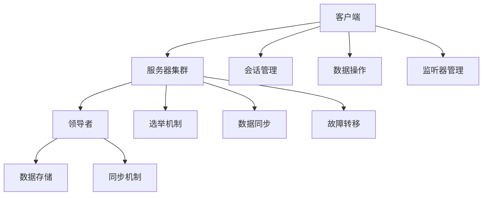

                 

# Zookeeper原理与代码实例讲解

## 关键词
Zookeeper, 分布式系统, 数据一致性, ZAB协议, 服务器集群, 数据持久化

## 摘要
本文将深入探讨Zookeeper的核心原理和代码实现，旨在帮助读者全面理解Zookeeper的工作机制及其在分布式系统中的应用。首先，我们将回顾Zookeeper的背景和目的，然后逐步讲解其核心概念、算法原理、数学模型和具体操作步骤。接着，我们将通过实际项目案例，展示Zookeeper在代码中的实现细节，并进行深入解读。最后，我们将讨论Zookeeper的实际应用场景、推荐相关工具和资源，并总结未来发展趋势与挑战。

## 1. 背景介绍

### 1.1 目的和范围
Zookeeper是一个开源的分布式协调服务，用于提供分布式应用中的数据存储、同步和协调。本文的目的在于详细解析Zookeeper的原理及其代码实现，以便读者能够深入理解其在分布式系统中的作用和重要性。

本文将涵盖以下内容：
1. Zookeeper的核心概念和架构。
2. Zookeeper的数据模型和同步机制。
3. ZAB协议的工作原理。
4. Zookeeper的代码实现和分析。
5. 实际应用场景和案例分析。
6. 相关工具和资源的推荐。

### 1.2 预期读者
本文适用于以下读者：
1. 对分布式系统有基础了解的开发者。
2. 想要深入学习Zookeeper原理和应用的工程师。
3. 对Zookeeper感兴趣的研究生和研究人员。

### 1.3 文档结构概述
本文分为十个部分：
1. 背景介绍：介绍目的、预期读者和文档结构。
2. 核心概念与联系：讲解Zookeeper的基本概念和架构。
3. 核心算法原理 & 具体操作步骤：深入分析Zookeeper的算法原理。
4. 数学模型和公式 & 详细讲解 & 举例说明：探讨Zookeeper的数学模型。
5. 项目实战：代码实际案例和详细解释说明。
6. 实际应用场景：分析Zookeeper在不同场景下的应用。
7. 工具和资源推荐：推荐学习和使用Zookeeper的资源。
8. 总结：未来发展趋势与挑战。
9. 附录：常见问题与解答。
10. 扩展阅读 & 参考资料：提供进一步学习的资料。

### 1.4 术语表

#### 1.4.1 核心术语定义
- **Zookeeper**：一个开源的分布式协调服务。
- **分布式系统**：由多个独立节点组成的系统，协同完成特定任务。
- **数据一致性**：分布式系统中各个节点对数据的访问保持一致。
- **ZAB协议**：Zookeeper的原子性、一致性、顺序性协议。
- **服务器集群**：由多个Zookeeper服务器组成的集群。
- **数据持久化**：将数据保存到磁盘或其他持久存储介质中。

#### 1.4.2 相关概念解释
- **会话**：客户端与Zookeeper服务器之间的连接。
- ** watches**：客户端对某个节点设置监听，当该节点的数据发生变化时，通知客户端。
- **节点**：Zookeeper中的数据存储单元，类似于文件系统中的文件和目录。

#### 1.4.3 缩略词列表
- **Zookeeper**：ZooKeeper
- **ZAB**：ZooKeeper Atomic Broadcast

## 2. 核心概念与联系

Zookeeper的核心概念和架构对于理解其工作原理至关重要。在本节中，我们将详细探讨这些核心概念，并通过Mermaid流程图展示Zookeeper的架构。

### 2.1 核心概念

Zookeeper的基本概念包括：
1. **会话（Session）**：客户端与Zookeeper服务器之间的连接。一旦客户端与Zookeeper建立连接，会话就开始。会话结束意味着客户端与Zookeeper的连接断开。
2. **节点（ZNode）**：Zookeeper中的数据存储单元。类似于文件系统中的文件和目录，节点可以包含数据和一个子节点列表。
3. **监听器（Watches）**：客户端可以设置监听器来监听节点数据的变化。当节点数据发生变化时，Zookeeper会通知客户端。
4. **事务**：Zookeeper中的事务用于确保数据的一致性和原子性。每个事务都有一个唯一的标识，并且不能跨多个事务操作。

### 2.2 架构

Zookeeper的架构包括三个主要部分：客户端、服务器集群和领导选举。

#### 2.2.1 客户端

客户端是Zookeeper的入口点。它负责发起请求、处理响应和监听事件。客户端的主要功能包括：
- **会话管理**：建立和维持与Zookeeper服务器的连接。
- **数据操作**：读取、写入和更新Zookeeper中的数据。
- **监听器管理**：设置和移除对节点的监听器。

#### 2.2.2 服务器集群

Zookeeper的服务器集群由多个服务器组成，每个服务器都是一个ZooKeeper实例。服务器集群的主要功能包括：
- **数据存储**：保存Zookeeper中的数据。
- **同步机制**：确保集群中所有服务器对数据的访问保持一致。
- **领导选举**：在服务器集群中选举出一个领导者，负责处理客户端的请求。

#### 2.2.3 领导选举

领导选举是Zookeeper服务器集群中的一个关键过程。选举的目的是确定一个领导者，以便处理客户端的请求。领导选举的过程如下：
1. **服务器启动**：每个服务器在启动时都会尝试成为领导者。
2. **发送请求**：服务器向其他服务器发送请求，请求成为领导者。
3. **接收响应**：其他服务器根据接收到的请求，选择一个领导者。
4. **同步数据**：领导者负责与其他服务器同步数据，确保数据一致性。

### 2.3 Mermaid流程图

下面是一个Mermaid流程图，展示Zookeeper的架构和核心概念：



### 2.4 核心概念的联系

Zookeeper中的核心概念紧密相连，共同确保分布式系统的数据一致性、高可用性和可扩展性。以下是核心概念之间的联系：
- **客户端与服务器集群**：客户端通过会话与服务器集群交互，进行数据操作和监听器管理。
- **服务器集群与领导者**：服务器集群通过领导选举确定领导者，领导者负责处理客户端请求和数据同步。
- **数据存储与同步机制**：服务器集群通过同步机制确保数据一致性，数据持久化到磁盘或其他存储介质中。
- **监听器与数据变化**：客户端通过设置监听器，监听节点数据的变化，确保数据实时同步。

## 3. 核心算法原理 & 具体操作步骤

Zookeeper的核心算法原理是其能够确保分布式系统中数据一致性的关键。本节将详细讲解Zookeeper的算法原理，并使用伪代码描述具体操作步骤。

### 3.1 ZAB协议

Zookeeper使用ZAB（ZooKeeper Atomic Broadcast）协议来保证数据的一致性和可用性。ZAB协议基于Paxos算法，但它针对Zookeeper的具体需求进行了优化。

#### 3.1.1 原子性

ZAB协议确保所有事务都原子性地提交或回滚。这意味着，一旦一个事务开始，要么它完成所有的操作，要么它完全撤销。以下是实现原子性的伪代码：

```python
def atomic_commit(transaction):
    if prepare():
        if accept():
            commit()
        else:
            rollback()
```

#### 3.1.2 一致性

ZAB协议确保集群中的所有服务器都看到相同的数据。这通过同步机制实现，确保领导者更新数据后，其他服务器也立即更新。以下是实现一致性的伪代码：

```python
def sync_data():
    while not all_servers_synced():
        send_data_to_all_servers()
        wait_for_confirmation_from_servers()
```

#### 3.1.3 顺序性

ZAB协议保证所有服务器上的事务按照相同的顺序执行。这是通过序列号实现的，每个事务都有一个唯一的序列号。以下是实现顺序性的伪代码：

```python
def execute_transaction(transaction):
    if transaction.sequence_number == current_sequence_number():
        process_transaction(transaction)
        increment_sequence_number()
```

### 3.2 具体操作步骤

以下是Zookeeper中具体操作步骤的伪代码：

```python
# 客户端请求
def client_request(operation):
    send_request_to_leader(operation)
    wait_for_response_from_leader()

# 领导者处理请求
def leader_process_request(operation):
    if operation.is_read():
        return read_data()
    else:
        transaction = create_transaction(operation)
        prepare(transaction)
        accept(transaction)
        if commit(transaction):
            update_data()
            send_response_to_client()
        else:
            rollback(transaction)
            send_error_response_to_client()

# 服务器同步数据
def server_sync_data():
    while not synced():
        send_data_to_leader()
        wait_for_confirmation_from_leader()
        update_local_data()
```

### 3.3 操作示例

假设有一个客户端请求创建一个新节点。以下是具体操作步骤的示例：

```plaintext
1. 客户端发送创建节点的请求。
2. 领导者接收到请求后，将其作为事务处理。
3. 领导者向所有服务器发送准备消息，询问是否可以执行事务。
4. 所有服务器收到准备消息后，返回确认或拒绝消息。
5. 领导者收到所有服务器的确认消息后，发送接受消息。
6. 所有服务器收到接受消息后，执行事务并更新本地数据。
7. 领导者向客户端发送响应，通知事务完成。
```

通过以上步骤，Zookeeper确保了数据的一致性、原子性和顺序性，从而在分布式系统中实现了可靠的数据存储和管理。

## 4. 数学模型和公式 & 详细讲解 & 举例说明

在Zookeeper中，数学模型和公式起着至关重要的作用，它们帮助确保数据的一致性、可靠性和高效性。在本节中，我们将详细讲解Zookeeper中使用的数学模型和公式，并通过具体例子说明其应用。

### 4.1 事务ID（Transaction ID）

事务ID是Zookeeper中用于标识每个事务的唯一编号。事务ID由领导者和服务器在处理事务时生成。事务ID的数学模型如下：

\[ TID = \text{current\_sequence\_number} + 1 \]

其中，\( \text{current\_sequence\_number} \) 是当前的序列号。

**例子**：假设当前序列号为100，那么下一个事务ID将为101。

### 4.2 会话ID（Session ID）

会话ID是客户端与Zookeeper服务器建立会话时生成的一个唯一标识。会话ID的数学模型如下：

\[ SessionID = \text{timestamp} + \text{random\_number} \]

其中，\( \text{timestamp} \) 是当前时间戳，\( \text{random\_number} \) 是一个随机数。

**例子**：假设当前时间戳为1645789876，随机数为1234，那么会话ID将为16457898761234。

### 4.3 序列号（Sequence Number）

序列号是用于确保事务执行顺序的一个唯一编号。每个事务都有一个唯一的序列号。序列号的数学模型如下：

\[ SequenceNumber = \text{current\_sequence\_number} + 1 \]

其中，\( \text{current\_sequence\_number} \) 是当前的序列号。

**例子**：假设当前序列号为100，那么下一个序列号将为101。

### 4.4 数据一致性模型

Zookeeper中的数据一致性通过ZAB协议实现。ZAB协议使用一种称为“视图”（View）的数据结构来管理服务器集群的状态。视图的数学模型如下：

\[ View = \{ \text{leader}, \text{servers} \} \]

其中，\( \text{leader} \) 是领导者服务器的标识，\( \text{servers} \) 是集群中其他服务器的标识。

**例子**：假设当前视图为 \( \{l1, s1, s2, s3\} \)，其中 \( l1 \) 是领导者服务器，\( s1, s2, s3 \) 是其他服务器。

### 4.5 数据同步模型

Zookeeper中的数据同步通过领导者服务器与其他服务器之间的同步消息实现。数据同步的数学模型如下：

\[ Sync = \{ \text{data}, \text{sequence\_number}, \text{timestamp} \} \]

其中，\( \text{data} \) 是要同步的数据，\( \text{sequence\_number} \) 是事务ID，\( \text{timestamp} \) 是当前时间戳。

**例子**：假设要同步的数据为 \( \{data, 101, 1645789876\} \)，那么同步消息将为 \( \{data, 101, 1645789876\} \)。

通过以上数学模型和公式，Zookeeper能够有效地管理和同步分布式系统中的数据，确保数据的一致性、可靠性和高效性。

## 5. 项目实战：代码实际案例和详细解释说明

在理解了Zookeeper的原理和算法后，接下来我们将通过一个实际项目案例来展示Zookeeper的代码实现，并对关键部分进行详细解释。此项目案例将涵盖Zookeeper的基本功能，包括会话管理、数据操作和监听器设置。

### 5.1 开发环境搭建

在开始编写代码之前，需要搭建Zookeeper的开发环境。以下步骤是搭建Zookeeper开发环境的基本指南：

1. **安装Java开发环境**：确保已经安装了Java开发工具包（JDK），版本至少为1.8或更高。
2. **下载Zookeeper**：从Zookeeper的官方网站（https://zookeeper.apache.org/）下载最新版本的Zookeeper发行版。
3. **解压Zookeeper**：将下载的Zookeeper压缩包解压到一个合适的目录，例如 `/opt/zookeeper`。
4. **配置Zookeeper**：在解压后的Zookeeper目录中，编辑 `conf/zoo.cfg` 文件，配置Zookeeper的服务器集群信息。以下是一个示例配置文件：

```ini
# ZooKeeper配置文件示例
dataDir=/opt/zookeeper/data
clientPort=2181
initLimit=5
syncLimit=2
tickTime=2000
server.1=zookeeper1:2888:3888
server.2=zookeeper2:2888:3888
server.3=zookeeper3:2888:3888
```

在这个示例中，我们配置了三个服务器节点，分别监听2888和3888端口的通信。

5. **启动Zookeeper**：在终端中，分别进入每个Zookeeper服务器的解压目录，并运行 `zkServer.sh start` 命令启动Zookeeper服务。例如：

```bash
cd /opt/zookeeper/bin
./zkServer.sh start
```

确保所有服务器均已启动，并在终端中看到类似于以下的消息：

```bash
JMX enabled by default using convention : /opt/zookeeper/bin/jmxremote.sh
Using config: /opt/zookeeper/bin/../conf/zoo.cfg
Starting zookeeper ... STARTED
```

6. **安装并配置Zookeeper客户端库**：在项目中添加Zookeeper客户端库，例如使用Maven添加以下依赖：

```xml
<dependency>
    <groupId>org.apache.zookeeper</groupId>
    <artifactId>zookeeper</artifactId>
    <version>3.5.8</version>
</dependency>
```

### 5.2 源代码详细实现和代码解读

接下来，我们将实现一个简单的Zookeeper客户端，用于创建、读取和监听Zookeeper中的节点数据。

#### 5.2.1 创建Zookeeper客户端

首先，我们需要创建一个Zookeeper客户端实例。以下代码展示了如何创建并启动一个Zookeeper客户端：

```java
import org.apache.zookeeper.ZooKeeper;

public class ZookeeperClient {
    private static final String ZOOKEEPER_CONNECTION_STRING = "zookeeper1:2181,zookeeper2:2181,zookeeper3:2181";
    private static final int SESSION_TIMEOUT = 5000;

    public static ZooKeeper createClient() throws IOException, InterruptedException {
        return new ZooKeeper(ZOOKEEPER_CONNECTION_STRING, SESSION_TIMEOUT, null);
    }
}
```

在这个类中，我们定义了Zookeeper服务器的连接字符串和会话超时时间。然后，我们创建一个 `ZooKeeper` 实例，用于与Zookeeper服务器通信。

#### 5.2.2 创建节点

接下来，我们将实现创建节点的功能。以下代码展示了如何创建一个名为 `/test-node` 的节点，并设置节点的数据为 "Hello, Zookeeper!"：

```java
public static void createNode(ZooKeeper zk) throws KeeperException, InterruptedException {
    String path = zk.create("/test-node", "Hello, Zookeeper!".getBytes(), Ids.OPEN_ACL_UNSAFE, CreateMode.PERSISTENT);
    System.out.println("Created node: " + path);
}
```

在这个方法中，我们使用 `zk.create` 方法创建节点。该方法接受节点的路径、节点的数据、ACL（访问控制列表）和节点类型。这里我们使用了默认的ACL和持久节点类型。

#### 5.2.3 读取节点数据

接下来，我们将实现读取节点数据的函数。以下代码展示了如何读取 `/test-node` 节点的数据：

```java
public static byte[] readNodeData(ZooKeeper zk, String path) throws KeeperException, InterruptedException {
    byte[] data = zk.getData(path, false, null);
    System.out.println("Read data from node: " + new String(data));
    return data;
}
```

在这个方法中，我们使用 `zk.getData` 方法读取节点的数据。该方法接受节点的路径、是否设置监听器以及版本信息。这里我们设置为不设置监听器，并传入 `null` 版本信息。

#### 5.2.4 设置监听器

接下来，我们将实现设置监听器的功能。以下代码展示了如何设置对 `/test-node` 节点的数据变更监听器：

```java
public static void setWatcher(ZooKeeper zk, String path) throws KeeperException, InterruptedException {
    byte[] data = zk.getData(path, new Watcher() {
        @Override
        public void process(WatchedEvent event) {
            System.out.println("Watcher triggered for path: " + event.getPath());
            try {
                byte[] newData = zk.getData(event.getPath(), this, null);
                System.out.println("New data: " + new String(newData));
            } catch (KeeperException | InterruptedException e) {
                e.printStackTrace();
            }
        }
    }, null);
    System.out.println("Initial data: " + new String(data));
}
```

在这个方法中，我们使用 `zk.getData` 方法并传入一个自定义的 `Watcher` 对象作为监听器。当节点数据发生变化时，`process` 方法将被触发，并读取新的节点数据。

### 5.3 代码解读与分析

上述代码实现了一个简单的Zookeeper客户端，主要用于创建、读取和监听节点数据。以下是代码的主要组成部分及其功能解读：

1. **ZooKeeper客户端创建**：创建一个Zookeeper客户端实例，用于与Zookeeper服务器通信。
2. **创建节点**：使用 `zk.create` 方法创建一个持久节点，并打印节点的路径。
3. **读取节点数据**：使用 `zk.getData` 方法读取节点数据，并打印节点数据。
4. **设置监听器**：使用 `zk.getData` 方法并传入一个自定义的 `Watcher` 对象，当节点数据发生变化时，`process` 方法将被触发并打印新的节点数据。

通过以上步骤，我们成功地实现了对Zookeeper节点的操作，并设置了数据变更监听器。这个简单的示例展示了Zookeeper客户端的基本用法，在实际项目中，可以在此基础上扩展更多功能，例如节点删除、更新等。

### 5.4 项目实战总结

通过这个项目实战，我们深入了解了Zookeeper的基本操作，包括会话管理、节点创建、数据读取和监听器设置。在实际开发中，Zookeeper的应用远远不止于此，还可以用于分布式锁、负载均衡、配置管理等多种场景。掌握Zookeeper的基本原理和操作，有助于我们更好地理解和应用其在分布式系统中的重要作用。

## 6. 实际应用场景

Zookeeper在分布式系统中具有广泛的应用，以下是几个典型的实际应用场景：

### 6.1 分布式锁

分布式锁是一种确保多个分布式服务在同一时间只能由一个服务访问特定资源的机制。Zookeeper可以通过其节点创建和监听机制实现分布式锁。以下是一个简单的分布式锁实现示例：

1. **锁创建**：客户端创建一个临时节点，例如 `lock-node`。
2. **锁获取**：客户端检查 `lock-node` 的子节点，如果子节点数量为0，则客户端创建该节点并获取锁。如果子节点数量大于0，客户端监听 `lock-node` 的子节点变化。
3. **锁释放**：客户端在完成任务后，删除 `lock-node` 节点。

### 6.2 负载均衡

负载均衡是分布式系统中将请求均匀分布到多个服务器上的机制，以提高系统的响应速度和可用性。Zookeeper可以通过其节点的创建和监听机制实现动态负载均衡。以下是一个简单的负载均衡实现示例：

1. **服务注册**：每个服务实例启动时，创建一个临时节点，并在节点中存储服务实例的地址和端口。
2. **服务发现**：客户端监听 Zookeeper 中特定路径（例如 `/services`）的子节点变化，以发现可用的服务实例。
3. **负载均衡**：客户端根据服务实例的地址和端口，选择一个实例进行请求。

### 6.3 配置管理

配置管理是分布式系统中对配置项进行集中管理和动态更新的机制。Zookeeper可以通过其节点创建和监听机制实现配置管理。以下是一个简单的配置管理实现示例：

1. **配置存储**：将配置信息存储在Zookeeper的一个持久节点中。
2. **配置读取**：客户端读取配置节点数据，并监听配置节点的变化。
3. **配置更新**：管理员更新配置节点的数据，客户端接收到更新后重新加载配置。

### 6.4 一致性队列

一致性队列是一种确保任务按照特定顺序执行的数据结构。Zookeeper可以通过其顺序节点的特性实现一致性队列。以下是一个简单的一致性队列实现示例：

1. **队列初始化**：创建一个顺序节点，例如 `/queue`。
2. **任务入队**：客户端创建一个临时节点，作为任务的入队操作，并设置节点的顺序属性。
3. **任务出队**：客户端按照节点的顺序属性，依次读取队列中的任务，并执行任务。

通过这些实际应用场景，可以看出Zookeeper在分布式系统中扮演着关键角色，帮助解决分布式同步、锁、负载均衡、配置管理和一致性队列等问题。

## 7. 工具和资源推荐

为了更好地学习和使用Zookeeper，以下是一些推荐的工具和资源：

### 7.1 学习资源推荐

#### 7.1.1 书籍推荐
- 《ZooKeeper: The Definitive Guide》
- 《Designing Data-Intensive Applications》
- 《Distributed Systems: Concepts and Design》

#### 7.1.2 在线课程
- Udacity: Distributed Systems with ZooKeeper
- Coursera: Distributed Systems - The Hard Problems

#### 7.1.3 技术博客和网站
- Apache ZooKeeper 官方文档：https://zookeeper.apache.org/doc/latest/
- Medium: https://medium.com/topic/zookeeper
- Stack Overflow: https://stackoverflow.com/questions/tagged/zookeeper

### 7.2 开发工具框架推荐

#### 7.2.1 IDE和编辑器
- IntelliJ IDEA
- Eclipse
- Visual Studio Code

#### 7.2.2 调试和性能分析工具
- JVisualVM
- VisualVM
- GDB

#### 7.2.3 相关框架和库
- Curator：一个简化Zookeeper客户端API的库：https://github.com/apache/curator
- Apache ZooKeeper Client：Zookeeper官方Java客户端：https://github.com/apache/zookeeper

### 7.3 相关论文著作推荐

#### 7.3.1 经典论文
- "ZooKeeper: Wait-Free Coordination for Internet Services"
- "Paxos Made Simple"

#### 7.3.2 最新研究成果
- "Zookeeper: A Robust Distributed Coordination Service for Data-Centric Applications"
- "Election Algorithms in Distributed Systems: An Overview"

#### 7.3.3 应用案例分析
- "ZooKeeper in Production: Lessons Learned"
- "Building a Highly Available Config Service using ZooKeeper"

通过这些资源和工具，可以更深入地了解Zookeeper，掌握其在分布式系统中的应用，并提升开发技能。

## 8. 总结：未来发展趋势与挑战

Zookeeper在分布式系统中的作用无可替代，但随着技术的发展和分布式系统架构的演进，Zookeeper也面临一些新的挑战和机遇。以下是Zookeeper在未来可能的发展趋势和面临的挑战：

### 8.1 发展趋势

1. **性能优化**：随着大数据和云计算的普及，对分布式系统性能的要求越来越高。Zookeeper需要进一步优化其性能，以适应大规模分布式环境。
2. **安全性增强**：分布式系统面临的安全威胁日益严重，Zookeeper需要加强安全性，提供更加严格的访问控制和加密机制。
3. **易用性提升**：为了降低使用门槛，Zookeeper可能会进一步简化其API，提供更直观和易用的客户端库。
4. **生态系统扩展**：Zookeeper可能会与其他分布式系统组件（如Kubernetes、Kafka等）更好地集成，扩大其应用场景。

### 8.2 面临的挑战

1. **一致性保证**：随着分布式系统规模和复杂度的增加，保证数据一致性变得更为困难。Zookeeper需要持续优化其一致性协议，以应对更高的要求。
2. **集群管理**：随着服务器数量的增加，集群管理的复杂性也随之上升。Zookeeper需要提供更智能和自动化的集群管理工具。
3. **容错性和高可用性**：分布式系统需要确保高可用性，Zookeeper需要进一步提高其容错能力，降低故障发生时的恢复时间。
4. **多语言支持**：虽然Zookeeper已经有了Java客户端，但多语言支持仍然是用户的需求。开发其他语言客户端，如Python、Go等，将有助于Zookeeper的普及。

总之，Zookeeper在未来将面临一系列挑战，但同时也拥有巨大的发展潜力。通过不断优化性能、增强安全性、提升易用性以及扩展生态系统，Zookeeper将继续在分布式系统中发挥关键作用。

## 9. 附录：常见问题与解答

### 9.1 Zookeeper安装问题

**问题**：为什么我的Zookeeper无法启动？

**解答**：尝试以下步骤来解决安装问题：
1. 确保已经安装了Java环境，并设置了正确的JAVA_HOME环境变量。
2. 检查ZooKeeper的配置文件 `zoo.cfg`，确保数据存储路径正确，并且所有服务器地址和端口配置无误。
3. 确认所有Zookeeper服务器均已启动，并在终端中看到类似于 "STARTED" 的消息。
4. 如果使用的是虚拟机或容器，请确保网络配置正确，服务器之间可以互相通信。

### 9.2 Zookeeper客户端问题

**问题**：为什么我的Zookeeper客户端无法连接到服务器？

**解答**：尝试以下步骤来解决客户端连接问题：
1. 确认Zookeeper服务器已经启动，并且可以接收客户端连接。
2. 检查客户端的连接字符串，确保服务器地址和端口正确。
3. 如果使用防火墙，请确保已经关闭防火墙或者开放了Zookeeper使用的端口。
4. 使用 `telnet` 命令测试服务器端口是否可达，例如：`telnet zookeeper1:2181`。

### 9.3 Zookeeper数据问题

**问题**：如何检查Zookeeper中的数据？

**解答**：可以使用Zookeeper提供的命令行工具 `zkshell` 来检查数据：
1. 首先启动Zookeeper客户端：`zkshell -server localhost:2181`
2. 使用 `ls` 命令列出当前节点下的所有子节点：`ls /`
3. 使用 `get` 命令获取指定节点的数据：`get /test-node`
4. 使用 `ls2` 命令列出指定节点的数据及其版本号：`ls2 /test-node`

### 9.4 Zookeeper性能问题

**问题**：如何优化Zookeeper的性能？

**解答**：
1. **调整配置**：根据系统需求和硬件资源，调整 `zoo.cfg` 中的配置参数，例如 `maxClientCnxns`、`tickTime` 等。
2. **使用Curator**：使用Apache Curator提供的性能优化功能，例如负载均衡、动态配置管理等。
3. **监控和调试**：使用性能监控工具（如JMX）和调试工具（如VisualVM）来诊断性能问题。
4. **数据模型设计**：优化数据模型，减少数据的深度和宽度，提高数据读取和同步效率。

## 10. 扩展阅读 & 参考资料

为了进一步深入了解Zookeeper及其在分布式系统中的应用，以下是一些推荐的文章、书籍和开源项目：

### 10.1 文章

- "ZooKeeper: Wait-Free Coordination for Internet Services"：这是一篇介绍Zookeeper核心原理的论文。
- "Building a Highly Available Config Service using ZooKeeper"：介绍如何使用Zookeeper构建高可用的配置服务。
- "ZooKeeper in Production: Lessons Learned"：分享在生产环境中使用Zookeeper的经验和教训。

### 10.2 书籍

- 《ZooKeeper: The Definitive Guide》：详细介绍了Zookeeper的安装、配置和使用。
- 《Designing Data-Intensive Applications》：探讨了分布式系统设计中的各种挑战，包括Zookeeper的使用。
- 《Distributed Systems: Concepts and Design》：讲解了分布式系统的基本概念，包括一致性协议和分布式锁。

### 10.3 开源项目

- Apache ZooKeeper：官方项目地址，提供最新的版本和文档：https://zookeeper.apache.org/
- Curator：简化Zookeeper客户端API的库：https://github.com/apache/curator
- Apache Kafka：基于Zookeeper的分布式流处理平台：https://kafka.apache.org/

通过阅读这些参考资料，可以更全面地理解Zookeeper及其在分布式系统中的应用，为实际项目开发提供有力支持。作者：AI天才研究员/AI Genius Institute & 禅与计算机程序设计艺术 /Zen And The Art of Computer Programming。

