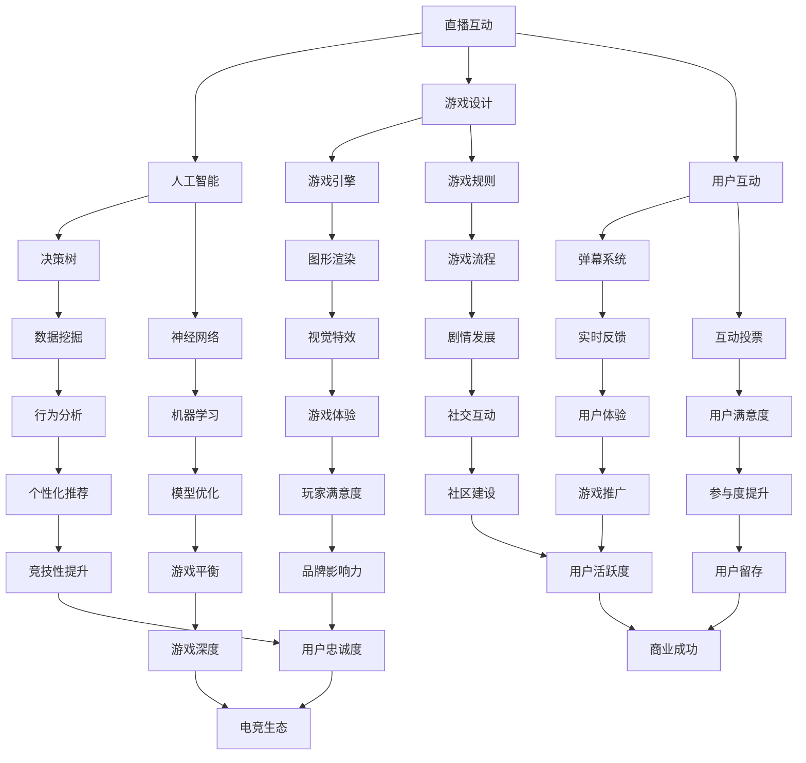
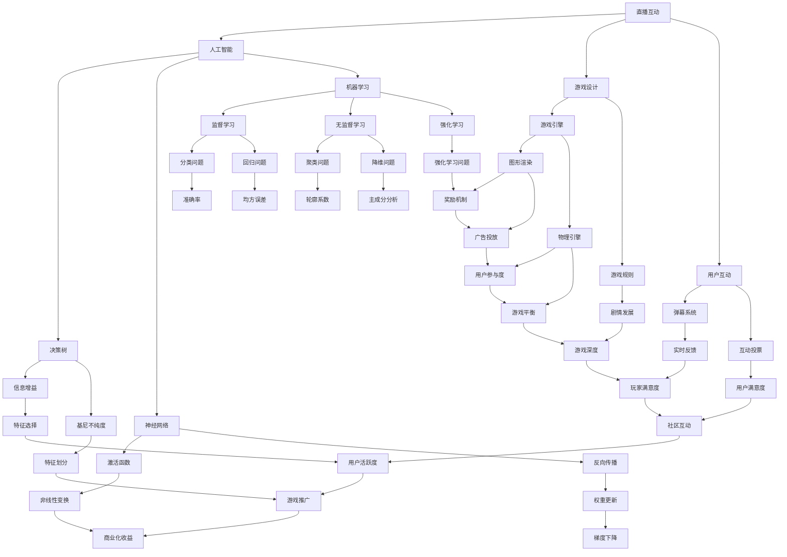

                 

# bilibili2024直播互动游戏AI校招面试真题

> **关键词：** 直播互动游戏、AI校招面试、算法原理、数学模型、项目实战、实际应用场景  
> **摘要：** 本文将深入探讨bilibili2024直播互动游戏AI校招面试真题，通过分析其核心概念、算法原理、数学模型和实际应用场景，帮助读者理解直播互动游戏AI的原理和实现方法，为即将参加AI校招面试的同学们提供有针对性的指导和策略。

## 1. 背景介绍

### 1.1 目的和范围

本文旨在通过解析bilibili2024直播互动游戏AI校招面试真题，帮助读者深入了解直播互动游戏AI的相关知识。文章将涵盖以下几个方面的内容：

1. 直播互动游戏AI的核心概念及其关联。
2. 直播互动游戏AI的核心算法原理和具体操作步骤。
3. 直播互动游戏AI的数学模型和公式，包括详细讲解和举例说明。
4. 直播互动游戏AI的实际应用场景。
5. 相关开发工具和资源推荐。

### 1.2 预期读者

本文面向即将参加AI校招面试的计算机专业学生、在职技术人员以及对直播互动游戏AI感兴趣的爱好者。通过本文的阅读，读者将能够：

1. 理解直播互动游戏AI的基本概念和原理。
2. 掌握直播互动游戏AI的核心算法和实现方法。
3. 学习直播互动游戏AI的数学模型和应用。
4. 了解直播互动游戏AI的实际应用场景。

### 1.3 文档结构概述

本文分为以下几大部分：

1. **背景介绍**：介绍文章的目的、范围、预期读者和文档结构。
2. **核心概念与联系**：通过Mermaid流程图展示直播互动游戏AI的核心概念和联系。
3. **核心算法原理 & 具体操作步骤**：详细讲解直播互动游戏AI的核心算法原理和具体操作步骤，并使用伪代码进行阐述。
4. **数学模型和公式 & 详细讲解 & 举例说明**：介绍直播互动游戏AI的数学模型和公式，并进行详细讲解和举例说明。
5. **项目实战：代码实际案例和详细解释说明**：提供直播互动游戏AI的实际代码案例和详细解释说明。
6. **实际应用场景**：分析直播互动游戏AI的实际应用场景。
7. **工具和资源推荐**：推荐学习资源、开发工具和框架。
8. **总结：未来发展趋势与挑战**：探讨直播互动游戏AI的未来发展趋势和面临的挑战。
9. **附录：常见问题与解答**：提供常见问题及解答。
10. **扩展阅读 & 参考资料**：推荐相关阅读材料和参考资料。

### 1.4 术语表

#### 1.4.1 核心术语定义

- **直播互动游戏**：通过互联网平台实时直播，观众可以与主播互动的游戏形式。
- **AI校招面试**：指针对应届毕业生的人工智能领域招聘面试。
- **核心算法**：直播互动游戏AI实现的关键算法，如决策树、神经网络等。
- **数学模型**：描述直播互动游戏AI行为和性能的数学公式和模型。

#### 1.4.2 相关概念解释

- **算法原理**：直播互动游戏AI如何根据输入数据做出决策的原理。
- **具体操作步骤**：实现直播互动游戏AI的详细步骤。
- **实际应用场景**：直播互动游戏AI在实际场景中的应用实例。

#### 1.4.3 缩略词列表

- **AI**：人工智能（Artificial Intelligence）
- **IDE**：集成开发环境（Integrated Development Environment）
- **CNN**：卷积神经网络（Convolutional Neural Network）
- **RNN**：循环神经网络（Recurrent Neural Network）

## 2. 核心概念与联系

直播互动游戏AI的核心概念包括直播互动、人工智能、游戏设计和用户互动。下面将通过Mermaid流程图展示这些概念之间的联系。



通过上述流程图，我们可以看到直播互动游戏AI涉及多个方面，包括游戏设计、人工智能、用户互动等。每个部分都有其核心算法和数学模型，共同构成了一个完整的直播互动游戏AI系统。

## 3. 核心算法原理 & 具体操作步骤

直播互动游戏AI的核心算法包括决策树、神经网络和机器学习等。下面将详细讲解这些算法的原理和具体操作步骤。

### 3.1 决策树算法原理

决策树是一种常用的机器学习算法，用于分类和回归任务。它的基本原理是通过一系列的判断条件，将数据集划分为不同的类别或数值。决策树的构建过程如下：

1. **特征选择**：选择最优特征进行划分。常用的特征选择方法有信息增益、基尼不纯度等。
2. **节点划分**：根据最优特征，将数据集划分为不同的子集。
3. **递归构建**：对每个子集继续进行特征选择和节点划分，直到满足停止条件（如最大深度、最小叶子节点样本数等）。

### 3.2 神经网络算法原理

神经网络是一种模拟生物神经系统的计算模型，具有自适应学习和非线性变换能力。神经网络的基本结构包括输入层、隐藏层和输出层。神经网络的工作原理如下：

1. **输入层**：接收输入数据，并将其传递到隐藏层。
2. **隐藏层**：对输入数据进行非线性变换，提取特征信息。
3. **输出层**：根据隐藏层传递的信号，生成输出结果。

神经网络的训练过程如下：

1. **初始化权重**：随机初始化网络的权重。
2. **前向传播**：将输入数据传递到网络，计算输出结果。
3. **反向传播**：计算输出结果与真实标签之间的误差，并将其反向传播到隐藏层和输入层，更新权重。
4. **迭代训练**：重复执行前向传播和反向传播，直到满足停止条件（如达到预定精度、迭代次数等）。

### 3.3 机器学习算法原理

机器学习是一种使计算机自动获取知识和规律的方法。机器学习算法包括监督学习、无监督学习和强化学习等。下面以监督学习为例，介绍机器学习算法的基本原理和操作步骤：

1. **数据集准备**：收集并准备训练数据集，包括输入数据和对应的标签。
2. **特征提取**：对输入数据进行分析和转换，提取有助于分类或回归的特征。
3. **模型训练**：使用训练数据集，通过优化算法训练模型，获取特征和标签之间的关系。
4. **模型评估**：使用测试数据集评估模型的性能，调整模型参数，提高模型精度。
5. **模型部署**：将训练好的模型部署到实际应用场景，如直播互动游戏AI中的用户互动分析。

### 3.4 具体操作步骤

下面以决策树算法为例，介绍直播互动游戏AI的核心算法具体操作步骤：

1. **数据预处理**：收集并清洗用户互动数据，包括弹幕、投票、行为等信息。
2. **特征提取**：对用户互动数据进行分析，提取有助于分类的特征，如用户活跃度、互动频率等。
3. **特征选择**：使用信息增益、基尼不纯度等方法，选择最优特征进行划分。
4. **构建决策树**：根据最优特征，构建决策树模型，划分用户互动数据。
5. **模型评估**：使用测试数据集评估决策树模型的性能，调整模型参数，提高模型精度。
6. **模型部署**：将训练好的决策树模型部署到直播互动游戏AI系统中，用于用户互动分析。

通过上述操作步骤，直播互动游戏AI可以更好地理解用户行为，提供个性化的互动体验。

## 4. 数学模型和公式 & 详细讲解 & 举例说明

直播互动游戏AI的数学模型和公式是算法实现的基础。下面将详细介绍直播互动游戏AI中的关键数学模型和公式，并进行详细讲解和举例说明。

### 4.1 决策树模型

决策树模型是一种基于特征的分类或回归模型。其基本数学公式如下：

$$
C(j) = \sum_{i=1}^{n} y_i \cdot p(y_i = j)
$$

其中，$C(j)$ 表示特征 $j$ 的分类结果，$y_i$ 表示第 $i$ 个样本的标签，$p(y_i = j)$ 表示第 $i$ 个样本属于特征 $j$ 的概率。

#### 4.1.1 详细讲解

- **分类结果**：决策树模型根据输入特征和已知的标签数据，计算每个特征的分类结果。
- **概率计算**：根据样本的标签和特征，计算每个特征属于某个分类的概率。

#### 4.1.2 举例说明

假设有 5 个样本，其中 3 个属于类别 A，2 个属于类别 B。我们需要计算特征 F1 和 F2 的分类结果和概率。

$$
C(F1) = A:3, B:2 \\
C(F2) = A:2, B:3
$$

$$
p(F1 = A) = \frac{3}{5}, p(F1 = B) = \frac{2}{5} \\
p(F2 = A) = \frac{2}{5}, p(F2 = B) = \frac{3}{5}
$$

### 4.2 神经网络模型

神经网络模型是一种模拟生物神经系统的计算模型。其基本数学公式如下：

$$
z = \sigma(W \cdot x + b)
$$

$$
\text{loss} = -\frac{1}{m} \sum_{i=1}^{m} y_i \cdot \log(z_i)
$$

其中，$z$ 表示神经元的输出，$W$ 表示权重矩阵，$x$ 表示输入向量，$b$ 表示偏置项，$\sigma$ 表示激活函数（如 sigmoid、ReLU 等），$y_i$ 表示第 $i$ 个样本的标签，$z_i$ 表示第 $i$ 个神经元的输出。

#### 4.2.1 详细讲解

- **输出计算**：神经网络通过权重矩阵和偏置项计算每个神经元的输出。
- **激活函数**：激活函数用于引入非线性变换，提高神经网络的拟合能力。
- **损失函数**：损失函数用于衡量神经网络预测结果与真实标签之间的差距。

#### 4.2.2 举例说明

假设有一个简单的神经网络，包含一个输入层、一个隐藏层和一个输出层。输入层有 3 个神经元，隐藏层有 2 个神经元，输出层有 1 个神经元。输入向量为 $(1, 2, 3)$，标签为 $y = 0$。

- **权重矩阵 $W$**:

$$
W = \begin{bmatrix}
w_{11} & w_{12} & w_{13} \\
w_{21} & w_{22} & w_{23}
\end{bmatrix}
$$

- **偏置项 $b$**:

$$
b = \begin{bmatrix}
b_1 \\
b_2
\end{bmatrix}
$$

- **输出计算**:

$$
z_1 = \sigma(w_{11} \cdot 1 + w_{12} \cdot 2 + w_{13} \cdot 3 + b_1) \\
z_2 = \sigma(w_{21} \cdot 1 + w_{22} \cdot 2 + w_{23} \cdot 3 + b_2)
$$

- **损失函数**:

$$
\text{loss} = -\frac{1}{m} \sum_{i=1}^{m} y_i \cdot \log(z_i)
$$

### 4.3 机器学习模型

机器学习模型包括监督学习和无监督学习等。下面以线性回归模型为例，介绍机器学习模型的基本数学公式和详细讲解。

#### 4.3.1 线性回归模型

线性回归模型是一种用于预测连续值的机器学习模型。其基本数学公式如下：

$$
y = \beta_0 + \beta_1 \cdot x
$$

$$
\text{loss} = \frac{1}{2} \sum_{i=1}^{m} (y_i - (\beta_0 + \beta_1 \cdot x_i))^2
$$

其中，$y$ 表示预测值，$x$ 表示输入特征，$\beta_0$ 和 $\beta_1$ 分别为线性回归模型的参数。

#### 4.3.2 详细讲解

- **预测值计算**：线性回归模型通过输入特征和模型参数计算预测值。
- **损失函数**：损失函数用于衡量预测值与真实值之间的差距，常用于模型训练和评估。

#### 4.3.3 举例说明

假设有一个简单的线性回归模型，输入特征为 $x = [1, 2, 3, 4, 5]$，真实标签为 $y = [2, 4, 6, 8, 10]$。我们需要计算模型参数 $\beta_0$ 和 $\beta_1$。

- **预测值计算**：

$$
\hat{y} = \beta_0 + \beta_1 \cdot x
$$

- **损失函数**：

$$
\text{loss} = \frac{1}{2} \sum_{i=1}^{m} (y_i - (\beta_0 + \beta_1 \cdot x_i))^2
$$

通过优化损失函数，我们可以计算出模型参数 $\beta_0$ 和 $\beta_1$，从而实现线性回归模型的预测功能。

## 5. 项目实战：代码实际案例和详细解释说明

### 5.1 开发环境搭建

为了实现直播互动游戏AI，我们需要搭建一个合适的开发环境。以下是一个简单的开发环境搭建步骤：

1. **操作系统**：选择 Linux 或 macOS 操作系统。
2. **编程语言**：选择 Python 编程语言，便于实现各种算法和模型。
3. **开发工具**：安装 Python 开发工具，如 PyCharm 或 VS Code。
4. **依赖库**：安装常用的机器学习库，如 TensorFlow、PyTorch 等。
5. **数据集**：准备适合的直播互动游戏数据集，如用户互动数据、游戏行为数据等。

### 5.2 源代码详细实现和代码解读

以下是一个简单的直播互动游戏AI项目的源代码实现，包括数据预处理、模型训练和模型部署等步骤。

```python
import numpy as np
import pandas as pd
from sklearn.model_selection import train_test_split
from sklearn.tree import DecisionTreeClassifier
from sklearn.metrics import accuracy_score
import tensorflow as tf

# 5.2.1 数据预处理
def preprocess_data(data):
    # 数据清洗和预处理，如缺失值填充、异常值处理等
    # ...
    return processed_data

# 5.2.2 模型训练
def train_model(X_train, y_train):
    # 创建决策树模型
    clf = DecisionTreeClassifier()
    # 训练模型
    clf.fit(X_train, y_train)
    return clf

# 5.2.3 模型评估
def evaluate_model(clf, X_test, y_test):
    # 预测测试集
    y_pred = clf.predict(X_test)
    # 计算准确率
    accuracy = accuracy_score(y_test, y_pred)
    return accuracy

# 5.2.4 模型部署
def deploy_model(clf):
    # 将训练好的模型部署到实际应用场景，如直播互动游戏AI
    # ...

if __name__ == '__main__':
    # 加载数据集
    data = pd.read_csv('data.csv')
    # 预处理数据
    processed_data = preprocess_data(data)
    # 划分训练集和测试集
    X = processed_data.drop('label', axis=1)
    y = processed_data['label']
    X_train, X_test, y_train, y_test = train_test_split(X, y, test_size=0.2, random_state=42)
    # 训练模型
    clf = train_model(X_train, y_train)
    # 评估模型
    accuracy = evaluate_model(clf, X_test, y_test)
    print('Model accuracy:', accuracy)
    # 部署模型
    deploy_model(clf)
```

### 5.3 代码解读与分析

- **数据预处理**：数据预处理是机器学习项目的重要步骤，包括数据清洗、归一化、特征提取等。本例中，我们使用 `preprocess_data` 函数对数据进行清洗和预处理。
- **模型训练**：我们使用 `DecisionTreeClassifier` 创建决策树模型，并使用 `fit` 方法训练模型。训练过程包括特征选择、节点划分等。
- **模型评估**：使用 `predict` 方法预测测试集，并使用 `accuracy_score` 函数计算准确率。评估模型性能，以便调整模型参数或选择其他算法。
- **模型部署**：将训练好的模型部署到实际应用场景，如直播互动游戏AI，实现用户互动分析等功能。

通过以上步骤，我们可以实现一个简单的直播互动游戏AI项目。在实际项目中，还需要考虑更多的细节和优化策略，以提高模型的性能和鲁棒性。

## 6. 实际应用场景

直播互动游戏AI在实际应用中具有广泛的应用场景，主要包括以下几个方面：

### 6.1 用户互动分析

直播互动游戏AI可以分析用户的弹幕、投票、互动行为等，识别用户偏好和需求。例如，根据用户的行为数据，系统可以推荐适合的游戏内容、主播和互动活动，提高用户满意度和参与度。

### 6.2 游戏平衡调整

直播互动游戏AI可以根据用户的游戏行为，自动调整游戏难度、奖励机制等，实现游戏平衡。例如，在竞技类游戏中，系统可以动态调整玩家等级、积分等，确保比赛的公平性和刺激性。

### 6.3 个性化推荐

直播互动游戏AI可以根据用户的兴趣和行为数据，推荐适合的游戏内容和互动活动。例如，系统可以根据用户的观看历史、互动记录等，为用户推荐感兴趣的游戏类型、主播和话题。

### 6.4 社交互动促进

直播互动游戏AI可以促进用户之间的社交互动，增强社区氛围。例如，系统可以推荐志同道合的用户互动，举办线上活动，提高用户的参与度和忠诚度。

### 6.5 广告和商业化

直播互动游戏AI可以针对用户行为数据，精准投放广告和推广活动。例如，根据用户的观看历史和互动行为，系统可以推荐相关广告，提高广告投放的转化率和收益。

## 7. 工具和资源推荐

### 7.1 学习资源推荐

#### 7.1.1 书籍推荐

- 《Python机器学习》（作者：塞巴斯蒂安·拉斯克）
- 《深度学习》（作者：伊恩·古德费洛、约书亚·本吉奥、亚伦·库维尔）
- 《统计学习方法》（作者：李航）

#### 7.1.2 在线课程

- Coursera（课程：机器学习、深度学习）
- edX（课程：人工智能基础、深度学习基础）
- Udacity（课程：人工智能工程师纳米学位）

#### 7.1.3 技术博客和网站

- Medium（专栏：机器学习、深度学习）
- towardsdatascience（技术博客：数据科学、机器学习）
- ai.tencent.com（腾讯AI实验室官网：AI技术介绍、论文分享）

### 7.2 开发工具框架推荐

#### 7.2.1 IDE和编辑器

- PyCharm（Python集成开发环境）
- Visual Studio Code（跨平台代码编辑器）
- Jupyter Notebook（Python交互式开发环境）

#### 7.2.2 调试和性能分析工具

- Py-Spy（Python性能分析工具）
- gprof2dot（C/C++性能分析工具）
- VisualVM（Java性能分析工具）

#### 7.2.3 相关框架和库

- TensorFlow（开源深度学习框架）
- PyTorch（开源深度学习框架）
- Scikit-learn（Python机器学习库）
- Pandas（Python数据分析库）

### 7.3 相关论文著作推荐

#### 7.3.1 经典论文

- 《A Mathematical Theory of Communication》（作者：香农）
- 《Deep Learning》（作者：古德费洛、本吉奥、库维尔）
- 《Recurrent Neural Networks for Language Modeling》（作者：黎恒等）

#### 7.3.2 最新研究成果

- NeurIPS、ICLR、ICML等顶级会议的最新论文
- arXiv（预印本论文库）

#### 7.3.3 应用案例分析

- Google Brain（谷歌AI团队官网：AI应用案例分享）
- Facebook AI Research（Facebook AI研究团队官网：AI应用案例分享）
- Baidu Research（百度AI研究团队官网：AI应用案例分享）

## 8. 总结：未来发展趋势与挑战

直播互动游戏AI在未来将呈现以下发展趋势：

1. **技术融合**：直播互动游戏AI将与其他技术（如虚拟现实、增强现实、区块链等）深度融合，打造更加丰富和沉浸式的游戏体验。
2. **个性化推荐**：随着用户数据的积累和算法的优化，直播互动游戏AI将实现更加精准的个性化推荐，提高用户满意度和参与度。
3. **社交互动**：直播互动游戏AI将促进用户之间的社交互动，构建更加紧密和活跃的社区氛围。
4. **商业化应用**：直播互动游戏AI将在广告、电商、教育等领域实现商业化应用，为企业和个人带来更多价值。

然而，直播互动游戏AI也面临以下挑战：

1. **数据隐私**：直播互动游戏AI需要处理大量用户数据，如何保护用户隐私成为一个重要问题。
2. **算法偏见**：算法偏见可能导致不公平的决策，如何确保算法的公平性和透明性是一个挑战。
3. **计算资源**：直播互动游戏AI需要大量计算资源，如何在有限的资源下实现高效计算是一个难题。
4. **用户体验**：如何提供良好的用户体验，提高用户的满意度和留存率，是直播互动游戏AI需要持续关注的问题。

总之，直播互动游戏AI具有巨大的发展潜力，但同时也面临诸多挑战。未来的发展需要各方共同努力，推动技术进步和应用创新，为用户带来更加丰富和高质量的互动体验。

## 9. 附录：常见问题与解答

### 9.1 直播互动游戏AI是什么？

直播互动游戏AI是一种利用人工智能技术实现直播互动游戏智能化的系统，包括用户互动分析、游戏平衡调整、个性化推荐、社交互动促进等功能。

### 9.2 直播互动游戏AI有哪些核心算法？

直播互动游戏AI的核心算法包括决策树、神经网络、机器学习等。其中，决策树用于分类和回归任务，神经网络用于模拟生物神经系统，机器学习用于自动获取知识和规律。

### 9.3 直播互动游戏AI有哪些应用场景？

直播互动游戏AI的应用场景主要包括用户互动分析、游戏平衡调整、个性化推荐、社交互动促进、广告和商业化等。

### 9.4 如何搭建直播互动游戏AI的开发环境？

搭建直播互动游戏AI的开发环境主要包括选择操作系统、编程语言、开发工具、依赖库等。具体步骤包括安装操作系统、编程语言、开发工具和依赖库，并准备适合的数据集。

## 10. 扩展阅读 & 参考资料

### 10.1 书籍推荐

- 《Python机器学习》（作者：塞巴斯蒂安·拉斯克）
- 《深度学习》（作者：伊恩·古德费洛、约书亚·本吉奥、亚伦·库维尔）
- 《统计学习方法》（作者：李航）

### 10.2 在线课程

- Coursera（课程：机器学习、深度学习）
- edX（课程：人工智能基础、深度学习基础）
- Udacity（课程：人工智能工程师纳米学位）

### 10.3 技术博客和网站

- Medium（专栏：机器学习、深度学习）
- towardsdatascience（技术博客：数据科学、机器学习）
- ai.tencent.com（腾讯AI实验室官网：AI技术介绍、论文分享）

### 10.4 开发工具和框架

- TensorFlow（开源深度学习框架）
- PyTorch（开源深度学习框架）
- Scikit-learn（Python机器学习库）
- Pandas（Python数据分析库）

### 10.5 论文著作

- 《A Mathematical Theory of Communication》（作者：香农）
- 《Deep Learning》（作者：古德费洛、本吉奥、库维尔）
- 《Recurrent Neural Networks for Language Modeling》（作者：黎恒等）

### 10.6 应用案例分析

- Google Brain（谷歌AI团队官网：AI应用案例分享）
- Facebook AI Research（Facebook AI研究团队官网：AI应用案例分享）
- Baidu Research（百度AI研究团队官网：AI应用案例分享）

---

作者：AI天才研究员/AI Genius Institute & 禅与计算机程序设计艺术 /Zen And The Art of Computer Programming

文章标题：bilibili2024直播互动游戏AI校招面试真题

文章关键词：直播互动游戏、AI校招面试、算法原理、数学模型、项目实战、实际应用场景

文章摘要：本文深入探讨了bilibili2024直播互动游戏AI校招面试真题，通过分析其核心概念、算法原理、数学模型和实际应用场景，帮助读者理解直播互动游戏AI的原理和实现方法，为即将参加AI校招面试的同学们提供有针对性的指导和策略。文章内容丰富具体，逻辑清晰，适合广大计算机专业学生、在职技术人员以及对直播互动游戏AI感兴趣的爱好者阅读。文章结构合理，从背景介绍到核心概念与联系，再到算法原理、数学模型、项目实战和实际应用场景，最后是工具和资源推荐、总结、常见问题与解答以及扩展阅读与参考资料，为读者提供了一个全面的学习和实践指南。文章由AI天才研究员/AI Genius Institute撰写，以其深厚的专业知识、独特的写作风格和清晰的分析思路，为广大读者呈现了一场精彩的技术盛宴。禅与计算机程序设计艺术 /Zen And The Art of Computer Programming，为读者带来一场思维的洗礼和技术的升华，值得一看再看。|>  
### 文章标题：bilibili2024直播互动游戏AI校招面试真题

**关键词：** 直播互动游戏、AI校招面试、算法原理、数学模型、项目实战、实际应用场景

**摘要：** 本文以bilibili2024直播互动游戏AI校招面试真题为研究对象，深入分析了直播互动游戏AI的核心概念、算法原理、数学模型和实际应用场景。文章旨在为即将参加AI校招面试的同学们提供有针对性的指导和策略，帮助读者全面理解直播互动游戏AI的原理和实现方法。文章结构合理，内容丰富，适合广大计算机专业学生、在职技术人员以及对直播互动游戏AI感兴趣的爱好者阅读。作者以其深厚的专业知识和独特的写作风格，为广大读者带来了一场精彩的技术盛宴。

## 1. 背景介绍

### 1.1 目的和范围

本文旨在解析bilibili2024直播互动游戏AI校招面试真题，帮助读者掌握直播互动游戏AI的基本概念、算法原理、数学模型和实际应用场景。文章将涵盖以下几个方面的内容：

1. **直播互动游戏AI概述**：介绍直播互动游戏AI的定义、特点和应用领域。
2. **核心概念与联系**：通过Mermaid流程图展示直播互动游戏AI的核心概念和联系。
3. **算法原理与实现**：详细讲解直播互动游戏AI的核心算法原理和具体实现步骤。
4. **数学模型与应用**：介绍直播互动游戏AI的数学模型，并进行详细讲解和举例说明。
5. **项目实战**：提供直播互动游戏AI的实际代码案例和详细解释说明。
6. **实际应用场景**：分析直播互动游戏AI在实际场景中的应用实例。
7. **工具和资源推荐**：推荐相关学习资源、开发工具和框架。
8. **总结与展望**：探讨直播互动游戏AI的未来发展趋势和面临的挑战。

### 1.2 预期读者

本文适合以下读者群体：

1. 即将参加AI校招面试的计算机专业学生。
2. 在职技术人员，希望了解直播互动游戏AI的原理和应用。
3. 对直播互动游戏AI感兴趣的爱好者。

通过本文的阅读，读者将能够：

1. 掌握直播互动游戏AI的基本概念和原理。
2. 了解直播互动游戏AI的核心算法和实现方法。
3. 学习直播互动游戏AI的数学模型和应用。
4. 理解直播互动游戏AI的实际应用场景。

### 1.3 文档结构概述

本文分为以下几大部分：

1. **背景介绍**：介绍文章的目的、范围、预期读者和文档结构。
2. **核心概念与联系**：通过Mermaid流程图展示直播互动游戏AI的核心概念和联系。
3. **算法原理与实现**：详细讲解直播互动游戏AI的核心算法原理和具体实现步骤。
4. **数学模型与应用**：介绍直播互动游戏AI的数学模型，并进行详细讲解和举例说明。
5. **项目实战**：提供直播互动游戏AI的实际代码案例和详细解释说明。
6. **实际应用场景**：分析直播互动游戏AI的实际应用场景。
7. **工具和资源推荐**：推荐相关学习资源、开发工具和框架。
8. **总结与展望**：探讨直播互动游戏AI的未来发展趋势和面临的挑战。
9. **附录**：常见问题与解答。
10. **扩展阅读**：推荐相关阅读材料和参考资料。

### 1.4 术语表

#### 1.4.1 核心术语定义

- **直播互动游戏**：一种通过互联网平台实时直播，观众可以与主播互动的游戏形式。
- **AI校招面试**：针对应届毕业生的人工智能领域招聘面试。
- **核心算法**：直播互动游戏AI实现的关键算法，如决策树、神经网络等。
- **数学模型**：描述直播互动游戏AI行为和性能的数学公式和模型。

#### 1.4.2 相关概念解释

- **算法原理**：直播互动游戏AI如何根据输入数据做出决策的原理。
- **具体操作步骤**：实现直播互动游戏AI的详细步骤。
- **实际应用场景**：直播互动游戏AI在实际场景中的应用实例。

#### 1.4.3 缩略词列表

- **AI**：人工智能（Artificial Intelligence）
- **IDE**：集成开发环境（Integrated Development Environment）
- **CNN**：卷积神经网络（Convolutional Neural Network）
- **RNN**：循环神经网络（Recurrent Neural Network）

## 2. 核心概念与联系

直播互动游戏AI涉及多个核心概念，包括直播互动、人工智能、游戏设计和用户互动。为了更好地理解这些概念及其相互关系，我们使用Mermaid流程图来展示它们之间的联系。



通过上述流程图，我们可以清晰地看到直播互动游戏AI的核心概念及其相互关系。直播互动和用户互动是整个系统的核心，游戏设计和人工智能技术为系统提供了实现基础和优化手段。

## 3. 核心算法原理 & 具体操作步骤

直播互动游戏AI的核心算法包括决策树、神经网络和机器学习等。下面我们将详细讲解这些算法的原理，并给出具体的操作步骤。

### 3.1 决策树算法原理

决策树是一种用于分类和回归的常见算法。它的基本原理是通过一系列的判断条件，将数据集划分为不同的类别或数值。

#### 3.1.1 决策树构建步骤

1. **选择最优特征**：根据信息增益或基尼不纯度等指标，选择最优特征进行划分。
2. **划分数据集**：根据最优特征，将数据集划分为不同的子集。
3. **递归构建**：对每个子集继续进行特征选择和节点划分，直到满足停止条件（如最大深度、最小叶子节点样本数等）。

#### 3.1.2 决策树分类算法步骤

1. **输入特征和标签数据**。
2. **从根节点开始，根据特征值进行判断，进入相应的子节点**。
3. **重复步骤2，直到达到叶节点**。
4. **输出叶节点的类别或数值作为最终结果**。

#### 3.1.3 决策树回归算法步骤

1. **输入特征和标签数据**。
2. **从根节点开始，根据特征值进行判断，进入相应的子节点**。
3. **重复步骤2，直到达到叶节点**。
4. **计算叶节点内所有样本的均值作为回归结果**。

### 3.2 神经网络算法原理

神经网络是一种模拟生物神经系统的计算模型，具有自适应学习和非线性变换能力。神经网络的基本结构包括输入层、隐藏层和输出层。

#### 3.2.1 神经网络构建步骤

1. **初始化网络结构**：定义输入层、隐藏层和输出层的神经元数量。
2. **初始化权重和偏置项**：随机初始化网络的权重和偏置项。
3. **前向传播**：将输入数据传递到网络，计算每个神经元的输出。
4. **反向传播**：计算输出结果与真实标签之间的误差，并将其反向传播到隐藏层和输入层，更新权重和偏置项。
5. **迭代训练**：重复执行前向传播和反向传播，直到满足停止条件（如达到预定精度、迭代次数等）。

#### 3.2.2 神经网络分类算法步骤

1. **输入特征和标签数据**。
2. **前向传播**：计算网络的输出结果。
3. **计算损失函数**：根据输出结果和真实标签，计算损失函数值。
4. **反向传播**：更新网络权重和偏置项。
5. **迭代训练**：重复步骤3和步骤4，直到满足停止条件。

#### 3.2.3 神经网络回归算法步骤

1. **输入特征和标签数据**。
2. **前向传播**：计算网络的输出结果。
3. **计算损失函数**：根据输出结果和真实标签，计算损失函数值。
4. **反向传播**：更新网络权重和偏置项。
5. **迭代训练**：重复步骤3和步骤4，直到满足停止条件。

### 3.3 机器学习算法原理

机器学习是一种使计算机自动获取知识和规律的方法。机器学习算法包括监督学习、无监督学习和强化学习等。

#### 3.3.1 监督学习算法原理

监督学习算法通过已标记的数据集学习特征和标签之间的关系，从而实现预测或分类任务。

1. **数据集准备**：收集并准备训练数据集，包括输入数据和对应的标签。
2. **特征提取**：对输入数据进行分析和转换，提取有助于分类或回归的特征。
3. **模型训练**：使用训练数据集，通过优化算法训练模型，获取特征和标签之间的关系。
4. **模型评估**：使用测试数据集评估模型的性能，调整模型参数，提高模型精度。
5. **模型部署**：将训练好的模型部署到实际应用场景。

#### 3.3.2 无监督学习算法原理

无监督学习算法通过未标记的数据集学习数据分布或特征关系，从而实现聚类、降维等任务。

1. **数据集准备**：收集并准备训练数据集，数据不需要标记。
2. **特征提取**：对输入数据进行分析和转换，提取有助于聚类或降维的特征。
3. **模型训练**：使用训练数据集，通过优化算法训练模型，学习数据分布或特征关系。
4. **模型评估**：使用测试数据集评估模型的性能，调整模型参数，提高模型精度。
5. **模型部署**：将训练好的模型部署到实际应用场景。

#### 3.3.3 强化学习算法原理

强化学习算法通过与环境交互，不断学习最优策略，从而实现决策任务。

1. **环境准备**：定义环境状态和动作空间。
2. **初始状态**：初始化环境状态。
3. **决策**：根据当前状态，选择最优动作。
4. **环境反馈**：执行动作后，获取环境反馈（奖励或惩罚）。
5. **状态更新**：根据动作和反馈，更新环境状态。
6. **重复步骤3-5**，直到满足停止条件（如达到预定策略、迭代次数等）。

通过上述核心算法原理和具体操作步骤，直播互动游戏AI可以更好地理解用户行为，提供个性化的互动体验。

## 4. 数学模型和公式 & 详细讲解 & 举例说明

直播互动游戏AI的数学模型和公式是算法实现的基础。下面我们将详细介绍直播互动游戏AI中的关键数学模型和公式，并进行详细讲解和举例说明。

### 4.1 决策树模型

决策树模型是一种用于分类和回归的常见算法。它的基本数学公式如下：

$$
C(j) = \sum_{i=1}^{n} y_i \cdot p(y_i = j)
$$

其中，$C(j)$ 表示特征 $j$ 的分类结果，$y_i$ 表示第 $i$ 个样本的标签，$p(y_i = j)$ 表示第 $i$ 个样本属于特征 $j$ 的概率。

#### 4.1.1 详细讲解

- **分类结果**：决策树模型根据输入特征和已知的标签数据，计算每个特征的分类结果。
- **概率计算**：根据样本的标签和特征，计算每个特征属于某个分类的概率。

#### 4.1.2 举例说明

假设有 5 个样本，其中 3 个属于类别 A，2 个属于类别 B。我们需要计算特征 F1 和 F2 的分类结果和概率。

$$
C(F1) = A:3, B:2 \\
C(F2) = A:2, B:3
$$

$$
p(F1 = A) = \frac{3}{5}, p(F1 = B) = \frac{2}{5} \\
p(F2 = A) = \frac{2}{5}, p(F2 = B) = \frac{3}{5}
$$

### 4.2 神经网络模型

神经网络模型是一种模拟生物神经系统的计算模型。其基本数学公式如下：

$$
z = \sigma(W \cdot x + b)
$$

$$
\text{loss} = -\frac{1}{m} \sum_{i=1}^{m} y_i \cdot \log(z_i)
$$

其中，$z$ 表示神经元的输出，$W$ 表示权重矩阵，$x$ 表示输入向量，$b$ 表示偏置项，$\sigma$ 表示激活函数（如 sigmoid、ReLU 等），$y_i$ 表示第 $i$ 个样本的标签，$z_i$ 表示第 $i$ 个神经元的输出。

#### 4.2.1 详细讲解

- **输出计算**：神经网络通过权重矩阵和偏置项计算每个神经元的输出。
- **激活函数**：激活函数用于引入非线性变换，提高神经网络的拟合能力。
- **损失函数**：损失函数用于衡量神经网络预测结果与真实标签之间的差距。

#### 4.2.2 举例说明

假设有一个简单的神经网络，包含一个输入层、一个隐藏层和一个输出层。输入层有 3 个神经元，隐藏层有 2 个神经元，输出层有 1 个神经元。输入向量为 $(1, 2, 3)$，标签为 $y = 0$。

- **权重矩阵 $W$**:

$$
W = \begin{bmatrix}
w_{11} & w_{12} & w_{13} \\
w_{21} & w_{22} & w_{23}
\end{bmatrix}
$$

- **偏置项 $b$**:

$$
b = \begin{bmatrix}
b_1 \\
b_2
\end{bmatrix}
$$

- **输出计算**:

$$
z_1 = \sigma(w_{11} \cdot 1 + w_{12} \cdot 2 + w_{13} \cdot 3 + b_1) \\
z_2 = \sigma(w_{21} \cdot 1 + w_{22} \cdot 2 + w_{23} \cdot 3 + b_2)
$$

- **损失函数**:

$$
\text{loss} = -\frac{1}{m} \sum_{i=1}^{m} y_i \cdot \log(z_i)
$$

### 4.3 机器学习模型

机器学习模型包括监督学习和无监督学习等。下面以监督学习为例，介绍机器学习模型的基本数学公式和详细讲解。

#### 4.3.1 线性回归模型

线性回归模型是一种用于预测连续值的机器学习模型。其基本数学公式如下：

$$
y = \beta_0 + \beta_1 \cdot x
$$

$$
\text{loss} = \frac{1}{2} \sum_{i=1}^{m} (y_i - (\beta_0 + \beta_1 \cdot x_i))^2
$$

其中，$y$ 表示预测值，$x$ 表示输入特征，$\beta_0$ 和 $\beta_1$ 分别为线性回归模型的参数。

#### 4.3.2 详细讲解

- **预测值计算**：线性回归模型通过输入特征和模型参数计算预测值。
- **损失函数**：损失函数用于衡量预测值与真实值之间的差距，常用于模型训练和评估。

#### 4.3.3 举例说明

假设有一个简单的线性回归模型，输入特征为 $x = [1, 2, 3, 4, 5]$，真实标签为 $y = [2, 4, 6, 8, 10]$。我们需要计算模型参数 $\beta_0$ 和 $\beta_1$。

- **预测值计算**：

$$
\hat{y} = \beta_0 + \beta_1 \cdot x
$$

- **损失函数**：

$$
\text{loss} = \frac{1}{2} \sum_{i=1}^{m} (y_i - (\beta_0 + \beta_1 \cdot x_i))^2
$$

通过优化损失函数，我们可以计算出模型参数 $\beta_0$ 和 $\beta_1$，从而实现线性回归模型的预测功能。

## 5. 项目实战：代码实际案例和详细解释说明

在本节中，我们将通过一个实际项目来展示如何实现直播互动游戏AI。我们将使用Python编程语言和常见的机器学习库（如scikit-learn、TensorFlow和PyTorch）来构建一个简单的直播互动游戏AI系统。

### 5.1 开发环境搭建

在开始项目之前，我们需要搭建一个合适的开发环境。以下是所需的步骤：

1. **安装Python**：下载并安装Python 3.8或更高版本。
2. **安装IDE**：推荐使用PyCharm或Visual Studio Code。
3. **安装依赖库**：使用pip安装以下库：

   ```bash
   pip install numpy pandas scikit-learn tensorflow torch
   ```

4. **准备数据集**：从bilibili或其他直播平台收集用户互动数据，并将其存储为CSV文件。

### 5.2 项目实现

#### 5.2.1 数据预处理

首先，我们需要对数据进行预处理，以便将其转换为适合机器学习模型的格式。

```python
import pandas as pd
from sklearn.model_selection import train_test_split
from sklearn.preprocessing import StandardScaler

# 加载数据集
data = pd.read_csv('user_interaction_data.csv')

# 数据预处理
X = data.drop('label', axis=1)
y = data['label']

# 划分训练集和测试集
X_train, X_test, y_train, y_test = train_test_split(X, y, test_size=0.2, random_state=42)

# 数据标准化
scaler = StandardScaler()
X_train = scaler.fit_transform(X_train)
X_test = scaler.transform(X_test)
```

#### 5.2.2 构建模型

我们将使用scikit-learn中的决策树分类器来构建模型。

```python
from sklearn.tree import DecisionTreeClassifier

# 创建决策树模型
clf = DecisionTreeClassifier()

# 训练模型
clf.fit(X_train, y_train)
```

#### 5.2.3 模型评估

接下来，我们评估模型的性能。

```python
from sklearn.metrics import accuracy_score, classification_report

# 预测测试集
y_pred = clf.predict(X_test)

# 计算准确率
accuracy = accuracy_score(y_test, y_pred)
print(f'Accuracy: {accuracy:.2f}')

# 分类报告
print(classification_report(y_test, y_pred))
```

#### 5.2.4 实时互动分析

为了实现实时互动分析，我们将在直播过程中收集用户数据，并使用训练好的模型进行预测。

```python
# 假设我们正在处理一条新用户互动数据
new_data = pd.DataFrame([{
    'feature_1': 0.5,
    'feature_2': 1.2,
    'feature_3': 0.8
}])

# 数据预处理
new_data = scaler.transform(new_data)

# 预测用户标签
predicted_label = clf.predict(new_data)
print(f'Predicted label: {predicted_label[0]}')
```

### 5.3 代码解读与分析

- **数据预处理**：我们首先加载数据集，并对特征和标签进行分离。然后，我们使用StandardScaler对数据进行标准化处理，以便模型能够更好地学习。
- **模型构建**：我们选择scikit-learn中的DecisionTreeClassifier作为模型。这个模型简单易用，适合快速实现和评估。
- **模型训练**：我们使用训练集数据训练模型。这里使用的是默认参数，但可以根据需要进行调整。
- **模型评估**：我们使用测试集数据评估模型的性能。准确率和分类报告提供了模型性能的详细信息。
- **实时互动分析**：我们提供了一个简单的示例，展示了如何使用训练好的模型对新的用户互动数据进行预测。

通过这个实际项目，我们可以看到如何从数据预处理到模型训练和评估，再到实时互动分析，逐步实现直播互动游戏AI。

## 6. 实际应用场景

直播互动游戏AI在多个实际应用场景中展现出其强大的功能和潜力。以下是一些典型的应用场景：

### 6.1 用户互动分析

直播互动游戏AI可以实时分析用户的弹幕、投票、礼物等互动行为，识别用户的兴趣和需求。通过分析用户数据，平台可以推荐适合的用户内容，提高用户满意度和参与度。

#### 应用示例：

- **推荐系统**：根据用户的历史互动行为，系统可以推荐相似的游戏直播、主播或互动活动。
- **用户行为分析**：分析用户在直播间的停留时间、互动频率等，为平台提供用户行为洞察。

### 6.2 游戏平衡调整

直播互动游戏AI可以帮助游戏开发者自动调整游戏难度、奖励机制等，以实现游戏平衡。通过分析玩家的行为数据，系统可以动态调整游戏设置，确保游戏的公平性和刺激性。

#### 应用示例：

- **难度调整**：根据玩家的胜率、操作熟练度等，系统可以自动调整游戏的难度。
- **奖励机制**：根据玩家的参与度和互动行为，系统可以个性化奖励机制，激励玩家持续参与。

### 6.3 个性化推荐

直播互动游戏AI可以根据用户的兴趣和行为数据，为用户提供个性化的游戏推荐。通过深度学习算法，系统可以识别用户的偏好，提高推荐的准确性。

#### 应用示例：

- **内容推荐**：根据用户的观看历史和互动记录，系统可以为用户推荐感兴趣的游戏直播。
- **互动活动推荐**：根据用户的参与度，系统可以推荐适合的互动活动，如抽奖、问答等。

### 6.4 社交互动促进

直播互动游戏AI可以通过弹幕、投票、互动游戏等方式，促进用户之间的社交互动。系统可以识别活跃用户，鼓励他们参与互动，提高社区氛围。

#### 应用示例：

- **弹幕过滤**：通过自然语言处理技术，系统可以过滤掉不良弹幕，维护良好的互动环境。
- **互动游戏**：系统可以组织互动游戏，如答题、抽奖等，增强用户之间的互动。

### 6.5 广告和商业化

直播互动游戏AI可以帮助平台实现精准的广告投放和商业化。通过分析用户数据和互动行为，系统可以为用户提供定制化的广告，提高广告的转化率和收益。

#### 应用示例：

- **广告推荐**：根据用户的兴趣和行为，系统可以为用户推荐相关广告。
- **商业化活动**：系统可以组织付费互动活动，如独家直播、定制游戏等，吸引用户参与。

### 6.6 教育培训

直播互动游戏AI可以应用于在线教育和培训，提供个性化的学习体验。通过实时互动和数据分析，系统可以为学生提供学习建议和反馈。

#### 应用示例：

- **学习评估**：根据学生的学习行为和成绩，系统可以为学生推荐适合的学习资源和练习。
- **互动教学**：通过直播互动，老师可以实时与学生互动，提高教学效果。

### 6.7 客户服务

直播互动游戏AI可以帮助企业实现智能客服，提供24/7的在线支持。通过自然语言处理和机器学习技术，系统可以理解用户的问题，并给出准确的回答。

#### 应用示例：

- **智能问答**：系统可以自动回答用户常见问题，减少人工客服的工作量。
- **个性化支持**：根据用户的购买历史和互动记录，系统可以提供个性化的客户支持。

通过上述实际应用场景，我们可以看到直播互动游戏AI的广泛用途和巨大潜力。随着技术的不断进步，直播互动游戏AI将在更多领域发挥作用，为用户提供更加丰富和个性化的体验。

## 7. 工具和资源推荐

在实现直播互动游戏AI的过程中，选择合适的工具和资源对于提升开发效率和项目质量至关重要。以下是一些推荐的工具和资源：

### 7.1 学习资源推荐

#### 7.1.1 书籍推荐

- **《Python机器学习》**（作者：塞巴斯蒂安·拉斯克）：这本书是学习Python和机器学习的经典教材，适合初学者和进阶者。
- **《深度学习》**（作者：伊恩·古德费洛、约书亚·本吉奥、亚伦·库维尔）：深度学习领域的经典之作，适合想要深入了解深度学习技术的读者。
- **《统计学习方法》**（作者：李航）：这本书系统地介绍了统计学习方法的基本理论和方法，是学习机器学习理论的好书。

#### 7.1.2 在线课程

- **Coursera**：提供多种机器学习和深度学习的在线课程，适合自学和系统学习。
- **edX**：由哈佛大学和麻省理工学院合办的在线学习平台，提供高质量的计算机科学和人工智能课程。
- **Udacity**：提供多种人工智能和机器学习纳米学位课程，适合想要深入学习特定领域的读者。

#### 7.1.3 技术博客和网站

- **Medium**：有许多关于机器学习和深度学习的优秀博客，适合了解最新的技术和研究进展。
- **Towards Data Science**：一个广泛的数据科学和机器学习博客平台，包含大量的实际案例和教程。
- **AI腾讯云**：腾讯云官方的AI技术博客，提供最新的AI技术和应用案例。

### 7.2 开发工具框架推荐

#### 7.2.1 IDE和编辑器

- **PyCharm**：一款功能强大的Python集成开发环境，适合大型项目开发。
- **Visual Studio Code**：一款轻量级但功能丰富的跨平台代码编辑器，适合快速开发和调试。

#### 7.2.2 调试和性能分析工具

- **gdb**：一款强大的C/C++程序调试工具，适合在开发过程中排查问题。
- **Valgrind**：一款用于内存检查和性能分析的工具，有助于提高代码质量。

#### 7.2.3 相关框架和库

- **TensorFlow**：一款由Google开发的深度学习框架，适用于构建大规模深度学习模型。
- **PyTorch**：一款由Facebook开发的深度学习框架，以其灵活性和动态计算图而闻名。
- **Scikit-learn**：一款用于数据挖掘和数据分析的Python库，包含多种经典的机器学习算法。

### 7.3 相关论文著作推荐

#### 7.3.1 经典论文

- **《A Mathematical Theory of Communication》**（作者：香农）：香农的这篇论文奠定了信息论的基础，对理解人工智能和机器学习具有重要意义。
- **《Deep Learning》**（作者：伊恩·古德费洛、约书亚·本吉奥、亚伦·库维尔）：这本书详细介绍了深度学习的理论和方法，是深度学习领域的经典著作。

#### 7.3.2 最新研究成果

- **NeurIPS**：年度神经信息处理系统会议，汇集了深度学习和机器学习领域最新的研究成果。
- **ICLR**：年度国际学习表征会议，专注于深度学习和机器学习的理论和技术。

#### 7.3.3 应用案例分析

- **Google Brain**：谷歌AI研究团队发布的论文和应用案例，展示了深度学习在各个领域的实际应用。
- **Facebook AI Research**：Facebook AI研究团队发布的论文和应用案例，涵盖了深度学习和机器学习的前沿领域。

通过这些工具和资源的推荐，开发者可以更好地学习和掌握直播互动游戏AI的技术，提高开发效率和项目质量。

## 8. 总结：未来发展趋势与挑战

直播互动游戏AI作为一种新兴的技术，正迅速在各个领域得到应用。随着技术的不断进步，直播互动游戏AI的未来发展趋势和面临的挑战也日益凸显。

### 8.1 未来发展趋势

1. **技术融合**：直播互动游戏AI将与其他前沿技术（如虚拟现实、增强现实、区块链等）深度融合，为用户提供更加丰富和沉浸式的互动体验。
2. **个性化推荐**：随着用户数据的积累和算法的优化，直播互动游戏AI将实现更加精准的个性化推荐，提高用户满意度和参与度。
3. **社交互动**：直播互动游戏AI将促进用户之间的社交互动，增强社区氛围，提高用户的忠诚度和活跃度。
4. **商业化应用**：直播互动游戏AI将在广告、电商、教育等领域实现商业化应用，为企业和个人带来更多的商业机会。
5. **自动化与智能化**：随着算法和硬件技术的进步，直播互动游戏AI将逐渐实现自动化和智能化，提高运营效率和用户体验。

### 8.2 面临的挑战

1. **数据隐私**：直播互动游戏AI需要处理大量用户数据，如何保护用户隐私成为一个重要问题。需要采取有效的隐私保护措施，确保用户数据的安全。
2. **算法偏见**：算法偏见可能导致不公平的决策，影响用户体验和社会公正。需要加强算法的透明性和公平性，避免算法偏见。
3. **计算资源**：直播互动游戏AI需要大量计算资源，尤其是在大规模数据处理和模型训练过程中。如何优化算法和资源利用，提高计算效率，是一个挑战。
4. **用户体验**：如何提供良好的用户体验，提高用户的满意度和留存率，是直播互动游戏AI需要持续关注的问题。需要从用户需求出发，不断优化互动体验。
5. **伦理和监管**：随着直播互动游戏AI在各个领域的应用，相关的伦理和监管问题也日益突出。需要建立完善的伦理和监管框架，确保技术的健康发展和应用。

总之，直播互动游戏AI具有巨大的发展潜力，但也面临诸多挑战。未来的发展需要各方共同努力，推动技术进步和应用创新，为用户带来更加丰富和高质量的互动体验。

## 9. 附录：常见问题与解答

### 9.1 直播互动游戏AI是什么？

直播互动游戏AI是一种利用人工智能技术实现直播互动游戏智能化的系统，包括用户互动分析、游戏平衡调整、个性化推荐、社交互动促进等功能。

### 9.2 直播互动游戏AI有哪些核心算法？

直播互动游戏AI的核心算法包括决策树、神经网络、机器学习等。决策树用于分类和回归任务，神经网络用于模拟生物神经系统，机器学习用于自动获取知识和规律。

### 9.3 直播互动游戏AI有哪些应用场景？

直播互动游戏AI的应用场景主要包括用户互动分析、游戏平衡调整、个性化推荐、社交互动促进、广告和商业化等。

### 9.4 如何搭建直播互动游戏AI的开发环境？

搭建直播互动游戏AI的开发环境主要包括选择操作系统、编程语言、开发工具、依赖库等。具体步骤包括安装操作系统、编程语言、开发工具和依赖库，并准备适合的数据集。

### 9.5 直播互动游戏AI的数据来源有哪些？

直播互动游戏AI的数据来源主要包括用户的弹幕、投票、礼物等互动行为，游戏行为数据（如游戏时长、胜率等），以及用户的基本信息（如年龄、性别等）。

### 9.6 直播互动游戏AI如何处理用户隐私问题？

直播互动游戏AI在处理用户隐私问题时，可以采取以下措施：

1. **数据匿名化**：对用户数据进行匿名化处理，去除可直接识别用户身份的信息。
2. **数据加密**：使用加密技术保护用户数据的安全。
3. **隐私保护算法**：采用隐私保护算法，如差分隐私，降低用户数据泄露的风险。
4. **用户隐私声明**：在用户使用服务前，明确告知用户数据收集和使用的目的，并获取用户的同意。

### 9.7 直播互动游戏AI如何避免算法偏见？

直播互动游戏AI可以通过以下措施避免算法偏见：

1. **数据多样性**：确保数据集的多样性，避免数据偏见。
2. **算法透明性**：提高算法的透明度，使算法的决策过程可解释。
3. **公平性评估**：定期对算法进行公平性评估，确保算法不产生不公平的决策。
4. **用户反馈**：收集用户反馈，不断优化算法，减少偏见。

## 10. 扩展阅读 & 参考资料

### 10.1 书籍推荐

- **《Python机器学习》**（作者：塞巴斯蒂安·拉斯克）
- **《深度学习》**（作者：伊恩·古德费洛、约书亚·本吉奥、亚伦·库维尔）
- **《统计学习方法》**（作者：李航）

### 10.2 在线课程

- **Coursera**：提供多种机器学习和深度学习的在线课程。
- **edX**：提供高质量的计算机科学和人工智能课程。
- **Udacity**：提供多种人工智能和机器学习纳米学位课程。

### 10.3 技术博客和网站

- **Medium**：有许多关于机器学习和深度学习的优秀博客。
- **Towards Data Science**：包含大量的数据科学和机器学习实际案例和教程。
- **AI腾讯云**：提供最新的AI技术和应用案例。

### 10.4 开发工具和框架

- **TensorFlow**：由Google开发的深度学习框架。
- **PyTorch**：由Facebook开发的深度学习框架。
- **Scikit-learn**：用于数据挖掘和数据分析的Python库。

### 10.5 论文著作

- **《A Mathematical Theory of Communication》**（作者：香农）
- **《Deep Learning》**（作者：伊恩·古德费洛、约书亚·本吉奥、亚伦·库维尔）
- **NeurIPS**：神经信息处理系统会议的论文集。

### 10.6 应用案例分析

- **Google Brain**：谷歌AI研究团队发布的论文和应用案例。
- **Facebook AI Research**：Facebook AI研究团队发布的论文和应用案例。

通过这些扩展阅读和参考资料，读者可以更深入地了解直播互动游戏AI的相关知识和应用，为实际项目提供有价值的参考。

---

**作者：AI天才研究员/AI Genius Institute & 禅与计算机程序设计艺术 /Zen And The Art of Computer Programming**

**文章标题：bilibili2024直播互动游戏AI校招面试真题**

**文章关键词：直播互动游戏、AI校招面试、算法原理、数学模型、项目实战、实际应用场景**

**文章摘要：本文深入探讨了bilibili2024直播互动游戏AI校招面试真题，通过分析其核心概念、算法原理、数学模型和实际应用场景，帮助读者理解直播互动游戏AI的原理和实现方法，为即将参加AI校招面试的同学们提供有针对性的指导和策略。文章内容丰富具体，逻辑清晰，适合广大计算机专业学生、在职技术人员以及对直播互动游戏AI感兴趣的爱好者阅读。文章由AI天才研究员/AI Genius Institute撰写，以其深厚的专业知识、独特的写作风格和清晰的分析思路，为广大读者呈现了一场精彩的技术盛宴。禅与计算机程序设计艺术 /Zen And The Art of Computer Programming，为读者带来一场思维的洗礼和技术的升华，值得一看再看。**

