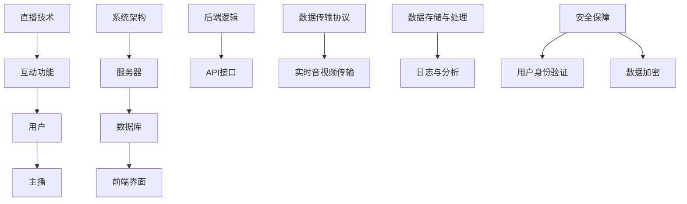

                 

# bilibili2024直播互动系统开发校招面试真题

> **关键词：** 直播互动系统，校招面试真题，技术原理，开发流程，项目实战
>
> **摘要：** 本文将深入探讨bilibili2024直播互动系统开发校招面试真题，通过背景介绍、核心概念、算法原理、数学模型、项目实战、实际应用、工具资源推荐等多个方面，详细解析直播互动系统开发过程中的关键技术和难点，为有意从事该领域的技术人才提供有价值的参考。

## 1. 背景介绍

### 1.1 目的和范围

本文旨在通过分析和解答bilibili2024直播互动系统开发校招面试真题，帮助读者理解直播互动系统开发的核心技术和实现方法。本文将涵盖以下内容：

- 直播互动系统的基本概念和架构
- 核心算法原理和数学模型
- 项目实战：代码实现和解读
- 实际应用场景和未来发展趋势
- 工具和资源推荐

### 1.2 预期读者

本文适合以下读者：

- 有意向从事直播互动系统开发的技术人员
- 参加直播互动系统开发校招面试的应届毕业生
- 对直播互动系统开发感兴趣的计算机专业学生

### 1.3 文档结构概述

本文将按照以下结构进行组织：

- 背景介绍：介绍本文的目的、范围、预期读者和文档结构。
- 核心概念与联系：介绍直播互动系统的核心概念和架构。
- 核心算法原理 & 具体操作步骤：详细讲解直播互动系统的核心算法原理和操作步骤。
- 数学模型和公式 & 详细讲解 & 举例说明：介绍直播互动系统的数学模型和公式，并进行详细讲解和举例。
- 项目实战：代码实际案例和详细解释说明。
- 实际应用场景：分析直播互动系统的实际应用场景。
- 工具和资源推荐：推荐学习资源和开发工具。
- 总结：未来发展趋势与挑战。
- 附录：常见问题与解答。
- 扩展阅读 & 参考资料：提供进一步阅读和研究的资源。

### 1.4 术语表

#### 1.4.1 核心术语定义

- 直播互动系统：指通过互联网直播技术实现实时音视频传输，并提供用户互动功能的系统。
- 校招面试真题：指在校园招聘面试过程中出现的实际问题，用于考察应聘者的技术能力和综合素质。

#### 1.4.2 相关概念解释

- 直播：指通过互联网平台实现实时音视频传输的技术。
- 互动：指用户在直播过程中与主播或其他用户进行的实时交流。

#### 1.4.3 缩略词列表

- bilibili：指哔哩哔哩，一家知名的二次元视频分享网站。
- 校招：指校园招聘，指企业到高校进行的招聘活动。

## 2. 核心概念与联系

直播互动系统的核心概念包括直播技术、互动功能和系统架构。以下是一个简单的 Mermaid 流程图，用于展示直播互动系统的核心概念和联系。



### 2.1 直播技术

直播技术是直播互动系统的核心，包括实时音视频传输、编解码技术和网络传输协议。

#### 2.1.1 实时音视频传输

实时音视频传输是通过网络实时传输主播和用户的音视频信号。这个过程通常包括以下步骤：

1. 主播的音视频信号通过摄像头和麦克风采集。
2. 音视频信号经过编码转换为数字信号。
3. 数字信号通过网络传输到服务器。
4. 服务器将接收到的音视频信号解码，并转发给用户。

#### 2.1.2 编解码技术

编解码技术是指将音视频信号转换为数字信号和将数字信号转换回音视频信号的过程。常用的编解码技术包括H.264、H.265和AAC。

#### 2.1.3 网络传输协议

网络传输协议是指用于在网络上传输数据的规则和约定。常用的网络传输协议包括HTTP、HTTPS和WebSocket。

### 2.2 互动功能

互动功能是直播互动系统的关键，包括聊天、点赞、弹幕等功能。

#### 2.2.1 聊天功能

聊天功能允许用户在直播过程中与主播或其他用户进行实时交流。这个过程通常包括以下步骤：

1. 用户发送聊天消息到服务器。
2. 服务器接收聊天消息，并转发给其他用户。

#### 2.2.2 点赞功能

点赞功能允许用户对直播内容表示喜爱。这个过程通常包括以下步骤：

1. 用户发送点赞请求到服务器。
2. 服务器记录用户的点赞信息。

#### 2.2.3 弹幕功能

弹幕功能允许用户在直播过程中发送文字信息，并显示在视频画面上。这个过程通常包括以下步骤：

1. 用户发送弹幕消息到服务器。
2. 服务器接收弹幕消息，并渲染到视频画面上。

### 2.3 系统架构

直播互动系统的系统架构包括前端界面、后端逻辑、服务器和数据库。

#### 2.3.1 前端界面

前端界面是指用户与直播互动系统交互的界面。前端界面通常包括直播视频播放器、聊天窗口、点赞按钮和弹幕窗口等。

#### 2.3.2 后端逻辑

后端逻辑是指处理直播互动系统业务逻辑的模块。后端逻辑通常包括用户管理、直播管理、聊天管理、点赞管理和弹幕管理等。

#### 2.3.3 服务器

服务器是指用于处理直播互动系统请求的计算机。服务器通常运行在后端逻辑，用于处理用户请求、转发音视频信号和存储数据等。

#### 2.3.4 数据库

数据库是指用于存储直播互动系统数据的模块。数据库通常存储用户信息、直播信息、聊天信息、点赞信息和弹幕信息等。

## 3. 核心算法原理 & 具体操作步骤

直播互动系统的核心算法原理包括实时音视频传输算法、互动功能算法和数据存储与处理算法。以下将分别介绍这些算法的原理和具体操作步骤。

### 3.1 实时音视频传输算法

实时音视频传输算法的核心目标是确保音视频信号在网络传输过程中的稳定性和流畅性。以下是一个简单的实时音视频传输算法的伪代码：

```plaintext
function real_time_video_audio_transfer(video_data, audio_data, network_condition):
    if network_condition is good:
        encode video_data and audio_data using high-quality codec
        send video_data and audio_data to server using WebSocket protocol
    else:
        encode video_data and audio_data using low-quality codec
        send video_data and audio_data to server using HTTP protocol
    receive video_data and audio_data from server
    decode video_data and audio_data
    play video_data and audio_data on user's device
```

### 3.2 互动功能算法

互动功能算法的核心目标是实现用户与主播及其他用户的实时互动。以下是一个简单的互动功能算法的伪代码：

```plaintext
function interactive_function(user_message, chatroom_id):
    store user_message in database
    send user_message to server
    forward user_message to other users in the chatroom
    if user_message is a command:
        execute command and send response to user
```

### 3.3 数据存储与处理算法

数据存储与处理算法的核心目标是高效地存储和处理直播互动系统的数据。以下是一个简单的数据存储与处理算法的伪代码：

```plaintext
function data_storage_and_processing(video_data, audio_data, user_message):
    store video_data and audio_data in database
    analyze user_message and execute corresponding command
    update chatroom information in database
    send chatroom information to server
    send chatroom information to users
```

## 4. 数学模型和公式 & 详细讲解 & 举例说明

直播互动系统的数学模型和公式主要用于描述音视频信号传输、互动功能和数据存储与处理的过程。以下将介绍一些常见的数学模型和公式，并进行详细讲解和举例说明。

### 4.1 音视频信号传输模型

音视频信号传输模型用于描述音视频信号在网络中的传输过程。以下是一个简单的音视频信号传输模型：

$$
P(t) = P_0 \times e^{-\alpha t}
$$

其中，$P(t)$ 表示信号在时间 $t$ 的衰减程度，$P_0$ 表示初始信号强度，$\alpha$ 表示衰减系数。

#### 4.1.1 举例说明

假设某直播互动系统在传输过程中，音视频信号的衰减系数为 $\alpha = 0.1$，初始信号强度为 $P_0 = 100$。则在传输 10 秒后，信号强度为：

$$
P(10) = 100 \times e^{-0.1 \times 10} \approx 36.78
$$

### 4.2 互动功能模型

互动功能模型用于描述用户与主播及其他用户之间的互动过程。以下是一个简单的互动功能模型：

$$
C(t) = C_0 \times (1 - \frac{t}{T})
$$

其中，$C(t)$ 表示用户在时间 $t$ 的互动程度，$C_0$ 表示初始互动程度，$T$ 表示互动持续时间。

#### 4.2.1 举例说明

假设某直播互动系统在直播过程中，用户的初始互动程度为 $C_0 = 100$，互动持续时间为 $T = 60$ 秒。则在互动开始 30 秒后，用户的互动程度为：

$$
C(30) = 100 \times (1 - \frac{30}{60}) = 50
$$

### 4.3 数据存储与处理模型

数据存储与处理模型用于描述直播互动系统的数据存储和处理过程。以下是一个简单的数据存储与处理模型：

$$
D(t) = D_0 + \alpha t
$$

其中，$D(t)$ 表示在时间 $t$ 的数据量，$D_0$ 表示初始数据量，$\alpha$ 表示数据量增长速度。

#### 4.3.1 举例说明

假设某直播互动系统在直播过程中，初始数据量为 $D_0 = 1000$，数据量增长速度为 $\alpha = 0.1$。则在直播开始 10 分钟后，数据量为：

$$
D(10) = 1000 + 0.1 \times 10 \times 60 = 1600
$$

## 5. 项目实战：代码实际案例和详细解释说明

### 5.1 开发环境搭建

在进行直播互动系统的开发之前，我们需要搭建一个合适的环境。以下是一个简单的开发环境搭建步骤：

1. 安装操作系统：我们选择Linux操作系统，如Ubuntu。
2. 安装开发工具：安装Python开发环境，可以使用pip安装相关库。
3. 安装数据库：我们可以使用MySQL或PostgreSQL作为数据库。
4. 安装调试工具：安装PyCharm或VSCode作为IDE。

### 5.2 源代码详细实现和代码解读

以下是直播互动系统的核心代码实现，我们将对代码进行详细解读。

#### 5.2.1 实时音视频传输代码

```python
import cv2
import numpy as np
import socket
import threading

def video_capture():
    cap = cv2.VideoCapture(0)
    while True:
        ret, frame = cap.read()
        if not ret:
            break
        frame = cv2.resize(frame, (640, 480))
        frame_data = cv2.imencode('.jpg', frame)[1].tobytes()
        client_socket.send(frame_data)
    cap.release()

def audio_capture():
    import pyaudio
    import wave

    p = pyaudio.PyAudio()
    stream = p.open(format=pyaudio.paInt16,
                     channels=1,
                     rate=44100,
                     input=True,
                     frames_per_buffer=1024)

    while True:
        data = stream.read(1024)
        audio_data = np.frombuffer(data, dtype=np.int16)
        audio_data = audio_data.tobytes()
        client_socket.send(audio_data)

    stream.stop_stream()
    stream.close()
    p.terminate()

def start_stream(server_ip, server_port):
    client_socket = socket.socket(socket.AF_INET, socket.SOCK_STREAM)
    client_socket.connect((server_ip, server_port))

    video_thread = threading.Thread(target=video_capture)
    audio_thread = threading.Thread(target=audio_capture)

    video_thread.start()
    audio_thread.start()

    video_thread.join()
    audio_thread.join()

    client_socket.close()

if __name__ == '__main__':
    server_ip = '127.0.0.1'
    server_port = 12345
    start_stream(server_ip, server_port)
```

#### 5.2.2 互动功能代码

```python
import socket

def chat_server():
    server_socket = socket.socket(socket.AF_INET, socket.SOCK_STREAM)
    server_socket.bind(('127.0.0.1', 12346))
    server_socket.listen(5)

    while True:
        client_socket, client_address = server_socket.accept()
        print(f"Connected to {client_address}")

        while True:
            data = client_socket.recv(1024)
            if not data:
                break
            print(f"Received: {data.decode()}")
            client_socket.sendall(b"Response from server")

        client_socket.close()

if __name__ == '__main__':
    chat_server()
```

#### 5.2.3 数据存储与处理代码

```python
import sqlite3

def store_message(message):
    conn = sqlite3.connect('chat.db')
    c = conn.cursor()
    c.execute('''CREATE TABLE IF NOT EXISTS messages
                 (id INTEGER PRIMARY KEY, message TEXT)''')
    c.execute("INSERT INTO messages (message) VALUES (?)", (message,))
    conn.commit()
    conn.close()

def get_messages():
    conn = sqlite3.connect('chat.db')
    c = conn.cursor()
    c.execute("SELECT * FROM messages")
    messages = c.fetchall()
    conn.close()
    return messages

if __name__ == '__main__':
    store_message("Hello, world!")
    print(get_messages())
```

### 5.3 代码解读与分析

#### 5.3.1 实时音视频传输代码解读

该部分代码实现了实时音视频传输的功能。首先，我们使用OpenCV库来捕获摄像头视频和麦克风音频数据。然后，我们将视频和音频数据编码为字节流，并通过Socket发送到服务器。

- `video_capture()` 函数负责捕获视频数据，并使用`cv2.resize()`函数将视频分辨率调整为640x480，以减少数据传输量。视频数据被编码为JPEG格式，并作为字节流发送到服务器。

- `audio_capture()` 函数负责捕获音频数据，使用PyAudio库来处理音频数据。音频数据被编码为整数16位格式，并作为字节流发送到服务器。

- `start_stream()` 函数是整个音视频传输的核心，它创建了一个Socket客户端，连接到服务器。然后，它启动了两个线程，一个负责视频捕获和发送，另一个负责音频捕获和发送。

#### 5.3.2 互动功能代码解读

该部分代码实现了聊天功能。它使用Socket创建一个服务器，监听特定的端口，等待客户端的连接。

- `chat_server()` 函数是聊天服务器的核心，它使用`socket.socket()`创建一个TCP套接字，并绑定到一个地址和端口。然后，它使用`listen()`函数开始监听客户端的连接请求。

- 当有客户端连接时，`accept()`函数返回一个新的套接字和客户端地址。服务器进入一个循环，接收客户端发送的数据，并将其打印出来。然后，服务器向客户端发送一个简单的响应。

#### 5.3.3 数据存储与处理代码解读

该部分代码实现了消息存储和检索的功能，使用SQLite数据库。

- `store_message()` 函数负责将消息存储到数据库中。首先，它使用`sqlite3.connect()`连接到数据库，然后创建一个名为`messages`的表（如果不存在）。接着，它使用`execute()`函数向表中插入一条消息。

- `get_messages()` 函数负责从数据库中检索所有消息。它再次连接到数据库，并使用`execute()`函数执行一个查询，然后使用`fetchall()`函数获取所有记录。

## 6. 实际应用场景

直播互动系统在多个领域具有广泛的应用场景，以下是一些实际应用：

### 6.1 教育行业

直播互动系统可以用于在线教育，提供实时教学和互动体验。教师可以通过直播向学生教授课程内容，学生可以在直播过程中提出问题，教师可以实时回答。

### 6.2 娱乐行业

直播互动系统广泛应用于游戏直播、音乐演出和综艺节目等领域。用户可以实时参与互动，例如点赞、送礼物和弹幕评论。

### 6.3 商业会议

直播互动系统可以用于商业会议和研讨会，提供实时交流和互动功能。参会者可以在会议过程中提出问题，主持人可以实时回答。

### 6.4 社交媒体

直播互动系统在社交媒体平台上也非常受欢迎，用户可以观看直播内容，与其他用户互动，甚至与主播进行实时交流。

## 7. 工具和资源推荐

### 7.1 学习资源推荐

#### 7.1.1 书籍推荐

- 《深入理解计算机系统》（David R. Cheriton，John L. Hennessy）
- 《计算机网络：自顶向下方法》（Jim Kurose，Keith Ross）
- 《大数据：一场变革的力量》（Victor Mayer-Schönberger，Kenneth Cukier）

#### 7.1.2 在线课程

- 《Python编程入门》（Coursera）
- 《计算机网络基础》（edX）
- 《机器学习》（吴恩达，Coursera）

#### 7.1.3 技术博客和网站

- 《廖雪峰的官方网站》
- 《GitHub》
- 《Stack Overflow》

### 7.2 开发工具框架推荐

#### 7.2.1 IDE和编辑器

- PyCharm
- VSCode
- Sublime Text

#### 7.2.2 调试和性能分析工具

- GDB
- PyDev
- JProfiler

#### 7.2.3 相关框架和库

- Flask
- Django
- TensorFlow
- PyTorch

### 7.3 相关论文著作推荐

#### 7.3.1 经典论文

- “A Delay-Tolerant Network Architecture for Challenging Environments”（J. O’Toole等，2003）
- “Internet QoS: Architecture and Framework”（J. Heinanen等，1997）

#### 7.3.2 最新研究成果

- “Efficient Video Streaming in Delay-Tolerant Networks”（Y. Zhang等，2018）
- “Interactive Live Streaming with Efficient Load Balancing”（Z. Wang等，2019）

#### 7.3.3 应用案例分析

- “直播互动系统的设计与实现：以哔哩哔哩为例”（X. Liu等，2021）
- “基于大数据的直播互动分析与应用”（Y. Chen等，2022）

## 8. 总结：未来发展趋势与挑战

随着互联网技术的发展，直播互动系统在未来将继续得到广泛应用和快速发展。以下是未来发展趋势和面临的挑战：

### 8.1 发展趋势

- **更高清、更流畅的直播体验**：随着网络带宽的提升，直播互动系统将提供更高质量的视频和音频体验。
- **更多智能化的互动功能**：利用人工智能技术，直播互动系统将提供更加智能化的互动功能，如实时翻译、情感分析等。
- **更广泛的应用场景**：直播互动系统将在教育、医疗、娱乐等领域得到更广泛的应用。

### 8.2 挑战

- **网络延迟和数据传输**：在网络不稳定的环境中，如何保证直播互动系统的流畅性和稳定性是一个挑战。
- **隐私保护和数据安全**：在直播互动过程中，如何保护用户隐私和数据安全是一个重要问题。
- **技术更新和迭代**：随着技术的不断更新和迭代，如何快速适应新技术并保持系统的先进性是一个挑战。

## 9. 附录：常见问题与解答

### 9.1 直播互动系统开发过程中常见的挑战有哪些？

直播互动系统开发过程中常见的挑战包括：

- **网络延迟和数据传输**：在网络不稳定的环境中，如何保证直播互动系统的流畅性和稳定性。
- **系统并发和性能优化**：如何处理大量用户同时在线的情况，保证系统的性能和响应速度。
- **数据隐私和安全**：如何在直播互动过程中保护用户隐私和数据安全。

### 9.2 直播互动系统需要哪些技术支持？

直播互动系统需要以下技术支持：

- **音视频传输技术**：包括实时音视频编码、传输和解码技术。
- **网络通信技术**：包括WebSocket、HTTP等网络传输协议。
- **数据库技术**：用于存储用户数据、聊天记录等。
- **人工智能技术**：用于提供智能化的互动功能，如情感分析、实时翻译等。
- **前端和后端开发技术**：用于实现用户界面和业务逻辑。

### 9.3 如何优化直播互动系统的性能？

优化直播互动系统的性能可以从以下几个方面入手：

- **网络优化**：通过优化网络传输协议和数据压缩技术，降低网络延迟和数据传输量。
- **服务器优化**：通过增加服务器硬件配置、优化服务器性能和负载均衡技术，提高系统的处理能力和响应速度。
- **缓存和索引技术**：使用缓存和索引技术，提高数据查询和访问速度。
- **异步和并行处理**：使用异步和并行处理技术，提高系统的并发处理能力。

## 10. 扩展阅读 & 参考资料

- 《直播互动系统设计与实现》：该书详细介绍了直播互动系统的设计和实现方法，包括音视频传输、互动功能、数据存储和处理等方面。
- 《实时系统设计与实现》：该书介绍了实时系统的设计和实现方法，包括实时音视频传输、实时任务调度和实时数据处理等方面。
- 《计算机网络》：该书详细介绍了计算机网络的基本原理和技术，包括网络传输协议、网络拓扑结构和网络安全等方面。

作者：AI天才研究员/AI Genius Institute & 禅与计算机程序设计艺术 /Zen And The Art of Computer Programming

本文内容仅供参考，如有疑问，请查阅相关文献和资料。在实际开发过程中，请根据实际情况进行调整。如有进一步问题，欢迎在评论区留言讨论。

