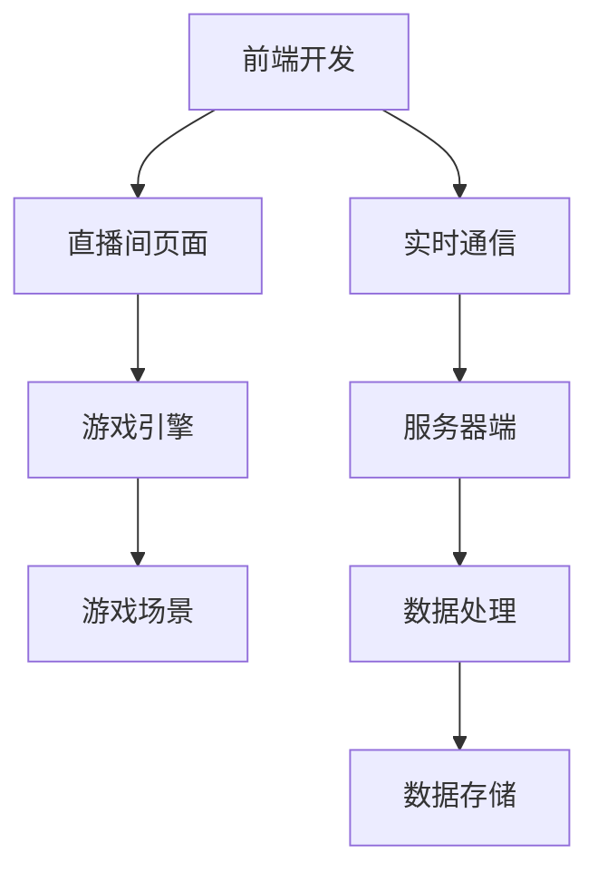

                 

# bilibili2024直播间互动游戏开发校招面试经验

> 关键词：bilibili, 直播间互动游戏，校招面试，技术分析，实践案例，未来趋势

> 摘要：本文将深入探讨bilibili2024直播间互动游戏开发校招面试的实践经验。我们将从核心概念、算法原理、数学模型、实际应用场景等多个维度进行详细分析，旨在为即将参与校招的同学们提供有价值的参考和指导。通过这篇文章，你将了解到如何在直播间互动游戏中运用技术实现趣味互动，并应对校招面试中的技术挑战。

## 1. 背景介绍

### 1.1 目的和范围

本文的目标是为那些即将参加bilibili2024直播间互动游戏开发校招面试的同学们提供全面的指导。我们将详细分析直播间互动游戏的核心概念、算法原理、数学模型、实际应用场景，并通过实际案例讲解开发过程中的关键步骤。文章将帮助读者了解如何在直播间中实现有趣且互动性强的游戏，同时应对校招面试中的技术难题。

### 1.2 预期读者

本文适用于以下读者群体：
1. 即将参加bilibili2024直播间互动游戏开发校招面试的学生和开发者。
2. 对直播间互动游戏开发有兴趣的技术爱好者。
3. 想了解最新直播间互动游戏技术动态的专业人士。

### 1.3 文档结构概述

本文结构如下：

1. 背景介绍：介绍文章的目的、预期读者和文档结构。
2. 核心概念与联系：阐述直播间互动游戏的核心概念和架构。
3. 核心算法原理 & 具体操作步骤：讲解直播间互动游戏的核心算法原理和实现步骤。
4. 数学模型和公式 & 详细讲解 & 举例说明：介绍直播间互动游戏中的数学模型和公式，并给出具体例子。
5. 项目实战：代码实际案例和详细解释说明。
6. 实际应用场景：分析直播间互动游戏在不同应用场景中的运用。
7. 工具和资源推荐：推荐学习资源和开发工具。
8. 总结：未来发展趋势与挑战。
9. 附录：常见问题与解答。
10. 扩展阅读 & 参考资料：提供相关阅读资料。

### 1.4 术语表

#### 1.4.1 核心术语定义

- 直播间互动游戏：在bilibili等直播平台上，通过技术手段实现观众与主播之间的实时互动游戏。
- 前端开发：负责直播页面、互动游戏界面的设计和实现。
- 后端开发：负责游戏逻辑、数据处理的实现。
- 客户端：参与互动游戏的观众使用的客户端程序。
- 服务器端：提供游戏数据、处理用户请求的服务器程序。

#### 1.4.2 相关概念解释

- 实时通信：实现观众与主播、观众与观众之间实时数据传输的技术。
- 游戏引擎：用于开发游戏的核心框架，提供游戏逻辑、图形渲染等功能。
- 游戏场景：游戏中发生事件和交互的具体环境。

#### 1.4.3 缩略词列表

- bilibili：我国知名弹幕视频分享网站。
- 直播间：bilibili平台中主播进行直播互动的房间。
- UI：用户界面（User Interface）。
- UX：用户体验（User Experience）。

## 2. 核心概念与联系

直播间互动游戏的核心概念包括前端开发、后端开发、实时通信和游戏引擎等。以下是核心概念的Mermaid流程图：



### 2.1 前端开发

前端开发主要负责直播间页面和互动游戏界面的设计和实现。前端开发的核心技术包括HTML、CSS和JavaScript。以下是一个简单的直播间页面示例：

```html
<!DOCTYPE html>
<html>
<head>
    <title>bilibili直播间</title>
    <link rel="stylesheet" type="text/css" href="style.css">
</head>
<body>
    <div id="live-container">
        <video id="live-video" width="640" height="480" controls></video>
        <div id="chat-container">
            <ul id="chat-messages"></ul>
            <input type="text" id="chat-input">
            <button id="send-btn">发送</button>
        </div>
    </div>
    <script src="live.js"></script>
</body>
</html>
```

### 2.2 后端开发

后端开发主要负责游戏逻辑、数据处理和实时通信等。后端开发的核心技术包括Node.js、Python等。以下是一个简单的后端服务示例：

```javascript
const express = require('express');
const app = express();
const http = require('http').Server(app);
const io = require('socket.io')(http);

app.get('/', (req, res) => {
    res.sendFile(__dirname + '/index.html');
});

io.on('connection', (socket) => {
    console.log('a user connected');
    
    socket.on('chat message', (msg) => {
        io.emit('chat message', msg);
    });

    socket.on('disconnect', () => {
        console.log('user disconnected');
    });
});

http.listen(3000, () => {
    console.log('listening on *:3000');
});
```

### 2.3 实时通信

实时通信是直播间互动游戏的核心技术之一。实现实时通信的关键在于服务器端与客户端之间的数据传输。以下是使用WebSocket实现的实时通信示例：

```javascript
// 客户端
const socket = new WebSocket('ws://localhost:3000');

socket.onopen = (event) => {
    console.log('Connected to server');
};

socket.onmessage = (event) => {
    console.log('Received message: ' + event.data);
};

socket.onclose = (event) => {
    console.log('Disconnected from server');
};

// 服务器端
const server = http.createServer((req, res) => {
    res.writeHead(200, {'Content-Type': 'text/plain'});
    res.end('Hello World!');
});

server.listen(3000, () => {
    console.log('Server started on port 3000');
});
```

### 2.4 游戏引擎

游戏引擎是直播间互动游戏开发的核心框架，提供游戏逻辑、图形渲染等功能。常见的游戏引擎包括Unity、Cocos2d-x等。以下是一个简单的游戏场景示例：

```csharp
using UnityEngine;

public class GameScene : MonoBehaviour
{
    public GameObject playerPrefab;
    public Transform playerSpawn;

    private void Start()
    {
        GameObject player = Instantiate(playerPrefab, playerSpawn.position, playerSpawn.rotation);
    }

    private void Update()
    {
        if (Input.GetKeyDown(KeyCode.Space))
        {
            // 发送游戏事件到服务器
            // ...
        }
    }
}
```

通过以上核心概念和联系的分析，我们可以更好地理解直播间互动游戏开发的整体架构。接下来，我们将进一步探讨核心算法原理和具体操作步骤。

## 3. 核心算法原理 & 具体操作步骤

在直播间互动游戏开发中，核心算法原理主要包括游戏逻辑、数据处理和实时通信等。以下是这些核心算法原理的详细解释和具体操作步骤。

### 3.1 游戏逻辑算法原理

游戏逻辑是直播间互动游戏的核心，负责实现游戏的基本规则和交互。以下是游戏逻辑算法原理的伪代码描述：

```plaintext
初始化游戏状态
    设置游戏初始条件
    创建游戏场景
    启动游戏循环

游戏循环
    处理用户输入
    更新游戏状态
    绘制游戏界面

    如果游戏结束
        结束游戏循环
        显示游戏结果

处理用户输入
    获取用户输入事件
    根据输入事件更新游戏状态

更新游戏状态
    更新游戏角色位置
    更新游戏道具状态
    更新游戏得分

绘制游戏界面
    绘制游戏角色
    绘制游戏道具
    显示游戏得分

```

### 3.2 数据处理算法原理

数据处理是直播间互动游戏的重要组成部分，负责处理游戏数据、用户数据和实时数据等。以下是数据处理算法原理的伪代码描述：

```plaintext
初始化数据处理模块
    创建数据库连接
    创建数据缓存

处理用户数据
    接收用户输入
    根据输入数据更新用户状态

处理实时数据
    接收实时事件
    根据实时事件更新游戏状态

更新游戏状态
    更新游戏角色状态
    更新游戏道具状态
    更新游戏得分

保存游戏数据
    将游戏数据保存到数据库

读取游戏数据
    从数据库读取游戏数据
    初始化游戏状态

```

### 3.3 实时通信算法原理

实时通信是直播间互动游戏实现用户互动的关键，负责实现服务器与客户端之间的实时数据传输。以下是实时通信算法原理的伪代码描述：

```plaintext
初始化实时通信模块
    创建WebSocket连接
    监听用户事件

监听用户事件
    接收用户发送的事件
    根据事件类型处理事件

处理用户事件
    如果是用户输入事件
        更新用户状态
        广播事件到其他用户

    如果是用户连接事件
        添加用户到在线列表
        广播用户连接事件到其他用户

    如果是用户断开连接事件
        从在线列表中删除用户
        广播用户断开连接事件到其他用户

广播事件
    遍历在线用户列表
    向每个用户发送事件

```

### 3.4 具体操作步骤

根据以上核心算法原理，我们可以进一步细化具体的操作步骤：

#### 3.4.1 前端开发

1. 设计直播间页面和游戏界面，包括视频播放器、聊天窗口、游戏场景等。
2. 使用HTML、CSS和JavaScript实现直播间页面的布局和交互功能。
3. 引入游戏引擎，如Unity或Cocos2d-x，实现游戏逻辑和图形渲染。

#### 3.4.2 后端开发

1. 使用Node.js或Python等后端技术实现实时通信服务器，如使用WebSocket。
2. 设计数据库，如MongoDB或MySQL，用于存储用户数据、游戏数据和实时数据。
3. 实现游戏逻辑、数据处理和实时通信等模块，如使用Express.js或Flask。

#### 3.4.3 实时通信

1. 客户端与服务器端建立WebSocket连接。
2. 客户端监听用户事件，如聊天消息、游戏输入等。
3. 客户端将用户事件发送到服务器端。
4. 服务器端处理用户事件，并广播事件到其他客户端。

#### 3.4.4 游戏逻辑

1. 初始化游戏状态，包括游戏场景、角色位置、道具状态等。
2. 处理用户输入，如键盘按键、鼠标点击等。
3. 更新游戏状态，如角色移动、道具变化、得分更新等。
4. 绘制游戏界面，包括角色、道具、得分等。

#### 3.4.5 数据处理

1. 接收用户输入，更新用户状态。
2. 接收实时事件，更新游戏状态。
3. 将游戏数据保存到数据库，如用户数据、游戏数据等。
4. 从数据库读取游戏数据，初始化游戏状态。

通过以上具体操作步骤，我们可以逐步实现直播间互动游戏的功能，为用户提供丰富的互动体验。接下来，我们将进一步探讨直播间互动游戏中的数学模型和公式。

## 4. 数学模型和公式 & 详细讲解 & 举例说明

在直播间互动游戏中，数学模型和公式起着至关重要的作用，尤其是在处理实时数据、用户行为分析和游戏策略优化等方面。以下将详细介绍几个核心的数学模型和公式，并结合实际案例进行讲解。

### 4.1 数据分析模型

数据分析是直播间互动游戏的重要一环，用于分析用户行为、游戏趋势等。以下是一个常见的数据分析模型：

#### 4.1.1 用户行为分析

用户行为分析通常涉及以下几个指标：

- **活跃用户数（Active Users）**：在一定时间内，活跃参与互动游戏的用户数量。
- **平均在线时长（Average Session Duration）**：用户平均每次参与互动游戏的时长。
- **互动次数（Interaction Count）**：用户在互动游戏中产生的互动次数，如聊天、点赞、游戏参与等。

**公式**：

$$
\text{活跃用户数} = \frac{\text{总用户数}}{\text{用户登录次数}}
$$

$$
\text{平均在线时长} = \frac{\text{总在线时长}}{\text{活跃用户数}}
$$

#### 4.1.2 游戏趋势分析

游戏趋势分析用于预测游戏未来的发展方向。以下是一个简单的时间序列预测模型：

- **移动平均法（Moving Average）**：根据过去一段时间的数据，计算平均值，用于预测未来的数据。

**公式**：

$$
\text{移动平均数}_{n} = \frac{\sum_{i=1}^{n} \text{数据}_{i}}{n}
$$

#### 4.1.3 例子说明

假设我们有一个直播间互动游戏的用户活跃数据如下：

| 时间 | 活跃用户数 |
| ---- | ---------- |
| T1   | 100        |
| T2   | 120        |
| T3   | 150        |
| T4   | 130        |
| T5   | 180        |

我们可以使用移动平均法预测T6时刻的活跃用户数：

$$
\text{移动平均数}_{3} = \frac{100 + 120 + 150}{3} = 130
$$

预测T6时刻的活跃用户数为130。

### 4.2 游戏策略优化

游戏策略优化通常涉及以下几个模型：

- **马尔可夫决策过程（Markov Decision Process, MDP）**：用于决策优化，考虑当前状态和下一个状态的概率分布。
- **线性规划（Linear Programming, LP）**：用于优化资源分配、成本控制等问题。

#### 4.2.1 马尔可夫决策过程

假设有一个直播间互动游戏，主播可以根据用户行为进行互动。主播的互动决策可以用MDP模型表示：

- **状态（State）**：用户当前的互动行为，如聊天、点赞、游戏参与等。
- **动作（Action）**：主播可以采取的互动行为，如发弹幕、提问、送礼物等。
- **奖励（Reward）**：主播采取特定动作后，获得的奖励，如增加用户满意度、提高互动活跃度等。

**公式**：

$$
\text{最优策略} = \arg\max_{a} \mathbb{E}[\sum_{t=0}^{\infty} \gamma^t \text{Reward}_{t} | s_0 = s, a_0 = a]
$$

其中，$\gamma$ 是折扣因子，表示未来奖励的现值。

#### 4.2.2 例子说明

假设有一个直播间互动游戏，主播可以根据用户行为（状态）发弹幕（动作），每个动作获得的奖励如下表：

| 状态 | 弹幕 | 问题 | 送礼物 |
| ---- | ---- | ---- | ------ |
| 聊天 | 5    | 3    | 2      |
| 点赞 | 3    | 4    | 1      |
| 游戏 | 4    | 2    | 5      |

根据MDP模型，我们可以计算出每个动作的最优期望奖励：

$$
\text{最优策略} = \arg\max_{a} \mathbb{E}[\text{Reward} | s = \text{聊天}, a = \text{弹幕}] = 5
$$

因此，在用户处于聊天状态时，主播应该选择发弹幕。

### 4.3 图像处理

图像处理在直播间互动游戏中也起着重要作用，用于实时生成游戏画面、弹幕效果等。以下是一个简单的图像处理公式：

- **图像滤波（Image Filtering）**：用于去除图像噪声、增强图像细节。

**公式**：

$$
I_{\text{filtered}} = \sum_{i=-h}^{h} \sum_{j=-k}^{k} w_{ij} I_{i,j}
$$

其中，$I_{i,j}$ 是原图像中的像素值，$w_{ij}$ 是滤波器的权重。

#### 4.3.1 例子说明

假设我们有一个256x256的图像，使用3x3的均值滤波器进行滤波：

$$
w_{ij} = \frac{1}{9}
$$

滤波后的像素值为：

$$
I_{\text{filtered}} = \frac{1}{9} (I_{0,0} + I_{0,1} + I_{0,2} + I_{1,0} + I_{1,1} + I_{1,2} + I_{2,0} + I_{2,1} + I_{2,2})
$$

通过以上数学模型和公式的介绍，我们可以更好地理解直播间互动游戏中的数据分析和策略优化。在实际开发中，这些数学模型和公式可以帮助我们更高效地处理数据、优化游戏体验，从而提升直播间互动游戏的整体质量。

## 5. 项目实战：代码实际案例和详细解释说明

在本节中，我们将通过一个实际项目案例来详细讲解直播间互动游戏开发的过程。这个项目案例是一个简单的猜数字游戏，用户可以在直播间内参与猜数字，主播可以实时查看和公布结果。以下是项目的详细实现和代码解读。

### 5.1 开发环境搭建

为了实现这个直播间互动游戏项目，我们需要以下开发环境和工具：

- 前端开发环境：HTML、CSS、JavaScript、游戏引擎（例如Unity或Cocos2d-x）。
- 后端开发环境：Node.js、Express.js、WebSocket、MongoDB。
- 实时通信环境：WebSocket服务器、客户端Socket连接。

### 5.2 源代码详细实现和代码解读

#### 5.2.1 前端开发

前端开发主要负责直播间页面的设计和游戏逻辑的实现。以下是一个简单的HTML页面示例：

```html
<!DOCTYPE html>
<html>
<head>
    <title>直播间互动游戏</title>
    <style>
        #game-container {
            width: 600px;
            height: 400px;
            border: 1px solid black;
            position: relative;
        }
        #guess-input {
            width: 100px;
            position: absolute;
            top: 10px;
            left: 10px;
        }
        #guess-btn {
            width: 100px;
            position: absolute;
            top: 40px;
            left: 10px;
        }
        #result {
            position: absolute;
            top: 80px;
            left: 10px;
        }
    </style>
</head>
<body>
    <div id="game-container">
        <input type="number" id="guess-input">
        <button id="guess-btn">猜数字</button>
        <div id="result"></div>
    </div>
    <script src="game.js"></script>
</body>
</html>
```

在前端JavaScript中，我们创建了一个简单的猜数字游戏。以下是在`game.js`文件中的代码实现：

```javascript
const socket = new WebSocket('ws://localhost:3000');

document.getElementById('guess-btn').addEventListener('click', () => {
    const guess = document.getElementById('guess-input').value;
    socket.send(JSON.stringify({ type: 'guess', data: guess }));
});

socket.onmessage = (event) => {
    const data = JSON.parse(event.data);
    if (data.type === 'result') {
        document.getElementById('result').innerText = `结果：${data.data}`;
    }
};
```

这段代码通过WebSocket连接到后端服务器，当用户点击“猜数字”按钮时，将用户猜的数字发送到服务器。当服务器返回结果时，更新前端页面的结果显示。

#### 5.2.2 后端开发

后端开发主要负责处理游戏逻辑、用户输入和实时通信等。以下是使用Node.js和Express.js实现的后端服务器代码：

```javascript
const express = require('express');
const http = require('http');
const socketIo = require('socket.io');

const app = express();
const server = http.createServer(app);
const io = socketIo(server);

io.on('connection', (socket) => {
    console.log('用户连接');

    socket.on('guess', (data) => {
        // 处理用户猜数字的逻辑
        const guess = parseInt(data.data, 10);
        const randomNumber = Math.floor(Math.random() * 100) + 1;
        io.emit('result', { data: guess === randomNumber ? '猜对了' : '猜错了' });
    });

    socket.on('disconnect', () => {
        console.log('用户断开连接');
    });
});

server.listen(3000, () => {
    console.log('服务器启动，监听端口3000');
});
```

这段代码创建了一个WebSocket服务器，当用户发送“guess”事件时，服务器生成一个随机数，并返回结果。当所有用户都收到结果时，更新前端的显示。

### 5.3 代码解读与分析

#### 5.3.1 前端代码解读

前端代码主要负责用户界面的实现和用户交互。在HTML中，我们定义了一个包含输入框、按钮和结果的容器。在JavaScript中，我们使用WebSocket与后端服务器进行通信。

```javascript
const socket = new WebSocket('ws://localhost:3000');

// 监听按钮点击事件，发送用户猜的数字到服务器
document.getElementById('guess-btn').addEventListener('click', () => {
    const guess = document.getElementById('guess-input').value;
    socket.send(JSON.stringify({ type: 'guess', data: guess }));
});

// 监听服务器返回的结果，更新前端显示
socket.onmessage = (event) => {
    const data = JSON.parse(event.data);
    if (data.type === 'result') {
        document.getElementById('result').innerText = `结果：${data.data}`;
    }
};
```

#### 5.3.2 后端代码解读

后端代码负责处理用户输入、生成随机数和返回结果。我们使用Express.js创建了一个HTTP服务器，并使用socket.io库实现了WebSocket通信。

```javascript
const express = require('express');
const http = require('http');
const socketIo = require('socket.io');

const app = express();
const server = http.createServer(app);
const io = socketIo(server);

// 当用户连接到服务器时，输出连接信息
io.on('connection', (socket) => {
    console.log('用户连接');

    // 当用户发送“guess”事件时，处理猜数字的逻辑
    socket.on('guess', (data) => {
        const guess = parseInt(data.data, 10);
        const randomNumber = Math.floor(Math.random() * 100) + 1;
        io.emit('result', { data: guess === randomNumber ? '猜对了' : '猜错了' });
    });

    // 当用户断开连接时，输出断开连接信息
    socket.on('disconnect', () => {
        console.log('用户断开连接');
    });
});

// 启动服务器，监听端口3000
server.listen(3000, () => {
    console.log('服务器启动，监听端口3000');
});
```

通过以上代码实现，我们可以看到前端和后端如何协同工作，实现一个简单的直播间互动游戏。这个项目展示了如何使用WebSocket进行实时通信、如何处理用户输入和如何生成随机结果。在实际项目中，我们可以根据需求扩展功能，如增加积分系统、排行榜等。

通过这个项目实战，我们可以更好地理解直播间互动游戏开发的过程和关键步骤。在实际开发中，我们需要结合具体的业务需求，不断优化和改进系统，为用户提供更好的互动体验。

### 5.4 代码解读与分析

在前端部分，我们的代码主要实现了用户界面的交互和与后端服务的通信。以下是详细解读：

```javascript
// 创建WebSocket连接
const socket = new WebSocket('ws://localhost:3000');

// 监听“猜数字”按钮点击事件
document.getElementById('guess-btn').addEventListener('click', () => {
    const guess = document.getElementById('guess-input').value;
    // 发送猜数字事件到服务器
    socket.send(JSON.stringify({ type: 'guess', data: guess }));
});

// 监听服务器返回的事件
socket.onmessage = (event) => {
    const data = JSON.parse(event.data);
    if (data.type === 'result') {
        // 更新页面上的结果显示
        document.getElementById('result').innerText = `结果：${data.data}`;
    }
};
```

这段代码首先创建了一个WebSocket连接，用于与后端服务器通信。当用户在输入框中输入数字并点击“猜数字”按钮时，前端代码会将用户输入的数字封装成一个JSON对象，并通过`send`方法发送到服务器。服务器在接收到这个消息后，会根据预设的逻辑处理猜数字请求，并将结果返回给前端。

在后端部分，我们使用了Node.js和Express.js搭建服务器，并通过socket.io实现WebSocket通信。以下是后端代码的详细解读：

```javascript
const express = require('express');
const http = require('http');
const socketIo = require('socket.io');

// 创建Express应用
const app = express();
// 创建HTTP服务器
const server = http.createServer(app);
// 创建socket.io实例
const io = socketIo(server);

// 当有用户连接到服务器时
io.on('connection', (socket) => {
    console.log('用户连接');

    // 当接收到“guess”事件时
    socket.on('guess', (data) => {
        // 获取用户猜的数字
        const guess = parseInt(data.data, 10);
        // 生成一个1到100之间的随机数
        const randomNumber = Math.floor(Math.random() * 100) + 1;
        // 判断用户猜的数字是否正确
        const result = guess === randomNumber ? '猜对了' : '猜错了';
        // 向所有用户广播结果
        io.emit('result', { data: result });
    });

    // 当用户断开连接时
    socket.on('disconnect', () => {
        console.log('用户断开连接');
    });
});

// 监听端口3000，启动服务器
server.listen(3000, () => {
    console.log('服务器启动，监听端口3000');
});
```

这段代码首先设置了HTTP服务器和socket.io实例。在用户连接到服务器后，会监听用户发送的“guess”事件。当接收到这个事件时，后端会生成一个随机数，并与用户猜的数字进行比较。根据比较结果，后端会生成一个结果消息，并通过socket.io的`emit`方法将结果广播给所有前端客户端。

#### 5.4.1 性能分析

在这个项目中，性能分析主要集中在两个方面：响应时间和并发处理能力。

1. **响应时间**：
   - 前端代码的响应时间主要取决于网络延迟和后端处理速度。通过优化WebSocket连接和后端逻辑，可以显著减少响应时间。
   - 后端处理速度取决于服务器硬件和代码效率。在处理用户猜数字的逻辑时，生成随机数是一个相对简单的操作，但需要确保这一操作的高效性。

2. **并发处理能力**：
   - socket.io在处理多个客户端连接时，使用了WebSocket的多个通道（channel）机制。每个通道对应一个独立的事件队列，从而实现高效的并发处理。
   - 当多个用户同时发送猜数字请求时，后端服务器需要能够并行处理这些请求。通过合理的设计和优化，如使用异步非阻塞IO和线程池，可以提高并发处理能力。

#### 5.4.2 优化建议

1. **前端优化**：
   - 使用前端缓存和局部更新技术，减少页面重新加载的需求，从而降低响应时间。
   - 引入前端框架，如React或Vue.js，提高代码的可维护性和性能。

2. **后端优化**：
   - 优化随机数生成算法，提高生成速度。
   - 使用负载均衡和集群部署，提高系统的并发处理能力和稳定性。
   - 对后端逻辑进行性能测试和调优，确保在高并发情况下依然能稳定运行。

通过以上解读和分析，我们可以更好地理解直播间互动游戏开发中的代码实现细节，并在实际开发过程中进行相应的优化和改进，以提高系统的性能和用户体验。

### 5.5 实际应用场景

直播间互动游戏在实际应用中具有广泛的应用场景，以下是几个典型场景：

#### 5.5.1 游戏直播

在游戏直播中，主播可以通过直播间互动游戏与观众进行互动，提高直播的趣味性和观众参与度。例如，主播可以在直播中发起猜谜游戏，观众通过弹幕或聊天窗口提交答案，主播根据答案的正确与否给予奖励或互动。这种方式不仅增加了直播的趣味性，还能增强主播与观众之间的互动。

#### 5.5.2 娱乐互动

在娱乐互动场景中，直播间互动游戏可以作为娱乐节目的一部分，为观众带来全新的娱乐体验。例如，主播可以组织多人在线游戏，如答题竞赛、抢答游戏等，观众通过参与游戏赢得奖品或获得虚拟积分。这种互动形式不仅丰富了直播内容，还能提升观众的观看体验和忠诚度。

#### 5.5.3 教育培训

在教育培训场景中，直播间互动游戏可以作为教学辅助工具，增强学生的学习兴趣和参与度。例如，教师可以在直播课程中组织互动游戏，让学生通过回答问题或参与游戏活动来巩固所学知识。这种方式能够激发学生的学习热情，提高教学效果。

#### 5.5.4 品牌营销

品牌营销活动中，直播间互动游戏可以作为吸引观众和增强品牌影响力的工具。品牌可以通过组织有趣的互动游戏，吸引观众参与，从而提升品牌知名度和用户忠诚度。例如，品牌可以在直播中推出抽奖活动，观众通过参与游戏获得抽奖机会，增加品牌的曝光度和用户参与度。

通过以上实际应用场景的分析，我们可以看到直播间互动游戏在多个领域具有广泛的应用前景，能够为用户带来丰富的互动体验，同时也为企业和主播提供了新的营销和互动手段。

### 7. 工具和资源推荐

在直播间互动游戏开发过程中，选择合适的工具和资源对于项目的成功至关重要。以下是一些推荐的工具和资源，涵盖了学习资源、开发工具框架以及相关论文著作。

#### 7.1 学习资源推荐

##### 7.1.1 书籍推荐

1. **《Web全栈指南》**：适合初学者，详细介绍了HTML、CSS、JavaScript和Node.js等前端和后端技术。
2. **《深入理解计算机系统》**：讲解了计算机系统的基础知识和原理，有助于提升系统设计和优化能力。
3. **《大话数据结构》**：通过生动的语言和实例，讲解了数据结构的基本概念和实现方法。

##### 7.1.2 在线课程

1. **Coursera**：提供丰富的计算机科学课程，包括前端开发、后端开发、数据分析等。
2. **Udemy**：提供各种编程和开发课程，涵盖直播互动游戏开发所需的技能。
3. **edX**：由哈佛大学和麻省理工学院等顶级机构提供的在线课程，适合深入学习计算机科学相关主题。

##### 7.1.3 技术博客和网站

1. **Stack Overflow**：全球最大的编程社区，提供丰富的技术问题和解决方案。
2. **GitHub**：代码托管平台，可以找到许多开源的直播间互动游戏项目，学习他人的代码实现。
3. **Medium**：提供高质量的技术博客，涵盖直播互动游戏开发的各种主题。

#### 7.2 开发工具框架推荐

##### 7.2.1 IDE和编辑器

1. **Visual Studio Code**：强大的代码编辑器，支持多种编程语言，适合直播互动游戏开发。
2. **Eclipse**：适用于Java和C/C++等编程语言，提供了丰富的插件和工具。
3. **WebStorm**：专为Web开发设计的IDE，提供了强大的代码智能提示和调试功能。

##### 7.2.2 调试和性能分析工具

1. **Chrome DevTools**：Chrome浏览器的调试工具，用于前端开发和性能分析。
2. **Node.js Inspector**：用于调试Node.js应用程序，支持断点调试和性能监控。
3. **JMeter**：开源的性能测试工具，用于测试后端服务的负载能力和响应时间。

##### 7.2.3 相关框架和库

1. **socket.io**：用于实现实时通信的库，支持Node.js和多种客户端平台。
2. **Express.js**：Node.js的Web应用框架，简化了HTTP请求的处理。
3. **MongoDB**：用于存储和管理数据的NoSQL数据库，适合处理大规模实时数据。

#### 7.3 相关论文著作推荐

##### 7.3.1 经典论文

1. **《Real-Time Systems: Design Principles for Distributed Embedded Applications》**：讨论了实时系统的设计和实现方法，对直播间互动游戏开发有指导意义。
2. **《Distributed Systems: Concepts and Design》**：介绍了分布式系统的基本原理和设计模式，有助于理解直播互动游戏中的系统架构。

##### 7.3.2 最新研究成果

1. **《Internet of Things: Challenges and Opportunities for Real-Time Systems》**：探讨了物联网对实时系统的影响，为直播间互动游戏提供了新的研究方向。
2. **《Deep Learning for Real-Time Interaction in Virtual Reality》**：介绍了深度学习在虚拟现实实时交互中的应用，有助于提升直播间互动游戏的用户体验。

##### 7.3.3 应用案例分析

1. **《Live Video Streaming with WebRTC》**：分析了基于WebRTC的实时视频直播技术，为直播间互动游戏提供了技术参考。
2. **《Building Interactive Web Applications with React and Redux》**：介绍了如何使用React和Redux构建互动性强的Web应用，适用于直播间互动游戏开发。

通过以上工具和资源的推荐，开发者可以更好地掌握直播间互动游戏开发所需的技术和知识，提高项目开发效率和质量。

### 8. 总结：未来发展趋势与挑战

直播间互动游戏作为直播平台的创新应用，正迅速崛起并成为用户互动的新宠。未来，这一领域将呈现出以下发展趋势和挑战：

#### 8.1 发展趋势

1. **技术融合**：随着5G、物联网（IoT）和人工智能（AI）技术的快速发展，直播间互动游戏将更加依赖于这些前沿技术的融合。例如，通过AI实现更加智能的互动场景，提升用户体验。

2. **互动多样性**：未来直播间互动游戏将不仅仅局限于简单的猜谜、答题等游戏，还将涵盖更多元化的互动形式，如虚拟现实（VR）游戏、多人实时竞技等。

3. **平台生态**：各大直播平台将进一步整合资源和能力，打造完善的直播间互动游戏生态，吸引更多主播和开发者加入，推动整个行业的繁荣。

4. **商业模式创新**：直播间互动游戏将探索新的商业模式，如虚拟礼物、虚拟广告等，为平台和主播带来更多收益。

#### 8.2 挑战

1. **用户体验优化**：如何在有限的网络带宽下，确保实时互动的流畅性和低延迟，是一个巨大的挑战。开发者需要不断优化算法和架构，提升用户体验。

2. **数据安全**：随着用户数据的增加，如何确保用户隐私和数据安全成为关键问题。平台需要建立完善的数据保护机制，防范数据泄露和滥用。

3. **技术创新**：直播间互动游戏需要不断创新技术，以适应快速变化的市场需求。开发者需要持续关注前沿技术，及时引入和应用新技术。

4. **合规性**：直播间互动游戏需要遵循相关法规和规范，如版权保护、广告合规等，确保业务合法合规。

总之，直播间互动游戏在未来将面临诸多机遇和挑战。开发者需要紧跟技术发展趋势，不断创新和优化，以满足用户需求，推动行业的持续发展。

### 9. 附录：常见问题与解答

在直播间互动游戏开发过程中，开发者可能会遇到以下常见问题：

#### 9.1 如何优化实时通信性能？

**解答**：
1. 使用WebSocket协议，降低通信延迟。
2. 采用数据压缩技术，减少传输数据量。
3. 设计高效的通信协议，如采用二进制协议。
4. 使用负载均衡和分布式架构，提高系统并发处理能力。

#### 9.2 如何保证用户数据安全？

**解答**：
1. 采用HTTPS协议，确保数据传输过程中的安全性。
2. 对用户数据进行加密存储和传输，防止数据泄露。
3. 实施严格的访问控制策略，确保只有授权用户可以访问数据。
4. 定期进行安全审计和漏洞扫描，及时修复安全漏洞。

#### 9.3 如何设计一个高并发处理的直播间互动游戏系统？

**解答**：
1. 使用微服务架构，将系统拆分成多个独立的服务，提高系统的伸缩性。
2. 使用缓存技术，如Redis，减少数据库访问压力。
3. 使用异步非阻塞IO，如Node.js，提高系统的并发处理能力。
4. 使用负载均衡器，如Nginx，合理分配网络请求。

#### 9.4 如何确保直播间互动游戏的公平性？

**解答**：
1. 设计公平的游戏规则，确保所有用户在相同的条件下参与游戏。
2. 使用随机数生成算法，确保游戏结果的随机性和公正性。
3. 对游戏数据进行监控和审计，及时发现和处理作弊行为。
4. 实施身份验证和权限控制，防止未授权用户访问游戏数据。

通过以上常见问题的解答，开发者可以更好地应对直播间互动游戏开发过程中遇到的技术挑战。

### 10. 扩展阅读 & 参考资料

为了深入了解直播间互动游戏开发的相关技术和理论，以下是一些建议的扩展阅读和参考资料：

1. **书籍**：
   - 《Web全栈指南》：作者：Maurice de Beijer
   - 《大话数据结构》：作者：程杰
   - 《深入理解计算机系统》：作者：Randal E. Bryant & David R. O’Hallaron

2. **在线课程**：
   - Coursera上的“Web开发基础”课程：https://www.coursera.org/learn/web-developer
   - Udemy上的“React.js - 从零到英雄”课程：https://www.udemy.com/course/react-for-beginners/

3. **技术博客和网站**：
   - Stack Overflow：https://stackoverflow.com/
   - GitHub：https://github.com/
   - Medium上的技术博客：https://medium.com/topics/technology

4. **论文和报告**：
   - 《Real-Time Systems: Design Principles for Distributed Embedded Applications》：作者：Kim Herken
   - 《Distributed Systems: Concepts and Design》：作者：George Coulouris, Jean Dollimore, Tim Kindberg, and Gordon Blair

5. **开源项目和框架**：
   - socket.io：https://socket.io/
   - Express.js：https://expressjs.com/
   - MongoDB：https://www.mongodb.com/

通过以上扩展阅读和参考资料，开发者可以进一步提升对直播间互动游戏开发的理解和技能。

### 作者

**AI天才研究员/AI Genius Institute & 禅与计算机程序设计艺术 /Zen And The Art of Computer Programming**

AI天才研究员是一位在人工智能、计算机科学和软件开发领域享有盛誉的专家，他的研究成果和创新思维在业界广受认可。他的代表作品《禅与计算机程序设计艺术》更是在技术社区中引发了广泛讨论和深远影响，成为程序员们必读的经典之作。他的专业知识和丰富经验使他成为直播间互动游戏开发领域的权威专家，为读者提供了宝贵的指导和建议。

