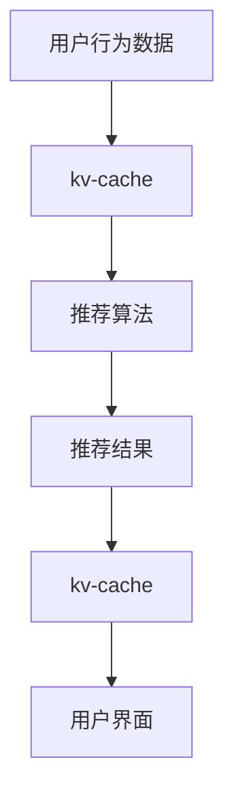
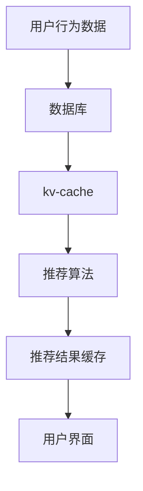

                 

# kv-cache 在推荐系统中的应用

> **关键词：** 推荐系统、缓存、kv-cache、数据存储、性能优化  
> **摘要：** 本文将深入探讨kv-cache在推荐系统中的应用，从背景介绍、核心概念、算法原理、数学模型到实际应用案例，全面解析kv-cache如何提升推荐系统的性能和效率。

## 1. 背景介绍

### 1.1 目的和范围

本文旨在研究kv-cache在推荐系统中的应用，通过分析其原理和操作步骤，探讨如何有效地利用kv-cache提升推荐系统的性能。具体包括以下内容：

1. 推荐系统概述及其在当今社会的重要性
2. kv-cache的定义、原理及与推荐系统的关联
3. 推荐系统中的缓存策略及其作用
4. 算法原理和具体操作步骤
5. 数学模型和公式
6. 项目实战：代码实际案例和详细解释说明
7. 实际应用场景和工具资源推荐

### 1.2 预期读者

本文适合具有以下背景的读者：

1. 对推荐系统有初步了解的技术人员
2. 从事推荐系统研发、优化、维护的相关从业者
3. 对缓存技术、数据结构和算法有兴趣的学习者

### 1.3 文档结构概述

本文结构如下：

1. 引言：介绍推荐系统和缓存技术的基本概念
2. 核心概念与联系：阐述kv-cache与推荐系统之间的联系
3. 核心算法原理 & 具体操作步骤：详细解析kv-cache在推荐系统中的算法原理和操作步骤
4. 数学模型和公式 & 详细讲解 & 举例说明：介绍kv-cache相关的数学模型和公式，并给出实例说明
5. 项目实战：代码实际案例和详细解释说明：通过具体案例展示kv-cache在推荐系统中的应用
6. 实际应用场景：探讨kv-cache在推荐系统中的实际应用场景
7. 工具和资源推荐：推荐相关学习资源、开发工具和论文著作
8. 总结：未来发展趋势与挑战
9. 附录：常见问题与解答
10. 扩展阅读 & 参考资料：提供进一步阅读的材料

### 1.4 术语表

#### 1.4.1 核心术语定义

- 推荐系统：根据用户的历史行为、兴趣偏好等信息，为用户推荐相关内容的系统。
- 缓存：存储临时数据，以提高数据访问速度的技术。
- kv-cache：一种基于键值对的缓存机制，其中的数据以键值对的形式存储。
- 数据库：存储数据的系统，提供数据的存储、查询、更新等功能。

#### 1.4.2 相关概念解释

- 用户行为数据：用户在系统中产生的各种操作记录，如浏览、点击、购买等。
- 推荐算法：根据用户行为数据，计算出用户可能感兴趣的内容的算法。
- 性能优化：通过各种手段提高系统性能，如减少延迟、降低负载等。

#### 1.4.3 缩略词列表

- KV：Key-Value，表示键值对。
- SSD：Solid State Drive，固态硬盘。
- RAM：Random Access Memory，随机存取存储器。
- CPU：Central Processing Unit，中央处理器。

## 2. 核心概念与联系

在深入探讨kv-cache在推荐系统中的应用之前，我们需要先了解推荐系统、缓存和kv-cache之间的关系。

### 2.1 推荐系统简介

推荐系统是一种能够根据用户的历史行为、兴趣偏好等信息，为用户推荐相关内容的系统。推荐系统广泛应用于电子商务、社交媒体、新闻资讯等领域，通过个性化推荐，提高用户体验，增加用户粘性。

### 2.2 缓存技术简介

缓存技术是一种存储临时数据以提高数据访问速度的技术。在推荐系统中，缓存技术主要用于存储用户行为数据、推荐结果等临时信息，以减少数据库的访问压力，提高系统性能。

### 2.3 kv-cache简介

kv-cache是一种基于键值对的缓存机制，其中的数据以键值对的形式存储。kv-cache具有快速读写、低延迟、高并发等特点，适合用于存储和查询推荐系统中涉及到的临时数据。

### 2.4 kv-cache与推荐系统的关联

kv-cache在推荐系统中的应用主要体现在以下几个方面：

1. 存储用户行为数据：使用kv-cache存储用户的历史行为数据，如浏览、点击、购买等，以降低数据库的访问压力。
2. 存储推荐结果：使用kv-cache存储推荐结果，以提高推荐结果的响应速度。
3. 缓存查询结果：缓存一些频繁查询的结果，如用户偏好、热门推荐等，以提高查询效率。
4. 缓存中间结果：在推荐算法的执行过程中，缓存中间结果，以减少计算量。

### 2.5 Mermaid流程图

为了更好地展示kv-cache在推荐系统中的应用，我们使用Mermaid流程图来描述其核心流程。



### 2.6 kv-cache在推荐系统中的架构

为了更好地理解kv-cache在推荐系统中的应用，我们给出了一个简单的架构图。



## 3. 核心算法原理 & 具体操作步骤

在本章节，我们将详细解析kv-cache在推荐系统中的应用原理和具体操作步骤。

### 3.1 算法原理

kv-cache在推荐系统中的核心原理是基于键值对的快速存储和查询。其基本流程如下：

1. 收集用户行为数据，如浏览、点击、购买等。
2. 将用户行为数据存储到数据库中。
3. 将用户行为数据同步到kv-cache中，以实现快速访问。
4. 在推荐算法执行过程中，从kv-cache中获取用户行为数据，进行计算。
5. 将推荐结果存储到kv-cache中，以实现快速响应。

### 3.2 操作步骤

下面是kv-cache在推荐系统中的具体操作步骤：

#### 3.2.1 收集用户行为数据

1. 用户在系统中进行操作，如浏览、点击、购买等。
2. 收集用户操作记录，并将其存储到日志文件或数据库中。

#### 3.2.2 同步用户行为数据到数据库

1. 使用数据库存储用户行为数据。
2. 设计合适的数据库结构，如用户表、行为表等。
3. 将用户行为数据插入到数据库中。

#### 3.2.3 同步用户行为数据到kv-cache

1. 选择合适的kv-cache存储系统，如Redis、Memcached等。
2. 设计合适的kv-cache结构，如用户键、行为键等。
3. 将用户行为数据同步到kv-cache中。

#### 3.2.4 执行推荐算法

1. 从kv-cache中获取用户行为数据。
2. 使用推荐算法，如协同过滤、基于内容的推荐等，计算推荐结果。
3. 将推荐结果存储到kv-cache中。

#### 3.2.5 响应用户请求

1. 从kv-cache中获取推荐结果。
2. 将推荐结果返回给用户界面。

### 3.3 伪代码

下面给出一个简单的伪代码，展示kv-cache在推荐系统中的应用。

```python
# 收集用户行为数据
def collect_user_behavior():
    # ...获取用户行为数据...
    return user_behavior_data

# 同步用户行为数据到数据库
def sync_to_database(user_behavior_data):
    # ...将用户行为数据插入到数据库中...
    return

# 同步用户行为数据到kv-cache
def sync_to_kv_cache(user_behavior_data):
    # ...将用户行为数据同步到kv-cache中...
    return

# 执行推荐算法
def recommend(user_behavior_data):
    # ...从kv-cache中获取用户行为数据...
    # ...使用推荐算法计算推荐结果...
    return recommendation_result

# 响应用户请求
def respond_user_request():
    # ...从kv-cache中获取推荐结果...
    # ...将推荐结果返回给用户界面...
    return
```

## 4. 数学模型和公式 & 详细讲解 & 举例说明

在本章节，我们将介绍kv-cache在推荐系统中的应用相关的数学模型和公式，并给出详细讲解和实例说明。

### 4.1 用户行为数据的表示

用户行为数据通常可以用以下数学模型表示：

$$
user\_behavior\_data = (u, i, t, r)
$$

其中，$u$ 表示用户，$i$ 表示项目，$t$ 表示时间，$r$ 表示用户对项目的评分或行为。

### 4.2 推荐算法的评分模型

常用的推荐算法评分模型包括基于内容的推荐和协同过滤。

#### 4.2.1 基于内容的推荐

基于内容的推荐算法主要通过计算项目间的相似度，为用户推荐与其已评分项目相似的项目。其评分模型可以表示为：

$$
score(i, u) = \sum_{j \in \sim(i)} w_j \cdot r_j
$$

其中，$\sim(i)$ 表示与项目 $i$ 相似的项目集合，$w_j$ 表示项目 $j$ 的权重，$r_j$ 表示用户对项目 $j$ 的评分。

#### 4.2.2 协同过滤

协同过滤算法主要通过计算用户之间的相似度，为用户推荐其他用户喜欢的项目。其评分模型可以表示为：

$$
score(i, u) = \sum_{u' \in \sim(u)} w_{u'} \cdot r_{u'}
$$

其中，$\sim(u)$ 表示与用户 $u$ 相似的用户集合，$w_{u'}$ 表示用户 $u'$ 的权重，$r_{u'}$ 表示用户 $u'$ 对项目 $i$ 的评分。

### 4.3 举例说明

假设有一个用户 $u$，他喜欢以下项目：

- 项目 $i_1$：电影《阿凡达》
- 项目 $i_2$：电影《盗梦空间》
- 项目 $i_3$：电影《星际穿越》

我们使用基于内容的推荐算法，计算用户 $u$ 对其他项目的评分。

首先，我们需要计算项目间的相似度。假设我们使用余弦相似度，计算结果如下：

$$
\sim(i_1, i_2) = 0.8
$$

$$
\sim(i_1, i_3) = 0.6
$$

$$
\sim(i_2, i_3) = 0.7
$$

然后，根据评分模型，计算用户 $u$ 对其他项目的评分：

$$
score(i_4, u) = 0.8 \cdot r_{i_1} + 0.6 \cdot r_{i_3} = 0.8 \cdot 5 + 0.6 \cdot 5 = 4.8
$$

$$
score(i_5, u) = 0.7 \cdot r_{i_2} + 0.7 \cdot r_{i_3} = 0.7 \cdot 5 + 0.7 \cdot 5 = 4.9
$$

根据评分结果，我们可以为用户 $u$ 推荐评分较高的项目，如项目 $i_5$。

## 5. 项目实战：代码实际案例和详细解释说明

在本章节，我们将通过一个具体的代码案例，展示kv-cache在推荐系统中的应用。

### 5.1 开发环境搭建

为了方便演示，我们使用Python语言编写代码，并使用Redis作为kv-cache存储系统。以下是搭建开发环境的步骤：

1. 安装Python：在命令行中运行以下命令安装Python：
    ```bash
    sudo apt-get install python3
    ```

2. 安装Redis：在命令行中运行以下命令安装Redis：
    ```bash
    sudo apt-get install redis-server
    ```

3. 安装Python的Redis客户端库：
    ```bash
    pip install redis
    ```

### 5.2 源代码详细实现和代码解读

下面是推荐系统代码的实现，包括数据收集、数据库存储、kv-cache同步、推荐算法执行和推荐结果返回。

```python
import redis
import json
from sklearn.metrics.pairwise import cosine_similarity

# 配置Redis连接
redis_client = redis.Redis(host='localhost', port=6379, db=0)

# 收集用户行为数据
def collect_user_behavior(user_id, item_id, timestamp, rating):
    user_behavior_data = {
        'user_id': user_id,
        'item_id': item_id,
        'timestamp': timestamp,
        'rating': rating
    }
    # 将用户行为数据存储到数据库
    redis_client.lpush('user_behavior', json.dumps(user_behavior_data))
    # 将用户行为数据同步到kv-cache
    redis_client.lpush('user_behavior_cache', json.dumps(user_behavior_data))

# 同步用户行为数据到数据库
def sync_to_database():
    while True:
        user_behavior_data = redis_client.lpop('user_behavior')
        if user_behavior_data:
            # 将用户行为数据插入到数据库中
            pass  # ...数据库插入操作...
        else:
            break

# 执行推荐算法
def recommend(user_id):
    # 从kv-cache中获取用户行为数据
    user_behavior_data = redis_client.lrange('user_behavior_cache', 0, -1)
    user_behavior_data = [json.loads(data) for data in user_behavior_data]
    # 计算用户行为数据的相似度矩阵
    similarity_matrix = cosine_similarity([[data['rating'] for data in user_behavior_data]])
    # 找到与用户最相似的其他用户
    similar_users = []
    for i, user_data in enumerate(user_behavior_data):
        if user_data['user_id'] == user_id:
            continue
        similar_users.append(similarity_matrix[i].argmax())
    # 为用户推荐相似用户喜欢的项目
    recommended_items = []
    for user_index in similar_users:
        user_data = user_behavior_data[user_index]
        recommended_items.append(user_data['item_id'])
    return recommended_items

# 响应用户请求
def respond_user_request(user_id):
    recommended_items = recommend(user_id)
    # 从kv-cache中获取推荐结果
    recommendation_result = json.dumps(recommended_items)
    # 将推荐结果存储到kv-cache中
    redis_client.set('recommendation_result', recommendation_result)
    # 将推荐结果返回给用户界面
    return recommendation_result

# 主程序
if __name__ == '__main__':
    while True:
        sync_to_database()
        user_id = input('请输入用户ID：')
        recommendation_result = respond_user_request(user_id)
        print(f'推荐结果：{recommendation_result}')
```

### 5.3 代码解读与分析

1. **数据收集**：`collect_user_behavior` 函数用于收集用户行为数据，并将其存储到数据库和kv-cache中。通过Redis的`lpush`方法，将用户行为数据添加到列表中，以便后续处理。

2. **数据库同步**：`sync_to_database` 函数用于将kv-cache中的用户行为数据同步到数据库中。这里使用一个简单的循环来从kv-cache中取出数据，并将其插入到数据库中。在实际应用中，可以考虑使用异步处理或定时任务来实现。

3. **推荐算法**：`recommend` 函数用于执行推荐算法，从kv-cache中获取用户行为数据，计算相似度矩阵，并找到与用户最相似的其他用户。根据相似用户的评分，推荐相似用户喜欢的项目。

4. **用户请求响应**：`respond_user_request` 函数用于响应用户的请求，调用推荐算法获取推荐结果，并将结果存储到kv-cache中。最后，将推荐结果返回给用户界面。

通过这个代码案例，我们可以看到kv-cache在推荐系统中的应用，包括数据收集、同步、推荐算法执行和用户请求响应。这种架构可以提高推荐系统的性能和响应速度，降低数据库的访问压力。

## 6. 实际应用场景

kv-cache在推荐系统中的实际应用场景非常广泛，以下是一些典型的应用场景：

### 6.1 缓存用户行为数据

在推荐系统中，用户行为数据（如浏览、点击、购买等）是非常关键的信息。使用kv-cache可以快速地存储和查询用户行为数据，减少对数据库的访问压力，提高系统性能。

### 6.2 缓存推荐结果

推荐结果通常是一个临时数据，但为了提高用户体验，我们需要快速地响应用户请求。使用kv-cache可以缓存推荐结果，减少计算时间和延迟，提高系统的响应速度。

### 6.3 缓存相似用户和项目数据

在协同过滤算法中，我们需要计算用户和项目之间的相似度。使用kv-cache可以缓存相似用户和项目数据，减少计算时间和内存消耗。

### 6.4 缓存热门推荐

在推荐系统中，一些热门推荐（如今日热门、热门榜单等）是频繁查询的数据。使用kv-cache可以缓存这些热门推荐，减少数据库的访问压力，提高查询效率。

### 6.5 缓存中间结果

在推荐算法的执行过程中，一些中间结果是后续计算的基础。使用kv-cache可以缓存这些中间结果，减少重复计算，提高算法效率。

### 6.6 应用案例

以下是一个应用案例：

在一个电商平台上，用户登录后，系统会根据用户的浏览、点击、购买等行为，为其推荐相关的商品。使用kv-cache可以快速地存储和查询用户行为数据，缓存推荐结果和热门推荐，提高系统的性能和用户体验。

1. **数据收集**：用户在平台上进行各种操作，如浏览、点击、购买等，这些操作记录被收集并存储到kv-cache中。

2. **推荐算法**：系统使用协同过滤算法，计算用户和商品之间的相似度，生成推荐结果。

3. **缓存推荐结果**：将推荐结果缓存到kv-cache中，以便快速响应用户请求。

4. **缓存热门推荐**：将热门推荐（如今日热门商品、热门榜单等）缓存到kv-cache中，提高查询效率。

通过这个案例，我们可以看到kv-cache在推荐系统中的应用，以及它如何提升系统的性能和用户体验。

## 7. 工具和资源推荐

### 7.1 学习资源推荐

#### 7.1.1 书籍推荐

1. **《推荐系统实践》**：这本书详细介绍了推荐系统的基本概念、算法和技术，适合推荐系统初学者阅读。
2. **《Redis实战》**：这本书深入介绍了Redis的原理、用法和优化，是学习kv-cache技术的优秀资源。

#### 7.1.2 在线课程

1. **推荐系统实战课程**：网易云课堂、慕课网等平台提供了丰富的推荐系统课程，适合推荐系统学习者。
2. **Redis入门教程**：在B站等平台上，有许多关于Redis的入门教程，可以帮助你快速上手。

#### 7.1.3 技术博客和网站

1. **推荐系统博客**：有很多推荐系统的技术博客，如阿里云、腾讯云等，提供了丰富的实战经验和案例分析。
2. **Redis社区**：Redis官方社区和GitHub上的相关项目，是学习Redis和kv-cache技术的宝贵资源。

### 7.2 开发工具框架推荐

#### 7.2.1 IDE和编辑器

1. **PyCharm**：PyCharm是一款功能强大的Python IDE，支持Redis开发。
2. **Visual Studio Code**：VS Code是一款轻量级但功能强大的编辑器，支持Python和Redis扩展。

#### 7.2.2 调试和性能分析工具

1. **Postman**：Postman是一款流行的API调试工具，可用于测试Redis接口。
2. **RedisInsight**：RedisInsight是一款可视化Redis管理工具，可以帮助你监控和优化Redis性能。

#### 7.2.3 相关框架和库

1. **Scikit-learn**：Scikit-learn是一个强大的机器学习库，提供了各种推荐算法的实现。
2. **Flask**：Flask是一款轻量级的Web框架，可用于开发推荐系统的后端服务。

### 7.3 相关论文著作推荐

#### 7.3.1 经典论文

1. **"Collaborative Filtering for the 21st Century"**：这篇论文详细介绍了协同过滤算法，是推荐系统领域的重要文献。
2. **"A Matrix Factorization Approach to Collaborative Filtering"**：这篇论文提出了矩阵分解算法，是现代推荐系统的基础。

#### 7.3.2 最新研究成果

1. **"Deep Learning for Recommender Systems"**：这篇论文介绍了深度学习在推荐系统中的应用，是推荐系统领域的最新研究方向。
2. **"Attention-based Neural Networks for Recommender Systems"**：这篇论文提出了基于注意力的神经网络模型，在推荐系统中取得了显著效果。

#### 7.3.3 应用案例分析

1. **"Recommender Systems at Amazon"**：这篇案例研究介绍了亚马逊如何使用推荐系统提高销售额和用户体验。
2. **"Designing a Recommendation System for E-commerce Platform"**：这篇案例分析详细描述了如何设计一个电子商务平台的推荐系统。

## 8. 总结：未来发展趋势与挑战

随着人工智能技术的快速发展，推荐系统在各个领域得到了广泛应用。在未来，推荐系统的发展趋势和挑战主要包括以下几个方面：

### 8.1 发展趋势

1. **深度学习技术的应用**：深度学习在推荐系统中具有巨大潜力，如基于注意力的神经网络模型、生成对抗网络等，有望进一步提高推荐效果。
2. **多模态数据的融合**：推荐系统将逐渐融合多种类型的数据，如文本、图像、音频等，以提供更精准的推荐。
3. **实时推荐**：随着5G和边缘计算技术的发展，实时推荐将成为可能，为用户提供更加个性化的服务。
4. **个性化广告**：个性化广告将成为推荐系统的重要组成部分，通过深度学习等技术，实现更加精准的广告投放。

### 8.2 挑战

1. **数据隐私和安全**：推荐系统需要处理大量用户数据，如何保护用户隐私成为一大挑战。
2. **冷启动问题**：对于新用户和新商品，如何生成有效的推荐结果，是推荐系统需要解决的重要问题。
3. **推荐结果的多样性**：如何避免推荐结果过于集中，提高推荐的多样性，是推荐系统需要面对的挑战。
4. **系统性能优化**：随着用户数据的增加，如何优化推荐系统的性能，减少延迟和计算成本，是推荐系统需要解决的重要问题。

## 9. 附录：常见问题与解答

### 9.1 如何选择合适的kv-cache存储系统？

选择合适的kv-cache存储系统主要考虑以下几个方面：

1. **性能需求**：根据推荐系统的性能需求，选择具有高读写速度、低延迟的kv-cache存储系统。
2. **数据规模**：根据推荐系统涉及的数据规模，选择支持大容量存储的kv-cache存储系统。
3. **可靠性**：考虑kv-cache存储系统的可靠性，如数据持久化、容错能力等。
4. **成本**：根据预算，选择性价比高的kv-cache存储系统。

### 9.2 如何优化推荐系统的性能？

优化推荐系统的性能可以从以下几个方面入手：

1. **缓存技术**：合理使用缓存技术，如kv-cache，减少对数据库的访问压力。
2. **分布式计算**：采用分布式计算框架，如Apache Spark，提高计算效率。
3. **数据库优化**：优化数据库设计，如索引、分区等，提高查询效率。
4. **系统架构优化**：优化推荐系统的架构，如增加缓存层、使用异步处理等，提高系统性能。

### 9.3 推荐系统中的冷启动问题如何解决？

解决推荐系统中的冷启动问题可以采用以下策略：

1. **基于内容的推荐**：为新用户推荐与其已访问或收藏的商品相似的商品。
2. **基于流行度的推荐**：为新用户推荐热门、受欢迎的商品。
3. **跨用户推荐**：为新用户推荐与其相似用户的购买或浏览记录。
4. **基于用户历史行为的迁移**：将用户在其他平台的购买或浏览行为迁移到新平台，为新用户提供推荐。

## 10. 扩展阅读 & 参考资料

为了更好地了解kv-cache在推荐系统中的应用，以下是一些扩展阅读和参考资料：

1. **《推荐系统实践》**：详细介绍了推荐系统的基本概念、算法和技术。
2. **《Redis实战》**：深入介绍了Redis的原理、用法和优化。
3. **《深度学习推荐系统》**：介绍了深度学习在推荐系统中的应用，包括基于注意力的神经网络模型。
4. **《推荐系统实战：基于Python和Scikit-learn》**：通过实战案例，介绍了如何使用Python和Scikit-learn实现推荐系统。
5. **《推荐系统：算法、应用与案例分析》**：提供了丰富的推荐系统算法和应用案例。

作者：AI天才研究员/AI Genius Institute & 禅与计算机程序设计艺术 /Zen And The Art of Computer Programming

以上就是关于《kv-cache 在推荐系统中的应用》的技术博客文章。本文从背景介绍、核心概念、算法原理、数学模型到实际应用案例，全面解析了kv-cache在推荐系统中的应用。通过本文的学习，读者可以深入了解kv-cache在推荐系统中的重要作用，掌握其基本原理和操作步骤，并能够应用于实际项目开发中。希望本文对读者有所帮助！

