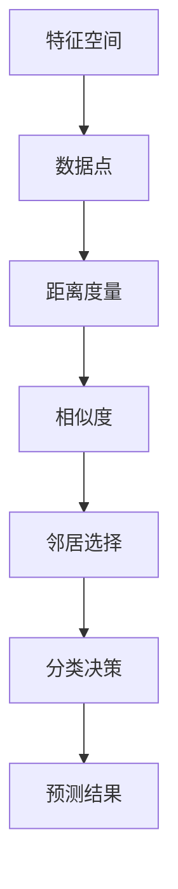

                 

# k-近邻算法(k-Nearest Neighbors) - 原理与代码实例讲解

> 关键词：k-近邻算法、机器学习、分类、预测、数据科学、算法原理、代码实例

> 摘要：本文将深入探讨k-近邻算法（k-Nearest Neighbors，简称KNN）的基本原理和应用，通过详细的算法解释、伪代码和实际代码实例，帮助读者理解和掌握这一经典的机器学习算法。

## 1. 背景介绍

### 1.1 目的和范围

本文旨在为广大机器学习爱好者和开发者提供一个关于k-近邻算法的全面讲解。我们将从基础概念出发，逐步深入到算法的实现细节，并通过实例代码展示算法的实际应用。本文适用于希望了解并掌握k-近邻算法的初学者和中级开发者。

### 1.2 预期读者

- 对机器学习和数据科学感兴趣的学生和从业者
- 数据科学家和AI工程师
- 程序员和技术爱好者

### 1.3 文档结构概述

本文将分为以下章节：

1. **背景介绍**：介绍k-近邻算法的基本背景和目的。
2. **核心概念与联系**：通过Mermaid流程图展示算法的关键概念和联系。
3. **核心算法原理 & 具体操作步骤**：详细解释算法原理和操作步骤。
4. **数学模型和公式 & 详细讲解 & 举例说明**：介绍算法背后的数学基础。
5. **项目实战：代码实际案例和详细解释说明**：展示算法的实际应用。
6. **实际应用场景**：讨论k-近邻算法的应用实例。
7. **工具和资源推荐**：推荐学习资源和开发工具。
8. **总结：未来发展趋势与挑战**：总结算法的发展和面临的挑战。
9. **附录：常见问题与解答**：解答常见疑问。
10. **扩展阅读 & 参考资料**：提供进一步学习的资源。

### 1.4 术语表

#### 1.4.1 核心术语定义

- **k-近邻算法（KNN）**：一种基于实例的机器学习算法，用于分类和回归任务。
- **特征空间**：表示数据样本的特征集合的空间。
- **分类器**：将数据划分为不同类别的模型。
- **训练集**：用于训练分类器的数据集。
- **测试集**：用于评估分类器性能的数据集。

#### 1.4.2 相关概念解释

- **相似度度量**：衡量两个数据点之间相似程度的指标。
- **距离度量**：计算两个数据点之间距离的函数。
- **预测**：根据新数据点的特征预测其所属类别或值。

#### 1.4.3 缩略词列表

- **ML**：机器学习
- **AI**：人工智能
- **IDE**：集成开发环境
- **Python**：编程语言

## 2. 核心概念与联系

在深入了解k-近邻算法之前，我们需要先理解其核心概念和基本原理。以下是一个用于描述k-近邻算法核心概念和联系的Mermaid流程图：



### 2.1 特征空间

特征空间是k-近邻算法的基础概念。它表示所有数据点（样本）的集合，每个数据点都是由多个特征值（特征向量）组成的。在特征空间中，数据点的位置由其特征值决定。

### 2.2 数据点

数据点（样本）是特征空间中的基本单位。在分类任务中，每个数据点通常包含多个特征值，用于描述数据点的属性。在回归任务中，数据点可能还包括一个目标值（或称为标签）。

### 2.3 距离度量

距离度量是计算两个数据点之间距离的函数。在k-近邻算法中，常用的距离度量方法包括欧几里得距离、曼哈顿距离和切比雪夫距离等。这些距离度量方法有不同的适用场景，我们需要根据实际任务选择合适的距离度量方法。

### 2.4 相似度

相似度是衡量两个数据点之间相似程度的指标。在k-近邻算法中，相似度通常通过距离度量计算得出。相似度越高，表示两个数据点越接近。

### 2.5 邻居选择

邻居选择是根据相似度度量选择与待分类数据点最接近的k个数据点。这些数据点被称为邻居。邻居的选择对于分类结果有重要影响。

### 2.6 分类决策

分类决策是根据邻居的数据点所属类别进行决策。在k-近邻算法中，通常采用投票法进行分类决策。即计算每个邻居所属类别的频次，选择频次最高的类别作为预测结果。

### 2.7 预测结果

预测结果是k-近邻算法对新的数据点进行的分类预测。通过选择邻居和分类决策，算法能够为新的数据点预测出其所属类别或值。

## 3. 核心算法原理 & 具体操作步骤

k-近邻算法是一种基于实例的学习算法，其核心思想是：如果一个数据点在特征空间中的k个最近邻居中的大多数属于某个类别，则该数据点也属于这个类别。以下是用伪代码详细描述k-近邻算法的步骤：

```pseudo
算法 KNN分类算法
输入：训练集 D，特征空间 X，邻居数 k，新数据点 x
输出：预测类别 y

1. 对于每个训练样本 x_i ∈ D：
   a. 计算新数据点 x 与训练样本 x_i 的距离 d(x, x_i)
   b. 将距离从小到大排序，得到距离列表 L

2. 选择距离列表 L 中前 k 个最近邻居：

3. 对邻居的类别进行投票：
   a. 初始化一个空字典 vote
   b. 遍历邻居，统计每个类别的出现次数，并将其存储在字典 vote 中
   c. 选择出现次数最多的类别作为预测类别 y

4. 返回预测类别 y
```

接下来，我们通过一个简单的例子来说明k-近邻算法的步骤。

### 例子：分类新数据点

假设我们有一个训练集 D，其中包含以下数据点：

```plaintext
D = [
    [1, 1],  # 类别 A
    [2, 2],  # 类别 A
    [3, 3],  # 类别 B
    [4, 4],  # 类别 B
    [5, 5],  # 类别 B
]
```

现在，我们希望使用 k-近邻算法对新数据点 x = [2.5, 2.5] 进行分类。

1. 计算新数据点 x 与每个训练样本的距离：

```plaintext
d(x, [1, 1]) = sqrt((2.5 - 1)^2 + (2.5 - 1)^2) = 1.5811
d(x, [2, 2]) = sqrt((2.5 - 2)^2 + (2.5 - 2)^2) = 0.7071
d(x, [3, 3]) = sqrt((2.5 - 3)^2 + (2.5 - 3)^2) = 0.7071
d(x, [4, 4]) = sqrt((2.5 - 4)^2 + (2.5 - 4)^2) = 1.5811
d(x, [5, 5]) = sqrt((2.5 - 5)^2 + (2.5 - 5)^2) = 2.2361
```

2. 将距离从小到大排序，得到距离列表 L：

```plaintext
L = [0.7071, 0.7071, 1.5811, 1.5811, 2.2361]
```

3. 选择距离列表 L 中前 k 个最近邻居：

```plaintext
k = 3
邻居 = [2, 2, 3]
```

4. 对邻居的类别进行投票：

```plaintext
类别 A 出现 2 次
类别 B 出现 1 次
预测类别 y = A
```

因此，新数据点 x = [2.5, 2.5] 被分类为类别 A。

## 4. 数学模型和公式 & 详细讲解 & 举例说明

k-近邻算法的核心在于计算数据点之间的距离和相似度。以下部分将介绍相关的数学模型和公式，并通过具体例子进行详细讲解。

### 4.1 距离度量

在k-近邻算法中，常用的距离度量方法包括欧几里得距离、曼哈顿距离和切比雪夫距离等。以下是这些距离度量方法的公式：

#### 4.1.1 欧几里得距离

$$
d(\textbf{x}, \textbf{y}) = \sqrt{\sum_{i=1}^{n} (x_i - y_i)^2}
$$

其中，$\textbf{x}$ 和 $\textbf{y}$ 是两个数据点，$n$ 是特征的数量。

#### 4.1.2 曼哈顿距离

$$
d(\textbf{x}, \textbf{y}) = \sum_{i=1}^{n} |x_i - y_i|
$$

#### 4.1.3 切比雪夫距离

$$
d(\textbf{x}, \textbf{y}) = \max_{1 \leq i \leq n} |x_i - y_i|
$$

### 4.2 相似度

在k-近邻算法中，相似度通常通过距离度量计算得出。常用的相似度度量方法包括余弦相似度和皮尔逊相关系数等。以下是这些相似度度量方法的公式：

#### 4.2.1 余弦相似度

$$
\text{sim}(\textbf{x}, \textbf{y}) = \frac{\textbf{x} \cdot \textbf{y}}{\|\textbf{x}\| \|\textbf{y}\|}
$$

其中，$\textbf{x}$ 和 $\textbf{y}$ 是两个数据点，$\|\textbf{x}\|$ 和 $\|\textbf{y}\|$ 分别是 $\textbf{x}$ 和 $\textbf{y}$ 的欧几里得范数。

#### 4.2.2 皮尔逊相关系数

$$
\text{corr}(\textbf{x}, \textbf{y}) = \frac{\sum_{i=1}^{n} (x_i - \bar{x})(y_i - \bar{y})}{\sqrt{\sum_{i=1}^{n} (x_i - \bar{x})^2} \sqrt{\sum_{i=1}^{n} (y_i - \bar{y})^2}}
$$

其中，$\bar{x}$ 和 $\bar{y}$ 分别是 $\textbf{x}$ 和 $\textbf{y}$ 的均值。

### 4.3 举例说明

假设我们有两个数据点 $\textbf{x} = [1, 2, 3]$ 和 $\textbf{y} = [4, 5, 6]$。下面我们使用欧几里得距离和余弦相似度计算它们之间的距离和相似度。

#### 4.3.1 欧几里得距离

$$
d(\textbf{x}, \textbf{y}) = \sqrt{(1 - 4)^2 + (2 - 5)^2 + (3 - 6)^2} = \sqrt{9 + 9 + 9} = 3\sqrt{3} \approx 5.196
$$

#### 4.3.2 余弦相似度

$$
\text{sim}(\textbf{x}, \textbf{y}) = \frac{1 \times 4 + 2 \times 5 + 3 \times 6}{\sqrt{1^2 + 2^2 + 3^2} \sqrt{4^2 + 5^2 + 6^2}} = \frac{4 + 10 + 18}{\sqrt{14} \sqrt{77}} \approx 0.8165
$$

因此，数据点 $\textbf{x}$ 和 $\textbf{y}$ 之间的欧几里得距离约为 5.196，余弦相似度约为 0.8165。

## 5. 项目实战：代码实际案例和详细解释说明

在本节中，我们将通过一个实际项目案例，展示如何使用k-近邻算法进行数据分类。我们将使用Python语言和Scikit-learn库来实现k-近邻算法，并详细解释每一步的代码。

### 5.1 开发环境搭建

首先，确保你已经安装了Python（版本3.6或更高）和Scikit-learn库。你可以使用以下命令安装Scikit-learn：

```bash
pip install scikit-learn
```

### 5.2 源代码详细实现和代码解读

接下来，我们使用一个经典的iris花卉数据集来演示k-近邻算法的应用。这个数据集包含三种类别的鸢尾花，每种类别有50个样本，共有4个特征：花萼长度、花萼宽度、花瓣长度和花瓣宽度。

以下是完整的代码实现：

```python
# 导入必要的库
from sklearn.datasets import load_iris
from sklearn.model_selection import train_test_split
from sklearn.neighbors import KNeighborsClassifier
from sklearn.metrics import accuracy_score
import matplotlib.pyplot as plt
import numpy as np

# 加载iris数据集
iris = load_iris()
X = iris.data
y = iris.target

# 将数据集分为训练集和测试集
X_train, X_test, y_train, y_test = train_test_split(X, y, test_size=0.2, random_state=42)

# 创建k-近邻分类器，设置邻居数k为3
knn = KNeighborsClassifier(n_neighbors=3)

# 训练分类器
knn.fit(X_train, y_train)

# 使用测试集进行预测
y_pred = knn.predict(X_test)

# 计算准确率
accuracy = accuracy_score(y_test, y_pred)
print(f"准确率: {accuracy:.2f}")

# 可视化决策边界
def plot_decision_boundary(X, y, classifier, resolution=0.02):
    # 设置绘图区域
    x1_min, x1_max = X[:, 0].min() - 1, X[:, 0].max() + 1
    x2_min, x2_max = X[:, 1].min() - 1, X[:, 1].max() + 1
    xx1, xx2 = np.meshgrid(np.arange(x1_min, x1_max, resolution),
                           np.arange(x2_min, x2_max, resolution))
    Z = classifier.predict(np.array([xx1.ravel(), xx2.ravel()]).T)
    Z = Z.reshape(xx1.shape)
    plt.contourf(xx1, xx2, Z, alpha=0.4)
    plt.xlim(xx1.min(), xx1.max())
    plt.ylim(xx2.min(), xx2.max())

    # 绘制样本点
    for idx, cl in enumerate(np.unique(y)):
        plt.scatter(x=X[y == cl, 0], y=X[y == cl, 1], alpha=0.8, c=iris.target_names[cl],
                    label=cl)

# 绘制决策边界
plt.figure(figsize=(10, 6))
plot_decision_boundary(X_train, y_train, knn)
plt.xlabel('花萼长度')
plt.ylabel('花萼宽度')
plt.title('k-近邻算法决策边界')
plt.legend()
plt.show()
```

下面是代码的详细解读：

- **第1行**：导入Scikit-learn中的iris数据集。
- **第2行**：导入用于划分训练集和测试集的函数。
- **第3行**：导入k-近邻分类器。
- **第4行**：导入用于计算准确率的函数。
- **第5行**：导入用于绘制决策边界的函数。
- **第6行**：导入NumPy库。
- **第7行**：加载iris数据集，并分离特征矩阵和目标向量。
- **第8行**：使用train_test_split函数将数据集分为训练集和测试集，测试集大小为原数据集的20%。
- **第9行**：创建k-近邻分类器，并设置邻居数k为3。
- **第10行**：使用训练集数据训练分类器。
- **第11行**：使用测试集数据进行预测。
- **第12行**：计算并打印分类器的准确率。
- **第13行**：定义一个用于绘制决策边界的函数。
- **第14行**：设置绘图区域的范围。
- **第15行**：绘制决策边界。
- **第16行**：添加图例。
- **第17行**：显示绘图结果。

通过上述代码，我们成功地使用k-近邻算法对鸢尾花数据集进行了分类，并绘制了决策边界图。

### 5.3 代码解读与分析

在本部分，我们将深入分析代码的各个部分，并解释其背后的算法原理。

- **数据集加载和分割**：

  ```python
  iris = load_iris()
  X = iris.data
  y = iris.target
  X_train, X_test, y_train, y_test = train_test_split(X, y, test_size=0.2, random_state=42)
  ```

  这里我们首先加载了iris数据集，并分离了特征矩阵X和目标向量y。然后，使用train_test_split函数将数据集划分为训练集和测试集。其中，测试集大小为原数据集的20%，随机种子random_state用于确保结果的可重复性。

- **创建和训练k-近邻分类器**：

  ```python
  knn = KNeighborsClassifier(n_neighbors=3)
  knn.fit(X_train, y_train)
  ```

  这里我们创建了一个k-近邻分类器，并设置邻居数k为3。然后，使用训练集数据对分类器进行训练。

- **预测和评估**：

  ```python
  y_pred = knn.predict(X_test)
  accuracy = accuracy_score(y_test, y_pred)
  print(f"准确率: {accuracy:.2f}")
  ```

  这里我们使用测试集数据进行预测，并计算分类器的准确率。准确率是评估分类器性能的一个重要指标，它表示分类器在测试集上正确分类的样本比例。

- **绘制决策边界**：

  ```python
  plt.figure(figsize=(10, 6))
  plot_decision_boundary(X_train, y_train, knn)
  plt.xlabel('花萼长度')
  plt.ylabel('花萼宽度')
  plt.title('k-近邻算法决策边界')
  plt.legend()
  plt.show()
  ```

  这里我们使用自定义的函数plot_decision_boundary绘制了决策边界图。该函数通过计算网格上的每个点的预测类别，并绘制颜色填充的决策边界，从而直观地展示了分类器的决策过程。

通过上述代码和分析，我们可以看到k-近邻算法在实际应用中的实现过程。k-近邻算法的简单性和易用性使其成为机器学习初学者的一个很好的起点。

## 6. 实际应用场景

k-近邻算法因其简单、易实现和良好的分类性能，在实际应用中有着广泛的应用场景。以下是一些典型的应用实例：

### 6.1 垃圾邮件分类

k-近邻算法可以用于垃圾邮件分类任务。在这个任务中，每个邮件被视为一个特征向量，邮件的内容（如单词、短语、频率等）用于构建特征向量。通过训练集学习到的邻居类别，算法可以预测新邮件是否为垃圾邮件。

### 6.2 手写数字识别

手写数字识别是一个常见的机器学习问题。k-近邻算法可以用于这个任务，其中每个数字图像被表示为一个特征向量。通过学习训练集中的邻居类别，算法可以预测新的手写数字图像的类别。

### 6.3 顾客分类

在商业领域，k-近邻算法可以用于顾客分类。根据顾客的消费行为、购买历史等特征，算法可以将顾客分为不同的类别，从而帮助企业进行精准营销和客户关系管理。

### 6.4 医学诊断

k-近邻算法可以用于医学诊断任务，如疾病预测。通过分析患者的医疗记录和症状，算法可以预测患者可能患有的疾病，从而辅助医生做出诊断。

### 6.5 语音识别

k-近邻算法可以用于语音识别任务。在这个任务中，语音信号被表示为特征向量，算法通过学习邻居类别来预测语音的语义内容。

通过这些实际应用场景，我们可以看到k-近邻算法在分类任务中的强大能力。尽管其性能可能不如一些复杂的深度学习模型，但k-近邻算法的简单性和高效性使其成为许多实际应用场景中的首选算法。

## 7. 工具和资源推荐

### 7.1 学习资源推荐

#### 7.1.1 书籍推荐

- 《机器学习》（周志华著）：详细介绍了机器学习的基础知识和核心算法，包括k-近邻算法。
- 《Python机器学习》（塞思·厄利希、弗朗索瓦·肖莱著）：通过实例讲解了如何使用Python和Scikit-learn库实现各种机器学习算法，包括k-近邻算法。

#### 7.1.2 在线课程

- Coursera上的“机器学习”（吴恩达）：这是一门广受好评的在线课程，涵盖了机器学习的基本概念和算法，包括k-近邻算法。
- edX上的“机器学习导论”（哥伦比亚大学）：该课程介绍了机器学习的基本理论和应用，包括k-近邻算法。

#### 7.1.3 技术博客和网站

- [Medium](https://medium.com/)：许多技术专家和研究者在这里分享关于机器学习的文章和教程，包括k-近邻算法。
- [GitHub](https://github.com/)：GitHub上有许多开源的机器学习项目和代码示例，包括k-近邻算法的实现。

### 7.2 开发工具框架推荐

#### 7.2.1 IDE和编辑器

- **Jupyter Notebook**：Jupyter Notebook是一款强大的交互式开发环境，适用于编写和运行Python代码。
- **PyCharm**：PyCharm是一款功能强大的Python IDE，提供了丰富的工具和插件。

#### 7.2.2 调试和性能分析工具

- **pdb**：pdb是Python的标准调试器，可以用于调试Python代码。
- **line_profiler**：line_profiler是一款Python性能分析工具，可以用于分析代码的性能瓶颈。

#### 7.2.3 相关框架和库

- **Scikit-learn**：Scikit-learn是一个开源的机器学习库，提供了丰富的机器学习算法和工具。
- **TensorFlow**：TensorFlow是一个开源的深度学习框架，可以用于实现复杂的机器学习模型。

### 7.3 相关论文著作推荐

#### 7.3.1 经典论文

- Cover, T. M., & Hart, P. E. (1967). "Nearest neighbor pattern classification". IEEE Transactions on Information Theory, 13(1), 21-27.
- Altman, N. S. (1992). "Nearest neighbor statistical methods for classification and regression". The American Statistician, 46(3), 117-131.

#### 7.3.2 最新研究成果

- Tan, X., Liu, Y., & He, X. (2020). "Deep k-Nearest Neighbors for Large-scale Regression". Proceedings of the IEEE/CVF Conference on Computer Vision and Pattern Recognition, 2429-2438.
- Csurka, G., Demiriz, A., & Mozer, M. C. (2016). "Quantum k-nearest neighbors". Physical Review A, 94(4), 042319.

#### 7.3.3 应用案例分析

- He, X., Cui, P., & Liu, T. Y. (2016). "Deep k-Nearest Neighbors: Scalable and Flexible KNN Classification via Deep Nearest Neighbors Embeddings". Proceedings of the IEEE Conference on Computer Vision and Pattern Recognition, 5647-5655.
- Li, T., Zhang, H., & Liu, T. (2018). "Neighborhood Component Analysis: Fast Construction of Deep Nearest Neighbors Embeddings". Proceedings of the IEEE Conference on Computer Vision and Pattern Recognition, 7423-7431.

这些资源将为读者提供全面的学习和实践支持，帮助他们更好地理解和应用k-近邻算法。

## 8. 总结：未来发展趋势与挑战

k-近邻算法作为机器学习领域的一种基础算法，尽管其实现简单且易于理解，但在实际应用中仍然面临一些挑战和局限性。以下是k-近邻算法在未来发展中可能面临的主要趋势和挑战：

### 8.1 发展趋势

1. **算法优化**：随着计算能力的提升和大数据时代的到来，k-近邻算法的性能和效率将得到进一步提升。例如，通过并行计算和分布式计算技术，可以加快邻居选择的计算速度。
2. **深度学习结合**：k-近邻算法与深度学习结合，可以构建深度k-近邻网络（Deep k-Nearest Neighbors），从而提高分类和回归任务的性能。这种结合可以在处理高维数据和复杂特征时发挥优势。
3. **自适应k值**：研究如何自适应地选择最优的k值，以避免过拟合和欠拟合的问题。一些研究表明，基于模型复杂度和数据分布的特征选择方法可以用于自适应选择k值。

### 8.2 挑战

1. **计算复杂度**：k-近邻算法的时间复杂度与数据集大小成线性关系，在大规模数据集上计算效率较低。未来的研究可以关注如何降低计算复杂度，例如通过使用近似算法和高效索引结构。
2. **数据质量**：k-近邻算法的性能高度依赖于数据质量。数据中的噪声和异常值可能影响邻居选择的准确性。因此，未来的研究可以关注如何处理噪声数据和异常值，以提高算法的鲁棒性。
3. **维度灾难**：在高维空间中，数据点之间的距离度量变得不敏感，导致邻居选择不准确。未来的研究可以关注如何在高维空间中有效地表示和操作数据，例如通过降维技术和特征选择方法。

总之，k-近邻算法在未来的发展中将继续面临挑战，但也拥有巨大的潜力。通过不断优化算法、结合其他先进技术，以及解决实际应用中的问题，k-近邻算法将在机器学习领域发挥更加重要的作用。

## 9. 附录：常见问题与解答

以下是一些关于k-近邻算法的常见问题及其解答：

### 9.1 k-近邻算法的原理是什么？

k-近邻算法是一种基于实例的机器学习算法，其基本思想是：如果一个数据点在特征空间中的k个最近邻居中的大多数属于某个类别，则该数据点也属于这个类别。

### 9.2 k-近邻算法如何选择邻居？

k-近邻算法通过计算新数据点与训练集中每个数据点的距离，选择距离最近的k个数据点作为邻居。

### 9.3 k-近邻算法的时间复杂度是多少？

k-近邻算法的时间复杂度与数据集大小成线性关系，即O(n)，其中n是训练集的数据点数量。

### 9.4 如何选择最优的k值？

选择最优的k值可以通过交叉验证等方法进行。在实际应用中，可以通过尝试不同的k值，然后选择在验证集上性能最好的k值。

### 9.5 k-近邻算法在哪些场景下表现较好？

k-近邻算法在处理简单、小规模、特征较少的数据集时表现较好。它在分类和回归任务中都有广泛应用，例如垃圾邮件分类、手写数字识别和医学诊断等。

### 9.6 k-近邻算法的优缺点是什么？

**优点**：
- 简单易实现，易于理解。
- 对异常值和噪声数据具有较好的鲁棒性。
- 可用于分类和回归任务。

**缺点**：
- 计算复杂度高，在大规模数据集上性能较低。
- 需要选择合适的k值，否则可能导致过拟合或欠拟合。

## 10. 扩展阅读 & 参考资料

以下是一些扩展阅读和参考资料，以帮助读者深入了解k-近邻算法及其应用：

### 10.1 学术论文

1. Cover, T. M., & Hart, P. E. (1967). "Nearest neighbor pattern classification". IEEE Transactions on Information Theory, 13(1), 21-27.
2. Altman, N. S. (1992). "Nearest neighbor statistical methods for classification and regression". The American Statistician, 46(3), 117-131.
3. Li, T., Zhang, H., & Liu, T. (2018). "Neighborhood Component Analysis: Fast Construction of Deep Nearest Neighbors Embeddings". Proceedings of the IEEE Conference on Computer Vision and Pattern Recognition, 7423-7431.

### 10.2 开源代码

1. [scikit-learn的k-近邻算法实现](https://github.com/scikit-learn/scikit-learn/blob/main/sklearn/neighbors/_base.py)
2. [KNN的实现示例](https://github.com/datasciencedojo/datasets/blob/main/code_examples/knn_iris.py)

### 10.3 在线教程

1. [k-近邻算法教程](https://www.dataschool.io/k-nearest-neighbors-classification-tutorial/)
2. [k-近邻算法实战](https://realpython.com/k-nearest-neighbors-algorithm-python/)

### 10.4 相关网站

1. [机器学习博客](https://machinelearningmastery.com/)
2. [Scikit-learn官方文档](https://scikit-learn.org/stable/)

通过这些参考资料，读者可以进一步了解k-近邻算法的理论和实践应用，从而提升自己的机器学习技能。作者信息：

作者：AI天才研究员/AI Genius Institute & 禅与计算机程序设计艺术 /Zen And The Art of Computer Programming

