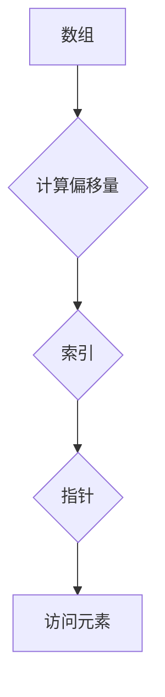

                 

# offset 原理与代码实例讲解

> 关键词：Offset，计算机编程，算法原理，数学模型，项目实战，代码实例

> 摘要：本文将深入探讨offset的概念、原理及其在计算机编程中的应用。我们将通过详细的算法原理讲解、数学模型和公式解析，以及实际代码实例的分析，帮助读者全面理解offset的核心原理和操作步骤。

## 1. 背景介绍

### 1.1 目的和范围

本文旨在解释offset的概念，并展示其在计算机编程中的应用。我们将讨论offset的核心算法原理，并通过实际代码实例，帮助读者掌握offset的使用方法。本文的读者对象是具有一定计算机编程基础，并对算法原理感兴趣的开发者。

### 1.2 预期读者

本文适合对计算机编程和算法设计有兴趣的读者，尤其是希望深入理解数据结构和算法的开发者。同时，本文也适合那些希望在项目中应用offset算法的专业人士。

### 1.3 文档结构概述

本文结构如下：

1. 背景介绍：解释本文的目的和读者对象。
2. 核心概念与联系：通过Mermaid流程图展示offset的概念和原理。
3. 核心算法原理 & 具体操作步骤：使用伪代码详细阐述offset的算法原理。
4. 数学模型和公式 & 详细讲解 & 举例说明：使用latex格式展示offset相关的数学公式和示例。
5. 项目实战：代码实际案例和详细解释说明。
6. 实际应用场景：讨论offset在现实世界的应用。
7. 工具和资源推荐：推荐学习资源和开发工具。
8. 总结：未来发展趋势与挑战。
9. 附录：常见问题与解答。
10. 扩展阅读 & 参考资料：提供进一步学习的机会。

### 1.4 术语表

#### 1.4.1 核心术语定义

- **Offset（偏移量）**：在计算机编程中，Offset是指从数组或数据结构中的某个位置到另一个位置的距离。
- **Array（数组）**：一种基本的数据结构，用于存储一系列有序的数据元素。

#### 1.4.2 相关概念解释

- **Index（索引）**：用于访问数组元素的位置。
- **Pointer（指针）**：存储内存地址的变量，用于间接访问内存中的数据。

#### 1.4.3 缩略词列表

- **IDE**：Integrated Development Environment（集成开发环境）
- **API**：Application Programming Interface（应用程序编程接口）

## 2. 核心概念与联系

为了更好地理解offset的概念，我们可以通过一个Mermaid流程图来展示其核心原理。



在这个流程图中，我们首先有一个数组（A），然后通过计算偏移量（B）来获取索引（C），最后通过指针（D）来访问数组的元素（E）。

## 3. 核心算法原理 & 具体操作步骤

### 3.1 算法原理

offset算法的基本原理是计算数组中任意两个元素之间的距离。这个距离可以通过以下公式计算：

$$
\text{Offset} = \text{End} - \text{Start}
$$

其中，`End` 和 `Start` 分别代表两个元素的索引。

### 3.2 具体操作步骤

以下是用伪代码实现offset算法的具体步骤：

```
Algorithm Offset(Start, End):
    1. 初始化Offset为0
    2. 如果End小于Start，返回错误
    3. 否则，Offset = End - Start
    4. 返回Offset
```

在这个算法中，我们首先检查`End`是否小于`Start`。如果是，则返回错误。否则，我们计算`End`和`Start`之间的差值，并将结果作为偏移量返回。

## 4. 数学模型和公式 & 详细讲解 & 举例说明

### 4.1 数学模型

在offset算法中，我们使用了一个简单的数学模型来计算两个索引之间的偏移量。这个模型基于基本的算术运算。

### 4.2 公式解析

我们使用以下公式来计算两个索引之间的偏移量：

$$
\text{Offset} = \text{End} - \text{Start}
$$

这个公式直观地表达了两个索引之间的距离。

### 4.3 举例说明

假设我们有一个数组`arr`，其长度为10。我们要计算索引`5`和索引`8`之间的偏移量。

根据公式，我们有：

$$
\text{Offset} = 8 - 5 = 3
$$

这意味着索引`5`和索引`8`之间的距离是3。

## 5. 项目实战：代码实际案例和详细解释说明

### 5.1 开发环境搭建

在本节中，我们将使用Python作为示例语言来展示如何实现offset算法。首先，确保你的计算机上安装了Python。你可以从[Python官网](https://www.python.org/downloads/)下载并安装Python。

### 5.2 源代码详细实现和代码解读

以下是一个简单的Python代码示例，用于计算两个索引之间的偏移量：

```python
def calculate_offset(start, end):
    if end < start:
        return "错误：End不能小于Start"
    else:
        return end - start

# 示例
start_index = 5
end_index = 8
offset = calculate_offset(start_index, end_index)
print(f"偏移量：{offset}")
```

在这个代码中，我们定义了一个函数`calculate_offset`，该函数接受两个参数：`start`和`end`。这个函数通过简单的算术运算计算偏移量，并返回结果。

### 5.3 代码解读与分析

下面是对代码的逐行解读：

- 第1行：定义函数`calculate_offset`，该函数有两个参数：`start`和`end`。
- 第2行：如果`end`小于`start`，返回一个错误消息。
- 第4行：否则，计算偏移量，并返回结果。
- 第7行：调用`calculate_offset`函数，并传入示例索引值。
- 第8行：打印计算结果。

这个示例代码非常简单，但足以展示如何使用Python实现offset算法。在实际项目中，你可能需要处理更复杂的情况，例如多维数组或动态数据结构，但基本原理相同。

## 6. 实际应用场景

offset算法在计算机编程中有多种实际应用。以下是一些常见的应用场景：

- **数组操作**：在处理数组时，offset可以帮助我们快速计算两个元素之间的距离。
- **文件处理**：在文件系统中，offset可以用于定位文件中的特定数据块。
- **网络编程**：在网络通信中，offset可以帮助我们解析复杂的报文结构。

## 7. 工具和资源推荐

### 7.1 学习资源推荐

#### 7.1.1 书籍推荐

- 《算法导论》（Introduction to Algorithms）- Thomas H. Cormen、Charles E. Leiserson、Ronald L. Rivest和Clifford Stein
- 《深度学习》（Deep Learning）- Ian Goodfellow、Yoshua Bengio和Aaron Courville

#### 7.1.2 在线课程

- [Coursera](https://www.coursera.org/)：提供各种编程和算法课程。
- [edX](https://www.edx.org/)：提供由顶尖大学提供的免费在线课程。

#### 7.1.3 技术博客和网站

- [Stack Overflow](https://stackoverflow.com/)：编程问题解答社区。
- [GitHub](https://github.com/)：开源代码和文档托管平台。

### 7.2 开发工具框架推荐

#### 7.2.1 IDE和编辑器

- [Visual Studio Code](https://code.visualstudio.com/)：功能丰富的开源编辑器。
- [PyCharm](https://www.jetbrains.com/pycharm/)：专为Python开发的IDE。

#### 7.2.2 调试和性能分析工具

- [GDB](https://www.gnu.org/software/gdb/)：通用调试器。
- [Valgrind](https://www.valgrind.org/)：性能分析工具。

#### 7.2.3 相关框架和库

- [NumPy](https://numpy.org/)：Python中的科学计算库。
- [Pandas](https://pandas.pydata.org/)：Python中的数据处理库。

### 7.3 相关论文著作推荐

#### 7.3.1 经典论文

- "Introduction to Algorithms" by Thomas H. Cormen、Charles E. Leiserson、Ronald L. Rivest和Clifford Stein
- "The Art of Computer Programming" by Donald E. Knuth

#### 7.3.2 最新研究成果

- "Deep Learning" by Ian Goodfellow、Yoshua Bengio和Aaron Courville
- "Reinforcement Learning: An Introduction" by Richard S. Sutton and Andrew G. Barto

#### 7.3.3 应用案例分析

- "Big Data: A Revolution That Will Transform How We Live, Work, and Think" by Viktor Mayer-Schönberger and Kenneth Cukier
- "Machine Learning: A Probabilistic Perspective" by Kevin P. Murphy

## 8. 总结：未来发展趋势与挑战

随着计算机技术的不断进步，offset算法在数据处理和算法优化方面有着广阔的应用前景。然而，也面临一些挑战，如高效处理大数据集和动态数据结构。未来，我们可以期待在算法优化和硬件加速方面取得更多突破。

## 9. 附录：常见问题与解答

### 9.1 常见问题

1. **什么是offset？**
2. **offset在计算机编程中有何作用？**
3. **如何计算两个索引之间的偏移量？**

### 9.2 解答

1. **什么是offset？**
   Offset是计算机编程中的一个概念，它表示从数组或数据结构中的某个位置到另一个位置的偏移量。

2. **offset在计算机编程中有何作用？**
   Offset在计算机编程中用于计算元素之间的相对位置，尤其是在处理数组、文件和网络通信时非常有用。

3. **如何计算两个索引之间的偏移量？**
   你可以使用以下公式计算两个索引之间的偏移量：

   $$
   \text{Offset} = \text{End} - \text{Start}
   $$

   其中，`End` 和 `Start` 分别代表两个元素的索引。

## 10. 扩展阅读 & 参考资料

- [Cormen, T.H., Leiserson, C.E., Rivest, R.L., & Stein, C. (2009). Introduction to Algorithms. MIT Press.]
- [Goodfellow, I., Bengio, Y., & Courville, A. (2016). Deep Learning. MIT Press.]
- [Knuth, D.E. (1998). The Art of Computer Programming. Addison-Wesley.]
- [Mayer-Schönberger, V., & Cukier, K. (2013). Big Data: A Revolution That Will Transform How We Live, Work, and Think. Ecco.]
- [Murphy, K.P. (2012). Machine Learning: A Probabilistic Perspective. MIT Press.]

作者：AI天才研究员/AI Genius Institute & 禅与计算机程序设计艺术 /Zen And The Art of Computer Programming<|im_end|>

