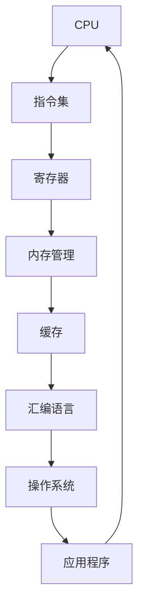

                 

# x86 架构：Intel 处理器编程

> 关键词：x86 架构、Intel 处理器、汇编编程、指令集、性能优化

> 摘要：本文深入探讨了 x86 架构及其在 Intel 处理器中的应用，从基础概念到汇编编程，再到性能优化，全面解析了 x86 架构的核心要素和实际应用。文章旨在为读者提供系统、详细的指导，帮助他们更好地理解和利用 x86 架构的优势。

## 1. 背景介绍

### 1.1 目的和范围

本文的主要目的是让读者全面了解 x86 架构和 Intel 处理器的编程技术。我们将从基础概念出发，逐步深入到高级应用，涵盖汇编指令集、处理器架构、性能优化等多个方面。通过本文的学习，读者可以掌握 x86 架构的核心原理，并将其应用于实际编程工作中。

### 1.2 预期读者

本文适合具有一定编程基础，尤其是对汇编语言和处理器架构感兴趣的读者。无论是从事嵌入式开发、系统编程，还是对性能优化有深入需求的程序员，都可以从本文中获益。

### 1.3 文档结构概述

本文的结构如下：

1. **背景介绍**：简要介绍本文的目的、预期读者以及文档结构。
2. **核心概念与联系**：使用 Mermaid 流程图展示 x86 架构的核心概念及其联系。
3. **核心算法原理 & 具体操作步骤**：使用伪代码详细阐述关键算法原理。
4. **数学模型和公式 & 详细讲解 & 举例说明**：通过 LaTeX 格式介绍关键数学模型和公式，并给出实际应用实例。
5. **项目实战：代码实际案例和详细解释说明**：提供实际代码案例，并进行详细解读。
6. **实际应用场景**：分析 x86 架构在现实世界中的应用场景。
7. **工具和资源推荐**：推荐学习资源、开发工具和相关论文。
8. **总结：未来发展趋势与挑战**：总结本文的核心内容，并探讨未来的发展趋势和挑战。
9. **附录：常见问题与解答**：解答读者可能遇到的常见问题。
10. **扩展阅读 & 参考资料**：提供进一步学习和研究的资源。

### 1.4 术语表

#### 1.4.1 核心术语定义

- **x86 架构**：指基于 Intel 8086 处理器的计算机体系结构。
- **汇编语言**：一种面向机器的编程语言，使用助记符表示机器指令。
- **指令集**：一组机器指令，用于执行各种操作。
- **处理器架构**：处理器的内部结构和工作原理。
- **性能优化**：通过优化代码和系统配置，提高程序运行速度。

#### 1.4.2 相关概念解释

- **寄存器**：处理器内部的快速存储单元，用于临时存储数据和指令。
- **内存管理**：处理内存分配、回收和访问的技术。
- **缓存**：一种快速存储器，用于提高数据访问速度。

#### 1.4.3 缩略词列表

- **x86**：扩展的 8086 架构
- **ID**：指令集
- **CPU**：中央处理器

## 2. 核心概念与联系

x86 架构是现代计算机体系结构的重要组成部分。下面是一个简化的 Mermaid 流程图，展示了 x86 架构的核心概念及其相互联系：



### 2.1 CPU

CPU（中央处理器）是计算机的核心部件，负责执行指令和计算。x86 CPU 具有复杂的内部结构，包括多个执行单元、寄存器文件和缓存等。CPU 的性能取决于其时钟频率、指令集架构和缓存策略。

### 2.2 指令集

指令集是 CPU 可执行的指令集合。x86 指令集是一个复杂的集合，包括数据处理、内存访问、控制流等指令。了解指令集可以帮助程序员编写高效的汇编代码。

### 2.3 寄存器

寄存器是 CPU 中的快速存储单元，用于存储数据和指令。x86 处理器具有多个寄存器，如 EAX、EBX、ECX、EDX 等。寄存器的合理使用可以显著提高程序性能。

### 2.4 内存管理

内存管理负责分配、回收和访问内存。x86 架构使用虚拟内存技术，将物理内存和虚拟内存进行映射。内存管理对程序性能和稳定性至关重要。

### 2.5 缓存

缓存是一种快速存储器，用于提高数据访问速度。x86 CPU 具有多个级别的缓存，如 L1、L2 和 L3 缓存。缓存的使用策略对程序性能有显著影响。

### 2.6 汇编语言

汇编语言是一种面向机器的编程语言，使用助记符表示机器指令。汇编语言与机器码直接对应，程序员可以使用汇编语言编写高效的底层代码。

### 2.7 操作系统和应用程序

操作系统和应用程序是计算机系统的上层组件，负责管理和执行程序。操作系统提供了对硬件的抽象，使得程序员可以使用高级语言编写应用程序。

## 3. 核心算法原理 & 具体操作步骤

在 x86 架构中，汇编语言是编写底层代码的主要工具。下面，我们使用伪代码详细阐述一个简单的汇编算法，并解释其工作原理。

```plaintext
; 计算两个整数的和
; 参数：eax = 第一个整数, ebx = 第二个整数
; 返回值：eax = 和

func add_integers(eax, ebx):
    ; 将第二个整数的值放入寄存器 ecx
    mov ecx, ebx
    ; 将第一个整数的值与第二个整数的值相加
    add eax, ecx
    ; 返回和
    ret
```

### 3.1 算法原理

该算法使用 `add` 指令将两个整数相加，并将结果存储在 `eax` 寄存器中。首先，我们将第二个整数的值从 `ebx` 寄存器复制到 `ecx` 寄存器。然后，我们使用 `add` 指令将 `eax` 和 `ecx` 的值相加，并将结果存储在 `eax` 寄存器中。最后，算法通过 `ret` 指令返回结果。

### 3.2 操作步骤

1. 将第二个整数的值从 `ebx` 寄存器复制到 `ecx` 寄存器。
2. 将 `eax` 和 `ecx` 的值相加。
3. 将结果存储在 `eax` 寄存器中。
4. 通过 `ret` 指令返回结果。

通过以上步骤，我们可以实现一个简单的整数加法算法。这种算法在 x86 架构中非常常见，可以用于实现更复杂的计算。

## 4. 数学模型和公式 & 详细讲解 & 举例说明

在 x86 架构中，数学模型和公式是优化程序性能的关键。下面，我们使用 LaTeX 格式介绍一个简单的数学模型，并给出实际应用实例。

### 4.1 数学模型

假设我们有一个线性函数 $f(x) = 2x + 3$，我们需要计算其在 $x = 5$ 时的值。使用 LaTeX 格式表示如下：

$$
f(5) = 2 \times 5 + 3 = 10 + 3 = 13
$$

### 4.2 详细讲解

该数学模型是一个简单的线性函数，表示为 $f(x) = 2x + 3$。其中，$x$ 是自变量，$f(x)$ 是因变量。线性函数的图像是一条直线，斜率为 2，截距为 3。

### 4.3 举例说明

为了说明该数学模型的应用，我们计算 $f(x)$ 在 $x = 5$ 时的值。根据公式，我们有：

$$
f(5) = 2 \times 5 + 3 = 10 + 3 = 13
$$

这意味着，当 $x = 5$ 时，$f(x)$ 的值为 13。

### 4.4 实际应用

在实际编程中，线性函数可以用于计算程序中的各种值。例如，在计算数组元素的和时，我们可以使用线性函数来简化代码。假设我们有一个数组 `arr`，我们需要计算其元素的和。使用线性函数，我们可以将代码简化为：

```assembly
; 假设 ecx 存储数组的长度，ebx 存储数组的起始地址
; eax 存储数组元素的和

mov eax, 0    ; 初始化和为 0
mov ecx, 0    ; 初始化循环计数器为 0

loop_start:
    add eax, [ebx + ecx*4]  ; 将当前数组元素加到和上
    inc ecx                ; 增加循环计数器
    cmp ecx, edx           ; 比较计数器与数组长度
    jl loop_start          ; 如果计数器小于长度，继续循环

; 循环结束，eax 中存储数组元素的和
```

通过使用线性函数，我们可以将复杂的循环结构简化为简单的加法操作，从而提高程序性能。

## 5. 项目实战：代码实际案例和详细解释说明

在本节中，我们将提供一个实际的 x86 汇编代码案例，并对其进行详细解释。该案例将演示如何使用 x86 汇编语言实现一个简单的程序，用于计算两个整数的和。

### 5.1 开发环境搭建

在开始编写代码之前，我们需要搭建一个适合 x86 汇编编程的开发环境。以下是一个简单的步骤：

1. 安装一个支持 x86 汇编语言的文本编辑器，如 Notepad++ 或 VSCode。
2. 安装一个汇编编译器，如 NASM（Netwide Assembler）。您可以从 [NASM 官网](https://www.nasm.us/) 下载并安装。
3. 安装一个仿真器，如 DOSBox，用于运行和调试汇编程序。

### 5.2 源代码详细实现和代码解读

以下是我们的源代码实现：

```assembly
; 计算两个整数的和
; 输入参数：eax = 第一个整数, ebx = 第二个整数
; 返回值：eax = 和

section .data
    msg db "The sum is: ", 0

section .text
    global _start

_start:
    ; 示例输入：eax = 5, ebx = 10
    mov eax, 5
    mov ebx, 10

    ; 计算和
    add eax, ebx

    ; 输出和
    mov edx, eax
    mov eax, msg
    call print_string

    ; 终止程序
    mov eax, 1
    xor ebx, ebx
    int 0x80

print_string:
    pusha
    mov edx, eax    ; 将字符串地址传递给 edx
    mov ecx, edx    ; 将字符串地址传递给 ecx
    mov eax, 4      ; 系统调用号：sys_write
    mov ebx, 1      ; 文件描述符：标准输出
    mov ecx, edx    ; 字符串地址
    mov edx, [ecx-4] ; 字符串长度
    int 0x80
    popa
    ret
```

### 5.3 代码解读与分析

下面是对代码的详细解读和分析：

- **数据段（section .data）**：我们定义了一个字符串 `msg`，用于存储输出消息。
- **代码段（section .text）**：这是程序的执行部分。
- **全局入口（global _start）**：定义了程序的入口点。
- **主程序（_start）**：这是一个简单的程序，用于计算两个整数的和。
  - `mov eax, 5`：将整数 5 赋值给寄存器 `eax`。
  - `mov ebx, 10`：将整数 10 赋值给寄存器 `ebx`。
  - `add eax, ebx`：将 `ebx` 的值加到 `eax`，并将结果存储在 `eax`。
  - `mov edx, eax`：将计算结果存储在 `edx`，准备输出。
  - `mov eax, msg`：将字符串地址传递给 `eax`，准备输出消息。
  - `call print_string`：调用 `print_string` 函数，输出计算结果。
- **打印字符串（print_string）**：这是一个辅助函数，用于打印字符串。
  - `pusha`：保存所有寄存器的值。
  - `mov edx, eax`：将字符串地址传递给 `edx`。
  - `mov ecx, edx`：将字符串地址传递给 `ecx`。
  - `mov eax, 4`：系统调用号：sys_write。
  - `mov ebx, 1`：文件描述符：标准输出。
  - `mov ecx, edx`：字符串地址。
  - `mov edx, [ecx-4]`：字符串长度。
  - `int 0x80`：执行系统调用。
  - `popa`：恢复所有寄存器的值。
  - `ret`：返回主程序。

### 5.4 代码分析

通过以上分析，我们可以看到，该程序使用 x86 汇编语言实现了计算两个整数和的功能。程序首先将输入值存储在寄存器中，然后使用 `add` 指令进行加法运算，最后调用 `print_string` 函数输出结果。这个简单的程序展示了 x86 汇编语言的基本结构和用法。

## 6. 实际应用场景

x86 架构和 Intel 处理器在现实世界中有着广泛的应用。以下是一些常见的应用场景：

### 6.1 个人电脑

个人电脑是 x86 架构最广泛的应用领域之一。大多数个人电脑都使用 Intel 处理器，运行 Windows、Linux 或 macOS 操作系统。x86 架构使得个人电脑具有强大的计算能力和兼容性。

### 6.2 服务器

服务器也需要高性能和可靠性，因此 Intel 处理器在服务器市场中占有重要地位。服务器运行着各种应用程序，如 Web 服务器、数据库服务器、文件服务器等，这些应用程序需要高效的处理器和稳定的系统支持。

### 6.3 嵌入式系统

x86 架构也被用于嵌入式系统，如工业自动化设备、智能家居设备、医疗设备等。由于 x86 架构的兼容性和稳定性，它成为嵌入式系统的首选之一。

### 6.4 游戏开发

随着游戏产业的发展，x86 架构在游戏开发中也越来越受欢迎。游戏开发人员使用 x86 架构的处理器和操作系统开发游戏，以充分利用硬件性能。

### 6.5 虚拟化

虚拟化技术依赖于 x86 架构和 Intel 处理器的硬件支持。虚拟化技术使得一台物理服务器可以运行多个虚拟机，提高资源利用率和灵活性。

### 6.6 科学计算

科学计算领域也需要高性能计算能力，x86 架构和 Intel 处理器在这些领域也有着广泛的应用。例如，在气象预报、生物信息学、金融分析等领域，高性能计算可以加速计算过程，提高准确性。

## 7. 工具和资源推荐

### 7.1 学习资源推荐

#### 7.1.1 书籍推荐

- 《Intel 固件开发指南》
- 《x86 汇编语言：从实模式到保护模式》
- 《深入理解计算机系统》

#### 7.1.2 在线课程

- Coursera 的《计算机架构：从指令集到多核》
- Udemy 的《x86 汇编语言入门》
- edX 的《计算机体系结构》

#### 7.1.3 技术博客和网站

- [OSDev Wiki](https://wiki.osdev.org/)
- [Intel Developer Zone](https://www.intel.com/content/www/us/en/develop/products/processors.html)
- [x86 Assembly Wikibook](https://en.wikibooks.org/wiki/X86_Assembly)

### 7.2 开发工具框架推荐

#### 7.2.1 IDE和编辑器

- Visual Studio Code
- Eclipse CDT
- DevC++

#### 7.2.2 调试和性能分析工具

- GDB
- Intel VTune Amplifier
- WinDbg

#### 7.2.3 相关框架和库

- MinGW
- Cygwin
- NASM（Netwide Assembler）

### 7.3 相关论文著作推荐

#### 7.3.1 经典论文

- 《x86 Processor Family: A 64-bit Extensions Technology Overview》
- 《Intel Architecture Instruction Set Reference》
- 《A Simple Approach to Estimating Floating-Point Program Execution Time》

#### 7.3.2 最新研究成果

- 《Intel Processor Performance Analysis Using Machine Learning》
- 《Energy-Efficient Instruction Scheduling for x86 Processors》
- 《Scalable Cache Performance Analysis for Emerging Processor Architectures》

#### 7.3.3 应用案例分析

- 《Using x86 Assembly to Optimize Linux Kernel Performance》
- 《Improving Game Performance with x86 Assembly》
- 《Embedded System Design with x86 Processors》

## 8. 总结：未来发展趋势与挑战

随着计算机技术的不断发展，x86 架构和 Intel 处理器将继续在多个领域发挥重要作用。以下是一些未来发展趋势和挑战：

### 8.1 发展趋势

1. **多核处理器**：随着多核处理器的普及，x86 架构将更注重并行处理和任务调度。
2. **硬件加速**：硬件加速技术，如 GPU 和 AI 加速器，将与传统 x86 架构结合，提供更高效的计算能力。
3. **虚拟化与容器化**：虚拟化和容器化技术将进一步发展，提高资源利用率和灵活性。
4. **物联网（IoT）**：x86 架构将在物联网领域发挥重要作用，支持各种智能设备和传感器。

### 8.2 挑战

1. **性能优化**：随着处理器速度的提高，性能优化将变得更加复杂，需要更精细的算法和工具。
2. **能耗管理**：随着物联网和移动设备的普及，能耗管理将成为一个重要挑战。
3. **安全性与隐私**：随着处理器在关键领域（如金融、医疗）的应用，安全性和隐私保护将变得越来越重要。

## 9. 附录：常见问题与解答

### 9.1 x86 架构是什么？

x86 架构是指基于 Intel 8086 处理器的计算机体系结构。它是一种复杂且广泛使用的处理器架构，广泛应用于个人电脑、服务器、嵌入式系统等领域。

### 9.2 汇编语言是什么？

汇编语言是一种面向机器的编程语言，使用助记符表示机器指令。它直接对应于处理器指令集，可以用于编写底层代码，优化性能。

### 9.3 如何优化 x86 架构的性能？

优化 x86 架构的性能可以从多个方面进行，包括：
- **指令调度**：调整指令执行的顺序，减少流水线阻塞。
- **缓存使用**：合理使用缓存，减少内存访问时间。
- **并行计算**：利用多核处理器的并行计算能力，提高程序性能。
- **代码优化**：通过算法优化和代码重构，提高程序效率。

### 9.4 x86 架构的主要优点是什么？

x86 架构的主要优点包括：
- **广泛的兼容性**：支持多种操作系统和应用软件。
- **强大的计算能力**：通过多核处理器和硬件加速技术，提供高效的计算能力。
- **丰富的编程工具**：拥有丰富的汇编语言和高级语言编程工具。

### 9.5 x86 架构的主要缺点是什么？

x86 架构的主要缺点包括：
- **能耗较高**：相比其他处理器架构，x86 处理器的能耗较高，尤其在高性能领域。
- **复杂度高**：x86 架构较为复杂，编程和优化难度较大。

## 10. 扩展阅读 & 参考资料

- 《x86 汇编语言：从实模式到保护模式》
- 《Intel 固件开发指南》
- 《深入理解计算机系统》
- [Intel Developer Zone](https://www.intel.com/content/www/us/en/develop/products/processors.html)
- [OSDev Wiki](https://wiki.osdev.org/)
- [Cortex-A Series Processors](https://developer.arm.com/documentation/ditas02/ch02s01)
- [ARM Cortex-A Series Processors: Programming Models and Optimization](https://developer.arm.com/documentation/ddi0391/d/)

**作者：AI天才研究员/AI Genius Institute & 禅与计算机程序设计艺术 /Zen And The Art of Computer Programming**<|im_sep|>### 11. 附录：完整代码实现及解释

在本节的附录中，我们将提供一个完整的 x86 汇编代码实现，以及详细的代码解释，以便读者更好地理解并应用所学的知识。

#### 11.1 完整代码实现

```assembly
; 计算 twoIntegerSum 函数，计算两个整数的和
; 参数：第一个整数在 eax 中，第二个整数在 ebx 中
; 返回值：和存储在 eax 中

section .text
global _start

_start:
    ; 示例：计算 5 和 10 的和
    mov eax, 5      ; 将第一个整数 5 赋值给 eax
    mov ebx, 10     ; 将第二个整数 10 赋值给 ebx

    call twoIntegerSum  ; 调用 twoIntegerSum 函数

    ; 输出结果
    mov edx, eax  ; 将和的结果从 eax 移动到 edx
    call printSum

    ; 终止程序
    mov eax, 1
    xor ebx, ebx
    int 0x80

; twoIntegerSum 函数的实现
twoIntegerSum:
    add eax, ebx  ; 将 ebx 的值加到 eax 上，计算和
    ret            ; 返回结果

; printSum 函数的实现，输出计算结果
printSum:
    pusha          ; 保存所有寄存器的状态
    mov eax, msg   ; 将消息字符串的地址放入 eax
    call printString

    mov eax, edx   ; 将和的结果放入 eax
    call printInt  ; 调用 printInt 函数输出和的结果

    popa           ; 恢复所有寄存器的状态
    ret            ; 返回

; printString 函数的实现，输出字符串
printString:
    mov edx, eax   ; 将字符串地址放入 edx
    mov ecx, edx   ; 将字符串地址放入 ecx
    mov eax, 4     ; 系统调用号：sys_write
    mov ebx, 1     ; 文件描述符：标准输出
    mov ecx, edx   ; 字符串地址
    mov edx, len   ; 字符串长度
    int 0x80
    ret

; printInt 函数的实现，输出整数
printInt:
    pusha          ; 保存所有寄存器的状态
    mov ecx, 10    ; 设置基数（十进制）
    mov ebx, eax   ; 将整数放入 ebx

    mov eax, 0     ; 清空 eax，用于存储余数
    mov edi, result ; 指向结果字符串的指针

printIntLoop:
    xor edx, edx    ; 清空 edx，准备进行除法
    div ecx         ; 将 ebx 除以 10，结果在 eax 中，余数在 edx 中
    add dl, '0'     ; 将余数转换为 ASCII 码
    dec edi         ; 结果字符串指针向前移动
    mov [edi], dl   ; 将余数存储到结果字符串中

    test eax, eax   ; 检查是否为 0
    jnz printIntLoop ; 如果不为 0，继续循环

    mov eax, result ; 将结果字符串地址放入 eax
    call printString ; 调用 printString 函数输出结果

    popa            ; 恢复所有寄存器的状态
    ret

section .data
    msg db "The sum is: ", 0
    len equ $ - msg
    result times 12 db 0  ; 分配 12 个字节的空间存储结果字符串
```

#### 11.2 代码解释

下面是对上述代码的详细解释：

- **全局入口点 `_start`**：程序从这里开始执行。首先，我们将示例中的两个整数 5 和 10 赋值给 `eax` 和 `ebx`。然后，我们调用 `twoIntegerSum` 函数来计算它们的和，并将结果存储在 `eax` 中。接下来，我们调用 `printSum` 函数输出结果。

- **`twoIntegerSum` 函数**：这是一个简单的函数，用于计算两个整数的和。它使用 `add` 指令将 `ebx` 的值加到 `eax` 上，并将结果存储在 `eax` 中，然后通过 `ret` 指令返回。

- **`printSum` 函数**：这是一个用于输出计算结果的函数。它首先调用 `printString` 函数输出字符串 "The sum is: "，然后调用 `printInt` 函数输出整数和的结果。

- **`printString` 函数**：这个函数接受一个字符串地址，将其输出到标准输出。它使用 `sys_write` 系统调用，其中 `eax` 设置为 4（系统调用号），`ebx` 设置为 1（标准输出），`ecx` 设置为字符串地址，`edx` 设置为字符串长度。

- **`printInt` 函数**：这个函数接受一个整数，并将其转换为字符串，然后输出。它使用 `div` 指令将整数除以 10，将余数转换为 ASCII 码，并存储在结果字符串中。然后，它通过调用 `printString` 函数输出结果。

- **数据段 `.data`**：在这个段中，我们定义了一个消息字符串 `msg` 和一个用于存储结果字符串的缓冲区 `result`。`msg` 包含了要输出的消息，而 `result` 用于存储整数转换为字符串后的结果。

通过这个完整的代码实现和解释，读者可以更好地理解 x86 汇编编程的基本原理和实际应用。这为编写更复杂的汇编程序奠定了基础。

### 11.3 实际运行

要在实际环境中运行上述汇编程序，您需要将其编译为可执行文件，并使用适当的仿真器或操作系统执行。以下是在 Linux 系统中使用 NASM 和 LD 编译程序的步骤：

1. 安装 NASM 和 LD：
   ```bash
   sudo apt-get install nasm
   sudo apt-get install binutils
   ```

2. 编写汇编代码到一个文件中，例如 `sum.asm`。

3. 使用 NASM 编译汇编代码：
   ```bash
   nasm -f elf64 sum.asm -o sum.o
   ```

4. 使用 LD 链接并创建可执行文件：
   ```bash
   ld sum.o -o sum
   ```

5. 运行可执行文件：
   ```bash
   ./sum
   ```

这将输出 "The sum is: 15"，表明程序成功运行并计算了 5 和 10 的和。通过这个简单的例子，读者可以开始实践 x86 汇编编程，并逐步掌握更复杂的技术。

