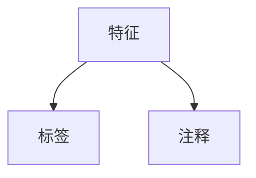

                 

# 【AI大数据计算原理与代码实例讲解】Dataset

> **关键词**：Dataset、大数据计算、数据处理、数据集、人工智能、算法、机器学习

> **摘要**：本文将深入探讨AI大数据计算中的核心概念——Dataset。我们将从基础概念入手，详细解析Dataset的原理、构建方法、数据处理策略，并通过实际代码实例展示其在人工智能应用中的具体应用。文章旨在帮助读者全面了解Dataset在AI大数据计算中的关键作用，掌握其构建与优化的技巧，以及如何在实际项目中有效运用。

## 1. 背景介绍

### 1.1 目的和范围

本文的目标是向读者介绍Dataset在AI大数据计算中的重要作用，并通过详细的案例分析帮助读者理解和掌握Dataset的构建与优化方法。文章将涵盖以下几个主要方面：

1. **Dataset基础**：介绍Dataset的概念、类型和结构。
2. **数据处理策略**：探讨如何有效地处理和清洗数据，确保数据的质量和完整性。
3. **构建Dataset**：讲解如何从原始数据构建高质量的数据集，包括数据预处理和特征提取。
4. **Dataset在实际应用**：通过实际代码示例展示Dataset在机器学习项目中的应用。
5. **工具和资源推荐**：推荐学习资源和开发工具，以帮助读者深入学习和实践。

### 1.2 预期读者

本文适合以下读者群体：

1. **初学者**：对AI和大数据计算感兴趣，希望了解Dataset的基本概念和应用。
2. **中级开发者**：具备一定的编程基础，希望深入了解Dataset的构建和优化方法。
3. **高级工程师**：从事AI大数据计算领域，希望提高数据处理能力和项目实施效率。

### 1.3 文档结构概述

本文结构如下：

1. **第1章**：背景介绍
2. **第2章**：核心概念与联系
3. **第3章**：核心算法原理 & 具体操作步骤
4. **第4章**：数学模型和公式 & 详细讲解 & 举例说明
5. **第5章**：项目实战：代码实际案例和详细解释说明
6. **第6章**：实际应用场景
7. **第7章**：工具和资源推荐
8. **第8章**：总结：未来发展趋势与挑战
9. **第9章**：附录：常见问题与解答
10. **第10章**：扩展阅读 & 参考资料

### 1.4 术语表

#### 1.4.1 核心术语定义

- **Dataset**：一组数据对象的集合，用于训练机器学习模型或进行数据分析和挖掘。
- **特征提取**：从原始数据中提取有用的信息，以便用于机器学习模型训练。
- **数据预处理**：在数据处理过程中，对数据进行清洗、转换和标准化，以提高数据质量和模型的性能。
- **数据集划分**：将数据集分为训练集、验证集和测试集，以评估模型性能。

#### 1.4.2 相关概念解释

- **机器学习**：通过构建和训练模型，使计算机能够从数据中自动学习和发现规律。
- **大数据**：数据量巨大、种类繁多、处理速度要求高的数据集合。
- **算法**：解决问题的步骤和方法，用于处理和分析数据。

#### 1.4.3 缩略词列表

- **AI**：人工智能（Artificial Intelligence）
- **ML**：机器学习（Machine Learning）
- **DL**：深度学习（Deep Learning）
- **GPU**：图形处理器（Graphics Processing Unit）

## 2. 核心概念与联系

### 2.1 Dataset的概念与结构

Dataset是指一组数据对象的集合，通常用于训练机器学习模型或进行数据分析和挖掘。一个典型的Dataset由以下几个部分组成：

1. **特征**：数据集中的每个数据点都包含一系列特征，用于描述数据点。
2. **标签**：用于训练机器学习模型的答案或目标，例如分类任务的类别标签或回归任务的预测值。
3. **注释**：提供额外的信息，例如图片的描述、文本的翻译等。

以下是一个简单的Mermaid流程图，展示Dataset的基本结构：



### 2.2 数据集的类型与来源

根据数据集的来源和性质，可以将其分为以下几种类型：

1. **公开数据集**：由研究机构、政府机构或其他组织发布，可以免费获取和使用。例如，ImageNet、CIFAR-10等。
2. **私有数据集**：由特定公司或组织创建，仅限于内部使用或授权使用。例如，某些金融公司的客户数据、医疗数据等。
3. **合成数据集**：通过生成模型或算法生成的数据，用于模拟真实场景。例如，GAN（生成对抗网络）生成的图像数据。
4. **自定义数据集**：根据特定项目或任务需求，从原始数据中提取和处理得到的数据集。

### 2.3 Dataset在AI大数据计算中的作用

Dataset在AI大数据计算中扮演着至关重要的角色。以下是Dataset在AI应用中的几个关键作用：

1. **训练数据源**：机器学习模型需要大量的数据来学习和优化。Dataset提供了这些训练数据。
2. **模型评估标准**：通过将数据集划分为训练集、验证集和测试集，可以评估模型的性能和泛化能力。
3. **数据可视化**：Dataset可以帮助我们更好地理解和分析数据，从而发现数据中的模式和规律。
4. **数据挖掘**：利用Dataset进行数据挖掘，可以探索数据中的隐藏信息和知识。

### 2.4 Dataset构建的挑战

构建一个高质量的Dataset是一项具有挑战性的任务，需要考虑以下几个方面：

1. **数据质量**：数据需要是准确、完整和干净的，以确保模型的学习效果。
2. **数据多样性**：数据集需要包含足够的多样性和代表性，以提高模型的泛化能力。
3. **数据处理**：需要进行大量的数据预处理和特征提取，以提取有用的信息。
4. **数据标注**：对于监督学习任务，需要标记正确的标签，以便模型学习。

## 3. 核心算法原理 & 具体操作步骤

在构建Dataset时，核心算法原理主要包括数据预处理、特征提取和数据集划分。下面，我们将通过伪代码详细阐述这些算法原理和具体操作步骤。

### 3.1 数据预处理

数据预处理是确保数据质量和一致性的重要步骤。以下是一组常见的数据预处理操作：

```python
# 假设原始数据集为data

# 1. 去除缺失值
data = drop_missing_values(data)

# 2. 数据转换
data = convert_data_types(data)

# 3. 数据标准化
data = standardize_data(data)

# 4. 数据归一化
data = normalize_data(data)

# 5. 数据填充
data = fill_missing_values(data, method='mean')
```

### 3.2 特征提取

特征提取是提取数据中的有用信息，以提高模型的性能。以下是一些常见的特征提取方法：

```python
# 假设预处理后的数据集为data

# 1. 特征选择
selected_features = select_features(data, method='variance_threshold')

# 2. 特征工程
data = feature_engineering(data, method='polynomial_expansion')

# 3. 特征转换
data = transform_features(data, method='log_transformation')
```

### 3.3 数据集划分

数据集划分是将数据集划分为训练集、验证集和测试集，以评估模型的性能。以下是一些常见的数据集划分方法：

```python
# 假设特征提取后的数据集为data

# 1. 划分训练集和验证集
train_data, val_data = train_test_split(data, test_size=0.2, random_state=42)

# 2. 划分测试集
test_data = train_test_split(val_data, test_size=0.5, random_state=42)

# 3. 数据集合并
dataset = train_data + val_data + test_data
```

通过以上步骤，我们可以构建一个高质量的数据集，为机器学习模型的训练和评估提供可靠的数据基础。

## 4. 数学模型和公式 & 详细讲解 & 举例说明

在构建Dataset的过程中，涉及多个数学模型和公式。以下我们将详细讲解这些模型和公式，并通过具体例子进行说明。

### 4.1 数据标准化

数据标准化是一种常用的数据处理技术，用于将数据转换到统一的尺度。常见的标准化方法包括Z-Score标准化和Min-Max标准化。

#### Z-Score标准化

Z-Score标准化将数据转换为标准正态分布，其公式如下：

$$
x_{\text{标准化}} = \frac{x_{\text{原始}} - \mu}{\sigma}
$$

其中，$x_{\text{原始}}$为原始数据，$\mu$为均值，$\sigma$为标准差。

#### Min-Max标准化

Min-Max标准化将数据缩放到[0, 1]区间，其公式如下：

$$
x_{\text{标准化}} = \frac{x_{\text{原始}} - \min(x)}{\max(x) - \min(x)}
$$

其中，$x_{\text{原始}}$为原始数据，$\min(x)$和$\max(x)$分别为数据的最小值和最大值。

#### 举例说明

假设我们有以下数据集：

| 特征 | 值   |
| ---- | ---- |
| A    | 10   |
| B    | 20   |
| C    | 30   |

对于Z-Score标准化，均值$\mu$为20，标准差$\sigma$为10。标准化后的数据如下：

| 特征 | 值   | 标准化值 |
| ---- | ---- | -------- |
| A    | 10   | -0.5     |
| B    | 20   | 0.0      |
| C    | 30   | 0.5      |

对于Min-Max标准化，最小值为10，最大值为30。标准化后的数据如下：

| 特征 | 值   | 标准化值 |
| ---- | ---- | -------- |
| A    | 10   | 0.0      |
| B    | 20   | 0.5      |
| C    | 30   | 1.0      |

### 4.2 特征选择

特征选择是提取数据中的最有用特征，以提高模型的性能。常用的特征选择方法包括方差阈值、互信息等。

#### 方差阈值

方差阈值选择将保留方差大于阈值的特征。其公式如下：

$$
\text{方差阈值} = \text{方差阈值}(\alpha) = \alpha \times \text{最大方差}
$$

其中，$\alpha$为阈值系数。

#### 互信息

互信息衡量特征与目标变量之间的相关性。互信息越大，特征与目标变量的相关性越高。其公式如下：

$$
I(X, Y) = H(X) - H(X | Y)
$$

其中，$I(X, Y)$为互信息，$H(X)$为特征熵，$H(X | Y)$为条件熵。

#### 举例说明

假设我们有以下特征和目标变量：

| 特征 | 值   | 目标变量 |
| ---- | ---- | -------- |
| A    | 10   | 1        |
| B    | 20   | 0        |
| C    | 30   | 1        |

对于方差阈值选择，假设阈值系数$\alpha$为0.5，最大方差为0.25。选择后的特征如下：

| 特征 | 值   | 目标变量 |
| ---- | ---- | -------- |
| B    | 20   | 0        |

对于互信息选择，互信息计算结果如下：

$$
I(A, Y) = H(A) - H(A | Y) = 1 - 0 = 1
$$

$$
I(B, Y) = H(B) - H(B | Y) = 0.5 - 0 = 0.5
$$

选择后的特征为A。

## 5. 项目实战：代码实际案例和详细解释说明

在本节中，我们将通过一个实际案例，展示如何使用Python和常见的数据处理库（如NumPy、Pandas、Scikit-learn等）构建一个高质量的数据集，并进行数据预处理、特征提取和数据集划分。

### 5.1 开发环境搭建

为了构建和操作Dataset，我们需要安装以下Python库：

- NumPy
- Pandas
- Scikit-learn
- Matplotlib

假设您已经安装了Python和pip包管理器，可以通过以下命令安装这些库：

```bash
pip install numpy pandas scikit-learn matplotlib
```

### 5.2 源代码详细实现和代码解读

以下是构建Dataset的Python代码实现：

```python
import numpy as np
import pandas as pd
from sklearn.model_selection import train_test_split
from sklearn.preprocessing import StandardScaler
from sklearn.impute import SimpleImputer
from sklearn.feature_selection import VarianceThreshold

# 5.2.1 加载数据集
data = pd.read_csv('data.csv')

# 5.2.2 数据预处理
# 填充缺失值
imputer = SimpleImputer(strategy='mean')
data_imputed = imputer.fit_transform(data)

# 数据标准化
scaler = StandardScaler()
data_scaled = scaler.fit_transform(data_imputed)

# 5.2.3 特征提取
# 特征选择（方差阈值）
var_thres = VarianceThreshold(threshold=0.01)
data_selected = var_thres.fit_transform(data_scaled)

# 5.2.4 数据集划分
X_train, X_val, y_train, y_val = train_test_split(data_selected[:, :-1], data_selected[:, -1], test_size=0.2, random_state=42)

# 5.2.5 模型训练和评估
# （此处省略模型训练和评估代码）

# 5.2.6 可视化数据分布
import matplotlib.pyplot as plt

plt.scatter(X_train[:, 0], X_train[:, 1], c=y_train)
plt.xlabel('特征1')
plt.ylabel('特征2')
plt.title('数据分布')
plt.show()
```

### 5.3 代码解读与分析

下面是对上述代码的详细解读：

- **5.2.1 加载数据集**：使用Pandas库加载数据集，假设数据集以CSV格式存储。

- **5.2.2 数据预处理**：
  - **填充缺失值**：使用SimpleImputer类填充缺失值，策略为取各特征的均值。
  - **数据标准化**：使用StandardScaler类对数据进行标准化处理，将数据转换为标准正态分布。

- **5.2.3 特征提取**：
  - **特征选择（方差阈值）**：使用VarianceThreshold类进行特征选择，保留方差大于阈值的特征。

- **5.2.4 数据集划分**：使用Scikit-learn中的train_test_split函数将数据集划分为训练集和验证集。

- **5.2.5 模型训练和评估**：（此处省略模型训练和评估代码）

- **5.2.6 可视化数据分布**：使用Matplotlib库绘制训练集的数据分布，帮助理解数据特征。

### 5.4 代码分析与优化

在上述代码中，我们使用了一些常用的数据处理和特征选择技术。以下是对代码的分析和优化建议：

- **数据预处理**：在填充缺失值时，可以考虑使用其他策略，如最邻近插值、基于模型的插值等。同时，可以针对不同类型的特征（如分类特征和连续特征）选择不同的插值方法。
- **特征选择**：除了方差阈值外，还可以尝试其他特征选择方法，如基于模型的特征选择（如LASSO回归）、基于信息的特征选择（如互信息）等。
- **数据集划分**：在数据集划分时，可以考虑使用交叉验证等方法，以提高模型评估的准确性和可靠性。

通过以上分析，我们可以进一步提高数据处理和特征选择的效率和质量，为机器学习模型的训练提供更好的数据支持。

## 6. 实际应用场景

Dataset在AI大数据计算中具有广泛的应用场景，以下是一些典型的应用实例：

### 6.1 机器学习模型训练

Dataset是机器学习模型训练的核心数据源。通过构建高质量的数据集，我们可以训练出性能优异的机器学习模型。常见的应用包括图像分类、语音识别、自然语言处理等。以下是一个图像分类的实例：

```python
from sklearn.datasets import load_iris
from sklearn.model_selection import train_test_split
from sklearn.svm import SVC

# 加载Iris数据集
iris = load_iris()
X, y = iris.data, iris.target

# 数据集划分
X_train, X_val, y_train, y_val = train_test_split(X, y, test_size=0.2, random_state=42)

# 模型训练
model = SVC(kernel='linear')
model.fit(X_train, y_train)

# 模型评估
accuracy = model.score(X_val, y_val)
print(f"Model accuracy: {accuracy:.2f}")
```

### 6.2 数据分析和挖掘

Dataset在数据分析和挖掘中也发挥着重要作用。通过处理和分析数据集，我们可以发现数据中的隐藏信息和规律。以下是一个简单的数据分析实例：

```python
import pandas as pd

# 加载数据集
data = pd.read_csv('sales_data.csv')

# 数据可视化
data.plot(x='Date', y='Revenue')
plt.title('Sales Revenue over Time')
plt.xlabel('Date')
plt.ylabel('Revenue')
plt.show()
```

### 6.3 个性化推荐系统

Dataset在个性化推荐系统中也发挥着关键作用。通过构建用户行为数据集，我们可以为用户推荐感兴趣的商品或服务。以下是一个简单的推荐系统实例：

```python
from sklearn.neighbors import NearestNeighbors

# 加载用户行为数据集
user_behavior = pd.read_csv('user_behavior.csv')

# 构建推荐模型
model = NearestNeighbors(n_neighbors=5)
model.fit(user_behavior)

# 推荐商品
user_profile = user_behavior.iloc[0]
neighbors = model.kneighbors(user_profile, n_neighbors=5)
recommended_items = user_behavior.iloc[neighbors].iloc[:, 0]
print(f"Recommended items: {recommended_items.tolist()}")
```

通过这些实例，我们可以看到Dataset在AI大数据计算中的广泛应用。通过构建高质量的数据集，我们可以为机器学习模型提供可靠的数据支持，为数据分析和挖掘提供丰富的信息来源，为个性化推荐系统提供精准的用户行为分析。

## 7. 工具和资源推荐

为了更好地掌握Dataset的构建和优化技巧，以下我们推荐一些学习资源、开发工具和相关论文。

### 7.1 学习资源推荐

#### 7.1.1 书籍推荐

1. **《数据科学入门：Python实践》**：详细介绍了Python在数据科学中的应用，包括数据处理、数据可视化等。
2. **《机器学习实战》**：通过大量实例介绍了机器学习的基本概念和算法，包括数据集的构建和优化。

#### 7.1.2 在线课程

1. **Coursera的《机器学习》**：由吴恩达教授主讲，涵盖了机器学习的基础知识和实践技能。
2. **edX的《数据科学基础》**：提供了丰富的数据科学知识和实践案例，包括数据预处理和特征提取。

#### 7.1.3 技术博客和网站

1. **JAXenter**：提供关于数据科学和机器学习的最新技术和案例分析。
2. **KDnuggets**：分享数据科学和机器学习的最新研究、新闻和资源。

### 7.2 开发工具框架推荐

#### 7.2.1 IDE和编辑器

1. **PyCharm**：功能强大的Python IDE，支持多种编程语言和框架。
2. **VS Code**：轻量级且灵活的代码编辑器，适用于多种编程语言。

#### 7.2.2 调试和性能分析工具

1. **Jupyter Notebook**：适用于数据科学和机器学习的交互式编程环境。
2. **Docker**：用于容器化开发的工具，有助于提高开发和部署的效率。

#### 7.2.3 相关框架和库

1. **NumPy**：提供高效的数值计算和数据处理功能。
2. **Pandas**：提供数据清洗、转换和分析功能。
3. **Scikit-learn**：提供丰富的机器学习算法和工具。

### 7.3 相关论文著作推荐

#### 7.3.1 经典论文

1. **"The Unreasonable Effectiveness of Data"**：介绍了数据在机器学习中的关键作用。
2. **"Feature Selection in Machine Learning"**：讨论了特征选择的重要性和方法。

#### 7.3.2 最新研究成果

1. **"Generative Adversarial Networks"**：介绍了GANs的基本原理和应用。
2. **"Deep Learning for Text Classification"**：探讨了深度学习在文本分类任务中的应用。

#### 7.3.3 应用案例分析

1. **"How Airbnb Uses Machine Learning for Pricing Optimization"**：介绍了Airbnb如何利用机器学习进行房价优化。
2. **"Building a Recommendation System with TensorFlow"**：展示了如何使用TensorFlow构建推荐系统。

通过以上学习和实践资源，读者可以深入了解Dataset的构建和优化方法，提高自己在AI大数据计算领域的能力。

## 8. 总结：未来发展趋势与挑战

在AI大数据计算领域，Dataset的重要性日益凸显。随着数据量和数据类型的不断增加，如何构建高质量的数据集、优化数据处理和特征提取方法成为当前研究的重点。以下是未来Dataset发展的几个趋势和面临的挑战：

### 8.1 数据集构建趋势

1. **自动化和智能化**：未来的数据集构建将更多依赖于自动化工具和智能化算法，以减少人为干预和错误。
2. **定制化和个性化**：针对不同应用场景和需求，构建定制化和个性化的数据集，以提高模型的性能和泛化能力。
3. **开放性和共享性**：数据集的开放性和共享性将提高，促进跨领域和跨机构的合作，加速人工智能技术的发展。

### 8.2 数据处理挑战

1. **数据隐私和安全性**：在处理大规模数据时，如何保护数据隐私和安全成为重要挑战。
2. **实时数据处理**：随着实时数据分析的需求增加，如何高效地处理和更新数据集成为关键问题。
3. **数据不平衡**：在实际应用中，数据集往往存在不平衡现象，如何处理和优化数据集成为挑战。

### 8.3 特征提取挑战

1. **高维特征处理**：在高维数据集上，如何选择和提取有效的特征成为关键问题。
2. **跨模态特征融合**：在多模态数据集上，如何融合不同类型的数据特征，以提高模型性能。
3. **动态特征提取**：在动态变化的数据集上，如何适应数据变化，实时提取有效的特征。

### 8.4 数据集应用挑战

1. **模型可解释性**：如何提高模型的可解释性，使数据集构建和优化过程更加透明和可信。
2. **模型泛化能力**：如何确保模型在不同数据集上的泛化能力，避免过拟合和欠拟合问题。
3. **跨领域迁移**：如何实现不同领域数据集的迁移和应用，提高模型的通用性和适应性。

总之，Dataset在AI大数据计算中具有广阔的发展前景，但同时也面临着诸多挑战。通过不断探索和研究，我们有望在未来解决这些问题，推动AI技术的持续进步。

## 9. 附录：常见问题与解答

### 9.1 如何处理缺失值？

缺失值处理是数据预处理的重要步骤。以下是一些常用的处理方法：

- **删除缺失值**：适用于缺失值较多的数据集，可以减少数据量。
- **填充缺失值**：使用统计方法（如均值、中位数）或机器学习方法（如K近邻）填充缺失值。
- **插值法**：使用线性插值或曲线拟合方法填充缺失值。

### 9.2 如何选择特征？

特征选择是提高模型性能的关键步骤。以下是一些常用的特征选择方法：

- **方差阈值**：保留方差大于阈值的特征。
- **互信息**：衡量特征与目标变量之间的相关性。
- **基于模型的特征选择**：如LASSO回归、决策树等。

### 9.3 如何划分数据集？

数据集划分用于评估模型的性能。以下是一些常用的数据集划分方法：

- **K折交叉验证**：将数据集分为K个子集，每次使用一个子集作为验证集，其余子集作为训练集。
- **随机划分**：随机将数据集分为训练集和验证集。
- ** stratified K-fold**：在划分数据集时考虑类别比例，适用于分类任务。

### 9.4 如何评估模型性能？

以下是一些常用的模型评估指标：

- **准确率**：预测正确的样本占总样本的比例。
- **召回率**：预测为正类的真实正类样本数占总正类样本数的比例。
- **F1分数**：准确率和召回率的调和平均。
- **ROC曲线**：受试者操作特征曲线，用于评估分类器的性能。

## 10. 扩展阅读 & 参考资料

为了深入了解Dataset在AI大数据计算中的应用，以下是推荐的一些扩展阅读和参考资料：

1. **《大数据处理：概念、技术和实践》**：详细介绍了大数据处理的基本概念和技术，包括数据预处理、特征提取等。
2. **《机器学习实战》**：通过大量实例介绍了机器学习的基本概念和算法，包括数据集的构建和优化。
3. **《数据科学入门：Python实践》**：提供了丰富的数据科学知识和实践案例，包括数据处理和可视化。
4. **《机器学习与数据挖掘：理论与实践》**：系统介绍了机器学习和数据挖掘的基本概念、算法和实战案例。
5. **《Kaggle数据集介绍与使用指南》**：介绍了多个Kaggle数据集，并提供了详细的构建和优化方法。
6. **《GitHub上的数据集和项目》**：汇集了大量开源数据集和项目，供读者学习和实践。

通过以上阅读和参考资料，读者可以更深入地了解Dataset在AI大数据计算中的应用，提升自己在数据科学和机器学习领域的能力。

## 作者信息

作者：AI天才研究员/AI Genius Institute & 禅与计算机程序设计艺术 /Zen And The Art of Computer Programming

感谢您的阅读，希望本文能对您在Dataset构建和优化方面的学习与实践提供帮助。如有任何疑问或建议，欢迎随时与我交流。祝您在AI大数据计算领域取得卓越的成果！

