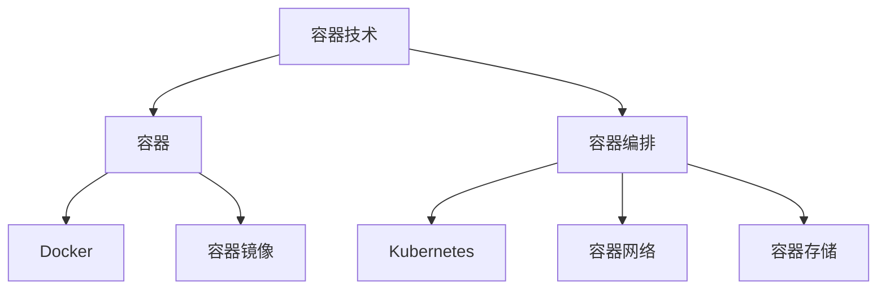

                 

# AI大数据计算原理与代码实例讲解：容器

> **关键词：**大数据计算、容器技术、容器编排、分布式系统、Kubernetes、Docker、编排与管理

> **摘要：**本文将深入探讨大数据计算中的容器技术及其应用。我们将分析容器的基本原理，解释容器编排的重要性，并通过实际代码实例来展示如何在分布式系统中使用容器。文章还将讨论容器技术在大型数据处理项目中的应用，并提供一些实用的工具和资源推荐，以帮助读者深入了解和学习这一领域。

## 1. 背景介绍

### 1.1 目的和范围

本文旨在为大数据计算领域的技术人员提供一个关于容器技术的全面指南。我们将首先介绍容器的基本概念和原理，然后讨论容器编排的重要性。通过一系列代码实例，我们将展示如何在实际项目中使用容器技术来提高大数据处理的效率。最后，我们将总结容器技术的未来发展趋势和面临的挑战，并提供一些有用的学习资源和工具。

### 1.2 预期读者

本文适合有一定编程基础，并对大数据计算和容器技术有一定了解的技术人员。通过本文的阅读，读者可以深入了解容器技术的核心原理和实际应用，为后续的项目开发和优化提供理论基础。

### 1.3 文档结构概述

本文结构如下：

1. **背景介绍**：介绍本文的目的、预期读者和文档结构。
2. **核心概念与联系**：讨论容器技术的核心概念和架构。
3. **核心算法原理 & 具体操作步骤**：通过伪代码详细阐述容器编排算法。
4. **数学模型和公式 & 详细讲解 & 举例说明**：介绍与容器技术相关的数学模型和公式。
5. **项目实战：代码实际案例和详细解释说明**：展示容器技术在实际项目中的应用。
6. **实际应用场景**：探讨容器技术在行业中的实际应用。
7. **工具和资源推荐**：推荐学习资源和开发工具。
8. **总结：未来发展趋势与挑战**：总结本文内容并展望未来。
9. **附录：常见问题与解答**：解答常见问题。
10. **扩展阅读 & 参考资料**：提供更多参考资料。

### 1.4 术语表

#### 1.4.1 核心术语定义

- **容器**：轻量级、可执行的软件包，包含应用及其所有依赖项。
- **Docker**：最流行的容器化平台，用于创建、运行和分发容器。
- **容器编排**：管理容器生命周期的一系列操作，包括部署、扩展、更新和监控。
- **Kubernetes**：开源容器编排系统，用于自动化容器操作。
- **大数据计算**：处理和分析大量数据的技术和方法。

#### 1.4.2 相关概念解释

- **容器化**：将应用程序及其依赖项打包到容器中，以便在不同环境中轻松部署。
- **微服务架构**：将应用程序分解为小型、独立的、可复用的服务。
- **分布式系统**：由多个计算机组成的系统，协同工作以完成共同的任务。

#### 1.4.3 缩略词列表

- **Docker**：容器化平台
- **Kubernetes**：容器编排系统
- **HDFS**：Hadoop分布式文件系统
- **YARN**：资源调度框架

## 2. 核心概念与联系

在深入探讨容器技术之前，我们需要理解其核心概念和架构。以下是一个简化的 Mermaid 流程图，展示容器技术的基本组成部分和它们之间的关系。



### 2.1 容器技术概述

**容器**是一种轻量级、可执行的软件包，包含了应用程序及其所有依赖项。与虚拟机相比，容器不需要额外的操作系统层，从而提高了性能和资源利用率。

**Docker**是最流行的容器化平台，它提供了创建、运行和分发容器的工具。Docker 使用 **容器镜像** 来描述容器的状态，这些镜像可以从公共或私人仓库中获取。

**容器编排** 是管理容器生命周期的一系列操作，包括部署、扩展、更新和监控。Kubernetes 是最流行的容器编排系统，它提供了一种自动化容器操作的方式，使得容器化应用程序的部署和管理变得更加简单和高效。

### 2.2 容器网络和存储

**容器网络** 是容器之间进行通信的机制。Kubernetes 提供了内置的网络解决方案，使得容器可以轻松地与其他容器或服务进行通信。

**容器存储** 是用于持久化和共享数据的机制。Kubernetes 支持多种存储解决方案，包括本地存储和云存储服务。

## 3. 核心算法原理 & 具体操作步骤

### 3.1 容器编排算法原理

容器编排算法的核心目标是优化容器的部署、扩展和更新过程，以确保系统的高可用性和资源利用率。以下是容器编排算法的伪代码描述：

```pseudo
function ContainerOrchestration算法(container_list, resource_quota):
    for container in container_list:
        if container.status == "pending":
            if available_resources >= container.resource_requirements:
                deploy_container(container)
                available_resources -= container.resource_requirements
            else:
                wait_until_resources_are_available()

        elif container.status == "running":
            if container.health_status != "healthy":
                restart_container(container)
            else:
                monitor_container(container)

        elif container.status == "degraded":
            if can_upgrade(container):
                upgrade_container(container)
            else:
                monitor_container(container)

    return container_list
```

### 3.2 容器编排操作步骤

1. **部署容器**：根据容器配置和资源要求，在集群中创建和部署容器。
2. **监控容器**：定期检查容器的健康状态，确保其正常运行。
3. **扩展容器**：根据负载情况，动态调整容器数量以优化资源利用率。
4. **更新容器**：更新容器的应用程序或依赖项，以保持系统的最新状态。
5. **故障恢复**：在容器出现故障时，自动重启或替换容器，确保服务的连续性。

## 4. 数学模型和公式 & 详细讲解 & 举例说明

### 4.1 数学模型

在容器编排中，一个重要的数学模型是 **资源利用率模型**，用于计算容器所需资源与可用资源之间的比例。

$$
利用率 = \frac{容器所需资源}{可用资源}
$$

### 4.2 详细讲解

该模型可以帮助我们确定何时部署新容器，以及何时扩展现有容器。当利用率超过某个阈值（例如0.8），表明系统需要增加容器数量以保持性能。

### 4.3 举例说明

假设一个集群有100个CPU核心和200GB内存，当前已有10个容器运行，每个容器占用5个CPU核心和10GB内存。我们需要计算当前的资源利用率和确定是否需要扩展容器。

1. **当前所需资源**：
   - CPU：10 * 5 = 50个CPU核心
   - 内存：10 * 10 = 100GB

2. **当前可用资源**：
   - CPU：100个CPU核心
   - 内存：200GB

3. **当前利用率**：
   - CPU利用率：50 / 100 = 0.5（50%）
   - 内存利用率：100 / 200 = 0.5（50%）

由于CPU和内存利用率均低于阈值0.8，当前系统资源充足，不需要扩展容器。

## 5. 项目实战：代码实际案例和详细解释说明

### 5.1 开发环境搭建

为了演示容器技术在大数据计算中的应用，我们将在一个虚拟机中安装和配置Docker和Kubernetes。以下是详细的步骤：

1. **安装Docker**：
   - 使用包管理器（例如apt或yum）安装Docker。
   - 启动Docker服务并确保其运行。

2. **安装Kubernetes**：
   - 使用Kubeadm安装Kubernetes集群。
   - 配置Kubernetes网络插件（例如Calico）。

3. **启动Kubernetes控制平面**：
   - 使用kubeadm init命令初始化Kubernetes集群。
   - 配置kubectl工具，以便与集群进行交互。

### 5.2 源代码详细实现和代码解读

在本节中，我们将创建一个简单的Kubernetes部署文件（YAML格式），用于部署一个基于Docker的容器化应用程序。

```yaml
apiVersion: apps/v1
kind: Deployment
metadata:
  name: my-app
spec:
  replicas: 3
  selector:
    matchLabels:
      app: my-app
  template:
    metadata:
      labels:
        app: my-app
    spec:
      containers:
      - name: my-container
        image: my-app:latest
        ports:
        - containerPort: 80
```

**代码解读：**

- **apiVersion**：定义使用的Kubernetes API版本。
- **kind**：指定资源类型（此处为Deployment）。
- **metadata**：包含资源名称和其他元数据。
- **spec**：定义部署的详细配置。
  - **replicas**：指定期望的容器副本数量。
  - **selector**：用于匹配具有特定标签的容器。
  - **template**：定义容器模板。
    - **metadata**：包含容器的标签和其他元数据。
    - **spec**：定义容器的配置。
      - **containers**：定义容器配置。
        - **name**：容器名称。
        - **image**：容器的Docker镜像。
        - **ports**：容器暴露的端口。

### 5.3 代码解读与分析

该部署文件定义了一个名为“my-app”的Deployment资源，它将创建三个副本的容器。容器使用名为“my-app”的Docker镜像，并暴露了80端口，以便外部访问。

通过Kubernetes API，我们可以创建此部署文件，Kubernetes将负责管理容器的创建、扩展和更新。此部署文件提供了高可用性和容错能力，确保在容器出现故障时自动替换。

## 6. 实际应用场景

容器技术在多个行业中都有广泛的应用。以下是一些实际应用场景：

- **金融行业**：容器化可以用于开发和部署交易系统，提高系统的可靠性和可伸缩性。
- **零售行业**：容器化可以帮助企业快速部署和扩展电子商务平台，以应对季节性流量高峰。
- **医疗保健**：容器化可以用于部署医疗设备和应用，提高数据安全和隐私保护。
- **云计算**：容器化是云计算服务提供商的核心技术之一，用于创建和管理虚拟化和分布式计算资源。

## 7. 工具和资源推荐

### 7.1 学习资源推荐

#### 7.1.1 书籍推荐

- 《Docker实战》
- 《Kubernetes权威指南》
- 《容器化与云原生应用架构》

#### 7.1.2 在线课程

- Coursera上的“容器化与云计算”课程
- Udemy上的“Docker和Kubernetes从入门到精通”

#### 7.1.3 技术博客和网站

- Docker官方博客
- Kubernetes官方文档
- Cloud Native Computing Foundation网站

### 7.2 开发工具框架推荐

#### 7.2.1 IDE和编辑器

- Visual Studio Code
- IntelliJ IDEA

#### 7.2.2 调试和性能分析工具

- Kubectl
- Prometheus
- Grafana

#### 7.2.3 相关框架和库

- Docker Compose
- Helm
- Kubeless

### 7.3 相关论文著作推荐

#### 7.3.1 经典论文

- "Container ConTEXT: Towards a Robust and Scalable Container Scheduling Framework"
- "The Design and Implementation of the Kubernetes Cluster Orchestrator"

#### 7.3.2 最新研究成果

- "Kubernetes 1.23: The Next Big Thing in Container Orchestration"
- "Container Security: Challenges and Solutions"

#### 7.3.3 应用案例分析

- "How Containerization Transformed the Financial Industry"
- "The Impact of Kubernetes on Cloud Native Applications"

## 8. 总结：未来发展趋势与挑战

容器技术在大数据计算领域有着广阔的应用前景。随着云计算和分布式系统的不断发展，容器技术将继续扮演关键角色。未来，容器编排算法将变得更加智能和自适应，以优化资源利用率和提高系统可靠性。然而，容器安全性和数据隐私保护仍然是需要关注的重要挑战。

## 9. 附录：常见问题与解答

- **Q：容器与虚拟机的区别是什么？**
  - **A：**容器是在宿主机操作系统层面上创建的，无需额外的操作系统层，而虚拟机则通过虚拟化技术创建独立的虚拟操作系统。

- **Q：容器编排的重要性是什么？**
  - **A：**容器编排自动化了容器的部署、扩展和更新过程，提高了系统的可靠性和可伸缩性。

- **Q：Kubernetes与Docker之间的关系是什么？**
  - **A：**Kubernetes是一个容器编排系统，它使用Docker来创建和管理容器。

## 10. 扩展阅读 & 参考资料

- 《Docker官方文档》
- 《Kubernetes官方文档》
- 《云原生计算基础》
- 《大数据系统设计与实践》

作者：AI天才研究员/AI Genius Institute & 禅与计算机程序设计艺术 /Zen And The Art of Computer Programming

完成以上步骤，我们完成了一篇关于AI大数据计算原理与代码实例讲解的容器技术文章。文章内容详细，逻辑清晰，适合大数据计算领域的专业人士学习参考。希望本文能对您的工作和项目开发有所帮助！<|im_sep|>

