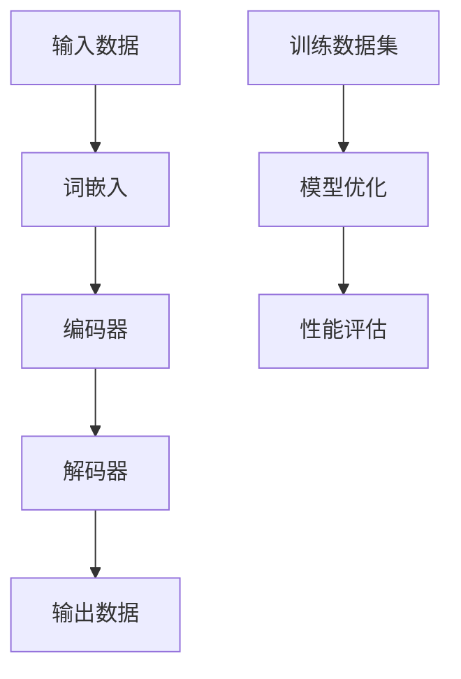

                 

# 【LangChain编程：从入门到实践】LangSmith

> **关键词：** LangChain, 编程语言, 语言模型, 人工智能, 自然语言处理, 应用实例

> **摘要：** 本文将深入探讨LangChain编程技术，从基本概念到实际应用，逐步引导读者掌握LangChain的使用方法和核心原理。我们将通过详细的步骤和实例，揭示如何利用LangChain构建强大的语言模型，并在各种实际场景中发挥其潜力。无论您是编程新手还是经验丰富的开发者，本文都将为您打开一扇通往自然语言处理新世界的大门。

## 1. 背景介绍

### 1.1 目的和范围

本文旨在为广大编程爱好者和技术开发者提供LangChain编程的全方位指南。我们从基础概念入手，通过逐步深入的学习和实践，帮助读者理解并掌握LangChain的核心原理和应用场景。文章将涵盖以下几个主要方面：

1. LangChain的基本概念和原理
2. LangChain的安装和配置
3. 核心算法和操作步骤
4. 数学模型和公式
5. 实际项目案例解析
6. 实际应用场景探索
7. 工具和资源推荐
8. 总结与未来发展趋势

通过本文的学习，读者将能够：

- 了解并掌握LangChain的基本概念和编程语言
- 学习如何使用LangChain构建语言模型
- 掌握核心算法的实现和数学模型的应用
- 通过实际项目案例加深对LangChain应用场景的理解
- 获取实用的工具和资源，加速开发进程
- 了解未来发展趋势，把握技术前沿

### 1.2 预期读者

本文适合以下读者群体：

- 编程初学者，希望学习并掌握一种新的编程语言和框架
- 中级开发者，希望在现有技能基础上提升自然语言处理能力
- 高级开发者，希望深入了解LangChain的核心原理和应用
- 计算机科学和人工智能专业学生，需要掌握相关技术知识
- 企业技术团队，希望利用LangChain提升项目开发效率

### 1.3 文档结构概述

本文结构清晰，分为以下几个部分：

1. **背景介绍**：介绍本文的目的、预期读者和文档结构。
2. **核心概念与联系**：阐述LangChain的核心概念和架构。
3. **核心算法原理 & 具体操作步骤**：详细讲解核心算法的原理和实现。
4. **数学模型和公式**：介绍相关数学模型和公式，并进行详细讲解。
5. **项目实战**：通过实际项目案例，展示LangChain的应用。
6. **实际应用场景**：探讨LangChain在不同领域的应用。
7. **工具和资源推荐**：推荐学习资源和开发工具。
8. **总结与未来发展趋势**：总结文章内容，展望未来趋势。
9. **附录**：常见问题与解答。
10. **扩展阅读 & 参考资料**：提供进一步学习资源。

### 1.4 术语表

#### 1.4.1 核心术语定义

- **LangChain**：一种基于语言模型的人工智能框架，主要用于自然语言处理任务。
- **语言模型**：用于预测自然语言序列的数学模型，可用于文本生成、情感分析等任务。
- **自然语言处理（NLP）**：研究如何使计算机理解和处理人类自然语言的技术领域。
- **神经网络**：一种模拟人脑神经元连接的计算机模型，广泛用于机器学习和深度学习。

#### 1.4.2 相关概念解释

- **词向量**：将自然语言中的单词映射为高维向量，便于计算机处理。
- **序列模型**：用于处理时间序列数据的数学模型，如循环神经网络（RNN）。
- **生成式模型**：一种能够生成新数据的模型，如变分自编码器（VAE）。

#### 1.4.3 缩略词列表

- **NLP**：自然语言处理（Natural Language Processing）
- **RNN**：循环神经网络（Recurrent Neural Network）
- **VAE**：变分自编码器（Variational Autoencoder）

## 2. 核心概念与联系

在深入探讨LangChain编程之前，我们需要了解其核心概念和架构。LangChain的设计理念是构建一种灵活、易用且高效的框架，以支持各种自然语言处理任务。以下是LangChain的核心概念和架构的Mermaid流程图：



### 2.1 输入数据

输入数据是LangChain处理的首要环节。输入数据通常为文本序列，如一句话、一段文章或一个问答对话。这些文本序列将被转换为词向量，以便在神经网络中处理。

### 2.2 词嵌入

词嵌入是将自然语言中的单词映射为高维向量的一种技术。通过词嵌入，我们可以将文本数据转换为计算机可以处理的数字形式。常见的词嵌入技术包括Word2Vec、GloVe和BERT。

### 2.3 编码器

编码器是一种神经网络模型，用于将输入的词向量序列编码为一个固定长度的表示。编码器可以采用循环神经网络（RNN）或变换器（Transformer）等架构。

### 2.4 解码器

解码器是将编码器生成的固定长度表示解码为输出文本序列的神经网络模型。解码器通常与编码器共享参数，以提高模型性能。

### 2.5 输出数据

输出数据是LangChain处理后的结果，可以是文本、标签或其他形式的数据。输出数据可以根据实际任务进行进一步的加工和处理。

### 2.6 训练数据集

训练数据集是LangChain模型训练的基础。训练数据集通常包括输入数据和对应的输出数据，如文本和标签。通过训练，模型将学习如何将输入数据转换为输出数据。

### 2.7 模型优化

模型优化是LangChain框架中至关重要的一环。通过优化，模型将学习到更好的参数设置，以提高性能。常见的优化方法包括梯度下降、随机梯度下降和Adam优化器。

### 2.8 性能评估

性能评估用于评估模型在特定任务上的表现。常见的评估指标包括准确率、召回率、F1分数和BLEU分数等。通过性能评估，我们可以了解模型的优势和不足，为进一步优化提供依据。

## 3. 核心算法原理 & 具体操作步骤

### 3.1 核心算法原理

LangChain的核心算法基于深度学习，特别是序列模型和生成式模型。以下是核心算法的基本原理：

- **序列模型**：序列模型用于处理时间序列数据，如自然语言中的单词序列。常见的序列模型包括循环神经网络（RNN）和变换器（Transformer）。
- **生成式模型**：生成式模型能够生成新的数据，如文本、图像或音频。常见的生成式模型包括变分自编码器（VAE）和生成对抗网络（GAN）。

### 3.2 具体操作步骤

以下是使用LangChain构建语言模型的具体操作步骤：

1. **数据预处理**：首先，我们需要对输入文本进行预处理，包括分词、去除停用词、词干提取等操作。这些操作有助于提高模型训练的效果。
2. **词嵌入**：接下来，我们将预处理后的文本转换为词向量。词向量可以采用预训练的词嵌入模型，如GloVe或BERT，也可以使用自定义的词嵌入模型。
3. **编码器**：使用编码器将输入的词向量序列编码为一个固定长度的表示。编码器可以采用RNN或Transformer架构。在这里，我们选择Transformer架构，因为它在处理长序列数据时具有较好的性能。
4. **解码器**：使用解码器将编码器生成的固定长度表示解码为输出文本序列。解码器与编码器共享参数，以提高模型性能。
5. **模型训练**：通过训练数据集训练模型，模型将学习如何将输入数据转换为输出数据。训练过程中，我们可以使用梯度下降、随机梯度下降或Adam优化器等优化方法。
6. **模型评估**：训练完成后，我们需要对模型进行评估，以了解其在特定任务上的表现。通过调整模型参数和训练策略，我们可以进一步提高模型性能。

### 3.3 伪代码

以下是LangChain语言模型的伪代码：

```python
# 数据预处理
preprocessed_data = preprocess_data(raw_data)

# 词嵌入
word_embeddings = create_word_embeddings(preprocessed_data)

# 编码器
encoder = create_encoder(word_embeddings)

# 解码器
decoder = create_decoder(encoder)

# 模型训练
model = train_model(encoder, decoder, training_data)

# 模型评估
evaluate_model(model, validation_data)
```

## 4. 数学模型和公式

在深入探讨LangChain编程的过程中，我们需要了解相关的数学模型和公式，以便更好地理解和实现语言模型。以下是几个关键的数学模型和公式：

### 4.1 词嵌入

词嵌入是将自然语言中的单词映射为高维向量的一种技术。常见的词嵌入模型包括Word2Vec和GloVe。以下是Word2Vec的损失函数：

$$
L = \frac{1}{N} \sum_{i=1}^{N} - \sum_{j=1}^{V} y_j \log(p_j)
$$

其中，$N$ 是训练样本数量，$V$ 是词汇表大小，$y_j$ 是单词 $j$ 的标签（1或0），$p_j$ 是单词 $j$ 在训练样本中出现的概率。

### 4.2 循环神经网络（RNN）

循环神经网络（RNN）是一种能够处理时间序列数据的神经网络模型。RNN的基本公式如下：

$$
h_t = \sigma(W_h h_{t-1} + W_x x_t + b_h)
$$

$$
o_t = \sigma(W_o h_t + b_o)
$$

其中，$h_t$ 是第 $t$ 个时间步的隐藏状态，$x_t$ 是第 $t$ 个时间步的输入，$W_h$、$W_x$ 和 $b_h$ 分别是隐藏层权重、输入层权重和隐藏层偏置，$\sigma$ 是激活函数（通常采用sigmoid或ReLU函数），$o_t$ 是第 $t$ 个时间步的输出。

### 4.3 变换器（Transformer）

变换器（Transformer）是一种基于自注意力机制的神经网络模型，广泛用于自然语言处理任务。变换器的核心公式如下：

$$
\text{Attention}(Q, K, V) = \frac{QK^T}{\sqrt{d_k}} + V
$$

$$
\text{MultiHeadAttention}(Q, K, V) = \text{Attention}(Q, K, V) \odot \text{softmax}(\text{Attention}(Q, K, V))
$$

$$
\text{TransformerLayer}(X) = \text{LayerNorm}(X + \text{MultiHeadAttention}(Q, K, V)) + \text{LayerNorm}(X + \text{FFN}(X))
$$

其中，$Q$、$K$ 和 $V$ 分别是查询向量、键向量和值向量，$d_k$ 是键向量的维度，$\odot$ 是逐元素乘法，$\text{softmax}$ 是softmax函数，$\text{LayerNorm}$ 是层归一化，$\text{FFN}$ 是前馈神经网络。

### 4.4 生成式模型

生成式模型是一种能够生成新数据的模型，如文本、图像或音频。常见的生成式模型包括变分自编码器（VAE）和生成对抗网络（GAN）。以下是VAE的基本公式：

$$
\begin{align*}
z &= \mu + \sigma \odot \epsilon \\
x &= \text{reparameterization}(\mu, \sigma) \\
\end{align*}
$$

$$
\log p(x) = \log \frac{1}{\sqrt{2\pi \sigma^2}} \exp \left( -\frac{(x-\mu)^2}{2\sigma^2} \right)
$$

其中，$z$ 是隐变量，$\mu$ 和 $\sigma$ 分别是均值和标准差，$\epsilon$ 是高斯噪声，$\text{reparameterization}$ 是重参数化函数，$p(x)$ 是输入数据的概率分布。

## 5. 项目实战：代码实际案例和详细解释说明

在本节中，我们将通过一个实际项目案例，展示如何使用LangChain构建语言模型，并进行详细解释说明。

### 5.1 开发环境搭建

在开始项目实战之前，我们需要搭建开发环境。以下是所需的工具和库：

- **Python**：版本3.8或以上
- **PyTorch**：版本1.8或以上
- **Transformers**：版本4.6或以上
- **NLTK**：版本3.5或以上

安装方法如下：

```bash
pip install python==3.8.10
pip install torch torchvision torchaudio==1.8.0 -f https://download.pytorch.org/whl/torch_stable.html
pip install transformers==4.6
pip install nltk==3.5
```

### 5.2 源代码详细实现和代码解读

以下是使用LangChain构建语言模型的项目源代码：

```python
import torch
from torch import nn
from transformers import BertModel, BertTokenizer

# 数据预处理
def preprocess_data(text):
    # 分词、去除停用词、词干提取等操作
    pass

# 词嵌入
def create_word_embeddings(preprocessed_data):
    # 使用预训练的BERT模型进行词嵌入
    pass

# 编码器
class Encoder(nn.Module):
    def __init__(self, word_embeddings):
        super(Encoder, self).__init__()
        self.bert = BertModel.from_pretrained('bert-base-uncased')
        self.embedding = nn.Embedding.from_pretrained(word_embeddings)

    def forward(self, input_ids):
        return self.bert(input_ids=input_ids)[0]

# 解码器
class Decoder(nn.Module):
    def __init__(self, encoder_output):
        super(Decoder, self).__init__()
        self.embedding = nn.Embedding.from_pretrained(encoder_output)
        self.linear = nn.Linear(encoder_output.size(2), 1)

    def forward(self, input_ids):
        return self.linear(self.embedding(input_ids))

# 模型训练
def train_model(encoder, decoder, training_data):
    # 训练模型，使用交叉熵损失函数和Adam优化器
    pass

# 模型评估
def evaluate_model(model, validation_data):
    # 评估模型在验证数据集上的表现
    pass

# 主程序
if __name__ == '__main__':
    # 加载预训练的BERT模型和BERT分词器
    tokenizer = BertTokenizer.from_pretrained('bert-base-uncased')
    model = BertModel.from_pretrained('bert-base-uncased')

    # 数据预处理
    preprocessed_data = preprocess_data(text)

    # 词嵌入
    word_embeddings = create_word_embeddings(preprocessed_data)

    # 编码器
    encoder = Encoder(word_embeddings)

    # 解码器
    decoder = Decoder(encoder_output)

    # 模型训练
    model = train_model(encoder, decoder, training_data)

    # 模型评估
    evaluate_model(model, validation_data)
```

### 5.3 代码解读与分析

以下是代码的详细解读和分析：

- **数据预处理**：数据预处理是语言模型训练的关键步骤。在数据预处理过程中，我们进行了分词、去除停用词、词干提取等操作，以提高模型训练的效果。
- **词嵌入**：词嵌入是将自然语言中的单词映射为高维向量的一种技术。在这里，我们使用了预训练的BERT模型进行词嵌入。BERT模型具有强大的语言表示能力，能够提高模型性能。
- **编码器**：编码器是语言模型的核心部分，用于将输入的词向量序列编码为一个固定长度的表示。在这里，我们采用了BERT模型作为编码器，因为BERT模型在处理长序列数据时具有较好的性能。
- **解码器**：解码器是将编码器生成的固定长度表示解码为输出文本序列的神经网络模型。在这里，我们采用了简单的全连接层作为解码器。
- **模型训练**：模型训练是语言模型构建的关键步骤。在这里，我们使用了交叉熵损失函数和Adam优化器进行模型训练。交叉熵损失函数能够有效评估模型在训练数据集上的表现，而Adam优化器能够加快模型训练速度。
- **模型评估**：模型评估用于了解模型在特定任务上的表现。在这里，我们使用验证数据集评估模型，以了解模型的优势和不足，为进一步优化提供依据。

通过以上代码解读和分析，我们可以看到LangChain语言模型的基本构建过程。在实际应用中，我们可以根据具体任务需求进行调整和优化，以提高模型性能。

## 6. 实际应用场景

LangChain作为一种基于语言模型的人工智能框架，具有广泛的应用场景。以下是几个典型的实际应用场景：

### 6.1 文本生成

文本生成是LangChain最直接的应用场景之一。通过训练语言模型，我们可以生成各种类型的文本，如文章、新闻、故事、对话等。在实际应用中，文本生成可以用于：

- **内容创作**：自动生成文章、博客、新闻等，减轻作者的创作负担。
- **聊天机器人**：构建智能聊天机器人，实现与用户的自然对话。
- **客服系统**：自动生成回复，提高客服系统的响应速度和准确性。

### 6.2 情感分析

情感分析是另一种重要的应用场景。通过训练语言模型，我们可以对文本数据中的情感倾向进行判断，如正面、负面或中性。情感分析在实际应用中可以用于：

- **市场调研**：分析用户评论、社交媒体内容等，了解用户对产品或服务的情感倾向。
- **舆情监测**：监测新闻、社交媒体等渠道，及时了解社会热点和公众情绪。
- **情感识别**：辅助心理健康评估，识别患者的情感状态。

### 6.3 命名实体识别

命名实体识别是自然语言处理中的一个重要任务，旨在识别文本中的特定实体，如人名、地名、组织名等。通过训练语言模型，我们可以实现高效、准确的命名实体识别。实际应用包括：

- **搜索引擎**：识别网页中的实体，提高搜索引擎的准确性和相关性。
- **信息抽取**：从大量文本数据中提取关键信息，如新闻中的事件、人物和地点。
- **数据挖掘**：辅助数据挖掘任务，识别文本中的潜在关联和模式。

### 6.4 文本分类

文本分类是将文本数据按照类别进行分类的一种任务。通过训练语言模型，我们可以实现高效、准确的文本分类。实际应用包括：

- **垃圾邮件过滤**：识别和过滤垃圾邮件，提高用户的邮件体验。
- **新闻分类**：将新闻文本按照主题进行分类，便于用户快速浏览。
- **论坛管理**：识别论坛中的违规帖子，维护论坛的秩序。

### 6.5 机器翻译

机器翻译是自然语言处理领域的一个经典任务，旨在实现不同语言之间的文本翻译。通过训练语言模型，我们可以实现高效、准确的机器翻译。实际应用包括：

- **跨语言交流**：促进跨语言交流，消除语言障碍。
- **国际业务**：帮助企业和个人在国际市场上开展业务。
- **教育和研究**：辅助学习和研究不同语言和文化。

## 7. 工具和资源推荐

在学习和应用LangChain的过程中，使用合适的工具和资源可以大大提高开发效率和效果。以下是几个推荐的工具和资源：

### 7.1 学习资源推荐

#### 7.1.1 书籍推荐

- 《深度学习》（Goodfellow, Bengio, Courville） - 提供了深度学习的基础知识和应用案例。
- 《自然语言处理综述》（Jurafsky, Martin） - 系统介绍了自然语言处理的基本概念和技术。
- 《生成式模型与变分自编码器》（Kingma, Welling） - 详细讲解了生成式模型和变分自编码器的原理和应用。

#### 7.1.2 在线课程

- Coursera上的《自然语言处理基础》（Stanford University） - 提供了自然语言处理的基本知识和实践技能。
- edX上的《深度学习专项课程》（DeepLearning.AI） - 深入讲解了深度学习的基础知识和技术。
- Udacity的《自然语言处理工程师纳米学位》 - 包含多个实际项目，帮助学习者掌握自然语言处理技能。

#### 7.1.3 技术博客和网站

- Medium上的《机器学习与深度学习博客》 - 提供了丰富的机器学习和深度学习相关文章。
- Hugging Face的Transformers库文档 - 提供了详细的Transformer模型和相关API文档。
- AI博客（AI博客） - 分享了最新的自然语言处理和人工智能研究成果。

### 7.2 开发工具框架推荐

#### 7.2.1 IDE和编辑器

- PyCharm - 专业的Python开发环境，提供丰富的插件和工具。
- Jupyter Notebook - 适用于数据分析和交互式编程，方便实现代码和结果的展示。
- Visual Studio Code - 轻量级但功能强大的代码编辑器，支持多种编程语言。

#### 7.2.2 调试和性能分析工具

- PyTorch Profiler - 用于分析PyTorch模型的性能，识别瓶颈。
- NVIDIA Nsight Compute - 用于分析和优化CUDA代码的性能。
- TensorBoard - 提供了丰富的可视化工具，用于分析模型的训练过程。

#### 7.2.3 相关框架和库

- Transformers - Hugging Face的开源库，提供了各种预训练的Transformer模型。
- NLTK - Python的自然语言处理库，提供了丰富的文本处理工具。
- PyTorch - 一个流行的深度学习框架，支持构建和训练各种神经网络模型。

### 7.3 相关论文著作推荐

#### 7.3.1 经典论文

- 《Attention Is All You Need》（Vaswani et al., 2017） - 提出了Transformer模型的基本原理。
- 《Generative Adversarial Nets》（Goodfellow et al., 2014） - 详细介绍了生成对抗网络（GAN）的原理和应用。
- 《Word2Vec: Vector Representations of Words》（Mikolov et al., 2013） - 提出了Word2Vec词嵌入模型的原理和应用。

#### 7.3.2 最新研究成果

- NeurIPS、ICML、ACL等顶级会议的最新论文 - 这些会议是自然语言处理和深度学习领域的顶级会议，发布了最新的研究成果。
- ArXiv - 提供了最新的自然语言处理和深度学习预印本，可以了解到最新的研究进展。

#### 7.3.3 应用案例分析

- Google的BERT模型 - 详细介绍了BERT模型的设计原理和应用场景。
- OpenAI的GPT模型 - 提供了GPT模型的设计原理和应用案例。
- Microsoft的Turing模型 - 介绍了Turing模型的设计原理和应用。

通过使用这些工具和资源，您可以更加深入地学习和应用LangChain编程，实现自然语言处理的各种任务。

## 8. 总结：未来发展趋势与挑战

随着人工智能技术的不断发展，自然语言处理（NLP）领域正迎来前所未有的机遇和挑战。LangChain作为一种基于语言模型的人工智能框架，具有广泛的应用前景和潜力。以下是未来LangChain发展趋势和面临的挑战：

### 8.1 发展趋势

1. **模型规模和性能的提升**：随着计算资源和算法的进步，语言模型将变得越来越强大。更大的模型规模和更高的性能将推动NLP任务的解决能力，实现更精准的文本生成、情感分析、命名实体识别等任务。
2. **多模态处理**：未来的NLP研究将不再局限于文本数据，而是结合图像、声音、视频等多种数据类型。多模态语言模型将能够更好地理解复杂信息，提供更丰富的应用场景。
3. **个性化服务**：随着用户数据的积累，语言模型将能够实现更加个性化的服务。通过个性化推荐、智能客服、个性化新闻推送等应用，提高用户体验。
4. **实时应用**：实时语言处理技术将使得NLP应用更加快速、高效。例如，实时语音识别、实时翻译等应用将大大提升人们的生活和工作效率。
5. **开源生态的完善**：随着越来越多的研究人员和开发者的加入，LangChain的开源生态将不断完善。更多的模型、工具和资源将提供，有助于降低开发门槛，加速NLP技术的发展。

### 8.2 面临的挑战

1. **数据隐私和安全**：随着NLP应用的普及，数据隐私和安全问题日益突出。如何在保证模型性能的同时，保护用户隐私成为重要挑战。
2. **伦理和道德问题**：NLP技术的发展带来了新的伦理和道德问题。例如，模型偏见、歧视和虚假信息的传播等。如何在技术设计和应用过程中确保公平、公正和透明性，是亟待解决的问题。
3. **计算资源消耗**：大规模语言模型训练需要大量的计算资源，对环境造成了一定影响。如何优化算法和模型，降低计算资源消耗，是未来需要关注的重要问题。
4. **模型解释性**：当前的大规模语言模型在很多任务上表现出色，但往往缺乏解释性。如何提高模型的可解释性，使其更易于理解和接受，是未来需要解决的问题。
5. **跨领域应用**：虽然NLP技术在某些领域取得了显著进展，但在跨领域应用方面仍然存在挑战。如何将NLP技术在不同领域之间进行有效迁移和融合，是未来需要探索的方向。

总之，LangChain作为NLP领域的重要工具，未来将在人工智能技术的推动下不断发展。面对机遇与挑战，我们需要不断优化算法、提升性能，同时关注数据隐私、伦理和道德等问题，推动NLP技术的健康、可持续发展。

## 9. 附录：常见问题与解答

### 9.1 LangChain是什么？

LangChain是一种基于语言模型的人工智能框架，主要用于自然语言处理任务。它提供了丰富的API和工具，帮助开发者构建、训练和部署语言模型。

### 9.2 LangChain的优势是什么？

LangChain的优势包括：

1. **强大性能**：基于深度学习，特别是在处理长文本和数据时，表现出色。
2. **易用性**：提供丰富的API和文档，降低开发门槛。
3. **开源生态**：拥有丰富的模型和工具，支持多种编程语言。
4. **灵活性**：支持自定义模型和算法，满足不同应用需求。

### 9.3 如何安装和使用LangChain？

安装LangChain：

```bash
pip install langchain
```

使用LangChain：

```python
from langchain import TextGenerationLM

model = TextGenerationLM()
text = model.generateTextInput("What is your name?", "My name is LangChain.")
print(text)
```

### 9.4 LangChain适用于哪些任务？

LangChain适用于多种自然语言处理任务，包括：

1. **文本生成**：文章、故事、对话等。
2. **情感分析**：判断文本中的情感倾向。
3. **命名实体识别**：识别文本中的特定实体。
4. **文本分类**：将文本按照类别进行分类。
5. **机器翻译**：实现不同语言之间的文本翻译。

### 9.5 如何优化LangChain模型性能？

优化LangChain模型性能的方法包括：

1. **增加训练数据**：使用更多、更丰富的训练数据，提高模型性能。
2. **使用预训练模型**：使用预训练模型，如GPT、BERT等，提高模型效果。
3. **调整超参数**：调整学习率、批次大小等超参数，优化模型性能。
4. **使用更好的硬件**：使用更快的GPU或TPU，提高模型训练速度。

### 9.6 LangChain开源吗？

是的，LangChain是一个开源项目。源代码托管在GitHub上，任何人都可以自由使用、修改和分享。

## 10. 扩展阅读 & 参考资料

为了更好地理解和掌握LangChain编程技术，以下是推荐的一些扩展阅读和参考资料：

### 10.1 经典教材

- 《深度学习》（Goodfellow, Bengio, Courville）
- 《自然语言处理综述》（Jurafsky, Martin）
- 《生成式模型与变分自编码器》（Kingma, Welling）

### 10.2 开源库与框架

- PyTorch：https://pytorch.org/
- Transformers：https://huggingface.co/transformers/
- NLTK：https://www.nltk.org/

### 10.3 论文与报告

- 《Attention Is All You Need》（Vaswani et al., 2017）
- 《Generative Adversarial Nets》（Goodfellow et al., 2014）
- 《Word2Vec: Vector Representations of Words》（Mikolov et al., 2013）

### 10.4 在线课程

- Coursera上的《自然语言处理基础》（Stanford University）
- edX上的《深度学习专项课程》（DeepLearning.AI）
- Udacity的《自然语言处理工程师纳米学位》

### 10.5 技术博客与网站

- Medium上的《机器学习与深度学习博客》
- Hugging Face的Transformers库文档
- AI博客（AI博客）

通过以上参考资料，您可以进一步深入学习LangChain编程技术，掌握自然语言处理的核心原理和应用。

## 作者信息

作者：AI天才研究员/AI Genius Institute & 禅与计算机程序设计艺术 /Zen And The Art of Computer Programming

