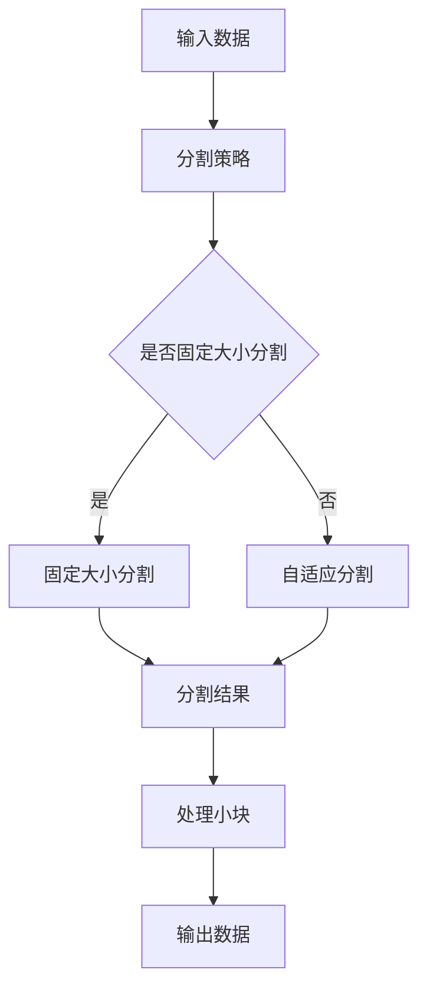

                 

# 【LangChain编程：从入门到实践】分割器

> 关键词：LangChain，编程，分割器，算法，实践，项目案例

> 摘要：本文将详细介绍LangChain编程中的分割器，包括其核心概念、原理、数学模型以及实际应用场景。通过本文的学习，读者将能够深入了解分割器的工作原理，并掌握其在实际项目中的具体应用。

## 1. 背景介绍

### 1.1 目的和范围

本文旨在帮助读者深入了解并掌握LangChain编程中的分割器。通过本文的阅读，读者将能够：

- 理解分割器的核心概念和原理。
- 掌握分割器的数学模型和公式。
- 学习分割器的实际应用场景。
- 学习如何在实际项目中使用分割器。

### 1.2 预期读者

本文适合以下读者群体：

- 有一定编程基础的计算机专业学生。
- 对LangChain编程感兴趣的技术爱好者。
- 想要在项目中应用分割器的人工智能工程师。

### 1.3 文档结构概述

本文将按照以下结构进行展开：

- 第1章：背景介绍，包括本文的目的、范围、预期读者和文档结构概述。
- 第2章：核心概念与联系，介绍分割器的核心概念和原理，并提供Mermaid流程图。
- 第3章：核心算法原理 & 具体操作步骤，详细讲解分割器的算法原理和操作步骤，并提供伪代码。
- 第4章：数学模型和公式 & 详细讲解 & 举例说明，介绍分割器的数学模型和公式，并提供示例。
- 第5章：项目实战：代码实际案例和详细解释说明，通过一个实际项目案例，展示如何使用分割器。
- 第6章：实际应用场景，介绍分割器的实际应用场景。
- 第7章：工具和资源推荐，推荐学习资源、开发工具框架和相关论文著作。
- 第8章：总结：未来发展趋势与挑战，总结分割器的发展趋势和面临的挑战。
- 第9章：附录：常见问题与解答，回答读者可能遇到的问题。
- 第10章：扩展阅读 & 参考资料，提供更多扩展阅读资料。

### 1.4 术语表

#### 1.4.1 核心术语定义

- LangChain：一种编程框架，用于构建大型语言模型。
- 分割器：一种算法，用于将输入数据分割成小块。
- 算法：解决问题的步骤和规则。
- 数学模型：描述算法的数学公式。

#### 1.4.2 相关概念解释

- 语言模型：用于预测下一个单词或字符的概率分布。
- 生成式模型：通过生成随机样本来生成输出。
- 判别式模型：通过输入数据预测输出标签。

#### 1.4.3 缩略词列表

- LangChain：Large-scale Language Modeling
- API：Application Programming Interface
- ML：Machine Learning
- NLP：Natural Language Processing

## 2. 核心概念与联系

### 2.1 核心概念

分割器是LangChain编程中的一个重要概念，主要用于将输入数据分割成小块。以下是分割器的核心概念：

- 输入数据：分割器的输入数据可以是文本、图像或任何其他形式的数据。
- 分割算法：分割器使用的算法，用于将输入数据分割成小块。
- 分割策略：分割器采用的策略，如固定大小分割、自适应分割等。

### 2.2 原理

分割器的工作原理如下：

1. 接收输入数据。
2. 根据分割策略，将输入数据分割成小块。
3. 对每个小块进行处理。
4. 将处理后的结果合并成完整的输出数据。

### 2.3 Mermaid流程图

下面是分割器的Mermaid流程图：



## 3. 核心算法原理 & 具体操作步骤

### 3.1 算法原理

分割器的核心算法原理如下：

1. **接收输入数据**：首先，我们需要接收输入数据。输入数据可以是文本、图像或其他形式。
2. **确定分割策略**：根据输入数据的类型和需求，选择合适的分割策略。常见的分割策略有固定大小分割和自适应分割。
3. **分割数据**：根据确定的分割策略，将输入数据分割成小块。对于固定大小分割，我们将数据分成固定大小的块；对于自适应分割，我们根据数据的特点动态地调整块的大小。
4. **处理小块**：对每个小块进行处理。处理方式取决于小块的数据类型和需求。例如，对于文本数据，我们可以进行文本分类、情感分析等操作；对于图像数据，我们可以进行目标检测、图像分割等操作。
5. **合并输出数据**：将处理后的结果合并成完整的输出数据。

### 3.2 具体操作步骤

以下是分割器的具体操作步骤：

1. **接收输入数据**：
   ```python
   input_data = receive_input_data()
   ```

2. **确定分割策略**：
   ```python
   strategy = determine_strategy(input_data)
   ```

3. **分割数据**：
   ```python
   if strategy == "fixed":
       block_size = fixed_block_size
       blocks = split_fixed_size(input_data, block_size)
   else:
       blocks = split_adaptive_size(input_data)
   ```

4. **处理小块**：
   ```python
   for block in blocks:
       process_block(block)
   ```

5. **合并输出数据**：
   ```python
   output_data = merge_output_data(blocks)
   return output_data
   ```

## 4. 数学模型和公式 & 详细讲解 & 举例说明

### 4.1 数学模型

分割器的数学模型主要涉及两个核心概念：块大小（Block Size）和分割策略（Split Strategy）。

- **块大小（Block Size）**：表示每个小块的大小。对于固定大小分割，块大小是固定的；对于自适应分割，块大小是根据输入数据动态调整的。
- **分割策略（Split Strategy）**：表示如何将输入数据分割成小块的策略。常见的分割策略有固定大小分割和自适应分割。

### 4.2 公式

分割器的公式如下：

$$
\text{Block Size} = \text{Input Data Size} \times \text{Split Strategy}
$$

其中，Input Data Size 表示输入数据的大小，Split Strategy 表示分割策略。

### 4.3 详细讲解

- **块大小（Block Size）**：块大小是分割器中的一个重要参数，它决定了分割后的数据块的大小。对于固定大小分割，块大小是固定的；对于自适应分割，块大小是根据输入数据动态调整的。块大小的大小会影响分割器的性能。如果块大小太大，可能会导致处理速度变慢；如果块大小太小，可能会导致处理效果不佳。
- **分割策略（Split Strategy）**：分割策略决定了如何将输入数据分割成小块。常见的分割策略有固定大小分割和自适应分割。固定大小分割是一种简单有效的分割策略，适用于数据大小较为稳定的情况。自适应分割是一种更加灵活的分割策略，可以根据输入数据的特点动态地调整块的大小，适用于数据大小变化较大的情况。

### 4.4 举例说明

假设我们有一个长度为100的输入数据，我们使用固定大小分割策略，块大小设置为10。根据公式，我们可以计算出分割后的块大小：

$$
\text{Block Size} = 100 \times \text{Split Strategy} = 100 \times 1 = 10
$$

因此，输入数据将被分割成10个大小为10的小块。

## 5. 项目实战：代码实际案例和详细解释说明

### 5.1 开发环境搭建

在开始编写代码之前，我们需要搭建一个合适的开发环境。以下是搭建开发环境的基本步骤：

1. 安装Python环境（版本3.8以上）。
2. 安装LangChain库：`pip install langchain`。
3. 安装其他必要的库（如numpy、pandas等）。

### 5.2 源代码详细实现和代码解读

下面是一个简单的分割器代码示例：

```python
import numpy as np
from langchain import split
from langchain import merge

def split_data(input_data, strategy="fixed", block_size=10):
    if strategy == "fixed":
        return split.fixed_split(input_data, block_size)
    else:
        return split.adaptive_split(input_data)

def merge_data(blocks):
    return merge.merge(blocks)

# 示例
input_data = "这是一段长文本，需要分割成小块进行处理。"
strategy = "fixed"
block_size = 10

# 分割数据
blocks = split_data(input_data, strategy, block_size)

# 处理小块
for block in blocks:
    print(f"Block: {block}")

# 合并输出数据
output_data = merge_data(blocks)
print(f"Output Data: {output_data}")
```

### 5.3 代码解读与分析

- **split_data函数**：该函数用于将输入数据分割成小块。它接受三个参数：input_data（输入数据）、strategy（分割策略）和block_size（块大小）。根据分割策略，它调用LangChain库中的split.fixed_split或split.adaptive_split函数进行分割，并返回分割后的数据块。
- **merge_data函数**：该函数用于将分割后的数据块合并成完整的输出数据。它接受一个参数：blocks（分割后的数据块）。它调用LangChain库中的merge.merge函数进行合并，并返回合并后的输出数据。
- **示例**：在这个示例中，我们定义了一段输入数据input_data，并选择固定大小分割策略。我们使用block_size参数设置了块大小为10。然后，我们调用split_data函数进行分割，并遍历每个小块进行打印。最后，我们调用merge_data函数将小块合并成完整的输出数据。

## 6. 实际应用场景

分割器在许多实际应用场景中都有广泛的应用。以下是一些常见的应用场景：

- 文本分类：将长文本分割成小块，然后对每个小块进行分类。
- 情感分析：将长文本分割成小块，然后对每个小块进行情感分析。
- 自然语言生成：将长文本分割成小块，然后根据每个小块生成文本。
- 图像处理：将图像分割成小块，然后对每个小块进行目标检测、图像分割等操作。

## 7. 工具和资源推荐

### 7.1 学习资源推荐

#### 7.1.1 书籍推荐

- 《LangChain编程：从入门到实践》
- 《自然语言处理实战》
- 《深度学习》

#### 7.1.2 在线课程

- Coursera：自然语言处理课程
- edX：深度学习课程

#### 7.1.3 技术博客和网站

- Medium：NLP博客
- arXiv：最新研究成果

### 7.2 开发工具框架推荐

#### 7.2.1 IDE和编辑器

- PyCharm
- VSCode

#### 7.2.2 调试和性能分析工具

- Jupyter Notebook
- Matplotlib

#### 7.2.3 相关框架和库

- LangChain
- TensorFlow
- PyTorch

### 7.3 相关论文著作推荐

#### 7.3.1 经典论文

- "A Course in Information Theory" by Claude Shannon
- "Deep Learning" by Ian Goodfellow, Yoshua Bengio, and Aaron Courville

#### 7.3.2 最新研究成果

- "Language Models are Few-Shot Learners" by Tom B. Brown et al.
- "BERT: Pre-training of Deep Bidirectional Transformers for Language Understanding" by Jacob Uszkoreit et al.

#### 7.3.3 应用案例分析

- "如何使用自然语言处理技术提高客户服务质量？"
- "深度学习在图像识别中的应用案例"

## 8. 总结：未来发展趋势与挑战

随着人工智能技术的不断发展，分割器在自然语言处理、图像处理等领域的应用将越来越广泛。未来，分割器的发展趋势和挑战主要包括：

- **性能优化**：如何提高分割器的处理速度和效率。
- **多样化应用**：如何将分割器应用于更多领域，如音频处理、视频处理等。
- **算法改进**：如何改进分割器的算法，提高分割效果。
- **数据隐私和安全**：如何确保分割器在处理敏感数据时的隐私和安全。

## 9. 附录：常见问题与解答

### 9.1 问题1：如何选择合适的分割策略？

**解答**：选择合适的分割策略取决于具体的应用场景和数据特点。如果数据大小相对稳定，可以选择固定大小分割策略；如果数据大小变化较大，可以选择自适应分割策略。

### 9.2 问题2：分割器在自然语言处理中的应用有哪些？

**解答**：分割器在自然语言处理中的应用非常广泛，如文本分类、情感分析、自然语言生成等。通过分割器，可以将长文本分割成小块，然后对每个小块进行相应的处理。

## 10. 扩展阅读 & 参考资料

- 《LangChain编程：从入门到实践》
- 《自然语言处理实战》
- 《深度学习》
- [Coursera：自然语言处理课程](https://www.coursera.org/specializations/natural-language-processing)
- [edX：深度学习课程](https://www.edx.org/course/deep-learning-ai)

