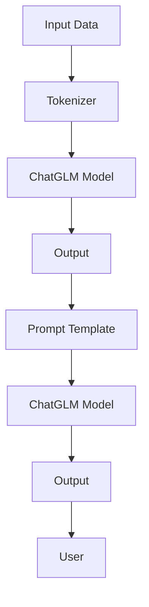

                 

# 【LangChain编程：从入门到实践】提示模板组件

> **关键词：** LangChain、提示模板、编程、Python、AI、聊天机器人、数据处理

> **摘要：** 本文将带领读者深入了解LangChain编程中的提示模板组件，从基础概念到实践应用，提供详细的操作步骤和代码示例，帮助开发者掌握这项技术，并能够灵活运用于实际项目中。

## 1. 背景介绍

### 1.1 目的和范围

本文旨在帮助开发者掌握LangChain中的提示模板组件，这是一项在人工智能领域具有重要应用的技术。通过本文的讲解，读者将能够：

- 理解提示模板的概念及其在AI编程中的重要性。
- 掌握提示模板的编写和使用方法。
- 通过实际案例，学会如何将提示模板应用于聊天机器人、数据处理等场景。

### 1.2 预期读者

本文适合以下读者群体：

- 对人工智能编程有初步了解的开发者。
- 想要学习并掌握LangChain编程的工程师。
- 对构建智能对话系统和数据处理系统有兴趣的读者。

### 1.3 文档结构概述

本文将分为以下几部分：

- **背景介绍**：介绍本文的目的和读者对象，以及文档的结构。
- **核心概念与联系**：讲解LangChain和提示模板的核心概念，并提供流程图。
- **核心算法原理 & 具体操作步骤**：详细阐述提示模板的编写和使用方法。
- **数学模型和公式 & 详细讲解 & 举例说明**：介绍相关的数学模型和公式，并通过实例进行说明。
- **项目实战：代码实际案例和详细解释说明**：通过实战案例展示提示模板的应用。
- **实际应用场景**：讨论提示模板在不同场景下的应用。
- **工具和资源推荐**：推荐学习资源、开发工具和论文著作。
- **总结：未来发展趋势与挑战**：对未来的发展趋势和挑战进行展望。
- **附录：常见问题与解答**：提供常见问题的解答。
- **扩展阅读 & 参考资料**：列出相关的扩展阅读资料。

### 1.4 术语表

#### 1.4.1 核心术语定义

- **LangChain**：一种基于Python的AI编程框架，用于构建聊天机器人、数据处理系统等。
- **提示模板**：一种用于指导AI模型进行任务处理的指导性框架。
- **数据处理**：对大量数据进行清洗、转换和分析的过程。

#### 1.4.2 相关概念解释

- **AI模型**：用于执行特定任务的机器学习模型。
- **聊天机器人**：一种能够模拟人类对话的计算机程序。

#### 1.4.3 缩略词列表

- **AI**：人工智能
- **Python**：一种流行的编程语言

## 2. 核心概念与联系

在介绍提示模板组件之前，我们需要先了解LangChain的基本概念和架构。下面是一个简单的Mermaid流程图，展示了LangChain的核心组件和提示模板的位置。



### 2.1 LangChain架构

- **Input Data**：输入数据，可以是文本、图像或其他格式。
- **Tokenizer**：分词器，将输入数据分割成更小的部分，如单词或子词。
- **ChatGLM Model**：预训练的语言模型，用于生成响应。
- **Output**：模型生成的输出，可以是文本、图像等。
- **Prompt Template**：提示模板，用于指导模型生成更符合预期的输出。

### 2.2 提示模板

提示模板是一种特殊的文本结构，用于向模型提供关于任务目标和上下文信息。通过精心设计的提示模板，我们可以引导模型生成更加准确和有用的输出。

提示模板的一般形式如下：

```python
{
  "role": "user",
  "content": "这里写用户输入的文本"
}
```

其中，`role`表示用户或系统角色，`content`表示用户输入的文本内容。

## 3. 核心算法原理 & 具体操作步骤

### 3.1 提示模板的编写

编写一个有效的提示模板需要考虑以下要素：

- **角色定义**：明确指定用户或系统的角色，有助于模型理解任务的目标。
- **上下文信息**：提供与任务相关的背景信息，帮助模型生成更准确的输出。
- **任务指令**：明确指示模型需要执行的任务，如问答、文本生成等。

下面是一个简单的例子：

```python
{
  "role": "user",
  "content": "请根据以下信息回答问题：\n\n我是一个AI助手，现在需要回答关于计算机编程的问题。\n\n问题：什么是Python编程语言的主要特点？"
}
```

### 3.2 提示模板的使用

使用提示模板的方法如下：

1. 导入LangChain库。

```python
from langchain import PromptTemplate
```

2. 创建一个PromptTemplate对象。

```python
prompt = PromptTemplate(
    input_variables=["role", "content"],
    template="我是{{ role }}，现在需要处理以下信息：\n\n{{ content }}"
)
```

3. 使用PromptTemplate对象生成提示文本。

```python
prompt.format(role="用户", content="这里写用户输入的文本")
```

4. 将生成的提示文本传递给AI模型进行后续处理。

```python
chatglm_model = ChatGLMModel()
output = chatglm_model.predict(prompt)
```

### 3.3 伪代码示例

下面是一个伪代码示例，展示了如何使用提示模板与AI模型进行交互。

```python
# 导入LangChain库
import langchain

# 创建PromptTemplate对象
prompt_template = langchain.PromptTemplate(
    input_variables=["role", "content"],
    template="我是{{ role }}，现在需要处理以下信息：\n\n{{ content }}"
)

# 使用PromptTemplate生成提示文本
prompt_text = prompt_template.format(role="用户", content="这里写用户输入的文本")

# 传递提示文本给AI模型
output = ai_model.predict(prompt_text)

# 输出结果
print(output)
```

## 4. 数学模型和公式 & 详细讲解 & 举例说明

在LangChain中，提示模板的编写涉及到自然语言处理中的数学模型。以下是一些常用的数学模型和公式，以及它们在提示模板中的应用。

### 4.1 自然语言处理中的数学模型

- **词嵌入（Word Embedding）**：将单词映射到高维空间中的向量表示。
- **循环神经网络（RNN）**：一种用于处理序列数据的神经网络。
- **Transformer模型**：一种基于注意力机制的神经网络架构，广泛应用于自然语言处理任务。

### 4.2 提示模板中的数学公式

在提示模板中，我们可以使用以下公式来指导AI模型生成输出：

- **上下文信息公式**：`C = w1 \* x1 + w2 \* x2 + ... + w_n \* x_n`
  - 其中，\(C\) 表示上下文信息，\(w1, w2, ..., w_n\) 表示权重，\(x1, x2, ..., x_n\) 表示输入数据。
- **任务指令公式**：`T = f(C)`
  - 其中，\(T\) 表示任务指令，\(f\) 表示函数，通常是一个神经网络模型。

### 4.3 举例说明

假设我们有一个关于天气查询的任务，可以使用以下提示模板：

```python
{
  "role": "用户",
  "content": "请根据以下信息回答问题：\n\n当前日期：2023年3月10日\n当前天气：晴朗\n请提供未来七天的天气预报。"
}
```

在这个例子中，我们可以使用词嵌入将输入数据转换为向量表示，并使用循环神经网络或Transformer模型生成天气预报。

## 5. 项目实战：代码实际案例和详细解释说明

在本节中，我们将通过一个实际案例来展示如何使用LangChain和提示模板组件构建一个简单的聊天机器人。

### 5.1 开发环境搭建

在开始之前，确保您的计算机上已安装Python和pip。然后，按照以下步骤安装LangChain和其他相关库：

```bash
pip install langchain
pip install transformers
```

### 5.2 源代码详细实现和代码解读

下面是一个简单的聊天机器人实现，包括提示模板的编写和使用。

```python
# 导入所需的库
from langchain import PromptTemplate
from transformers import pipeline

# 创建一个PromptTemplate对象
prompt_template = PromptTemplate(
    input_variables=["role", "content"],
    template="我是{{ role }}，现在需要处理以下信息：\n\n{{ content }}"
)

# 创建一个基于Transformer的聊天机器人模型
chatglm_model = pipeline("text-davinci-002", model_name="text-davinci-002")

# 定义一个函数，用于处理用户输入并返回聊天机器人响应
def chat_with_robot(prompt_text):
    # 使用PromptTemplate生成提示文本
    prompt = prompt_template.format(role="用户", content=prompt_text)
    # 传递提示文本给AI模型
    response = chatglm_model(prompt)
    # 返回响应
    return response

# 与聊天机器人进行交互
user_input = "你好，我是AI助手，请问有什么可以帮助你的？"
print("用户：", user_input)
print("AI助手：", chat_with_robot(user_input))
```

### 5.3 代码解读与分析

1. **导入库**：首先，导入所需的库，包括LangChain和Transformer模型。

2. **创建PromptTemplate对象**：使用`PromptTemplate`类创建一个提示模板对象，指定输入变量和模板文本。

3. **创建聊天机器人模型**：使用`pipeline`函数创建一个基于Transformer的聊天机器人模型。

4. **定义函数**：定义一个名为`chat_with_robot`的函数，用于处理用户输入并返回聊天机器人响应。

5. **交互过程**：调用`chat_with_robot`函数与聊天机器人进行交互，打印用户输入和响应。

通过这个简单的案例，我们可以看到如何使用LangChain和提示模板组件构建一个聊天机器人。在实际应用中，可以根据需要扩展功能，如添加更多角色、处理图像输入等。

## 6. 实际应用场景

提示模板组件在多个实际应用场景中具有重要价值，以下是一些典型的应用场景：

### 6.1 聊天机器人

聊天机器人是提示模板最常用的应用场景之一。通过设计合适的提示模板，我们可以引导模型生成更符合用户需求的响应，从而提高聊天机器人的用户体验。

### 6.2 数据处理

在数据处理领域，提示模板可以用于指导模型进行数据清洗、转换和分析。例如，在处理天气数据时，提示模板可以帮助模型识别并处理异常值。

### 6.3 问答系统

问答系统是一种重要的AI应用，提示模板可以用于指导模型生成更准确的答案。通过设计合适的提示模板，我们可以使问答系统更好地应对各种问题。

### 6.4 自然语言生成

自然语言生成（NLG）是另一个广泛应用的场景。提示模板可以帮助模型生成更自然、流畅的文本，例如新闻文章、产品描述等。

## 7. 工具和资源推荐

### 7.1 学习资源推荐

#### 7.1.1 书籍推荐

- **《Python编程：从入门到实践》**：适合初学者的Python编程入门书籍，涵盖了Python的基础知识和实际应用。
- **《深度学习》**：深度学习领域的经典教材，适合想要深入了解深度学习原理的读者。

#### 7.1.2 在线课程

- **Coursera上的《人工智能特化课程》**：由斯坦福大学提供，涵盖人工智能的基础知识和应用。
- **Udacity的《AI工程师纳米学位》**：适合初学者，通过项目实践学习AI相关知识。

#### 7.1.3 技术博客和网站

- **LangChain官网**：官方文档和教程，提供详细的LangChain使用说明。
- **Hugging Face Hub**：一个开源的NLP模型和工具集，提供丰富的Transformer模型和示例代码。

### 7.2 开发工具框架推荐

#### 7.2.1 IDE和编辑器

- **Visual Studio Code**：一款功能强大的开源编辑器，支持Python和Transformer模型开发。
- **PyCharm**：一款专业的Python IDE，提供了丰富的开发工具和调试功能。

#### 7.2.2 调试和性能分析工具

- **Jupyter Notebook**：一个交互式的Python开发环境，适合快速原型开发和调试。
- **Werkzeug**：一个Python Web框架，提供了强大的调试和性能分析工具。

#### 7.2.3 相关框架和库

- **TensorFlow**：一款流行的深度学习框架，适用于构建和训练复杂的神经网络模型。
- **PyTorch**：一款易于使用的深度学习框架，提供了丰富的API和工具。

### 7.3 相关论文著作推荐

#### 7.3.1 经典论文

- **《A Neural Conversation Model》**：提出了Transformer模型在对话系统中的应用。
- **《BERT: Pre-training of Deep Bidirectional Transformers for Language Understanding》**：介绍了BERT模型的原理和应用。

#### 7.3.2 最新研究成果

- **《GPT-3: Language Models are few-shot learners》**：介绍了GPT-3模型的原理和性能。
- **《DETR: End-to-End Object Detection with Transformers》**：展示了Transformer模型在目标检测中的应用。

#### 7.3.3 应用案例分析

- **《聊天机器人：设计与应用》**：介绍了聊天机器人的设计方法和实际应用案例。
- **《自然语言处理实战》**：通过实际案例展示了自然语言处理技术的应用。

## 8. 总结：未来发展趋势与挑战

随着人工智能技术的不断发展，提示模板组件在未来有望在更多领域得到应用。以下是一些发展趋势和挑战：

### 8.1 发展趋势

- **多模态提示模板**：结合文本、图像、音频等多种输入，提高模型的泛化能力。
- **自动化提示模板生成**：利用机器学习技术自动生成提示模板，降低开发门槛。
- **提示模板优化**：通过优化提示模板，提高模型的性能和可解释性。

### 8.2 挑战

- **数据隐私和安全**：在使用提示模板时，确保数据隐私和安全是一个重要挑战。
- **模型可解释性**：提示模板的复杂度增加，如何确保模型的可解释性是一个难题。
- **训练和部署成本**：随着模型规模的扩大，训练和部署成本也会相应增加。

## 9. 附录：常见问题与解答

### 9.1 提示模板的作用是什么？

提示模板用于指导AI模型进行任务处理，通过提供上下文信息和任务指令，帮助模型生成更符合预期的输出。

### 9.2 如何编写一个有效的提示模板？

编写有效的提示模板需要考虑角色定义、上下文信息和任务指令等因素。同时，遵循简洁、清晰和具体的原则，确保提示模板易于理解和执行。

### 9.3 提示模板与AI模型的关系是什么？

提示模板是AI模型进行任务处理的重要输入，通过提示模板，模型可以获取任务目标和上下文信息，从而生成更准确的输出。

## 10. 扩展阅读 & 参考资料

- **《LangChain官方文档》**：提供详细的LangChain使用说明和教程。
- **《Transformer模型原理与实现》**：介绍了Transformer模型的原理和实现细节。
- **《自然语言处理综述》**：对自然语言处理领域的最新进展和应用进行了概述。

## 作者

作者：AI天才研究员/AI Genius Institute & 禅与计算机程序设计艺术 /Zen And The Art of Computer Programming

