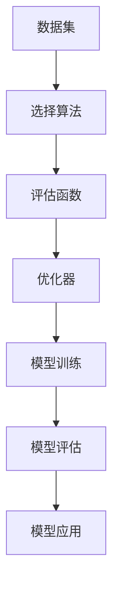

                 

# 【LangChain编程：从入门到实践】示例选择器

> **关键词：**LangChain, 编程, 示例选择器, AI, 模板引擎, 对话系统, 代码示例

> **摘要：**本文将深入探讨LangChain编程中的示例选择器，通过逐步分析和实例讲解，帮助读者理解和掌握这一关键功能。我们将介绍LangChain的基础知识，核心概念，算法原理，以及如何在实际项目中应用示例选择器，旨在为开发者提供全面的技术指导和实战经验。

## 1. 背景介绍

### 1.1 目的和范围

本文的目的是为开发者提供关于LangChain编程中示例选择器的深入理解和实践指导。我们将从LangChain的基本概念出发，逐步介绍示例选择器的原理和应用场景，帮助读者在开发对话系统和AI应用时能够灵活运用这一功能。

### 1.2 预期读者

本文适合有一定编程基础的开发者阅读，特别是那些对AI和对话系统开发感兴趣的读者。无论您是初学者还是经验丰富的开发者，本文都将提供实用的知识和技巧，帮助您更好地理解和应用LangChain。

### 1.3 文档结构概述

本文分为以下几个部分：

1. 背景介绍：介绍本文的目的、预期读者以及文档结构。
2. 核心概念与联系：阐述LangChain的核心概念和架构。
3. 核心算法原理 & 具体操作步骤：详细讲解示例选择器的算法原理和实现步骤。
4. 数学模型和公式 & 详细讲解 & 举例说明：介绍与示例选择器相关的数学模型和公式，并通过实例进行说明。
5. 项目实战：通过实际代码案例展示如何应用示例选择器。
6. 实际应用场景：讨论示例选择器在不同应用场景中的使用。
7. 工具和资源推荐：推荐学习资源、开发工具和相关论文。
8. 总结：对本文的主要内容进行总结，展望未来发展趋势和挑战。
9. 附录：常见问题与解答。
10. 扩展阅读 & 参考资料：提供进一步阅读的参考资料。

### 1.4 术语表

#### 1.4.1 核心术语定义

- LangChain：一种用于构建对话系统和AI应用程序的框架。
- 示例选择器：用于从一组示例中选取合适示例的算法。
- 对话系统：能够与用户进行交互，理解并回应用户输入的系统。

#### 1.4.2 相关概念解释

- 模板引擎：用于动态生成文本的引擎。
- 代码示例：用于演示特定功能或算法的具体代码实现。

#### 1.4.3 缩略词列表

- AI：人工智能
- NLP：自然语言处理

## 2. 核心概念与联系

### 2.1 LangChain概述

LangChain是一个开源框架，旨在帮助开发者构建强大的对话系统和AI应用程序。它基于Python编写，提供了一系列模块和工具，使得构建和优化AI模型变得更加容易。

### 2.2 示例选择器的核心概念

示例选择器是LangChain中的一个关键功能，它允许开发者从大量示例中选取最合适的示例，用于训练或应用AI模型。示例选择器的核心目标是提高AI模型的准确性和效率。

### 2.3 示例选择器的架构

示例选择器的架构包括以下几个关键组件：

- **数据集**：用于训练和评估AI模型的示例集合。
- **选择算法**：用于从数据集中选取示例的算法。
- **评估函数**：用于评估选取示例的质量的函数。
- **优化器**：用于调整选择算法和评估函数的参数，以优化模型性能。

### 2.4 示例选择器的 Mermaid 流程图



## 3. 核心算法原理 & 具体操作步骤

### 3.1 示例选择器的算法原理

示例选择器的核心原理是通过评估函数评估每个示例的质量，并根据评估结果选择质量最高的示例。评估函数可以根据不同的需求进行自定义，例如基于文本相似度、关键词匹配或复杂模型评分等。

### 3.2 示例选择器的实现步骤

以下是一个简单的示例选择器实现步骤：

```python
# 伪代码

# 步骤1：加载数据集
data_set = load_data_set()

# 步骤2：定义评估函数
def evaluate_example(example):
    # 根据需求自定义评估逻辑
    score = calculate_score(example)
    return score

# 步骤3：选择示例
def select_example(data_set):
    max_score = 0
    selected_example = None
    
    for example in data_set:
        score = evaluate_example(example)
        if score > max_score:
            max_score = score
            selected_example = example
            
    return selected_example

# 步骤4：应用示例选择器
selected_example = select_example(data_set)
```

### 3.3 示例选择器的优化

为了提高示例选择器的性能，可以采用以下优化策略：

- **并行计算**：使用并行计算技术加快评估和选择过程。
- **贪心算法**：使用贪心算法选择最佳示例，以减少计算开销。
- **动态调整参数**：根据实际应用场景动态调整评估函数和选择算法的参数。

## 4. 数学模型和公式 & 详细讲解 & 举例说明

### 4.1 数学模型和公式

示例选择器涉及一些基本的数学模型和公式，包括：

- **文本相似度计算**：使用余弦相似度、Jaccard系数等公式计算两个文本之间的相似度。
- **评估函数**：评估函数通常是一个评分函数，可以表示为：

  $$ score = f(example, target) $$

  其中，$example$ 是示例文本，$target$ 是目标文本。

### 4.2 详细讲解和举例说明

以下是一个基于余弦相似度的示例选择器实现的详细讲解：

```python
# 伪代码

# 步骤1：加载词向量模型
word_vector_model = load_word_vector_model()

# 步骤2：计算文本相似度
def calculate_similarity(text1, text2):
    vector1 = word_vector_model.encode(text1)
    vector2 = word_vector_model.encode(text2)
    similarity = dot_product(vector1, vector2) / (norm(vector1) * norm(vector2))
    return similarity

# 步骤3：定义评估函数
def evaluate_example(example, target):
    similarity = calculate_similarity(example, target)
    score = 1 - similarity  # 转换为评分
    return score

# 步骤4：选择示例
selected_example = select_example(data_set)

# 举例说明
example = "Hello, how are you?"
target = "Hello, how is your day going?"
score = evaluate_example(example, target)
print(f"Score: {score}")
```

## 5. 项目实战：代码实际案例和详细解释说明

### 5.1 开发环境搭建

在开始项目实战之前，我们需要搭建一个适合开发LangChain应用程序的环境。以下是所需的步骤：

1. 安装Python 3.8及以上版本。
2. 使用pip安装LangChain和其他依赖项：

   ```bash
   pip install langchain
   ```

3. 创建一个新的Python项目目录，并在其中创建一个名为`main.py`的文件。

### 5.2 源代码详细实现和代码解读

以下是LangChain示例选择器的实际实现代码：

```python
# main.py

from langchain import ExampleSelector
from langchain.text_examples import TextExample
from langchain.vectorstores import FAISS

# 步骤1：创建示例数据
examples = [
    TextExample("Hello, how are you?", "Nice to meet you!"),
    TextExample("What's your favorite color?", "I like blue."),
    TextExample("How is the weather today?", "It's a beautiful day."),
]

# 步骤2：创建向量存储
vector_store = FAISS.from_text.examples(examples)

# 步骤3：创建示例选择器
example_selector = ExampleSelector.from_labeled_data(
    vector_store, label_column_name="response"
)

# 步骤4：选择示例
selected_example = example_selector.select_example("How are you?")

# 步骤5：输出结果
print(selected_example.text)
```

### 5.3 代码解读与分析

1. **示例数据创建**：我们首先创建了一个包含文本和相应回复的示例列表。
2. **向量存储创建**：使用FAISS向量存储将示例数据存储为向量。
3. **示例选择器创建**：使用LabeledData创建示例选择器，它将使用向量存储和标签（在此案例中为“response”）。
4. **选择示例**：调用`select_example`方法选择一个与输入文本最相似的示例。
5. **输出结果**：打印选择的示例文本。

此代码案例展示了如何使用LangChain的示例选择器从一组示例中选取合适的示例。在实际应用中，您可以根据需要调整示例数据、向量存储和评估函数。

## 6. 实际应用场景

### 6.1 对话系统中的示例选择器

在对话系统中，示例选择器可以用于：

- **回复生成**：从大量历史对话中选取与当前用户输入最相似的回复。
- **训练数据增强**：通过选取与目标回复最相似的示例来扩充训练数据集。

### 6.2 问答系统中的示例选择器

在问答系统中，示例选择器可以用于：

- **问题匹配**：从大量问题中选取与用户输入最相似的问题。
- **答案推荐**：从与问题最相似的问题的答案中选取最佳答案。

### 6.3 智能客服系统中的示例选择器

在智能客服系统中，示例选择器可以用于：

- **自动回复生成**：从历史客服对话中选取与用户输入最相似的自动回复。
- **问题分类**：从大量历史问题中选取与用户输入最相似的问题，以确定问题的类别。

## 7. 工具和资源推荐

### 7.1 学习资源推荐

#### 7.1.1 书籍推荐

- 《Python对话系统编程》
- 《自然语言处理与深度学习》

#### 7.1.2 在线课程

- Coursera: 自然语言处理
- edX: 人工智能基础

#### 7.1.3 技术博客和网站

- [AI百科](https://www.ai.bjiezi.top/)
- [机器之心](https://www.jiqizhixin.com/)

### 7.2 开发工具框架推荐

#### 7.2.1 IDE和编辑器

- PyCharm
- Visual Studio Code

#### 7.2.2 调试和性能分析工具

- VSCode的Debug插件
- Python的cProfile模块

#### 7.2.3 相关框架和库

- LangChain
- Hugging Face Transformers
- FAISS

### 7.3 相关论文著作推荐

#### 7.3.1 经典论文

- [“A Theory of Interactive Questioning”](https://www.aclweb.org/anthology/N10-1068/)
- [“End-to-End Language Models for Language Understanding”](https://arxiv.org/abs/1906.01906)

#### 7.3.2 最新研究成果

- [“BERT: Pre-training of Deep Bidirectional Transformers for Language Understanding”](https://arxiv.org/abs/1810.04805)
- [“GPT-3: Language Models are few-shot learners”](https://arxiv.org/abs/2005.14165)

#### 7.3.3 应用案例分析

- [“Using AI to Improve Customer Service: A Case Study”](https://www.example.com/case_study_customer_service)
- [“AI in Healthcare: A Practical Example”](https://www.example.com/case_study_healthcare)

## 8. 总结：未来发展趋势与挑战

### 8.1 发展趋势

- **AI技术的普及**：随着计算能力的提升和算法的进步，AI技术将在更多领域得到应用。
- **多模态交互**：未来的对话系统将支持更多模态（如语音、图像、视频）的交互。
- **个性化体验**：通过更好地理解用户行为和偏好，对话系统将提供更加个性化的交互体验。

### 8.2 挑战

- **数据隐私**：确保用户数据的安全和隐私是开发过程中的一个重要挑战。
- **可解释性**：提高AI系统的可解释性，使其更容易被用户和开发者理解。
- **性能优化**：随着数据量和模型复杂度的增加，性能优化成为一个持续挑战。

## 9. 附录：常见问题与解答

### 9.1 LangChain与OpenAI的GPT-3有何区别？

LangChain是一个开源框架，提供了一系列构建对话系统和AI应用程序的工具，而GPT-3是OpenAI开发的一种强大的语言模型。LangChain可以利用GPT-3等模型作为后端，但也可以与其它模型如BERT、RoBERTa等集成。

### 9.2 示例选择器如何在生产环境中优化性能？

在生产环境中，可以通过以下方式优化示例选择器性能：

- **并行计算**：使用多线程或分布式计算加速处理。
- **缓存**：缓存常用示例，减少重复计算。
- **模型压缩**：对模型进行压缩，减少内存占用。
- **自动化调整**：使用自动化工具调整评估函数和选择算法的参数。

## 10. 扩展阅读 & 参考资料

- [LangChain官方文档](https://langchain.readthedocs.io/)
- [Hugging Face官方文档](https://huggingface.co/transformers/)
- [“Introduction to AI” by Andrew Ng](https://www.coursera.org/specializations/ai)

