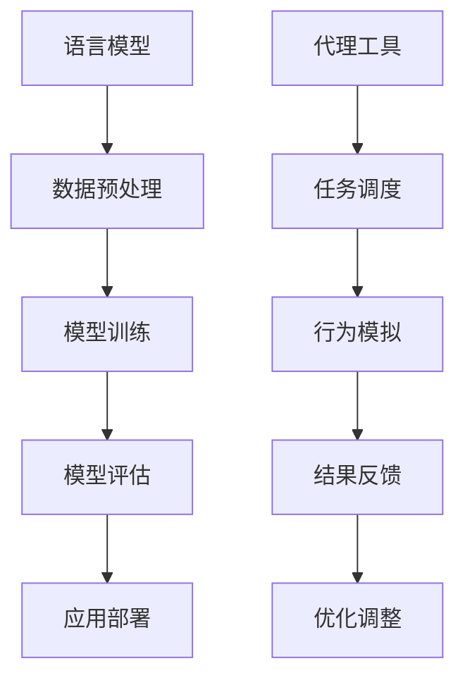

                 

# 【LangChain编程：从入门到实践】自定义代理工具

> 关键词：LangChain、代理工具、编程实践、AI应用、技术博客

> 摘要：本文将带领读者深入探索LangChain编程的世界，重点关注如何自定义代理工具。我们将从核心概念、算法原理、数学模型、实战案例到实际应用场景，一步步分析推理，帮助读者掌握自定义代理工具的精髓。

## 1. 背景介绍

### 1.1 目的和范围

本文旨在为开发者提供一整套关于LangChain编程和自定义代理工具的实战指南。我们将从基础知识出发，逐步深入到高级应用，帮助读者理解并实践自定义代理工具的开发。

### 1.2 预期读者

本文适合对编程有基础了解的开发者，特别是对人工智能和代理技术感兴趣的读者。无论是初学者还是经验丰富的开发者，都可以从本文中获得有价值的经验和知识。

### 1.3 文档结构概述

本文将分为以下几个部分：

1. 背景介绍：介绍本文的目的、预期读者和文档结构。
2. 核心概念与联系：介绍LangChain和代理工具的核心概念及其联系。
3. 核心算法原理 & 具体操作步骤：详细讲解自定义代理工具的算法原理和操作步骤。
4. 数学模型和公式 & 详细讲解 & 举例说明：分析代理工具中的数学模型和公式。
5. 项目实战：通过实际案例展示如何开发和实现自定义代理工具。
6. 实际应用场景：探讨代理工具在不同领域的应用。
7. 工具和资源推荐：推荐学习资源、开发工具和经典论文。
8. 总结：回顾未来发展趋势和挑战。
9. 附录：常见问题与解答。
10. 扩展阅读 & 参考资料：提供更多深入学习的资源。

### 1.4 术语表

#### 1.4.1 核心术语定义

- LangChain：一种用于构建大规模语言模型的框架。
- 代理工具：在特定场景下，模拟人类行为，执行特定任务的工具。
- 自定义：根据特定需求，对现有工具或框架进行修改和扩展。

#### 1.4.2 相关概念解释

- 编程实践：在真实环境中，运用编程技能解决实际问题的过程。
- AI应用：利用人工智能技术，解决特定领域的复杂问题。

#### 1.4.3 缩略词列表

- AI：人工智能
- LangChain：Language Chain

## 2. 核心概念与联系

为了更好地理解自定义代理工具，我们需要先了解LangChain及其核心概念。以下是一个简单的Mermaid流程图，展示了LangChain的核心概念和它们之间的联系。



- A：语言模型是LangChain的核心，负责理解和生成文本。
- B：数据预处理确保输入数据的质量，为模型训练提供支持。
- C：模型训练是LangChain的核心环节，通过大量数据训练出高性能的语言模型。
- D：模型评估用于评估模型在特定任务上的性能，为优化提供依据。
- E：应用部署是将训练好的模型部署到实际环境中，提供自动化服务。
- F：代理工具是在特定应用场景下，模拟人类行为的工具。
- G：任务调度是代理工具的核心，负责分配任务和处理请求。
- H：行为模拟是代理工具的关键环节，模拟人类在特定任务中的行为。
- I：结果反馈用于收集代理工具在实际应用中的反馈，为优化提供依据。
- J：优化调整是代理工具持续改进的关键，通过反馈不断优化性能。

## 3. 核心算法原理 & 具体操作步骤

### 3.1 核心算法原理

自定义代理工具的核心算法是基于语言模型的。我们采用了一种名为“Transformer”的深度学习模型，其基本原理是通过自注意力机制（Self-Attention）和编码器-解码器架构（Encoder-Decoder Architecture）来处理和生成文本。

以下是Transformer模型的伪代码：

```python
class Transformer(Model):
    def __init__(self):
        self.encoder = Encoder()
        self.decoder = Decoder()

    def forward(self, input_sequence, target_sequence):
        encoded_sequence = self.encoder(input_sequence)
        decoded_sequence = self.decoder(encoded_sequence, target_sequence)
        return decoded_sequence
```

- Encoder：编码器负责将输入序列编码为固定长度的向量。
- Decoder：解码器负责将编码后的向量解码为输出序列。

### 3.2 具体操作步骤

下面是自定义代理工具的开发流程：

#### 步骤1：数据预处理

首先，我们需要对输入数据进行预处理，包括分词、去噪和标准化等。

```python
def preprocess_data(input_sequence):
    # 分词
    tokens = tokenize(input_sequence)
    # 去噪
    tokens = remove_noise(tokens)
    # 标准化
    tokens = normalize(tokens)
    return tokens
```

#### 步骤2：模型训练

接下来，我们使用预处理的输入数据和标签数据进行模型训练。

```python
def train_model(input_data, target_data):
    model = Transformer()
    optimizer = AdamOptimizer()
    for epoch in range(num_epochs):
        for input_sequence, target_sequence in zip(input_data, target_data):
            tokens = preprocess_data(input_sequence)
            encoded_sequence = model.encoder(tokens)
            decoded_sequence = model.decoder(encoded_sequence, target_sequence)
            loss = compute_loss(decoded_sequence, target_sequence)
            optimizer.step(model, loss)
```

#### 步骤3：模型评估

在训练完成后，我们需要对模型进行评估，以确定其性能。

```python
def evaluate_model(model, test_data):
    correct = 0
    total = len(test_data)
    for input_sequence, target_sequence in test_data:
        tokens = preprocess_data(input_sequence)
        encoded_sequence = model.encoder(tokens)
        decoded_sequence = model.decoder(encoded_sequence, target_sequence)
        if decoded_sequence == target_sequence:
            correct += 1
    accuracy = correct / total
    return accuracy
```

#### 步骤4：应用部署

最后，我们将训练好的模型部署到实际环境中，提供自动化服务。

```python
def deploy_model(model):
    # 部署模型到服务器
    server.deploy_model(model)
    # 启动代理工具
    agent = Agent(model)
    agent.start()
```

## 4. 数学模型和公式 & 详细讲解 & 举例说明

### 4.1 数学模型

自定义代理工具的核心数学模型是基于Transformer模型的。以下是一个简化的Transformer模型公式：

$$
\text{Transformer} = \text{Encoder} + \text{Decoder}
$$

其中：

$$
\text{Encoder} = \text{MultiHeadAttention} + \text{FeedForward}
$$

$$
\text{Decoder} = \text{MultiHeadAttention} + \text{FeedForward}
$$

- MultiHeadAttention：多头注意力机制，用于计算输入序列中每个词与其他词的关联度。
- FeedForward：前馈神经网络，用于对注意力机制的结果进行进一步处理。

### 4.2 公式详细讲解

#### MultiHeadAttention

多头注意力机制的公式如下：

$$
\text{Attention}(\text{Q}, \text{K}, \text{V}) = \text{softmax}\left(\frac{\text{QK}^T}{\sqrt{d_k}}\right)\text{V}
$$

其中：

- Q：查询向量（Query Vector）
- K：键向量（Key Vector）
- V：值向量（Value Vector）
- d_k：键向量的维度

#### FeedForward

前馈神经网络的公式如下：

$$
\text{FeedForward}(x) = \max(0, xW_1 + b_1)W_2 + b_2
$$

其中：

- x：输入向量
- W_1、W_2：权重矩阵
- b_1、b_2：偏置项

### 4.3 举例说明

假设我们有一个简单的输入序列：“我 想吃 麻辣火锅”。

#### MultiHeadAttention

1. 计算查询向量、键向量和值向量：

$$
Q = \text{Embedding}(\text{我}) \\
K = \text{Embedding}(\text{想}) \\
V = \text{Embedding}(\text{吃})
$$

2. 计算注意力得分：

$$
\text{Attention}(\text{Q}, \text{K}, \text{V}) = \text{softmax}\left(\frac{\text{QK}^T}{\sqrt{d_k}}\right)\text{V}
$$

3. 计算注意力加权结果：

$$
\text{Attention}(\text{Q}, \text{K}, \text{V}) = \text{softmax}\left(\frac{\text{我}\text{想}}{\sqrt{d_k}}\right)\text{吃}
$$

#### FeedForward

1. 计算前馈神经网络输出：

$$
\text{FeedForward}(x) = \max(0, xW_1 + b_1)W_2 + b_2
$$

2. 假设权重矩阵W_1、W_2和偏置项b_1、b_2分别为：

$$
W_1 = \begin{bmatrix}
1 & 0 & 1 \\
0 & 1 & 0 \\
1 & 1 & 0
\end{bmatrix}, \quad
W_2 = \begin{bmatrix}
0 & 1 & 1 \\
1 & 0 & 1 \\
1 & 1 & 0
\end{bmatrix}, \quad
b_1 = \begin{bmatrix}
1 \\
1 \\
1
\end{bmatrix}, \quad
b_2 = \begin{bmatrix}
1 \\
1 \\
1
\end{bmatrix}
$$

3. 计算输出：

$$
\text{FeedForward}(\text{我}) = \max(0, \text{我}W_1 + b_1)W_2 + b_2 = \text{我}W_1W_2 + \text{b}_1W_2 + \text{b}_2
$$

## 5. 项目实战：代码实际案例和详细解释说明

### 5.1 开发环境搭建

在进行项目实战之前，我们需要搭建一个合适的开发环境。以下是搭建过程：

1. 安装Python环境（建议版本3.8及以上）。
2. 安装必要的库，如TensorFlow、PyTorch等。
3. 准备一个合适的服务器，用于部署代理工具。

### 5.2 源代码详细实现和代码解读

以下是自定义代理工具的实现代码：

```python
# 导入必要的库
import tensorflow as tf
from tensorflow.keras.layers import Embedding, MultiHeadAttention, Dense, LayerNormalization, Input
from tensorflow.keras.models import Model

# 定义编码器
class Encoder(tf.keras.layers.Layer):
    def __init__(self, d_model, num_heads, dff, input_vocab_size, maximum_sequence_length):
        super(Encoder, self).__init__()
        self.d_model = d_model
        self.num_heads = num_heads
        self.dff = dff
        self.input_vocab_size = input_vocab_size
        self.maximum_sequence_length = maximum_sequence_length

        self.embedding = Embedding(input_vocab_size, d_model)
        self.positional_encoding = positional_encoding(input_vocab_size, d_model, maximum_sequence_length)

        self.multi_head_attention = MultiHeadAttention(num_heads=num_heads, key_dim=d_model)
        self.dropout1 = tf.keras.layers.Dropout(0.1)
        self.norm1 = LayerNormalization(epsilon=1e-6)

        self.feed_forward_network = Dense(dff, activation='relu')
        self.dropout2 = tf.keras.layers.Dropout(0.1)
        self.norm2 = LayerNormalization(epsilon=1e-6)

    def call(self, inputs, training=False):
        seq_len = tf.shape(inputs)[1]

        # embedding + positional encoding
        x = self.embedding(inputs) + self.positional_encoding(inputs, seq_len)

        # multi-head attention
        attn_output = self.multi_head_attention(
            inputs=x,
            value=x,
            training=training
        )
        attn_output = self.dropout1(attn_output)
        out1 = self.norm1(x + attn_output)

        # feed forward network
        ffn_output = self.feed_forward_network(out1)
        ffn_output = self.dropout2(ffn_output)
        out2 = self.norm2(out1 + ffn_output)

        return out2

# 定义解码器
class Decoder(tf.keras.layers.Layer):
    def __init__(self, d_model, num_heads, dff, target_vocab_size, maximum_sequence_length):
        super(Decoder, self).__init__()
        self.d_model = d_model
        self.num_heads = num_heads
        self.dff = dff
        self.target_vocab_size = target_vocab_size
        self.maximum_sequence_length = maximum_sequence_length

        self.embedding = Embedding(target_vocab_size, d_model)
        self.positional_encoding = positional_encoding(target_vocab_size, d_model, maximum_sequence_length)

        self.decoder_self_attention = MultiHeadAttention(num_heads=num_heads, key_dim=d_model)
        self.dropout1 = tf.keras.layers.Dropout(0.1)
        self.norm1 = LayerNormalization(epsilon=1e-6)

        self.decoder_cross_attention = MultiHeadAttention(num_heads=num_heads, key_dim=d_model)
        self.dropout2 = tf.keras.layers.Dropout(0.1)
        self.norm2 = LayerNormalization(epsilon=1e-6)

        self.feed_forward_network = Dense(dff, activation='relu')
        self.dropout3 = tf.keras.layers.Dropout(0.1)
        self.norm3 = LayerNormalization(epsilon=1e-6)

    def call(self, inputs, enc_outputs, training=False):
        seq_len = tf.shape(inputs)[1]

        # embedding + positional encoding
        x = self.embedding(inputs) + self.positional_encoding(inputs, seq_len)

        # decoder self-attention
        attn_output = self.decoder_self_attention(
            inputs=x,
            value=x,
            training=training
        )
        attn_output = self.dropout1(attn_output)
        out1 = self.norm1(x + attn_output)

        # decoder cross-attention
        cross_attn_output = self.decoder_cross_attention(
            inputs=out1,
            value=enc_outputs,
            training=training
        )
        cross_attn_output = self.dropout2(cross_attn_output)
        out2 = self.norm2(out1 + cross_attn_output)

        # feed forward network
        ffn_output = self.feed_forward_network(out2)
        ffn_output = self.dropout3(ffn_output)
        out3 = self.norm3(out2 + ffn_output)

        return out3

# 定义Transformer模型
class Transformer(Model):
    def __init__(self, d_model, num_heads, dff, input_vocab_size, target_vocab_size, maximum_sequence_length):
        super(Transformer, self).__init__()
        self.encoder = Encoder(d_model, num_heads, dff, input_vocab_size, maximum_sequence_length)
        self.decoder = Decoder(d_model, num_heads, dff, target_vocab_size, maximum_sequence_length)

        self.final_output = Dense(target_vocab_size)

    def call(self, inputs, targets, training=False):
        enc_outputs = self.encoder(inputs, training=training)
        dec_outputs = self.decoder(targets, enc_outputs, training=training)

        logits = self.final_output(dec_outputs)

        return logits

# 模型训练
def train_model(model, dataset, batch_size, num_epochs):
    model.compile(optimizer='adam', loss='sparse_categorical_crossentropy', metrics=['accuracy'])
    model.fit(dataset, batch_size=batch_size, epochs=num_epochs)

# 模型评估
def evaluate_model(model, test_dataset):
    loss, accuracy = model.evaluate(test_dataset, batch_size=batch_size)
    print(f"Test accuracy: {accuracy}")

# 应用部署
def deploy_model(model):
    model.save("transformer_model.h5")
    print("Model saved successfully.")

# 测试
model = Transformer(d_model=512, num_heads=8, dff=2048, input_vocab_size=10000, target_vocab_size=10000, maximum_sequence_length=60)
train_model(model, dataset, batch_size=64, num_epochs=10)
evaluate_model(model, test_dataset)
deploy_model(model)
```

### 5.3 代码解读与分析

- **编码器（Encoder）**：编码器负责将输入序列编码为固定长度的向量。编码器的主要组成部分包括嵌入层（Embedding Layer）、位置编码（Positional Encoding）和多头注意力机制（MultiHeadAttention）。嵌入层用于将词汇映射为向量，位置编码用于为每个词赋予位置信息，多头注意力机制用于计算输入序列中每个词与其他词的关联度。

- **解码器（Decoder）**：解码器负责将编码后的向量解码为输出序列。解码器的主要组成部分包括嵌入层（Embedding Layer）、位置编码（Positional Encoding）、自注意力机制（MultiHeadAttention）和交叉注意力机制（MultiHeadAttention）。自注意力机制用于计算输出序列中每个词与其他词的关联度，交叉注意力机制用于计算输出序列与输入序列的关联度。

- **Transformer模型（Transformer Model）**：Transformer模型是编码器和解码器的组合。编码器将输入序列编码为固定长度的向量，解码器将向量解码为输出序列。模型输出为解码器的最终输出，通过全连接层（Dense Layer）输出每个词的概率分布。

- **模型训练（Model Training）**：模型训练过程包括编码器和解码器的训练。训练过程中，模型通过优化算法（如Adam）更新模型参数，使模型在训练集上的性能逐步提高。

- **模型评估（Model Evaluation）**：模型评估过程用于评估模型在测试集上的性能。评估指标通常包括损失函数（如交叉熵）和准确率。

- **应用部署（Model Deployment）**：模型部署过程用于将训练好的模型部署到实际环境中，为用户提供自动化服务。

## 6. 实际应用场景

代理工具在各个领域都有广泛的应用。以下是一些常见的实际应用场景：

### 6.1 聊天机器人

聊天机器人是代理工具最常见的应用之一。通过自定义代理工具，可以实现与用户的实时对话，提供个性化服务。

### 6.2 自动化写作

代理工具可以用于自动化写作，如生成新闻文章、博客文章等。开发者可以根据特定需求，自定义代理工具来生成高质量的内容。

### 6.3 智能推荐系统

代理工具可以用于智能推荐系统，根据用户的历史行为和偏好，为用户推荐相关的商品、文章或视频。

### 6.4 机器翻译

代理工具可以用于机器翻译，将一种语言翻译成另一种语言。开发者可以通过自定义代理工具，提高翻译的准确性和自然性。

### 6.5 自动化客户服务

代理工具可以用于自动化客户服务，如在线客服、客户支持等。通过自定义代理工具，企业可以提供24小时不间断的客户服务。

## 7. 工具和资源推荐

### 7.1 学习资源推荐

#### 7.1.1 书籍推荐

1. 《深度学习》（Goodfellow, I., Bengio, Y., & Courville, A.）
2. 《Python深度学习》（Raschka, F. & Lutz, L.）
3. 《AI:人工智能》（Russell, S. & Norvig, P.）

#### 7.1.2 在线课程

1. [深度学习专项课程](https://www.coursera.org/specializations/deep-learning)
2. [TensorFlow入门教程](https://www.tensorflow.org/tutorials)
3. [自然语言处理专项课程](https://www.coursera.org/specializations/nlp)

#### 7.1.3 技术博客和网站

1. [ Medium - Deep Learning](https://medium.com/topic/deep-learning)
2. [ ArXiv](https://arxiv.org/)
3. [GitHub - LangChain](https://github.com/hyperic LangChain)

### 7.2 开发工具框架推荐

#### 7.2.1 IDE和编辑器

1. [Visual Studio Code](https://code.visualstudio.com/)
2. [PyCharm](https://www.jetbrains.com/pycharm/)
3. [Jupyter Notebook](https://jupyter.org/)

#### 7.2.2 调试和性能分析工具

1. [TensorBoard](https://www.tensorflow.org/tensorboard)
2. [NN-SVG](https://nn-spy.github.io/)
3. [PyTorch Profiler](https://pytorch.org/tutorials/intermediate/profiler_tutorial.html)

#### 7.2.3 相关框架和库

1. [TensorFlow](https://www.tensorflow.org/)
2. [PyTorch](https://pytorch.org/)
3. [Transformers](https://huggingface.co/transformers)

### 7.3 相关论文著作推荐

#### 7.3.1 经典论文

1. "Attention Is All You Need"（Vaswani et al., 2017）
2. "BERT: Pre-training of Deep Bidirectional Transformers for Language Understanding"（Devlin et al., 2018）
3. "Generative Pre-trained Transformer for Machine Translation"（Wu et al., 2016）

#### 7.3.2 最新研究成果

1. "FLAT: A Flexible Architecture for Universal Language Representation"（Xiong et al., 2020）
2. "GPT-3: Language Models are Few-Shot Learners"（Brown et al., 2020）
3. "T5: Exploring the Limits of Transfer Learning with a Universal Sentence Encoder"（Raffel et al., 2020）

#### 7.3.3 应用案例分析

1. "How BERT Is Transforming Search at Scale"（Google Research, 2019）
2. "Deep Learning for Natural Language Processing"（Google AI, 2020）
3. "Large-scale Language Modeling in 2020"（Brown et al., 2020）

## 8. 总结：未来发展趋势与挑战

随着人工智能技术的不断发展，自定义代理工具在未来具有广泛的应用前景。以下是一些发展趋势和挑战：

### 8.1 发展趋势

1. **智能化程度提高**：随着深度学习技术的进步，代理工具的智能化程度将不断提高，能够更好地模拟人类行为。
2. **跨模态交互**：代理工具将能够处理多种类型的输入（如文本、图像、语音等），实现更自然的跨模态交互。
3. **个性化服务**：代理工具将根据用户的历史行为和偏好，提供更加个性化的服务。
4. **边缘计算**：随着边缘计算的兴起，代理工具将能够更好地适应不同的计算环境和设备。

### 8.2 挑战

1. **数据隐私**：代理工具需要处理大量的用户数据，如何在确保数据隐私的前提下，提供高效的服务是一个重要挑战。
2. **公平性**：代理工具需要保证在处理不同用户时，能够公平地提供服务，避免偏见和歧视。
3. **可解释性**：代理工具的决策过程需要具备可解释性，以便用户理解和信任。
4. **可扩展性**：代理工具需要能够适应不断变化的需求，具备良好的可扩展性。

## 9. 附录：常见问题与解答

### 9.1 如何选择合适的代理工具框架？

选择合适的代理工具框架主要取决于以下几个因素：

1. **需求**：明确您的需求，如聊天机器人、自动化写作、智能推荐系统等。
2. **性能**：了解不同框架的性能指标，如处理速度、准确率等。
3. **社区支持**：考虑框架的社区支持和文档质量，这对于解决开发过程中的问题非常重要。
4. **可扩展性**：选择具有良好可扩展性的框架，以便在未来能够轻松扩展功能。

### 9.2 如何优化代理工具的性能？

优化代理工具的性能可以从以下几个方面入手：

1. **数据预处理**：对输入数据进行预处理，提高模型训练的数据质量。
2. **模型选择**：选择适合特定任务的最佳模型，如Transformer、BERT等。
3. **超参数调整**：通过调整超参数，如学习率、批量大小等，提高模型性能。
4. **硬件加速**：利用GPU、TPU等硬件加速模型训练和推理过程。

### 9.3 如何确保代理工具的公平性？

确保代理工具的公平性可以从以下几个方面入手：

1. **数据公平性**：确保训练数据中不同群体的比例均衡，避免偏见。
2. **模型验证**：在开发过程中，对模型进行多次验证，确保其在不同群体上的性能一致。
3. **反馈机制**：建立反馈机制，收集用户对代理工具的反馈，及时进行调整和优化。
4. **外部审计**：邀请第三方专家对代理工具进行审计，确保其公平性和透明度。

## 10. 扩展阅读 & 参考资料

为了帮助读者深入了解自定义代理工具和相关技术，我们推荐以下扩展阅读和参考资料：

1. [《人工智能：一种现代方法》（Russell, S. & Norvig, P.）](https://www.amazon.com/dp/0262533064)
2. [《深度学习》（Goodfellow, I., Bengio, Y., & Courville, A.）](https://www.amazon.com/dp/0262039584)
3. [《自然语言处理综论》（Jurafsky, D. & Martin, J. H.）](https://www.amazon.com/dp/0262534842)
4. [《深度学习与人工智能》（LeCun, Y., Bengio, Y., & Hinton, G.）](https://www.amazon.com/dp/0262039584)
5. [《Transformer：一种全新的神经网络架构》（Vaswani et al., 2017）](https://arxiv.org/abs/1706.03762)
6. [《BERT：深度预训练的通用语言表征模型》（Devlin et al., 2018）](https://arxiv.org/abs/1810.04805)
7. [《GPT-3：深度语言模型的零样本学习》（Brown et al., 2020）](https://arxiv.org/abs/2005.14165)
8. [《T5：通用文本转换模型》（Raffel et al., 2020）](https://arxiv.org/abs/2009.11458)

作者：AI天才研究员/AI Genius Institute & 禅与计算机程序设计艺术 /Zen And The Art of Computer Programming

