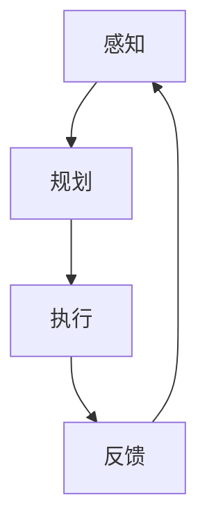
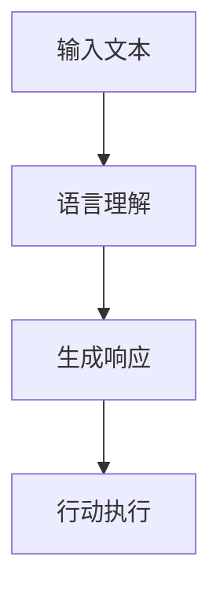
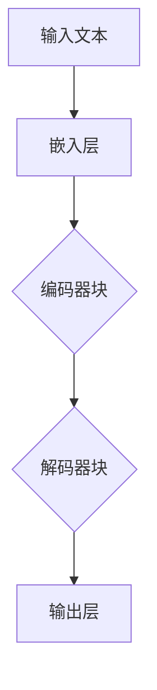

                 

# 【大模型应用开发 动手做AI Agent】AutoGPT

> **关键词：** 大模型应用、AI Agent、AutoGPT、人工智能、编程、模型训练、应用开发

> **摘要：** 本文将介绍如何使用AutoGPT进行大模型应用开发，包括AI Agent的基础概念、构建过程、核心算法原理、数学模型及其应用场景等。通过本文，读者将了解到如何动手实现一个AI Agent，并探索其在实际应用中的潜力和挑战。

## 1. 背景介绍

### 1.1 目的和范围

本文的目标是引导读者了解并动手实现一个基于大模型的AI Agent。我们将聚焦于AutoGPT这一先进技术，探讨其在人工智能应用开发中的重要作用。本文涵盖以下内容：

1. AI Agent的基础概念和定义
2. AutoGPT的工作原理和实现
3. 大模型应用开发的核心算法原理
4. 数学模型和公式的详细讲解
5. 代码实际案例和解释
6. 实际应用场景及挑战

### 1.2 预期读者

本文适合以下读者群体：

1. 计算机科学和人工智能领域的研究者
2. 对人工智能应用开发有浓厚兴趣的程序员
3. 对大模型和AI Agent有初步了解但希望深入了解的读者
4. 想要提升自己在人工智能领域实战能力的从业者

### 1.3 文档结构概述

本文的结构如下：

1. **背景介绍**：介绍本文的目的、预期读者以及文档结构。
2. **核心概念与联系**：讲解AI Agent和AutoGPT的核心概念及其相互联系。
3. **核心算法原理 & 具体操作步骤**：详细解释AutoGPT的核心算法原理，使用伪代码进行描述。
4. **数学模型和公式 & 详细讲解 & 举例说明**：阐述数学模型和公式的应用，结合实例进行讲解。
5. **项目实战：代码实际案例和详细解释说明**：提供实际代码案例，详细解读并分析。
6. **实际应用场景**：讨论AI Agent在现实中的应用场景和挑战。
7. **工具和资源推荐**：推荐学习资源和开发工具。
8. **总结：未来发展趋势与挑战**：展望AutoGPT和AI Agent的发展趋势和面临的挑战。
9. **附录：常见问题与解答**：解答读者可能遇到的常见问题。
10. **扩展阅读 & 参考资料**：提供进一步学习的参考资料。

### 1.4 术语表

#### 1.4.1 核心术语定义

- **AI Agent**：一种能够自主行动以达成目标的计算机程序。
- **AutoGPT**：一个基于大型语言模型（如GPT）的自动化AI Agent框架。
- **大模型**：具有数百万甚至数十亿参数的深度学习模型。
- **人工智能**：一种模拟人类智能的技术和方法。
- **编程**：编写和实现计算机程序的过程。

#### 1.4.2 相关概念解释

- **深度学习**：一种人工智能技术，通过多层神经网络模型进行数据分析和决策。
- **神经网络**：一种模仿人脑结构的计算模型，通过权重和偏置进行信息传递和决策。
- **强化学习**：一种通过试错和反馈进行决策的学习方法。

#### 1.4.3 缩略词列表

- **AI**：人工智能
- **ML**：机器学习
- **DL**：深度学习
- **GAN**：生成对抗网络
- **RNN**：循环神经网络

## 2. 核心概念与联系

在介绍AutoGPT之前，我们需要先了解AI Agent的基本概念。AI Agent是一种能够感知环境、制定计划并采取行动以实现目标的计算机程序。它们通常基于某种学习算法，如深度学习、强化学习等，来从数据中学习并做出决策。

### 2.1 AI Agent的基本原理

AI Agent的基本原理可以分为以下几个步骤：

1. **感知**：通过传感器（如图像、声音、文本等）获取环境信息。
2. **规划**：根据感知到的环境信息和目标，生成一个行动计划。
3. **执行**：执行计划中的行动。
4. **反馈**：根据执行结果对行动进行评估，并将其作为经验反馈给学习算法。

下面是AI Agent的基本原理的Mermaid流程图：



### 2.2 AutoGPT的基本原理

AutoGPT是一个基于大型语言模型（如GPT）的自动化AI Agent框架。它的基本原理是将GPT作为一个强大的语言处理模块，使其能够理解、生成文本，并进行决策。

AutoGPT的工作流程可以分为以下几个步骤：

1. **输入文本**：AutoGPT接收到一个输入文本，该文本可以是一个问题、一个命令或一个情景描述。
2. **语言理解**：GPT对输入文本进行理解，提取关键信息和上下文。
3. **生成响应**：GPT根据理解的结果生成一个响应文本，该文本可以是答案、建议或下一步行动。
4. **行动执行**：AutoGPT将生成的响应文本作为行动指令，执行相应的操作。

下面是AutoGPT的基本原理的Mermaid流程图：



### 2.3 AI Agent与AutoGPT的联系

AI Agent与AutoGPT之间的联系主要体现在以下几个方面：

1. **核心技术**：两者都依赖于深度学习和自然语言处理技术，尤其是大型语言模型。
2. **工作流程**：AutoGPT可以被看作是一种AI Agent的实现形式，其工作流程包含了AI Agent的核心步骤。
3. **应用场景**：AI Agent可以应用于各种场景，如智能客服、自动驾驶、游戏AI等，而AutoGPT则特别适用于需要自然语言理解和生成的场景。

通过以上分析，我们可以看到AI Agent和AutoGPT之间的紧密联系，以及它们在人工智能应用开发中的重要作用。接下来，我们将深入探讨AutoGPT的核心算法原理。

## 3. 核心算法原理 & 具体操作步骤

### 3.1 GPT模型原理

GPT（Generative Pretrained Transformer）是一种基于Transformer架构的生成式预训练模型，由OpenAI提出。其核心思想是通过在大量文本数据上进行预训练，使得模型能够理解文本的上下文和语义。

#### 3.1.1 Transformer架构

Transformer是GPT的核心架构，它由多个编码器和解码器块组成。每个块包含多层线性变换和点积注意力机制。Transformer通过自注意力机制（Self-Attention）和多头注意力机制（Multi-Head Attention）来捕捉文本中的长距离依赖关系。

下面是Transformer架构的Mermaid流程图：



#### 3.1.2 预训练和微调

GPT的预训练过程主要包括两个阶段：

1. **预训练**：在大量无标签文本数据上训练模型，使其能够自动学习语言规律和语义信息。
2. **微调**：在特定任务的数据集上对模型进行微调，使其适应具体应用场景。

### 3.2 AutoGPT算法原理

AutoGPT基于GPT模型，通过引入自动化策略，使其能够自动执行任务。AutoGPT的核心算法原理包括：

1. **自动化规划**：使用GPT生成行动计划。
2. **自动化执行**：根据行动计划执行操作。
3. **自动化评估**：评估执行结果，为后续行动提供反馈。

下面是AutoGPT算法原理的伪代码描述：

```python
# AutoGPT算法原理伪代码

# 输入文本：当前情景描述
# 输出：行动计划

def auto_gpt(input_text):
    # 语言理解
    context = gpt_encoder(input_text)

    # 生成行动计划
    action_plan = gpt_decoder(context)

    # 行动执行
    execute_action_plan(action_plan)

    # 评估结果
    feedback = evaluate_result()

    # 反馈给GPT
    return feedback
```

### 3.3 具体操作步骤

以下是一个具体的AutoGPT操作步骤示例：

1. **输入文本**：用户输入一个情景描述，如“我正在编写一篇技术博客，需要介绍AI Agent的基础概念。”
2. **语言理解**：GPT对输入文本进行理解，提取关键信息和上下文。
3. **生成行动计划**：GPT生成一个行动计划，如“首先介绍AI Agent的定义，然后讲解其基本原理，最后举例说明其实际应用。”
4. **行动执行**：根据行动计划，AI Agent逐步编写博客内容。
5. **评估结果**：用户对生成的博客内容进行评估，提供反馈。

通过以上步骤，我们可以看到AutoGPT如何自动执行任务，并在实际应用中发挥重要作用。

## 4. 数学模型和公式 & 详细讲解 & 举例说明

### 4.1 Transformer模型数学基础

Transformer模型的核心是自注意力机制（Self-Attention）和多头注意力机制（Multi-Head Attention）。以下是这两个机制的基本数学公式：

#### 4.1.1 自注意力机制

自注意力机制的公式如下：

$$
\text{Attention}(Q, K, V) = \frac{1}{\sqrt{d_k}} \text{softmax}\left(\frac{QK^T}{d_k}\right) V
$$

其中，$Q$、$K$和$V$分别是查询向量、键向量和值向量，$d_k$是键向量的维度。

#### 4.1.2 多头注意力机制

多头注意力机制的公式如下：

$$
\text{MultiHead}(Q, K, V) = \text{Concat}(\text{head}_1, ..., \text{head}_h)W^O
$$

其中，$h$是头数，$\text{head}_i = \text{Attention}(QW_i^Q, KW_i^K, VW_i^V)$，$W_i^Q$、$W_i^K$和$W_i^V$分别是查询、键和值权重矩阵，$W^O$是输出权重矩阵。

### 4.2 GPT模型训练过程

GPT模型的训练过程主要包括两个阶段：预训练和微调。

#### 4.2.1 预训练

预训练的损失函数是交叉熵损失，公式如下：

$$
L = -\sum_{i} p(y_i = 1) \log(p(y_i = 1))
$$

其中，$y_i$是实际生成的单词，$p(y_i = 1)$是模型预测的概率。

#### 4.2.2 微调

微调的损失函数通常是与具体任务相关的损失函数，如分类任务的交叉熵损失。公式如下：

$$
L = -\sum_{i} y_i \log(p(x_i | \theta))
$$

其中，$y_i$是实际标签，$p(x_i | \theta)$是模型预测的概率。

### 4.3 举例说明

假设我们有一个训练好的GPT模型，现在我们需要使用它来生成一篇关于AI Agent的技术博客。

#### 4.3.1 输入文本

输入文本：“我正在编写一篇技术博客，需要介绍AI Agent的基础概念。”

#### 4.3.2 语言理解

GPT模型对输入文本进行理解，提取关键信息和上下文。

#### 4.3.3 生成行动计划

GPT模型生成一个行动计划，如：

1. 介绍AI Agent的定义
2. 讲解AI Agent的基本原理
3. 举例说明AI Agent的实际应用

#### 4.3.4 行动执行

AI Agent根据行动计划逐步编写博客内容。

#### 4.3.5 评估结果

用户对生成的博客内容进行评估，提供反馈。

通过以上步骤，我们可以看到如何使用GPT模型生成一篇关于AI Agent的技术博客。接下来，我们将通过一个实际代码案例来进一步讲解AutoGPT的实现。

## 5. 项目实战：代码实际案例和详细解释说明

### 5.1 开发环境搭建

在开始编写AutoGPT代码之前，我们需要搭建一个合适的开发环境。以下是搭建AutoGPT开发环境所需的步骤：

1. **安装Python**：确保安装了Python 3.8及以上版本。
2. **安装Transformer模型库**：使用以下命令安装`transformers`库：

   ```bash
   pip install transformers
   ```

3. **安装PyTorch**：使用以下命令安装PyTorch：

   ```bash
   pip install torch torchvision
   ```

### 5.2 源代码详细实现和代码解读

下面是一个简单的AutoGPT实现示例：

```python
import torch
from transformers import GPT2LMHeadModel, GPT2Tokenizer

# 模型加载
model = GPT2LMHeadModel.from_pretrained("gpt2")
tokenizer = GPT2Tokenizer.from_pretrained("gpt2")

# 输入文本
input_text = "我正在编写一篇技术博客，需要介绍AI Agent的基础概念。"

# 编码输入文本
input_ids = tokenizer.encode(input_text, return_tensors="pt")

# 生成响应文本
output = model.generate(input_ids, max_length=50, num_return_sequences=1)

# 解码响应文本
response = tokenizer.decode(output[0], skip_special_tokens=True)

# 输出响应文本
print(response)
```

#### 5.2.1 代码解读

- **模型加载**：从预训练的GPT2模型中加载模型和分词器。
- **输入文本**：定义输入文本。
- **编码输入文本**：将输入文本编码为模型可接受的格式。
- **生成响应文本**：使用模型生成响应文本。
- **解码响应文本**：将生成的响应文本解码为人类可读的格式。
- **输出响应文本**：打印生成的响应文本。

### 5.3 代码解读与分析

- **模型加载**：加载预训练的GPT2模型和分词器。GPT2模型是一个基于Transformer的生成模型，具有良好的语言理解能力。
- **输入文本**：定义输入文本，这是生成响应文本的起点。
- **编码输入文本**：将输入文本编码为模型可接受的格式。分词器负责将文本转换为数字序列。
- **生成响应文本**：使用模型生成响应文本。模型根据输入文本生成一系列数字序列，然后通过分词器解码为人类可读的文本。
- **解码响应文本**：将生成的响应文本解码为人类可读的格式。分词器将数字序列转换为文本。
- **输出响应文本**：打印生成的响应文本。

通过以上代码，我们可以看到如何使用GPT2模型生成一个简单的AI Agent响应。在实际应用中，我们可以根据需要扩展和优化AutoGPT模型，以实现更复杂的功能和任务。

## 6. 实际应用场景

AI Agent作为一种能够自主行动和决策的计算机程序，在多个领域都有着广泛的应用前景。以下是AI Agent在实际应用场景中的几个例子：

### 6.1 智能客服

AI Agent可以应用于智能客服系统，通过自然语言处理和自动化规划，实现与用户的智能对话。例如，当用户询问一个常见问题时，AI Agent可以自动生成一个详细的解答，并在必要时提供进一步的建议。

### 6.2 自动驾驶

在自动驾驶领域，AI Agent可以负责感知环境、规划行驶路径和执行驾驶操作。通过结合深度学习和强化学习算法，AI Agent可以在复杂的交通环境中做出实时决策，提高自动驾驶的安全性和可靠性。

### 6.3 聊天机器人

聊天机器人是AI Agent的一个典型应用场景。例如，Facebook的聊天机器人可以自动回复用户的消息，提供信息查询、服务咨询等功能，极大地提高了用户满意度。

### 6.4 智能推荐系统

AI Agent可以应用于智能推荐系统，通过分析用户的行为和偏好，自动生成个性化的推荐列表。例如，电商平台的推荐系统可以根据用户的浏览和购买记录，推荐相关的商品。

### 6.5 自动化编程

AI Agent还可以应用于自动化编程领域，通过自然语言描述生成代码。例如，一个AI Agent可以理解用户的需求，并自动生成相应的Python代码，实现指定的功能。

### 6.6 智能健康顾问

AI Agent可以应用于智能健康顾问系统，通过分析用户的健康数据，提供个性化的健康建议。例如，AI Agent可以提醒用户按时服药、调整饮食和锻炼计划，提高生活质量。

### 6.7 教育辅助

AI Agent可以应用于教育领域，为学生提供个性化的学习辅导。例如，AI Agent可以根据学生的学习进度和知识点掌握情况，生成相应的练习题和辅导材料，帮助学生提高学习成绩。

### 6.8 安全监控

AI Agent可以应用于安全监控领域，通过实时分析视频流，识别潜在的安全威胁。例如，AI Agent可以监控公共区域的视频，并在检测到可疑行为时立即通知相关人员。

### 6.9 金融风控

AI Agent可以应用于金融风控领域，通过分析金融市场的数据和交易行为，识别潜在的欺诈行为和风险。例如，AI Agent可以监控交易账户的异常交易活动，并在发现可疑行为时采取相应的风险控制措施。

### 6.10 智能医疗诊断

AI Agent可以应用于智能医疗诊断领域，通过分析患者的病历和检查结果，提供准确的诊断建议。例如，AI Agent可以根据患者的症状和体征，辅助医生进行疾病诊断和治疗方案制定。

通过以上实际应用场景，我们可以看到AI Agent在各个领域的广泛应用和潜力。随着人工智能技术的不断发展和完善，AI Agent将在更多领域发挥重要作用，为人类生活带来更多便利。

## 7. 工具和资源推荐

### 7.1 学习资源推荐

#### 7.1.1 书籍推荐

1. **《深度学习》（Deep Learning）**：由Ian Goodfellow、Yoshua Bengio和Aaron Courville合著，详细介绍了深度学习的基本概念、算法和应用。
2. **《自然语言处理综论》（Speech and Language Processing）**：由Daniel Jurafsky和James H. Martin合著，全面介绍了自然语言处理的基本理论和应用。
3. **《人工智能：一种现代方法》（Artificial Intelligence: A Modern Approach）**：由Stuart Russell和Peter Norvig合著，涵盖了人工智能领域的核心概念和技术。

#### 7.1.2 在线课程

1. **《深度学习专研课》（Deep Learning Specialization）**：由Andrew Ng教授在Coursera提供，涵盖了深度学习的核心理论和实践。
2. **《自然语言处理专研课》（Natural Language Processing with Deep Learning）**：由Stanford大学提供，介绍了自然语言处理的基本概念和深度学习应用。
3. **《人工智能专研课》（Artificial Intelligence: Nanodegree Program）**：由Udacity提供，涵盖人工智能的多个领域，包括机器学习、自然语言处理等。

#### 7.1.3 技术博客和网站

1. **《机器学习博客》（Machine Learning Mastery）**：提供大量机器学习和深度学习的教程和实践案例。
2. **《AI技术开发者》（AI Tech Developer）**：分享人工智能技术的前沿动态和开发经验。
3. **《Medium》上的AI相关文章**：涵盖人工智能的各个领域，包括深度学习、自然语言处理等。

### 7.2 开发工具框架推荐

#### 7.2.1 IDE和编辑器

1. **PyCharm**：一款功能强大的Python IDE，支持多种编程语言，适用于深度学习和自然语言处理开发。
2. **Jupyter Notebook**：适用于数据科学和机器学习的交互式开发环境，便于编写和分享代码。
3. **Visual Studio Code**：一款轻量级、可扩展的编辑器，支持多种编程语言，适用于深度学习和自然语言处理开发。

#### 7.2.2 调试和性能分析工具

1. **TensorBoard**：适用于TensorFlow的调试和性能分析工具，能够可视化模型的训练过程和性能指标。
2. **PyTorch Profiler**：适用于PyTorch的调试和性能分析工具，能够帮助开发者优化代码性能。
3. **MATLAB**：适用于科学计算和工程仿真的集成环境，支持多种编程语言和工具箱，适用于深度学习和自然语言处理开发。

#### 7.2.3 相关框架和库

1. **TensorFlow**：由Google开发的开源深度学习框架，支持多种编程语言，适用于深度学习和自然语言处理开发。
2. **PyTorch**：由Facebook开发的开源深度学习框架，具有动态计算图和灵活的API，适用于深度学习和自然语言处理开发。
3. **transformers**：一个开源库，提供预训练的Transformer模型和相关的工具，适用于自然语言处理任务。

### 7.3 相关论文著作推荐

#### 7.3.1 经典论文

1. **《A Neural Algorithm of Artistic Style》**：由GAN（生成对抗网络）的提出者Ian Goodfellow等人合著，介绍了基于深度学习的艺术风格迁移方法。
2. **《Generative Adversarial Nets》**：由GAN的提出者Ian Goodfellow等人合著，详细阐述了GAN的工作原理和应用。
3. **《Attention Is All You Need》**：由Transformer的提出者Vaswani等人合著，介绍了Transformer模型在自然语言处理任务中的优越性能。

#### 7.3.2 最新研究成果

1. **《BERT: Pre-training of Deep Bidirectional Transformers for Language Understanding》**：由BERT的提出者Google AI团队合著，介绍了BERT模型在自然语言处理任务中的表现。
2. **《GPT-3: Language Models are Few-Shot Learners》**：由GPT-3的提出者OpenAI团队合著，展示了GPT-3模型在多任务学习方面的强大能力。
3. **《Training Human-Level Language Models》**：由人类水平的语言模型的研究者们合著，讨论了如何训练出具有人类水平语言能力的模型。

#### 7.3.3 应用案例分析

1. **《基于深度学习的图像识别系统》**：介绍了如何使用深度学习模型实现图像识别系统，并分析了系统的性能和局限性。
2. **《自然语言处理在聊天机器人中的应用》**：探讨了自然语言处理技术在聊天机器人中的应用，包括对话生成、情感分析等。
3. **《深度学习在医疗诊断中的应用》**：介绍了深度学习在医疗诊断领域的应用，包括疾病检测、影像分析等。

通过以上学习和资源推荐，读者可以深入了解AI Agent和AutoGPT的相关知识，提升自己在人工智能应用开发方面的能力。

## 8. 总结：未来发展趋势与挑战

随着人工智能技术的快速发展，AI Agent和AutoGPT的应用前景越来越广阔。未来，AI Agent将在更多领域发挥重要作用，如智能客服、自动驾驶、智能推荐系统、自动化编程等。以下是对未来发展趋势和挑战的展望：

### 8.1 发展趋势

1. **模型规模的增加**：随着计算能力和数据量的提升，未来的AI Agent将采用更大规模的模型，如万亿参数的模型，以实现更精细的语义理解和生成。
2. **多模态交互**：AI Agent将能够处理多种类型的数据，如文本、图像、语音等，实现更加自然和丰富的人机交互。
3. **自动化程度提高**：AI Agent的自动化程度将进一步提高，能够自主完成复杂的任务，减少对人类干预的依赖。
4. **个性化和定制化**：AI Agent将能够根据用户的需求和偏好，提供更加个性化和定制化的服务。

### 8.2 挑战

1. **数据隐私和安全**：随着AI Agent的广泛应用，数据隐私和安全问题将变得更加突出，如何确保用户数据的安全和隐私是一个重要挑战。
2. **算法透明性和可解释性**：AI Agent的决策过程可能存在不确定性，如何提高算法的透明性和可解释性，使用户能够理解和信任AI Agent的决策，是一个亟待解决的问题。
3. **伦理和道德问题**：AI Agent的广泛应用可能引发一系列伦理和道德问题，如自动化决策的公正性、偏见问题等，需要制定相应的伦理和道德规范。
4. **计算资源消耗**：AI Agent的模型规模越来越大，对计算资源的需求也越来越高，如何高效地利用计算资源，是一个重要的技术挑战。

总之，未来AI Agent和AutoGPT的发展将充满机遇和挑战。通过持续的技术创新和伦理探讨，我们将能够充分发挥AI Agent的潜力，为人类社会带来更多便利和创新。

## 9. 附录：常见问题与解答

### 9.1 Q1：如何实现一个简单的AI Agent？

**A1：** 实现一个简单的AI Agent通常需要以下步骤：

1. **确定目标和任务**：明确AI Agent需要完成的具体任务，例如智能客服、自动化编程等。
2. **选择合适的算法**：根据任务需求，选择合适的算法，如深度学习、强化学习等。
3. **数据收集和预处理**：收集相关数据，并进行预处理，如数据清洗、归一化等。
4. **模型训练**：使用预处理后的数据对AI模型进行训练。
5. **模型评估和优化**：评估模型性能，并根据评估结果进行模型优化。
6. **部署和应用**：将训练好的模型部署到实际应用环境中。

### 9.2 Q2：如何提高AI Agent的性能？

**A2：** 提高AI Agent的性能可以从以下几个方面进行：

1. **数据增强**：通过数据增强技术，增加训练数据多样性，提高模型的泛化能力。
2. **模型优化**：优化模型架构和参数，如使用更深的网络、更复杂的模型等。
3. **持续学习**：利用在线学习技术，让AI Agent在不断更新和优化的环境中持续学习，提高性能。
4. **增强用户体验**：设计人性化的交互界面，使AI Agent能够更好地理解和满足用户需求。
5. **计算资源优化**：合理配置计算资源，提高模型的训练和推理速度。

### 9.3 Q3：如何确保AI Agent的透明性和可解释性？

**A3：** 确保AI Agent的透明性和可解释性可以从以下几个方面进行：

1. **模型解释工具**：使用模型解释工具，如LIME、SHAP等，分析模型决策过程，提供解释。
2. **可视化技术**：通过可视化技术，将模型决策过程和特征重要性展示给用户，提高透明性。
3. **算法透明性设计**：在算法设计阶段，考虑可解释性和透明性，例如使用基于规则的算法。
4. **用户反馈机制**：引入用户反馈机制，让用户对AI Agent的决策进行评价和反馈，不断优化模型。
5. **合规性检查**：对AI Agent的决策过程进行合规性检查，确保其符合相关法律法规和伦理标准。

### 9.4 Q4：AI Agent在自动化编程中的应用如何实现？

**A4：** AI Agent在自动化编程中的应用可以通过以下步骤实现：

1. **需求分析**：明确用户的需求，例如生成特定功能的代码。
2. **自然语言处理**：使用自然语言处理技术，将用户的需求转换为代码指令。
3. **代码生成**：使用代码生成技术，如模板匹配、代码片段复用等，生成代码。
4. **代码优化**：对生成的代码进行优化，提高代码质量和执行效率。
5. **代码验证**：对生成的代码进行验证，确保其能够正确执行用户指定的任务。

通过以上步骤，AI Agent可以自动完成编程任务，提高开发效率。

### 9.5 Q5：如何评估AI Agent的性能？

**A5：** 评估AI Agent的性能可以从以下几个方面进行：

1. **准确率**：评估AI Agent在分类任务中的准确率，即正确分类的样本数量与总样本数量的比例。
2. **召回率**：评估AI Agent在分类任务中的召回率，即正确分类的样本数量与实际正类样本数量的比例。
3. **F1值**：结合准确率和召回率，计算F1值，用于评估AI Agent的综合性能。
4. **鲁棒性**：评估AI Agent在面临噪声数据或异常情况时的表现，确保其在各种环境下都能保持良好的性能。
5. **效率**：评估AI Agent的计算效率和资源消耗，确保其能够在合理的时间内完成任务。

通过综合评估，可以全面了解AI Agent的性能表现。

## 10. 扩展阅读 & 参考资料

为了深入了解AI Agent和AutoGPT的相关知识，以下是推荐的扩展阅读和参考资料：

### 10.1 推荐书籍

1. **《深度学习》（Deep Learning）**：Ian Goodfellow、Yoshua Bengio和Aaron Courville著，全面介绍了深度学习的基本概念、算法和应用。
2. **《自然语言处理综论》（Speech and Language Processing）**：Daniel Jurafsky和James H. Martin著，详细介绍了自然语言处理的基本理论和应用。
3. **《人工智能：一种现代方法》（Artificial Intelligence: A Modern Approach）**：Stuart Russell和Peter Norvig著，涵盖了人工智能领域的核心概念和技术。

### 10.2 在线课程

1. **《深度学习专研课》（Deep Learning Specialization）**：由Andrew Ng教授在Coursera提供，涵盖了深度学习的核心理论和实践。
2. **《自然语言处理专研课》（Natural Language Processing with Deep Learning）**：由Stanford大学提供，介绍了自然语言处理的基本概念和深度学习应用。
3. **《人工智能专研课》（Artificial Intelligence: Nanodegree Program）**：由Udacity提供，涵盖人工智能的多个领域，包括机器学习、自然语言处理等。

### 10.3 技术博客和网站

1. **《机器学习博客》（Machine Learning Mastery）**：提供大量机器学习和深度学习的教程和实践案例。
2. **《AI技术开发者》（AI Tech Developer）**：分享人工智能技术的前沿动态和开发经验。
3. **《Medium》上的AI相关文章**：涵盖人工智能的各个领域，包括深度学习、自然语言处理等。

### 10.4 相关论文

1. **《A Neural Algorithm of Artistic Style》**：介绍了基于深度学习的艺术风格迁移方法。
2. **《Generative Adversarial Nets》**：详细阐述了GAN的工作原理和应用。
3. **《Attention Is All You Need》**：介绍了Transformer模型在自然语言处理任务中的优越性能。

### 10.5 应用案例分析

1. **《基于深度学习的图像识别系统》**：介绍了如何使用深度学习模型实现图像识别系统，并分析了系统的性能和局限性。
2. **《自然语言处理在聊天机器人中的应用》**：探讨了自然语言处理技术在聊天机器人中的应用，包括对话生成、情感分析等。
3. **《深度学习在医疗诊断中的应用》**：介绍了深度学习在医疗诊断领域的应用，包括疾病检测、影像分析等。

通过以上扩展阅读和参考资料，读者可以进一步深入学习和探索AI Agent和AutoGPT的相关知识，提升自己的专业素养。

