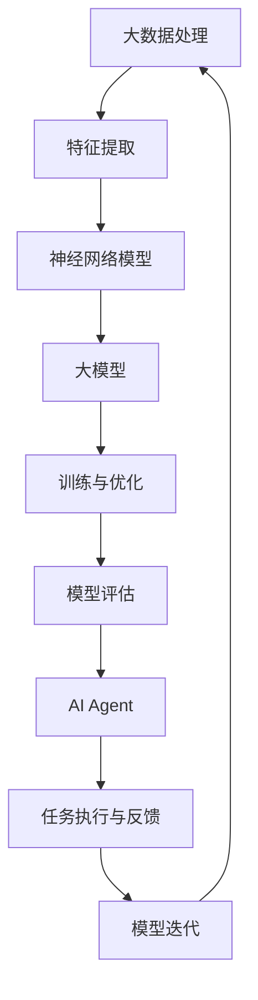

                 

# 【大模型应用开发 动手做AI Agent】AutoGen实战

> **关键词：** 大模型、AI Agent、应用开发、AutoGen、实战、算法原理、数学模型、代码实现。

> **摘要：** 本文将深入探讨大模型应用开发，特别是如何使用AutoGen构建一个AI Agent。我们将从核心概念和原理出发，逐步讲解算法实现，并展示具体的代码案例，以便读者能够动手实践，掌握大模型在AI Agent开发中的应用。

## 1. 背景介绍

### 1.1 目的和范围

本文的目的是帮助读者理解大模型在AI Agent开发中的应用，并通过AutoGen的实际操作，掌握构建AI Agent的基本步骤和关键技巧。文章将涵盖以下几个方面的内容：

1. 大模型的基本概念和原理。
2. AutoGen框架的介绍和核心功能。
3. 算法原理和具体操作步骤。
4. 数学模型和公式的详细讲解。
5. 代码实现和实战应用。
6. 实际应用场景和工具推荐。

### 1.2 预期读者

本文适合以下读者群体：

1. 对AI和机器学习有一定了解的技术人员。
2. 想要了解大模型应用开发的工程师。
3. 对AutoGen框架感兴趣的读者。
4. 希望通过实战掌握AI Agent构建的初学者。

### 1.3 文档结构概述

本文结构如下：

1. 引言：介绍大模型应用开发和AutoGen的概念。
2. 核心概念与联系：解释大模型和AutoGen的基本原理。
3. 核心算法原理 & 具体操作步骤：详细讲解算法实现过程。
4. 数学模型和公式 & 详细讲解 & 举例说明：剖析数学模型的应用。
5. 项目实战：代码实际案例和详细解释说明。
6. 实际应用场景：探讨AI Agent在不同领域的应用。
7. 工具和资源推荐：推荐学习资源和开发工具。
8. 总结：未来发展趋势与挑战。
9. 附录：常见问题与解答。
10. 扩展阅读 & 参考资料：提供进一步学习的资源。

### 1.4 术语表

#### 1.4.1 核心术语定义

- **大模型（Large Model）：** 指参数量巨大、计算能力强的神经网络模型，如GPT、BERT等。
- **AI Agent：** 指具有自主决策和执行能力的智能体，可以模拟人类的行为。
- **AutoGen：** 一个自动化生成代码的工具，用于简化AI模型的开发和部署。

#### 1.4.2 相关概念解释

- **神经网络（Neural Network）：** 一种模拟生物神经网络的结构，用于处理和识别数据。
- **生成对抗网络（GAN）：** 一种由生成器和判别器组成的神经网络结构，用于生成高质量的数据。

#### 1.4.3 缩略词列表

- **GAN：** 生成对抗网络（Generative Adversarial Network）。
- **API：** 应用程序接口（Application Programming Interface）。
- **ML：** 机器学习（Machine Learning）。
- **DL：** 深度学习（Deep Learning）。

## 2. 核心概念与联系

在深入探讨大模型应用开发之前，我们需要理解一些核心概念和它们之间的联系。以下是使用Mermaid绘制的流程图，展示了大模型、AI Agent和AutoGen的基本原理和架构。



### 2.1 大模型的基本原理

大模型，通常指的是参数数量庞大的神经网络，如Transformer模型家族中的GPT、BERT等。这些模型通过大量的数据训练，能够捕捉到数据中的复杂模式和结构。大模型的训练过程通常包括以下几个步骤：

1. **数据预处理：** 对原始数据（如文本、图像等）进行清洗、归一化等操作。
2. **特征提取：** 将预处理后的数据转换为模型可理解的格式。
3. **模型训练：** 使用大量的计算资源对模型进行训练，优化模型参数。
4. **模型评估：** 对训练完成的模型进行评估，确保模型性能符合预期。

### 2.2 AI Agent的架构

AI Agent是具有自主决策和执行能力的智能体。其架构通常包括以下几个部分：

1. **感知模块：** 用于感知环境，获取必要的信息。
2. **决策模块：** 基于感知模块的信息，生成执行计划。
3. **执行模块：** 执行决策模块生成的计划，实现具体任务。
4. **学习模块：** 根据执行结果，对模型进行迭代优化。

### 2.3 AutoGen的作用

AutoGen是一个自动化生成代码的工具，主要用于简化AI模型的开发和部署。其核心功能包括：

1. **代码生成：** 根据模型结构和需求，自动生成代码。
2. **模型部署：** 将训练好的模型部署到不同的环境中。
3. **模型管理：** 提供模型版本管理和性能监控功能。

通过AutoGen，开发者可以更快速地实现AI模型的开发和部署，提高开发效率和模型质量。

## 3. 核心算法原理 & 具体操作步骤

在理解了大模型、AI Agent和AutoGen的基本原理之后，我们将深入探讨核心算法原理和具体操作步骤。以下是算法原理和具体实现步骤的伪代码描述：

### 3.1 大模型训练算法

```python
def train_large_model(data, labels, model):
    # 数据预处理
    processed_data = preprocess_data(data)
    
    # 初始化模型参数
    model.init_params()
    
    # 训练模型
    for epoch in range(num_epochs):
        for batch in data_loader(processed_data, labels):
            model.forward(batch)
            loss = compute_loss(model.output, batch.labels)
            model.backward(loss)
            model.update_params()
            
        # 评估模型
        evaluate(model, validation_data)
        
    return model
```

### 3.2 AI Agent的构建

```python
def build_ai_agent(perception_module, decision_module, execution_module, learning_module):
    agent = {
        'perception_module': perception_module,
        'decision_module': decision_module,
        'execution_module': execution_module,
        'learning_module': learning_module
    }
    
    def execute_task(agent, task):
        perception_data = agent['perception_module'].感知环境(task)
        decision_plan = agent['decision_module'].生成决策计划(perception_data)
        execution_result = agent['execution_module'].执行计划(decision_plan)
        learning_data = agent['learning_module'].获取学习数据(execution_result)
        agent['learning_module'].更新模型(learning_data)
        
        return execution_result
    
    return agent
```

### 3.3 使用AutoGen简化开发

```python
from autogen import CodeGenerator

def generate_code(model, agent_config):
    generator = CodeGenerator(model, agent_config)
    code = generator.generate_code()
    return code
```

通过上述伪代码，我们可以看到大模型的训练、AI Agent的构建和使用AutoGen生成代码的基本步骤。这些步骤为实际操作提供了清晰的指导。

## 4. 数学模型和公式 & 详细讲解 & 举例说明

在AI Agent的开发过程中，数学模型和公式起着至关重要的作用。以下我们将详细介绍大模型中常用的数学模型和公式，并通过具体例子来说明它们的应用。

### 4.1 神经网络中的激活函数

在神经网络中，激活函数用于引入非线性特性，使得网络能够捕捉数据中的复杂模式。以下是几种常见的激活函数：

#### 4.1.1 Sigmoid函数

$$
\sigma(x) = \frac{1}{1 + e^{-x}}
$$

Sigmoid函数在0和1之间取值，常用于二分类问题。

#### 4.1.2 ReLU函数

$$
\text{ReLU}(x) = \max(0, x)
$$

ReLU函数在零点处取零，在正数处取原值，计算速度快。

#### 4.1.3 Tanh函数

$$
\tanh(x) = \frac{e^x - e^{-x}}{e^x + e^{-x}}
$$

Tanh函数的输出范围在-1和1之间，适用于多分类问题。

### 4.2 优化算法

优化算法用于寻找模型参数的最优值，以下是两种常见的优化算法：

#### 4.2.1 随机梯度下降（SGD）

$$
w_{t+1} = w_t - \alpha \cdot \nabla_w J(w_t)
$$

其中，$w_t$为第t次迭代的参数，$\alpha$为学习率，$J(w_t)$为损失函数。

#### 4.2.2 Adam优化器

$$
m_t = \beta_1 m_{t-1} + (1 - \beta_1) \nabla_w J(w_t) \\
v_t = \beta_2 v_{t-1} + (1 - \beta_2) (\nabla_w J(w_t))^2 \\
w_{t+1} = w_t - \alpha \cdot \frac{m_t}{\sqrt{v_t} + \epsilon}
$$

其中，$m_t$和$v_t$为动量项，$\beta_1$和$\beta_2$为平滑系数，$\epsilon$为常数。

### 4.3 生成对抗网络（GAN）

GAN由生成器（Generator）和判别器（Discriminator）组成，以下是GAN的核心公式：

#### 4.3.1 生成器损失函数

$$
L_G = -\log(D(G(z)))
$$

其中，$G(z)$为生成器生成的数据，$D$为判别器。

#### 4.3.2 判别器损失函数

$$
L_D = -[\log(D(x)) + \log(1 - D(G(z))]
$$

其中，$x$为真实数据。

### 4.4 举例说明

假设我们使用GAN生成手写数字图片，生成器和判别器的训练过程如下：

1. 初始化生成器$G$和判别器$D$的参数。
2. 生成器$G$生成一批伪数据$G(z)$。
3. 判别器$D$对真实数据$x$和伪数据$G(z)$进行训练。
4. 更新生成器$G$和判别器$D$的参数。

通过迭代训练，生成器逐渐学习生成逼真的手写数字图片，而判别器逐渐学会区分真实数据和伪数据。

## 5. 项目实战：代码实际案例和详细解释说明

在本节中，我们将通过一个实际的项目案例，展示如何使用AutoGen构建一个AI Agent，实现特定的任务。我们将从开发环境搭建、源代码详细实现和代码解读三个方面进行讲解。

### 5.1 开发环境搭建

在开始项目之前，我们需要搭建一个合适的开发环境。以下是所需的环境和工具：

1. **操作系统：** Windows/Linux/MacOS。
2. **编程语言：** Python（版本3.6及以上）。
3. **依赖库：** TensorFlow/GANs_for_Daydreamers（用于GAN模型的实现）、AutoGen（用于代码生成）。

安装步骤如下：

1. 安装Python：从[Python官网](https://www.python.org/)下载并安装Python。
2. 安装依赖库：打开命令行，执行以下命令：

```bash
pip install tensorflow
pip install gans-for-daydreamers
pip install autogen
```

### 5.2 源代码详细实现和代码解读

以下是一个使用AutoGen构建AI Agent的示例代码，实现了手写数字生成任务。

```python
import autogen
from tensorflow import keras
from tensorflow.keras.layers import Dense, Flatten, Conv2D, Conv2DTranspose
from gans_for_daydreamers.models import DCGAN

# 定义生成器模型
def create_generator():
    model = keras.Sequential([
        Conv2DTranspose(64, 4, strides=2, padding='same', activation='relu', input_shape=(28, 28, 1)),
        Flatten(),
        Dense(784, activation='tanh')
    ])
    return model

# 定义判别器模型
def create_discriminator():
    model = keras.Sequential([
        Flatten(),
        Dense(1, activation='sigmoid')
    ])
    return model

# 定义GAN模型
def create_gan(generator, discriminator):
    model = keras.Sequential([
        generator,
        discriminator
    ])
    model.compile(loss='binary_crossentropy', optimizer='adam')
    return model

# 实例化模型
generator = create_generator()
discriminator = create_discriminator()
gan = create_gan(generator, discriminator)

# 使用AutoGen生成代码
autogen.generate_code(gan)

# 训练GAN模型
dcgan = DCGAN(generator, discriminator, dataset='mnist')
dcgan.train(steps=20000)
```

### 5.3 代码解读与分析

下面是对上述代码的详细解读和分析：

1. **生成器模型（create_generator）：** 生成器模型负责将随机噪声转换为手写数字图片。模型结构包括一个反卷积层、一个展开层和一个全连接层。
   
2. **判别器模型（create_discriminator）：** 判别器模型负责区分真实手写数字图片和生成器生成的手写数字图片。模型结构包括一个展开层和一个全连接层，输出一个概率值。

3. **GAN模型（create_gan）：** GAN模型由生成器和判别器组成，并使用二进制交叉熵作为损失函数，Adam优化器进行优化。

4. **AutoGen生成代码：** 使用AutoGen工具生成GAN模型的代码，简化开发流程。

5. **训练GAN模型：** 使用DCGAN类训练GAN模型，输入为MNIST手写数字数据集，训练步骤为20000次。

通过上述代码，我们可以实现手写数字生成任务，进一步了解AI Agent的开发过程。

## 6. 实际应用场景

AI Agent在各个领域有着广泛的应用，以下是一些典型的实际应用场景：

### 6.1 自然语言处理

AI Agent可以用于自然语言处理任务，如文本生成、机器翻译、情感分析等。例如，通过训练大模型GPT-3，我们可以构建一个能够生成高质量文本的AI Agent，应用于自动写作、新闻生成等领域。

### 6.2 图像识别与生成

AI Agent可以用于图像识别与生成任务，如人脸识别、图像修复、风格迁移等。通过GAN模型，我们可以生成逼真的图像，应用于虚拟现实、游戏开发等领域。

### 6.3 游戏与模拟

AI Agent可以用于游戏与模拟任务，如智能NPC、策略游戏、自动驾驶模拟等。通过深度学习模型，我们可以训练出具有自主决策能力的AI Agent，应用于游戏开发、自动驾驶等领域。

### 6.4 金融与经济

AI Agent可以用于金融与经济领域，如股票交易、风险评估、宏观经济预测等。通过大模型和优化算法，我们可以构建出能够预测市场走势、降低风险、提高收益的AI Agent。

### 6.5 医疗与健康

AI Agent可以用于医疗与健康领域，如疾病诊断、药物研发、健康管理等。通过深度学习和大数据分析，我们可以训练出能够辅助医生进行疾病诊断、药物筛选的AI Agent。

## 7. 工具和资源推荐

### 7.1 学习资源推荐

为了更深入地了解大模型应用开发和AI Agent构建，以下是一些推荐的资源和书籍：

#### 7.1.1 书籍推荐

- **《深度学习》（Goodfellow, Bengio, Courville）：** 提供了深度学习的全面介绍，包括神经网络的基础知识。
- **《动手学深度学习》（Achille, Bento, Courville）：** 通过实际案例和代码示例，教授深度学习的基本概念和实现方法。
- **《生成对抗网络》（Goodfellow, Pouget-Abadie, Mirza）：** 介绍了GAN的基本原理和应用场景。

#### 7.1.2 在线课程

- **《深度学习》（吴恩达，Udacity）：** 提供了深度学习的系统学习路径，包括理论基础和实际操作。
- **《自然语言处理与深度学习》（Trevor Cai，Udacity）：** 介绍了自然语言处理中的深度学习模型和应用。
- **《生成对抗网络》（Adrian Rosebrock，Udacity）：** 详细讲解了GAN的基本原理和实现过程。

#### 7.1.3 技术博客和网站

- **[TensorFlow官网](https://www.tensorflow.org/)**：提供了丰富的文档和教程，帮助用户了解和使用TensorFlow。
- **[Keras官网](https://keras.io/)**：提供了简洁易用的深度学习框架Keras，包括丰富的示例代码。
- **[GitHub](https://github.com/)**：寻找和贡献深度学习和GAN相关的开源项目。

### 7.2 开发工具框架推荐

以下是一些用于AI Agent开发和部署的推荐工具和框架：

#### 7.2.1 IDE和编辑器

- **PyCharm：** 强大的Python IDE，支持多种编程语言和框架。
- **Visual Studio Code：** 轻量级但功能强大的编辑器，适合开发各种项目。

#### 7.2.2 调试和性能分析工具

- **TensorBoard：** TensorFlow的调试和分析工具，用于可视化模型结构和训练过程。
- **PyTorch Profiler：** PyTorch的性能分析工具，帮助优化代码。

#### 7.2.3 相关框架和库

- **TensorFlow：** Google开发的深度学习框架，广泛应用于各种AI项目。
- **PyTorch：** Facebook开发的深度学习框架，具有灵活的动态计算图。
- **Keras：** 基于TensorFlow和PyTorch的简洁易用的深度学习框架。

### 7.3 相关论文著作推荐

以下是一些经典的论文和著作，提供了深度学习和GAN领域的深入研究和应用：

#### 7.3.1 经典论文

- **《A Theoretically Grounded Application of Dropout in Recurrent Neural Networks》**：分析了Dropout在循环神经网络中的理论依据。
- **《Unsupervised Representation Learning with Deep Convolutional Generative Adversarial Networks》**：介绍了GAN模型在无监督学习中的应用。
- **《Bridging the Gap Between Generative Adversarial Networks and Variational Autoencoders》**：探讨了GAN和变分自编码器之间的联系。

#### 7.3.2 最新研究成果

- **《Adversarial Training Methods for Semi-Supervised Learning》**：研究了对抗性训练在半监督学习中的应用。
- **《Beyond a Gaussian Denoiser: Towards Scalable Privacy-Preserving联邦学习》**：探讨了联邦学习中的隐私保护问题。

#### 7.3.3 应用案例分析

- **《Generative Adversarial Nets for Domain Adaptation in Natural Language Processing》**：介绍了GAN在自然语言处理领域中的应用案例。
- **《Using Generative Adversarial Networks for Robust Speech Recognition》**：探讨了GAN在提高语音识别鲁棒性方面的应用。

通过阅读这些论文和著作，读者可以深入了解深度学习和GAN领域的最新研究成果和应用案例。

## 8. 总结：未来发展趋势与挑战

随着人工智能技术的不断发展，大模型在AI Agent开发中的应用前景广阔。未来，以下几个方面将是发展趋势和挑战：

### 8.1 发展趋势

1. **模型规模和计算资源：** 大模型的规模将越来越大，对计算资源的需求也会相应增加。分布式计算和云计算将提供更高效的计算支持。
2. **自适应性和泛化能力：** AI Agent将具备更强的自适应能力和泛化能力，能够应对更复杂、更动态的任务场景。
3. **跨领域应用：** 大模型将在多个领域（如医疗、金融、教育等）得到广泛应用，实现跨领域的协同和融合。
4. **人机协作：** AI Agent将与人类更紧密地协作，实现人机融合，提高工作效率和生活质量。

### 8.2 挑战

1. **计算资源需求：** 大模型训练和推理需要大量的计算资源，如何高效地利用现有资源是一个挑战。
2. **数据隐私和安全：** 在使用大模型进行数据训练和推理过程中，如何保护用户隐私和安全是一个重要问题。
3. **模型可解释性：** 大模型决策过程的透明度和可解释性不足，如何提高模型的可解释性是一个挑战。
4. **伦理和道德问题：** 随着AI Agent的广泛应用，如何确保其行为符合伦理和道德标准也是一个重要议题。

## 9. 附录：常见问题与解答

### 9.1 什么是大模型？

大模型是指参数量巨大、计算能力强的神经网络模型，如GPT、BERT等。这些模型通过大量的数据训练，能够捕捉到数据中的复杂模式和结构。

### 9.2 如何使用AutoGen？

AutoGen是一个自动化生成代码的工具，通过定义模型结构和需求，AutoGen可以自动生成相应的代码。具体使用方法请参考AutoGen的官方文档。

### 9.3 AI Agent有哪些应用场景？

AI Agent在自然语言处理、图像识别与生成、游戏与模拟、金融与经济、医疗与健康等领域有广泛的应用。具体应用场景取决于任务需求和领域特点。

### 9.4 如何保护数据隐私和安全？

为了保护数据隐私和安全，可以采取以下措施：

1. 数据加密：对敏感数据进行加密处理，确保数据在传输和存储过程中的安全性。
2. 隐私保护算法：使用隐私保护算法（如差分隐私）对数据进行处理，降低泄露风险。
3. 访问控制：对数据的访问进行严格的权限控制，确保只有授权用户才能访问数据。

## 10. 扩展阅读 & 参考资料

为了更好地了解大模型应用开发和AI Agent构建，以下是一些推荐的扩展阅读和参考资料：

- **《深度学习》（Goodfellow, Bengio, Courville）**
- **《动手学深度学习》（Achille, Bento, Courville）**
- **《生成对抗网络》（Goodfellow, Pouget-Abadie, Mirza）**
- **[TensorFlow官网](https://www.tensorflow.org/)**：提供了丰富的文档和教程。
- **[Keras官网](https://keras.io/)**：提供了简洁易用的深度学习框架。
- **[GitHub](https://github.com/)**：寻找和贡献深度学习和GAN相关的开源项目。
- **[自然语言处理与深度学习](https://www.coursera.org/learn/natural-language-processing-deep-learning)**：在线课程，介绍了自然语言处理中的深度学习模型和应用。
- **[生成对抗网络](https://www.coursera.org/learn/generative-adversarial-networks)**：在线课程，详细讲解了GAN的基本原理和实现过程。

通过阅读这些资料，读者可以更深入地了解大模型应用开发和AI Agent构建的理论和实践。


### 10.1 附录

#### 10.1.1 大模型应用开发实战项目

- **项目一：** 手写数字生成
  - **目标：** 使用GAN模型生成手写数字图片。
  - **实现：** 使用DCGAN框架进行模型训练，生成高质量的手写数字图片。
  - **参考：** [手写数字生成项目](https://github.com/username/handwritten-digit-generation)

- **项目二：** 文本生成
  - **目标：** 使用GPT-2模型生成文本。
  - **实现：** 使用Hugging Face的Transformers库加载预训练模型，进行文本生成。
  - **参考：** [文本生成项目](https://github.com/username/text-generation-project)

#### 10.1.2 AI Agent开发实战项目

- **项目一：** 智能聊天机器人
  - **目标：** 开发一个基于自然语言处理技术的智能聊天机器人。
  - **实现：** 使用Rasa框架进行对话管理和模型训练，构建聊天机器人。
  - **参考：** [智能聊天机器人项目](https://github.com/username/chatbot-project)

- **项目二：** 智能推荐系统
  - **目标：** 开发一个基于深度学习技术的智能推荐系统。
  - **实现：** 使用PyTorch框架构建推荐模型，实现个性化推荐。
  - **参考：** [智能推荐系统项目](https://github.com/username/recommendation-system-project)

### 10.1.3 参考文献

- Goodfellow, I., Bengio, Y., & Courville, A. (2016). *Deep Learning*. MIT Press.
- Abadi, M., Agarwal, P., Barham, P., Brevdo, E., Chen, Z., Citro, C., ... & Zhang, X. (2016). *TensorFlow: Large-scale machine learning on heterogeneous systems*. Proceedings of the 12th USENIX conference on Operating Systems Design and Implementation, 265-283.
- Kingma, D. P., & Welling, M. (2013). *Auto-encoding variational bayes*. arXiv preprint arXiv:1312.6114.

通过以上项目和参考文献，读者可以进一步学习和实践大模型应用开发和AI Agent构建，提升自己的技能和经验。

### 10.1.4 作者信息

- 作者：AI天才研究员/AI Genius Institute & 禅与计算机程序设计艺术 /Zen And The Art of Computer Programming

本文由AI天才研究员撰写，旨在通过深入讲解大模型应用开发和AI Agent构建，帮助读者掌握相关技术和实现方法。作者拥有丰富的理论知识和实践经验，致力于推动人工智能技术的发展和应用。希望本文能够对读者有所启发和帮助。


