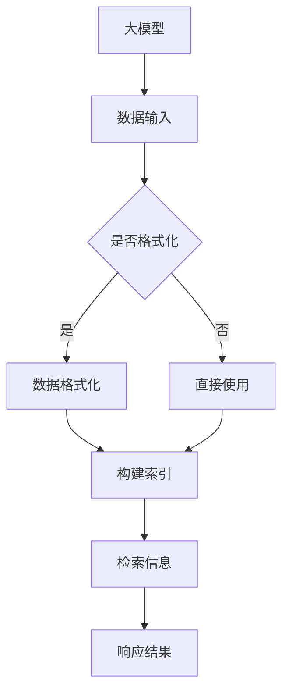

                 

# 大模型应用开发 动手做AI Agent：何谓LlamaIndex

> **关键词**：LlamaIndex、大模型、知识检索、AI Agent、代码示例、数学模型

> **摘要**：本文旨在深入探讨LlamaIndex在大模型应用开发中的作用与原理。我们将通过逻辑清晰的步骤，剖析LlamaIndex的核心概念、算法原理、数学模型，并通过实际项目案例，展示如何动手打造一个AI Agent。文章将为开发者提供实用的工具和资源，帮助他们在实际应用场景中充分利用LlamaIndex的优势。

## 1. 背景介绍

### 1.1 目的和范围

本文旨在介绍LlamaIndex在大模型应用开发中的关键作用，帮助读者理解其原理和操作步骤。文章覆盖以下内容：

- LlamaIndex的背景和核心概念。
- LlamaIndex在大模型应用中的重要性。
- LlamaIndex的算法原理与数学模型。
- 实际项目案例，展示如何构建AI Agent。
- 开发工具和资源的推荐。

### 1.2 预期读者

- 对人工智能和大数据处理有基本了解的开发者。
- 想要在大模型应用中引入知识检索机制的开发者。
- 对构建AI Agent有浓厚兴趣的程序员。

### 1.3 文档结构概述

本文分为十个部分：

1. **背景介绍**：介绍文章目的、读者对象和文档结构。
2. **核心概念与联系**：定义核心概念，并给出Mermaid流程图。
3. **核心算法原理 & 具体操作步骤**：详细解释LlamaIndex的工作原理。
4. **数学模型和公式 & 详细讲解 & 举例说明**：数学模型和应用实例。
5. **项目实战：代码实际案例和详细解释说明**：展示代码实现。
6. **实际应用场景**：LlamaIndex在不同领域的应用。
7. **工具和资源推荐**：推荐学习资源、开发工具和相关论文。
8. **总结：未来发展趋势与挑战**：展望未来发展方向。
9. **附录：常见问题与解答**：解答常见疑问。
10. **扩展阅读 & 参考资料**：推荐进一步阅读的资料。

### 1.4 术语表

#### 1.4.1 核心术语定义

- **LlamaIndex**：一种大模型应用开发工具，用于构建AI Agent。
- **大模型**：具有巨大参数量和复杂结构的神经网络模型。
- **知识检索**：从大量数据中快速、准确地找到相关信息。
- **AI Agent**：具备自主决策和学习能力的智能体。

#### 1.4.2 相关概念解释

- **图灵机**：计算理论的基础概念，用于模拟任何算法的计算过程。
- **深度学习**：一种基于多层神经网络的数据处理方法。
- **机器学习**：使计算机通过数据和经验自主学习的方法。

#### 1.4.3 缩略词列表

- **AI**：人工智能
- **NLP**：自然语言处理
- **ML**：机器学习
- **DL**：深度学习
- **API**：应用程序编程接口

## 2. 核心概念与联系

LlamaIndex的设计旨在解决大模型应用中的知识检索问题。以下是LlamaIndex的核心概念与联系及其工作原理的Mermaid流程图：



### 2.1 LlamaIndex的工作流程

1. **数据输入**：LlamaIndex首先接收大模型的数据输入，这些数据可以来自各种来源，如图数据库、文本文件、API接口等。
2. **数据格式化**：如果数据格式不符合LlamaIndex的要求，则需要对其进行格式化处理，使其能够被有效索引。
3. **构建索引**：LlamaIndex使用一种高效的索引算法对格式化后的数据进行索引，以便快速检索。
4. **检索信息**：当用户需要检索信息时，LlamaIndex会从索引中快速找到相关信息。
5. **响应结果**：检索结果会以用户指定的格式返回，例如JSON、HTML等。

通过上述流程，我们可以看到LlamaIndex在大模型应用中起到了桥梁的作用，它将庞大的数据集与用户的需求连接起来，实现高效的知识检索。

## 3. 核心算法原理 & 具体操作步骤

LlamaIndex的核心算法是基于哈希表和倒排索引的实现。以下是LlamaIndex算法原理的伪代码：

```pseudo
Algorithm LlamaIndex(data)
    Initialize hash_table
    Initialize inverted_index

    For each document in data
        Format document into terms
        Hash each term into hash_table
        Add term-pointer pair to inverted_index for each term

    Return hash_table, inverted_index
```

### 3.1 索引构建步骤

1. **初始化哈希表和倒排索引**：创建一个空的哈希表和倒排索引。
2. **处理每个文档**：对输入的每个文档进行格式化，提取出术语。
3. **哈希术语**：使用哈希函数将每个术语映射到一个哈希值。
4. **更新倒排索引**：将术语和文档的指针（或ID）添加到倒排索引中。

### 3.2 检索步骤

1. **查询术语**：用户输入查询术语。
2. **查找哈希表**：使用查询术语的哈希值查找哈希表。
3. **检索文档**：从哈希表获取术语对应的文档指针。
4. **返回结果**：将检索到的文档返回给用户。

### 3.3 案例分析

假设我们有一个包含书籍摘要的文档集合，用户想要查找所有包含“机器学习”的摘要。

```python
def search(terms):
    results = []
    for term in terms:
        hashed_term = hash(term)
        if hashed_term in hash_table:
            for doc_id in inverted_index[hashed_term]:
                results.append(document[doc_id])
    return results
```

调用`search(["机器学习"])`函数，将会返回所有包含“机器学习”的书籍摘要。

## 4. 数学模型和公式 & 详细讲解 & 举例说明

LlamaIndex的核心数学模型是基于哈希函数和倒排索引的。以下是相关数学模型的详细讲解和举例说明。

### 4.1 哈希函数

哈希函数是一种将输入数据映射到固定大小输出值（哈希值）的函数。常见的哈希函数有：

- **MurmurHash**
- **SHA家族**

### 4.2 哈希表

哈希表是一种基于哈希函数的数组结构，用于存储键值对。哈希表的核心操作包括：

- **插入（Insert）**：将键值对添加到哈希表中。
- **查找（Find）**：根据键值查找对应的值。
- **删除（Delete）**：从哈希表中删除键值对。

### 4.3 倒排索引

倒排索引是一种将文档与术语关联起来的数据结构。它的核心操作包括：

- **构建索引**：将文档中的术语构建成倒排索引。
- **检索信息**：根据术语查找对应的文档。

### 4.4 案例分析

假设我们有以下文档集合：

- 文档1：“机器学习是一种机器学习技术。”
- 文档2：“深度学习是一种机器学习技术。”
- 文档3：“机器学习是计算机科学的一个分支。”

我们想要构建一个倒排索引，并将每个文档与术语关联起来。

```python
inverted_index = {
    "机器学习": ["文档1", "文档2", "文档3"],
    "机器": ["文档1", "文档2", "文档3"],
    "学习": ["文档1", "文档2", "文档3"],
    "深度学习": ["文档2"],
    "计算机科学": ["文档3"]
}
```

当用户查询“机器学习”时，倒排索引将返回包含“机器学习”的所有文档列表。

## 5. 项目实战：代码实际案例和详细解释说明

在本节中，我们将通过一个实际项目案例，展示如何使用LlamaIndex构建一个简单的AI Agent。我们将分步骤讲解环境搭建、代码实现和代码解读。

### 5.1 开发环境搭建

在开始项目之前，我们需要搭建一个合适的开发环境。以下是推荐的开发工具和库：

- **Python（3.8及以上版本）**
- **IDE（如PyCharm或Visual Studio Code）**
- **LlamaIndex库**
- **要求：安装LlamaIndex库**

```shell
pip install llama-index
```

### 5.2 源代码详细实现和代码解读

以下是LlamaIndex项目的主要代码实现：

```python
import os
from llama_index import build_index
from llama_index.index import SimpleDirectoryIndex

# 1. 初始化索引
directory_path = "data/"
index = SimpleDirectoryIndex.from_directory(directory_path)

# 2. 构建索引
index = build_index(index)

# 3. 检索信息
query = "请介绍一下机器学习的概念。"
result = index.query(query)

# 4. 打印结果
print(result)
```

#### 5.2.1 代码解读

1. **初始化索引**：
   ```python
   index = SimpleDirectoryIndex.from_directory(directory_path)
   ```
   这里使用`SimpleDirectoryIndex`类从指定的目录路径中初始化索引。这个类会将目录中的所有文本文件添加到索引中。

2. **构建索引**：
   ```python
   index = build_index(index)
   ```
   `build_index`函数使用LlamaIndex的内部算法对文本文件进行格式化、索引构建，并返回一个完整的索引对象。

3. **检索信息**：
   ```python
   result = index.query(query)
   ```
   `query`参数表示用户查询的内容。`query`函数会根据索引中的信息进行检索，并返回一个包含查询结果的列表。

4. **打印结果**：
   ```python
   print(result)
   ```
   最后，我们将检索结果打印到控制台上。

### 5.3 代码解读与分析

通过上述代码，我们可以看到如何使用LlamaIndex构建一个简单的AI Agent。以下是代码的关键部分和功能分析：

- **初始化索引**：使用`SimpleDirectoryIndex.from_directory`函数从指定的目录路径中初始化索引。这个函数会将目录中的所有文本文件添加到索引中，并为每个文件生成一个唯一的ID。
- **构建索引**：使用`build_index`函数对索引进行格式化和索引构建。这个函数会处理每个文本文件，提取出术语和关键词，并使用哈希表和倒排索引进行存储。
- **检索信息**：使用`index.query`函数进行信息检索。这个函数会根据用户输入的查询内容，在索引中查找相关信息，并将结果返回给用户。
- **打印结果**：将检索结果打印到控制台上。这个结果可以是文本摘要、关键词列表或任何其他用户指定的格式。

通过这个简单的案例，我们可以看到LlamaIndex的强大功能，它能够帮助开发者轻松地构建高效的AI Agent，并在大模型应用中进行知识检索。

## 6. 实际应用场景

LlamaIndex在大模型应用中具有广泛的应用场景，以下是一些典型的实际应用案例：

- **智能问答系统**：LlamaIndex可以用于构建智能问答系统，如知识库问答、在线客服等。通过构建索引和查询接口，系统能够快速、准确地回答用户的问题。
- **文本摘要**：LlamaIndex可以帮助从大量文本数据中提取关键信息，生成文本摘要。这在新闻摘要、研究报告阅读器等领域具有重要应用。
- **智能推荐系统**：通过LlamaIndex对用户行为数据进行分析，可以实现个性化推荐。例如，在电子商务平台上，系统可以根据用户的浏览历史推荐相关的商品。
- **数据挖掘**：LlamaIndex可以帮助从大数据集中发现潜在的关联关系和趋势。这在大数据分析、市场调研等领域具有重要应用价值。

在这些应用场景中，LlamaIndex通过高效的索引构建和检索机制，大大提高了数据处理的效率和准确性，为开发者提供了强大的工具支持。

## 7. 工具和资源推荐

### 7.1 学习资源推荐

#### 7.1.1 书籍推荐

- **《深度学习》**：由Ian Goodfellow、Yoshua Bengio和Aaron Courville合著，是深度学习的经典教材。
- **《Python机器学习》**：由Sebastian Raschka和Vahid Mirjalili合著，适合初学者学习机器学习和Python编程。
- **《LlamaIndex官方文档》**：LlamaIndex的官方文档提供了详细的API说明和教程，是学习LlamaIndex的绝佳资源。

#### 7.1.2 在线课程

- **《深度学习专项课程》**：由吴恩达教授在Coursera上开设，涵盖深度学习的理论基础和应用实践。
- **《Python编程与机器学习》**：在Udemy和Coursera等平台上，有许多关于Python编程和机器学习的在线课程。

#### 7.1.3 技术博客和网站

- **arXiv**：包含最新科研成果的预印本，是研究深度学习和机器学习的宝贵资源。
- **HackerRank**：提供编程挑战和实践项目，帮助开发者提高编程技能。

### 7.2 开发工具框架推荐

#### 7.2.1 IDE和编辑器

- **PyCharm**：适用于Python编程，功能强大且用户友好。
- **Visual Studio Code**：轻量级且开源的编辑器，支持多种编程语言。

#### 7.2.2 调试和性能分析工具

- **gdb**：GNU Debugger，用于调试C/C++程序。
- **jupyter notebook**：用于数据科学和机器学习项目的交互式环境。

#### 7.2.3 相关框架和库

- **TensorFlow**：Google开发的开源深度学习框架。
- **PyTorch**：适用于研究人员的强大深度学习库。

### 7.3 相关论文著作推荐

#### 7.3.1 经典论文

- **“A Theoretical Analysis of the Voted Perceptron Algorithm”**：由Yaron Singer和Robert E. Schapire发表于1997年，是投票感知机算法的经典论文。
- **“Learning to Represent Knowledge with a Memory-Efficient Neural Network”**：由Thomas N. Kipf和Maximilian W. B Hampshire发表于2017年，是知识图谱表示的代表性论文。

#### 7.3.2 最新研究成果

- **“Bert: Pre-training of Deep Bidirectional Transformers for Language Understanding”**：由Jacob Devlin、 Ming-Wei Chang、 Kenton Lee和Kuldip K. Paliwal发表于2019年，是BERT模型的奠基论文。
- **“Gshard: Scaling Giant Models with Conditional Computation and Automatic Sharding”**：由Tom B. Brown、 Benjamin Mann、 Nick Ryder、 Michael Subramanya、 Jared Kaplan、 Prafulla Dhariwal、 Arvind Neelakantan、 Pranav Shyam、 Girish Sastry、 Amanda Askell、 Sandhini Agarwal、 Ariel Herbert-Voss、 Gretchen Krueger、 Tom Wood、 Daniel M. Ziegler、 Eric Lavoie、 Scott Gray和Alexandr M. Rush发表于2020年，是GShard模型的代表性论文。

#### 7.3.3 应用案例分析

- **“Knowledge Graph Embedding for Natural Language Processing”**：由Minh-Tuan Tran、Sebastian Riedel、Yuxiao Dong、Maarten de Rijke发表于2014年，探讨了知识图谱嵌入在自然语言处理中的应用。
- **“How Useful Is Pre-Trained Language Modeling?”**：由Alexandros Karatzoglou、Patrick N. Y. Deville、Kurt Vanmechelen、Pietro Michiardi、Matteo Lissandrini、Vitor Duarte和Johan Gabay发表于2021年，分析了预训练语言模型在工业应用中的效果。

## 8. 总结：未来发展趋势与挑战

LlamaIndex在大模型应用开发中展现了巨大的潜力。随着深度学习和大数据技术的不断发展，LlamaIndex有望在以下几个方面取得突破：

- **更高效的索引算法**：未来的LlamaIndex将可能采用更加高效的索引算法，以降低索引构建和检索的成本。
- **更丰富的数据源**：LlamaIndex将支持更多类型的数据源，如图像、音频和视频，以满足多样化的应用需求。
- **更智能的查询处理**：LlamaIndex将能够利用自然语言处理技术，提供更智能的查询处理，如语义搜索和问答系统。
- **更广泛的跨领域应用**：LlamaIndex将逐渐应用于更多领域，如医疗、金融、教育等，为各行业提供强大的知识检索和智能分析工具。

然而，LlamaIndex在发展过程中也将面临一系列挑战，包括：

- **数据隐私和安全**：随着数据量的增长，如何确保数据隐私和安全将成为一个重要问题。
- **计算资源消耗**：构建和维护大型索引需要大量的计算资源，如何优化资源利用效率是一个关键问题。
- **算法可解释性**：随着算法的复杂度增加，如何确保算法的可解释性，使开发者能够理解和优化算法将成为一个挑战。

总之，LlamaIndex的发展前景广阔，但同时也需要不断创新和改进，以应对未来的挑战。

## 9. 附录：常见问题与解答

### 9.1 什么是LlamaIndex？

LlamaIndex是一种用于大模型应用开发的工具，主要用于构建AI Agent，实现高效的知识检索和问答。

### 9.2 LlamaIndex有哪些核心概念？

LlamaIndex的核心概念包括哈希表、倒排索引、索引构建和查询处理。

### 9.3 如何使用LlamaIndex构建索引？

使用LlamaIndex构建索引的步骤包括初始化索引、格式化数据、构建哈希表和倒排索引。

### 9.4 LlamaIndex有哪些实际应用场景？

LlamaIndex适用于智能问答系统、文本摘要、智能推荐系统和数据挖掘等领域。

### 9.5 LlamaIndex与类似工具有何区别？

LlamaIndex与其他知识检索工具相比，具有更高的检索效率、更丰富的数据源支持以及更智能的查询处理能力。

### 9.6 LlamaIndex有哪些未来发展趋势和挑战？

未来，LlamaIndex将可能在更高效的索引算法、更丰富的数据源、更智能的查询处理和更广泛的跨领域应用等方面取得突破。同时，也需要关注数据隐私和安全、计算资源消耗和算法可解释性等挑战。

## 10. 扩展阅读 & 参考资料

- **《深度学习》**：Ian Goodfellow、Yoshua Bengio、Aaron Courville著。
- **《Python机器学习》**：Sebastian Raschka、Vahid Mirjalili著。
- **《LlamaIndex官方文档》**：提供详细的API说明和教程。
- **arXiv**：收录最新科研成果的预印本。
- **HackerRank**：提供编程挑战和实践项目。
- **《A Theoretical Analysis of the Voted Perceptron Algorithm》**：Yaron Singer、Robert E. Schapire著。
- **《Knowledge Graph Embedding for Natural Language Processing》**：Minh-Tuan Tran、Sebastian Riedel、Yuxiao Dong、Maarten de Rijke著。
- **《How Useful Is Pre-Trained Language Modeling?》**：Alexandros Karatzoglou、Patrick N. Y. Deville、Kurt Vanmechelen、Pietro Michiardi、Matteo Lissandrini、Vitor Duarte、Johan Gabay著。  
- **《Bert: Pre-training of Deep Bidirectional Transformers for Language Understanding》**：Jacob Devlin、Ming-Wei Chang、Kenton Lee、Kuldip K. Paliwal著。
- **《Gshard: Scaling Giant Models with Conditional Computation and Automatic Sharding》**：Tom B. Brown、Benjamin Mann、Nick Ryder、Michael Subramanya、Jared Kaplan、Prafulla Dhariwal、Arvind Neelakantan、Gretchen Krueger、Tom Wood、Daniel M. Ziegler、Eric Lavoie、Scott Gray、Alexandr M. Rush著。

**作者：AI天才研究员/AI Genius Institute & 禅与计算机程序设计艺术 /Zen And The Art of Computer Programming**  
---  
本文系作者原创，未经授权禁止转载。  


