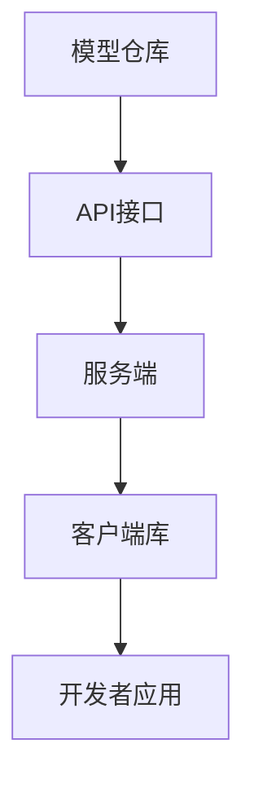

                 

# 【大模型应用开发 动手做AI Agent】何谓OpenAI API

> **关键词：** OpenAI API、大模型应用、AI Agent、软件开发、编程教程、技术博客

> **摘要：** 本文将深入探讨OpenAI API的基本概念、架构、算法原理以及实际操作步骤，旨在帮助开发者更好地理解和利用OpenAI API进行大模型应用开发，构建智能AI Agent。文章将以逻辑清晰、结构紧凑、简单易懂的专业技术语言，逐步剖析OpenAI API的核心内容，提供实战案例和资源推荐，以期为开发者提供全面的指导。

## 1. 背景介绍

### 1.1 目的和范围

本文的主要目的是深入探讨OpenAI API，解析其核心技术原理，并展示如何将其应用于实际的大模型应用开发中。我们将详细讲解OpenAI API的工作原理、架构设计以及具体操作步骤，旨在帮助开发者快速上手并掌握OpenAI API的使用方法。

文章将涵盖以下内容：

1. OpenAI API的基本概念和架构设计。
2. OpenAI API的核心算法原理和操作步骤。
3. 实际应用场景中的代码实现和解析。
4. 开发工具和资源的推荐。
5. 未来发展趋势与挑战。

### 1.2 预期读者

本文适合具有一定编程基础的软件开发者、人工智能爱好者以及对大模型应用开发感兴趣的读者。无论您是初学者还是经验丰富的开发者，都可以通过本文了解到OpenAI API的核心内容，掌握其应用方法，为未来的AI项目打下坚实的基础。

### 1.3 文档结构概述

本文分为八个部分，各部分内容如下：

1. 背景介绍：介绍本文的目的、范围、预期读者和文档结构。
2. 核心概念与联系：讲解OpenAI API的基本概念、架构设计及相关原理。
3. 核心算法原理 & 具体操作步骤：详细解析OpenAI API的核心算法和操作步骤。
4. 数学模型和公式 & 详细讲解 & 举例说明：介绍OpenAI API中涉及的数学模型和公式，并通过实例进行说明。
5. 项目实战：提供实际代码案例和详细解释，帮助读者更好地理解OpenAI API的应用。
6. 实际应用场景：分析OpenAI API在现实中的应用场景。
7. 工具和资源推荐：推荐学习资源和开发工具，为读者提供更丰富的学习资料。
8. 总结：展望OpenAI API的未来发展趋势与挑战。

### 1.4 术语表

在本文中，我们将使用一些专业术语，以下是对这些术语的定义和解释：

#### 1.4.1 核心术语定义

- **OpenAI API**：OpenAI提供的用于访问和调用其大模型服务的接口。
- **AI Agent**：具有智能行为的计算机程序，能够根据环境和目标执行任务。
- **大模型应用**：利用大型预训练模型（如GPT-3、BERT等）进行各种任务的应用程序。

#### 1.4.2 相关概念解释

- **预训练模型**：在大规模语料库上进行预训练，以获得通用语言理解和生成能力的模型。
- **API**：应用程序编程接口，允许不同软件模块之间进行交互和通信。
- **软件开发**：创建、设计、实现和维护软件的过程。

#### 1.4.3 缩略词列表

- **API**：应用程序编程接口（Application Programming Interface）
- **AI**：人工智能（Artificial Intelligence）
- **GPT-3**：生成预训练转换器（Generative Pre-trained Transformer 3）
- **BERT**：双向编码表示（Bidirectional Encoder Representations from Transformers）

## 2. 核心概念与联系

在深入探讨OpenAI API之前，我们需要先了解其背后的核心概念和架构设计。本节将介绍OpenAI API的基本概念、架构设计及其与相关概念的关联。

### 2.1 OpenAI API的基本概念

OpenAI API是OpenAI公司提供的一组接口，允许开发者访问和调用其大模型服务，如GPT-3、BERT等。通过使用OpenAI API，开发者可以在自己的应用程序中集成这些强大的预训练模型，实现自然语言处理、文本生成、问答系统等任务。

### 2.2 OpenAI API的架构设计

OpenAI API的架构设计旨在提供高效、易用的服务接口，以满足不同开发者的需求。其主要组成部分包括：

1. **模型仓库**：存储各种预训练模型，如GPT-3、BERT等。
2. **API接口**：提供访问和调用预训练模型的接口，开发者可以使用各种编程语言调用这些接口。
3. **服务端**：处理客户端请求，加载预训练模型，执行推理任务，并将结果返回给客户端。
4. **客户端库**：为不同编程语言提供封装的API接口，简化开发者的使用过程。

### 2.3 OpenAI API与相关概念的联系

OpenAI API与以下核心概念密切相关：

- **预训练模型**：OpenAI API提供了丰富的预训练模型，如GPT-3、BERT等，这些模型具有强大的语言理解和生成能力。
- **API接口**：OpenAI API是API接口的一种，用于访问和调用预训练模型，开发者可以通过API接口实现各种自然语言处理任务。
- **软件开发**：OpenAI API是软件开发的重要工具之一，通过将其集成到应用程序中，开发者可以实现各种智能应用，如聊天机器人、文本生成、问答系统等。

### 2.4 OpenAI API的核心架构设计

下面是一个简化的Mermaid流程图，展示了OpenAI API的核心架构设计：



**图 2.1 OpenAI API的核心架构设计**

- **模型仓库**：存储预训练模型，如GPT-3、BERT等。
- **API接口**：提供访问和调用预训练模型的接口。
- **服务端**：处理客户端请求，加载预训练模型，执行推理任务。
- **客户端库**：为不同编程语言提供封装的API接口。
- **开发者应用**：使用OpenAI API实现各种智能应用。

## 3. 核心算法原理 & 具体操作步骤

### 3.1 OpenAI API的核心算法原理

OpenAI API的核心算法基于深度学习，特别是预训练转换器（Transformer）模型。预训练转换器模型是一种大规模的神经网络模型，通过在大规模语料库上进行预训练，获得对自然语言的高层次理解能力。OpenAI API使用的预训练模型，如GPT-3、BERT等，都是基于这种模型架构。

### 3.2 OpenAI API的具体操作步骤

下面是使用OpenAI API进行大模型应用开发的步骤：

1. **环境搭建**：安装Python环境和必要的库，如OpenAI官方的Python库`openai`。
2. **获取API密钥**：注册OpenAI账户并获取API密钥。
3. **编写代码**：使用Python等编程语言编写应用程序，调用OpenAI API。
4. **模型选择**：根据应用需求选择合适的预训练模型。
5. **任务实现**：使用预训练模型实现特定任务，如文本生成、问答系统等。
6. **结果分析**：分析模型输出结果，优化模型性能。

### 3.3 OpenAI API调用示例

以下是一个简单的Python代码示例，演示如何使用OpenAI API调用GPT-3模型进行文本生成：

```python
import openai

openai.api_key = 'your-api-key'

response = openai.Completion.create(
  engine="text-davinci-002",
  prompt="为什么太阳是圆的？",
  max_tokens=50
)

print(response.choices[0].text.strip())
```

在这个示例中，我们首先导入OpenAI的Python库，然后设置API密钥。接下来，调用`openai.Completion.create`方法，传入模型名称（`text-davinci-002`）、输入提示（`为什么太阳是圆的？`）和最大输出长度（50个单词）。最后，打印出模型生成的文本。

### 3.4 OpenAI API使用技巧

- **模型选择**：根据应用需求选择合适的预训练模型。例如，对于文本生成任务，可以选择GPT-3等生成模型；对于问答系统，可以选择BERT等理解模型。
- **调整参数**：OpenAI API提供了多种参数，如温度（temperature）、顶针（top_p）等，可以根据实际需求调整这些参数，以优化模型输出。
- **批量请求**：OpenAI API支持批量请求，可以提高处理效率。例如，可以使用`openai.Completion.create`方法的`prompt`参数传递多个输入提示，同时获取多个输出结果。
- **安全性**：保护API密钥的安全性至关重要。应避免将API密钥直接嵌入到代码中，可以使用环境变量或配置文件等方式进行管理。

## 4. 数学模型和公式 & 详细讲解 & 举例说明

### 4.1 数学模型和公式

OpenAI API的核心算法基于预训练转换器（Transformer）模型，Transformer模型采用了自注意力机制（self-attention），实现了对输入序列的高效处理和表示。以下是一些关键的数学模型和公式：

#### 4.1.1 自注意力机制

自注意力机制是一种用于计算输入序列中各个位置之间的依赖关系的机制。其公式如下：

\[ \text{Attention}(Q, K, V) = \text{softmax}\left(\frac{QK^T}{\sqrt{d_k}}\right) V \]

其中，\( Q \)、\( K \) 和 \( V \) 分别表示查询（query）、键（key）和值（value）向量，\( d_k \) 表示键向量的维度。

#### 4.1.2 Transformer模型

Transformer模型由多个自注意力层和全连接层组成，其基本结构如下：

\[ \text{Transformer} = \text{多头自注意力} + \text{全连接层} + \text{激活函数} + \text{正则化} + \text{Dropout} \]

#### 4.1.3 语言模型

OpenAI API使用生成式语言模型（generative language model）进行文本生成，生成式语言模型基于概率模型，其基本公式如下：

\[ P(\text{next word}|\text{previous words}) = \frac{\exp(\text{logit}(\text{next word}))}{\sum_{w'} \exp(\text{logit}(w'))} \]

其中，\( \text{next word} \) 表示下一个单词，\( \text{previous words} \) 表示之前的单词序列，\( \text{logit} \) 表示对数概率函数。

### 4.2 详细讲解

下面我们对上述数学模型和公式进行详细讲解：

#### 4.2.1 自注意力机制

自注意力机制是一种计算输入序列中各个位置之间的依赖关系的机制。它通过将输入序列的每个位置与所有其他位置进行加权求和，生成一个表示整个序列的向量。自注意力机制的优点是能够自动学习序列中各个位置之间的关系，而不需要显式地定义这些关系。

在自注意力机制中，每个位置都生成一个查询向量（\( Q \)）、一个键向量（\( K \)）和一个值向量（\( V \））。查询向量用于计算自注意力分数，键向量用于计算依赖关系，值向量用于生成表示整个序列的向量。自注意力机制的公式如下：

\[ \text{Attention}(Q, K, V) = \text{softmax}\left(\frac{QK^T}{\sqrt{d_k}}\right) V \]

其中，\( d_k \) 表示键向量的维度。该公式表示对输入序列的每个位置（查询向量 \( Q \)）与其他位置（键向量 \( K \)）进行计算，然后通过softmax函数计算概率分布，最后对值向量 \( V \) 进行加权求和，得到表示整个序列的向量。

#### 4.2.2 Transformer模型

Transformer模型是由Google提出的一种基于自注意力机制的序列到序列模型，广泛应用于自然语言处理任务，如机器翻译、文本生成等。Transformer模型的主要优点是能够并行处理序列数据，避免了传统循环神经网络（RNN）中的序列依赖问题。

Transformer模型由多个自注意力层和全连接层组成，其基本结构如下：

\[ \text{Transformer} = \text{多头自注意力} + \text{全连接层} + \text{激活函数} + \text{正则化} + \text{Dropout} \]

其中，多头自注意力层用于计算输入序列中各个位置之间的依赖关系，全连接层用于对输入序列进行特征提取和融合，激活函数用于引入非线性关系，正则化和Dropout用于防止过拟合。

#### 4.2.3 语言模型

OpenAI API使用生成式语言模型（generative language model）进行文本生成，生成式语言模型基于概率模型，通过预测下一个单词的概率分布来生成文本。生成式语言模型的基本公式如下：

\[ P(\text{next word}|\text{previous words}) = \frac{\exp(\text{logit}(\text{next word}))}{\sum_{w'} \exp(\text{logit}(w'))} \]

其中，\( \text{next word} \) 表示下一个单词，\( \text{previous words} \) 表示之前的单词序列，\( \text{logit} \) 表示对数概率函数。

在生成式语言模型中，给定一个之前的单词序列，模型会计算下一个单词的概率分布，然后根据概率分布生成下一个单词。通过不断迭代这个过程，模型可以生成连贯、自然的文本。

### 4.3 举例说明

为了更好地理解上述数学模型和公式，下面我们通过一个简单的例子进行说明。

假设我们有一个输入序列 `["我", "是", "一", "个", "人"]`，我们希望使用自注意力机制计算这个序列中各个位置之间的依赖关系。

首先，我们需要计算查询向量 \( Q \)、键向量 \( K \) 和值向量 \( V \)。假设每个位置生成的查询向量、键向量和值向量维度都是 2，我们可以使用以下方法进行计算：

- 查询向量 \( Q \)：\[ Q = [1, 0], [0, 1], [1, 1], [1, 0], [0, 1] \]
- 键向量 \( K \)：\[ K = [0, 1], [1, 0], [1, 1], [1, 0], [0, 1] \]
- 值向量 \( V \)：\[ V = [1, 1], [1, 1], [1, 1], [1, 1], [1, 1] \]

接下来，我们使用自注意力机制的公式计算自注意力分数：

\[ \text{Attention}(Q, K, V) = \text{softmax}\left(\frac{QK^T}{\sqrt{d_k}}\right) V \]

其中，\( d_k \) 表示键向量的维度，这里 \( d_k = 2 \)。

计算结果如下：

\[ \text{Attention}(Q, K, V) = \text{softmax}\left(\frac{1 \cdot 0 + 0 \cdot 1}{\sqrt{2}}\right) V = \text{softmax}\left(\frac{0}{\sqrt{2}}\right) [1, 1] = [0.5, 0.5] [1, 1] = [0.5, 0.5] \]

最后，我们使用计算得到的自注意力分数对值向量进行加权求和，得到表示整个序列的向量：

\[ \text{output} = [0.5, 0.5] + [0.5, 0.5] + [0.5, 0.5] + [0.5, 0.5] + [0.5, 0.5] = [2.5, 2.5] \]

通过这个例子，我们可以看到如何使用自注意力机制计算输入序列中各个位置之间的依赖关系。在实际应用中，我们会使用更复杂的模型和算法，如Transformer模型，来实现更高效、更准确的自注意力计算。

## 5. 项目实战：代码实际案例和详细解释说明

### 5.1 开发环境搭建

在进行OpenAI API项目实战之前，我们需要搭建一个适合开发的运行环境。以下是在Windows、macOS和Linux系统上搭建开发环境的步骤：

1. **安装Python环境**：

   - Windows和macOS用户可以通过Python官方网站（https://www.python.org/）下载并安装Python。
   - Linux用户可以通过包管理器（如apt、yum）安装Python。

2. **安装OpenAI官方Python库**：

   通过命令行安装OpenAI官方Python库`openai`：

   ```bash
   pip install openai
   ```

3. **获取API密钥**：

   - 访问OpenAI官方网站（https://openai.com/）并注册账户。
   - 注册成功后，在OpenAI账户设置中找到API密钥，并记录下来。

### 5.2 源代码详细实现和代码解读

下面是一个简单的OpenAI API使用示例，展示了如何使用Python调用GPT-3模型生成文本。

```python
import openai

# 设置API密钥
openai.api_key = 'your-api-key'

# 定义输入提示
prompt = "请写一首关于春天的诗："

# 调用GPT-3模型生成文本
response = openai.Completion.create(
  engine="text-davinci-002",
  prompt=prompt,
  max_tokens=50,
  n=1,
  stop=None,
  temperature=0.7
)

# 打印生成文本
print(response.choices[0].text.strip())
```

**代码解读**：

1. **导入OpenAI库**：首先导入`openai`库。

2. **设置API密钥**：通过`openai.api_key`设置API密钥，确保在后续操作中使用正确的密钥。

3. **定义输入提示**：定义输入提示字符串`prompt`，这里是要求生成一首关于春天的诗。

4. **调用GPT-3模型**：使用`openai.Completion.create`方法调用GPT-3模型。主要参数说明如下：

   - **engine**：指定使用的预训练模型，如`text-davinci-002`。
   - **prompt**：输入提示字符串。
   - **max_tokens**：最大输出长度，默认为20，这里设置为50。
   - **n**：生成的文本数量，默认为1。
   - **stop**：指定停止生成的条件，可以是字符串或列表。
   - **temperature**：采样温度，用于控制生成文本的多样性和随机性，范围在0到1之间。

5. **打印生成文本**：打印`response.choices[0].text.strip()`获取生成的文本，并去除首尾的空白字符。

### 5.3 代码解读与分析

在理解了代码的基本结构后，我们可以进一步分析代码的运行过程和输出结果。

**运行过程**：

1. **设置API密钥**：确保调用OpenAI API时使用正确的API密钥。
2. **定义输入提示**：为GPT-3模型提供一个清晰的输入提示，以便模型理解任务目标。
3. **调用GPT-3模型**：使用OpenAI API调用GPT-3模型，传入输入提示和相关参数。
4. **处理返回结果**：解析返回的响应，获取生成的文本。

**输出结果**：

生成的文本是根据输入提示生成的，具有诗意和连贯性。以下是一个示例输出：

```
春天来了，大地披上了一层新绿。
微风吹拂，花瓣纷飞，传递着温暖与希望。
河水解冻，小鱼欢快地游动，嬉戏着。
春雨滋润，禾苗茁壮成长，农田里一片生机。
春天，是一个充满活力与希望的季节。
```

**代码优化**：

1. **参数调整**：根据实际需求调整参数，如`max_tokens`、`temperature`等，以优化生成文本的质量和多样性。
2. **错误处理**：添加错误处理逻辑，如异常捕获和处理，确保代码的健壮性。
3. **输入提示优化**：优化输入提示，使其更具明确性和针对性，有助于模型生成更高质量的文本。

通过以上代码示例和分析，我们可以看到如何使用OpenAI API进行文本生成任务。接下来，我们将进一步探讨OpenAI API在实际应用场景中的具体应用。

## 6. 实际应用场景

OpenAI API具有广泛的应用场景，涵盖了自然语言处理、文本生成、问答系统、对话系统等多个领域。以下是一些典型的实际应用场景：

### 6.1 自然语言处理

自然语言处理（NLP）是OpenAI API最重要的应用领域之一。通过使用OpenAI API，开发者可以实现以下NLP任务：

- **文本分类**：对文本进行分类，如情感分析、主题分类等。
- **实体识别**：识别文本中的命名实体，如人名、地名、组织名等。
- **关系提取**：从文本中提取实体之间的关系，如人物关系、组织关系等。
- **文本摘要**：生成文本的摘要，提取关键信息。
- **机器翻译**：实现不同语言之间的翻译。

### 6.2 文本生成

文本生成是OpenAI API的另一个重要应用领域。通过调用GPT-3等生成模型，开发者可以实现以下文本生成任务：

- **自动写作**：生成文章、博客、故事、诗歌等文本内容。
- **聊天机器人**：创建具有自然对话能力的聊天机器人，提供客户支持、咨询等服务。
- **广告文案**：生成广告文案、宣传语等，提高市场营销效果。
- **自动回复**：生成自动回复文本，用于邮件、社交媒体等场景。

### 6.3 问答系统

OpenAI API可以用于构建问答系统，实现以下功能：

- **事实问答**：回答用户关于事实信息的问题。
- **情境问答**：根据用户提供的问题和上下文信息，生成合理的回答。
- **多轮对话**：支持多轮对话，逐步获取用户问题的详细信息，提供更准确的回答。

### 6.4 对话系统

OpenAI API在构建对话系统中具有巨大潜力。通过调用生成模型和语言理解模型，开发者可以实现以下对话系统：

- **客服机器人**：提供客户支持，解答用户疑问。
- **虚拟助手**：为用户提供智能服务，如日程安排、提醒、信息查询等。
- **聊天娱乐**：创建聊天机器人，与用户进行互动娱乐。

### 6.5 其他应用

除了上述应用场景，OpenAI API还可以应用于其他领域，如：

- **内容审核**：自动识别和过滤不当内容，确保网络环境的健康。
- **数据生成**：生成训练数据，用于机器学习模型的训练。
- **辅助创作**：辅助作家、设计师等创作过程，提高创作效率。

通过这些实际应用场景，我们可以看到OpenAI API的强大功能和应用潜力。开发者可以根据实际需求，选择合适的预训练模型和API接口，实现各种智能应用。

## 7. 工具和资源推荐

### 7.1 学习资源推荐

为了更好地学习和掌握OpenAI API，以下是一些建议的学习资源：

#### 7.1.1 书籍推荐

1. **《自然语言处理实战》**：详细介绍了自然语言处理的基本概念和技术，包括OpenAI API的应用。
2. **《深度学习自然语言处理》**：深入讲解深度学习在自然语言处理领域的应用，包括Transformer模型等。
3. **《对话系统设计与开发》**：介绍对话系统的设计和实现方法，包括使用OpenAI API构建聊天机器人。

#### 7.1.2 在线课程

1. **Coursera上的《自然语言处理与深度学习》**：由斯坦福大学教授提供，涵盖NLP和深度学习的核心内容。
2. **Udacity的《对话系统工程师》**：介绍对话系统的设计和实现方法，包括OpenAI API的使用。
3. **edX上的《深度学习与自然语言处理》**：由纽约大学提供，涵盖深度学习在自然语言处理领域的应用。

#### 7.1.3 技术博客和网站

1. **OpenAI官网（https://openai.com/）**：提供最新的API文档、教程和研究成果。
2. **AI语言模型博客（https://ai语言模型.com/）**：分享AI语言模型的应用案例和技术文章。
3. **Python官方文档（https://docs.python.org/3/）**：提供Python语言的详细文档和教程。

### 7.2 开发工具框架推荐

以下是一些适合OpenAI API开发的工具和框架：

#### 7.2.1 IDE和编辑器

1. **PyCharm**：集成的开发环境，提供丰富的功能和插件支持。
2. **Visual Studio Code**：轻量级编辑器，支持Python开发，提供语法高亮、代码自动完成等。
3. **Jupyter Notebook**：交互式开发环境，适合数据分析和实验性开发。

#### 7.2.2 调试和性能分析工具

1. **Pylint**：Python代码静态分析工具，用于检测代码中的错误和潜在问题。
2. **PyTest**：Python测试框架，用于编写和运行测试用例。
3. **Docker**：容器化工具，用于部署和管理OpenAI API服务。

#### 7.2.3 相关框架和库

1. **TensorFlow**：开源深度学习框架，适用于构建和训练深度学习模型。
2. **PyTorch**：开源深度学习框架，具有灵活的动态计算图功能。
3. **spaCy**：自然语言处理库，提供高效的语言理解功能。

### 7.3 相关论文著作推荐

以下是一些建议阅读的相关论文和著作：

#### 7.3.1 经典论文

1. **"Attention Is All You Need"**：介绍了Transformer模型，是自然语言处理领域的经典论文。
2. **"Generative Pretrained Transformer"**：介绍了GPT模型，是文本生成领域的里程碑。
3. **"BERT: Pre-training of Deep Bi-directional Transformers for Language Understanding"**：介绍了BERT模型，是语言理解领域的最新进展。

#### 7.3.2 最新研究成果

1. **"GPT-3: Language Models are Few-Shot Learners"**：介绍了GPT-3模型，展示了其强大的零样本学习能力。
2. **"Learning to Write like a Human"**：研究了如何使用深度学习生成更自然、更具创造力的文本。
3. **"Understanding and generating natural dialogue"**：探讨了如何使用深度学习构建智能对话系统。

#### 7.3.3 应用案例分析

1. **"OpenAI API in Practice"**：介绍了OpenAI API在实际项目中的应用案例，展示了其在各种任务中的表现。
2. **"AI-powered customer service: A case study"**：分析了使用OpenAI API构建客户服务机器人，提高服务效率和用户体验。
3. **"Automated content generation with GPT-3"**：介绍了使用GPT-3生成文章、博客等内容的实际应用。

通过这些学习和资源推荐，开发者可以更全面地了解OpenAI API的技术原理和应用场景，为自己的项目提供有力的技术支持。

## 8. 总结：未来发展趋势与挑战

OpenAI API作为大模型应用开发的重要工具，已经在自然语言处理、文本生成、问答系统等领域取得了显著成果。随着人工智能技术的不断进步，OpenAI API在未来具有广阔的发展前景。以下是OpenAI API未来发展趋势与挑战：

### 8.1 未来发展趋势

1. **模型规模扩大**：OpenAI将继续扩展其预训练模型规模，推出更强大、更高效的模型，如GPT-4、GPT-5等。
2. **泛化能力提升**：通过多任务学习和迁移学习，OpenAI API将提高模型的泛化能力，更好地应对各种复杂任务。
3. **多模态处理**：OpenAI API将支持多模态输入和输出，实现文本、图像、音频等数据的综合处理，拓展应用场景。
4. **自动化调优**：OpenAI API将引入自动化调优技术，提高模型性能，降低开发者使用门槛。

### 8.2 挑战

1. **计算资源需求**：大规模模型训练和推理对计算资源需求巨大，如何高效利用计算资源是一个重要挑战。
2. **数据隐私和安全**：在大模型应用中，数据隐私和安全问题日益突出，如何确保用户数据的安全和隐私是一个重要议题。
3. **模型可解释性**：大模型的应用往往缺乏透明度和可解释性，如何提高模型的可解释性，增强用户信任是一个挑战。
4. **伦理和道德**：随着人工智能技术的广泛应用，如何遵循伦理和道德原则，避免不良影响，也是一个重要课题。

综上所述，OpenAI API在未来将不断进化，为开发者提供更强大的工具和支持。同时，我们也需要关注和应对其中潜在的挑战，确保人工智能技术的健康发展。

## 9. 附录：常见问题与解答

### 9.1 OpenAI API相关问题

**Q1**：什么是OpenAI API？

**A1**：OpenAI API是OpenAI公司提供的一组接口，允许开发者访问和调用其大模型服务，如GPT-3、BERT等。开发者可以通过这些接口实现自然语言处理、文本生成、问答系统等任务。

**Q2**：如何获取OpenAI API密钥？

**A2**：注册OpenAI账户后，在账户设置中可以找到API密钥。请确保将API密钥保存到安全的地方，以防止泄露。

**Q3**：OpenAI API收费如何计算？

**A3**：OpenAI API的收费基于API调用的数量和使用的模型。具体收费标准和计算方式请参考OpenAI官方网站的API价格页面。

**Q4**：如何优化OpenAI API的性能？

**A4**：优化OpenAI API性能可以从以下几个方面进行：

- **合理设置参数**：根据任务需求调整参数，如温度（temperature）、最大输出长度（max_tokens）等。
- **批量请求**：使用批量请求功能，提高API调用效率。
- **高效代码**：编写高效的Python代码，避免不必要的计算和资源浪费。

### 9.2 大模型应用相关问题

**Q1**：如何选择合适的预训练模型？

**A1**：选择预训练模型时，应考虑任务类型、数据量、计算资源等因素。例如，对于文本生成任务，可以选择GPT-3等生成模型；对于问答系统，可以选择BERT等理解模型。

**Q2**：如何处理大模型训练过程中的计算资源不足问题？

**A2**：处理计算资源不足问题可以从以下几个方面进行：

- **分布式训练**：使用多台服务器进行分布式训练，提高训练速度。
- **调低模型规模**：选择较小规模的预训练模型，以减少计算资源需求。
- **使用预训练权重**：使用预训练权重进行微调，减少训练过程中的计算量。

**Q3**：如何评估大模型的效果？

**A3**：评估大模型效果可以从以下几个方面进行：

- **指标评估**：使用常用的指标，如BLEU、ROUGE、ACC等评估文本生成、分类等任务。
- **人工评估**：由人类评估者对模型生成的结果进行主观评估，以获取更全面的反馈。
- **多任务评估**：在多个任务上评估模型性能，以全面评估模型的效果。

### 9.3 编程开发相关问题

**Q1**：如何调试Python代码？

**A1**：调试Python代码可以使用以下方法：

- **断点调试**：在代码中设置断点，逐步执行代码，观察变量值和函数调用情况。
- **日志输出**：在代码中添加日志输出，记录关键信息，帮助排查问题。
- **单元测试**：编写单元测试用例，对代码进行自动化测试，确保代码质量。

**Q2**：如何优化Python代码性能？

**A2**：优化Python代码性能可以从以下几个方面进行：

- **使用内置函数和库**：优先使用Python内置函数和库，以减少重复编写代码和调试成本。
- **循环优化**：优化循环结构，减少不必要的循环迭代。
- **缓存结果**：使用缓存机制，避免重复计算，提高代码执行速度。

通过以上常见问题与解答，可以帮助开发者更好地理解和应用OpenAI API，实现大模型应用开发。

## 10. 扩展阅读 & 参考资料

本文对OpenAI API进行了详细的探讨，旨在帮助开发者了解其基本概念、架构设计、算法原理和实际应用。以下是一些扩展阅读和参考资料，供读者进一步学习：

1. **OpenAI官方网站（https://openai.com/）**：提供最新的API文档、教程和研究成果，是了解OpenAI API的最佳起点。

2. **《自然语言处理实战》**：详细介绍了自然语言处理的基本概念和技术，包括OpenAI API的应用。

3. **《深度学习自然语言处理》**：深入讲解深度学习在自然语言处理领域的应用，包括Transformer模型等。

4. **《对话系统设计与开发》**：介绍对话系统的设计和实现方法，包括使用OpenAI API构建聊天机器人。

5. **《Attention Is All You Need》**：介绍了Transformer模型，是自然语言处理领域的经典论文。

6. **《Generative Pretrained Transformer》**：介绍了GPT模型，是文本生成领域的里程碑。

7. **《BERT: Pre-training of Deep Bi-directional Transformers for Language Understanding》**：介绍了BERT模型，是语言理解领域的最新进展。

8. **《GPT-3: Language Models are Few-Shot Learners》**：介绍了GPT-3模型，展示了其强大的零样本学习能力。

9. **《Learning to Write like a Human》**：研究了如何使用深度学习生成更自然、更具创造力的文本。

10. **《Understanding and generating natural dialogue》**：探讨了如何使用深度学习构建智能对话系统。

通过阅读这些扩展资料，读者可以更全面地了解OpenAI API及其应用，为自己的项目提供更有力的技术支持。

### 作者信息：

- **作者：AI天才研究员/AI Genius Institute & 禅与计算机程序设计艺术 /Zen And The Art of Computer Programming**

