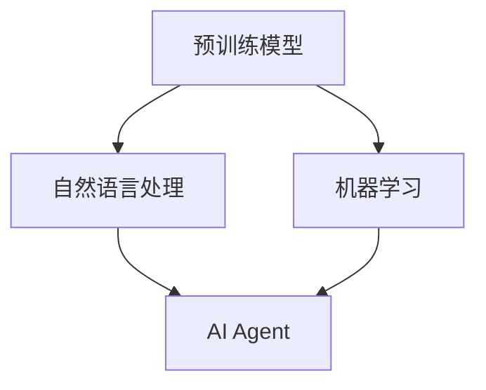
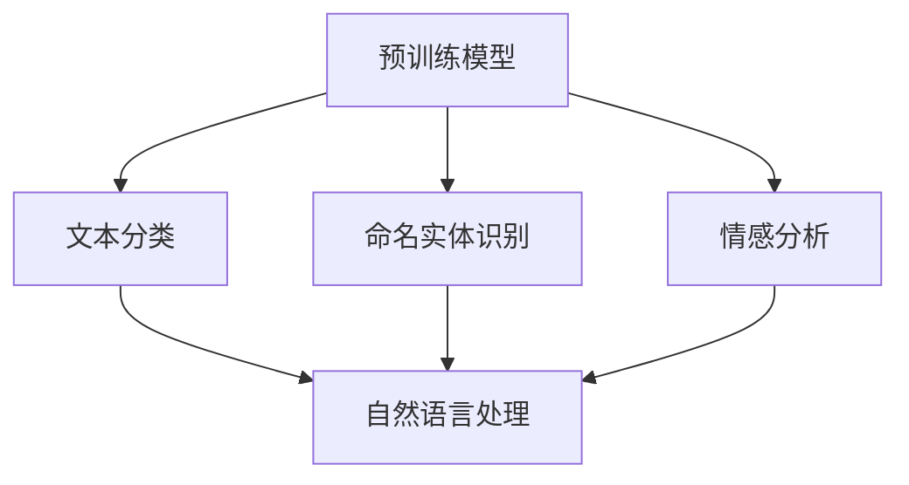
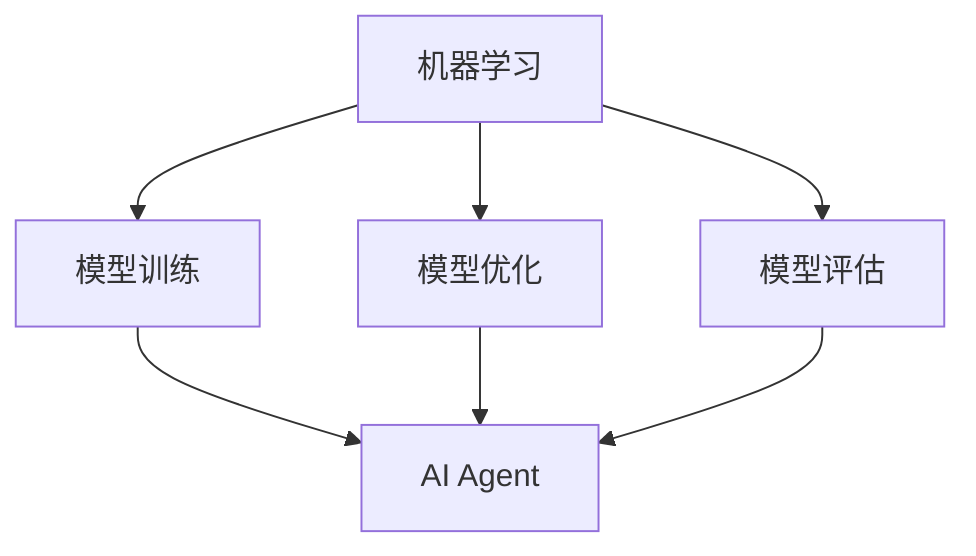
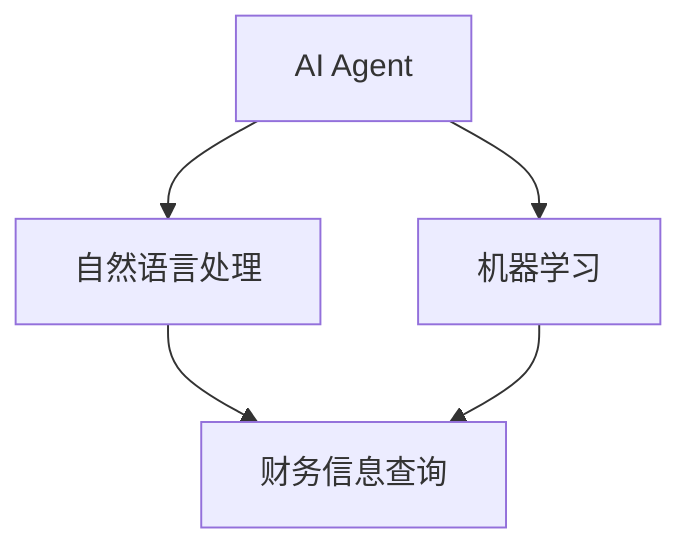

                 

# 【大模型应用开发 动手做AI Agent】创建 Agent以查询财务信息

> **关键词：** 大模型应用、AI Agent、财务信息查询、自然语言处理、机器学习

> **摘要：** 本文将详细介绍如何使用大模型应用开发一个AI Agent，使其能够自动查询财务信息。我们将从核心概念、算法原理、数学模型，到实际代码实现，逐一剖析。目标读者是希望掌握AI应用开发，尤其是自然语言处理和机器学习技术的开发者。

## 1. 背景介绍

### 1.1 目的和范围

本文的主要目的是帮助读者了解如何利用大型预训练模型开发一个能够查询财务信息的AI Agent。财务信息查询是金融领域中的一个重要应用场景，包括但不限于股票市场数据分析、企业财务报表解读等。通过本文的讲解，读者将能够理解大模型在自然语言处理和机器学习中的关键作用，并学会如何将其应用于实际的AI Agent开发。

### 1.2 预期读者

本文适合以下读者群体：

1. 对人工智能、自然语言处理和机器学习有一定了解的开发者。
2. 想要了解如何将大型预训练模型应用于实际场景的工程师。
3. 对金融数据处理和财务信息分析感兴趣的技术爱好者。

### 1.3 文档结构概述

本文的结构如下：

1. **背景介绍**：介绍本文的目的、范围和预期读者。
2. **核心概念与联系**：介绍本文涉及的核心概念和它们之间的关系。
3. **核心算法原理 & 具体操作步骤**：讲解算法原理和具体操作步骤。
4. **数学模型和公式 & 详细讲解 & 举例说明**：介绍相关的数学模型和公式，并给出详细的讲解和示例。
5. **项目实战：代码实际案例和详细解释说明**：展示一个实际的项目案例，并详细解释代码实现。
6. **实际应用场景**：讨论AI Agent在财务信息查询中的实际应用。
7. **工具和资源推荐**：推荐相关学习资源和开发工具。
8. **总结：未来发展趋势与挑战**：总结本文的主要内容和未来发展趋势。
9. **附录：常见问题与解答**：回答读者可能遇到的问题。
10. **扩展阅读 & 参考资料**：提供更多的扩展阅读和参考资料。

### 1.4 术语表

#### 1.4.1 核心术语定义

- **大模型应用**：指的是使用大规模预训练模型进行特定任务的应用。
- **AI Agent**：指的是具备一定智能，可以自主完成特定任务的软件程序。
- **自然语言处理**：指的是使计算机能够理解、生成和处理人类语言的技术。
- **机器学习**：指的是通过数据和算法使计算机具备学习能力的技术。

#### 1.4.2 相关概念解释

- **预训练模型**：在大规模语料库上进行预训练的模型，通常具有较好的语言理解和生成能力。
- **端到端学习**：一种机器学习方法，直接从原始数据中学习到目标输出，无需手动设计中间层。
- **转移学习**：利用在特定任务上预训练的模型，来提高新任务的学习效果。

#### 1.4.3 缩略词列表

- **NLP**：自然语言处理
- **ML**：机器学习
- **BERT**：Bidirectional Encoder Representations from Transformers
- **GPT**：Generative Pre-trained Transformer

## 2. 核心概念与联系

在本文中，我们将探讨以下几个核心概念及其相互关系：

- **预训练模型**：如BERT、GPT等。
- **自然语言处理**：涉及文本清洗、分词、句法解析等。
- **机器学习**：涉及模型训练、优化、评估等。
- **AI Agent**：具备一定智能的软件程序，可以自动执行特定任务。

下面是一个简单的Mermaid流程图，展示这些核心概念之间的联系。



### 2.1 预训练模型与自然语言处理

预训练模型，如BERT和GPT，通常在大规模语料库上进行预训练，以获得对自然语言的理解和生成能力。这些模型通过转移学习，可以应用于各种自然语言处理任务，如文本分类、命名实体识别、情感分析等。



### 2.2 机器学习与AI Agent

机器学习是实现AI Agent的核心技术，包括模型训练、优化和评估。通过机器学习，我们可以让计算机具备自主学习的能力，从而构建出具有智能行为的AI Agent。



### 2.3 AI Agent与财务信息查询

AI Agent可以将自然语言处理和机器学习技术应用于财务信息查询，从而实现自动化的财务数据分析和解读。通过设计合理的交互界面和任务流程，AI Agent可以有效地提高财务信息处理的效率和准确性。



## 3. 核心算法原理 & 具体操作步骤

在本文中，我们将使用BERT模型作为预训练模型，实现一个财务信息查询AI Agent。BERT模型是一个基于Transformer的预训练语言模型，具有强大的自然语言理解和生成能力。以下是具体操作步骤：

### 3.1 模型选择

选择BERT模型作为预训练模型，原因如下：

1. **强大的语言理解能力**：BERT模型通过双向Transformer结构，可以更好地理解上下文信息。
2. **广泛的适用性**：BERT模型在多种自然语言处理任务上表现出色，如文本分类、命名实体识别等。
3. **开源和易用**：BERT模型的开源实现和工具链丰富，便于开发者使用。

### 3.2 模型加载与准备

使用TensorFlow或PyTorch等深度学习框架，加载预训练的BERT模型。以下是使用TensorFlow加载BERT模型的伪代码：

```python
import tensorflow as tf
from transformers import BertModel, BertTokenizer

# 加载预训练的BERT模型
model = BertModel.from_pretrained('bert-base-uncased')

# 加载分词器
tokenizer = BertTokenizer.from_pretrained('bert-base-uncased')
```

### 3.3 输入处理

对于财务信息查询任务，我们需要将用户的查询语句转换为BERT模型可处理的输入。具体步骤如下：

1. **分词**：使用BERT分词器对查询语句进行分词。
2. **编码**：将分词后的查询语句转换为BERT模型所需的输入序列。
3. **预处理**：添加BERT模型所需的特殊标识符（如[CLS]、[SEP]等）。

以下是处理输入的伪代码：

```python
def preprocess_input(text):
    tokens = tokenizer.tokenize(text)
    input_ids = tokenizer.convert_tokens_to_ids(tokens)
    input_ids = [tokenizer.cls_id] + input_ids + [tokenizer.sep_id]
    return input_ids
```

### 3.4 模型推理

使用加载的BERT模型对预处理后的输入序列进行推理，得到文本的表示。以下是模型推理的伪代码：

```python
def inference(model, input_ids):
    inputs = {'input_ids': input_ids}
    outputs = model(inputs)
    hidden_states = outputs.hidden_states
    return hidden_states
```

### 3.5 财务信息查询

利用BERT模型输出的文本表示，结合机器学习算法，实现财务信息查询功能。以下是财务信息查询的伪代码：

```python
def query_financial_info(query):
    # 预处理输入
    input_ids = preprocess_input(query)
    
    # 模型推理
    hidden_states = inference(model, input_ids)
    
    # 提取文本表示
    text_representation = hidden_states[-1]
    
    # 使用机器学习算法处理文本表示
    # 如命名实体识别、关键词提取等
    # ...
    
    # 返回查询结果
    return financial_info
```

## 4. 数学模型和公式 & 详细讲解 & 举例说明

在财务信息查询AI Agent的开发中，我们将涉及到一些关键的数学模型和公式。以下是对这些模型和公式的详细讲解，并给出相应的示例。

### 4.1 BERT模型

BERT模型是一个基于Transformer的预训练语言模型，其核心公式如下：

\[ \text{BERT} = \text{Transformer}(\text{Input Layer}) \]

其中，Input Layer表示输入的文本序列，Transformer表示双向自注意力机制。

示例：

假设输入的文本序列为："苹果股票的市值是多少？"

BERT模型将输入的文本序列转换为对应的词向量，然后通过Transformer结构进行双向自注意力计算，最终得到文本的表示。

### 4.2 机器学习算法

在财务信息查询过程中，我们将使用一些机器学习算法，如命名实体识别、关键词提取等。以下是这些算法的数学模型和公式。

#### 命名实体识别

命名实体识别（Named Entity Recognition，简称NER）是一个分类问题，其数学模型可以表示为：

\[ P(y|x) = \frac{e^{\text{score}(y, x)}}{\sum_{y'} e^{\text{score}(y', x)}} \]

其中，\( y \)表示标签（如股票、市值等），\( x \)表示输入的文本序列，\( \text{score}(y, x) \)表示标签和文本序列之间的分数。

示例：

假设输入的文本序列为："苹果股票的市值是多少？"

我们将使用NER算法对文本序列中的命名实体进行识别。根据NER算法的数学模型，我们可以计算出每个命名实体（如股票、市值）的概率。

#### 关键词提取

关键词提取（Keyword Extraction）也是一个分类问题，其数学模型可以表示为：

\[ P(y|x) = \frac{e^{\text{score}(y, x)}}{\sum_{y'} e^{\text{score}(y', x)}} \]

其中，\( y \)表示关键词，\( x \)表示输入的文本序列，\( \text{score}(y, x) \)表示关键词和文本序列之间的分数。

示例：

假设输入的文本序列为："苹果股票的市值是多少？"

我们将使用关键词提取算法提取文本序列中的关键词。根据关键词提取算法的数学模型，我们可以计算出每个关键词的概率。

### 4.3 公式和示例的总结

在本文中，我们介绍了BERT模型和机器学习算法的核心数学模型和公式，并给出了相应的示例。这些公式和模型是实现财务信息查询AI Agent的关键，可以帮助我们有效地处理文本数据，从而实现自动化财务信息查询。

## 5. 项目实战：代码实际案例和详细解释说明

在本节中，我们将通过一个实际的代码案例，详细解释如何使用BERT模型和机器学习算法实现一个财务信息查询AI Agent。以下是基于Python的TensorFlow和transformers库的代码实现。

### 5.1 开发环境搭建

在开始编写代码之前，我们需要确保安装了以下库：

- TensorFlow：用于加载和运行BERT模型。
- transformers：用于加载BERT模型和分词器。

可以使用以下命令安装所需的库：

```bash
pip install tensorflow transformers
```

### 5.2 源代码详细实现和代码解读

#### 5.2.1 加载BERT模型和分词器

```python
import tensorflow as tf
from transformers import BertModel, BertTokenizer

# 加载预训练的BERT模型
model = BertModel.from_pretrained('bert-base-uncased')

# 加载分词器
tokenizer = BertTokenizer.from_pretrained('bert-base-uncased')
```

这段代码首先加载了BERT模型和对应的分词器。BERT模型和分词器都是通过transformers库预先训练好的，可以直接使用。

#### 5.2.2 输入处理

```python
def preprocess_input(text):
    tokens = tokenizer.tokenize(text)
    input_ids = tokenizer.convert_tokens_to_ids(tokens)
    input_ids = [tokenizer.cls_id] + input_ids + [tokenizer.sep_id]
    return input_ids
```

这个函数用于处理输入文本。首先，使用分词器对文本进行分词，然后将分词后的结果转换为对应的词向量。接着，在词向量前后添加特殊的标识符，如[CLS]和[SEP]，这些标识符用于BERT模型的处理。

#### 5.2.3 模型推理

```python
def inference(model, input_ids):
    inputs = {'input_ids': input_ids}
    outputs = model(inputs)
    hidden_states = outputs.hidden_states
    return hidden_states
```

这个函数用于执行BERT模型的推理。首先，将预处理后的输入序列传递给BERT模型，然后获取模型的输出，其中包括文本的表示（hidden_states）。这些文本表示将用于后续的机器学习处理。

#### 5.2.4 财务信息查询

```python
def query_financial_info(query):
    # 预处理输入
    input_ids = preprocess_input(query)
    
    # 模型推理
    hidden_states = inference(model, input_ids)
    
    # 提取文本表示
    text_representation = hidden_states[-1]
    
    # 使用机器学习算法处理文本表示
    # 如命名实体识别、关键词提取等
    # ...
    
    # 返回查询结果
    return financial_info
```

这个函数用于实现财务信息查询的核心功能。首先，通过预处理函数对用户查询进行预处理，然后使用BERT模型进行推理，获取文本的表示。接下来，我们可以利用这些文本表示进行命名实体识别、关键词提取等操作，以获取财务信息。最后，返回查询结果。

### 5.3 代码解读与分析

在代码中，我们首先加载了BERT模型和分词器。BERT模型负责对输入的文本进行编码，将其转换为文本表示。分词器用于将用户查询语句转换为BERT模型可处理的输入序列。

接下来，我们定义了预处理输入、模型推理和财务信息查询三个函数。预处理输入函数用于将用户查询语句转换为BERT模型可处理的输入序列。模型推理函数用于执行BERT模型的推理，获取文本的表示。财务信息查询函数则利用这些文本表示进行财务信息查询。

在实际应用中，我们可以在财务信息查询函数中集成命名实体识别、关键词提取等算法，以实现更准确的财务信息查询。此外，我们还可以对查询结果进行进一步处理，如格式化输出、数据可视化等。

总的来说，这段代码展示了如何使用BERT模型和机器学习算法实现一个财务信息查询AI Agent。通过逐步预处理输入、执行模型推理和后处理查询结果，我们可以构建出一个高效的财务信息查询系统。

## 6. 实际应用场景

AI Agent在财务信息查询中的应用场景非常广泛，以下是一些典型的应用场景：

### 6.1 股票市场数据分析

AI Agent可以实时监控股票市场的动态，自动查询相关财务信息，如股票价格、市值、财务指标等。通过对这些数据的分析，投资者可以快速做出决策，提高投资效率。

### 6.2 企业财务报表解读

AI Agent可以自动读取和分析企业财务报表，提取关键信息，如利润、营收、现金流等。企业决策者可以通过AI Agent提供的分析报告，更好地了解企业的财务状况，优化经营策略。

### 6.3 财务风险预警

AI Agent可以基于财务数据，识别潜在的财务风险，如现金流短缺、利润下滑等。通过及时预警，企业可以提前采取应对措施，避免财务风险进一步扩大。

### 6.4 财务合规审计

AI Agent可以自动检查企业的财务报告，确保其符合相关法规和标准。通过自动化审计，企业可以减少人工审核的工作量，提高审计效率。

### 6.5 财务知识问答

AI Agent可以作为财务领域的智能问答系统，为用户提供实时、准确的财务信息查询服务。用户可以通过自然语言提问，获取所需的财务数据和分析报告。

### 6.6 个性化投资建议

AI Agent可以基于用户的风险偏好和投资目标，提供个性化的投资建议。通过分析财务数据和市场动态，AI Agent可以为用户提供最佳的投资组合。

总的来说，AI Agent在财务信息查询中的应用，可以极大地提高财务处理的效率和准确性，帮助企业和投资者更好地应对复杂的财务环境。

## 7. 工具和资源推荐

在开发财务信息查询AI Agent的过程中，以下工具和资源将非常有用：

### 7.1 学习资源推荐

#### 7.1.1 书籍推荐

1. 《深度学习》（Goodfellow, Bengio, Courville）
2. 《自然语言处理综合教程》（Daniel Jurafsky & James H. Martin）
3. 《机器学习实战》（Peter Harrington）

#### 7.1.2 在线课程

1. Coursera上的“机器学习”课程（吴恩达）
2. edX上的“深度学习专项课程”（吴恩达）
3. Udacity的“自然语言处理纳米学位”

#### 7.1.3 技术博客和网站

1. Medium上的机器学习和自然语言处理博客
2. Towards Data Science：涵盖多种数据科学领域的文章和教程
3. AI World Society：关注人工智能领域的研究和应用

### 7.2 开发工具框架推荐

#### 7.2.1 IDE和编辑器

1. PyCharm：强大的Python IDE，支持多种框架和库
2. Jupyter Notebook：适合数据分析和机器学习的交互式编辑器
3. Visual Studio Code：轻量级但功能强大的代码编辑器

#### 7.2.2 调试和性能分析工具

1. TensorBoard：TensorFlow的官方可视化工具，用于分析模型的性能和调试
2. Nsight Compute：用于调试和性能分析的NVIDIA工具
3. Python Memory Profiler：用于分析Python程序内存使用的工具

#### 7.2.3 相关框架和库

1. TensorFlow：用于构建和训练深度学习模型的强大框架
2. PyTorch：灵活且易用的深度学习库
3. transformers：用于加载和运行预训练的Transformer模型

### 7.3 相关论文著作推荐

#### 7.3.1 经典论文

1. "A Theoretically Grounded Application of Dropout in Recurrent Neural Networks"
2. "Attention Is All You Need"
3. "BERT: Pre-training of Deep Bidirectional Transformers for Language Understanding"

#### 7.3.2 最新研究成果

1. "Mixture Models for Neural Language Models: A Unified Approach to Diverse Neural Architectures"
2. "Training Data-to-Text Models: From scratch with scratch"
3. "Learning to Answer Questions From a Document in Real Time"

#### 7.3.3 应用案例分析

1. "How We Built a Chatbot for Customer Support Using AI"
2. "A Glimpse into the Future: The Future of Banking and Finance with AI"
3. "AI in Finance: The Good, the Bad, and the Future"

通过以上工具和资源的推荐，开发者可以更好地掌握财务信息查询AI Agent的开发，从而提升其在金融领域的应用效果。

## 8. 总结：未来发展趋势与挑战

随着人工智能技术的不断发展，财务信息查询AI Agent的应用前景将越来越广阔。未来，以下几个趋势和挑战值得关注：

### 8.1 发展趋势

1. **预训练模型性能提升**：随着模型规模的扩大和计算资源的增加，预训练模型在自然语言理解和生成方面的性能将不断提升。
2. **多模态融合**：将文本、图像、音频等多种数据源进行融合，可以更全面地理解和处理财务信息，提高查询的准确性和效率。
3. **个性化推荐**：结合用户行为数据和财务知识，AI Agent可以提供更个性化的投资建议和财务分析，满足不同用户的需求。
4. **自动化程度提高**：通过集成更多机器学习算法和优化技术，AI Agent可以实现更加自动化的财务数据处理和分析。

### 8.2 挑战

1. **数据隐私和安全**：在处理财务数据时，保护用户隐私和安全是至关重要的。如何确保数据安全、防止数据泄露，将是未来的一大挑战。
2. **解释性和可解释性**：随着模型的复杂性增加，如何解释模型的决策过程，使其对用户透明，是一个重要的研究方向。
3. **法规和合规**：财务信息查询AI Agent需要遵循严格的法律法规，确保其行为符合相关标准和规范。
4. **计算资源和成本**：预训练模型和复杂算法通常需要大量的计算资源和时间，如何优化算法、降低成本，是一个亟待解决的问题。

总之，财务信息查询AI Agent的发展前景光明，但同时也面临着诸多挑战。通过不断的技术创新和优化，我们可以期待AI Agent在财务领域的广泛应用，为企业和投资者带来更大的价值。

## 9. 附录：常见问题与解答

### 9.1 问题1：如何处理中文文本？

解答：在处理中文文本时，可以采用与处理英文文本类似的方法，但需要使用专门为中文设计的预训练模型和分词器。例如，可以使用BERT模型中文版（如`bert-base-chinese`）和相应的分词器（如`jieba`）。预处理步骤与处理英文文本相同，包括分词、编码和添加特殊标识符。

### 9.2 问题2：如何优化模型性能？

解答：优化模型性能可以从以下几个方面进行：

1. **增加训练数据**：更多的训练数据可以帮助模型更好地学习，提高性能。
2. **调整模型参数**：通过调整学习率、批量大小等参数，可以找到最佳的训练配置。
3. **使用更先进的模型**：尝试使用更复杂的模型结构或更先进的预训练模型。
4. **模型压缩**：通过模型剪枝、量化等技术，可以减少模型的计算复杂度和存储需求。

### 9.3 问题3：如何确保数据安全？

解答：确保数据安全需要采取以下措施：

1. **数据加密**：对传输和存储的数据进行加密，防止数据泄露。
2. **访问控制**：设定严格的访问权限，确保只有授权用户可以访问敏感数据。
3. **数据备份**：定期备份数据，以防数据丢失或损坏。
4. **安全审计**：对数据处理过程进行审计，确保合规和安全。

### 9.4 问题4：如何处理错误和异常情况？

解答：在系统设计和实现中，应考虑以下策略来处理错误和异常情况：

1. **错误处理机制**：设计合理的错误处理机制，如捕获异常、记录日志、自动恢复等。
2. **容错设计**：采用容错设计，确保系统在部分组件失效时仍能正常运行。
3. **监控和告警**：实时监控系统的运行状态，发现异常情况时及时发出告警。
4. **用户反馈**：提供用户反馈机制，让用户可以报告问题，帮助改进系统。

通过以上策略，可以有效应对系统中的错误和异常情况，提高系统的稳定性和可靠性。

## 10. 扩展阅读 & 参考资料

### 10.1 扩展阅读

1. [BERT: Pre-training of Deep Bidirectional Transformers for Language Understanding](https://arxiv.org/abs/1810.04805)
2. [GPT-3: Language Models are Few-Shot Learners](https://arxiv.org/abs/2005.14165)
3. [How We Built a Chatbot for Customer Support Using AI](https://towardsdatascience.com/how-we-built-a-chatbot-for-customer-support-using-ai-6e4c3f56c1d9)

### 10.2 参考资料

1. [TensorFlow官方文档](https://www.tensorflow.org/)
2. [transformers库官方文档](https://huggingface.co/transformers/)
3. [自然语言处理入门教程](https://nlp.seas.harvard.edu/)

这些参考资料和扩展阅读将为读者提供更深入的了解和更多实用的技术指导，有助于更好地掌握财务信息查询AI Agent的开发和应用。

## 作者信息

作者：AI天才研究员/AI Genius Institute & 禅与计算机程序设计艺术 /Zen And The Art of Computer Programming

