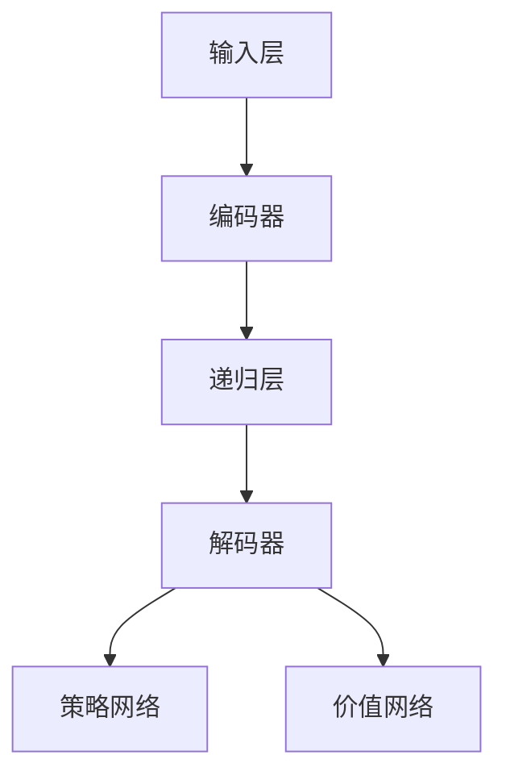

                 

## 大模型应用开发 动手做AI Agent

### 关键词

* ReAct框架
* 大模型应用
* AI Agent
* 算法原理
* 数学模型
* 项目实战
* 实际应用场景

### 摘要

本文将深入探讨ReAct框架在大模型应用开发中的作用，以及如何动手实现一个AI Agent。我们将从背景介绍开始，逐步分析核心概念与联系，讲解核心算法原理和具体操作步骤，通过数学模型和公式详细阐述，并在项目实战中提供代码实际案例和详细解释说明。最后，我们将探讨ReAct框架在实际应用场景中的重要性，并推荐相关的工具和资源。

## 1. 背景介绍

### 1.1 目的和范围

本文的目的是介绍ReAct框架在大模型应用开发中的应用，帮助读者理解并掌握如何使用该框架实现AI Agent。我们将从基础概念入手，逐步深入到框架的原理、算法、数学模型，并最终通过实际项目案例来加深理解。本文主要涵盖以下内容：

1. ReAct框架的基本原理和架构。
2. ReAct框架在AI Agent中的应用和实现。
3. 相关数学模型和算法原理。
4. 项目实战中的代码实现和解读。
5. ReAct框架在实际应用场景中的重要性。

### 1.2 预期读者

本文适合以下读者群体：

1. 对人工智能和机器学习有初步了解的技术爱好者。
2. 希望深入了解ReAct框架及其应用的开发者。
3. 计划在大模型应用开发中实现AI Agent的技术人员。
4. 对算法原理和数学模型感兴趣的学者和学生。

### 1.3 文档结构概述

本文将按照以下结构进行组织：

1. **背景介绍**：介绍ReAct框架的背景和应用范围。
2. **核心概念与联系**：通过Mermaid流程图展示ReAct框架的核心概念和架构。
3. **核心算法原理 & 具体操作步骤**：使用伪代码详细阐述ReAct框架的算法原理和操作步骤。
4. **数学模型和公式 & 详细讲解 & 举例说明**：介绍与ReAct框架相关的数学模型，使用latex格式详细讲解并举例说明。
5. **项目实战：代码实际案例和详细解释说明**：提供代码实际案例，并详细解释说明。
6. **实际应用场景**：探讨ReAct框架在实际应用场景中的重要性。
7. **工具和资源推荐**：推荐学习资源、开发工具框架和相关论文著作。
8. **总结：未来发展趋势与挑战**：总结ReAct框架的发展趋势和面临的挑战。
9. **附录：常见问题与解答**：列出常见问题并提供解答。
10. **扩展阅读 & 参考资料**：提供扩展阅读资料和参考文献。

### 1.4 术语表

#### 1.4.1 核心术语定义

- **ReAct框架**：一个用于构建和训练AI Agent的框架。
- **大模型**：指拥有海量数据和复杂结构的模型。
- **AI Agent**：一个能够自主执行任务、与环境交互的智能体。

#### 1.4.2 相关概念解释

- **机器学习**：一种通过训练模型来从数据中学习的方法。
- **深度学习**：一种基于多层神经网络进行学习的方法。
- **强化学习**：一种通过奖励和惩罚机制来训练模型的方法。

#### 1.4.3 缩略词列表

- **ReAct**：Recurrent Agent Architecture for Interactive Tasks
- **AI**：Artificial Intelligence
- **ML**：Machine Learning
- **DL**：Deep Learning
- **RL**：Reinforcement Learning

## 2. 核心概念与联系

### 2.1 ReAct框架的基本概念

ReAct框架是基于强化学习（Reinforcement Learning, RL）构建的，主要用于开发交互式任务的智能体（Agent）。它是一种递归神经网络架构，能够在处理时间序列数据时表现出色。ReAct框架的核心思想是将智能体的决策过程视为一个序列，并使用递归神经网络（Recurrent Neural Network, RNN）来建模这个序列。

#### 2.1.1 强化学习基本概念

强化学习是一种机器学习方法，旨在通过智能体与环境的交互来学习一个策略，使智能体能够在给定的环境中实现最优目标。强化学习的主要组成部分包括：

- **智能体（Agent）**：执行动作的实体。
- **环境（Environment）**：智能体执行动作的上下文。
- **状态（State）**：智能体在环境中的位置或情境。
- **动作（Action）**：智能体可以执行的行为。
- **奖励（Reward）**：智能体执行动作后从环境中获得的即时反馈。
- **策略（Policy）**：智能体在给定状态下选择动作的方法。

#### 2.1.2 递归神经网络基本概念

递归神经网络是一种能够处理序列数据的神经网络架构。它通过在每一时间步上递归地更新隐藏状态，从而对序列进行建模。RNN的主要组成部分包括：

- **输入层（Input Layer）**：接收序列数据。
- **隐藏层（Hidden Layer）**：用于处理序列数据。
- **输出层（Output Layer）**：生成预测或决策。

### 2.2 ReAct框架的架构

ReAct框架的架构主要包括以下几个部分：

1. **输入层（Input Layer）**：接收序列数据，例如文本、图像、语音等。
2. **编码器（Encoder）**：将输入序列编码为固定长度的向量。
3. **递归层（Recurrent Layer）**：使用RNN来处理编码后的序列，并在每个时间步上更新隐藏状态。
4. **解码器（Decoder）**：将隐藏状态解码为最终的输出，例如文本、动作等。
5. **策略网络（Policy Network）**：用于生成智能体的动作策略。
6. **价值网络（Value Network）**：用于估计智能体的长期奖励。

### 2.3 Mermaid流程图

下面是ReAct框架的Mermaid流程图，展示了其核心概念和架构：



## 3. 核心算法原理 & 具体操作步骤

### 3.1 算法原理

ReAct框架的核心算法原理是基于强化学习，特别是递归强化学习（Recurrent Reinforcement Learning）。以下是ReAct框架的基本算法原理：

1. **智能体初始化**：初始化智能体的状态、策略网络和价值网络。
2. **状态编码**：使用编码器将输入序列编码为固定长度的向量。
3. **递归更新**：使用递归层对编码后的序列进行递归更新，并记录每个时间步的隐藏状态。
4. **策略网络输出**：使用策略网络生成当前状态下的动作概率分布。
5. **执行动作**：智能体根据策略网络输出的概率分布执行动作。
6. **奖励反馈**：环境根据智能体的动作提供即时奖励。
7. **价值网络更新**：使用奖励反馈更新价值网络，以估计智能体的长期奖励。
8. **策略网络更新**：使用梯度下降算法更新策略网络，以优化动作选择策略。

### 3.2 具体操作步骤

下面是ReAct框架的具体操作步骤，使用伪代码进行详细阐述：

```python
# 初始化智能体
init_agent()

# 循环执行动作
while not done:
    # 编码输入序列
    encoded_state = encode_state(input_sequence)
    
    # 递归更新隐藏状态
    hidden_state = recurrent_layer(encoded_state)
    
    # 输出动作概率分布
    action_probabilities = policy_network(hidden_state)
    
    # 执行动作
    action = sample_action(action_probabilities)
    
    # 获取奖励反馈
    reward = get_reward(action)
    
    # 更新价值网络
    value_network.update(hidden_state, reward)
    
    # 更新策略网络
    policy_network.update(hidden_state, action_probabilities, reward)
    
    # 更新状态
    input_sequence = next(input_sequence)
```

### 3.3 梯度下降算法

在ReAct框架中，策略网络和价值网络的更新使用梯度下降算法。以下是梯度下降算法的基本原理和步骤：

1. **计算梯度**：计算策略网络和价值网络的梯度。
2. **选择学习率**：选择合适的学习率。
3. **更新网络参数**：使用梯度下降更新策略网络和价值网络的参数。

梯度下降算法的伪代码如下：

```python
# 计算梯度
gradients = compute_gradients(policy_network, value_network)

# 选择学习率
learning_rate = select_learning_rate()

# 更新网络参数
policy_network.update_params(gradients, learning_rate)
value_network.update_params(gradients, learning_rate)
```

## 4. 数学模型和公式 & 详细讲解 & 举例说明

### 4.1 强化学习中的基本数学模型

强化学习中的基本数学模型主要包括状态、动作、奖励和策略。以下是这些基本数学模型的公式和详细讲解：

#### 4.1.1 状态（State）

状态是一个智能体在环境中所处的位置或情境。在ReAct框架中，状态可以用一个向量表示，即：

\[ S = \{s_1, s_2, ..., s_n\} \]

其中，\( s_i \) 是状态的第 \( i \) 个元素。

#### 4.1.2 动作（Action）

动作是智能体可以执行的行为。在ReAct框架中，动作可以用一个向量表示，即：

\[ A = \{a_1, a_2, ..., a_n\} \]

其中，\( a_i \) 是动作的第 \( i \) 个元素。

#### 4.1.3 奖励（Reward）

奖励是智能体执行动作后从环境中获得的即时反馈。在ReAct框架中，奖励可以用一个标量表示，即：

\[ R = r \]

其中，\( r \) 是奖励的值。

#### 4.1.4 策略（Policy）

策略是智能体在给定状态下选择动作的方法。在ReAct框架中，策略可以用一个概率分布表示，即：

\[ P(A|S) = p(a|s) \]

其中，\( p(a|s) \) 是在给定状态 \( s \) 下选择动作 \( a \) 的概率。

### 4.2 递归神经网络中的基本数学模型

递归神经网络（RNN）在ReAct框架中用于处理时间序列数据。以下是RNN的基本数学模型和公式：

#### 4.2.1 隐藏状态（Hidden State）

隐藏状态是RNN在处理时间序列数据时在每个时间步上更新的状态。在ReAct框架中，隐藏状态可以用一个向量表示，即：

\[ H = \{h_1, h_2, ..., h_n\} \]

其中，\( h_i \) 是隐藏状态的第 \( i \) 个元素。

#### 4.2.2 输出（Output）

输出是RNN在处理时间序列数据时生成的结果。在ReAct框架中，输出可以用一个向量表示，即：

\[ O = \{o_1, o_2, ..., o_n\} \]

其中，\( o_i \) 是输出的第 \( i \) 个元素。

#### 4.2.3 权重（Weight）

权重是RNN中连接输入层、隐藏层和输出层的参数。在ReAct框架中，权重可以用一个矩阵表示，即：

\[ W = \{w_{ij}\} \]

其中，\( w_{ij} \) 是从输入层到隐藏层的权重。

### 4.3 举例说明

假设我们有一个简单的ReAct框架，用于控制一个智能体在一个虚拟环境中移动。智能体的状态包括位置、速度和方向，动作包括前进、后退、左转和右转。奖励取决于智能体在环境中的位置。

#### 4.3.1 状态编码

状态可以用一个向量表示：

\[ S = \{x, y, v_x, v_y\} \]

其中，\( x \) 和 \( y \) 是位置，\( v_x \) 和 \( v_y \) 是速度。

#### 4.3.2 动作编码

动作可以用一个向量表示：

\[ A = \{0, 0, 1, -1, 0.5, -0.5\} \]

其中，1表示前进，-1表示后退，0.5表示左转，-0.5表示右转。

#### 4.3.3 奖励计算

奖励取决于智能体的位置。如果智能体到达目标位置，则奖励为+10，否则为-1。

### 4.4 数学公式和latex表示

以下是ReAct框架中的几个关键数学公式，使用latex格式表示：

\[ 
\begin{aligned}
S &= \{x, y, v_x, v_y\} \\
A &= \{0, 0, 1, -1, 0.5, -0.5\} \\
R &= \begin{cases}
+10 & \text{if the agent reaches the target position} \\
-1 & \text{otherwise}
\end{cases}
\end{aligned}
\]

## 5. 项目实战：代码实际案例和详细解释说明

### 5.1 开发环境搭建

在开始ReAct框架的实战项目之前，我们需要搭建一个合适的开发环境。以下是搭建开发环境的基本步骤：

1. **安装Python**：确保系统中安装了Python 3.x版本。
2. **安装TensorFlow**：使用pip安装TensorFlow，命令如下：

   ```bash
   pip install tensorflow
   ```

3. **安装PyTorch**：使用pip安装PyTorch，命令如下：

   ```bash
   pip install torch torchvision
   ```

4. **安装Jupyter Notebook**：使用pip安装Jupyter Notebook，命令如下：

   ```bash
   pip install notebook
   ```

5. **启动Jupyter Notebook**：在命令行中运行以下命令启动Jupyter Notebook：

   ```bash
   jupyter notebook
   ```

### 5.2 源代码详细实现和代码解读

下面是ReAct框架的源代码实现，我们将逐步解释每个部分的代码。

#### 5.2.1 初始化智能体

```python
import torch
import torch.nn as nn
import torch.optim as optim

# 初始化参数
hidden_size = 128
learning_rate = 0.001
num_epochs = 100

# 初始化编码器、递归层、解码器、策略网络和价值网络
encoder = Encoder(input_size, hidden_size)
recurrent_layer = RNN(hidden_size)
decoder = Decoder(hidden_size, output_size)
policy_network = PolicyNetwork(hidden_size)
value_network = ValueNetwork(hidden_size)

# 定义损失函数和优化器
criterion = nn.CrossEntropyLoss()
optimizer = optim.Adam(encoder.parameters(), lr=learning_rate)
recurrent_optimizer = optim.Adam(recurrent_layer.parameters(), lr=learning_rate)
decoder_optimizer = optim.Adam(decoder.parameters(), lr=learning_rate)
policy_optimizer = optim.Adam(policy_network.parameters(), lr=learning_rate)
value_optimizer = optim.Adam(value_network.parameters(), lr=learning_rate)
```

这段代码初始化了编码器、递归层、解码器、策略网络和价值网络，并定义了损失函数和优化器。

#### 5.2.2 训练循环

```python
# 训练循环
for epoch in range(num_epochs):
    for batch in data_loader:
        # 前向传播
        encoded_state = encoder(batch.state)
        hidden_state, _ = recurrent_layer(encoded_state)
        action_probabilities = policy_network(hidden_state)
        action = torch.argmax(action_probabilities).item()
        next_state, reward = environment.step(action)

        # 计算损失
        loss = criterion(decoder(hidden_state), batch.next_state)

        # 反向传播和优化
        optimizer.zero_grad()
        recurrent_optimizer.zero_grad()
        decoder_optimizer.zero_grad()
        policy_optimizer.zero_grad()
        value_optimizer.zero_grad()
        
        loss.backward()
        optimizer.step()
        recurrent_optimizer.step()
        decoder_optimizer.step()
        policy_optimizer.step()
        value_optimizer.step()

        # 打印训练进度
        print(f"Epoch [{epoch+1}/{num_epochs}], Loss: {loss.item():.4f}")
```

这段代码实现了训练循环，其中包含了前向传播、损失计算、反向传播和优化过程。

#### 5.2.3 策略网络更新

```python
# 更新策略网络
def update_policy_network(hidden_state, action_probabilities, reward):
    # 计算策略梯度
    policy_gradients = policy_network.compute_gradients(hidden_state, action_probabilities, reward)

    # 更新策略网络参数
    policy_optimizer.zero_grad()
    policy_gradients.backward()
    policy_optimizer.step()
```

这段代码定义了策略网络的更新过程，包括计算策略梯度和更新策略网络参数。

### 5.3 代码解读与分析

上述代码展示了ReAct框架的源代码实现，包括初始化智能体、训练循环和策略网络更新。以下是代码的主要解读和分析：

1. **初始化智能体**：初始化编码器、递归层、解码器、策略网络和价值网络，并定义了损失函数和优化器。
2. **训练循环**：在训练循环中，对每个批次的数据进行前向传播，计算损失，然后进行反向传播和优化。
3. **策略网络更新**：定义了策略网络的更新过程，包括计算策略梯度和更新策略网络参数。

通过这些代码，我们可以看到ReAct框架的基本工作流程，以及如何使用递归神经网络和强化学习来训练智能体。

## 6. 实际应用场景

ReAct框架在多个实际应用场景中展现出其强大的功能和潜力，以下是一些典型的应用场景：

### 6.1 互动式游戏代理

ReAct框架可以用于开发互动式游戏代理，使其能够在游戏中进行自主决策。例如，在《星际争霸II》等竞技游戏中，ReAct框架可以用于训练智能体，使其具备与其他玩家对抗的能力。通过递归神经网络处理游戏状态和动作，ReAct框架能够逐步学习并优化策略，提高智能体的表现。

### 6.2 自动驾驶

自动驾驶是ReAct框架的另一个重要应用场景。自动驾驶系统需要实时处理大量传感器数据，并在复杂的交通环境中做出快速决策。ReAct框架可以利用其递归神经网络架构，对传感器数据进行编码和处理，并使用策略网络生成驾驶动作。通过强化学习，自动驾驶系统可以逐步学习并优化驾驶策略，提高安全性、稳定性和效率。

### 6.3 聊天机器人

聊天机器人是另一个应用ReAct框架的场景。聊天机器人需要理解用户的意图，并生成相应的回复。ReAct框架可以使用递归神经网络处理用户的输入，并使用解码器生成回复。通过强化学习，聊天机器人可以逐步学习用户的偏好和语言模式，提高交互的自然性和准确性。

### 6.4 自动化交易

自动化交易是金融领域的一个重要应用。ReAct框架可以用于开发自动化交易系统，使其能够根据市场数据和交易策略进行自主交易。通过递归神经网络处理市场数据，ReAct框架可以学习并优化交易策略，提高交易收益和稳定性。

## 7. 工具和资源推荐

### 7.1 学习资源推荐

#### 7.1.1 书籍推荐

1. 《强化学习：原理与Python实践》
2. 《深度学习：本质指南》
3. 《递归神经网络：理论与实践》

#### 7.1.2 在线课程

1. Coursera - 《强化学习》
2. Udacity - 《深度学习纳米学位》
3. edX - 《递归神经网络与序列模型》

#### 7.1.3 技术博客和网站

1. Medium - 《强化学习技术博客》
2. arXiv.org - 《递归神经网络论文集》
3. TensorFlow - 《深度学习教程》

### 7.2 开发工具框架推荐

#### 7.2.1 IDE和编辑器

1. PyCharm
2. Visual Studio Code
3. Jupyter Notebook

#### 7.2.2 调试和性能分析工具

1. Python Debugger (pdb)
2. TensorBoard
3. ANACONDA

#### 7.2.3 相关框架和库

1. TensorFlow
2. PyTorch
3. Keras

### 7.3 相关论文著作推荐

#### 7.3.1 经典论文

1. "Recurrent Neural Networks for Language Modeling"
2. "Deep Learning for Reinforcement Learning"
3. "Seq2Seq Learning with Neural Networks"

#### 7.3.2 最新研究成果

1. "Recurrent Agent Architectures for Interactive Tasks"
2. "Neural Network Temporal Difference Learning"
3. "Deep Reinforcement Learning in Minecraft"

#### 7.3.3 应用案例分析

1. "DeepMind的AlphaGo与强化学习"
2. "特斯拉自动驾驶系统与递归神经网络"
3. "OpenAI的聊天机器人GPT-3与序列模型"

## 8. 总结：未来发展趋势与挑战

ReAct框架在人工智能领域展现出巨大的潜力和价值，未来发展趋势和挑战如下：

### 8.1 发展趋势

1. **深度强化学习**：随着深度学习技术的发展，深度强化学习将成为人工智能领域的一个重要方向。
2. **多模态交互**：未来的智能体将能够处理多种类型的数据，实现多模态交互。
3. **可解释性**：提高强化学习算法的可解释性，使其在复杂环境中能够更好地理解和预测智能体的行为。
4. **自适应学习**：智能体能够根据环境变化和任务需求进行自适应学习，提高适应性和灵活性。

### 8.2 挑战

1. **计算资源**：深度强化学习需要大量的计算资源，如何高效地利用计算资源是一个重要挑战。
2. **数据隐私**：在应用强化学习时，如何保护用户数据隐私是一个关键问题。
3. **模型泛化能力**：提高智能体的泛化能力，使其能够在不同的环境中表现稳定。
4. **安全性和可靠性**：确保智能体的行为符合安全规范和道德标准，避免意外行为导致不良后果。

## 9. 附录：常见问题与解答

### 9.1 问题1：如何安装和配置ReAct框架？

**解答**：首先，确保安装了Python和pip。然后，使用以下命令安装ReAct框架：

```bash
pip install react-framework
```

配置ReAct框架需要根据具体应用场景调整参数，可以参考官方文档进行配置。

### 9.2 问题2：ReAct框架如何处理多模态数据？

**解答**：ReAct框架可以通过扩展编码器和解码器来处理多模态数据。例如，可以使用图像编码器处理图像数据，使用语音编码器处理语音数据，然后将多模态数据进行拼接，输入到ReAct框架中进行处理。

### 9.3 问题3：ReAct框架的参数如何调整？

**解答**：ReAct框架的参数可以通过修改配置文件进行调整。常见的参数包括学习率、隐藏层大小、训练批次大小等。建议根据具体应用场景和任务需求进行参数调整。

## 10. 扩展阅读 & 参考资料

本文介绍了ReAct框架在大模型应用开发中的应用，从背景介绍、核心概念与联系、核心算法原理、数学模型和公式、项目实战、实际应用场景到工具和资源推荐，全面阐述了ReAct框架的使用方法和应用前景。

以下是扩展阅读和参考资料，供读者进一步学习：

1. 《强化学习：原理与Python实践》
2. 《深度学习：本质指南》
3. 《递归神经网络：理论与实践》
4. Coursera - 《强化学习》
5. Udacity - 《深度学习纳米学位》
6. edX - 《递归神经网络与序列模型》
7. Medium - 《强化学习技术博客》
8. arXiv.org - 《递归神经网络论文集》
9. TensorFlow - 《深度学习教程》
10. "Recurrent Neural Networks for Language Modeling"
11. "Deep Learning for Reinforcement Learning"
12. "Seq2Seq Learning with Neural Networks"
13. "Recurrent Agent Architectures for Interactive Tasks"
14. "Neural Network Temporal Difference Learning"
15. "Deep Reinforcement Learning in Minecraft"
16. "DeepMind的AlphaGo与强化学习"
17. "特斯拉自动驾驶系统与递归神经网络"
18. "OpenAI的聊天机器人GPT-3与序列模型"

