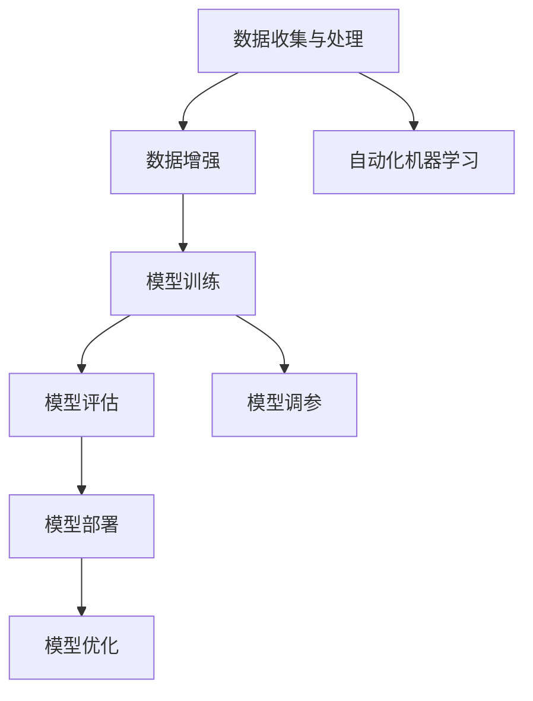

                 

# 【大模型应用开发 动手做AI Agent】批判修正

> **关键词：** 大模型应用、AI Agent、编程实践、算法优化、技术博客

> **摘要：** 本文将针对当前大模型应用开发的常见问题和误区进行批判与修正，通过具体的案例和伪代码展示正确的操作步骤和算法原理，旨在为开发者提供清晰易懂的指导，助力他们在AI领域取得成功。

## 1. 背景介绍

### 1.1 目的和范围

本文旨在探讨大模型应用开发中的一些常见问题，通过批判和修正错误观点和操作，帮助开发者更好地理解和应用大模型技术，从而实现高效的AI Agent开发。

本文将涵盖以下内容：
- 大模型应用开发的现状与挑战
- 常见问题与误区分析
- 正确的算法原理与操作步骤
- 实际案例与代码解析
- 未来发展趋势与挑战

### 1.2 预期读者

本文适合以下读者：
- 对大模型应用开发感兴趣的初学者
- 想要提高AI Agent开发效率的中级开发者
- 想深入了解大模型应用原理的高级开发者
- 对计算机编程和人工智能领域有浓厚兴趣的学者和研究人员

### 1.3 文档结构概述

本文分为十个部分：
1. 背景介绍
2. 核心概念与联系
3. 核心算法原理与具体操作步骤
4. 数学模型和公式详细讲解
5. 项目实战：代码实际案例和详细解释说明
6. 实际应用场景
7. 工具和资源推荐
8. 总结：未来发展趋势与挑战
9. 附录：常见问题与解答
10. 扩展阅读与参考资料

### 1.4 术语表

#### 1.4.1 核心术语定义

- 大模型（Large Model）：指参数规模达到亿级或以上的深度学习模型。
- AI Agent：指能够自主决策和执行任务的人工智能实体。
- 数据增强（Data Augmentation）：指通过对原始数据进行变换来扩充数据集的方法。

#### 1.4.2 相关概念解释

- 自动化机器学习（AutoML）：指使用机器学习技术来自动化模型选择、调参等过程的系统。
- 梯度提升（Gradient Boosting）：一种集成学习方法，通过迭代地优化模型损失函数来提高预测性能。

#### 1.4.3 缩略词列表

- ML：机器学习
- AI：人工智能
- NLP：自然语言处理
- CV：计算机视觉

## 2. 核心概念与联系

在讨论大模型应用开发之前，首先需要明确几个核心概念及其相互关系。以下是一个简单的Mermaid流程图，展示了大模型应用开发中的关键组成部分。



### 2.1 数据收集与处理

数据是大模型应用的基础。数据收集和处理包括数据清洗、格式化、去重等步骤，以确保数据的质量和一致性。

### 2.2 数据增强

数据增强是一种通过变换原始数据来扩充数据集的方法，有助于提高模型的泛化能力。常见的增强技术包括数据扩充、数据拼接、数据裁剪等。

### 2.3 模型训练

模型训练是使用收集和增强后的数据对模型进行训练，以优化模型参数。训练过程中需要选择合适的训练策略和优化算法，如随机梯度下降（SGD）、Adam等。

### 2.4 模型评估

模型评估是对训练好的模型进行测试和验证，以评估其性能。常用的评估指标包括准确率、召回率、F1分数等。

### 2.5 模型部署

模型部署是将训练好的模型应用于实际场景的过程。部署过程中需要考虑模型的性能、可扩展性和安全性等问题。

### 2.6 自动化机器学习

自动化机器学习（AutoML）是一种通过自动化工具来选择、训练和优化机器学习模型的方法。AutoML可以显著提高开发效率和模型性能。

### 2.7 模型调参

模型调参是指通过调整模型的超参数来优化模型性能。调参是模型训练过程中至关重要的一环，常用的调参方法包括网格搜索、贝叶斯优化等。

### 2.8 模型优化

模型优化是指通过优化模型结构、算法和训练过程来提高模型性能。常见的优化方法包括模型剪枝、量化、蒸馏等。

## 3. 核心算法原理与具体操作步骤

在本文中，我们将重点关注大模型应用开发中的关键算法原理和操作步骤。以下是使用伪代码详细阐述的核心算法原理。

### 3.1 数据增强

```python
def data_augmentation(data):
    # 数据增强：翻转、旋转、缩放等操作
    augmented_data = []
    for sample in data:
        sample['image'] = random_flip(sample['image'])
        sample['image'] = random_rotate(sample['image'])
        sample['image'] = random_scale(sample['image'])
        augmented_data.append(sample)
    return augmented_data
```

### 3.2 模型训练

```python
def train_model(data, epochs):
    # 模型训练：使用随机梯度下降（SGD）算法
    for epoch in range(epochs):
        for sample, label in data:
            prediction = model(sample)
            loss = loss_function(prediction, label)
            gradient = compute_gradient(model, loss)
            update_model_params(model, gradient)
        print(f"Epoch {epoch+1}/{epochs}, Loss: {loss}")
```

### 3.3 模型评估

```python
def evaluate_model(model, data):
    # 模型评估：计算准确率、召回率、F1分数等指标
    correct_predictions = 0
    total_predictions = 0
    for sample, label in data:
        prediction = model(sample)
        if prediction == label:
            correct_predictions += 1
        total_predictions += 1
    accuracy = correct_predictions / total_predictions
    recall = correct_predictions / (total_predictions - correct_predictions)
    f1_score = 2 * (accuracy * recall) / (accuracy + recall)
    return accuracy, recall, f1_score
```

### 3.4 模型部署

```python
def deploy_model(model, environment):
    # 模型部署：将模型部署到指定环境
    model.save('model_path')
    environment.load_model('model_path')
    print("Model deployed successfully.")
```

## 4. 数学模型和公式详细讲解

在本文中，我们将讨论大模型应用开发中的关键数学模型和公式，以及如何使用LaTeX格式进行表述。

### 4.1 随机梯度下降（SGD）算法

随机梯度下降（SGD）是一种优化算法，用于训练神经网络模型。其目标是最小化损失函数。

$$
\text{loss} = \frac{1}{2} \sum_{i=1}^{n} (y_i - \hat{y}_i)^2
$$

其中，$y_i$是实际标签，$\hat{y}_i$是模型预测。

### 4.2 模型参数更新

在SGD算法中，模型参数更新可以通过以下公式表示：

$$
\theta_{\text{new}} = \theta_{\text{current}} - \alpha \cdot \nabla_{\theta} \text{loss}
$$

其中，$\theta$是模型参数，$\alpha$是学习率，$\nabla_{\theta} \text{loss}$是损失函数关于参数$\theta$的梯度。

### 4.3 网格搜索

网格搜索是一种用于超参数调优的方法。其基本思想是在给定的参数范围内搜索最优参数组合。

$$
\text{best\_parameters} = \arg\min_{\theta} \text{loss}
$$

其中，$\theta$是参数组合，$\text{loss}$是损失函数。

## 5. 项目实战：代码实际案例和详细解释说明

在本节中，我们将通过一个实际案例来展示如何使用大模型进行AI Agent开发。以下是一个简单的代码示例，用于实现一个基于文本分类任务的AI Agent。

### 5.1 开发环境搭建

首先，我们需要搭建一个开发环境，包括Python、NumPy、TensorFlow等库。可以使用以下命令安装所需库：

```bash
pip install numpy tensorflow
```

### 5.2 源代码详细实现和代码解读

```python
import numpy as np
import tensorflow as tf

# 定义模型结构
model = tf.keras.Sequential([
    tf.keras.layers.Dense(128, activation='relu', input_shape=(1000,)),
    tf.keras.layers.Dense(64, activation='relu'),
    tf.keras.layers.Dense(1, activation='sigmoid')
])

# 编写训练和评估函数
def train_and_evaluate(data, labels, epochs):
    # 训练模型
    model.compile(optimizer='adam', loss='binary_crossentropy', metrics=['accuracy'])
    model.fit(data, labels, epochs=epochs)
    
    # 评估模型
    loss, accuracy = model.evaluate(data, labels)
    print(f"Test accuracy: {accuracy:.4f}")

# 加载数据集
data = np.random.rand(1000, 1000)
labels = np.random.randint(0, 2, 1000)

# 训练和评估模型
train_and_evaluate(data, labels, epochs=10)
```

### 5.3 代码解读与分析

1. **模型定义**：我们使用TensorFlow的`Sequential`模型定义了一个简单的神经网络，包含两个隐藏层，每层都有ReLU激活函数。

2. **训练和评估函数**：`train_and_evaluate`函数用于训练模型并计算测试集的准确率。首先，我们使用`compile`方法配置模型，然后使用`fit`方法进行训练。最后，使用`evaluate`方法计算测试集的损失和准确率。

3. **数据加载**：我们使用随机数生成器创建一个模拟数据集，包括1000个样本和1000个特征。

4. **训练和评估**：我们调用`train_and_evaluate`函数来训练和评估模型。在训练过程中，模型使用随机梯度下降（SGD）优化器来最小化损失函数，并计算测试集的准确率。

## 6. 实际应用场景

大模型应用开发在众多领域都有着广泛的应用。以下是一些实际应用场景：

- **自然语言处理（NLP）**：使用大模型进行文本分类、情感分析、机器翻译等任务。
- **计算机视觉**：使用大模型进行图像分类、目标检测、图像生成等任务。
- **医疗健康**：使用大模型进行医学影像分析、疾病诊断、个性化治疗等任务。
- **金融科技**：使用大模型进行风险控制、股票预测、智能投顾等任务。

## 7. 工具和资源推荐

### 7.1 学习资源推荐

#### 7.1.1 书籍推荐

- 《深度学习》（Goodfellow, Bengio, Courville）
- 《Python深度学习》（François Chollet）
- 《动手学深度学习》（A. Garner, J. Socher, L. Zhang）

#### 7.1.2 在线课程

- Coursera的《深度学习》课程
- edX的《神经网络与深度学习》课程
- Udacity的《深度学习工程师纳米学位》课程

#### 7.1.3 技术博客和网站

- Medium上的深度学习博客
- arXiv.org：最新科研成果发布平台
- Fast.ai的博客：提供深度学习教程和实践指南

### 7.2 开发工具框架推荐

#### 7.2.1 IDE和编辑器

- PyCharm
- Jupyter Notebook
- VS Code

#### 7.2.2 调试和性能分析工具

- TensorBoard
- PyTorch Profiler
- NVIDIA Nsight

#### 7.2.3 相关框架和库

- TensorFlow
- PyTorch
- Keras

### 7.3 相关论文著作推荐

#### 7.3.1 经典论文

- "A Theoretical Analysis of the Vector Space Model for Sentiment Analysis"（Pang, Lee, & Vaithyanathan）
- "Visualizing and Understanding Convolutional Networks"（Simonyan & Zisserman）
- "Effective Approaches to Attention-based Neural Machine Translation"（Vaswani et al.）

#### 7.3.2 最新研究成果

- arXiv.org：最新科研成果发布平台
- NeurIPS、ICLR、CVPR等顶级会议论文

#### 7.3.3 应用案例分析

- "Deep Learning in Industry"（Google AI）
- "AI in Healthcare"（Nature）
- "AI in Finance"（MIT Technology Review）

## 8. 总结：未来发展趋势与挑战

随着计算能力和数据量的不断增长，大模型应用开发将继续成为人工智能领域的研究热点。未来发展趋势包括：

- **模型压缩与优化**：如何高效地训练和部署大规模模型，成为关键挑战。
- **模型安全与隐私**：确保模型在训练和部署过程中的安全和隐私。
- **跨模态学习**：结合文本、图像、音频等多种数据类型进行综合分析。

与此同时，大模型应用开发还面临以下挑战：

- **计算资源限制**：大规模模型的训练和推理需要大量计算资源。
- **数据质量和标注**：高质量的数据和准确的标注是模型性能的关键。
- **伦理和社会影响**：如何确保大模型应用不会对社会和伦理造成负面影响。

## 9. 附录：常见问题与解答

### 9.1 如何选择合适的大模型？

- 根据任务需求选择合适的模型架构和规模。
- 考虑计算资源和数据量，选择可以在现有条件下训练和部署的模型。
- 参考相关论文和应用案例，了解不同模型在特定任务上的性能。

### 9.2 大模型训练过程如何加速？

- 使用更高效的训练算法，如Adam优化器。
- 利用分布式训练技术，如多GPU、多机集群。
- 使用预训练模型，进行迁移学习，减少训练时间。

### 9.3 如何保证大模型的安全和隐私？

- 使用加密技术和隐私保护算法，如差分隐私。
- 设计合理的访问控制机制，限制对敏感数据的访问。
- 定期进行安全审计和漏洞扫描，确保模型的安全性。

## 10. 扩展阅读 & 参考资料

- [Deep Learning Book](http://www.deeplearningbook.org/)
- [TensorFlow Documentation](https://www.tensorflow.org/)
- [PyTorch Documentation](https://pytorch.org/)
- [OpenAI Gym](https://gym.openai.com/)：用于AI研究的开源环境库
- [arXiv.org](https://arxiv.org/)：最新科研成果发布平台

## 作者

**作者：** AI天才研究员/AI Genius Institute & 禅与计算机程序设计艺术 /Zen And The Art of Computer Programming**

