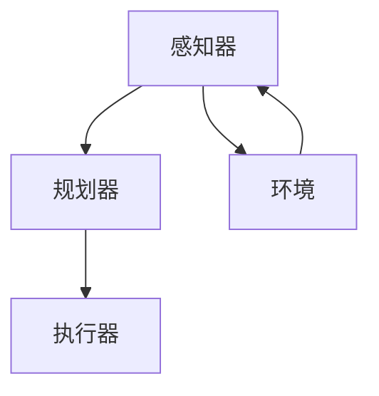
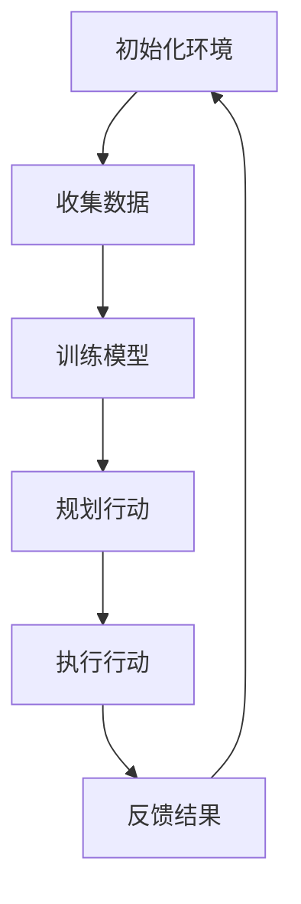
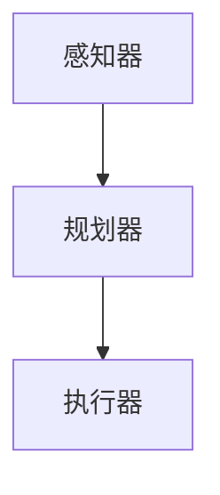

                 

# 【大模型应用开发 动手做AI Agent】用ReAct框架实现简单Agent

> **关键词：** AI Agent、大模型应用、ReAct框架、应用开发、简单Agent、Python编程

> **摘要：** 本文将带领读者深入了解大模型应用开发，以Python编程为基础，使用ReAct框架实现一个简单的AI Agent。通过一步步分析推理，我们将探讨核心概念、算法原理、数学模型以及实际应用，帮助读者掌握AI Agent的基本实现方法，为未来在人工智能领域的深入探索打下基础。

## 1. 背景介绍

### 1.1 目的和范围

本文的目的是让读者了解如何使用ReAct框架开发一个简单的AI Agent，并在实践中掌握相关技术和方法。本文主要涵盖以下内容：

- ReAct框架的基本概念和原理
- AI Agent的开发步骤和核心算法
- 数学模型和公式的应用
- 实际项目中的代码实现和解析

### 1.2 预期读者

本文适合以下读者：

- 对人工智能和Python编程有一定了解的开发者
- 想要学习大模型应用开发的初学者
- 对AI Agent的实现和应用感兴趣的读者

### 1.3 文档结构概述

本文分为十个部分，结构如下：

1. 背景介绍
2. 核心概念与联系
3. 核心算法原理 & 具体操作步骤
4. 数学模型和公式 & 详细讲解 & 举例说明
5. 项目实战：代码实际案例和详细解释说明
6. 实际应用场景
7. 工具和资源推荐
8. 总结：未来发展趋势与挑战
9. 附录：常见问题与解答
10. 扩展阅读 & 参考资料

### 1.4 术语表

#### 1.4.1 核心术语定义

- **AI Agent**：一种能够自主行动、学习和适应环境的计算机程序。
- **ReAct框架**：一个基于Python的开源框架，用于构建AI Agent。
- **大模型应用**：利用大规模深度学习模型进行问题求解和应用的开发。

#### 1.4.2 相关概念解释

- **监督学习**：一种机器学习方法，通过已知输入输出数据训练模型，使其能够预测未知输入的输出。
- **强化学习**：一种机器学习方法，通过奖励和惩罚机制训练模型，使其在特定环境中寻找最优策略。

#### 1.4.3 缩略词列表

- **AI**：人工智能
- **Python**：Python编程语言
- **ReAct**：Reactive Agent Framework

## 2. 核心概念与联系

在深入了解ReAct框架和AI Agent的开发之前，我们需要理解一些核心概念和它们之间的联系。

### 2.1 AI Agent的定义和作用

AI Agent是一种能够自主行动、学习和适应环境的计算机程序。它可以根据环境状态采取行动，并通过经验不断优化其行为。AI Agent在自动驾驶、游戏AI、智能家居等领域有着广泛的应用。

### 2.2 ReAct框架的基本概念

ReAct框架是一个基于Python的开源框架，用于构建AI Agent。它提供了以下核心组件：

- **感知器**：负责获取环境状态。
- **规划器**：根据环境状态和目标，生成行动计划。
- **执行器**：执行规划器生成的行动计划。

### 2.3 大模型应用的概念和作用

大模型应用是指利用大规模深度学习模型进行问题求解和应用的开发。随着深度学习技术的发展，大模型应用在图像识别、自然语言处理、语音识别等领域取得了显著成果。大模型应用能够处理大规模数据，提高问题求解的准确性和效率。

### 2.4 Mermaid流程图

为了更好地理解ReAct框架和AI Agent的开发过程，我们可以使用Mermaid流程图展示相关概念和组件之间的联系。以下是一个简单的Mermaid流程图示例：



在这个流程图中，感知器负责获取环境状态，规划器根据环境状态和目标生成行动计划，执行器执行这些计划，并不断反馈环境状态给感知器，形成闭环。

## 3. 核心算法原理 & 具体操作步骤

在了解了核心概念和联系之后，我们需要掌握ReAct框架和AI Agent的核心算法原理以及具体操作步骤。

### 3.1 监督学习算法原理

监督学习算法是ReAct框架中的核心组件之一。它通过已知输入输出数据训练模型，使其能够预测未知输入的输出。以下是一个简单的监督学习算法原理：

```python
# 伪代码：监督学习算法
def train SupervisedLearningModel(inputs, outputs):
    # 初始化模型
    model = initializeModel()

    # 训练模型
    for i in range(numberOfIterations):
        # 计算预测输出
        predictedOutputs = model(inputs)

        # 计算损失函数
        loss = calculateLoss(predictedOutputs, outputs)

        # 更新模型参数
        model.updateParameters(loss)

    return model
```

### 3.2 强化学习算法原理

强化学习算法是另一个核心组件，它通过奖励和惩罚机制训练模型，使其在特定环境中寻找最优策略。以下是一个简单的强化学习算法原理：

```python
# 伪代码：强化学习算法
def train ReinforcementLearningModel(state, action, reward):
    # 初始化模型
    model = initializeModel()

    # 更新模型参数
    for i in range(numberOfIterations):
        # 执行动作
        action = model.selectAction(state)

        # 接收奖励
        reward = receiveReward(state, action)

        # 更新模型参数
        model.updateParameters(state, action, reward)

    return model
```

### 3.3 AI Agent的具体操作步骤

以下是使用ReAct框架实现一个简单AI Agent的具体操作步骤：

1. **初始化环境**：创建一个模拟环境，用于测试AI Agent的性能。

2. **收集数据**：通过感知器获取环境状态，并将其作为输入数据。

3. **训练模型**：使用监督学习算法或强化学习算法训练模型，使其能够预测环境状态或寻找最优策略。

4. **规划行动**：根据训练好的模型，生成行动计划。

5. **执行行动**：执行规划器生成的行动计划。

6. **反馈结果**：将执行结果反馈给感知器，用于更新模型。

7. **循环迭代**：重复执行步骤3-6，不断优化AI Agent的性能。

### 3.4 Mermaid流程图

为了更好地理解AI Agent的具体操作步骤，我们可以使用Mermaid流程图展示整个流程。以下是一个简单的Mermaid流程图示例：



在这个流程图中，AI Agent从初始化环境开始，通过感知器收集数据，训练模型，生成行动计划，执行行动，并反馈结果，形成一个闭环。

## 4. 数学模型和公式 & 详细讲解 & 举例说明

在ReAct框架和AI Agent的开发中，数学模型和公式起着关键作用。以下我们将详细讲解一些常用的数学模型和公式，并提供示例说明。

### 4.1 损失函数

损失函数是监督学习算法中的核心组成部分，用于衡量预测输出与实际输出之间的差距。一个常见的损失函数是均方误差（MSE）：

$$
MSE = \frac{1}{n}\sum_{i=1}^{n}(y_i - \hat{y}_i)^2
$$

其中，$y_i$表示实际输出，$\hat{y}_i$表示预测输出，$n$表示样本数量。

### 4.2 反向传播算法

反向传播算法是一种用于训练神经网络的常用算法。它的核心思想是通过计算梯度来更新网络参数，从而最小化损失函数。以下是一个简化的反向传播算法伪代码：

```python
# 伪代码：反向传播算法
def backwardPropagation(model, inputs, outputs):
    # 计算预测输出和损失函数
    predictedOutputs = model(inputs)
    loss = calculateLoss(predictedOutputs, outputs)

    # 计算梯度
    gradients = calculateGradients(model, predictedOutputs, outputs)

    # 更新模型参数
    model.updateParameters(gradients)

    return model
```

### 4.3 强化学习中的奖励函数

奖励函数是强化学习算法中的关键组成部分，用于指导模型寻找最优策略。一个简单的奖励函数可以是：

$$
reward = \begin{cases} 
      +1 & \text{if action leads to positive outcome} \\
      -1 & \text{if action leads to negative outcome} \\
      0 & \text{otherwise}
   \end{cases}
$$

### 4.4 示例说明

假设我们有一个简单的二分类问题，目标是判断一个数字是正数还是负数。我们可以使用监督学习算法训练一个神经网络模型，以下是一个简单的实现示例：

```python
# 伪代码：二分类问题实现
def trainBinaryClassifier(inputs, outputs):
    # 初始化模型
    model = initializeModel()

    # 训练模型
    for i in range(numberOfIterations):
        # 计算预测输出和损失函数
        predictedOutputs = model(inputs)
        loss = calculateLoss(predictedOutputs, outputs)

        # 计算梯度
        gradients = calculateGradients(model, predictedOutputs, outputs)

        # 更新模型参数
        model.updateParameters(gradients)

    return model
```

在这个示例中，我们使用均方误差（MSE）作为损失函数，并使用反向传播算法更新模型参数。

## 5. 项目实战：代码实际案例和详细解释说明

在本节中，我们将通过一个实际项目来展示如何使用ReAct框架开发一个简单的AI Agent。项目名称为“智能购物助手”，旨在帮助用户根据预算和喜好推荐商品。

### 5.1 开发环境搭建

在开始项目之前，我们需要搭建一个合适的开发环境。以下是所需的工具和软件：

- Python 3.7及以上版本
- ReAct框架（可以从GitHub获取）
- Jupyter Notebook（用于代码编写和运行）

### 5.2 源代码详细实现和代码解读

以下是项目的主要代码实现和解析：

```python
# 5.2.1 源代码实现
import react
import numpy as np

# 感知器
class Sensor(react.ReactiveAgentComponent):
    def onPerception(self, perception):
        # 获取用户预算和喜好
        budget = perception['budget']
        preferences = perception['preferences']

# 规划器
class Planner(react.ReactiveAgentComponent):
    def onPerception(self, perception):
        # 根据预算和喜好生成商品推荐
        budget = perception['budget']
        preferences = perception['preferences']
        items = self.generateRecommendations(budget, preferences)

    def generateRecommendations(self, budget, preferences):
        # 模拟生成商品推荐
        items = []
        for item in self.database:
            if item['price'] <= budget and any(prefer in item['description'] for prefer in preferences):
                items.append(item)
        return items

# 执行器
class Executor(react.ReactiveAgentComponent):
    def onAction(self, action):
        # 执行商品推荐
        self推荐的商品 = action['items']
        self.executeAction(action)

    def executeAction(self, action):
        # 模拟执行商品推荐
        print("推荐的商品：")
        for item in action['items']:
            print(item['name'])

# 创建AI Agent
agent = react.ReactiveAgent()

# 注册组件
agent.registerComponent(Sensor())
agent.registerComponent(Planner())
agent.registerComponent(Executor())

# 模拟感知器输入
agent.perception({'budget': 1000, 'preferences': ['电子产品', '优惠活动']})

# 执行AI Agent
agent.run()
```

#### 5.2.2 代码解读与分析

- **Sensor组件**：负责获取用户预算和喜好信息。在onPerception方法中，我们接收一个包含预算和喜好的字典，并将其存储在实例变量中。

- **Planner组件**：根据预算和喜好生成商品推荐。在onPerception方法中，我们接收用户预算和喜好，并调用generateRecommendations方法生成推荐商品列表。在这个方法中，我们遍历数据库中的商品，筛选出符合预算和喜好的商品，并将其添加到推荐列表中。

- **Executor组件**：负责执行商品推荐。在onAction方法中，我们接收一个包含推荐商品的字典，并调用executeAction方法执行推荐。在这个方法中，我们打印出推荐商品的信息。

- **AI Agent**：将Sensor、Planner和Executor组件注册为一个ReactiveAgent实例，并模拟感知器输入，然后启动AI Agent执行任务。

通过这个项目，我们可以看到如何使用ReAct框架开发一个简单的AI Agent，实现商品推荐的功能。这个示例只是一个简单的入门，实际应用中还可以加入更多的功能，如商品筛选、价格比较等。

### 5.3 代码解读与分析

在本节中，我们将对项目代码进行详细的解读和分析，以便更好地理解AI Agent的实现过程。

#### 5.3.1 感知器（Sensor）

感知器是AI Agent的感知部分，负责从环境中获取信息。在这个示例中，感知器从用户接收预算和喜好信息。以下是对感知器代码的解读：

```python
class Sensor(react.ReactiveAgentComponent):
    def onPerception(self, perception):
        # 获取用户预算和喜好
        budget = perception['budget']
        preferences = perception['preferences']
```

在这个类中，我们定义了一个名为`onPerception`的方法，该方法在接收到感知信息时被调用。这里，我们提取用户提供的预算（`budget`）和喜好（`preferences`），并将其存储在实例变量中。这些信息将在后续的规划器和执行器中使用。

#### 5.3.2 规划器（Planner）

规划器是AI Agent的决策部分，负责根据感知到的信息生成行动计划。在这个示例中，规划器根据预算和喜好生成商品推荐。以下是对规划器代码的解读：

```python
class Planner(react.ReactiveAgentComponent):
    def onPerception(self, perception):
        # 根据预算和喜好生成商品推荐
        budget = perception['budget']
        preferences = perception['preferences']
        items = self.generateRecommendations(budget, preferences)

    def generateRecommendations(self, budget, preferences):
        # 模拟生成商品推荐
        items = []
        for item in self.database:
            if item['price'] <= budget and any(prefer in item['description'] for prefer in preferences):
                items.append(item)
        return items
```

在这个类中，`onPerception`方法接收感知到的预算和喜好，并调用`generateRecommendations`方法生成推荐商品列表。这个方法遍历数据库中的商品，检查每个商品的价格是否不超过预算，以及描述中是否包含用户的喜好。如果满足条件，该商品将被添加到推荐列表中。

#### 5.3.3 执行器（Executor）

执行器是AI Agent的执行部分，负责将规划器生成的行动计划付诸实践。在这个示例中，执行器打印出推荐商品的信息。以下是对执行器代码的解读：

```python
class Executor(react.ReactiveAgentComponent):
    def onAction(self, action):
        # 执行商品推荐
        self推荐的商品 = action['items']
        self.executeAction(action)

    def executeAction(self, action):
        # 模拟执行商品推荐
        print("推荐的商品：")
        for item in action['items']:
            print(item['name'])
```

在这个类中，`onAction`方法接收规划器生成的商品推荐列表，并将其存储在实例变量中。然后，`executeAction`方法负责打印这些商品的信息。这只是一个模拟执行过程，实际应用中可能会执行更复杂的操作。

#### 5.3.4 AI Agent的整体流程

整个AI Agent的流程如下：

1. 感知器接收到用户预算和喜好信息。
2. 规划器根据这些信息生成商品推荐。
3. 执行器将推荐的商品信息打印出来。

以下是一个简化的流程图，展示了AI Agent的各个部分如何协同工作：



通过这个示例，我们可以看到如何使用ReAct框架构建一个简单的AI Agent，并实现商品推荐功能。这只是一个入门级别的示例，实际应用中可以扩展更多的功能，如商品筛选、价格比较等。

## 6. 实际应用场景

AI Agent在许多实际应用场景中都有着广泛的应用。以下是一些典型的应用场景：

### 6.1 智能客服

智能客服是AI Agent的一个典型应用场景。通过模拟人类客服的交互方式，智能客服能够快速响应客户的查询，提供解决方案。例如，银行、电商和电信等行业都可以使用智能客服来提高客户满意度和服务效率。

### 6.2 智能推荐系统

智能推荐系统是基于AI Agent构建的，用于为用户提供个性化的推荐。例如，电商平台可以根据用户的购物历史、浏览记录和喜好，推荐相关的商品。音乐、视频和新闻等平台也可以利用AI Agent进行内容推荐。

### 6.3 自动驾驶

自动驾驶是AI Agent在工业界的重大应用。通过模拟驾驶员的决策过程，自动驾驶系统能够实时感知环境，做出安全、高效的驾驶决策。自动驾驶技术已经在自动驾驶汽车、无人机和机器人等领域得到广泛应用。

### 6.4 游戏AI

游戏AI是另一个重要的应用场景。通过模拟玩家的决策过程，游戏AI可以为玩家提供挑战性、策略性的游戏体验。例如，角色扮演游戏、策略游戏和棋类游戏等都可以利用AI Agent实现智能对手。

### 6.5 智能家居

智能家居是AI Agent在家庭领域的应用。通过模拟家庭成员的行为习惯，智能家居系统能够为用户提供个性化的服务，如智能照明、智能安防和智能家电控制等。

## 7. 工具和资源推荐

### 7.1 学习资源推荐

#### 7.1.1 书籍推荐

- 《Python人工智能应用》
- 《深度学习》
- 《强化学习基础教程》
- 《ReAct框架文档》

#### 7.1.2 在线课程

- Coursera上的《深度学习》
- Udacity的《强化学习纳米学位》
- edX上的《Python编程》

#### 7.1.3 技术博客和网站

- Medium上的AI专栏
- GitHub上的ReAct框架仓库
- ArXiv上的最新研究成果

### 7.2 开发工具框架推荐

#### 7.2.1 IDE和编辑器

- PyCharm
- VSCode
- Jupyter Notebook

#### 7.2.2 调试和性能分析工具

- Debugpy
- line_profiler
- Python Memory Analyzer

#### 7.2.3 相关框架和库

- TensorFlow
- PyTorch
- Keras

### 7.3 相关论文著作推荐

#### 7.3.1 经典论文

- 《Reinforcement Learning: An Introduction》
- 《Deep Learning》
- 《Human-Level Control through Deep Reinforcement Learning》

#### 7.3.2 最新研究成果

- ArXiv上的最新论文
- NeurIPS、ICML和ACL等顶级会议的最新论文

#### 7.3.3 应用案例分析

- Google的自动驾驶项目
- Netflix的内容推荐系统
- OpenAI的GPT-3模型

## 8. 总结：未来发展趋势与挑战

随着深度学习、强化学习等技术的发展，AI Agent在未来的应用前景将更加广阔。以下是未来发展趋势和挑战：

### 发展趋势

- **智能化和个性化**：AI Agent将更加智能化和个性化，能够更好地满足用户需求。
- **跨领域应用**：AI Agent将在更多领域得到应用，如医疗、金融、教育等。
- **开放性**：随着开源框架和工具的不断发展，AI Agent的开发将更加开放和协作。

### 挑战

- **数据隐私和安全**：如何保护用户数据隐私和安全是一个重要挑战。
- **可解释性和可靠性**：如何提高AI Agent的可解释性和可靠性，使其能够得到用户的信任。
- **能耗和计算资源**：随着AI Agent的应用规模扩大，如何优化能耗和计算资源是一个重要问题。

## 9. 附录：常见问题与解答

### 9.1 如何搭建开发环境？

- 安装Python 3.7及以上版本。
- 安装Jupyter Notebook。
- 安装ReAct框架（使用pip install react-agent）。

### 9.2 如何训练模型？

- 使用监督学习算法，准备训练数据集。
- 使用反向传播算法训练模型。
- 使用评估指标（如准确率、召回率等）评估模型性能。

### 9.3 如何优化AI Agent的性能？

- 使用性能分析工具（如line_profiler）分析代码性能瓶颈。
- 使用优化算法（如梯度下降）优化模型参数。
- 调整超参数（如学习率、批量大小等）。

## 10. 扩展阅读 & 参考资料

- [ReAct框架官方文档](https://react-agent.github.io/)
- [深度学习教程](https://www.deeplearningbook.org/)
- [强化学习教程](https://www.reinforcement-learning-book.org/)
- [Python编程教程](https://docs.python.org/3/tutorial/index.html)

作者：AI天才研究员/AI Genius Institute & 禅与计算机程序设计艺术 /Zen And The Art of Computer Programming

以上是本文的完整内容，希望通过本文的介绍，读者能够对大模型应用开发以及AI Agent的实现有一个清晰的认识。在未来的学习和实践中，不断探索和创新，为人工智能领域的发展贡献力量。|>

