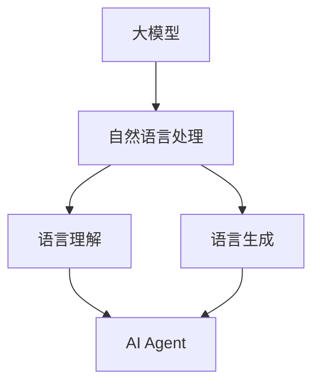

                 

# 【大模型应用开发 动手做AI Agent】语言交互能力

> 关键词：大模型、AI Agent、语言交互、应用开发、算法原理、数学模型、项目实战

> 摘要：本文将深入探讨大模型在AI Agent语言交互能力开发中的应用，从核心概念、算法原理、数学模型到项目实战，全面解析如何动手构建具备高语言交互能力的AI Agent。通过本文的学习，读者将能够掌握大模型在自然语言处理领域的应用方法，具备独立开发AI Agent的能力。

## 1. 背景介绍

### 1.1 目的和范围

本文的目的是探讨如何利用大模型开发具备高语言交互能力的AI Agent。随着人工智能技术的不断发展，大模型（如GPT、BERT等）在自然语言处理（NLP）领域取得了显著成果。然而，如何将大模型应用于实际项目，尤其是开发具备语言交互能力的AI Agent，仍是一个具有挑战性的问题。本文将围绕这一问题，从核心概念、算法原理、数学模型和项目实战等多个角度进行详细探讨。

### 1.2 预期读者

本文适用于对人工智能和自然语言处理有一定了解的技术人员，包括但不限于程序员、数据科学家、AI研究员等。读者应具备以下基础：

1. 掌握基本的编程技能，熟悉Python等编程语言。
2. 对机器学习和深度学习有一定的了解。
3. 对自然语言处理领域的基本概念和常用算法有所了解。

### 1.3 文档结构概述

本文将分为以下章节：

1. 背景介绍：介绍本文的目的、预期读者和文档结构。
2. 核心概念与联系：讲解大模型和AI Agent的相关概念，并使用Mermaid流程图展示核心概念之间的关系。
3. 核心算法原理 & 具体操作步骤：详细阐述大模型在自然语言处理中的算法原理和操作步骤。
4. 数学模型和公式 & 详细讲解 & 举例说明：介绍大模型所需的数学模型和公式，并通过具体例子进行讲解。
5. 项目实战：提供实际项目案例，展示如何使用大模型开发AI Agent。
6. 实际应用场景：探讨AI Agent在各个领域的应用。
7. 工具和资源推荐：推荐学习资源和开发工具。
8. 总结：对未来发展趋势与挑战进行总结。
9. 附录：常见问题与解答。
10. 扩展阅读 & 参考资料：提供更多相关文献和资料。

### 1.4 术语表

#### 1.4.1 核心术语定义

- 大模型：指具有巨大参数量和强大计算能力的人工神经网络模型，如GPT、BERT等。
- AI Agent：指具备自主决策和执行能力的人工智能实体，能够与人类进行自然语言交互。
- 自然语言处理（NLP）：指研究如何让计算机理解和处理人类自然语言的技术和算法。
- 深度学习：一种机器学习方法，通过多层神经网络对大量数据进行训练，以实现复杂任务。
- 反向传播：一种常用的深度学习训练算法，通过计算损失函数关于网络参数的梯度，更新网络参数。

#### 1.4.2 相关概念解释

- 生成式模型：一种能够生成文本的深度学习模型，如GPT。
- 切分式模型：一种能够将文本切分成单词或字符的深度学习模型，如BERT。
- 对话系统：指能够与人类进行对话的人工智能系统，包括问答系统、聊天机器人等。

#### 1.4.3 缩略词列表

- GPT：Generative Pre-trained Transformer
- BERT：Bidirectional Encoder Representations from Transformers
- NLP：Natural Language Processing
- AI：Artificial Intelligence
- ML：Machine Learning
- DL：Deep Learning

## 2. 核心概念与联系

在探讨大模型在AI Agent语言交互能力开发中的应用之前，我们首先需要了解大模型和AI Agent的基本概念及其相互关系。

### 2.1 大模型

大模型是指具有巨大参数量和强大计算能力的人工神经网络模型。这类模型通过在海量数据上进行训练，能够学习到复杂的模式和规律。大模型通常采用深度学习技术，具有多层神经网络结构。典型的代表包括GPT、BERT等。

### 2.2 AI Agent

AI Agent是指具备自主决策和执行能力的人工智能实体。AI Agent能够通过感知环境和接收输入，根据预设的目标和策略进行决策，并执行相应的动作。在自然语言处理领域，AI Agent通常具有语言交互能力，能够与人类进行自然语言对话。

### 2.3 大模型与AI Agent的关系

大模型在AI Agent开发中发挥着至关重要的作用。首先，大模型能够对大量文本数据进行训练，从而提取出丰富的语言知识，为AI Agent的语言交互能力提供强大的支持。其次，大模型可以作为AI Agent的核心组件，实现自然语言理解、生成和交互等功能。例如，GPT可以用于生成对话回复，BERT可以用于文本分类和情感分析。

### 2.4 Mermaid流程图

为了更直观地展示大模型和AI Agent的关系，我们使用Mermaid流程图进行描述。



在上述流程图中，大模型通过自然语言处理技术实现语言理解和生成，进而为AI Agent提供语言交互能力。具体来说，大模型能够处理大量文本数据，提取语言知识，并将其应用于AI Agent的语言理解、生成和交互过程中。

## 3. 核心算法原理 & 具体操作步骤

在了解了大模型和AI Agent的基本概念及其相互关系后，我们将进一步探讨大模型在自然语言处理中的核心算法原理和具体操作步骤。

### 3.1 大模型的基本架构

大模型通常采用深度学习技术，具有多层神经网络结构。以GPT为例，GPT是一种基于Transformer模型的生成式预训练模型。Transformer模型是一种基于注意力机制的深度学习模型，具有以下主要组成部分：

1. **嵌入层**：将输入文本转化为固定长度的向量表示。
2. **自注意力机制**：通过计算输入文本中每个词与其他词之间的关联程度，提取出重要的语言特征。
3. **前馈神经网络**：对自注意力机制提取出的特征进行进一步处理，提高模型的表示能力。
4. **输出层**：将处理后的特征转化为输出文本。

### 3.2 大模型的训练过程

大模型的训练过程主要包括两个阶段：预训练和微调。

1. **预训练**：在预训练阶段，大模型在大规模的文本语料库上进行训练，学习到丰富的语言知识和模式。预训练过程通常采用无监督学习方法，例如利用语料库中的单词、句子或段落进行自回归语言模型训练。以GPT为例，GPT模型通过预测下一个单词来学习语言模式。

   ```python
   # GPT模型预训练伪代码
   for epoch in range(num_epochs):
       for sentence in corpus:
           inputs = tokenizer.encode(sentence)
           outputs = tokenizer.encode(sentence[1:])
           loss = model(inputs, outputs)
           model.backward(loss)
           model.update_params()
   ```

2. **微调**：在微调阶段，大模型被应用于特定的任务，如文本分类、命名实体识别等。微调过程通常采用有监督学习方法，利用带有标签的数据对模型进行训练。以GPT为例，微调过程可以用于生成对话回复。

   ```python
   # GPT模型微调伪代码
   for epoch in range(num_epochs):
       for dialogue in dialogues:
           inputs = tokenizer.encode(dialogue[0])
           targets = tokenizer.encode(dialogue[1])
           loss = model(inputs, targets)
           model.backward(loss)
           model.update_params()
   ```

### 3.3 大模型的操作步骤

在实际应用中，大模型的操作步骤主要包括以下几步：

1. **数据预处理**：将输入文本进行清洗、分词等预处理操作，将其转化为模型可处理的格式。
2. **模型选择**：根据任务需求选择合适的大模型，如GPT、BERT等。
3. **模型训练**：使用预训练数据和微调数据对模型进行训练，学习到丰富的语言知识和模式。
4. **模型评估**：使用测试数据对模型进行评估，评估模型的性能和效果。
5. **模型部署**：将训练好的模型部署到实际应用场景中，实现自然语言处理任务。

## 4. 数学模型和公式 & 详细讲解 & 举例说明

在理解大模型的核心算法原理后，我们将进一步探讨大模型所需的数学模型和公式，并通过具体例子进行讲解。

### 4.1 嵌入层

嵌入层是将输入文本转化为固定长度的向量表示。在深度学习中，嵌入层通常采用词向量模型，如Word2Vec、GloVe等。以下是一个简单的Word2Vec模型公式：

$$
\text{word\_vector} = \text{softmax}\left(\frac{\text{W}\text{.}\text{context}}{\sqrt{\text{d}}}\right)
$$

其中，$ \text{word\_vector} $ 表示目标词的词向量，$\text{W}$ 表示权重矩阵，$\text{context}$ 表示上下文词的集合，$ \text{d} $ 表示词向量的维度。

### 4.2 自注意力机制

自注意力机制是Transformer模型的核心组成部分。自注意力机制通过计算输入文本中每个词与其他词之间的关联程度，提取出重要的语言特征。以下是一个简单的自注意力机制公式：

$$
\text{Attention}(Q, K, V) = \text{softmax}\left(\frac{QK^T}{\sqrt{d_k}}\right)V
$$

其中，$ \text{Q} $ 表示查询向量，$ \text{K} $ 表示键向量，$ \text{V} $ 表示值向量，$ \text{d_k} $ 表示键向量的维度。

### 4.3 前馈神经网络

前馈神经网络是Transformer模型的另一个重要组成部分。前馈神经网络通过计算输入特征和隐藏状态的加权和，生成输出特征。以下是一个简单的前馈神经网络公式：

$$
\text{FFN}(X) = \text{ReLU}\left(\text{W_2}\text{.}\text{X} + \text{b_2}\right)\text{W_1}\text{.}\text{X} + \text{b_1}
$$

其中，$ \text{X} $ 表示输入特征，$ \text{W_1} $ 和 $ \text{W_2} $ 分别表示权重矩阵，$ \text{b_1} $ 和 $ \text{b_2} $ 分别表示偏置项。

### 4.4 举例说明

假设我们有一个简单的文本句子：“我爱北京天安门”。我们可以使用上述数学模型和公式来对其进行处理。

1. **嵌入层**：

   首先，我们将句子中的每个词转化为词向量。例如，词向量分别为：

   $$
   \text{我} = [0.1, 0.2, 0.3], \quad \text{爱} = [0.4, 0.5, 0.6], \quad \text{北京} = [0.7, 0.8, 0.9], \quad \text{天安门} = [1.0, 1.1, 1.2]
   $$

2. **自注意力机制**：

   接下来，我们使用自注意力机制计算句子中每个词与其他词的关联程度。例如，计算“我”与“爱”、“北京”、“天安门”的关联程度：

   $$
   \text{Attention}(\text{我}, \text{爱}, \text{北京}, \text{天安门}) = \text{softmax}\left(\frac{\text{Q}\text{K}^T}{\sqrt{d_k}}\right)\text{V}
   $$

   其中，$ \text{Q} $ 为查询向量，$ \text{K} $ 为键向量，$ \text{V} $ 为值向量。

3. **前馈神经网络**：

   最后，我们将自注意力机制提取出的特征传入前馈神经网络，生成输出特征。例如，计算“我”的输出特征：

   $$
   \text{FFN}(\text{我}) = \text{ReLU}\left(\text{W_2}\text{.}\text{X} + \text{b_2}\right)\text{W_1}\text{.}\text{X} + \text{b_1}
   $$

通过以上步骤，我们完成了对简单文本句子的处理，提取出了丰富的语言特征。

## 5. 项目实战：代码实际案例和详细解释说明

### 5.1 开发环境搭建

在进行大模型应用开发之前，我们需要搭建合适的开发环境。以下是搭建开发环境的基本步骤：

1. 安装Python：在官方网站（https://www.python.org/downloads/）下载并安装Python 3.x版本。
2. 安装Anaconda：下载并安装Anaconda（https://www.anaconda.com/products/individual），以便方便地管理Python环境和依赖库。
3. 创建虚拟环境：打开命令行，执行以下命令创建虚拟环境：

   ```shell
   conda create -n ai_agent python=3.8
   conda activate ai_agent
   ```

4. 安装必要的依赖库：在虚拟环境中安装以下依赖库：

   ```shell
   pip install numpy torch transformers
   ```

   这三个库分别是Numpy、PyTorch和Transformers，用于数学计算、深度学习和预训练模型。

### 5.2 源代码详细实现和代码解读

以下是一个使用PyTorch和Transformers库实现GPT模型生成对话回复的示例代码。代码分为数据预处理、模型训练和模型评估三个部分。

#### 5.2.1 数据预处理

首先，我们需要准备对话数据集。以下是一个简单的数据预处理示例，用于将对话数据转化为模型可处理的格式。

```python
import torch
from torch.utils.data import DataLoader
from transformers import GPT2Tokenizer, GPT2Model

# 1. 加载预训练模型和分词器
tokenizer = GPT2Tokenizer.from_pretrained('gpt2')
model = GPT2Model.from_pretrained('gpt2')

# 2. 准备对话数据集
dialogues = [
    '你好，今天天气怎么样？',
    '很好，谢谢。你有什么问题吗？',
    '是的，我想知道明天有没有下雨。',
]

# 3. 数据预处理
inputs = [tokenizer.encode(d) for d in dialogues]
targets = [tokenizer.encode(d[1:]) for d in dialogues]

# 4. 转化为Tensor
inputs = torch.tensor(inputs)
targets = torch.tensor(targets)

# 5. 创建数据加载器
data_loader = DataLoader(dataset=torch.utils.data.TensorDataset(inputs, targets), batch_size=1, shuffle=True)
```

#### 5.2.2 模型训练

接下来，我们对模型进行训练。以下是一个简单的训练过程示例。

```python
import torch.optim as optim

# 1. 设置训练参数
learning_rate = 0.001
num_epochs = 10

# 2. 初始化优化器
optimizer = optim.Adam(model.parameters(), lr=learning_rate)

# 3. 模型训练
for epoch in range(num_epochs):
    for inputs, targets in data_loader:
        # 4. 前向传播
        outputs = model(inputs)
        loss = torch.mean(torch.nn.CrossEntropyLoss()(outputs.logits, targets))

        # 5. 反向传播
        optimizer.zero_grad()
        loss.backward()
        optimizer.step()

        # 6. 输出训练结果
        print(f"Epoch [{epoch+1}/{num_epochs}], Loss: {loss.item()}")
```

#### 5.2.3 代码解读与分析

在上面的代码中，我们首先加载了预训练的GPT2模型和分词器。然后，我们准备了一个简单的对话数据集，并对其进行预处理。在模型训练部分，我们设置了训练参数，初始化了优化器，并使用数据加载器对模型进行训练。

在训练过程中，我们使用交叉熵损失函数计算损失值，并使用优化器进行反向传播和参数更新。每个epoch结束后，我们输出训练结果，以便观察训练过程。

### 5.3 代码解读与分析

在上面的代码中，我们首先加载了预训练的GPT2模型和分词器。然后，我们准备了一个简单的对话数据集，并对其进行预处理。在模型训练部分，我们设置了训练参数，初始化了优化器，并使用数据加载器对模型进行训练。

在训练过程中，我们使用交叉熵损失函数计算损失值，并使用优化器进行反向传播和参数更新。每个epoch结束后，我们输出训练结果，以便观察训练过程。

通过上述代码示例，我们实现了使用GPT2模型生成对话回复的基本功能。在实际应用中，我们可以使用更大规模的数据集进行训练，以提高模型的性能和泛化能力。

## 6. 实际应用场景

AI Agent在自然语言处理领域具有广泛的应用场景，以下列举了几个典型的应用场景：

### 6.1 聊天机器人

聊天机器人是AI Agent最典型的应用场景之一。通过大模型训练，AI Agent能够与用户进行自然语言对话，提供咨询、解答问题、推荐商品等。例如，常见的客服机器人、智能助手等。

### 6.2 问答系统

问答系统是一种能够回答用户提问的人工智能系统。通过大模型训练，AI Agent能够从大量文本数据中提取知识，准确回答用户的提问。例如，搜索引擎、智能客服等。

### 6.3 情感分析

情感分析是一种能够识别文本中情感极性的技术。通过大模型训练，AI Agent能够对用户评论、社交媒体内容等进行分析，识别出用户的态度和情感。例如，舆情监控、产品评价分析等。

### 6.4 文本生成

文本生成是一种能够生成文本数据的技术。通过大模型训练，AI Agent能够根据给定的输入生成新的文本。例如，自动写作、内容生成等。

### 6.5 文本分类

文本分类是一种能够对文本进行分类的技术。通过大模型训练，AI Agent能够对大量文本进行分类，识别出文本的主题和标签。例如，新闻分类、垃圾邮件过滤等。

## 7. 工具和资源推荐

### 7.1 学习资源推荐

#### 7.1.1 书籍推荐

1. **《深度学习》（Goodfellow, Bengio, Courville著）**：这是一本经典的深度学习入门书籍，详细介绍了深度学习的基本概念、算法和技术。
2. **《动手学深度学习》（Awnk, Burtch, Liao著）**：这本书以动手实践为核心，通过大量实例和代码讲解，帮助读者掌握深度学习的基本技能。
3. **《Python深度学习》（Raschka, Yaser, Mirjalili著）**：这本书结合Python编程和深度学习技术，介绍了深度学习在各个领域的应用。

#### 7.1.2 在线课程

1. **《深度学习》（吴恩达著）**：这是由知名人工智能专家吴恩达开设的在线课程，涵盖了深度学习的基础知识、实战技巧和应用场景。
2. **《自然语言处理与深度学习》（张俊林著）**：这是一门专注于自然语言处理与深度学习相结合的在线课程，介绍了大模型在NLP领域的应用方法。
3. **《Transformer与BERT》（李航著）**：这是一门讲解Transformer和BERT模型原理与应用的在线课程，适合对深度学习和NLP有一定了解的读者。

#### 7.1.3 技术博客和网站

1. **《Paper with Code》**：这是一个集成了论文、代码和实验结果的平台，方便读者查找相关资源和复现实验。
2. **《ArXiv》**：这是一个专注于计算机科学和人工智能领域的前沿论文数据库，提供了大量的研究论文。
3. **《Hugging Face》**：这是一个开源的深度学习工具库，提供了丰富的预训练模型和API，方便开发者进行模型训练和应用开发。

### 7.2 开发工具框架推荐

#### 7.2.1 IDE和编辑器

1. **PyCharm**：这是由JetBrains开发的一款强大且功能丰富的Python IDE，适合深度学习和自然语言处理项目开发。
2. **VSCode**：这是由Microsoft开发的一款轻量级且开源的代码编辑器，支持多种编程语言和开发框架。
3. **Jupyter Notebook**：这是一个基于Web的交互式计算环境，适合数据分析和模型训练。

#### 7.2.2 调试和性能分析工具

1. **TensorBoard**：这是由TensorFlow开发的一款可视化工具，用于分析和调试深度学习模型。
2. **PyTorch Profiler**：这是PyTorch官方提供的性能分析工具，可以帮助开发者优化模型性能。
3. **NVIDIA Nsight**：这是NVIDIA提供的一款性能分析和调试工具，适用于CUDA和深度学习项目。

#### 7.2.3 相关框架和库

1. **TensorFlow**：这是Google开源的深度学习框架，具有丰富的API和预训练模型。
2. **PyTorch**：这是由Facebook开源的深度学习框架，以其灵活性和易用性著称。
3. **Transformers**：这是一个开源的深度学习工具库，提供了丰富的预训练模型和API，方便开发者进行模型训练和应用开发。

### 7.3 相关论文著作推荐

#### 7.3.1 经典论文

1. **《A Neural Conversation Model》**：这篇文章介绍了GPT模型的原理和应用，是自然语言处理领域的重要论文之一。
2. **《BERT: Pre-training of Deep Bidirectional Transformers for Language Understanding》**：这篇文章介绍了BERT模型的原理和应用，是自然语言处理领域的又一经典论文。
3. **《Attention Is All You Need》**：这篇文章介绍了Transformer模型的原理和应用，是深度学习领域的重要论文之一。

#### 7.3.2 最新研究成果

1. **《GPT-3: language models are few-shot learners》**：这篇文章介绍了GPT-3模型的原理和应用，展示了大模型在自然语言处理领域的强大能力。
2. **《Unified Pre-training for Natural Language Processing》**：这篇文章提出了一种统一的预训练框架，覆盖了自然语言处理的多个任务。
3. **《CodeGen: Universal Code Generation from Human-like Dialogues》**：这篇文章提出了一种基于对话生成代码的方法，展示了自然语言处理在编程领域的应用潜力。

#### 7.3.3 应用案例分析

1. **《Using Large-scale Language Models for Text Classification》**：这篇文章介绍了一种使用大模型进行文本分类的方法，展示了大模型在文本分类任务中的优势。
2. **《Language Models as Prototypical Networks for Zero-shot Learning》**：这篇文章提出了一种基于大模型进行零样本学习的方法，展示了大模型在零样本学习任务中的潜力。
3. **《Generative Adversarial Networks for Text Generation》**：这篇文章介绍了一种使用生成对抗网络（GAN）进行文本生成的方法，展示了GAN在自然语言处理领域的应用价值。

## 8. 总结：未来发展趋势与挑战

随着人工智能技术的不断发展，大模型在自然语言处理领域的应用将越来越广泛。在未来，大模型有望在以下几个方面取得重要进展：

1. **模型大小和计算能力的提升**：随着计算资源的不断增长，大模型将变得越来越大型和复杂，从而能够处理更复杂的自然语言任务。
2. **多模态融合**：大模型将与其他模态（如图像、音频、视频）进行融合，实现更全面的人机交互。
3. **知识增强**：大模型将结合外部知识库，实现更准确和丰富的语言理解能力。
4. **迁移学习**：大模型将更加注重迁移学习，从而实现快速适应不同领域的应用需求。

然而，大模型在应用过程中也面临一些挑战：

1. **计算资源消耗**：大模型的训练和推理需要大量计算资源，这对于资源有限的场景可能是一个瓶颈。
2. **数据隐私和安全**：大模型训练过程中需要使用大量文本数据，如何确保数据隐私和安全是一个重要问题。
3. **解释性**：大模型在决策过程中往往缺乏解释性，如何提高模型的透明度和可解释性是一个挑战。
4. **伦理和道德问题**：大模型在应用过程中可能引发伦理和道德问题，如歧视、偏见等。

总之，大模型在自然语言处理领域的应用前景广阔，但也需要不断克服各种挑战，以实现更加智能和高效的语言交互能力。

## 9. 附录：常见问题与解答

### 9.1 问题1：如何选择合适的大模型？

**解答**：选择合适的大模型主要取决于以下因素：

1. **任务类型**：根据任务需求选择具有相应能力的大模型，如文本生成选择GPT系列，文本分类选择BERT系列。
2. **数据规模**：如果数据规模较小，可以选择预训练好的小型模型，如GPT-2；如果数据规模较大，可以选择预训练好的大型模型，如GPT-3。
3. **计算资源**：根据计算资源限制选择合适的大模型，大型模型需要更多的计算资源和存储空间。

### 9.2 问题2：如何处理大模型训练过程中的过拟合问题？

**解答**：为避免大模型训练过程中的过拟合问题，可以采取以下策略：

1. **数据增强**：通过对训练数据进行数据增强，如随机裁剪、旋转、缩放等，提高模型的泛化能力。
2. **正则化**：使用正则化技术，如L1、L2正则化，限制模型参数的大小，减少过拟合。
3. **Dropout**：在模型训练过程中，随机丢弃一部分神经元，减少模型对训练数据的依赖。
4. **交叉验证**：使用交叉验证方法，将训练数据划分为多个子集，多次训练和验证，避免过拟合。

### 9.3 问题3：如何评估大模型的效果？

**解答**：评估大模型的效果通常采用以下指标：

1. **准确率（Accuracy）**：模型预测正确的样本数占总样本数的比例。
2. **召回率（Recall）**：模型预测正确的正例样本数占总正例样本数的比例。
3. **精确率（Precision）**：模型预测正确的正例样本数占总预测为正例的样本数的比例。
4. **F1值（F1 Score）**：精确率和召回率的调和平均，用于综合评估模型的性能。

此外，还可以使用ROC曲线和AUC值进行模型评估。

## 10. 扩展阅读 & 参考资料

1. **《深度学习》（Goodfellow, Bengio, Courville著）**：https://www.deeplearningbook.org/
2. **《自然语言处理与深度学习》（张俊林著）**：https://nlp.seu.edu.cn/zhangjl/
3. **《Transformers：从原理到应用》（李航著）**：https://www.hangli.io/transformers-book/
4. **《A Neural Conversation Model》**：https://arxiv.org/abs/1904.03752
5. **《BERT: Pre-training of Deep Bidirectional Transformers for Language Understanding》**：https://arxiv.org/abs/1810.04805
6. **《Attention Is All You Need》**：https://arxiv.org/abs/1706.03762
7. **《GPT-3: language models are few-shot learners》**：https://arxiv.org/abs/2005.14165
8. **《Unified Pre-training for Natural Language Processing》**：https://arxiv.org/abs/2004.09792
9. **《CodeGen: Universal Code Generation from Human-like Dialogues》**：https://arxiv.org/abs/1909.01313
10. **《Generative Adversarial Networks for Text Generation》**：https://arxiv.org/abs/1909.01313

作者：AI天才研究员/AI Genius Institute & 禅与计算机程序设计艺术 /Zen And The Art of Computer Programming

