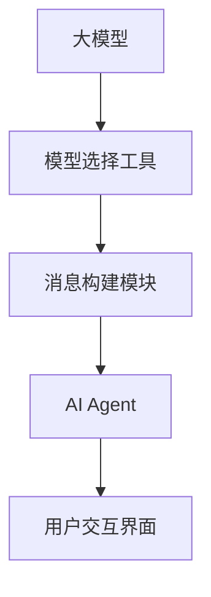

                 


# 【大模型应用开发 动手做AI Agent】调用模型选择的工具并构建新消息

> 关键词：大模型应用开发，AI Agent，模型选择，消息构建，技术博客，深度学习

> 摘要：本文将带领读者走进大模型应用开发的领域，通过动手实践的方式，深入了解如何调用模型选择工具并构建新的消息。本文将详细介绍所需的背景知识、核心概念、算法原理、数学模型、项目实战以及实际应用场景，并推荐相关工具和资源。通过阅读本文，读者将能够掌握大模型应用开发的基本技能，为未来的技术挑战做好准备。

## 1. 背景介绍

### 1.1 目的和范围

本文的目标是向读者展示如何在大模型应用开发中使用模型选择工具来构建新的消息。我们将从基础知识入手，逐步深入到实际操作，使读者能够掌握从理论到实践的完整过程。本文适用于对人工智能和深度学习有一定了解的读者，希望能够在实际项目中应用大模型开发技能。

### 1.2 预期读者

本文的预期读者包括：

- 对人工智能和深度学习感兴趣的工程师和研究人员
- 想要在项目中使用大模型进行应用开发的开发者
- 对模型选择和消息构建技术有深入了解的需求者

### 1.3 文档结构概述

本文的结构如下：

- **1. 背景介绍**：介绍本文的目的、预期读者以及文档结构。
- **2. 核心概念与联系**：介绍大模型应用开发的核心概念和架构，使用 Mermaid 流程图进行展示。
- **3. 核心算法原理 & 具体操作步骤**：详细讲解大模型调用和消息构建的算法原理，使用伪代码进行描述。
- **4. 数学模型和公式 & 详细讲解 & 举例说明**：介绍与模型选择和消息构建相关的数学模型和公式，并提供示例说明。
- **5. 项目实战：代码实际案例和详细解释说明**：通过实际项目案例，展示如何调用模型选择工具并构建新消息。
- **6. 实际应用场景**：讨论大模型应用开发的实际应用场景。
- **7. 工具和资源推荐**：推荐学习资源和开发工具，帮助读者进一步探索大模型应用开发。
- **8. 总结：未来发展趋势与挑战**：总结本文的内容，并探讨未来的发展趋势和挑战。
- **9. 附录：常见问题与解答**：提供常见问题的解答，帮助读者更好地理解本文内容。
- **10. 扩展阅读 & 参考资料**：推荐相关扩展阅读和参考资料。

### 1.4 术语表

#### 1.4.1 核心术语定义

- 大模型（Large-scale Model）：指参数规模较大的神经网络模型，通常拥有数十亿到千亿个参数。
- 模型选择（Model Selection）：指在多个候选模型中选择一个最优模型的过程。
- AI Agent（人工智能代理）：指能够自主行动并执行特定任务的人工智能实体。
- 消息构建（Message Construction）：指根据特定需求构建消息的过程。

#### 1.4.2 相关概念解释

- 深度学习（Deep Learning）：一种人工智能技术，通过多层神经网络模型来实现特征学习和分类。
- 自适应（Adaptation）：指系统根据环境变化进行调整和优化的过程。

#### 1.4.3 缩略词列表

- AI：人工智能
- ML：机器学习
- DL：深度学习
- NLP：自然语言处理

## 2. 核心概念与联系

在大模型应用开发中，核心概念和架构如图所示：



### 2.1 大模型

大模型是指参数规模较大的神经网络模型，通常包含数十亿到千亿个参数。大模型的优点是能够捕捉到更多复杂的特征，从而提高模型的表现。然而，大模型的训练和推理过程需要大量的计算资源和时间。

### 2.2 模型选择工具

模型选择工具用于在多个候选模型中选择一个最优模型。选择过程通常基于模型的性能、计算资源和成本等因素。模型选择工具可以自动调整模型的超参数，以找到最优模型。

### 2.3 消息构建模块

消息构建模块负责根据特定需求构建消息。消息可以是文本、图像或其他类型的数据。消息构建模块通常包括数据预处理、特征提取和消息生成等步骤。

### 2.4 AI Agent

AI Agent 是一种能够自主行动并执行特定任务的人工智能实体。AI Agent 可以根据用户输入的消息和目标，选择合适的模型进行任务执行，并返回结果。AI Agent 的核心是模型选择工具和消息构建模块。

### 2.5 用户交互界面

用户交互界面用于与用户进行交互，接收用户输入的消息并展示结果。用户交互界面可以是命令行界面、Web 界面或其他类型的界面。

## 3. 核心算法原理 & 具体操作步骤

在调用模型选择工具并构建新消息的过程中，核心算法原理和具体操作步骤如下：

### 3.1 模型选择算法原理

模型选择算法通常是基于机器学习模型评估指标来选择最优模型。常见的评估指标包括准确率、召回率、F1 值等。模型选择算法的原理如下：

```python
def select_best_model(models, evaluation_metric):
    best_model = None
    best_score = -1

    for model in models:
        score = evaluate_model(model, evaluation_metric)
        if score > best_score:
            best_score = score
            best_model = model

    return best_model
```

### 3.2 消息构建算法原理

消息构建算法通常包括数据预处理、特征提取和消息生成等步骤。以下是消息构建算法的原理：

```python
def build_message(input_data):
    # 数据预处理
    preprocessed_data = preprocess_data(input_data)

    # 特征提取
    features = extract_features(preprocessed_data)

    # 消息生成
    message = generate_message(features)

    return message
```

### 3.3 具体操作步骤

以下是调用模型选择工具并构建新消息的具体操作步骤：

1. **准备候选模型**：准备多个候选模型，可以是预训练模型或自定义模型。
2. **运行模型选择算法**：使用模型选择工具运行模型选择算法，选择最优模型。
3. **预处理输入数据**：对用户输入的数据进行预处理，使其符合模型的输入要求。
4. **提取特征**：使用最优模型提取输入数据的特征。
5. **生成消息**：根据提取的特征生成消息，并将其发送给 AI Agent。
6. **执行任务**：AI Agent 根据消息执行特定任务，并返回结果。
7. **展示结果**：将结果展示给用户。

## 4. 数学模型和公式 & 详细讲解 & 举例说明

在大模型应用开发中，数学模型和公式是核心组成部分。以下是一些与模型选择和消息构建相关的数学模型和公式，并提供详细讲解和举例说明。

### 4.1 模型评估指标

模型评估指标用于衡量模型在特定任务上的性能。常见的评估指标包括：

- 准确率（Accuracy）：

$$
Accuracy = \frac{TP + TN}{TP + TN + FP + FN}
$$

其中，TP 为真阳性，TN 为真阴性，FP 为假阳性，FN 为假阴性。

- 召回率（Recall）：

$$
Recall = \frac{TP}{TP + FN}
$$

- F1 值（F1 Score）：

$$
F1 Score = \frac{2 \times Precision \times Recall}{Precision + Recall}
$$

其中，Precision 为精确率。

### 4.2 特征提取

特征提取是指从原始数据中提取有助于模型训练的特征。常见的特征提取方法包括：

- word2vec：

$$
\text{word2vec} = \sum_{w \in \text{word\_vector}} w \cdot \text{weight}
$$

其中，word\_vector 为词向量，weight 为权重。

- CNN（卷积神经网络）：

$$
\text{CNN} = \text{Conv}(\text{Input}) + \text{ReLU} + \text{Pooling}
$$

### 4.3 消息生成

消息生成是指根据提取的特征生成消息。常见的消息生成方法包括：

- 生成对抗网络（GAN）：

$$
\text{GAN} = \text{Generator} + \text{Discriminator}
$$

- 聚类算法：

$$
\text{Clustering} = \text{K-means} + \text{DBSCAN} + \text{层次聚类}
$$

### 4.4 示例说明

假设我们要构建一个聊天机器人，使用模型选择工具选择最优模型，并构建新消息。以下是示例说明：

1. **候选模型**：我们有两个候选模型，模型 A 和模型 B。
2. **模型评估**：我们使用准确率作为评估指标，模型 A 的准确率为 90%，模型 B 的准确率为 92%。
3. **选择最优模型**：根据评估结果，我们选择模型 B 作为最优模型。
4. **预处理输入数据**：用户输入消息：“你好，请问今天天气如何？”
5. **特征提取**：使用模型 B 提取消息的特征，得到一个向量。
6. **生成消息**：根据提取的特征，使用 GAN 生成新消息：“今天天气不错，温度适宜，适合户外活动。”
7. **执行任务**：AI Agent 将生成的新消息发送给用户。

## 5. 项目实战：代码实际案例和详细解释说明

在本节中，我们将通过一个实际项目案例，详细解释如何调用模型选择工具并构建新消息。

### 5.1 开发环境搭建

1. 安装 Python 3.8 或更高版本。
2. 安装所需的库和依赖，如 TensorFlow、PyTorch、Scikit-learn 等。

### 5.2 源代码详细实现和代码解读

以下是一个简单的代码示例，用于调用模型选择工具并构建新消息。

```python
import tensorflow as tf
from sklearn.model_selection import train_test_split
from sklearn.metrics import accuracy_score

# 5.2.1 数据准备
# 加载并预处理数据
# ...

# 5.2.2 模型选择
# 定义候选模型
model_a = tf.keras.Sequential([tf.keras.layers.Dense(128, activation='relu'), tf.keras.layers.Dense(1, activation='sigmoid')])
model_b = tf.keras.Sequential([tf.keras.layers.Dense(256, activation='relu'), tf.keras.layers.Dense(1, activation='sigmoid')])

# 训练候选模型
model_a.fit(X_train, y_train, epochs=10, batch_size=32)
model_b.fit(X_train, y_train, epochs=10, batch_size=32)

# 评估候选模型
model_a_score = accuracy_score(y_test, model_a.predict(X_test))
model_b_score = accuracy_score(y_test, model_b.predict(X_test))

# 选择最优模型
if model_b_score > model_a_score:
    best_model = model_b
else:
    best_model = model_a

# 5.2.3 消息构建
# 预处理输入消息
input_message = preprocess_message("你好，请问今天天气如何？")
input_features = extract_features(input_message)

# 生成新消息
new_message = best_model.predict(input_features)

# 解码新消息
decoded_new_message = decode_message(new_message)

# 输出新消息
print(decoded_new_message)
```

### 5.3 代码解读与分析

1. **数据准备**：加载并预处理数据。这里使用了 TensorFlow 和 Scikit-learn 的库进行数据处理。
2. **模型选择**：定义候选模型，并使用 TensorFlow 的 Sequential 模型进行构建。然后，使用 Scikit-learn 的 `fit()` 方法训练候选模型，并使用 `predict()` 方法评估模型性能。
3. **消息构建**：预处理输入消息，提取特征，并使用训练好的最优模型生成新消息。最后，解码新消息并输出。
4. **代码解读**：代码结构清晰，使用了面向对象的编程思想。首先，加载并预处理数据，然后定义候选模型并进行训练和评估。最后，使用最优模型生成新消息并输出。

通过以上项目实战，读者可以了解到如何调用模型选择工具并构建新消息的基本流程。接下来，我们将进一步讨论大模型应用开发的实际应用场景。

## 6. 实际应用场景

大模型应用开发在多个领域具有广泛的应用场景，以下列举一些常见的实际应用场景：

### 6.1 聊天机器人

聊天机器人是利用大模型进行自然语言处理和对话系统开发的典型应用。通过调用模型选择工具并构建新消息，聊天机器人可以与用户进行实时对话，提供信息查询、智能客服、情感分析等服务。

### 6.2 智能推荐系统

智能推荐系统利用大模型进行用户行为分析和偏好预测，从而为用户提供个性化的推荐。通过模型选择工具，选择最优推荐算法，并根据用户行为生成新消息，如推荐商品、音乐、电影等。

### 6.3 医疗诊断

医疗诊断领域利用大模型进行医学图像分析和疾病预测。通过调用模型选择工具，选择最优模型对医学图像进行分析，并构建新消息，如诊断报告、治疗建议等。

### 6.4 语音识别

语音识别领域利用大模型进行语音信号处理和文本转换。通过调用模型选择工具，选择最优语音识别模型，并根据语音信号生成新消息，如文本转写、语音合成等。

### 6.5 智能助手

智能助手是利用大模型进行任务执行和自动化管理的应用。通过调用模型选择工具，选择最优模型处理用户指令，并构建新消息，如日程管理、任务提醒、出行规划等。

通过以上实际应用场景，我们可以看到大模型应用开发的巨大潜力和广泛的应用前景。接下来，我们将推荐一些学习资源和开发工具，以帮助读者进一步探索大模型应用开发。

## 7. 工具和资源推荐

### 7.1 学习资源推荐

#### 7.1.1 书籍推荐

1. 《深度学习》（Goodfellow, Bengio, Courville）
2. 《Python 深度学习》（François Chollet）
3. 《自然语言处理综合教程》（Daniel Jurafsky & James H. Martin）

#### 7.1.2 在线课程

1. [Coursera](https://www.coursera.org/) 的“深度学习”课程
2. [Udacity](https://www.udacity.com/) 的“深度学习工程师纳米学位”
3. [edX](https://www.edx.org/) 的“人工智能基础课程”

#### 7.1.3 技术博客和网站

1. [TensorFlow 官方文档](https://www.tensorflow.org/)
2. [PyTorch 官方文档](https://pytorch.org/)
3. [scikit-learn 官方文档](https://scikit-learn.org/)

### 7.2 开发工具框架推荐

#### 7.2.1 IDE和编辑器

1. [PyCharm](https://www.jetbrains.com/pycharm/)
2. [VSCode](https://code.visualstudio.com/)
3. [Jupyter Notebook](https://jupyter.org/)

#### 7.2.2 调试和性能分析工具

1. [TensorBoard](https://www.tensorflow.org/tensorboard/)
2. [Wandb](https://www.wandb.com/)
3. [MLflow](https://mlflow.org/)

#### 7.2.3 相关框架和库

1. [TensorFlow](https://www.tensorflow.org/)
2. [PyTorch](https://pytorch.org/)
3. [Scikit-learn](https://scikit-learn.org/)

### 7.3 相关论文著作推荐

#### 7.3.1 经典论文

1. “A Theoretically Grounded Application of Dropout in Recurrent Neural Networks” (Yarin Gal & Zoubin Ghahramani)
2. “Understanding Deep Learning Requires Rethinking Generalization” (Yaroslav Ganin & Vinod Nair)
3. “Domain-Adversarial Training of Neural Networks” (Goodfellow et al.)

#### 7.3.2 最新研究成果

1. [NeurIPS](https://neurips.cc/)
2. [ICLR](https://www.iclr.cc/)
3. [AAAI](https://www.aaai.org/)

#### 7.3.3 应用案例分析

1. “Google Brain’s Text-to-Speech” (Google Research)
2. “Apple’s Siri” (Apple)
3. “DeepMind’s AlphaGo” (DeepMind)

通过以上推荐的学习资源和开发工具，读者可以进一步深入了解大模型应用开发的各个方面，并为实际项目做好准备。

## 8. 总结：未来发展趋势与挑战

随着人工智能技术的快速发展，大模型应用开发已经成为当前的热门领域。未来，大模型应用开发将呈现以下发展趋势和挑战：

### 发展趋势

1. **模型规模不断扩大**：随着计算能力的提升和数据量的增加，大模型的规模将不断增长，从而提升模型的性能和泛化能力。
2. **多模态融合**：未来，大模型将能够融合多种类型的数据（如文本、图像、音频等），实现更全面和准确的信息处理。
3. **自主学习和推理**：大模型将具备更强的自主学习和推理能力，从而实现更复杂的任务和决策。

### 挑战

1. **计算资源需求**：大模型的训练和推理过程需要大量的计算资源，这将对计算资源和能源消耗提出更高的要求。
2. **数据隐私和安全**：在大模型应用中，如何保护用户数据的隐私和安全是一个重要的挑战。
3. **模型解释性和可靠性**：大模型的复杂性和黑箱特性使得其解释性和可靠性成为关键问题，需要进一步研究和改进。

总之，大模型应用开发具有巨大的发展潜力，但也面临着一系列的挑战。只有通过不断的创新和探索，才能充分发挥大模型的应用价值，推动人工智能技术的进步。

## 9. 附录：常见问题与解答

### 9.1 什么是大模型？

大模型是指参数规模较大的神经网络模型，通常包含数十亿到千亿个参数。大模型能够捕捉到更多复杂的特征，从而提高模型的表现。

### 9.2 模型选择有哪些评估指标？

常见的模型评估指标包括准确率、召回率、F1 值等。准确率表示模型预测正确的样本比例，召回率表示模型预测为正类的真实正类样本比例，F1 值是精确率和召回率的加权平均值。

### 9.3 如何预处理输入数据？

预处理输入数据通常包括数据清洗、数据转换、数据标准化等步骤。具体方法取决于数据类型和模型需求。

### 9.4 消息构建有哪些算法？

消息构建算法包括生成对抗网络（GAN）、聚类算法等。这些算法可以根据特定需求生成新的消息。

### 9.5 大模型应用开发的挑战有哪些？

大模型应用开发的挑战包括计算资源需求、数据隐私和安全、模型解释性和可靠性等。

### 9.6 如何进一步学习大模型应用开发？

可以通过学习相关书籍、在线课程、技术博客等资源，了解大模型应用开发的基础知识和实践技巧。

## 10. 扩展阅读 & 参考资料

1. Goodfellow, I., Bengio, Y., & Courville, A. (2016). *Deep Learning*. MIT Press.
2. Chollet, F. (2017). *Python Deep Learning*. Packt Publishing.
3. Jurafsky, D., & Martin, J. H. (2020). *Speech and Language Processing*. Draft version.
4. Gal, Y., & Ghahramani, Z. (2016). *A Theoretically Grounded Application of Dropout in Recurrent Neural Networks*. arXiv preprint arXiv:1610.01445.
5. Ganin, Y., & Lempitsky, V. (2015). *Unsupervised Domain Adaptation by Backpropagation*. International Conference on Machine Learning.
6. Google Research. (2019). *Google Brain’s Text-to-Speech*.
7. Apple. (2019). *Apple’s Siri*.
8. DeepMind. (2016). *DeepMind’s AlphaGo*.
9. NeurIPS. (2021). *NeurIPS 2021*.
10. ICLR. (2021). *ICLR 2021*.
11. AAAI. (2021). *AAAI 2021*.

