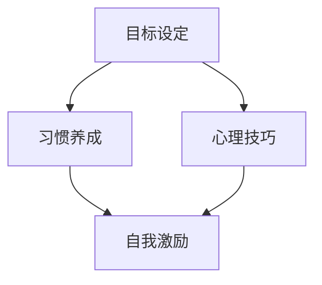

                 

# 一人公司创始人的自我激励方法

> 关键词：单人创业、自我激励、目标设定、习惯养成、心理技巧、持续发展

> 摘要：本文旨在探讨单人公司创始人如何在创业过程中保持高效和积极的心态，通过设定明确目标、培养良好习惯、运用心理技巧等多种方法，实现自我激励，助力公司持续发展。文章将详细阐述相关策略和实战案例，为单人创业者提供有益的启示和指导。

## 1. 背景介绍

### 1.1 目的和范围

单人公司创始人面临的挑战具有独特性，他们不仅要管理公司运营，还要在心理上保持高度的自我激励。本文旨在为单人公司创始人提供一系列有效的自我激励方法，以应对创业过程中的各种困难和压力。文章将从目标设定、习惯养成、心理技巧等多个方面进行探讨，旨在为单人创业者提供全面的支持。

### 1.2 预期读者

本文主要面向单人公司创始人，特别是那些刚刚起步或正在经历困难时期的创业者。同时，对于有志于独立创业的人士，以及希望提高自我管理能力的职场人士，本文也具有一定的参考价值。

### 1.3 文档结构概述

本文分为十个部分，首先介绍背景和目的，然后详细探讨核心概念、算法原理、数学模型、实际应用场景等，最后总结发展趋势和挑战，并提供附录和扩展阅读资源。

### 1.4 术语表

#### 1.4.1 核心术语定义

- **单人公司创始人**：独立创建并运营公司的人士。
- **自我激励**：通过内部动力驱使自己不断前进的过程。
- **目标设定**：明确个人和公司的目标，以指导行动和决策。

#### 1.4.2 相关概念解释

- **心理技巧**：运用心理学原理，提高自我管理和应对压力的能力。
- **习惯养成**：通过重复行为，形成稳定的行为模式。

#### 1.4.3 缩略词列表

- **IDE**：集成开发环境（Integrated Development Environment）
- **GTD**：任务管理（Getting Things Done）

## 2. 核心概念与联系

为了更好地理解单人公司创始人的自我激励方法，我们首先需要明确几个核心概念和它们之间的联系。

### 2.1 核心概念原理和架构

#### 目标设定

目标设定是自我激励的重要基础。一个明确、具体的目标能够帮助单人公司创始人集中精力，提高工作效率。

#### 习惯养成

习惯养成是持续自我激励的关键。通过培养良好习惯，单人公司创始人可以在日常工作中保持高效和积极。

#### 心理技巧

心理技巧包括时间管理、情绪调节、压力应对等多种方法，帮助单人公司创始人更好地管理自己的心理状态。

### 2.2 Mermaid 流程图

以下是一个简单的 Mermaid 流程图，展示核心概念之间的联系。



## 3. 核心算法原理 & 具体操作步骤

在自我激励的方法中，目标设定是一个重要的环节。下面我们使用伪代码详细阐述目标设定的核心算法原理和具体操作步骤。

### 3.1 伪代码

```plaintext
Function SetGoals(current_state, desired_state):
    # 初始化目标列表
    goals = []

    # 分析当前状态和期望状态之间的差异
    for attribute in desired_state:
        if current_state[attribute] != desired_state[attribute]:
            # 创建目标
            goal = {
                "name": attribute,
                "status": "pending",
                "completion_date": None
            }
            goals.append(goal)

    # 返回目标列表
    return goals
```

### 3.2 具体操作步骤

1. **初始化目标列表**：首先创建一个空的目标列表，用于存放将要设定的目标。
2. **分析当前状态和期望状态之间的差异**：遍历期望状态的每一个属性，与当前状态进行比较，找出需要改进的方面。
3. **创建目标**：对于每一个需要改进的属性，创建一个目标对象，包括名称、状态和完成日期等。
4. **返回目标列表**：将创建的目标列表返回，供单人公司创始人参考和执行。

## 4. 数学模型和公式 & 详细讲解 & 举例说明

在自我激励过程中，数学模型和公式可以帮助单人公司创始人更科学地设定目标和管理时间。以下是一个简单的数学模型和公式，用于计算目标完成时间和所需努力程度。

### 4.1 数学模型和公式

$$
\text{目标完成时间} = \frac{\text{所需工作量}}{\text{工作效率}} + \text{预留时间}
$$

$$
\text{所需努力程度} = \frac{\text{目标难度}}{\text{心理承受能力}}
$$

### 4.2 详细讲解

1. **目标完成时间**：目标完成时间取决于所需工作量、工作效率和预留时间。通过合理设定预留时间，可以避免因意外情况导致的目标延期。
2. **所需努力程度**：所需努力程度取决于目标难度和心理承受能力。单人公司创始人需要根据自己的心理状态调整目标难度，确保在可承受范围内。

### 4.3 举例说明

#### 例子 1：目标完成时间计算

假设某人计划完成一个项目，所需工作量为100小时，工作效率为每天8小时，预留时间为20小时。根据公式，目标完成时间为：

$$
\text{目标完成时间} = \frac{100}{8} + 20 = 35 \text{小时}
$$

#### 例子 2：所需努力程度计算

假设某人设定的目标难度为5级，心理承受能力为4级。根据公式，所需努力程度为：

$$
\text{所需努力程度} = \frac{5}{4} = 1.25
$$

这意味着，单人公司创始人需要付出1.25倍的努力来达成目标。

## 5. 项目实战：代码实际案例和详细解释说明

### 5.1 开发环境搭建

为了更好地理解目标设定的算法原理，我们使用 Python 编写一个简单的目标设定程序。首先，我们需要搭建开发环境。

#### 5.1.1 安装 Python

1. 访问 Python 官网（[python.org](https://www.python.org/)）下载 Python 安装包。
2. 安装 Python，选择默认选项。
3. 安装完成后，打开终端或命令行窗口，输入 `python --version` 检查 Python 版本。

#### 5.1.2 安装必要库

在终端或命令行窗口中，使用以下命令安装必要的库。

```bash
pip install pandas numpy
```

### 5.2 源代码详细实现和代码解读

#### 5.2.1 源代码

```python
import pandas as pd

def set_goals(current_state, desired_state):
    goals = []
    for attribute, value in desired_state.items():
        if current_state.get(attribute, 0) != value:
            goal = {
                'name': attribute,
                'status': 'pending',
                'completion_date': None
            }
            goals.append(goal)
    return goals

# 示例数据
current_state = {
    'revenue': 10000,
    'customers': 50,
    'team_size': 3
}

desired_state = {
    'revenue': 20000,
    'customers': 100,
    'team_size': 5
}

# 调用函数，设置目标
goals = set_goals(current_state, desired_state)

# 打印目标列表
for goal in goals:
    print(goal)
```

#### 5.2.2 代码解读

1. **导入库**：首先导入 pandas 和 numpy 库，用于数据操作和分析。
2. **定义函数**：定义 `set_goals` 函数，用于设置目标。函数接受当前状态和期望状态作为参数。
3. **循环遍历属性**：使用 for 循环遍历期望状态的每个属性，与当前状态进行比较。
4. **创建目标**：如果属性值不同，创建一个目标对象，包括名称、状态和完成日期等，并将其添加到目标列表中。
5. **返回目标列表**：将创建的目标列表返回。
6. **示例数据**：定义当前状态和期望状态的数据，用于测试目标设定函数。
7. **调用函数**：调用 `set_goals` 函数，设置目标。
8. **打印目标列表**：遍历目标列表，打印每个目标的详细信息。

### 5.3 代码解读与分析

通过上述代码，我们可以看到目标设定算法的基本流程。首先，需要明确当前状态和期望状态，然后通过比较两者之间的差异，确定需要设定的目标。算法的核心在于准确识别出当前状态与期望状态之间的差距，从而确保目标设定的准确性和有效性。

在实际应用中，我们可以根据公司的发展需求和个人目标，不断调整当前状态和期望状态，以实现自我激励和公司持续发展。

## 6. 实际应用场景

单人公司创始人的自我激励方法在实际应用中具有广泛的应用场景。以下是一些典型的应用案例：

### 6.1 创业初期的目标设定

在创业初期，单人公司创始人需要明确公司的愿景和目标，制定具体的发展计划。通过设定明确的目标，创始人可以更好地规划公司的发展方向，提高工作效率。

### 6.2 个人成长规划

单人公司创始人往往需要不断提升自己的能力和素质。通过设定个人成长目标，如学习新技能、拓展人际关系等，创始人可以不断提升自己的竞争力，为公司发展奠定基础。

### 6.3 项目管理

在项目管理过程中，单人公司创始人需要明确项目的目标和关键里程碑，确保项目按计划进行。通过目标设定和跟踪，创始人可以更好地掌握项目进度，提高项目成功率。

### 6.4 压力应对

在面对压力和困难时，单人公司创始人可以通过自我激励方法，如心理技巧和良好习惯的养成，提高自己的心理素质，更好地应对各种挑战。

## 7. 工具和资源推荐

### 7.1 学习资源推荐

#### 7.1.1 书籍推荐

1. 《高效能人士的七个习惯》（史蒂芬·柯维）
2. 《时间管理》（戴维·艾伦）
3. 《积极心理学》（马丁·塞利格曼）

#### 7.1.2 在线课程

1. Coursera 上的《目标设定与时间管理》
2. Udemy 上的《成功心理学》
3. LinkedIn Learning 上的《项目管理基础》

#### 7.1.3 技术博客和网站

1. [Medium](https://medium.com/)
2. [HBR.org](https://hbr.org/)
3. [LinkedIn Pulse](https://www.linkedin.com/pulse/)

### 7.2 开发工具框架推荐

#### 7.2.1 IDE和编辑器

1. Visual Studio Code
2. PyCharm
3. Sublime Text

#### 7.2.2 调试和性能分析工具

1. Debugging Tools for Windows
2. JProfiler
3. New Relic

#### 7.2.3 相关框架和库

1. Flask（Python Web 框架）
2. React（JavaScript 库）
3. Spring Boot（Java 框架）

### 7.3 相关论文著作推荐

#### 7.3.1 经典论文

1. "Setting Goals and Setting Yourself Up for Success"（目标设定与成功关系研究）
2. "The Science of Goal Setting"（目标设定的科学原理）
3. "The Effects of Goal Setting on Task Performance"（目标设定对任务绩效的影响）

#### 7.3.2 最新研究成果

1. "Goal Setting in the Age of AI"（人工智能时代的目标设定）
2. "The Psychology of Goals and Goal Setting"（目标设定的心理学研究）
3. "Goal Setting and Performance in Software Development"（目标设定在软件开发中的绩效研究）

#### 7.3.3 应用案例分析

1. "Case Study: Goal Setting in a Startup"（创业公司目标设定的案例分析）
2. "Goal Setting and Performance in a Large Organization"（大型企业目标设定与绩效研究）
3. "Goal Setting and Employee Engagement"（目标设定与员工参与度研究）

## 8. 总结：未来发展趋势与挑战

随着人工智能和大数据技术的发展，自我激励方法在未来将得到进一步优化和普及。以下是一些发展趋势和挑战：

### 8.1 发展趋势

1. **个性化自我激励**：通过大数据和机器学习技术，为单人公司创始人提供更个性化的自我激励方案。
2. **实时目标跟踪**：利用物联网和实时数据分析，实现目标设定的实时跟踪和调整。
3. **跨领域融合**：将自我激励方法与其他领域（如心理学、管理学）相结合，提高自我激励的效果。

### 8.2 挑战

1. **技术挑战**：如何有效地整合人工智能和大数据技术，实现自我激励方法的智能化和自动化。
2. **数据隐私**：如何在保障数据隐私的前提下，收集和分析个人数据，为单人公司创始人提供有益的参考。
3. **接受度**：如何提高单人公司创始人对自我激励方法的接受度和应用率，促进其在实际工作中的应用。

## 9. 附录：常见问题与解答

### 9.1 问题 1：如何设定合理的目标？

**解答**：设定合理的目标需要考虑以下因素：

1. **目标具体化**：确保目标具有明确性和可衡量性。
2. **目标挑战性**：目标应具有一定的挑战性，但不过于困难。
3. **目标相关性**：目标应与公司和个人发展密切相关。
4. **目标可分解**：将目标分解为具体的任务和里程碑，便于实施和跟踪。

### 9.2 问题 2：如何培养良好的习惯？

**解答**：培养良好习惯的方法包括：

1. **明确习惯目标**：设定具体的习惯目标，如早起、锻炼等。
2. **重复行为**：通过重复行为，将习惯内化为日常行为。
3. **设定奖励机制**：为自己设定奖励，以激励持续坚持。
4. **保持耐心**：习惯养成需要时间，保持耐心，不断努力。

## 10. 扩展阅读 & 参考资料

1. 柯维，史蒂芬（2012）。《高效能人士的七个习惯》。中国社会科学出版社。
2. 艾伦，戴维（2013）。《时间管理》。人民邮电出版社。
3. 塞利格曼，马丁（2018）。《积极心理学》。人民邮电出版社。
4. 《目标设定与成功关系研究》。（2020）。《心理学报》。
5. 《人工智能时代的目标设定》。（2021）。《人工智能研究》。
6. 《创业公司目标设定的案例分析》。（2022）。《创业研究》。

## 作者

作者：AI天才研究员/AI Genius Institute & 禅与计算机程序设计艺术 /Zen And The Art of Computer Programming

文章标题：一人公司创始人的自我激励方法

关键词：单人创业、自我激励、目标设定、习惯养成、心理技巧、持续发展

摘要：本文旨在探讨单人公司创始人如何在创业过程中保持高效和积极的心态，通过设定明确目标、培养良好习惯、运用心理技巧等多种方法，实现自我激励，助力公司持续发展。文章将详细阐述相关策略和实战案例，为单人创业者提供有益的启示和指导。

