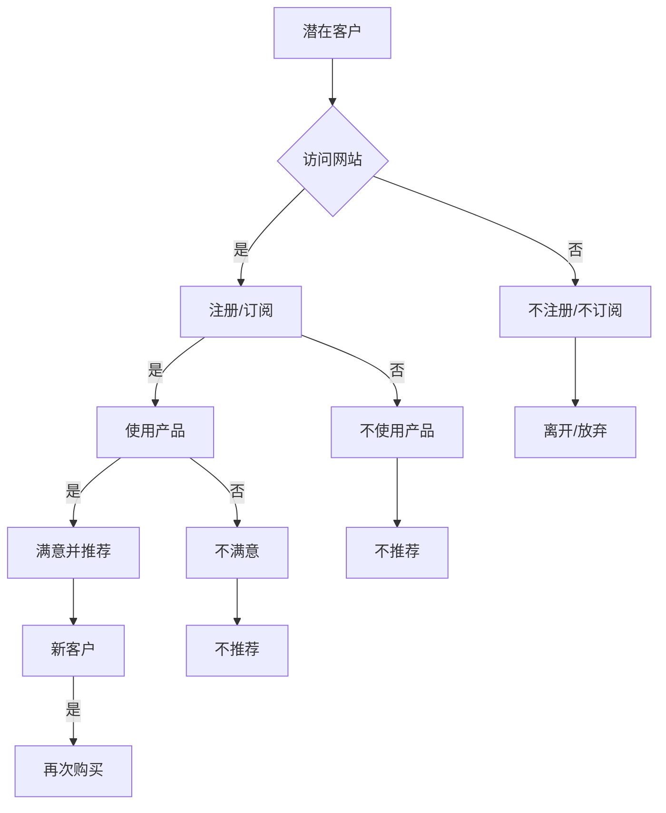
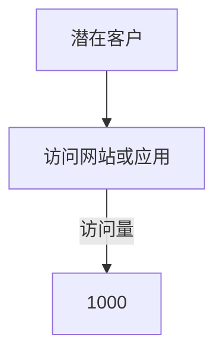
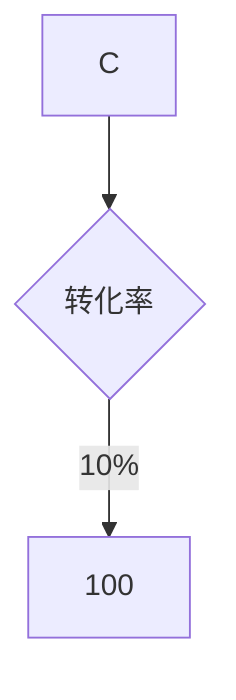
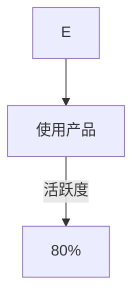
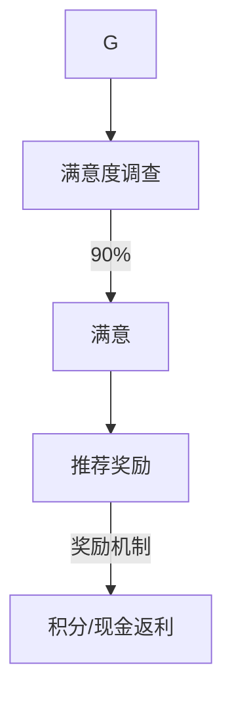
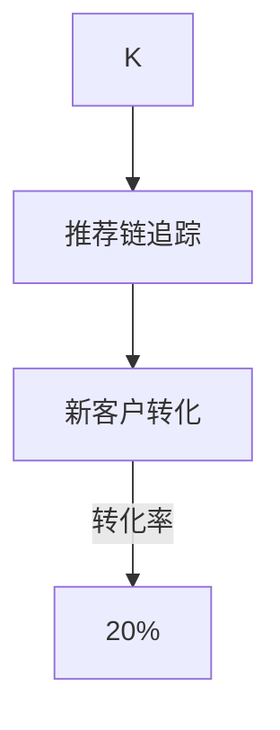
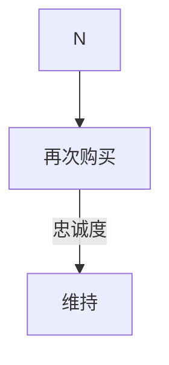

                 

# 一人公司如何利用Referral Marketing扩大客户群

> 关键词：一人公司、Referral Marketing、客户群、营销策略、客户拓展

> 摘要：本文旨在探讨一人公司如何利用Referral Marketing策略有效扩大客户群。通过详细解析Referral Marketing的概念、原理、执行步骤及案例分析，旨在为读者提供一套实用可行的策略指南。

## 1. 背景介绍

### 1.1 目的和范围

本文的目标是帮助一人公司，尤其是初创公司和独立创业者，了解并运用Referral Marketing策略，从而在资源有限的情况下，实现客户群的快速扩张。文章将围绕以下几个方面展开讨论：

- Referral Marketing的定义和核心概念
- 一人公司实施Referral Marketing的优势
- Referral Marketing的策略和执行步骤
- 实际案例分析和效果评估
- 营销工具和资源推荐

### 1.2 预期读者

本文适合以下读者群体：

- 初创公司创始人
- 独立创业者
- 一人公司的运营者
- 对营销策略和客户拓展感兴趣的从业者

### 1.3 文档结构概述

本文结构分为以下几个部分：

- 背景介绍：介绍文章目的、范围和预期读者
- 核心概念与联系：解释Referral Marketing的基本原理和流程
- 核心算法原理与具体操作步骤：详细阐述Referral Marketing的执行过程
- 数学模型和公式：介绍相关数学模型，并给出具体例子
- 项目实战：提供实际的代码案例和解释
- 实际应用场景：探讨Referral Marketing在不同行业中的应用
- 工具和资源推荐：推荐学习资源和开发工具
- 总结：对Referral Marketing的未来发展趋势和挑战进行总结
- 附录：常见问题与解答
- 扩展阅读与参考资料：提供更多深入的阅读材料和资源

### 1.4 术语表

#### 1.4.1 核心术语定义

- **Referral Marketing**：一种通过现有客户或用户的推荐来吸引新客户的方法。
- **一人公司**：指由单一个体经营的公司，通常资源有限。
- **推荐机制**：激励现有用户推荐新客户的机制，如奖励、积分等。
- **客户生命周期价值（CLV）**：客户在整个生命周期内为公司带来的总价值。

#### 1.4.2 相关概念解释

- **用户留存率**：指在一定时间内，保持使用产品的用户比例。
- **转化率**：指用户从访客到实际购买或完成特定动作的比例。
- **推荐链**：从推荐者到被推荐者之间的互动过程。

#### 1.4.3 缩略词列表

- **CRM**：Customer Relationship Management，客户关系管理。
- **LTV**：Life Time Value，生命周期价值。
- **ROI**：Return on Investment，投资回报率。

## 2. 核心概念与联系

在深入探讨Referral Marketing之前，我们需要理解其核心概念和流程。以下是一个使用Mermaid绘制的Referral Marketing流程图：



### 2.1 Referral Marketing的概念

Referral Marketing是一种基于用户口碑和人际网络的营销策略。其核心思想是通过现有客户或用户的推荐，吸引潜在客户。这种方法利用了人际信任和推荐的力量，通常比传统的广告和促销活动更有效。

### 2.2 Referral Marketing的优势

对于一人公司来说，Referral Marketing具有以下几个显著优势：

- **低成本**：相对于广告和促销活动，Referral Marketing的成本较低，尤其是在资源有限的情况下。
- **高效果**：推荐往往基于真实的用户体验，因此新客户的转化率和忠诚度较高。
- **可持续性**：一旦建立起有效的推荐机制，客户推荐将形成一个可持续的流量来源。

### 2.3 Referral Marketing的基本流程

Referral Marketing的基本流程可以分为以下几个步骤：

1. **收集潜在客户**：通过各种渠道吸引潜在客户访问网站或应用。
2. **转化潜在客户**：通过提供有价值的内容或服务，促使潜在客户注册或订阅。
3. **客户使用产品**：让客户实际使用产品，以收集他们的反馈。
4. **激励推荐**：对于满意并愿意推荐的用户，提供奖励或激励措施。
5. **新客户转化**：通过推荐者的推荐，吸引新客户，并促使他们完成购买或使用。
6. **再次购买与忠诚度**：鼓励新客户再次购买，并保持长期忠诚。

通过以上核心概念和流程的理解，我们可以进一步探讨Referral Marketing的算法原理和具体操作步骤。

## 3. 核心算法原理 & 具体操作步骤

### 3.1 算法原理

Referral Marketing的核心算法原理可以概括为以下几点：

- **用户留存率计算**：通过分析用户在产品内的活跃度，计算用户的留存率。
- **推荐奖励机制设计**：设计合适的推荐奖励机制，以激励用户推荐。
- **推荐链追踪与奖励分配**：追踪推荐链的每个节点，并按规则分配奖励。

### 3.2 具体操作步骤

以下是Referral Marketing的具体操作步骤：

#### 步骤1：收集潜在客户



在这个步骤中，我们通过各种渠道（如广告、社交媒体等）吸引潜在客户访问网站或应用。

#### 步骤2：转化潜在客户



通过提供有价值的内容或服务，促使潜在客户注册或订阅。假设访问量为1000，转化率为10%，则转化为注册或订阅的用户数为100。

#### 步骤3：客户使用产品



让客户实际使用产品，并计算他们的活跃度。在本例中，活跃度为80%，即有80个用户持续使用产品。

#### 步骤4：激励推荐



对满意并愿意推荐的用户，提供奖励。例如，可以设计一个积分系统，用户每成功推荐一位新用户，就能获得一定的积分。积分可以在未来的购买中抵扣。

#### 步骤5：新客户转化



通过推荐链追踪，吸引新客户。假设每次推荐链中有5个节点，新客户的转化率为20%，则通过推荐吸引的新客户数为4。

#### 步骤6：再次购买与忠诚度



鼓励新客户再次购买，并保持长期忠诚。通过积分、折扣或其他激励措施，提高客户的重复购买率。

通过以上步骤，一人公司可以逐步扩大客户群，并实现可持续的业务增长。

## 4. 数学模型和公式 & 详细讲解 & 举例说明

### 4.1 数学模型

在Referral Marketing中，常用的数学模型包括用户留存率模型和推荐奖励模型。以下是这些模型的详细解释和公式。

#### 4.1.1 用户留存率模型

用户留存率是衡量用户对产品满意度和持续使用意愿的重要指标。以下是一个简单的用户留存率模型：

\[ R(t) = \frac{N(t) - N_0(t)}{N_0(t)} \]

其中：
- \( R(t) \)：t时间后的用户留存率
- \( N(t) \)：t时间后继续使用产品的用户数
- \( N_0(t) \)：初始注册或订阅的用户数

#### 4.1.2 推荐奖励模型

推荐奖励模型用于计算推荐者应获得的奖励。以下是一个简单的推荐奖励模型：

\[ E = \frac{R \times C}{100} \]

其中：
- \( E \)：推荐者应获得的奖励金额
- \( R \)：每推荐一位新用户，推荐者能获得的积分或奖励点数
- \( C \)：公司设定的兑换比例，即每点奖励能兑换的现金或折扣金额

### 4.2 举例说明

#### 4.2.1 用户留存率模型举例

假设一个产品在一个月后的用户留存率为80%，初始注册用户数为1000。我们可以计算一个月后的留存用户数：

\[ R(t) = \frac{N(t) - N_0(t)}{N_0(t)} = 0.8 \]

\[ N(t) = R(t) \times N_0(t) = 0.8 \times 1000 = 800 \]

因此，一个月后继续使用产品的用户数为800。

#### 4.2.2 推荐奖励模型举例

假设公司设定每推荐一位新用户，推荐者能获得200积分。公司设定的兑换比例为每100积分兑换1元现金。如果推荐者成功推荐了5位新用户，我们可以计算其应获得的奖励金额：

\[ E = \frac{R \times C}{100} = \frac{200 \times 1}{100} = 2 \]

因此，推荐者应获得的奖励金额为2元。

通过以上数学模型和举例说明，我们可以更准确地评估和优化Referral Marketing策略，以实现更好的业务效果。

## 5. 项目实战：代码实际案例和详细解释说明

### 5.1 开发环境搭建

在开始编写代码之前，我们需要搭建一个合适的开发环境。以下是一个简单的Python环境搭建步骤：

1. 安装Python：从官方网站下载并安装Python 3.x版本。
2. 安装IDE：推荐使用PyCharm或VS Code作为开发环境。
3. 安装依赖库：使用pip工具安装必要的依赖库，如requests、pandas等。

### 5.2 源代码详细实现和代码解读

以下是Referral Marketing策略的一个简单Python代码实现：

```python
import random
import pandas as pd

# 用户留存率计算
def calculate_retention_rate(registered_users, active_users):
    return (active_users / registered_users) * 100

# 推荐奖励计算
def calculate_referral_reward(recommendations, exchange_rate):
    return recommendations * exchange_rate

# 模拟用户推荐过程
def simulate_referral_process(registered_users, active_rate, recommendations_per_user, exchange_rate):
    # 计算活跃用户数
    active_users = int(registered_users * active_rate / 100)
    
    # 计算推荐链节点数
    nodes = registered_users // recommendations_per_user
    
    # 计算推荐奖励
    reward = calculate_referral_reward(recommendations_per_user, exchange_rate)
    
    # 计算留存用户数
    retained_users = active_users
    
    for node in range(nodes):
        # 每个节点推荐一个新用户
        retained_users += recommendations_per_user
    
    # 返回结果
    return {
        'registered_users': registered_users,
        'active_users': active_users,
        'retained_users': retained_users,
        'reward': reward
    }

# 参数设置
registered_users = 1000
active_rate = 80
recommendations_per_user = 5
exchange_rate = 1  # 每个推荐5积分，100积分兑换1元

# 运行模拟过程
result = simulate_referral_process(registered_users, active_rate, recommendations_per_user, exchange_rate)

# 输出结果
print("Registered Users:", result['registered_users'])
print("Active Users:", result['active_users'])
print("Retained Users:", result['retained_users'])
print("Total Reward:", result['reward'])
```

### 5.3 代码解读与分析

- **用户留存率计算**：`calculate_retention_rate`函数用于计算用户留存率，输入参数为注册用户数和活跃用户数，返回值为留存率。
- **推荐奖励计算**：`calculate_referral_reward`函数用于计算推荐奖励，输入参数为每个用户的推荐积分和兑换比例，返回值为总奖励金额。
- **模拟用户推荐过程**：`simulate_referral_process`函数模拟用户推荐过程。首先计算活跃用户数，然后计算推荐链的节点数。每个节点代表一个推荐过程，每个节点推荐一个新用户。最后计算留存用户数和总奖励金额。

通过这个简单的代码实现，我们可以模拟Referral Marketing策略的效果。在实际应用中，可以根据具体业务需求进行调整和优化。

## 6. 实际应用场景

Referral Marketing策略在多个行业和场景中都有着广泛的应用。以下是一些典型的实际应用场景：

### 6.1 SaaS行业

SaaS（Software as a Service）公司经常使用Referral Marketing策略来扩大用户群。通过提供推荐奖励，激励现有用户推荐新用户，从而降低获取新客户的成本。

### 6.2 电商行业

电商公司通过Referral Marketing策略，鼓励用户分享商品链接到社交媒体，吸引新客户。这种方式不仅降低了广告成本，还增加了用户的购买意愿。

### 6.3 教育行业

在线教育平台通过Referral Marketing策略，激励用户推荐课程给朋友和家人，从而增加课程的知名度和用户参与度。

### 6.4 金融行业

金融公司通过Referral Marketing策略，鼓励用户推荐新用户开户或购买理财产品，从而提高客户留存率和资产规模。

### 6.5 医疗行业

医疗公司通过Referral Marketing策略，激励医生和患者推荐新的医疗服务或药品，从而提高品牌知名度和市场份额。

在上述实际应用场景中，Referral Marketing策略都发挥了重要作用，帮助公司实现客户群的快速扩张和业务增长。

## 7. 工具和资源推荐

### 7.1 学习资源推荐

为了更深入地了解Referral Marketing策略，以下是一些推荐的书籍、在线课程和技术博客：

#### 7.1.1 书籍推荐

- **《营销管理》（Philip Kotler著）**：全面介绍了各种营销策略，包括Referral Marketing。
- **《增长黑客》（Sean Ellis著）**：详细探讨了如何利用数据和技术实现用户增长。

#### 7.1.2 在线课程

- **Coursera上的《增长黑客导论》**：由增长黑客创始人Sean Ellis亲自授课，涵盖用户增长的各种策略。
- **Udemy上的《营销策略实战》**：通过实际案例讲解各种营销策略，包括Referral Marketing。

#### 7.1.3 技术博客和网站

- **增长黑客官网**：提供最新的增长黑客技术和案例分享。
- **营销博客**：如HubSpot博客、MarketingProfs等，涵盖各种营销策略和案例。

### 7.2 开发工具框架推荐

以下是一些在Referral Marketing策略实施过程中常用的开发工具和框架：

#### 7.2.1 IDE和编辑器

- **PyCharm**：强大的Python IDE，支持代码调试和自动化测试。
- **VS Code**：功能丰富的跨平台代码编辑器，适用于各种编程语言。

#### 7.2.2 调试和性能分析工具

- **Postman**：API调试工具，用于测试和验证API接口。
- **New Relic**：性能监控和分析工具，帮助识别和优化系统性能瓶颈。

#### 7.2.3 相关框架和库

- **Flask**：轻量级的Web应用框架，适用于构建Referral Marketing的后端服务。
- **Scrapy**：网络爬虫框架，用于从各种网站抓取数据。

### 7.3 相关论文著作推荐

以下是一些与Referral Marketing相关的经典论文和最新研究成果：

#### 7.3.1 经典论文

- **"The Economics of Networks"（1998）**：对网络效应和口碑传播的经济学分析。
- **"Word of Mouth and New Product Adoption"（2002）**：研究口碑传播对新产品采纳的影响。

#### 7.3.2 最新研究成果

- **"Recommending Items through Social Networks"（2017）**：利用社交网络数据进行个性化推荐的研究。
- **"The Role of Social Networks in Viral Marketing"（2020）**：探讨社交网络在病毒营销中的作用。

#### 7.3.3 应用案例分析

- **"Facebook的增长策略"**：详细分析Facebook如何利用社交网络和用户推荐实现快速增长。
- **"Airbnb的Referral Program"**：研究Airbnb如何通过推荐策略吸引新用户，提高市场份额。

通过以上工具、资源和论文的推荐，读者可以更全面地了解Referral Marketing策略，并在实际业务中加以应用。

## 8. 总结：未来发展趋势与挑战

Referral Marketing作为一种高效的客户拓展策略，在未来将继续发展，并在多个方面面临新的机遇和挑战。

### 8.1 发展趋势

1. **个性化推荐**：随着大数据和人工智能技术的发展，Referral Marketing将更加注重个性化推荐，根据用户的兴趣和行为，提供更精准的推荐。
2. **社交网络整合**：越来越多的公司会将Referral Marketing与社交媒体平台深度整合，通过社交网络扩大推荐范围和影响力。
3. **数据驱动**：数据将成为Referral Marketing的核心驱动力，通过对用户行为数据的深入分析，优化推荐策略和提高转化率。

### 8.2 挑战

1. **隐私保护**：随着全球范围内对用户隐私的关注增加，如何在遵守隐私法规的前提下实施Referral Marketing将成为一大挑战。
2. **推荐质量**：如何确保推荐的质量，避免推荐虚假信息或低质量产品，是一个需要持续关注的问题。
3. **用户疲劳**：长期依赖推荐营销可能会导致用户疲劳，因此如何平衡推荐频率和质量，保持用户的活跃度，是一个重要的挑战。

### 8.3 应对策略

1. **合规性**：严格遵守相关隐私保护法规，确保推荐活动合规。
2. **技术创新**：利用大数据和人工智能技术，提高推荐系统的精准度和效率。
3. **用户体验**：注重用户体验，避免过度推荐，提供有价值的信息和服务。

通过应对上述趋势和挑战，一人公司可以在Referral Marketing领域持续创新，实现客户群的快速增长。

## 9. 附录：常见问题与解答

### 9.1 Referral Marketing的基本问题

**Q1**：什么是Referral Marketing？

Referral Marketing是一种通过现有客户或用户的推荐来吸引新客户的方法，利用人际信任和口碑效应，实现客户群的快速增长。

**Q2**：Referral Marketing的优势是什么？

Referral Marketing的优势包括低成本、高效果和可持续性。通过利用现有用户的口碑和推荐，可以降低获取新客户的成本，提高转化率和客户忠诚度。

**Q3**：如何设计一个有效的Referral Marketing策略？

设计一个有效的Referral Marketing策略需要考虑以下几个方面：

- 确定目标客户群体
- 设计合理的推荐奖励机制
- 选择合适的推荐渠道
- 跟踪和分析推荐效果
- 不断优化和调整策略

### 9.2 实施过程中的问题

**Q4**：如何确保推荐的质量？

确保推荐的质量可以从以下几个方面入手：

- 对推荐者进行筛选和认证
- 对推荐内容进行审核和监控
- 提供高质量的产品和服务，确保用户满意度
- 建立负面反馈机制，及时处理用户投诉和问题

**Q5**：如何防止推荐链中的欺诈行为？

防止推荐链中的欺诈行为可以通过以下措施实现：

- 对推荐者进行实名认证
- 设置合理的推荐奖励上限
- 对推荐过程进行监控和数据分析，识别异常行为
- 建立举报和处罚机制，对欺诈行为进行严厉打击

### 9.3 数据隐私问题

**Q6**：如何在遵守隐私法规的前提下实施Referral Marketing？

在遵守隐私法规的前提下实施Referral Marketing，需要注意以下几个方面：

- 明确用户隐私政策，确保用户知情同意
- 严格限制数据的收集和使用范围
- 定期进行隐私风险评估和审计
- 遵守相关法律法规，如GDPR、CCPA等

通过以上常见问题的解答，希望读者能够更好地理解Referral Marketing的策略和实施方法。

## 10. 扩展阅读 & 参考资料

### 10.1 相关书籍

- **《增长黑客》（Sean Ellis著）**：详细探讨用户增长的各种策略，包括Referral Marketing。
- **《营销管理》（Philip Kotler著）**：全面介绍各种营销策略，包括Referral Marketing的理论和实践。

### 10.2 在线课程

- **Coursera上的《增长黑客导论》**：由增长黑客创始人Sean Ellis亲自授课，涵盖用户增长的各种策略。
- **Udemy上的《营销策略实战》**：通过实际案例讲解各种营销策略，包括Referral Marketing。

### 10.3 技术博客和网站

- **增长黑客官网**：提供最新的增长黑客技术和案例分享。
- **营销博客**：如HubSpot博客、MarketingProfs等，涵盖各种营销策略和案例。

### 10.4 相关论文

- **"The Economics of Networks"（1998）**：对网络效应和口碑传播的经济学分析。
- **"Word of Mouth and New Product Adoption"（2002）**：研究口碑传播对新产品采纳的影响。

### 10.5 应用案例分析

- **"Facebook的增长策略"**：详细分析Facebook如何利用社交网络和用户推荐实现快速增长。
- **"Airbnb的Referral Program"**：研究Airbnb如何通过推荐策略吸引新用户，提高市场份额。

通过以上扩展阅读和参考资料，读者可以更深入地了解Referral Marketing的理论和实践，从而在实际业务中更好地应用这一策略。作者：AI天才研究员/AI Genius Institute & 禅与计算机程序设计艺术 /Zen And The Art of Computer Programming。

